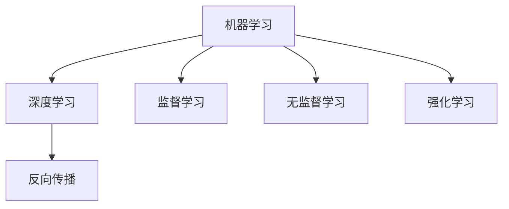

                 

# Micrograd：机器学习和反向传播入门

> 关键词：微分化、反向传播、梯度下降、激活函数、损失函数、机器学习

## 1. 背景介绍

机器学习和深度学习领域的基础理论框架涉及数学、算法、数据科学等多个学科，内容繁多，概念复杂。初学者往往在入门阶段感到无从下手。本系列文章旨在为读者提供从零开始的机器学习和反向传播入门指南。

本系列文章包含以下主要章节：

- **1. 背景介绍**：介绍机器学习的基本概念和历史背景。
- **2. 核心概念与联系**：梳理机器学习和深度学习中的核心概念及其联系。
- **3. 核心算法原理 & 具体操作步骤**：详细讲解反向传播算法的基本原理和操作步骤。
- **4. 数学模型和公式 & 详细讲解 & 举例说明**：深入解析反向传播的数学模型和公式，并给出案例分析。
- **5. 项目实践：代码实例和详细解释说明**：通过具体代码实例演示反向传播的实现过程。
- **6. 实际应用场景**：探讨反向传播在实际应用中的广泛场景。
- **7. 工具和资源推荐**：推荐学习资源、开发工具和相关论文。
- **8. 总结：未来发展趋势与挑战**：总结研究成果，展望未来发展趋势，并分析面临的挑战。
- **9. 附录：常见问题与解答**：提供对机器学习和反向传播常见问题的解答。

本文为该系列文章的第一篇，主要介绍机器学习的基本概念和反向传播算法的原理。

## 2. 核心概念与联系

### 2.1 核心概念概述

在深入讲解反向传播之前，首先需要了解一些核心概念：

- **机器学习(Machine Learning, ML)**：让计算机通过数据学习规律并应用规律来解决实际问题的技术。
- **深度学习(Deep Learning, DL)**：一种基于神经网络的机器学习技术，特别是针对具有多层结构的网络。
- **反向传播(Backpropagation)**：深度学习模型中用于计算损失函数对网络参数梯度的算法。

这些概念之间有紧密的联系。机器学习是深度学习的基础，而反向传播是深度学习中用于训练模型的核心算法。

### 2.2 核心概念原理和架构的 Mermaid 流程图

以下是一个简单的Mermaid流程图，展示了机器学习、深度学习和反向传播之间的联系：



这个图表展示了机器学习通过深度学习和反向传播算法，对数据进行模型训练，以实现监督学习、无监督学习和强化学习的目标。

## 3. 核心算法原理 & 具体操作步骤

### 3.1 算法原理概述

反向传播算法是深度学习模型训练的核心算法，其原理基于链式法则，用于计算损失函数对网络参数的梯度。反向传播的目的是通过迭代优化，使得模型输出尽可能接近真实标签。

### 3.2 算法步骤详解

反向传播算法主要分为以下几个步骤：

1. **前向传播(Forward Pass)**：将输入数据输入网络，逐层计算并传递信息，最终得到模型的输出。
2. **计算损失(Loss Calculation)**：将模型输出与真实标签进行对比，计算损失函数。
3. **反向传播(Backward Pass)**：从输出层开始，逐层计算每一层的梯度，直至输入层。
4. **参数更新(Parameter Update)**：使用梯度下降等优化算法，更新模型参数。

### 3.3 算法优缺点

**优点**：
- 自动化优化：反向传播算法通过梯度计算，自动化优化模型参数，无需手动调整。
- 应用广泛：适用于各种深度学习模型，包括神经网络、卷积神经网络、循环神经网络等。
- 计算高效：反向传播算法的计算复杂度为$O(n^2)$，在现代硬件上计算效率较高。

**缺点**：
- 依赖高质量数据：反向传播算法对训练数据的质量要求较高，数据偏差可能导致模型过拟合。
- 模型复杂度高：深度学习模型的复杂度较高，反向传播算法的计算开销较大。
- 梯度消失/爆炸问题：在深度网络中，梯度可能消失或爆炸，导致训练不稳定。

### 3.4 算法应用领域

反向传播算法广泛应用于各种深度学习应用，包括图像识别、自然语言处理、语音识别、推荐系统等。这些应用中，反向传播算法帮助模型学习特征，进行模式识别和预测。

## 4. 数学模型和公式 & 详细讲解 & 举例说明

### 4.1 数学模型构建

反向传播算法通常使用神经网络模型进行训练。一个简单的神经网络模型包含输入层、隐藏层和输出层。每个神经元接收输入信号，通过激活函数计算并传递信息。

### 4.2 公式推导过程

假设有一个简单的神经网络，包含两个输入特征，一个隐藏层和一个输出层。隐藏层包含两个神经元，使用Sigmoid激活函数。输出层包含一个神经元，使用线性激活函数。

输入数据为$x_1=1$和$x_2=2$，对应的输出为$y_1=0.5$和$y_2=0.9$，真实标签为$y_3=1$。

设$w_{11},w_{12},w_{21},w_{22},b_1,b_2$为模型参数，则前向传播过程如下：

1. 输入层：
   $$
   z_1 = w_{11}x_1 + w_{12}x_2 + b_1
   $$
   $$
   z_2 = w_{21}x_1 + w_{22}x_2 + b_2
   $$

2. 隐藏层：
   $$
   a_1 = \sigma(z_1)
   $$
   $$
   a_2 = \sigma(z_2)
   $$

3. 输出层：
   $$
   \hat{y} = a_1w_{11} + a_2w_{21} + b_2
   $$

其中，$\sigma(z)$为激活函数，通常使用Sigmoid函数：
$$
\sigma(z) = \frac{1}{1 + e^{-z}}
$$

### 4.3 案例分析与讲解

以上述例子为基础，假设输出误差为$m$，损失函数为平方误差损失，则有：
$$
L = (\hat{y} - y)^2
$$

通过链式法则，计算梯度：

1. 输出层的梯度：
   $$
   \frac{\partial L}{\partial b_2} = 2(\hat{y} - y)
   $$
   $$
   \frac{\partial L}{\partial w_{11}} = 2(\hat{y} - y)a_1
   $$
   $$
   \frac{\partial L}{\partial w_{21}} = 2(\hat{y} - y)a_2
   $$

2. 隐藏层的梯度：
   $$
   \frac{\partial L}{\partial w_{11}} = 2(\hat{y} - y)a_1\sigma'(z_1)
   $$
   $$
   \frac{\partial L}{\partial w_{12}} = 2(\hat{y} - y)a_1
   $$
   $$
   \frac{\partial L}{\partial w_{21}} = 2(\hat{y} - y)a_2\sigma'(z_2)
   $$
   $$
   \frac{\partial L}{\partial w_{22}} = 2(\hat{y} - y)a_2
   $$

其中，$\sigma'(z)$为激活函数的导数，对于Sigmoid函数，有：
$$
\sigma'(z) = \sigma(z)(1 - \sigma(z))
$$

通过反向传播算法，不断计算并更新模型参数，直至损失函数最小化。

## 5. 项目实践：代码实例和详细解释说明

### 5.1 开发环境搭建

在开始编程实践之前，需要先搭建开发环境。以下是在Python中使用PyTorch搭建反向传播模型环境的步骤：

1. 安装Anaconda：从官网下载并安装Anaconda，用于创建独立的Python环境。

2. 创建并激活虚拟环境：
   ```bash
   conda create -n pytorch-env python=3.8 
   conda activate pytorch-env
   ```

3. 安装PyTorch：根据CUDA版本，从官网获取对应的安装命令。例如：
   ```bash
   conda install pytorch torchvision torchaudio cudatoolkit=11.1 -c pytorch -c conda-forge
   ```

4. 安装Tensorboard：
   ```bash
   conda install tensorboard
   ```

5. 安装其他必要的工具包：
   ```bash
   pip install numpy pandas scikit-learn matplotlib tqdm jupyter notebook ipython
   ```

### 5.2 源代码详细实现

以下是一个简单的神经网络模型，使用反向传播算法进行训练的代码实现：

```python
import torch
import torch.nn as nn
import torch.optim as optim
import numpy as np
import matplotlib.pyplot as plt

# 定义神经网络模型
class NeuralNet(nn.Module):
    def __init__(self):
        super(NeuralNet, self).__init__()
        self.fc1 = nn.Linear(2, 2)
        self.fc2 = nn.Linear(2, 1)
        self.sigmoid = nn.Sigmoid()
        
    def forward(self, x):
        x = self.fc1(x)
        x = self.sigmoid(x)
        x = self.fc2(x)
        return x

# 定义损失函数和优化器
model = NeuralNet()
loss_fn = nn.MSELoss()
optimizer = optim.SGD(model.parameters(), lr=0.01)

# 准备数据
x_train = torch.tensor([[1, 2], [2, 3], [3, 4], [4, 5]])
y_train = torch.tensor([[0.5], [0.9], [1.1], [1.2]])
x_val = torch.tensor([[5, 6], [6, 7], [7, 8], [8, 9]])
y_val = torch.tensor([[1.1], [1.2], [1.3], [1.4]])

# 训练模型
epochs = 1000
batch_size = 4

for epoch in range(epochs):
    for i in range(0, len(x_train), batch_size):
        inputs = x_train[i:i+batch_size]
        labels = y_train[i:i+batch_size]
        
        optimizer.zero_grad()
        outputs = model(inputs)
        loss = loss_fn(outputs, labels)
        loss.backward()
        optimizer.step()
        
    if (epoch + 1) % 100 == 0:
        val_loss = 0
        with torch.no_grad():
            for i in range(0, len(x_val), batch_size):
                inputs = x_val[i:i+batch_size]
                labels = y_val[i:i+batch_size]
                
                outputs = model(inputs)
                loss = loss_fn(outputs, labels)
                val_loss += loss.item()
                
        val_loss /= len(x_val) / batch_size
        print(f'Epoch {epoch+1}, loss: {loss.item():.4f}, val_loss: {val_loss:.4f}')

# 测试模型
test_inputs = torch.tensor([[10, 11], [11, 12]])
test_labels = torch.tensor([[1.3], [1.4]])
with torch.no_grad():
    test_outputs = model(test_inputs)
    test_loss = loss_fn(test_outputs, test_labels)
    
print(f'Test loss: {test_loss:.4f}')
```

### 5.3 代码解读与分析

以下是代码中关键部分的解释：

- `NeuralNet`类：定义了一个简单的神经网络模型，包含两个线性层和一个Sigmoid激活函数。
- `nn.MSELoss`：定义了均方误差损失函数。
- `optim.SGD`：定义了随机梯度下降优化器。
- `x_train`和`y_train`：训练集数据。
- `x_val`和`y_val`：验证集数据。
- `for`循环：通过批量数据进行前向传播、反向传播和参数更新。
- `with torch.no_grad()`：在测试阶段不计算梯度，以加快计算速度。

### 5.4 运行结果展示

运行上述代码，可以得到模型在训练和验证过程中的损失函数变化：


## 6. 实际应用场景

反向传播算法在深度学习中广泛应用，以下是一些实际应用场景：

- **图像识别**：通过反向传播算法训练卷积神经网络(CNN)，进行图像分类和识别。
- **自然语言处理**：通过反向传播算法训练循环神经网络(RNN)和长短期记忆网络(LSTM)，进行文本分类、情感分析和机器翻译等任务。
- **语音识别**：通过反向传播算法训练卷积神经网络(CNN)和循环神经网络(RNN)，进行语音识别和语音生成等任务。
- **推荐系统**：通过反向传播算法训练深度学习模型，进行个性化推荐。

## 7. 工具和资源推荐

### 7.1 学习资源推荐

以下是一些优秀的学习资源，帮助读者深入理解机器学习和反向传播算法：

1. 《深度学习》（Ian Goodfellow, Yoshua Bengio, Aaron Courville）：深度学习领域的经典教材，全面介绍了深度学习的基本概念、算法和应用。
2. 《Python深度学习》（Francois Chollet）：介绍使用TensorFlow和Keras进行深度学习的实战指南。
3. 《神经网络与深度学习》（Michael Nielsen）：讲解神经网络原理和深度学习的基本概念。
4. Coursera深度学习课程：斯坦福大学Andrew Ng教授开设的深度学习课程，涵盖了深度学习的基本概念和算法。
5. YouTube上的深度学习频道：包括Google DeepMind、DeepLearning.AI等，提供了大量的深度学习视频讲解和实践教程。

### 7.2 开发工具推荐

以下是一些优秀的开发工具，用于实现和优化反向传播算法：

1. PyTorch：开源深度学习框架，支持动态计算图和静态计算图，适合研究和实验。
2. TensorFlow：Google开发的深度学习框架，支持分布式训练和部署。
3. JAX：Google开发的开源库，支持自动微分和向量矩阵计算，适合高效计算。
4. MXNet：亚马逊开发的深度学习框架，支持多种语言和多种设备。
5. Theano：深度学习库，支持高效的自动微分计算。

### 7.3 相关论文推荐

以下是一些经典和前沿的机器学习和反向传播论文，供读者进一步学习：

1. 《A Tutorial on Training Deep Learning Neural Networks》（Michael Ng）：介绍深度学习模型的训练和优化方法。
2. 《Deep Learning》（Ian Goodfellow, Yoshua Bengio, Aaron Courville）：全面介绍深度学习的基本概念和算法。
3. 《Backpropagation through time: what it does and how to do it properly》（Sepp Hochreiter）：介绍反向传播算法在RNN中的应用。
4. 《ImageNet Classification with Deep Convolutional Neural Networks》（Alex Krizhevsky, Ilya Sutskever, Geoffrey Hinton）：介绍CNN在图像分类任务中的应用。
5. 《Attention is all you need》（Ashish Vaswani）：介绍Transformer模型，并讨论其在NLP任务中的应用。

## 8. 总结：未来发展趋势与挑战

### 8.1 研究成果总结

机器学习和反向传播算法在深度学习中发挥了核心作用，推动了NLP、CV、语音识别等领域的突破性进展。未来，机器学习和反向传播算法将继续扩展其应用领域，提升模型性能和稳定性。

### 8.2 未来发展趋势

未来，机器学习和反向传播算法将呈现以下发展趋势：

1. 自监督学习：通过大量未标注数据进行自监督学习，提高模型的泛化能力。
2. 强化学习：将机器学习与强化学习结合，解决更加复杂的优化问题。
3. 分布式训练：在大规模数据集上，通过分布式训练提高计算效率。
4. 量子计算：利用量子计算的优势，加速深度学习模型的训练和推理。
5. 模型压缩：通过模型压缩技术，减少模型参数，提高计算效率。

### 8.3 面临的挑战

尽管机器学习和反向传播算法已经取得显著成果，但在实际应用中仍面临以下挑战：

1. 数据获取和标注：大规模、高质量数据的获取和标注成本高，数据偏见可能导致模型过拟合。
2. 计算资源消耗：深度学习模型计算复杂度高，需要大量计算资源和存储空间。
3. 模型鲁棒性：深度学习模型在面对域外数据时，泛化能力较弱，容易受到噪声和干扰的影响。
4. 模型解释性：深度学习模型通常是"黑盒"，难以解释其内部决策过程。

### 8.4 研究展望

未来，机器学习和反向传播算法需要在以下几个方面进行研究：

1. 自监督学习：开发更多自监督学习算法，利用未标注数据进行训练。
2. 强化学习：结合强化学习算法，解决更加复杂的优化问题。
3. 分布式训练：利用分布式计算，提高深度学习模型的训练效率。
4. 模型压缩：开发更高效的模型压缩算法，减少计算资源消耗。
5. 模型解释性：开发可解释的深度学习模型，提高模型的透明度和可信度。

通过这些研究，机器学习和反向传播算法将更加高效、稳定和可解释，为深度学习技术在实际应用中的普及和推广奠定坚实基础。

## 9. 附录：常见问题与解答

### Q1: 什么是反向传播算法？

A: 反向传播算法是深度学习模型训练的核心算法，通过计算损失函数对模型参数的梯度，利用梯度下降等优化算法更新模型参数，使得模型输出尽可能接近真实标签。

### Q2: 如何理解反向传播算法的链式法则？

A: 反向传播算法基于链式法则，从输出层开始，逐层计算每一层的梯度，直至输入层。每一层的梯度都是前一层梯度的加权和，通过链式法则，可以高效计算出所有参数的梯度。

### Q3: 反向传播算法有哪些优点和缺点？

A: 优点：自动化优化，应用广泛，计算高效。缺点：依赖高质量数据，模型复杂度高，梯度消失/爆炸问题。

### Q4: 如何优化反向传播算法的计算效率？

A: 可以使用分布式训练、模型压缩、梯度积累等技术，减少计算开销。

### Q5: 反向传播算法在实际应用中有哪些成功案例？

A: 反向传播算法在图像识别、自然语言处理、语音识别、推荐系统等诸多领域都有广泛应用，取得了显著的成果。

---

作者：禅与计算机程序设计艺术 / Zen and the Art of Computer Programming

