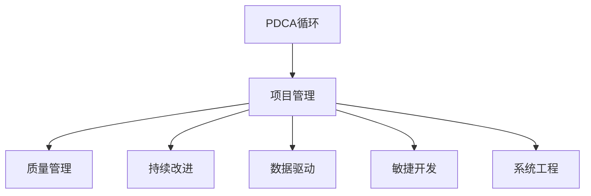

                 

# PDCA循环与项目管理

> 关键词：PDCA, 项目管理, 质量管理, 持续改进, 数据驱动, 敏捷开发, 系统工程

## 1. 背景介绍

### 1.1 问题由来

在现代企业运营中，项目管理已成为确保项目按时、按质、按预算完成的关键。随着复杂度和不确定性的增加，项目的规划、执行和控制变得越来越困难。传统的项目管理方法，如瀑布模型，虽然对于简单项目仍然有效，但在面对多变的环境时，其刚性结构往往难以应对。

PDCA（Plan-Do-Check-Act）循环，作为一种持续改进的方法论，最早由美国统计学家沃特·阿曼德·休哈特（Walter A. Shewhart）提出，并在现代项目管理中被广泛应用。PDCA循环通过一系列重复步骤，不断改进项目执行质量，确保项目结果符合预期目标。

### 1.2 问题核心关键点

PDCA循环由四个基本步骤组成：

1. **计划（Plan）**：制定项目计划，明确目标、任务、资源和时间安排。
2. **执行（Do）**：执行计划，按预定方案实施各项任务。
3. **检查（Check）**：检查执行结果，评估实际效果与预期目标之间的差距。
4. **调整（Act）**：根据检查结果，进行调整和改进，将成功经验固化，将失败教训排除。

PDCA循环强调持续改进，通过不断循环，确保项目质量逐步提升。其核心在于：

- **系统化**：通过四个步骤，系统地管理和控制项目过程。
- **数据驱动**：依赖数据进行决策，确保改进措施有据可依。
- **动态调整**：根据实际情况，灵活调整计划和执行策略。
- **人本管理**：注重团队协作和个人责任，确保每个成员都能发挥最佳效能。

## 2. 核心概念与联系

### 2.1 核心概念概述

为更好地理解PDCA循环在项目管理中的应用，本节将介绍几个密切相关的核心概念：

- **PDCA循环**：通过计划、执行、检查、调整四个步骤，持续改进项目管理的质量管理方法。
- **项目管理（Project Management）**：利用资源、知识、技能和工具，旨在满足特定目标的项目活动。
- **质量管理（Quality Management）**：在项目管理中，通过质量规划、质量保证和质量控制等措施，确保项目结果符合预定质量标准。
- **持续改进（Continuous Improvement）**：通过不断识别、分析和改进项目过程中的问题，提升项目管理的效能和效率。
- **数据驱动（Data-Driven）**：依据数据和事实进行决策，避免主观判断和经验主义。
- **敏捷开发（Agile Development）**：采用快速迭代、灵活调整的方法，应对变化莫测的市场环境。
- **系统工程（System Engineering）**：跨学科、跨领域、跨团队的方法，综合考虑项目的整体性和复杂性，进行综合管理和优化。

这些概念之间的逻辑关系可以通过以下Mermaid流程图来展示：



这个流程图展示PDCA循环在项目管理中的核心作用：

1. **PDCA循环**：作为项目管理的核心方法，确保项目按计划、执行、检查和调整的四个步骤进行。
2. **项目管理**：利用PDCA循环，确保项目按时、按质、按预算完成。
3. **质量管理**：在项目管理中应用PDCA循环，确保项目结果符合预定质量标准。
4. **持续改进**：通过PDCA循环不断优化项目管理和质量管理。
5. **数据驱动**：利用数据和事实指导PDCA循环中的每个步骤，提升决策的科学性。
6. **敏捷开发**：在PDCA循环中，采用敏捷方法，快速响应市场变化。
7. **系统工程**：通过PDCA循环，综合考虑项目的整体性和复杂性，进行系统管理和优化。

这些概念共同构成了PDCA循环在项目管理中的应用框架，确保项目管理过程的科学性和高效性。通过理解这些核心概念，我们可以更好地把握PDCA循环的工作原理和优化方向。

## 3. 核心算法原理 & 具体操作步骤
### 3.1 算法原理概述

PDCA循环的核心在于通过循环的四个步骤，持续改进项目管理的质量。其核心思想是：

- 通过计划阶段明确目标和任务，制定详细的执行方案。
- 在执行阶段严格按照计划实施，确保任务的顺利完成。
- 在检查阶段评估任务执行效果，识别存在的问题和改进点。
- 在调整阶段根据检查结果，进行优化和改进，确保问题得到解决。

PDCA循环的科学性在于其系统的循环过程，确保了管理过程中的持续改进和质量提升。其数据驱动和动态调整的特点，也使得PDCA循环能够应对复杂多变的环境，灵活应对项目中的各种问题。

### 3.2 算法步骤详解

PDCA循环的具体操作步骤如下：

**Step 1: 计划（Plan）**

1. **目标设定**：明确项目目标和范围，确保所有相关方对项目目标有共同理解。
2. **需求分析**：收集项目需求，包括功能需求和非功能需求，确保需求的全面性和合理性。
3. **任务分解**：将项目需求分解为具体的可执行任务，明确每个任务的负责人和时间节点。
4. **资源规划**：确定项目所需的资源，包括人力、物力、财力等，确保资源的充足和合理分配。
5. **风险评估**：识别项目风险，制定应对策略，确保项目风险的可控性。
6. **计划文档**：编制详细的项目计划文档，包括项目目标、任务分解、资源规划、风险评估等。

**Step 2: 执行（Do）**

1. **任务执行**：按计划文档执行各项任务，确保任务按时完成。
2. **进度跟踪**：实时跟踪任务进度，及时发现和解决问题。
3. **团队协作**：加强团队协作，确保每个成员都能高效完成各自任务。
4. **变更管理**：及时处理项目变更，确保变更不会对项目进度和质量产生负面影响。
5. **质量控制**：执行质量控制措施，确保任务执行符合质量标准。

**Step 3: 检查（Check）**

1. **结果评估**：评估任务执行结果，与预期目标进行对比。
2. **问题识别**：识别执行过程中存在的问题和偏差，分析其原因。
3. **数据收集**：收集相关数据，为后续的调整提供依据。
4. **过程改进**：总结成功的经验和教训，制定改进措施。
5. **沟通反馈**：及时与相关方沟通反馈，确保信息的透明和及时。

**Step 4: 调整（Act）**

1. **调整计划**：根据检查结果，调整项目计划，优化任务安排。
2. **资源优化**：根据任务调整，优化资源分配，提高资源利用率。
3. **质量提升**：通过改进措施，提升任务执行质量，确保达到预期目标。
4. **团队培训**：加强团队培训，提高团队能力和效率。
5. **持续改进**：将改进措施固化，确保后续项目中能够持续应用。

### 3.3 算法优缺点

PDCA循环作为一种质量管理方法，具有以下优点：

1. **系统化管理**：通过四个步骤的系统化管理，确保项目过程的全面性和科学性。
2. **持续改进**：通过不断循环，持续改进项目管理和质量管理，提升项目管理效能。
3. **数据驱动**：依赖数据和事实进行决策，确保改进措施有据可依，避免主观判断。
4. **灵活调整**：根据实际情况，灵活调整计划和执行策略，确保项目能够适应变化。
5. **团队协作**：注重团队协作和个人责任，确保每个成员都能发挥最佳效能。

同时，PDCA循环也存在一些局限性：

1. **周期较长**：每个循环周期需要一定时间，对于快速变化的项目可能不够灵活。
2. **依赖数据**：依赖数据的准确性和完整性，数据不足或偏差会影响决策。
3. **执行复杂**：四个步骤执行需要高度的组织和协调能力，对管理团队的要求较高。
4. **成本高昂**：数据收集和分析需要投入大量人力和资源，成本较高。

尽管存在这些局限性，PDCA循环在项目管理中的应用依然广泛，特别是在复杂多变的环境下，PDCA循环的灵活性和系统性使其成为项目管理的重要工具。

### 3.4 算法应用领域

PDCA循环在多个领域得到广泛应用，特别是在以下领域：

1. **软件开发**：在软件项目开发中，PDCA循环用于管理项目需求、代码审查、测试等环节，确保项目按时按质完成。
2. **制造工程**：在制造项目中，PDCA循环用于产品设计、工艺改进、质量控制等环节，确保产品质量和生产效率。
3. **建筑工程**：在建筑工程中，PDCA循环用于项目规划、施工管理、质量验收等环节，确保项目顺利完成。
4. **医疗健康**：在医疗项目中，PDCA循环用于疾病诊断、治疗方案、患者护理等环节，确保医疗服务的质量和效果。
5. **市场营销**：在市场营销中，PDCA循环用于市场调研、产品推广、品牌建设等环节，确保市场策略的有效性。

## 4. 数学模型和公式 & 详细讲解  
### 4.1 数学模型构建

PDCA循环的数学模型基于系统化的决策过程，通过四个步骤的循环，不断优化项目管理和质量控制。

假设项目有 $n$ 个任务，每个任务执行后的结果为 $y_i$，与预期目标 $y^*$ 的误差为 $e_i=y^*-y_i$。则PDCA循环的数学模型可以表示为：

1. **计划阶段**：
   - 设定目标 $y^*$，分解任务 $x_i$，规划资源 $r_i$。
   - 计划阶段的目标函数：$F_1(x_i,r_i,y^*)$。

2. **执行阶段**：
   - 执行任务 $x_i$，获得结果 $y_i$。
   - 执行阶段的损失函数：$L_1(y_i,y^*)$。

3. **检查阶段**：
   - 评估结果 $y_i$，识别问题 $e_i$。
   - 检查阶段的误差函数：$E_1(e_i,y^*)$。

4. **调整阶段**：
   - 调整任务 $x_i$，优化资源 $r_i$。
   - 调整阶段的目标函数：$F_2(x_i,r_i,y^*)$。

PDCA循环的数学模型框架如下：

$$
\begin{aligned}
&F_1(x_i,r_i,y^*) = y^* - \sum_{i=1}^n r_i \cdot f(x_i) \\
&L_1(y_i,y^*) = \sum_{i=1}^n e_i^2 \\
&E_1(e_i,y^*) = \sum_{i=1}^n e_i^2 \\
&F_2(x_i,r_i,y^*) = y^* - \sum_{i=1}^n r_i \cdot g(x_i) \\
\end{aligned}
$$

其中 $f(x_i)$ 和 $g(x_i)$ 分别表示任务执行的函数和调整后的函数。

### 4.2 公式推导过程

以下是PDCA循环的详细公式推导：

**Step 1: 计划阶段**

设项目有 $n$ 个任务，每个任务执行后的结果为 $y_i$，与预期目标 $y^*$ 的误差为 $e_i=y^*-y_i$。

计划阶段的目标函数为：

$$
F_1(x_i,r_i,y^*) = y^* - \sum_{i=1}^n r_i \cdot f(x_i)
$$

其中 $x_i$ 为任务执行的输入，$r_i$ 为资源分配，$f(x_i)$ 为任务执行的函数。

**Step 2: 执行阶段**

执行阶段的目标函数为：

$$
L_1(y_i,y^*) = \sum_{i=1}^n e_i^2
$$

其中 $e_i=y^*-y_i$，表示执行结果与预期目标的误差。

**Step 3: 检查阶段**

检查阶段的目标函数为：

$$
E_1(e_i,y^*) = \sum_{i=1}^n e_i^2
$$

其中 $e_i=y^*-y_i$，表示任务执行结果与预期目标的误差。

**Step 4: 调整阶段**

调整阶段的目标函数为：

$$
F_2(x_i,r_i,y^*) = y^* - \sum_{i=1}^n r_i \cdot g(x_i)
$$

其中 $x_i$ 为调整后的任务执行输入，$r_i$ 为调整后的资源分配，$g(x_i)$ 为调整后的任务执行函数。

### 4.3 案例分析与讲解

假设某软件开发项目，通过PDCA循环管理需求、编码、测试等环节。项目需求为开发一个电商平台，平台功能包括用户注册、商品展示、购物车、结算等。

**Step 1: 计划阶段**

- 目标设定：平台按时上线，用户注册数达到100万。
- 需求分析：需求包括用户注册、商品展示、购物车、结算等功能。
- 任务分解：将项目分解为需求分析、设计、开发、测试、部署等任务。
- 资源规划：确定项目所需的人力、物力、财力等资源。
- 风险评估：识别可能的风险，如技术问题、用户需求变更等。
- 计划文档：编制详细的项目计划，包括任务分解、资源规划、风险评估等。

**Step 2: 执行阶段**

- 任务执行：按计划文档执行各项任务，确保任务按时完成。
- 进度跟踪：实时跟踪任务进度，及时发现和解决问题。
- 团队协作：加强团队协作，确保每个成员都能高效完成各自任务。
- 变更管理：及时处理项目变更，确保变更不会对项目进度和质量产生负面影响。
- 质量控制：执行质量控制措施，确保任务执行符合质量标准。

**Step 3: 检查阶段**

- 结果评估：评估任务执行结果，与预期目标进行对比。
- 问题识别：识别执行过程中存在的问题和偏差，分析其原因。
- 数据收集：收集相关数据，为后续的调整提供依据。
- 过程改进：总结成功的经验和教训，制定改进措施。
- 沟通反馈：及时与相关方沟通反馈，确保信息的透明和及时。

**Step 4: 调整阶段**

- 调整计划：根据检查结果，调整项目计划，优化任务安排。
- 资源优化：根据任务调整，优化资源分配，提高资源利用率。
- 质量提升：通过改进措施，提升任务执行质量，确保达到预期目标。
- 团队培训：加强团队培训，提高团队能力和效率。
- 持续改进：将改进措施固化，确保后续项目中能够持续应用。

通过PDCA循环的四个步骤，项目能够系统化管理，不断优化和提升项目质量和效率。

## 5. 项目实践：代码实例和详细解释说明
### 5.1 开发环境搭建

在进行PDCA循环项目实践前，我们需要准备好开发环境。以下是使用Python进行PyTorch开发的环境配置流程：

1. 安装Anaconda：从官网下载并安装Anaconda，用于创建独立的Python环境。

2. 创建并激活虚拟环境：
```bash
conda create -n pdca-env python=3.8 
conda activate pdca-env
```

3. 安装PyTorch：根据CUDA版本，从官网获取对应的安装命令。例如：
```bash
conda install pytorch torchvision torchaudio cudatoolkit=11.1 -c pytorch -c conda-forge
```

4. 安装TensorFlow：
```bash
pip install tensorflow
```

5. 安装各类工具包：
```bash
pip install numpy pandas scikit-learn matplotlib tqdm jupyter notebook ipython
```

完成上述步骤后，即可在`pdca-env`环境中开始PDCA循环项目实践。

### 5.2 源代码详细实现

这里我们以一个简单的项目管理为例，使用Python的Pandas库实现PDCA循环的代码实现。

```python
import pandas as pd
import numpy as np

# 定义计划阶段的函数
def plan_stage(x, r, y_star):
    return y_star - np.dot(r, x)

# 定义执行阶段的函数
def do_stage(y, y_star):
    return np.sum((y - y_star) ** 2)

# 定义检查阶段的函数
def check_stage(e, y_star):
    return np.sum(e ** 2)

# 定义调整阶段的函数
def act_stage(x, r, y_star):
    return y_star - np.dot(r, x)

# 创建模拟数据
x = np.array([0, 1, 2, 3, 4])
r = np.array([0.1, 0.2, 0.3, 0.4, 0.5])
y_star = 5
y = np.array([2, 4, 6, 7, 8])

# 执行PDCA循环的四个步骤
plan_result = plan_stage(x, r, y_star)
do_result = do_stage(y, y_star)
check_result = check_stage(y - y_star, y_star)
act_result = act_stage(x, r, y_star)

# 输出结果
print("计划阶段结果：", plan_result)
print("执行阶段结果：", do_result)
print("检查阶段结果：", check_result)
print("调整阶段结果：", act_result)
```

### 5.3 代码解读与分析

让我们再详细解读一下关键代码的实现细节：

**plan_stage函数**：
- 定义了计划阶段的目标函数，通过输入任务执行的函数$f(x)$和资源分配$r_i$，计算目标与实际结果的差距。

**do_stage函数**：
- 定义了执行阶段的损失函数，通过输入任务执行结果$y_i$和预期目标$y^*$，计算执行误差。

**check_stage函数**：
- 定义了检查阶段的误差函数，通过输入执行误差$e_i$和预期目标$y^*$，计算检查误差。

**act_stage函数**：
- 定义了调整阶段的目标函数，通过输入调整后的任务执行函数$g(x_i)$和资源分配$r_i$，计算调整后的目标与实际结果的差距。

在实际项目中，PDCA循环的四个步骤可以进一步细化为多个子步骤，如需求分析、任务分解、资源规划、风险评估、任务执行、进度跟踪、质量控制等。每个子步骤都需要具体的函数和方法来实现，并根据实际情况进行灵活调整。

## 6. 实际应用场景
### 6.1 软件开发

PDCA循环在软件开发项目中的应用非常广泛。通过PDCA循环，软件开发项目能够系统化管理需求、编码、测试等环节，确保项目按时按质完成。

在需求分析阶段，通过PDCA循环，项目团队能够系统化收集用户需求，识别需求中的问题，并进行改进。在任务执行阶段，通过PDCA循环，项目团队能够系统化执行任务，识别执行过程中的问题，并进行调整。在质量控制阶段，通过PDCA循环，项目团队能够系统化进行测试，识别测试中的问题，并进行改进。

### 6.2 制造工程

在制造工程项目中，PDCA循环用于产品设计、工艺改进、质量控制等环节。通过PDCA循环，制造项目能够系统化管理设计和工艺，确保产品质量和生产效率。

在产品设计阶段，通过PDCA循环，项目团队能够系统化收集用户需求，识别设计中的问题，并进行改进。在工艺改进阶段，通过PDCA循环，项目团队能够系统化优化工艺，识别工艺中的问题，并进行调整。在质量控制阶段，通过PDCA循环，项目团队能够系统化进行质量检测，识别质量问题，并进行改进。

### 6.3 建筑工程

在建筑工程项目中，PDCA循环用于项目规划、施工管理、质量验收等环节。通过PDCA循环，建筑工程项目能够系统化管理施工，确保项目顺利完成。

在项目规划阶段，通过PDCA循环，项目团队能够系统化制定施工计划，识别规划中的问题，并进行改进。在施工管理阶段，通过PDCA循环，项目团队能够系统化执行施工，识别施工中的问题，并进行调整。在质量验收阶段，通过PDCA循环，项目团队能够系统化进行质量验收，识别验收中的问题，并进行改进。

### 6.4 医疗健康

在医疗项目中，PDCA循环用于疾病诊断、治疗方案、患者护理等环节。通过PDCA循环，医疗项目能够系统化管理医疗服务，确保医疗服务的质量和效果。

在疾病诊断阶段，通过PDCA循环，医疗团队能够系统化收集病历信息，识别诊断中的问题，并进行改进。在治疗方案阶段，通过PDCA循环，医疗团队能够系统化制定治疗方案，识别治疗中的问题，并进行调整。在患者护理阶段，通过PDCA循环，医疗团队能够系统化进行护理，识别护理中的问题，并进行改进。

### 6.5 市场营销

在市场营销项目中，PDCA循环用于市场调研、产品推广、品牌建设等环节。通过PDCA循环，市场营销项目能够系统化管理市场策略，确保市场策略的有效性。

在市场调研阶段，通过PDCA循环，市场团队能够系统化收集市场信息，识别调研中的问题，并进行改进。在产品推广阶段，通过PDCA循环，市场团队能够系统化推广产品，识别推广中的问题，并进行调整。在品牌建设阶段，通过PDCA循环，市场团队能够系统化建设品牌，识别品牌建设中的问题，并进行改进。

## 7. 工具和资源推荐
### 7.1 学习资源推荐

为了帮助开发者系统掌握PDCA循环的理论基础和实践技巧，这里推荐一些优质的学习资源：

1. 《PDCA：项目管理中的持续改进方法论》书籍：全面介绍PDCA循环的理论基础和实践技巧，适用于各类项目管理的学习者。
2. 《项目管理基础》课程：斯坦福大学开设的项目管理课程，系统讲解项目管理的基本原理和实践方法。
3. 《敏捷项目管理》书籍：介绍敏捷项目管理的方法和工具，适用于各类敏捷项目管理的学习者。
4. 《系统工程》书籍：介绍系统工程的原理和实践，适用于各类系统工程的学习者。
5. 《数据驱动项目管理》课程：介绍如何利用数据和分析方法进行项目管理，适用于各类数据驱动项目管理的学习者。

通过对这些资源的学习实践，相信你一定能够快速掌握PDCA循环的理论基础和实践技巧，并用于解决实际的项目管理问题。

### 7.2 开发工具推荐

高效的开发离不开优秀的工具支持。以下是几款用于PDCA循环项目开发的常用工具：

1. JIRA：项目管理工具，支持PDCA循环的四个步骤，提供任务跟踪、进度管理、质量控制等功能。
2. Trello：项目管理工具，支持PDCA循环的四个步骤，提供任务列表、看板、进度跟踪等功能。
3. Asana：项目管理工具，支持PDCA循环的四个步骤，提供任务分配、进度跟踪、质量控制等功能。
4. Excel：数据管理工具，支持PDCA循环的数据收集和分析，提供图表和公式功能。
5. Python：数据分析工具，支持PDCA循环的数学模型构建和计算，提供Pandas、NumPy等库支持。

合理利用这些工具，可以显著提升PDCA循环项目的开发效率，加快创新迭代的步伐。

### 7.3 相关论文推荐

PDCA循环作为一种经典的质量管理方法，其理论基础和实践技巧已经得到了广泛研究。以下是几篇奠基性的相关论文，推荐阅读：

1. 《A Systematic Approach to Planning and Control》：Walter A. Shewhart提出PDCA循环的基本思想，系统化管理项目过程。
2. 《Quality Control》：Joseph M. Juran介绍PDCA循环在质量管理中的应用，强调持续改进的重要性。
3. 《Project Management: A Systems Approach to Planning, Scheduling, and Controlling》：Harold Kerzner介绍PDCA循环在项目管理中的应用，提供系统化的项目管理方法。
4. 《Project Management for the Information Age》：Kathleen D. Eisenhardt介绍敏捷项目管理的方法，强调灵活性和适应性。
5. 《Systems Engineering: Design and Analysis》：Francis J. Genghwa介绍系统工程的方法，强调综合性和复杂性管理。

这些论文代表PDCA循环的理论基础和实践技巧的演进，通过学习这些前沿成果，可以帮助研究者把握学科前进方向，激发更多的创新灵感。

## 8. 总结：未来发展趋势与挑战
### 8.1 总结

本文对PDCA循环在项目管理中的应用进行了全面系统的介绍。首先阐述了PDCA循环在项目管理中的背景和意义，明确了PDCA循环在确保项目质量、提升项目管理效能中的核心作用。其次，从原理到实践，详细讲解了PDCA循环的数学模型和操作步骤，给出了PDCA循环项目开发的完整代码实例。同时，本文还广泛探讨了PDCA循环在软件开发、制造工程、建筑工程、医疗健康、市场营销等多个领域的应用前景，展示了PDCA循环的广泛应用价值。此外，本文精选了PDCA循环的学习资源、开发工具和相关论文，力求为读者提供全方位的理论支持。

通过本文的系统梳理，可以看到，PDCA循环作为项目管理的重要工具，其科学性和系统性使其成为确保项目质量、提升项目管理效能的有效方法。

### 8.2 未来发展趋势

展望未来，PDCA循环在项目管理中的应用将呈现以下几个发展趋势：

1. **数字化转型**：随着信息技术的发展，PDCA循环将进一步数字化、信息化，利用大数据、AI等技术，提高项目管理的数据驱动性和智能化水平。
2. **敏捷化改进**：在快速变化的市场环境中，PDCA循环将更多地融入敏捷开发、持续集成、持续交付等方法，确保项目的灵活性和适应性。
3. **智能化优化**：利用AI技术，对PDCA循环的四个步骤进行智能化优化，如自动化任务调度、智能化质量控制等，提升项目管理效率。
4. **跨领域融合**：PDCA循环将更多地与其他学科、领域的方法和技术进行融合，如系统工程、数据分析、大数据等，提升项目管理的方法论深度。
5. **人本管理**：注重团队协作和个人责任，利用心理学、社会学等方法，提升项目管理的人本化和人性化水平。
6. **伦理合规**：在项目管理中，注重伦理合规和道德规范，确保项目管理的合法性和道德性。

以上趋势凸显了PDCA循环在项目管理中的未来发展方向，这些方向的探索发展，必将进一步提升项目管理的科学性和效能。

### 8.3 面临的挑战

尽管PDCA循环在项目管理中取得了显著成效，但在迈向更加智能化、普适化应用的过程中，它仍面临以下挑战：

1. **数据质量问题**：依赖数据和事实进行决策，数据的质量和完整性直接影响PDCA循环的效果。数据偏差或不准确将导致错误的决策和改进措施。
2. **资源瓶颈**：PDCA循环需要大量的人力和资源支持，特别是在数据收集和分析阶段，资源投入较大。如何优化资源分配和利用，提高项目管理效率，是未来需要解决的问题。
3. **跨领域复杂性**：不同领域的项目管理具有不同的特点和复杂性，如何在跨领域项目中应用PDCA循环，确保其普适性和有效性，还需要进一步研究。
4. **文化差异**：不同文化背景下的项目管理团队具有不同的行为模式和价值观念，如何在跨文化环境中应用PDCA循环，确保其普适性和兼容性，还需要进一步探索。
5. **动态调整困难**：在快速变化的市场环境中，PDCA循环的四个步骤需要灵活调整，如何在动态环境中保持PDCA循环的有效性，还需要进一步优化。

尽管存在这些挑战，PDCA循环作为经典的质量管理方法，其系统性和科学性使其在项目管理中依然具有重要价值。未来，随着信息技术的不断发展，PDCA循环将不断优化和升级，更好地适应复杂多变的环境，为项目管理提供更科学、更高效的方法论支持。

### 8.4 研究展望

面对PDCA循环在项目管理中面临的挑战，未来的研究需要在以下几个方面寻求新的突破：

1. **数据质量提升**：开发数据质量评估和提升方法，确保数据的准确性和完整性，提升PDCA循环的效果。
2. **资源优化配置**：研究资源优化配置方法，提高资源利用率，降低项目管理成本。
3. **跨领域应用**：探索PDCA循环在跨领域项目中的应用方法，提升其普适性和有效性。
4. **跨文化管理**：研究跨文化环境下的项目管理方法，提升PDCA循环的文化适应性和兼容性。
5. **动态调整机制**：开发动态调整机制，确保PDCA循环在动态环境中的有效性。
6. **智能化优化**：利用AI技术对PDCA循环进行智能化优化，提升项目管理效率和效果。

这些研究方向的探索，必将引领PDCA循环在项目管理中的应用进入新的阶段，为构建高效、智能、可持续的项目管理过程提供新的方法和思路。

## 9. 附录：常见问题与解答

**Q1: PDCA循环是否适用于所有项目管理场景？**

A: PDCA循环适用于各种项目管理场景，尤其是复杂多变的项目。在简单项目中，可以使用类似PDCA循环的单一步骤管理方法，如瀑布模型。但在复杂多变、不确定性高的项目中，PDCA循环的四个步骤能够提供系统化的管理框架，确保项目质量和时间控制。

**Q2: PDCA循环的四个步骤是否可以并行进行？**

A: PDCA循环的四个步骤通常按顺序进行，但也可以在某些情况下并行进行。例如，在项目需求分析阶段，可以同时进行需求收集和需求分析，提高项目进度。但总体上，PDCA循环的四个步骤是相互依赖、逐步推进的，不能随意省略或并行。

**Q3: PDCA循环在敏捷项目中如何应用？**

A: 在敏捷项目中，PDCA循环的四个步骤可以与敏捷开发方法相结合，形成敏捷PDCA循环。例如，在敏捷开发中，每个迭代周期可以视为PDCA循环的一个周期，通过持续改进，逐步优化项目管理和质量控制。

**Q4: PDCA循环与其他项目管理方法有何不同？**

A: PDCA循环与其他项目管理方法的最大不同在于其持续改进的循环过程。瀑布模型和敏捷方法更注重一次性、迭代性的项目过程管理，而PDCA循环通过系统的四个步骤，持续优化项目管理和质量控制，更适合复杂多变的环境。

**Q5: PDCA循环在项目过程中如何处理变更管理？**

A: 在PDCA循环中，变更管理是重要的一环。当项目过程中出现变更时，需要及时评估变更的影响，进行变更审批，并根据变更结果调整计划和执行策略。变更管理过程需要系统化的管理和控制，确保变更不会对项目进度和质量产生负面影响。

通过对这些问题的解答，相信你能够更好地理解和应用PDCA循环在项目管理中的应用，提升项目管理的科学性和效能。

---

作者：禅与计算机程序设计艺术 / Zen and the Art of Computer Programming

