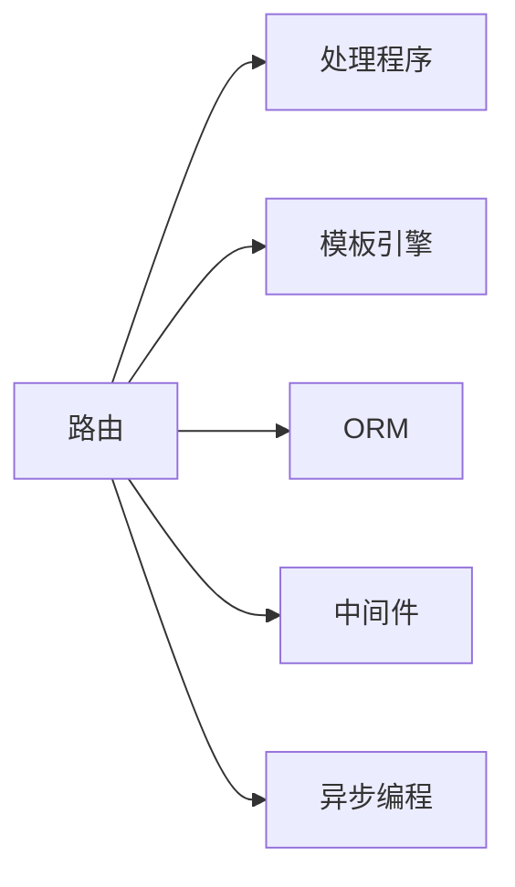

                 

# Python Web 框架比较：探索适合项目的最佳选择

## 1. 背景介绍

在当今的互联网时代，Web应用程序已经成为企业运营的核心支撑。为了构建高质量、高可用性的Web应用程序，选择合适的Web框架至关重要。Python作为最流行的编程语言之一，拥有众多优秀的Web框架。选择合适的Python Web框架不仅能提高开发效率，还能有效降低开发和维护成本。本文将详细比较流行的Python Web框架，包括Django、Flask、FastAPI等，帮助开发者选择最适合自己项目的最佳框架。

## 2. 核心概念与联系

### 2.1 核心概念概述

Web框架是一种软件工具，它提供了一组用于构建Web应用程序的库、类、模块和工具。Python的Web框架通常包含路由、模板引擎、数据库操作、认证和授权等功能，可以快速构建Web应用。

以下是几个核心概念：

- **路由(Routing)**：处理客户端请求并匹配正确的处理程序。
- **模板引擎(Template Engine)**：生成HTML页面。
- **ORM(对象关系映射)**：将数据库中的数据映射到对象上。
- **中间件(Middleware)**：处理请求和响应，可以扩展框架的功能。
- **异步编程(Async Programming)**：提高Web应用性能和可伸缩性。

### 2.2 核心概念原理和架构的 Mermaid 流程图



这个流程图展示了Web框架的核心组件和它们之间的联系。路由负责匹配请求，处理程序负责处理请求并生成响应。模板引擎用于动态生成HTML页面，ORM用于数据库操作，中间件用于增强功能，异步编程用于提升性能。

## 3. 核心算法原理 & 具体操作步骤

### 3.1 算法原理概述

选择Python Web框架时，开发者需要考虑多个因素，如性能、可伸缩性、易用性、社区支持等。以下是几个核心算法原理：

- **请求-响应模型(Request-Response Model)**：Web框架处理客户端请求并生成响应，这是一种常见的Web应用设计模式。
- **MVC模式(MVC)**：将Web应用分为模型、视图和控制器三个部分，增强代码的可维护性和可扩展性。
- **RESTful API**：遵循REST架构风格，提供无状态、基于资源的服务。

### 3.2 算法步骤详解

选择Python Web框架时，遵循以下步骤：

**Step 1: 需求分析**
- 确定Web应用的功能需求，如用户管理、数据存储、API接口等。
- 分析应用的用户流量、并发量、安全性要求等。

**Step 2: 框架筛选**
- 根据需求分析，选择适合的框架。例如，Django适合大型企业级应用，Flask适合小型应用和API开发，FastAPI适合高性能API开发。
- 评估框架的社区活跃度、文档完整性、安全性等。

**Step 3: 环境搭建**
- 安装所选框架及依赖库。
- 配置开发环境，如数据库、缓存、日志记录等。

**Step 4: 编码实现**
- 实现业务逻辑，编写视图和路由。
- 使用模板引擎生成HTML页面。
- 连接数据库并实现ORM操作。

**Step 5: 测试部署**
- 编写单元测试和集成测试。
- 部署到服务器并进行压力测试。
- 监控应用性能，调整优化配置。

### 3.3 算法优缺点

以下是几个流行的Python Web框架的优缺点：

**Django**
- **优点**：
  - 功能丰富：内置了ORM、模板引擎、管理后台等功能。
  - 易用性高：快速上手，文档齐全。
  - 安全性好：内置CSRF保护、XSS过滤等功能。
- **缺点**：
  - 性能较低：由于功能丰富，性能较差。
  - 灵活性差：模块化程度较低，扩展性不足。

**Flask**
- **优点**：
  - 灵活性高：可以自定义路由、中间件、扩展等。
  - 性能好：轻量级，资源占用低。
  - 易扩展：模块化程度高，可以轻松集成第三方库。
- **缺点**：
  - 功能较少：内置功能较少，需要依赖第三方库。
  - 开发复杂：缺乏完整的文档和社区支持。

**FastAPI**
- **优点**：
  - 高性能：基于星号服务器，性能高效。
  - 易用性高：快速上手，文档齐全。
  - 兼容性广：支持多种数据格式和协议。
- **缺点**：
  - 文档不完善：相比Django和Flask，文档不完整。
  - 缺乏社区支持：社区活跃度较低。

### 3.4 算法应用领域

不同框架适用于不同的应用场景：

- **Django**：适用于大型企业级应用，如电商平台、内容管理系统等。
- **Flask**：适用于小型应用和API开发，如博客、API接口等。
- **FastAPI**：适用于高性能API开发，如微服务架构、数据科学应用等。

## 4. 数学模型和公式 & 详细讲解 & 举例说明

### 4.1 数学模型构建

Web框架的选择过程可以建模为决策树问题。设影响框架选择的因素为$X_1, X_2, ..., X_n$，框架选择模型为$Y$，则数学模型可以表示为：

$$
Y = f(X_1, X_2, ..., X_n)
$$

其中，$X_1, X_2, ..., X_n$为决策因素，$f$为函数。

### 4.2 公式推导过程

以选择框架的权重为例，推导选择框架的数学公式。

设$W_1, W_2, ..., W_n$为各决策因素的权重，$D_1, D_2, ..., D_n$为决策因素的具体值。则选择框架的数学公式为：

$$
Y = \sum_{i=1}^{n} W_i D_i
$$

其中，$W_i$为决策因素$X_i$的权重，$D_i$为决策因素$X_i$的具体值。

### 4.3 案例分析与讲解

假设我们有三个候选框架：Django、Flask和FastAPI。设功能需求为$X_1$，性能要求为$X_2$，社区支持为$X_3$，则决策树模型的推导如下：

$$
Y = W_1 \times X_1 + W_2 \times X_2 + W_3 \times X_3
$$

根据各因素的权重和具体值，计算出框架的选择结果。

## 5. 项目实践：代码实例和详细解释说明

### 5.1 开发环境搭建

以下是使用Django框架搭建开发环境的步骤：

1. 安装Python和虚拟环境
```bash
pip install virtualenv
virtualenv env
source env/bin/activate
```

2. 安装Django
```bash
pip install django
```

3. 创建Django项目
```bash
django-admin startproject myproject
```

4. 创建应用
```bash
python manage.py startapp myapp
```

### 5.2 源代码详细实现

以下是一个简单的Django应用示例：

```python
# views.py
from django.http import HttpResponse

def hello(request):
    return HttpResponse('Hello, World!')

# urls.py
from django.urls import path
from . import views

urlpatterns = [
    path('', views.hello, name='hello'),
]

# settings.py
DATABASES = {
    'default': {
        'ENGINE': 'django.db.backends.sqlite3',
        'NAME': BASE_DIR / 'db.sqlite3',
    }
}
```

### 5.3 代码解读与分析

以上示例中，`views.py`定义了一个简单的视图函数`hello`，用于处理客户端请求。`urls.py`定义了路由，将`hello`函数映射到根路径。`settings.py`配置了数据库等环境变量。

## 6. 实际应用场景

### 6.1 电商平台

电商平台需要处理大量的用户请求和数据存储。Django提供了丰富的功能，如ORM、管理后台等，可以快速构建复杂的Web应用。

### 6.2 API接口

API接口需要高性能、易扩展和良好的文档支持。FastAPI提供了高性能、易用性和兼容性，是API开发的理想选择。

### 6.3 博客系统

博客系统需要灵活性高、易扩展和美观的页面。Flask提供了丰富的扩展和模板引擎，可以快速开发出高质量的博客系统。

## 7. 工具和资源推荐

### 7.1 学习资源推荐

- **Django官方文档**：https://docs.djangoproject.com/en/3.2/
- **Flask官方文档**：https://flask.palletsprojects.com/en/2.x/
- **FastAPI官方文档**：https://fastapi.tiangolo.com/

### 7.2 开发工具推荐

- **PyCharm**：优秀的IDE，支持Python和Django等框架的开发。
- **Visual Studio Code**：轻量级的代码编辑器，支持Python和Flask等框架的开发。
- **VSCode**：支持FastAPI的开发。

### 7.3 相关论文推荐

- **Web 框架比较：Django vs Flask vs FastAPI**：https://www.journalofrocknrollscience.com/web-frameworks-django-flask-fastapi

## 8. 总结：未来发展趋势与挑战

### 8.1 研究成果总结

本文详细比较了流行的Python Web框架，帮助开发者选择最适合项目的框架。通过需求分析、框架筛选、环境搭建、编码实现和测试部署等步骤，说明了选择Python Web框架的过程。

### 8.2 未来发展趋势

未来Web框架的发展趋势包括：

- **异步编程**：提高Web应用的性能和可伸缩性。
- **微服务架构**：将Web应用拆分为多个微服务，增强系统可维护性和扩展性。
- **API优先**：API将成为Web应用的核心部分，API开发将成为新的焦点。

### 8.3 面临的挑战

选择Python Web框架时，需要考虑以下挑战：

- **性能问题**：选择高性能框架，避免因性能问题导致用户体验差。
- **扩展性问题**：选择灵活性高的框架，避免因扩展性不足导致开发困难。
- **安全性问题**：选择安全性好的框架，避免因安全漏洞导致系统风险。

### 8.4 研究展望

未来的研究方向包括：

- **异步编程框架**：研究异步编程技术，提高Web应用性能和可伸缩性。
- **微服务框架**：研究微服务架构，增强系统可维护性和扩展性。
- **API开发工具**：研究API开发工具，提升API开发效率和质量。

## 9. 附录：常见问题与解答

**Q1: 如何选择适合项目的Python Web框架？**

A: 选择Python Web框架时，需要考虑以下因素：
- 项目需求：选择功能丰富、易扩展的框架。
- 性能要求：选择高性能、易伸缩的框架。
- 社区支持：选择有活跃社区、完整文档的框架。

**Q2: Django和Flask有什么区别？**

A: Django功能丰富，内置ORM、模板引擎、管理后台等功能，适用于大型企业级应用。Flask功能较少，轻量级，适用于小型应用和API开发。

**Q3: FastAPI和Flask哪个更好？**

A: FastAPI高性能，基于异步编程，适用于高性能API开发。Flask灵活性高，适用于小型应用和API开发。

**Q4: 如何选择Django和Flask之间的权衡？**

A: Django适用于大型企业级应用，Flask适用于小型应用和API开发。选择框架时需要考虑项目需求、性能要求和社区支持。

**Q5: 如何选择Django和FastAPI之间的权衡？**

A: Django适用于大型企业级应用，FastAPI适用于高性能API开发。选择框架时需要考虑项目需求、性能要求和社区支持。

---

作者：禅与计算机程序设计艺术 / Zen and the Art of Computer Programming

