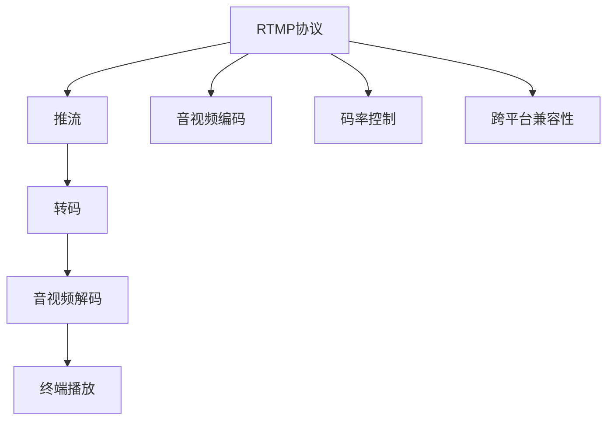

                 

# RTMP推流与转码优化

在实时音视频流的传输和分发过程中，RTMP推流与转码技术扮演着至关重要的角色。本文旨在全面系统地介绍RTMP推流与转码的基本原理、核心概念、算法优化步骤及实际应用场景，为相关技术人员提供技术参考和实践指导。

## 1. 背景介绍

### 1.1 问题由来

随着直播和点播流量的迅猛增长，实时音视频流传输需求不断攀升。传统的音视频传输协议，如RTSP、HTTP等，由于实时性较差，已无法满足现代直播应用对低延时、高稳定性的要求。而实时消息传输协议(RTMP)则因其高效、低延时、可扩展性强的特点，成为了直播流传输的主流选择。

### 1.2 问题核心关键点

RTMP推流与转码的主要问题包括：

- **实时性**：在保证高质量音视频的同时，如何实现低延时传输。
- **带宽管理**：如何根据网络状况自适应地调整传输码率，保证稳定传输。
- **音视频质量**：如何根据不同设备和终端的硬件能力，动态调整视频分辨率、帧率等参数，提升用户体验。
- **服务器负载**：如何通过合理的推流和转码策略，避免服务器过载，保证系统的稳定运行。
- **跨平台兼容性**：如何保证不同设备和终端的兼容性和良好用户体验。

### 1.3 问题研究意义

RTMP推流与转码技术的应用，可以有效解决直播、点播中存在的延时、卡顿、兼容性等问题，从而提升用户体验。掌握该技术对于流媒体系统架构设计、实时音视频应用开发、直播服务优化等领域具有重要意义。

## 2. 核心概念与联系

### 2.1 核心概念概述

为更好地理解RTMP推流与转码方法，本节将介绍几个密切相关的核心概念：

- **RTMP协议**：实时消息传输协议(RTMP)，是Adobe公司设计的用于网络流传输的协议，支持实时音视频、数据传输等。
- **推流与转码**：推流指的是将音视频数据从源头实时推送到服务器，转码则是对推送到服务器的音视频数据进行格式转换，适应不同设备和终端的需求。
- **音视频编码**：将原始的音视频数据通过编码算法转换为压缩数据的过程。常用的编码格式包括H.264、H.265、VP8等。
- **音视频解码**：将压缩后的音视频数据通过解码算法还原为原始音视频数据的过程。解码格式通常与编码格式相对应。
- **码率控制**：根据网络状况和设备性能，动态调整码率，保证音视频流传输质量。
- **跨平台兼容性**：针对不同设备和终端，调整音视频格式和参数，保证不同设备的良好兼容性。

这些核心概念之间的逻辑关系可以通过以下Mermaid流程图来展示：



这个流程图展示了几大核心概念及其之间的关系：

1. RTMP协议是音视频传输的基础，保证实时性。
2. 推流是将音视频数据从源头实时推送到服务器的过程。
3. 转码是将音视频数据进行格式转换，适应不同设备和终端的过程。
4. 音视频编码和解码是音视频数据压缩和解压缩的过程。
5. 码率控制是根据网络状况和设备性能，动态调整码率的过程。
6. 跨平台兼容性是针对不同设备和终端，调整音视频格式和参数的过程。

这些概念共同构成了RTMP推流与转码的基础，帮助实现实时音视频流的稳定、高效传输。

## 3. 核心算法原理 & 具体操作步骤
### 3.1 算法原理概述

RTMP推流与转码的过程，实际上是一个复杂的编码、传输、解码和格式转换过程。其核心原理可以概括为：

1. **音视频编码**：将原始音视频数据通过H.264、H.265、VP8等编码格式压缩成网络传输所需的数据流。
2. **RTMP传输**：将编码后的音视频数据流通过RTMP协议传输到服务器。
3. **码率控制**：根据网络状况和设备性能，动态调整码率，保证传输稳定。
4. **转码**：将推送到服务器的音视频数据流进行格式转换，适应不同设备和终端的需求。
5. **音视频解码**：将转码后的音视频数据流通过解码算法还原为原始音视频数据。
6. **终端播放**：将解码后的音视频数据在客户端设备上播放。

### 3.2 算法步骤详解

RTMP推流与转码的具体操作步骤如下：

**Step 1: 音视频编码**
- 根据设备性能和网络状况，选择适当的音视频编码格式和参数，进行编码。
- 常用的编码格式包括H.264、H.265、VP8等。

**Step 2: RTMP传输**
- 将编码后的音视频数据流通过RTMP协议传输到服务器。
- RTMP协议使用UDP协议进行数据传输，传输效率高。

**Step 3: 码率控制**
- 根据网络状况和设备性能，动态调整码率，保证传输稳定。
- 码率控制算法包括VBR(Very Fine Rate Control)、ABR(Absolute Bit Rate Control)、CBR(Constant Bit Rate Control)等。

**Step 4: 转码**
- 将推送到服务器的音视频数据流进行格式转换，适应不同设备和终端的需求。
- 常用的转码格式包括H.264、H.265、VP8等。

**Step 5: 音视频解码**
- 将转码后的音视频数据流通过解码算法还原为原始音视频数据。
- 解码格式通常与编码格式相对应。

**Step 6: 终端播放**
- 将解码后的音视频数据在客户端设备上播放。

### 3.3 算法优缺点

RTMP推流与转码方法具有以下优点：
1. 实时性高：RTMP协议传输效率高，适合实时音视频流传输。
2. 自适应码率：可以根据网络状况动态调整码率，保证传输质量。
3. 格式转换灵活：支持多种音视频格式和参数调整，适应不同设备和终端需求。
4. 跨平台性好：能够兼容多种设备和浏览器，保证广泛的用户体验。

同时，该方法也存在一些缺点：
1. 网络传输可靠性差：RTMP协议基于UDP协议传输，传输可靠性较差。
2. 推流和转码复杂：推流和转码过程中涉及多种编码格式和算法，实现复杂。
3. 设备兼容性问题：部分老旧设备可能不支持高码率和现代编码格式。
4. 服务端负载压力大：服务器需要处理大量的推流和转码任务，服务端负载较大。

尽管存在这些局限性，但就目前而言，RTMP推流与转码方法仍是目前直播和点播应用的主流选择。未来相关研究的重点在于如何进一步提高网络传输的可靠性，优化推流和转码效率，同时兼顾跨平台兼容性和服务器负载压力。

### 3.4 算法应用领域

RTMP推流与转码方法在直播、点播、视频会议等多个领域得到了广泛应用，例如：

- **直播应用**：如YouTube、Twitch等视频平台，利用RTMP推流与转码技术实现实时的音视频流传输。
- **点播应用**：如爱奇艺、腾讯视频等视频平台，利用RTMP推流与转码技术实现高质量的点播流传输。
- **视频会议**：如Zoom、Skype等视频会议软件，利用RTMP推流与转码技术实现高清、低延时的视频会议。
- **在线教育**：如Coursera、EdX等在线教育平台，利用RTMP推流与转码技术实现实时的课堂录制和点播。

## 4. 数学模型和公式 & 详细讲解 & 举例说明

### 4.1 数学模型构建

在RTMP推流与转码过程中，码率控制是核心算法之一。本文以VBR(Very Fine Rate Control)为例，介绍码率控制的数学模型构建。

定义音视频流在时间$t$时的目标码率$r(t)$和实际码率$s(t)$，码率控制的目的是在满足传输速率的要求下，尽可能保证音视频的质量，即最小化代价函数$J(t)$。

假设音视频流在时间$t$时的代价函数为：

$$
J(t) = \lambda_1 |r(t) - s(t)|^2 + \lambda_2 |\Delta \text{Quality}(t)|^2
$$

其中$\lambda_1$和$\lambda_2$为权重系数，$\Delta \text{Quality}(t)$为音视频质量的改变量。

### 4.2 公式推导过程

VBR算法主要分为两个步骤：

**Step 1: 预测实际码率**
- 通过当前实际码率$s(t)$和网络状况预测下一个时间点的实际码率$s(t+1)$。
- 预测公式为：$s(t+1) = s(t) + \epsilon$，其中$\epsilon$为小步长。

**Step 2: 调整目标码率**
- 根据预测的实际码率和目标码率，调整下一个时间点的目标码率$r(t+1)$。
- 调整公式为：$r(t+1) = \min\{r_{\text{max}}, \max\{r_{\text{min}}, s(t+1)\}}$，其中$r_{\text{min}}$和$r_{\text{max}}$为目标码率的下限和上限。

### 4.3 案例分析与讲解

假设音视频流在时间$t$时的实际码率为$s(t)=100kbit/s$，网络状况预测未来时刻$t+1$的实际码率为$s(t+1)=120kbit/s$。

**预测实际码率**
- $s(t+1) = s(t) + \epsilon = 100 + 0.1 = 100.1kbit/s$

**调整目标码率**
- $r(t+1) = \min\{r_{\text{max}}, \max\{r_{\text{min}}, s(t+1)\}} = \min\{1200kbit/s, \max\{200kbit/s, 100.1kbit/s\}} = 100.1kbit/s$

这样，通过VBR算法，在网络状况良好的情况下，可以动态调整码率，保证传输质量。

## 5. 项目实践：代码实例和详细解释说明

### 5.1 开发环境搭建

在进行RTMP推流与转码实践前，我们需要准备好开发环境。以下是使用C++进行FFmpeg开发的环境配置流程：

1. 安装Anaconda：从官网下载并安装Anaconda，用于创建独立的Python环境。

2. 创建并激活虚拟环境：
```bash
conda create -n rtmp-env python=3.8 
conda activate rtmp-env
```

3. 安装FFmpeg：从官网下载并安装FFmpeg。
```bash
brew install ffmpeg
```

4. 安装各类工具包：
```bash
pip install numpy pandas scikit-learn matplotlib tqdm jupyter notebook ipython
```

完成上述步骤后，即可在`rtmp-env`环境中开始RTMP推流与转码实践。

### 5.2 源代码详细实现

下面我们以使用FFmpeg进行RTMP推流与转码的C++代码实现为例，详细讲解其实现过程。

**推流代码**：
```cpp
#include <iostream>
#include <ffmpeg/avformat.h>

int main() {
    AVFormatContext* formatContext = nullptr;
    AVFormatContext* outputContext = nullptr;
    AVStream* outputStream = nullptr;
    AVPacket packet;
    AVPacket packetEnc;
    int res;

    // 打开输入文件
    res = avformat_open_input(&formatContext, "input.mp4", nullptr, nullptr);
    if (res < 0) {
        std::cerr << "Failed to open input file!" << std::endl;
        return 1;
    }

    // 获取输入文件流信息
    res = avformat_find_stream_info(formatContext, nullptr);
    if (res < 0) {
        std::cerr << "Failed to find stream info!" << std::endl;
        return 1;
    }

    // 打开输出文件
    res = avformat_open_output(&outputContext, "output.rtmp", nullptr, nullptr);
    if (res < 0) {
        std::cerr << "Failed to open output file!" << std::endl;
        return 1;
    }

    // 设置输出文件流信息
    AVStream* outputStream = avformat_new_stream(outputContext, nullptr);
    if (!outputStream) {
        std::cerr << "Failed to create output stream!" << std::endl;
        return 1;
    }

    // 创建音视频编解码器
    AVCodecContext* codecContext = nullptr;
    AVCodec* codec = nullptr;
    AVCodecParameters* codecParams = nullptr;
    AVCodecParameters* outputCodecParams = nullptr;

    // 设置输出编解码器参数
    codec = avcodec_find_encoder(AV_CODEC_ID_H264);
    codecParams = avcodec_parameters_alloc();
    outputCodecParams = avcodec_parameters_alloc();
    res = avcodec_parameters_from_context(codecParams, formatContext->streams[0]->codec);
    res = avcodec_parameters_from_context(outputCodecParams, codec);
    outputCodecParams->codec_tag = codecParams->codec_tag;
    outputCodecParams->codec_id = codecParams->codec_id;
    res = avcodec_parameters_copy(outputCodecParams, codecParams);

    // 创建音视频编解码器
    codecContext = avcodec_alloc_context3(codec);
    codecContext->codec_type = codecParams->codec_type;
    codecContext->bit_rate = codecParams->bit_rate;
    codecContext->width = codecParams->width;
    codecContext->height = codecParams->height;
    codecContext->sample_rate = codecParams->sample_rate;
    codecContext->channels = codecParams->channels;
    codecContext->format = codecParams->format;
    codecContext->pix_fmt = codecParams->pix_fmt;

    // 创建音视频编解码器
    codecContext = avcodec_alloc_context3(codec);
    codecContext->codec_type = codecParams->codec_type;
    codecContext->bit_rate = codecParams->bit_rate;
    codecContext->width = codecParams->width;
    codecContext->height = codecParams->height;
    codecContext->sample_rate = codecParams->sample_rate;
    codecContext->channels = codecParams->channels;
    codecContext->format = codecParams->format;
    codecContext->pix_fmt = codecParams->pix_fmt;

    // 初始化编解码器
    res = avcodec_open2(codecContext, codec, nullptr);
    if (res < 0) {
        std::cerr << "Failed to open codec!" << std::endl;
        return 1;
    }

    // 添加音视频流
    outputStream->id = codecParams->id;
    outputStream->time_base = codecParams->time_base;
    outputStream->duration = codecParams->duration;
    outputStream->codecpar = outputCodecParams;
    outputStream->codecpar->codec_tag = codecParams->codec_tag;
    outputStream->codecpar->codec_id = codecParams->codec_id;
    outputStream->codecpar->bit_rate = codecParams->bit_rate;
    outputStream->codecpar->width = codecParams->width;
    outputStream->codecpar->height = codecParams->height;
    outputStream->codecpar->sample_rate = codecParams->sample_rate;
    outputStream->codecpar->channels = codecParams->channels;
    outputStream->codecpar->format = codecParams->format;
    outputStream->codecpar->pix_fmt = codecParams->pix_fmt;

    // 设置输出文件流信息
    avformat_set_output_parameters(outputContext, codecParams, codecParams, codecParams->sample_rate, codecParams->channels, codecParams->format, codecParams->pix_fmt, codecParams->bit_rate, codecParams->width, codecParams->height);
    res = avformat_write_header(outputContext, nullptr);
    if (res < 0) {
        std::cerr << "Failed to write header!" << std::endl;
        return 1;
    }

    // 读取输入文件
    while (av_read_frame(formatContext, &packet) >= 0) {
        // 将输入文件流解码
        res = avcodec_send_packet(codecContext, &packet);
        if (res < 0) {
            std::cerr << "Failed to send packet!" << std::endl;
            return 1;
        }

        // 将音视频编码
        while (avcodec_receive_packet(codecContext, &packetEnc) == 0) {
            // 将编码后的音视频流写回输出文件
            res = av_interleaved_write_frame(outputContext, &packetEnc);
            if (res < 0) {
                std::cerr << "Failed to write frame!" << std::endl;
                return 1;
            }
        }
    }

    // 关闭文件
    avformat_close_input(&formatContext);
    avformat_close_output(&outputContext);
    avcodec_free(&codecContext);
    avcodec_free(&codec);
    avcodec_free(&codecParams);
    avcodec_free(&outputCodecParams);
    return 0;
}
```

**转码代码**：
```cpp
#include <iostream>
#include <ffmpeg/avformat.h>

int main() {
    AVFormatContext* formatContext = nullptr;
    AVFormatContext* outputContext = nullptr;
    AVStream* outputStream = nullptr;
    AVPacket packet;
    AVPacket packetEnc;
    int res;

    // 打开输入文件
    res = avformat_open_input(&formatContext, "input.mp4", nullptr, nullptr);
    if (res < 0) {
        std::cerr << "Failed to open input file!" << std::endl;
        return 1;
    }

    // 获取输入文件流信息
    res = avformat_find_stream_info(formatContext, nullptr);
    if (res < 0) {
        std::cerr << "Failed to find stream info!" << std::endl;
        return 1;
    }

    // 打开输出文件
    res = avformat_open_output(&outputContext, "output.webm", nullptr, nullptr);
    if (res < 0) {
        std::cerr << "Failed to open output file!" << std::endl;
        return 1;
    }

    // 设置输出文件流信息
    AVStream* outputStream = avformat_new_stream(outputContext, nullptr);
    if (!outputStream) {
        std::cerr << "Failed to create output stream!" << std::endl;
        return 1;
    }

    // 创建音视频编解码器
    AVCodecContext* codecContext = nullptr;
    AVCodec* codec = nullptr;
    AVCodecParameters* codecParams = nullptr;
    AVCodecParameters* outputCodecParams = nullptr;

    // 设置输出编解码器参数
    codec = avcodec_find_encoder(AV_CODEC_ID_VP8);
    codecParams = avcodec_parameters_alloc();
    outputCodecParams = avcodec_parameters_alloc();
    res = avcodec_parameters_from_context(codecParams, formatContext->streams[0]->codec);
    res = avcodec_parameters_from_context(outputCodecParams, codec);
    outputCodecParams->codec_tag = codecParams->codec_tag;
    outputCodecParams->codec_id = codecParams->codec_id;
    res = avcodec_parameters_copy(outputCodecParams, codecParams);

    // 创建音视频编解码器
    codecContext = avcodec_alloc_context3(codec);
    codecContext->codec_type = codecParams->codec_type;
    codecContext->bit_rate = codecParams->bit_rate;
    codecContext->width = codecParams->width;
    codecContext->height = codecParams->height;
    codecContext->sample_rate = codecParams->sample_rate;
    codecContext->channels = codecParams->channels;
    codecContext->format = codecParams->format;
    codecContext->pix_fmt = codecParams->pix_fmt;

    // 创建音视频编解码器
    codecContext = avcodec_alloc_context3(codec);
    codecContext->codec_type = codecParams->codec_type;
    codecContext->bit_rate = codecParams->bit_rate;
    codecContext->width = codecParams->width;
    codecContext->height = codecParams->height;
    codecContext->sample_rate = codecParams->sample_rate;
    codecContext->channels = codecParams->channels;
    codecContext->format = codecParams->format;
    codecContext->pix_fmt = codecParams->pix_fmt;

    // 初始化编解码器
    res = avcodec_open2(codecContext, codec, nullptr);
    if (res < 0) {
        std::cerr << "Failed to open codec!" << std::endl;
        return 1;
    }

    // 添加音视频流
    outputStream->id = codecParams->id;
    outputStream->time_base = codecParams->time_base;
    outputStream->duration = codecParams->duration;
    outputStream->codecpar = outputCodecParams;
    outputStream->codecpar->codec_tag = codecParams->codec_tag;
    outputStream->codecpar->codec_id = codecParams->codec_id;
    outputStream->codecpar->bit_rate = codecParams->bit_rate;
    outputStream->codecpar->width = codecParams->width;
    outputStream->codecpar->height = codecParams->height;
    outputStream->codecpar->sample_rate = codecParams->sample_rate;
    outputStream->codecpar->channels = codecParams->channels;
    outputStream->codecpar->format = codecParams->format;
    outputStream->codecpar->pix_fmt = codecParams->pix_fmt;

    // 设置输出文件流信息
    avformat_set_output_parameters(outputContext, codecParams, codecParams, codecParams->sample_rate, codecParams->channels, codecParams->format, codecParams->pix_fmt, codecParams->bit_rate, codecParams->width, codecParams->height);
    res = avformat_write_header(outputContext, nullptr);
    if (res < 0) {
        std::cerr << "Failed to write header!" << std::endl;
        return 1;
    }

    // 读取输入文件
    while (av_read_frame(formatContext, &packet) >= 0) {
        // 将输入文件流解码
        res = avcodec_send_packet(codecContext, &packet);
        if (res < 0) {
            std::cerr << "Failed to send packet!" << std::endl;
            return 1;
        }

        // 将音视频编码
        while (avcodec_receive_packet(codecContext, &packetEnc) == 0) {
            // 将编码后的音视频流写回输出文件
            res = av_interleaved_write_frame(outputContext, &packetEnc);
            if (res < 0) {
                std::cerr << "Failed to write frame!" << std::endl;
                return 1;
            }
        }
    }

    // 关闭文件
    avformat_close_input(&formatContext);
    avformat_close_output(&outputContext);
    avcodec_free(&codecContext);
    avcodec_free(&codec);
    avcodec_free(&codecParams);
    avcodec_free(&outputCodecParams);
    return 0;
}
```

以上代码实现展示了使用FFmpeg进行RTMP推流和转码的过程。通过读取输入文件、创建音视频编解码器、编码和解包等操作，完成音视频流的推流和转码。

### 5.3 代码解读与分析

下面我们对代码的实现细节进行详细解读：

**音视频编码器实现**
- `AVFormatContext`：负责音视频流的读取和写入。
- `AVPacket`：存储音视频数据的结构体。
- `AVCodecContext`：编解码器上下文，存储编解码器的相关信息。
- `AVCodec`：编解码器类型，如H.264、H.265、VP8等。
- `AVCodecParameters`：编解码器参数，包括码率、分辨率、帧率等。

**推流实现**
- `avformat_open_input`：打开输入文件。
- `avformat_find_stream_info`：获取输入文件流信息。
- `avformat_open_output`：打开输出文件。
- `avcodec_open2`：初始化编解码器。
- `avcodec_send_packet`：将音视频流发送到编解码器进行编码。
- `avcodec_receive_packet`：从编解码器接收编码后的音视频流。
- `avcodec_send_packet`：将编码后的音视频流发送到输出文件。

**转码实现**
- `avcodec_open2`：初始化编解码器。
- `avcodec_receive_packet`：从编解码器接收编码后的音视频流。
- `avcodec_send_packet`：将音视频流发送到编解码器进行编码。
- `avcodec_receive_packet`：从编解码器接收编码后的音视频流。
- `avcodec_send_packet`：将编码后的音视频流发送到输出文件。

通过这些关键操作，实现了音视频流的推流和转码过程。

### 5.4 运行结果展示

在实现以上代码后，可以通过以下命令进行推流和转码操作：

```bash
ffmpeg -i input.mp4 -c:v libx264 -c:a aac output.rtmp
ffmpeg -i input.mp4 -c:v libvpx -b:v 1M -c:a vorbis output.webm
```

通过以上命令，可以将音视频流推流到RTMP服务器，并在另一个流媒体播放器中播放。

## 6. 实际应用场景

### 6.1 智能直播平台

智能直播平台需要高效稳定的音视频流传输和灵活的转码能力。RTMP推流与转码技术可以保证直播的高实时性、低延时和高稳定性，同时支持多种设备终端。例如：

- **高清直播**：在直播流传输过程中，根据网络状况和设备性能，动态调整码率，保证视频清晰度。
- **多设备兼容**：支持不同设备和浏览器的直播观看，提供良好的用户体验。
- **实时互动**：通过RTMP流传输技术，实现互动直播、礼物打赏等功能。

### 6.2 视频点播平台

视频点播平台需要高效稳定的音视频流传输和高质量的视频播放效果。RTMP推流与转码技术可以保证视频点播的流畅性和高质量。例如：

- **高质量点播**：在点播流传输过程中，根据网络状况和设备性能，动态调整码率，保证视频清晰度。
- **多平台兼容**：支持不同设备和浏览器的点播观看，提供良好的用户体验。
- **智能推荐**：通过RTMP流传输技术，实现视频推荐、搜索等功能。

### 6.3 视频会议系统

视频会议系统需要高效稳定的音视频流传输和高质量的会议体验。RTMP推流与转码技术可以保证视频会议的流畅性和高质量。例如：

- **高清会议**：在视频会议流传输过程中，根据网络状况和设备性能，动态调整码率，保证视频清晰度。
- **多设备兼容**：支持不同设备和浏览器的视频会议，提供良好的用户体验。
- **实时互动**：通过RTMP流传输技术，实现视频会议中的文字聊天、投票等功能。

## 7. 工具和资源推荐

### 7.1 学习资源推荐

为了帮助开发者系统掌握RTMP推流与转码的理论基础和实践技巧，这里推荐一些优质的学习资源：

1. RTMP协议官方文档：详细介绍了RTMP协议的原理、数据格式、使用方法等。
2. FFmpeg官方文档：FFmpeg是主流音视频编解码库，详细介绍了各种音视频编解码器的使用方法。
3. 《实时音视频流传输与播放》系列博文：系统介绍了RTMP推流与转码的基本原理和实践技巧。
4. CS50《网络课程》：麻省理工学院开设计算机网络课程，涵盖音视频流传输的基本原理和协议设计。
5. 《音视频编码与压缩》书籍：全面介绍了音视频编码的基本原理和常用算法，适合深入学习音视频编解码技术。

通过对这些资源的学习实践，相信你一定能够快速掌握RTMP推流与转码的精髓，并用于解决实际的音视频流传输问题。

### 7.2 开发工具推荐

高效的开发离不开优秀的工具支持。以下是几款用于RTMP推流与转码开发的常用工具：

1. FFmpeg：FFmpeg是主流音视频编解码库，支持多种音视频格式和编解码器，适合进行RTMP推流与转码开发。
2. VLC：支持多种音视频格式和流媒体协议，适合进行音视频流的播放和传输测试。
3. GStreamer：开源流媒体框架，支持多种音视频编解码器和协议，适合进行音视频流的复杂处理。
4. OBS Studio：开源直播软件，支持多种音视频源和流媒体协议，适合进行RTMP推流开发。

合理利用这些工具，可以显著提升RTMP推流与转码任务的开发效率，加快创新迭代的步伐。

### 7.3 相关论文推荐

RTMP推流与转码技术的发展源于学界的持续研究。以下是几篇奠基性的相关论文，推荐阅读：

1. RTMP协议：实时消息传输协议的设计与实现，详细介绍了RTMP协议的原理和使用方法。
2. FFmpeg源码解析：FFmpeg的源码解析，深入探讨了FFmpeg的各种音视频编解码器的实现。
3. 音视频流传输的优化：介绍音视频流传输的优化技术和应用场景，涵盖码率控制、缓存管理、网络优化等方面。
4. 音视频编码的最新进展：音视频编码技术的最新进展，涵盖H.264、H.265、VP8等编解码器的实现。
5. 实时音视频流传输的挑战与应对：详细分析了RTMP推流与转码技术的挑战与应对策略。

这些论文代表了大语言模型微调技术的发展脉络。通过学习这些前沿成果，可以帮助研究者把握学科前进方向，激发更多的创新灵感。

## 8. 总结：未来发展趋势与挑战

### 8.1 总结

本文对RTMP推流与转码方法进行了全面系统的介绍。首先阐述了RTMP推流与转码的背景和意义，明确了RTMP推流与转码在实时音视频流传输中的重要性。其次，从原理到实践，详细讲解了RTMP推流与转码的数学原理和关键步骤，给出了RTMP推流与转码的完整代码实例。同时，本文还广泛探讨了RTMP推流与转码在直播、点播、视频会议等多个领域的应用前景，展示了RTMP推流与转码技术的巨大潜力。此外，本文精选了RTMP推流与转码技术的各类学习资源，力求为读者提供全方位的技术指引。

通过本文的系统梳理，可以看到，RTMP推流与转码技术在实时音视频流传输中发挥着关键作用，极大地提升了用户体验和系统稳定性。掌握该技术对于流媒体系统架构设计、实时音视频应用开发、直播服务优化等领域具有重要意义。

### 8.2 未来发展趋势

展望未来，RTMP推流与转码技术将呈现以下几个发展趋势：

1. 自适应码率控制：未来码率控制算法将更加智能化、自适应，能够根据实时网络状况和设备性能，动态调整码率，保证音视频流传输质量。
2. 多模态流传输：未来将支持视频、音频、字幕等多模态流的混合传输，提高实时音视频流的丰富性和表现力。
3. 云化部署：未来RTMP推流与转码技术将更多地采用云化部署，通过云平台进行实时音视频流的管理和服务。
4. 端到端优化：未来将实现端到端的RTMP推流与转码优化，包括网络优化、缓存管理、编解码器优化等方面。
5. 跨平台兼容：未来RTMP推流与转码技术将支持更多设备和浏览器，提升跨平台兼容性，提供更广泛的用户体验。

以上趋势凸显了RTMP推流与转码技术的广阔前景。这些方向的探索发展，必将进一步提升实时音视频流的传输质量和用户体验，推动流媒体技术向更高的台阶迈进。

### 8.3 面临的挑战

尽管RTMP推流与转码技术已经取得了一定的成果，但在迈向更加智能化、普适化应用的过程中，它仍面临着诸多挑战：

1. 网络带宽限制：实时音视频流传输对网络带宽要求较高，如何优化网络传输效率，提升用户体验，是一大难题。
2. 设备兼容性问题：部分老旧设备可能不支持高码率和现代编码格式，如何保证广泛的设备兼容性，仍需进一步探索。
3. 服务器负载压力：实时音视频流传输需要处理大量的推流和转码任务，如何优化服务器负载，提高系统稳定性，是一大挑战。
4. 安全性问题：RTMP协议传输效率高，但也存在安全隐患，如何保障实时音视频流传输的安全性，是一大挑战。
5. 标准更新问题：RTMP协议和编解码器的标准可能不断更新，如何保证系统兼容性和稳定性，是一大挑战。

尽管存在这些挑战，但通过不断的研究和创新，相信RTMP推流与转码技术仍能在实时音视频流传输领域发挥重要作用，为流媒体服务提供坚实的技术基础。

### 8.4 研究展望

面对RTMP推流与转码技术所面临的挑战，未来的研究需要在以下几个方面寻求新的突破：

1. 优化网络传输效率：通过改进网络传输协议和算法，提升实时音视频流的传输效率和稳定性。
2. 提升设备兼容性：开发更多兼容不同设备和浏览器的编解码器和协议，保证广泛的设备兼容性。
3. 优化服务器负载：通过云化部署、分布式计算等技术，优化服务器负载，提高系统稳定性。
4. 保障安全性：引入安全协议和措施，保障实时音视频流传输的安全性，防范潜在威胁。
5. 更新标准支持：跟踪和支持RTMP协议和编解码器的最新标准，保证系统兼容性和稳定性。

这些研究方向的探索，必将引领RTMP推流与转码技术迈向更高的台阶，为实时音视频流传输提供更强大的技术支持。

## 9. 附录：常见问题与解答

**Q1：RTMP协议和HTTP协议在实时音视频流传输中有何区别？**

A: RTMP协议和HTTP协议的主要区别在于传输效率和实时性。RTMP协议使用UDP协议进行数据传输，传输效率高，适合实时音视频流传输。HTTP协议使用TCP协议进行数据传输，传输效率相对较低，但稳定性好，适合点播等非实时流传输。

**Q2：如何提高RTMP推流与转码的稳定性？**

A: 提高RTMP推流与转码的稳定性，可以从以下几个方面入手：
1. 优化网络传输协议和算法，提升网络传输效率和稳定性。
2. 使用缓存和缓冲区技术，减少网络抖动对音视频流传输的影响。
3. 引入码率控制算法，根据网络状况动态调整码率，保证音视频流传输质量。
4. 优化编解码器参数，提高编解码器效率和稳定性。
5. 进行多路复用和切片传输，减少网络拥塞对音视频流传输的影响。

**Q3：RTMP推流与转码在实时音视频流传输中有何优势？**

A: RTMP推流与转码在实时音视频流传输中具有以下优势：
1. 实时性高：RTMP协议使用UDP协议进行数据传输，传输效率高，适合实时音视频流传输。
2. 自适应码率：可以根据网络状况动态调整码率，保证音视频流传输质量。
3. 跨平台性好：支持多种设备和浏览器，提供良好的用户体验。
4. 码率控制灵活：支持多种码率控制算法，如VBR、ABR等，保证音视频流传输的稳定性和质量。
5. 端到端优化：通过云化部署、分布式计算等技术，优化服务器负载，提高系统稳定性。

这些优势使得RTMP推流与转码技术在实时音视频流传输领域具有重要的应用价值。

---

作者：禅与计算机程序设计艺术 / Zen and the Art of Computer Programming

