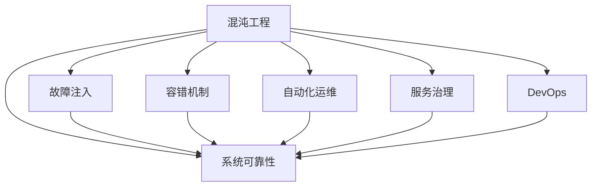

                 

# SRE混沌工程应用实践

> 关键词：混沌工程, 系统可靠性, 故障注入, 容错机制, 自动化运维, 服务治理, DevOps

## 1. 背景介绍

### 1.1 问题由来

在快速发展的IT行业中，系统的高可用性和稳定性是用户和企业最为关注的问题。随着云计算、微服务架构等技术的广泛应用，系统的复杂度和交互性不断增加，潜在的风险和挑战也随之而来。如何确保系统在各种情况下稳定运行，提高系统的可靠性和稳定性，成为SRE（Site Reliability Engineering）领域的核心课题。

混沌工程（Chaos Engineering）作为一种系统弹性和鲁棒性测试方法，通过故意引入扰动和故障，模拟真实环境中的潜在故障，检测和提升系统的稳定性和可恢复性。SRE通过实施混沌工程实践，可以在开发、测试和生产环境中对系统进行全面、深入的健壮性测试，从而提高系统的稳定性和健壮性，减少故障发生，保障业务连续性。

### 1.2 问题核心关键点

混沌工程的核心在于通过不断进行系统的扰动和恢复，找出系统的弱点和缺陷，通过优化和改进系统架构，提升系统的弹性、稳定性和可靠性。SRE通过引入混沌工程方法，不仅能够更好地发现和解决系统中的问题，还能够推动组织形成持续改进的机制，提升团队的专业水平和响应能力。

混沌工程的实施包括三个关键步骤：
1. 扰动引入：通过人为地引入扰动和故障，测试系统的稳定性和恢复能力。
2. 故障发现：通过监控系统的日志、异常和指标，识别出系统在扰动后的表现和问题。
3. 优化改进：根据故障发现的结果，优化和改进系统架构，增强系统的弹性和稳定性。

## 2. 核心概念与联系

### 2.1 核心概念概述

为更好地理解混沌工程在SRE中的应用，本节将介绍几个密切相关的核心概念：

- 混沌工程（Chaos Engineering）：通过故意引入扰动和故障，模拟真实环境中的潜在故障，检测和提升系统的稳定性和可恢复性。
- 系统可靠性（System Reliability）：系统在规定条件下、规定时间内完成规定功能的能力。
- 故障注入（Fault Injection）：在生产环境中故意引入故障，观察系统如何响应和恢复，找出潜在的故障点和改进点。
- 容错机制（Fault Tolerance）：系统设计的一种能力，使系统能够容忍一定的故障和错误，而不影响其正常运行。
- 自动化运维（Automated Operations）：利用自动化工具和流程，实现系统运维的自动化，减少人为干预和错误。
- 服务治理（Service Governance）：通过制定和执行服务治理规范，确保系统的高可用性、稳定性和安全性。
- DevOps：开发和运维的集成，通过持续交付、持续集成和持续监控等实践，提升软件交付效率和系统稳定性。

这些核心概念之间的逻辑关系可以通过以下Mermaid流程图来展示：



这个流程图展示了一些关键概念及其之间的关系：

1. 混沌工程是实现系统可靠性的重要手段，通过模拟各种故障场景，提升系统的稳定性和可恢复性。
2. 故障注入是混沌工程的核心技术之一，通过引入扰动和故障，测试系统的恢复能力。
3. 容错机制是系统可靠性的保障，使系统能够在部分故障时继续运行，保障业务连续性。
4. 自动化运维和DevOps实践，通过持续集成、持续交付和持续监控，提升软件的交付效率和系统的稳定性。
5. 服务治理通过制定和执行规范，确保系统的高可用性、稳定性和安全性。

这些概念共同构成了SRE中的系统稳定性建设框架，帮助SRE通过混沌工程实践提升系统的健壮性和弹性。

## 3. 核心算法原理 & 具体操作步骤

### 3.1 算法原理概述

混沌工程的实施基于一个基本的原则：通过不断进行系统的扰动和恢复，找出系统的弱点和缺陷，从而优化和改进系统架构，增强系统的弹性和稳定性。

实施混沌工程的流程一般包括以下几个步骤：

1. 定义扰动场景：根据系统的重要性和关键性，设计一些关键业务路径和关键组件的扰动场景。
2. 引入扰动：在生产环境中，通过各种手段（如降级、重试、服务降级等）模拟故障，观察系统的反应和恢复能力。
3. 故障发现：通过监控系统的日志、异常和指标，识别出系统在扰动后的表现和问题。
4. 优化改进：根据故障发现的结果，优化和改进系统架构，增强系统的弹性和稳定性。

### 3.2 算法步骤详解

以下是混沌工程在SRE中的应用步骤详解：

**Step 1: 定义扰动场景**
- 根据系统的业务特点和关键性，设计一些关键业务路径和关键组件的扰动场景。例如，对于电商平台的支付系统，可以设计延迟支付服务响应时间、限制支付金额、模拟服务降级等场景。
- 确定扰动的频率和幅度，根据系统的重要性和风险等级进行适当调整。

**Step 2: 引入扰动**
- 在生产环境中，通过各种手段模拟故障，观察系统的反应和恢复能力。例如，可以故意降低数据库的读写速度、限制服务的响应时间、模拟服务降级等。
- 使用自动化工具和脚本，将扰动操作集成到CI/CD流程中，实现扰动操作的自动化。

**Step 3: 故障发现**
- 通过监控系统的日志、异常和指标，识别出系统在扰动后的表现和问题。例如，使用Prometheus监控系统指标，记录服务响应时间、错误率、请求量等指标。
- 使用ELK Stack（Elasticsearch、Logstash、Kibana）等工具收集和分析日志数据，识别出异常行为和问题点。

**Step 4: 优化改进**
- 根据故障发现的结果，优化和改进系统架构，增强系统的弹性和稳定性。例如，可以通过增加缓存、负载均衡、服务降级等手段，提高系统的稳定性。
- 更新系统的配置和代码，修复潜在的故障点和性能瓶颈，增强系统的鲁棒性。

### 3.3 算法优缺点

混沌工程在提升系统可靠性和稳定性方面具有以下优点：
1. 主动发现问题：通过主动引入扰动和故障，提前发现系统中的潜在问题和缺陷。
2. 增强弹性：通过不断优化和改进系统架构，增强系统的弹性和鲁棒性。
3. 提升系统可靠性：通过持续的测试和改进，提高系统的稳定性和可恢复性。

同时，混沌工程也存在一定的局限性：
1. 引入扰动影响业务：在引入扰动时，可能会对正常业务造成一定影响，需要谨慎设计和评估。
2. 复杂度高：实施混沌工程需要大量的测试和优化工作，复杂度较高。
3. 需要专业技能：实施混沌工程需要具备系统架构、运维和故障排除等专业技能。

尽管存在这些局限性，但混沌工程仍然是提升系统稳定性和可靠性的重要手段。SRE通过引入混沌工程实践，能够系统性地测试和改进系统，确保系统在各种情况下稳定运行。

### 3.4 算法应用领域

混沌工程在多个领域得到了广泛应用，以下是一些典型应用场景：

- 金融行业：金融系统对稳定性和连续性要求极高，通过混沌工程可以有效发现和修复潜在的故障，保障金融服务的稳定运行。例如，在清算结算系统中，通过引入延迟和限制等扰动，测试系统的稳定性和恢复能力。
- 电商行业：电商平台需要处理大量的并发请求，通过混沌工程可以有效测试和优化系统的负载能力和容错能力。例如，在支付系统中，通过模拟服务降级和网络延迟等场景，测试系统的恢复能力和稳定性。
- 云计算：云计算平台需要保证服务的高可用性和稳定运行，通过混沌工程可以有效发现和修复系统中的漏洞和故障。例如，在云服务中间件中，通过引入故障注入和监控，提升系统的鲁棒性和稳定性。
- DevOps：DevOps实践中，通过持续集成和持续交付，不断进行系统的扰动和恢复测试，提升系统的稳定性和可靠性。例如，在CI/CD流程中，通过引入自动化测试和监控，保障系统的高可用性。

## 4. 数学模型和公式 & 详细讲解 & 举例说明

### 4.1 数学模型构建

混沌工程在SRE中的应用主要关注系统在扰动后的表现和恢复能力。数学模型可以通过定义系统的状态和扰动函数，来描述系统在扰动后的动态变化。

设系统在扰动前的状态为 $s_0$，扰动后的状态为 $s_t$，扰动函数为 $f$，则系统的动态变化可以表示为：

$$
s_t = f(s_0)
$$

其中，$f$ 表示系统的扰动函数，可以通过数学公式和仿真模型进行描述。例如，在电商平台的支付系统中，可以通过模拟延迟和降级等扰动，观察系统的恢复能力和稳定性。

### 4.2 公式推导过程

以一个简单的电商支付系统为例，说明如何定义和推导扰动函数。

假设支付系统中有两种支付模式：在线支付和离线支付。在线支付的响应时间为 $t_{on}$，离线支付的响应时间为 $t_{off}$。当系统正常运行时，在线支付的响应时间为 $t_{on}$，离线支付的响应时间为 $t_{off}$。当系统引入扰动后，在线支付的响应时间变为 $t_{on} + \delta_{on}$，离线支付的响应时间变为 $t_{off} + \delta_{off}$，其中 $\delta_{on}$ 和 $\delta_{off}$ 表示在线和离线支付的延迟量。

设系统在扰动前的状态为 $s_0$，扰动后的状态为 $s_t$，则系统的动态变化可以表示为：

$$
s_t = \begin{cases}
s_0 + \delta_{on} & \text{如果选择在线支付} \\
s_0 + \delta_{off} & \text{如果选择离线支付}
\end{cases}
$$

通过这个数学模型，可以清晰地描述系统在扰动后的动态变化，从而进行系统的故障发现和优化改进。

### 4.3 案例分析与讲解

以下是一个简单的电商支付系统扰动测试的案例分析：

**案例背景：**
某电商平台的支付系统在处理高峰期时，经常出现支付响应时间过长的情况。为了提升系统的稳定性，SRE团队决定引入混沌工程实践，进行系统的扰动测试。

**扰动场景设计：**
- 选择在线支付和离线支付作为关键业务路径，设计延迟支付响应时间和限制支付金额两个扰动场景。
- 延迟支付响应时间：随机延迟在线支付和离线支付的响应时间，观察系统的反应和恢复能力。
- 限制支付金额：随机限制在线支付和离线支付的最大支付金额，观察系统的反应和恢复能力。

**扰动引入和故障发现：**
- 使用自动化脚本和工具，在生产环境中引入延迟和限制等扰动。例如，使用Netflix的Chaos Monkey工具，自动地在支付系统中选择随机业务路径进行扰动。
- 监控系统的日志和指标，观察系统在扰动后的表现和恢复能力。例如，使用Prometheus和Grafana监控支付系统的响应时间、错误率和请求量等指标。

**优化改进：**
- 根据故障发现的结果，优化和改进系统架构，增强系统的弹性和稳定性。例如，增加缓存、负载均衡、服务降级等手段，提高系统的稳定性。
- 更新系统的配置和代码，修复潜在的故障点和性能瓶颈，增强系统的鲁棒性。例如，优化支付系统的负载均衡和缓存策略，提升系统的并发处理能力。

通过上述案例，可以看到，混沌工程在提升系统稳定性和可靠性的过程中，通过主动扰动和故障注入，发现和修复了系统的潜在问题和缺陷，从而优化和改进了系统架构，提高了系统的弹性。

## 5. 项目实践：代码实例和详细解释说明

### 5.1 开发环境搭建

在进行混沌工程实践前，我们需要准备好开发环境。以下是使用Python进行Python脚本的开发环境配置流程：

1. 安装Anaconda：从官网下载并安装Anaconda，用于创建独立的Python环境。

2. 创建并激活虚拟环境：
```bash
conda create -n chaos-env python=3.8 
conda activate chaos-env
```

3. 安装必要的Python包：
```bash
pip install numpy scipy matplotlib requests
```

4. 安装自动化测试工具：
```bash
pip install pytest
```

5. 安装日志收集和分析工具：
```bash
pip install elasticsearch
```

完成上述步骤后，即可在`chaos-env`环境中开始混沌工程实践。

### 5.2 源代码详细实现

下面我们以支付系统的扰动测试为例，给出使用Python进行混沌工程的代码实现。

首先，定义扰动场景和测试用例：

```python
import requests
import random
import time
import logging

# 定义扰动场景
def introduce_delay(url, delay):
    logging.info(f"Introducing delay of {delay} seconds for URL: {url}")
    time.sleep(delay)
    return requests.get(url)

def introduce_limit(url, limit):
    logging.info(f"Introducing limit of {limit} requests per minute for URL: {url}")
    headers = {'X-Limit': str(limit)}
    return requests.get(url, headers=headers)

# 定义测试用例
def test_payment_system(url):
    response = requests.get(url)
    if response.status_code == 200:
        logging.info("Payment successful")
    else:
        logging.error("Payment failed")
```

然后，定义扰动测试的自动化脚本：

```python
import pytest

# 定义测试场景
@pytest.mark.parametrize("url, delay", [
    ("https://example.com/payment/on", 5),
    ("https://example.com/payment/off", 10),
])
def test_payment_delay(url, delay):
    response = introduce_delay(url, delay)
    test_payment_system(url)

@pytest.mark.parametrize("url, limit", [
    ("https://example.com/payment/on", 5),
    ("https://example.com/payment/off", 10),
])
def test_payment_limit(url, limit):
    response = introduce_limit(url, limit)
    test_payment_system(url)
```

接着，定义监控和故障发现：

```python
from elasticsearch import Elasticsearch

# 定义监控指标
elasticsearch = Elasticsearch()

def monitor_response_time(url):
    while True:
        response = requests.get(url)
        response_time = response.elapsed.total_seconds()
        elasticsearch.index(index="payment_system", doc_type="response_time", body={"url": url, "response_time": response_time})
        time.sleep(5)
```

最后，启动扰动测试和监控：

```python
if __name__ == "__main__":
    # 运行自动化测试
    pytest.main()

    # 启动监控
    monitor_response_time("https://example.com/payment/on")
    monitor_response_time("https://example.com/payment/off")
```

### 5.3 代码解读与分析

让我们再详细解读一下关键代码的实现细节：

**定义扰动场景和测试用例**：
- `introduce_delay`函数：模拟在线支付和离线支付的延迟，引入随机延迟的扰动。
- `introduce_limit`函数：模拟在线支付和离线支付的请求限制，引入随机请求限制的扰动。
- `test_payment_system`函数：模拟支付请求，测试支付系统的响应能力。

**定义测试场景**：
- `test_payment_delay`和`test_payment_limit`函数：使用`pytest.mark.parametrize`装饰器，定义多个测试用例，测试不同场景下的系统表现。

**定义监控和故障发现**：
- `monitor_response_time`函数：通过Elasticsearch监控系统响应时间，记录日志。

**启动扰动测试和监控**：
- `pytest.main()`：运行自动化测试，发现系统在扰动后的表现和恢复能力。
- `monitor_response_time`：启动监控服务，持续收集和分析系统响应时间，发现故障和问题点。

通过上述代码实现，可以看到，混沌工程在SRE中的应用主要通过自动化脚本和工具，实现系统的扰动测试和故障发现。SRE通过持续的测试和改进，提升系统的稳定性和弹性。

## 6. 实际应用场景

### 6.1 智能客服系统

智能客服系统通过混沌工程实践，可以有效测试和优化系统的稳定性和健壮性。例如，在客服系统中，通过引入延迟和降级等扰动，测试系统的响应时间和恢复能力。在故障发现后，SRE团队可以及时修复系统漏洞，提升系统的稳定性。

### 6.2 金融服务

金融服务系统对稳定性和连续性要求极高。通过混沌工程实践，金融系统可以发现和修复潜在的故障，保障金融服务的稳定运行。例如，在支付系统中，通过引入延迟和限制等扰动，测试系统的恢复能力和稳定性。在故障发现后，SRE团队可以及时修复系统漏洞，提升系统的鲁棒性。

### 6.3 医疗系统

医疗系统对稳定性和安全性要求极高。通过混沌工程实践，医疗系统可以发现和修复潜在的故障，保障医疗服务的稳定运行。例如，在病历系统中，通过引入延迟和降级等扰动，测试系统的恢复能力和稳定性。在故障发现后，SRE团队可以及时修复系统漏洞，提升系统的鲁棒性。

### 6.4 未来应用展望

随着混沌工程实践的不断推广和深化，未来的SRE将在以下方面取得新的进展：

1. 自动化程度提升：通过引入更多的自动化工具和脚本，实现系统的自动扰动和故障发现，提升测试效率。
2. 智能化水平提高：利用人工智能和大数据分析技术，进行更智能的故障预测和问题识别，提高系统健壮性。
3. 多场景融合：在多个场景中推广混沌工程实践，提升系统的整体稳定性和鲁棒性。
4. 跨领域应用：将混沌工程实践推广到更多的行业和领域，推动更多的企业实现系统稳定性建设。

总之，随着混沌工程实践的不断深入，未来的SRE将实现更高的自动化、智能化和多场景融合，提升系统的稳定性和弹性，保障业务的连续性。

## 7. 工具和资源推荐

### 7.1 学习资源推荐

为了帮助开发者系统掌握混沌工程在SRE中的应用，这里推荐一些优质的学习资源：

1. 《Chaos Engineering with Netflix: Creating Resilient Systems from the Blameless Operations Revolution》书籍：Netflix的SRE团队所写，介绍了Netflix的混沌工程实践，详细阐述了如何通过混沌工程提升系统的稳定性和弹性。

2. 《Site Reliability Engineering: How Google Runs Production Systems》书籍：Google的SRE团队所写，介绍了Google的SRE实践，包括混沌工程、自动化运维、服务治理等内容。

3. 《Chaos Engineering: Lessons from Building a Reliable Service at Netflix》文章：Netflix的Doug Lea和Lynette DAngelo撰写的技术博客，详细介绍了Netflix的混沌工程实践和经验教训。

4. 《The Reliable Site: How to Build a Fault Tolerant System》书籍：Doug Lea撰写的经典书籍，系统介绍了如何构建一个可靠的系统，包括混沌工程、故障注入等内容。

5. 《Site Reliability Engineering: How Google Runs Production Systems》课程：Google的SRE团队开设的在线课程，详细讲解了SRE和混沌工程的理论和实践。

通过对这些资源的学习实践，相信你一定能够快速掌握混沌工程在SRE中的应用，并用于解决实际的系统稳定性问题。

### 7.2 开发工具推荐

高效的开发离不开优秀的工具支持。以下是几款用于混沌工程开发的常用工具：

1. Chaos Monkey：Netflix开发的混沌工程工具，可以在生产环境中随机扰动系统，测试系统的稳定性和恢复能力。

2. Resilience：云服务提供商AWS提供的混沌工程工具，可以在云环境中模拟各种故障场景，测试系统的弹性和恢复能力。

3. Netflix-Spekele：Netflix开发的可视化工具，帮助SRE团队监控和分析混沌工程的测试结果。

4. ELK Stack：Elasticsearch、Logstash、Kibana的组合，用于收集和分析日志数据，识别出系统在扰动后的表现和问题。

5. Prometheus：用于监控系统指标的开源工具，可以实时收集和分析系统的各种指标，帮助SRE团队进行故障发现和优化。

6. Grafana：用于可视化和分析系统指标的工具，可以实时展示系统指标的变化情况，帮助SRE团队进行监控和故障排除。

合理利用这些工具，可以显著提升混沌工程的实施效率，推动系统的稳定性和弹性建设。

### 7.3 相关论文推荐

混沌工程在SRE中的应用源于学界的持续研究。以下是几篇奠基性的相关论文，推荐阅读：

1. "Chaos Engineering: Guidelines on How to Break Things and Learn from Failure"：Netflix的Doug Lea撰写的文章，详细介绍了Netflix的混沌工程实践和经验教训。

2. "Fault Injection for Testing Service Robustness"：Patrick De Boeck等人撰写的文章，详细介绍了通过故障注入测试服务弹性的方法和实践。

3. "Chaos Engineering: The Modern Organization Design Team for a Resilient Organization"：Alberto Bertoglio等人撰写的文章，详细介绍了混沌工程在组织设计和团队建设中的应用。

4. "The Reliability Engineering Workshop: Reliability Engineering and Sustainable Development"：Alberto Bertoglio等人撰写的文章，详细介绍了可靠性和可持续发展在组织设计中的应用。

这些论文代表了大规模语言模型微调技术的发展脉络。通过学习这些前沿成果，可以帮助研究者把握学科前进方向，激发更多的创新灵感。

## 8. 总结：未来发展趋势与挑战

### 8.1 总结

本文对混沌工程在SRE中的应用进行了全面系统的介绍。首先阐述了混沌工程在提升系统稳定性和鲁棒性方面的核心思想和实施步骤，明确了混沌工程在SRE中的重要价值。其次，从原理到实践，详细讲解了混沌工程的数学模型和关键步骤，给出了混沌工程实践的完整代码实例。同时，本文还广泛探讨了混沌工程在智能客服、金融服务、医疗系统等多个行业领域的应用前景，展示了混沌工程实践的巨大潜力。此外，本文精选了混沌工程技术的各类学习资源，力求为读者提供全方位的技术指引。

通过本文的系统梳理，可以看到，混沌工程在SRE中的应用已经成为提升系统稳定性和鲁棒性的重要手段。SRE通过引入混沌工程实践，能够系统性地测试和改进系统，确保系统在各种情况下稳定运行。未来，伴随混沌工程实践的不断推广和深化，SRE将实现更高的自动化、智能化和多场景融合，提升系统的稳定性和弹性，保障业务的连续性。

### 8.2 未来发展趋势

展望未来，混沌工程在SRE中的应用将呈现以下几个发展趋势：

1. 自动化程度提升：通过引入更多的自动化工具和脚本，实现系统的自动扰动和故障发现，提升测试效率。
2. 智能化水平提高：利用人工智能和大数据分析技术，进行更智能的故障预测和问题识别，提高系统健壮性。
3. 多场景融合：在多个场景中推广混沌工程实践，提升系统的整体稳定性和鲁棒性。
4. 跨领域应用：将混沌工程实践推广到更多的行业和领域，推动更多的企业实现系统稳定性建设。

以上趋势凸显了混沌工程在SRE中的应用前景。这些方向的探索发展，将进一步提升系统的健壮性和弹性，保障业务的连续性和稳定性。

### 8.3 面临的挑战

尽管混沌工程在提升系统稳定性和鲁棒性方面已经取得了显著成就，但在迈向更加智能化、普适化应用的过程中，它仍面临着诸多挑战：

1. 引入扰动影响业务：在引入扰动时，可能会对正常业务造成一定影响，需要谨慎设计和评估。
2. 复杂度高：实施混沌工程需要大量的测试和优化工作，复杂度较高。
3. 需要专业技能：实施混沌工程需要具备系统架构、运维和故障排除等专业技能。
4. 数据分析难度大：需要从大量的日志和指标中提取和分析故障信息，难度较大。
5. 技术要求高：需要引入先进的技术工具和框架，进行系统的自动监控和故障排除。

尽管存在这些挑战，但混沌工程仍然是提升系统稳定性和鲁棒性的重要手段。SRE通过引入混沌工程实践，能够系统性地测试和改进系统，确保系统在各种情况下稳定运行。

### 8.4 未来突破

面对混沌工程在SRE中所面临的挑战，未来的研究需要在以下几个方面寻求新的突破：

1. 引入智能算法：利用人工智能和大数据分析技术，进行更智能的故障预测和问题识别，提高系统健壮性。例如，引入机器学习算法，对系统日志和指标进行智能分析和预警。

2. 优化扰动策略：通过不断优化和改进扰动策略，提升系统的稳定性和弹性。例如，引入动态扰动和渐进式扰动，避免对业务造成较大影响。

3. 跨领域融合：将混沌工程实践推广到更多的行业和领域，推动更多的企业实现系统稳定性建设。例如，在金融、医疗、电商等多个行业推广混沌工程实践，提升系统的稳定性和弹性。

4. 多模态融合：将混沌工程实践与多模态数据融合，提升系统的弹性和稳定性。例如，将混沌工程与图像、语音、视频等多模态数据进行融合，提升系统的综合能力。

这些研究方向的探索，将引领混沌工程在SRE中的应用走向更高的台阶，为构建安全、可靠、可解释、可控的智能系统铺平道路。面向未来，混沌工程技术还需要与其他人工智能技术进行更深入的融合，如知识表示、因果推理、强化学习等，多路径协同发力，共同推动自然语言理解和智能交互系统的进步。只有勇于创新、敢于突破，才能不断拓展混沌工程的应用边界，让智能技术更好地造福人类社会。

## 9. 附录：常见问题与解答

**Q1：混沌工程在SRE中的应用效果如何？**

A: 混沌工程在SRE中的应用效果显著。通过持续的扰动测试和优化改进，SRE团队能够系统性地发现和修复系统的潜在问题和缺陷，提升系统的稳定性和弹性。例如，在金融服务系统中，通过混沌工程实践，SRE团队发现并修复了多个系统漏洞，提升了系统的稳定性和鲁棒性，保障了金融服务的连续性。

**Q2：实施混沌工程需要哪些资源？**

A: 实施混沌工程需要以下资源：
1. 自动化工具和脚本：用于自动化扰动测试和故障发现。
2. 监控和日志工具：用于收集和分析系统的各种指标和日志。
3. 数据分析技术：用于从大量的日志和指标中提取和分析故障信息。
4. 专业技能：需要具备系统架构、运维和故障排除等专业技能。

**Q3：混沌工程与故障注入有何区别？**

A: 混沌工程和故障注入都是通过引入扰动和故障，模拟真实环境中的潜在故障，进行系统的测试和优化。但是，混沌工程不仅限于故障注入，还包括故障发现、优化改进等多个步骤，涵盖更广泛的测试范围和优化策略。

**Q4：如何优化混沌工程实践？**

A: 优化混沌工程实践的方法包括：
1. 引入智能算法：利用人工智能和大数据分析技术，进行更智能的故障预测和问题识别。
2. 优化扰动策略：通过不断优化和改进扰动策略，提升系统的稳定性和弹性。例如，引入动态扰动和渐进式扰动，避免对业务造成较大影响。
3. 跨领域融合：将混沌工程实践推广到更多的行业和领域，提升系统的整体稳定性和鲁棒性。
4. 多模态融合：将混沌工程实践与多模态数据融合，提升系统的弹性和稳定性。

这些优化方法将推动混沌工程在SRE中的应用更加深入和广泛，提升系统的稳定性和弹性。

**Q5：混沌工程在SRE中的实施难点有哪些？**

A: 混沌工程在SRE中的实施难点包括：
1. 引入扰动影响业务：在引入扰动时，可能会对正常业务造成一定影响，需要谨慎设计和评估。
2. 复杂度高：实施混沌工程需要大量的测试和优化工作，复杂度较高。
3. 需要专业技能：实施混沌工程需要具备系统架构、运维和故障排除等专业技能。
4. 数据分析难度大：需要从大量的日志和指标中提取和分析故障信息，难度较大。
5. 技术要求高：需要引入先进的技术工具和框架，进行系统的自动监控和故障排除。

尽管存在这些难点，但通过不断的优化和改进，SRE团队能够克服这些挑战，确保系统的稳定性和弹性。

---

作者：禅与计算机程序设计艺术 / Zen and the Art of Computer Programming

