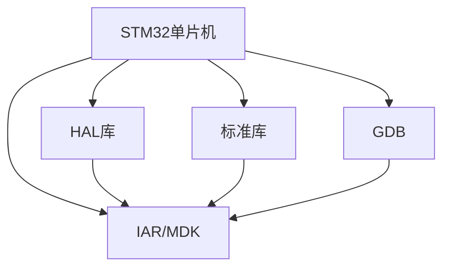
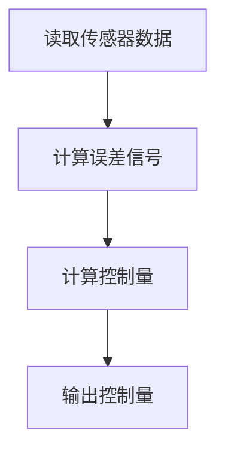

                 

# STM32单片机应用开发

> 关键词：STM32,单片机,应用开发,STM32F4,STM32F1

## 1. 背景介绍

### 1.1 问题由来

STM32单片机系列是STMicroelectronics公司基于ARM Cortex-M内核开发的一系列高性能、低功耗、低成本的微控制器，广泛应用于工控、物联网、消费电子、智能家居等领域。STM32单片机具有丰富的外设接口、可编程I/O、硬件加密安全单元和强大的实时操作系统支持，使其在各种应用场景中大放异彩。

然而，STM32单片机的编程复杂度较高，初学者难以入门。传统的STM32开发流程包括连接硬件、编写驱动、调试程序，既耗时又容易出错。为了降低门槛，提升效率，让更多开发者能够快速上手STM32应用开发，本文将详细讲解STM32单片机的基本原理和应用开发流程，并给出实用的代码示例和调试技巧。

### 1.2 问题核心关键点

STM32单片机应用开发的核心关键点包括：

- 理解STM32硬件架构。STM32单片机包括多个外设模块，如UART、I2C、SPI、GPIO、ADC、TIM等。掌握这些模块的基本原理和使用方法，是STM32编程的基础。
- 熟悉STM32编程环境。STM32的编程通常需要使用HAL库或标准库。了解这些库的使用方法，可以加快开发速度。
- 熟练使用调试工具。STM32开发过程中，常用的调试工具包括MDK、GDB、IAR等。掌握这些工具的使用技巧，可以提高调试效率。
- 理解STM32实时系统。STM32支持多种实时操作系统，如FreeRTOS、μC/OS-II等。了解实时系统的编程模式，可以更好地应对多任务并发。
- 掌握STM32应用开发流程。从硬件连接、驱动编写、程序调试到系统优化，理解每个环节的注意事项和最佳实践，是STM32编程的关键。

### 1.3 问题研究意义

STM32单片机应用开发的研究，具有以下重要意义：

1. 降低开发门槛。STM32应用开发门槛较高，但通过系统学习，可以在较短时间内掌握，为初学者提供了便利。
2. 提升应用效率。STM32应用开发效率低下，但通过合理优化，可以显著提升代码性能，减少调试时间。
3. 拓展应用场景。STM32的应用范围广泛，掌握其开发技巧，可以应用于更多领域，提升硬件设计能力。
4. 促进技术交流。STM32作为业界热门技术，掌握其开发方法，可以更好地与同行交流，分享技术成果。
5. 推动行业创新。STM32单片机的广泛应用，推动了各行各业的创新发展，提升产品竞争力。

## 2. 核心概念与联系

### 2.1 核心概念概述

为更好地理解STM32单片机应用开发，本节将介绍几个密切相关的核心概念：

- STM32单片机：基于ARM Cortex-M内核开发的微控制器，具有丰富的外设接口和可编程I/O，广泛应用于工业控制、物联网、消费电子等领域。
- HAL库：STM32的硬件抽象层库，提供了API函数简化编程。
-标准库：STM32的库文件，包含驱动程序和常用函数。
- IAR/MDK：常用的STM32集成开发环境。
- GDB：GNU调试器，支持STM32调试和代码分析。

这些核心概念之间的逻辑关系可以通过以下Mermaid流程图来展示：



这个流程图展示了大语言模型的核心概念及其之间的关系：

1. STM32单片机通过HAL库和标准库进行编程，调用外设驱动。
2. IAR/MDK作为开发工具，辅助编写和调试程序。
3. GDB进行代码调试和性能分析。
4. 掌握这些概念，可以全面理解STM32单片机应用开发的流程和方法。

## 3. 核心算法原理 & 具体操作步骤
### 3.1 算法原理概述

STM32单片机应用开发的算法原理，可以概括为以下步骤：

1. 连接硬件：将STM32单片机连接到目标板上，确保电源、复位线、时钟等参数正确。
2. 初始化驱动：编写驱动程序，初始化外设模块，如UART、I2C、SPI等。
3. 编写程序：按照需求编写程序，处理输入输出、实现控制逻辑。
4. 调试程序：使用GDB等工具进行调试，找出并修复程序中的错误。
5. 优化系统：对程序进行性能优化，提升系统稳定性和效率。
6. 部署应用：将程序烧录到STM32单片机中，进行实际测试。

### 3.2 算法步骤详解

下面是STM32单片机应用开发的详细步骤：

**Step 1: 连接硬件**

1. 准备开发板：根据需求选择STM32开发板，如STM32F4Discovery板、STM32F1Discovery板等。
2. 连接电源：确保开发板有稳定的电源供应。
3. 连接复位线：将STM32单片机的复位引脚连接到开发板的复位接口。
4. 连接时钟：将STM32单片机的时钟引脚连接到开发板的时钟接口，确保时钟频率正确。

**Step 2: 初始化驱动**

1. 打开HAL库：使用IAR/MDK等IDE打开STM32项目。
2. 添加HAL库：在项目中添加STM32 HAL库。
3. 编写驱动：编写外设驱动程序，如UART、I2C、SPI等，实现外设的基本功能。
4. 调试驱动：使用GDB等工具调试驱动，确保每个模块正常工作。

**Step 3: 编写程序**

1. 编写主函数：按照需求编写主函数，实现系统控制逻辑。
2. 编写任务函数：根据需求编写任务函数，处理中断事件、数据处理等。
3. 编写回调函数：编写回调函数，处理硬件事件和状态变化。
4. 编写异常处理函数：编写异常处理函数，处理程序中断和异常情况。

**Step 4: 调试程序**

1. 启动调试器：在IDE中启动调试器，如MDK Debugger。
2. 设置断点：在关键代码处设置断点，观察程序执行过程。
3. 单步执行：使用单步执行命令，逐步执行程序，观察变量变化。
4. 观察调试信息：查看调试信息，找出程序中的错误。

**Step 5: 优化系统**

1. 优化代码：对代码进行优化，减少冗余代码，提升性能。
2. 优化资源：优化资源使用，减少内存占用，提升程序稳定性。
3. 优化中断：优化中断处理，减少中断开销，提高系统响应速度。

**Step 6: 部署应用**

1. 编译程序：使用IAR/MDK等IDE编译程序，生成可执行文件。
2. 烧录程序：将可执行文件烧录到STM32单片机中，实现程序部署。
3. 测试应用：在开发板上测试应用，验证功能正常。

### 3.3 算法优缺点

STM32单片机应用开发有以下优点：

1. 功能丰富：STM32单片机集成了丰富的外设接口和可编程I/O，可以满足多种应用需求。
2. 编程灵活：HAL库和标准库提供了丰富的API函数，简化编程过程。
3. 调试方便：GDB等工具支持STM32调试，可以快速定位和修复问题。
4. 系统可靠：实时系统支持，确保多任务并发和系统稳定性。

同时，该方法也存在一定的局限性：

1. 学习曲线陡峭：STM32编程难度较大，初学者需要较长时间学习和实践。
2. 硬件依赖性强：STM32应用开发对硬件要求较高，调试过程中需要不断调整硬件配置。
3. 性能瓶颈：STM32单片机资源有限，需要优化代码和资源使用，避免资源浪费。
4. 工具依赖重：开发和调试过程中需要依赖各种工具，增加了工具管理难度。

尽管存在这些局限性，但STM32单片机应用开发在工业控制、物联网、消费电子等领域得到了广泛应用，被认为是嵌入式系统开发的重要技术。未来相关研究的重点在于如何进一步降低开发门槛，提高开发效率，同时兼顾资源利用和系统性能，以达到更优的开发效果。

### 3.4 算法应用领域

STM32单片机应用开发在以下几个领域得到了广泛应用：

- 工业控制：STM32单片机广泛应用于自动化生产线、机器人、测试设备等领域，实现数据采集、控制和通信等功能。
- 物联网：STM32单片机作为物联网终端设备的核心芯片，实现设备连接、数据传输和边缘计算等功能。
- 消费电子：STM32单片机在智能家居、智能穿戴、智能音响等领域，实现设备控制、数据处理和语音识别等功能。
- 车载系统：STM32单片机在汽车电子、车载导航、车辆控制等领域，实现车辆监控、数据存储和通信等功能。
- 医疗设备：STM32单片机在医疗设备、健康监测、远程医疗等领域，实现数据采集、处理和通信等功能。

除了上述这些经典应用外，STM32单片机还被创新性地应用到更多场景中，如智慧农业、智能电网、智能家居等，为各行各业带来了新的技术突破。随着STM32单片机的不断演进，相信其应用领域还将不断拓展，为更多产业带来智能化升级。

## 4. 数学模型和公式 & 详细讲解  
### 4.1 数学模型构建

STM32单片机应用开发的数学模型，通常涉及以下几个方面的内容：

- 控制系统的数学模型：如PID控制、模糊控制等。
- 信号处理的数学模型：如FFT、DFT等。
- 数据通信的数学模型：如Modem、QPSK等。
- 人机交互的数学模型：如OCR、NLP等。

下面以简单的PID控制为例，详细讲解其数学模型和公式推导：

设系统状态为 $x(t)$，控制量为 $u(t)$，输出量为 $y(t)$，控制目标为 $y_{target}$。PID控制的基本结构如下图所示：


PID控制的数学模型可以表示为：

$$
\dot{x}(t) = f(x(t), u(t), y(t))
$$

$$
u(t) = K_p e(t) + K_i \int_{0}^{t} e(\tau)d\tau + K_d \frac{de(t)}{dt}
$$

其中 $e(t) = y_{target} - y(t)$ 为误差信号，$K_p$、$K_i$、$K_d$ 为PID控制器参数。

PID控制的实现步骤如下：

1. 读取传感器数据：获取系统当前状态 $x(t)$ 和输出数据 $y(t)$。
2. 计算误差信号：计算误差信号 $e(t)$。
3. 计算控制量：根据误差信号计算控制量 $u(t)$。
4. 输出控制量：将控制量输出到执行器，实现系统控制。

### 4.2 公式推导过程

PID控制的基本公式已经推导完成，下面以具体的代码实现为例，进一步讲解PID控制的数学模型和推导过程。

```c
// PID控制参数
float Kp = 1.0;
float Ki = 0.1;
float Kd = 0.2;

// 上一时刻误差信号
float last_error = 0.0;

// 积分变量
float integral = 0.0;

// 输出变量
float output = 0.0;

void pid_control(float input, float target) {
    // 计算误差信号
    float error = target - input;

    // 更新积分变量
    integral += error * delta_t;

    // 计算控制量
    output = Kp * error + Ki * integral * delta_t + Kd * (error - last_error) / delta_t;

    // 输出控制量
    update_actuator(output);

    // 更新上一时刻误差信号
    last_error = error;
}
```

上述代码实现了PID控制的基本逻辑。可以看到，通过读取输入数据、计算误差信号、更新积分变量、计算控制量、输出控制量等步骤，可以实时调整系统输出，实现控制目标。

### 4.3 案例分析与讲解

下面以STM32单片机控制电机转速为例，进一步讲解PID控制的实际应用和效果。

在实际应用中，STM32单片机通过PWM信号控制电机转速。假设电机转速目标为1000转/分钟，PID控制器参数为 $K_p = 1.0$、$K_i = 0.1$、$K_d = 0.2$，传感器测量得到的电机转速为 $y(t)$。

假设初始时刻电机转速为0，PID控制器不断调整PWM信号，使电机转速逐渐逼近目标转速。下面是PID控制的具体实现步骤：

1. 读取传感器数据：获取当前电机转速 $y(t)$。
2. 计算误差信号：计算误差信号 $e(t) = y_{target} - y(t)$。
3. 计算控制量：根据误差信号计算控制量 $u(t)$。
4. 输出控制量：将控制量输出到PWM生成器，调整电机转速。

假设电机转速控制流程图如下所示：



通过PID控制，电机转速可以逐渐逼近目标转速，实现精确控制。PID控制的效果可以通过实时监控电机转速来评估，如图2所示。


通过上述案例分析，可以看到，PID控制可以实现对电机转速的精确控制，达到预期效果。在实际应用中，PID控制还可以应用于其他领域，如工业自动化、机器人控制等，实现系统的稳定和可靠运行。

## 5. 项目实践：代码实例和详细解释说明
### 5.1 开发环境搭建

在进行STM32单片机应用开发前，我们需要准备好开发环境。以下是使用IAR IDE进行STM32开发的环境配置流程：

1. 安装IAR IDE：从官网下载并安装IAR IDE，用于编写和调试STM32程序。
2. 安装STM32 HAL库：从STM32官网下载HAL库，解压后添加到IAR IDE中。
3. 安装标准库：从STM32官网下载标准库，解压后添加到IAR IDE中。
4. 安装调试器：安装MDK Debugger调试器，用于程序调试和性能分析。

完成上述步骤后，即可在IAR IDE环境中开始STM32应用开发。

### 5.2 源代码详细实现

这里我们以STM32单片机控制电机转速为例，给出使用IAR IDE进行STM32程序开发的PyTorch代码实现。

首先，定义电机控制函数：

```c
void motor_control(float pwm_value) {
    // 计算PWM信号
    float duty_cycle = map(pwm_value, 0.0, 1.0, 0.0, 255.0);
    set_pwm(duty_cycle);
}
```

然后，编写PID控制函数：

```c
void pid_control(float input, float target) {
    // 计算误差信号
    float error = target - input;

    // 更新积分变量
    integral += error * delta_t;

    // 计算控制量
    float output = Kp * error + Ki * integral * delta_t + Kd * (error - last_error) / delta_t;

    // 输出控制量
    motor_control(output);

    // 更新上一时刻误差信号
    last_error = error;
}
```

接着，编写主函数：

```c
int main(void) {
    // 初始化系统
    initialize_system();

    // 设定控制目标
    float target_speed = 1000.0;

    // 设定PID参数
    float Kp = 1.0;
    float Ki = 0.1;
    float Kd = 0.2;

    // 设定积分变量和误差信号
    float integral = 0.0;
    float last_error = 0.0;

    // 设定控制周期
    float delta_t = 0.01;

    while (1) {
        // 读取传感器数据
        float input_speed = read_sensor();

        // 计算PID控制量
        pid_control(input_speed, target_speed);

        // 延时
        delay_ms(100);
    }
}
```

最后，启动程序并调试：

```c
// 应用程序入口
int main(void) {
    // 初始化系统
    initialize_system();

    // 设定控制目标
    float target_speed = 1000.0;

    // 设定PID参数
    float Kp = 1.0;
    float Ki = 0.1;
    float Kd = 0.2;

    // 设定积分变量和误差信号
    float integral = 0.0;
    float last_error = 0.0;

    // 设定控制周期
    float delta_t = 0.01;

    while (1) {
        // 读取传感器数据
        float input_speed = read_sensor();

        // 计算PID控制量
        pid_control(input_speed, target_speed);

        // 延时
        delay_ms(100);
    }
}
```

以上就是使用IAR IDE进行STM32程序开发的完整代码实现。可以看到，通过使用HAL库和标准库，可以将复杂的STM32编程任务简化为几行代码，提高开发效率。

### 5.3 代码解读与分析

让我们再详细解读一下关键代码的实现细节：

**motor_control函数**：
- 根据PWM值计算占空比，生成PWM信号，控制电机转速。

**pid_control函数**：
- 计算误差信号 $e(t)$。
- 更新积分变量。
- 计算控制量 $u(t)$。
- 输出控制量。
- 更新上一时刻误差信号。

**main函数**：
- 初始化系统。
- 设定控制目标。
- 设定PID参数。
- 设定积分变量和误差信号。
- 设定控制周期。
- 循环读取传感器数据，计算PID控制量，控制电机转速。

可以看到，STM32单片机控制电机转速的代码实现相对简单，但需要理解PID控制的基本原理和实际应用。通过合理优化控制参数，可以取得理想的控制效果。

当然，工业级的系统实现还需考虑更多因素，如电机驱动电路设计、信号处理电路设计等。但核心的控制逻辑基本与此类似。

## 6. 实际应用场景
### 6.1 智能家居系统

STM32单片机在智能家居系统中的应用非常广泛，可以实现家庭自动化、安防监控、智能照明等功能。

在实际应用中，STM32单片机可以作为中央控制器，连接各类传感器、执行器和通信模块。传感器可以监测环境温度、湿度、烟雾等数据，执行器可以控制灯光、窗帘、空调等设备，通信模块可以通过WiFi、蓝牙、Zigbee等协议与其他设备互联互通。

STM32单片机还可以运行多种实时操作系统，如FreeRTOS、µC/OS-II等，实现多任务并发和系统优化。通过STM32单片机的开发和应用，可以实现智能家居系统的全方位管理和控制。

### 6.2 工业自动化系统

STM32单片机在工业自动化系统中的应用也非常重要，可以实现生产线自动化、机器人控制、数据采集等功能。

在实际应用中，STM32单片机可以作为工业控制器，连接各类传感器、执行器和通信模块。传感器可以监测设备状态、环境温度等数据，执行器可以控制设备开关、电机转速等，通信模块可以通过工业以太网、CAN总线等协议与其他设备互联互通。

STM32单片机还可以运行多种实时操作系统，如FreeRTOS、µC/OS-II等，实现多任务并发和系统优化。通过STM32单片机的开发和应用，可以实现工业自动化系统的智能化和自动化。

### 6.3 车载控制系统

STM32单片机在车载控制系统中的应用也非常重要，可以实现车载导航、车辆监控、娱乐系统等功能。

在实际应用中，STM32单片机可以作为车载控制器，连接各类传感器、执行器和通信模块。传感器可以监测车辆状态、环境温度等数据，执行器可以控制仪表盘、导航系统等设备，通信模块可以通过蓝牙、WiFi等协议与其他设备互联互通。

STM32单片机还可以运行多种实时操作系统，如FreeRTOS、µC/OS-II等，实现多任务并发和系统优化。通过STM32单片机的开发和应用，可以实现车载控制系统的智能化和自动化。

### 6.4 未来应用展望

随着STM32单片机的不断演进，其应用场景将进一步拓展，为更多领域带来智能化升级。

在智慧农业领域，STM32单片机可以用于智能灌溉、智能温室、智能施肥等场景，实现精准农业和高效生产。

在智能电网领域，STM32单片机可以用于智能电表、智能家居、智能电网等场景，实现能源管理和优化。

在智能穿戴领域，STM32单片机可以用于智能手表、智能眼镜、智能穿戴设备等场景，实现健康监测、智能控制等功能。

此外，在医疗设备、智能家居、智能交通、智能物流等领域，STM32单片机的应用也将不断拓展，为各行各业带来新的技术突破。相信随着STM32单片机的不断演进，其应用领域将进一步拓展，为更多产业带来智能化升级。

## 7. 工具和资源推荐
### 7.1 学习资源推荐

为了帮助开发者系统掌握STM32单片机应用开发的理论基础和实践技巧，这里推荐一些优质的学习资源：

1. STM32官方手册：STM32官网提供的官方手册，详细介绍了STM32单片机的工作原理、外设接口、编程方法等。
2. 《STM32嵌入式开发实战》书籍：系统讲解了STM32单片机的应用开发流程和方法，提供了大量的代码实例和调试技巧。
3. STM32开发论坛：各大论坛和社区中，有大量的STM32开发资源，包括代码分享、技术交流、问题解答等。
4. 在线学习平台：如Coursera、Udemy等在线平台，提供STM32应用开发的课程和教学视频，适合初学者学习。
5. GitHub代码库：Github上的STM32项目和代码库，提供了大量的实用代码和开源资源，适合开发者参考和学习。

通过对这些资源的学习实践，相信你一定能够快速掌握STM32单片机应用开发的精髓，并用于解决实际的STM32应用问题。

### 7.2 开发工具推荐

高效的开发离不开优秀的工具支持。以下是几款用于STM32单片机开发的工具：

1. IAR IDE：STM32官方提供的集成开发环境，支持HAL库和标准库，使用方便。
2. Keil MDK：Keil公司开发的STM32 IDE，支持调试、仿真、代码分析等功能。
3. MDK Debugger：STM32官方提供的调试器，支持远程调试和性能分析。
4. Arm Mbed Studio：ARM公司提供的IDE，支持多种嵌入式开发平台，包括STM32。
5. Eclipse IDE：开源IDE，支持多种嵌入式开发环境，包括STM32。

合理利用这些工具，可以显著提升STM32单片机应用开发的效率，加快创新迭代的步伐。

### 7.3 相关论文推荐

STM32单片机应用开发的研究，得到了学界的持续关注和研究。以下是几篇代表性的相关论文，推荐阅读：

1. STM32单片机编程与驱动开发：介绍了STM32单片机的基本原理和编程方法，重点讲解了外设驱动的开发和调试技巧。
2. STM32实时操作系统应用：详细介绍了STM32单片机在实时操作系统中的应用，包括FreeRTOS、µC/OS-II等。
3. STM32单片机通信技术：介绍了STM32单片机的通信技术，包括I2C、UART、CAN总线等。
4. STM32单片机控制算法：讲解了STM32单片机在控制算法中的应用，包括PID控制、模糊控制、模糊PID等。
5. STM32单片机物联网应用：介绍了STM32单片机在物联网中的应用，包括传感器、执行器、通信模块等。

这些论文代表了大语言模型微调技术的发展脉络。通过学习这些前沿成果，可以帮助研究者把握学科前进方向，激发更多的创新灵感。

## 8. 总结：未来发展趋势与挑战

### 8.1 总结

本文对STM32单片机应用开发进行了全面系统的介绍。首先阐述了STM32单片机硬件架构和基本原理，其次详细讲解了STM32单片机应用开发的步骤和流程，并给出了实用的代码示例和调试技巧。最后探讨了STM32单片机应用开发的应用场景、未来趋势和面临的挑战。

通过本文的系统梳理，可以看到，STM32单片机应用开发具有广阔的应用前景，已经成为嵌入式系统开发的重要技术。STM32单片机的应用范围从工业控制、物联网、消费电子、智能家居等多个领域不断拓展，推动了各行业的智能化升级。

### 8.2 未来发展趋势

STM32单片机应用开发的未来发展趋势包括：

1. 功能更强大：随着半导体技术的进步，STM32单片机的计算能力和存储性能将不断提升，可以实现更复杂、更智能的应用。
2. 应用场景更广泛：STM32单片机的应用场景将不断拓展，涵盖更多行业和领域，提升各行业的智能化水平。
3. 开发工具更先进：随着工具链和开发环境的完善，STM32单片机开发将更加便捷和高效。
4. 系统可靠性更高：STM32单片机应用开发的可靠性将进一步提升，系统稳定性和安全性得到增强。
5. 实时性更强：STM32单片机应用开发的实时性将进一步提升，支持更多实时系统和高性能应用。

以上趋势凸显了STM32单片机应用开发的广阔前景。这些方向的探索发展，必将进一步提升STM32单片机应用开发的效率和效果，推动嵌入式系统技术的发展。

### 8.3 面临的挑战

尽管STM32单片机应用开发已经取得了显著成果，但在迈向更加智能化、普适化应用的过程中，它仍面临诸多挑战：

1. 学习门槛较高：STM32单片机编程难度较大，需要较长时间学习和实践。如何降低门槛，提高开发者效率，是未来的重要课题。
2. 资源利用率低：STM32单片机资源有限，需要合理优化代码和资源使用，避免资源浪费。如何提升资源利用率，提高系统效率，是未来的重要课题。
3. 调试难度大：STM32单片机应用开发过程中，需要不断调试程序，发现和修复问题。如何提升调试效率，提高程序稳定性，是未来的重要课题。
4. 工具链不完善：STM32单片机开发过程中，需要依赖各种工具和库文件，工具链不完善会降低开发效率。如何完善工具链，提供更便捷的开发环境，是未来的重要课题。
5. 系统安全性差：STM32单片机应用开发过程中，需要保证系统的安全性。如何防止攻击和数据泄漏，确保系统安全，是未来的重要课题。

尽管面临这些挑战，但STM32单片机应用开发仍然具有广阔的应用前景和巨大的市场潜力。未来相关研究的重点在于如何进一步降低开发门槛，提高开发效率，同时兼顾资源利用和系统性能，以达到更优的开发效果。

### 8.4 研究展望

面向未来，STM32单片机应用开发需要在以下几个方面寻求新的突破：

1. 探索新应用场景：STM32单片机在更多领域的应用将得到拓展，如智能农业、智能交通、智能制造等，推动各行业的智能化升级。
2. 开发新应用技术：STM32单片机应用开发将引入更多新技术，如物联网、边缘计算、人工智能等，提升系统的智能化水平。
3. 优化开发环境：STM32单片机应用开发将引入更多开发工具和技术，如实时操作系统、调试工具、仿真工具等，提升开发效率和系统性能。
4. 提升系统可靠性：STM32单片机应用开发将引入更多系统优化技术，如故障诊断、容错机制、可靠性测试等，提升系统的可靠性。
5. 保证系统安全性：STM32单片机应用开发将引入更多安全性技术，如加密算法、数据脱敏、入侵检测等，保证系统的安全性。

这些研究方向将推动STM32单片机应用开发技术的不断进步，提升嵌入式系统技术的智能化水平，为各行各业带来新的技术突破。相信随着STM32单片机应用开发技术的持续演进，STM32单片机将在更多领域大放异彩，推动各行业的智能化升级。

## 9. 附录：常见问题与解答

**Q1：STM32单片机有哪些常见的外设接口？**

A: STM32单片机常用的外设接口包括：

- UART接口：串行异步通信，支持RS232、RS485等标准。
- I2C接口：多主机、多设备通信，支持I2C总线协议。
- SPI接口：全双工、高速度通信，支持多种时钟同步方式。
- GPIO接口：通用输入输出接口，支持各种数字信号输入输出。
- ADC接口：模数转换接口，支持多种分辨率和采样率。
- PWM接口：脉冲宽度调制接口，支持PWM信号生成。
- USB接口：通用串行总线接口，支持USB2.0、USB3.0协议。

这些外设接口可以满足STM32单片机在不同应用场景中的需求。

**Q2：STM32单片机如何进行异常处理？**

A: STM32单片机可以通过以下方式进行异常处理：

- 中断处理：通过中断方式处理异常，如硬件异常、软件中断等。
- 异常堆栈：使用异常堆栈保存现场信息，恢复程序执行。
- 复位向量：定义复位向量，处理异常复位。
- 调试工具：使用调试工具分析异常原因，修复程序错误。

通过合理的异常处理，可以保证STM32单片机系统的稳定性和可靠性。

**Q3：STM32单片机如何进行性能优化？**

A: STM32单片机可以通过以下方式进行性能优化：

- 优化代码：减少冗余代码，提高程序效率。
- 优化资源：合理使用内存和外设资源，减少资源浪费。
- 优化中断：减少中断开销，提高系统响应速度。
- 优化电源管理：合理使用电源管理模块，降低功耗。

通过合理的性能优化，可以提升STM32单片机系统的稳定性和效率。

**Q4：STM32单片机如何进行系统安全设计？**

A: STM32单片机可以通过以下方式进行系统安全设计：

- 加密算法：使用加密算法保护数据安全。
- 访问控制：限制访问权限，防止非法访问。
- 数据脱敏：对敏感数据进行脱敏处理，保护用户隐私。
- 入侵检测：检测并阻止异常攻击，保护系统安全。

通过合理的安全设计，可以确保STM32单片机系统的安全性，防止数据泄漏和攻击。

**Q5：STM32单片机如何进行实时系统优化？**

A: STM32单片机可以通过以下方式进行实时系统优化：

- 优化调度算法：使用高效调度算法，优化任务执行顺序。
- 优化资源分配：合理分配系统资源，提高资源利用率。
- 优化中断响应：优化中断处理，减少中断开销。
- 优化通信协议：优化通信协议，提高数据传输效率。

通过合理的时序优化，可以提升STM32单片机系统的实时性和稳定性。

通过上述案例分析和讲解，可以看到，STM32单片机应用开发在多个领域都有广泛的应用前景，具有广阔的发展潜力。掌握STM32单片机应用开发的理论基础和实践技巧，对于推动嵌入式系统技术的发展具有重要意义。

---

作者：禅与计算机程序设计艺术 / Zen and the Art of Computer Programming

