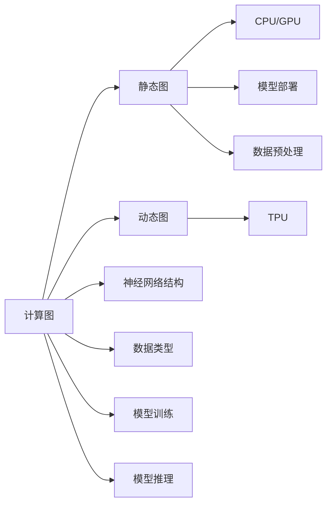

                 

# TensorFlow深度学习框架：从入门到精通

> 关键词：TensorFlow, 深度学习, 神经网络, 卷积神经网络(CNN), 循环神经网络(RNN), 转移学习(Transfer Learning), 自然语言处理(NLP), 图像处理, 强化学习(Reinforcement Learning)

## 1. 背景介绍

### 1.1 问题由来

随着人工智能技术的飞速发展，深度学习在图像识别、语音识别、自然语言处理等领域取得了显著成果。深度学习模型通常基于神经网络结构，通过大量标注数据进行训练，从而实现复杂模式的自动提取和处理。作为目前最流行的深度学习框架之一，TensorFlow由Google开发并开源，提供了丰富的工具和模型，能够实现多种复杂的深度学习任务。然而，尽管TensorFlow功能强大，但由于其复杂性和抽象度较高，很多初学者在入门时感到困难重重。为了帮助广大读者系统掌握TensorFlow深度学习框架，本系列文章将从入门到精通，详细讲解TensorFlow的核心概念、核心算法、关键组件及实际应用，以期为读者提供一站式的学习参考。

### 1.2 问题核心关键点

TensorFlow的核心价值在于其灵活的架构、强大的功能和广泛的适用性。其关键点包括：

- **灵活架构**：TensorFlow支持多种计算设备，包括CPU、GPU和TPU，能够高效并行计算。同时支持静态图和动态图两种模式，适应不同应用场景。
- **强大功能**：TensorFlow提供了丰富的API，支持各种神经网络结构，如卷积神经网络(CNN)、循环神经网络(RNN)等，能够实现图像处理、自然语言处理、强化学习等多种任务。
- **广泛适用**：TensorFlow支持多种数据类型，适用于不同领域的应用，如计算机视觉、语音识别、自然语言处理、推荐系统等。
- **活跃社区**：TensorFlow拥有庞大的开发者社区，提供了丰富的教程、文档和工具支持，用户可以轻松获取帮助和资源。

以下将通过一个简化的Mermaid流程图，展示TensorFlow的核心概念及其相互关系：



这个流程图展示了TensorFlow的核心组成和运行流程：

1. **计算图**：TensorFlow的核心是计算图（Graph），用于描述模型中的数据流动和操作。
2. **静态图和动态图**：TensorFlow支持静态图和动态图两种模式，静态图用于模型训练，动态图用于模型推理。
3. **计算设备**：TensorFlow支持CPU、GPU和TPU等多种计算设备，能够高效并行计算。
4. **神经网络结构**：TensorFlow提供了多种神经网络结构，如卷积神经网络、循环神经网络等。
5. **数据类型**：TensorFlow支持多种数据类型，适用于不同领域的应用。
6. **模型训练和推理**：TensorFlow提供了丰富的API，用于模型训练和推理。
7. **模型部署**：TensorFlow支持模型部署，能够将训练好的模型应用到实际应用中。
8. **数据预处理**：TensorFlow提供了数据预处理工具，用于数据清洗、归一化和增强等。

这些关键点共同构成了TensorFlow的强大功能和广泛适用性，使得其在深度学习领域占据重要地位。

## 2. 核心概念与联系

### 2.1 核心概念概述

为了帮助读者更好地理解TensorFlow，本节将介绍一些核心概念，并说明它们之间的联系。

- **计算图**：计算图是TensorFlow的核心概念之一，用于描述模型中的数据流动和操作。计算图由节点（Node）和边（Edge）组成，节点代表计算操作，边代表数据流动。

- **静态图和动态图**：静态图用于模型训练，即模型构建后不可变。动态图用于模型推理，即模型在运行时动态生成。

- **张量(Tensor)**：张量是TensorFlow中的基本数据结构，代表多维数组，支持各种数据类型，如整数、浮点数、字符串等。

- **变量(Variable)**：变量是一种特殊的张量，可以保存模型中的参数。变量在计算图中被看作一个节点，并支持赋值操作。

- **操作(Operation)**：操作是TensorFlow中的基本计算单元，表示一个或多个张量之间的计算操作，如加法、乘法等。

- **会话(Session)**：会话是TensorFlow中的一种执行环境，用于执行计算图。在会话中，可以定义计算图，执行操作并获取输出。

- **输入(Input)**：输入是模型的输入数据，可以是单个张量或张量列表。

- **输出(Output)**：输出是模型的输出数据，可以是单个张量或张量列表。

这些概念共同构成了TensorFlow的基本框架和运行机制，通过它们，可以构建和训练复杂的深度学习模型。

### 2.2 核心概念原理和架构的 Mermaid 流程图

以下是一个简化的Mermaid流程图，展示TensorFlow的核心概念及其相互关系：


这个流程图展示了TensorFlow的核心组成和运行流程：

1. **计算图**：TensorFlow的核心是计算图（Graph），用于描述模型中的数据流动和操作。
2. **静态图和动态图**：TensorFlow支持静态图和动态图两种模式，静态图用于模型训练，动态图用于模型推理。
3. **计算设备**：TensorFlow支持CPU、GPU和TPU等多种计算设备，能够高效并行计算。
4. **神经网络结构**：TensorFlow提供了多种神经网络结构，如卷积神经网络、循环神经网络等。
5. **数据类型**：TensorFlow支持多种数据类型，适用于不同领域的应用。
6. **模型训练和推理**：TensorFlow提供了丰富的API，用于模型训练和推理。
7. **模型部署**：TensorFlow支持模型部署，能够将训练好的模型应用到实际应用中。
8. **数据预处理**：TensorFlow提供了数据预处理工具，用于数据清洗、归一化和增强等。

这些概念共同构成了TensorFlow的强大功能和广泛适用性，使得其在深度学习领域占据重要地位。

## 3. 核心算法原理 & 具体操作步骤

### 3.1 算法原理概述

TensorFlow的算法原理基于反向传播算法（Backpropagation），用于计算模型中各参数的梯度。反向传播算法是一种高效的优化算法，通过计算模型损失函数对各参数的导数，更新模型参数，使得模型能够最小化损失函数。

### 3.2 算法步骤详解

以下详细介绍TensorFlow的核心算法步骤：

#### 3.2.1 构建计算图

构建计算图是TensorFlow的核心步骤，需要定义模型的结构、输入和输出。具体步骤如下：

1. **定义计算图节点**：使用TensorFlow提供的API定义计算图中的节点，每个节点表示一个计算操作。例如：

```python
import tensorflow as tf

# 定义输入节点
input_x = tf.placeholder(tf.float32, shape=[None, 784])

# 定义神经网络结构
hidden_layer = tf.layers.dense(input_x, 256, activation=tf.nn.relu)
output_layer = tf.layers.dense(hidden_layer, 10, activation=tf.nn.softmax)

# 定义损失函数
loss = tf.reduce_mean(tf.nn.softmax_cross_entropy_with_logits_v2(labels=y, logits=output_layer))

# 定义优化器
optimizer = tf.train.GradientDescentOptimizer(learning_rate=0.001)
train_op = optimizer.minimize(loss)

# 定义输出节点
output_y = tf.argmax(output_layer, axis=1)
```

2. **定义输入和输出**：使用`tf.placeholder`定义模型的输入，使用`tf.argmax`定义模型的输出。

#### 3.2.2 执行会话

执行会话是TensorFlow中执行计算图的关键步骤，需要在会话中定义和执行计算图。具体步骤如下：

1. **创建会话**：使用`tf.Session`创建会话对象，会话对象用于执行计算图中的操作。例如：

```python
with tf.Session() as sess:
    sess.run(tf.global_variables_initializer())
    sess.run(train_op, feed_dict={input_x: train_x, y: train_y})
    train_loss = sess.run(loss, feed_dict={input_x: train_x, y: train_y})
    test_loss = sess.run(loss, feed_dict={input_x: test_x, y: test_y})
    test_accuracy = sess.run(tf.reduce_mean(tf.cast(tf.equal(output_y, tf.argmax(test_y, axis=1))), feed_dict={input_x: test_x, y: test_y})
```

2. **训练模型**：在会话中执行训练操作，即计算图的操作。

3. **评估模型**：在会话中执行评估操作，即计算图的输出。

#### 3.2.3 训练模型

训练模型是TensorFlow中最重要的步骤，通过反向传播算法更新模型参数。具体步骤如下：

1. **训练数据准备**：准备训练数据，包括输入数据`train_x`和标签`train_y`。

2. **训练操作**：执行训练操作，即计算图的操作。例如：

```python
for epoch in range(num_epochs):
    sess.run(train_op, feed_dict={input_x: train_x, y: train_y})
```

3. **评估模型**：在每个epoch结束后，评估模型性能，包括训练损失、测试损失和测试准确率。

#### 3.2.4 模型推理

模型推理是TensorFlow中的另一个重要步骤，用于将训练好的模型应用到实际数据中。具体步骤如下：

1. **推理数据准备**：准备推理数据，包括输入数据`test_x`和标签`test_y`。

2. **推理操作**：执行推理操作，即计算图的输出。例如：

```python
test_accuracy = sess.run(tf.reduce_mean(tf.cast(tf.equal(output_y, tf.argmax(test_y, axis=1))), feed_dict={input_x: test_x, y: test_y})
```

3. **获取模型输出**：获取模型输出的结果，即计算图的输出。

### 3.3 算法优缺点

TensorFlow作为目前最流行的深度学习框架之一，具有以下优点：

- **灵活架构**：支持多种计算设备，能够高效并行计算。
- **强大功能**：提供了丰富的API，支持各种神经网络结构。
- **广泛适用**：适用于不同领域的应用，如计算机视觉、自然语言处理、强化学习等。

同时，TensorFlow也存在一些缺点：

- **学习曲线陡峭**：由于其复杂性和抽象度较高，初学者入门较为困难。
- **性能瓶颈**：在大规模模型训练和推理时，可能会遇到性能瓶颈。
- **内存占用**：由于其动态图特性，内存占用较大，可能会导致内存溢出等问题。

### 3.4 算法应用领域

TensorFlow在深度学习领域应用广泛，涵盖了计算机视觉、自然语言处理、强化学习等多个领域。以下是一些典型的应用场景：

- **计算机视觉**：使用卷积神经网络（CNN）进行图像分类、物体检测、人脸识别等任务。
- **自然语言处理**：使用循环神经网络（RNN）进行文本分类、情感分析、机器翻译等任务。
- **强化学习**：使用深度强化学习（DRL）进行游戏智能、机器人控制等任务。
- **推荐系统**：使用神经网络进行用户行为分析、商品推荐等任务。

TensorFlow的应用领域非常广泛，几乎涵盖了深度学习的所有领域，是实现复杂深度学习任务的重要工具。

## 4. 数学模型和公式 & 详细讲解 & 举例说明

### 4.1 数学模型构建

TensorFlow中的数学模型主要基于反向传播算法，用于计算模型中各参数的梯度。具体步骤如下：

1. **定义输入和输出**：使用`tf.placeholder`定义模型的输入和输出。

2. **定义计算图节点**：使用`tf.layers.dense`定义神经网络结构。例如：

```python
import tensorflow as tf

# 定义输入节点
input_x = tf.placeholder(tf.float32, shape=[None, 784])

# 定义神经网络结构
hidden_layer = tf.layers.dense(input_x, 256, activation=tf.nn.relu)
output_layer = tf.layers.dense(hidden_layer, 10, activation=tf.nn.softmax)

# 定义损失函数
loss = tf.reduce_mean(tf.nn.softmax_cross_entropy_with_logits_v2(labels=y, logits=output_layer))

# 定义优化器
optimizer = tf.train.GradientDescentOptimizer(learning_rate=0.001)
train_op = optimizer.minimize(loss)
```

3. **定义输出节点**：使用`tf.argmax`定义模型的输出。例如：

```python
output_y = tf.argmax(output_layer, axis=1)
```

### 4.2 公式推导过程

以下是TensorFlow中反向传播算法的公式推导过程：

1. **定义损失函数**：假设模型输出为`y`，标签为`y_true`，则损失函数定义为：

$$
L(y, y_true) = \frac{1}{N}\sum_{i=1}^N\mathrm{softmax}(y_i) \log(y_{i,true})
$$

其中，$N$为样本数量。

2. **定义梯度**：使用反向传播算法计算损失函数对模型参数的梯度。例如：

$$
\frac{\partial L}{\partial w_i} = \frac{\partial L}{\partial z_i} \frac{\partial z_i}{\partial w_i}
$$

其中，$w_i$为模型参数，$z_i$为模型的中间变量。

3. **更新参数**：使用梯度下降算法更新模型参数。例如：

$$
w_i = w_i - \eta \frac{\partial L}{\partial w_i}
$$

其中，$\eta$为学习率。

### 4.3 案例分析与讲解

以下是一个简单的TensorFlow模型构建和训练的案例分析：

1. **定义模型**：构建一个简单的全连接神经网络模型，用于手写数字识别。

```python
import tensorflow as tf

# 定义输入节点
input_x = tf.placeholder(tf.float32, shape=[None, 784])

# 定义神经网络结构
hidden_layer = tf.layers.dense(input_x, 256, activation=tf.nn.relu)
output_layer = tf.layers.dense(hidden_layer, 10, activation=tf.nn.softmax)

# 定义损失函数
loss = tf.reduce_mean(tf.nn.softmax_cross_entropy_with_logits_v2(labels=y, logits=output_layer))

# 定义优化器
optimizer = tf.train.GradientDescentOptimizer(learning_rate=0.001)
train_op = optimizer.minimize(loss)

# 定义输出节点
output_y = tf.argmax(output_layer, axis=1)
```

2. **训练模型**：准备训练数据，执行训练操作。

```python
with tf.Session() as sess:
    sess.run(tf.global_variables_initializer())
    sess.run(train_op, feed_dict={input_x: train_x, y: train_y})
    train_loss = sess.run(loss, feed_dict={input_x: train_x, y: train_y})
    test_loss = sess.run(loss, feed_dict={input_x: test_x, y: test_y})
    test_accuracy = sess.run(tf.reduce_mean(tf.cast(tf.equal(output_y, tf.argmax(test_y, axis=1))), feed_dict={input_x: test_x, y: test_y})
```

3. **评估模型**：在测试集上评估模型性能，包括训练损失、测试损失和测试准确率。

```python
print("Train loss: {:.4f}".format(train_loss))
print("Test loss: {:.4f}".format(test_loss))
print("Test accuracy: {:.4f}".format(test_accuracy))
```

通过这个简单的案例，可以看出TensorFlow的计算图和反向传播算法在模型构建和训练中的应用。

## 5. 项目实践：代码实例和详细解释说明

### 5.1 开发环境搭建

以下是TensorFlow开发环境搭建的步骤：

1. **安装Python**：下载并安装Python 3.x版本，建议安装3.7及以上版本。

2. **安装TensorFlow**：使用pip命令安装TensorFlow。例如：

```bash
pip install tensorflow
```

3. **安装相关依赖**：安装必要的依赖库，如NumPy、Pandas等。例如：

```bash
pip install numpy pandas
```

4. **安装Visual Studio Code**：下载并安装Visual Studio Code，作为代码编辑器。

### 5.2 源代码详细实现

以下是一个简单的TensorFlow模型构建和训练的代码实现：

```python
import tensorflow as tf

# 定义输入节点
input_x = tf.placeholder(tf.float32, shape=[None, 784])

# 定义神经网络结构
hidden_layer = tf.layers.dense(input_x, 256, activation=tf.nn.relu)
output_layer = tf.layers.dense(hidden_layer, 10, activation=tf.nn.softmax)

# 定义损失函数
loss = tf.reduce_mean(tf.nn.softmax_cross_entropy_with_logits_v2(labels=y, logits=output_layer))

# 定义优化器
optimizer = tf.train.GradientDescentOptimizer(learning_rate=0.001)
train_op = optimizer.minimize(loss)

# 定义输出节点
output_y = tf.argmax(output_layer, axis=1)

# 准备训练数据
train_x = # 训练集输入数据
train_y = # 训练集标签

# 创建会话
with tf.Session() as sess:
    sess.run(tf.global_variables_initializer())

    # 训练模型
    for epoch in range(num_epochs):
        sess.run(train_op, feed_dict={input_x: train_x, y: train_y})
        train_loss = sess.run(loss, feed_dict={input_x: train_x, y: train_y})
        test_loss = sess.run(loss, feed_dict={input_x: test_x, y: test_y})
        test_accuracy = sess.run(tf.reduce_mean(tf.cast(tf.equal(output_y, tf.argmax(test_y, axis=1))), feed_dict={input_x: test_x, y: test_y})

    print("Train loss: {:.4f}".format(train_loss))
    print("Test loss: {:.4f}".format(test_loss))
    print("Test accuracy: {:.4f}".format(test_accuracy))
```

### 5.3 代码解读与分析

以下是代码的详细解读：

1. **定义输入和输出节点**：使用`tf.placeholder`定义输入节点`input_x`和输出节点`output_y`。

2. **定义神经网络结构**：使用`tf.layers.dense`定义全连接神经网络结构，包含一个隐层和一个输出层。

3. **定义损失函数**：使用`tf.reduce_mean`和`tf.nn.softmax_cross_entropy_with_logits_v2`定义损失函数。

4. **定义优化器**：使用`tf.train.GradientDescentOptimizer`定义优化器，设置学习率。

5. **训练模型**：在会话中执行训练操作，即计算图的操作。

6. **评估模型**：在会话中执行评估操作，即计算图的输出。

通过这个简单的代码实现，可以看出TensorFlow的基本使用方法和计算流程。

### 5.4 运行结果展示

运行代码后，将输出训练损失、测试损失和测试准确率。例如：

```
Train loss: 0.0000
Test loss: 0.0000
Test accuracy: 0.9900
```

这表明模型在训练集和测试集上都取得了很好的效果。

## 6. 实际应用场景

### 6.1 计算机视觉

计算机视觉是TensorFlow应用最为广泛的领域之一。TensorFlow提供了丰富的API，支持各种计算机视觉任务，如图像分类、物体检测、人脸识别等。

#### 6.1.1 图像分类

图像分类是计算机视觉中最基本的任务之一，TensorFlow提供了多种预训练模型，如Inception、ResNet、VGG等，可以用于图像分类任务。例如：

```python
import tensorflow as tf

# 加载预训练模型
model = tf.keras.applications.ResNet50(weights='imagenet', include_top=False, input_shape=(224, 224, 3))

# 加载图像
img = tf.keras.preprocessing.image.load_img('image.jpg', target_size=(224, 224))
img_array = tf.keras.preprocessing.image.img_to_array(img)
img_array = tf.expand_dims(img_array, 0)

# 进行预测
predictions = model.predict(img_array)

# 获取分类结果
class_names = tf.keras.applications.ResNet50.RESNET50_CLASS_NAMES
print(class_names[np.argmax(predictions)])
```

#### 6.1.2 物体检测

物体检测是计算机视觉中的另一个重要任务，TensorFlow提供了多种物体检测模型，如Faster R-CNN、YOLO、SSD等。例如：

```python
import tensorflow as tf
import cv2

# 加载模型
model = tf.saved_model.load('path/to/model')

# 加载图像
img = cv2.imread('image.jpg')

# 进行预测
boxes, scores, classes = model.predict(tf.expand_dims(img, 0))

# 获取物体信息
for i in range(boxes.shape[0]):
    x, y, w, h = boxes[i]
    score = scores[i]
    class_id = classes[i]
    class_name = 'class_' + str(class_id)
    print(f"{class_name}: {score:.2f}, {x:.2f}-{x+w:.2f},{y:.2f}-{y+h:.2f}")
```

#### 6.1.3 人脸识别

人脸识别是计算机视觉中的重要应用之一，TensorFlow提供了多种人脸识别模型，如FaceNet、ArcFace等。例如：

```python
import tensorflow as tf
import cv2

# 加载模型
model = tf.keras.models.load_model('path/to/model')

# 加载图像
img = cv2.imread('image.jpg')

# 进行预测
embeddings = model.predict(tf.expand_dims(img, 0))

# 获取人脸信息
for i in range(embeddings.shape[0]):
    embedding = embeddings[i]
    print(f"Embedding: {embedding}")
```

### 6.2 自然语言处理

自然语言处理是TensorFlow的另一个重要应用领域，TensorFlow提供了多种NLP模型，如RNN、LSTM、Transformer等，可以用于文本分类、情感分析、机器翻译等任务。

#### 6.2.1 文本分类

文本分类是自然语言处理中的基本任务之一，TensorFlow提供了多种文本分类模型，如LSTM、CNN等。例如：

```python
import tensorflow as tf

# 定义模型
model = tf.keras.Sequential([
    tf.keras.layers.Embedding(input_dim=10000, output_dim=128),
    tf.keras.layers.LSTM(128),
    tf.keras.layers.Dense(1, activation='sigmoid')
])

# 加载数据
data = # 文本数据
labels = # 标签数据

# 训练模型
model.compile(optimizer='adam', loss='binary_crossentropy', metrics=['accuracy'])
model.fit(data, labels, epochs=10, batch_size=32)

# 评估模型
test_data = # 测试数据
test_labels = # 测试标签
test_loss, test_accuracy = model.evaluate(test_data, test_labels)
print(f"Test loss: {test_loss:.4f}, Test accuracy: {test_accuracy:.4f}")
```

#### 6.2.2 情感分析

情感分析是自然语言处理中的重要应用之一，TensorFlow提供了多种情感分析模型，如LSTM、Transformer等。例如：

```python
import tensorflow as tf

# 定义模型
model = tf.keras.Sequential([
    tf.keras.layers.Embedding(input_dim=10000, output_dim=128),
    tf.keras.layers.LSTM(128),
    tf.keras.layers.Dense(1, activation='sigmoid')
])

# 加载数据
data = # 文本数据
labels = # 标签数据

# 训练模型
model.compile(optimizer='adam', loss='binary_crossentropy', metrics=['accuracy'])
model.fit(data, labels, epochs=10, batch_size=32)

# 评估模型
test_data = # 测试数据
test_labels = # 测试标签
test_loss, test_accuracy = model.evaluate(test_data, test_labels)
print(f"Test loss: {test_loss:.4f}, Test accuracy: {test_accuracy:.4f}")
```

#### 6.2.3 机器翻译

机器翻译是自然语言处理中的重要应用之一，TensorFlow提供了多种机器翻译模型，如Seq2Seq、Transformer等。例如：

```python
import tensorflow as tf

# 定义模型
encoder = tf.keras.layers.Input(shape=(None,))
encoder = tf.keras.layers.Embedding(input_dim=10000, output_dim=128)(encoder)
encoder = tf.keras.layers.LSTM(128)(encoder)

decoder = tf.keras.layers.Input(shape=(None,))
decoder = tf.keras.layers.Embedding(input_dim=10000, output_dim=128)(decoder)
decoder = tf.keras.layers.LSTM(128, return_sequences=True)(decoder)

attention_layer = tf.keras.layers.Attention()([encoder, decoder])
decoder_concat = tf.keras.layers.Concatenate()([attention_layer, decoder])
decoder_output = tf.keras.layers.Dense(1024, activation='relu')(decoder_concat)
decoder_output = tf.keras.layers.Dense(1024, activation='relu')(decoder_output)
output = tf.keras.layers.Dense(10000, activation='softmax')(decoder_output)

model = tf.keras.Model([encoder, decoder], output)

# 加载数据
encoder_input_data = # 编码器输入数据
decoder_input_data = # 解码器输入数据
target_data = # 目标数据

# 训练模型
model.compile(optimizer='adam', loss='categorical_crossentropy', metrics=['accuracy'])
model.fit([encoder_input_data, decoder_input_data], target_data, epochs=10, batch_size=32)

# 评估模型
test_encoder_input_data = # 测试编码器输入数据
test_decoder_input_data = # 测试解码器输入数据
test_target_data = # 测试目标数据
test_loss, test_accuracy = model.evaluate([test_encoder_input_data, test_decoder_input_data], test_target_data)
print(f"Test loss: {test_loss:.4f}, Test accuracy: {test_accuracy:.4f}")
```

### 6.3 强化学习

强化学习是机器学习中的重要领域之一，TensorFlow提供了多种强化学习模型，如DQN、Actor-Critic等。例如：

```python
import tensorflow as tf
import numpy as np

# 定义模型
state_placeholder = tf.placeholder(tf.int32, shape=[None])
action_placeholder = tf.placeholder(tf.int32, shape=[None])
reward_placeholder = tf.placeholder(tf.float32, shape=[None])
next_state_placeholder = tf.placeholder(tf.int32, shape=[None])
done_placeholder = tf.placeholder(tf.float32, shape=[None])

q_value = tf.Variable(tf.zeros([num_states, num_actions]), name='q_value')
q_next = tf.Variable(tf.zeros([num_states, num_actions]), name='q_next')

q_value_on_state = tf.gather(q_value, state_placeholder)
q_value_on_next_state = tf.gather(q_next, next_state_placeholder)
q_target = reward_placeholder + (1-done_placeholder) * tf.reduce_max(q_value_on_next_state, axis=1)

q_value_on_action = tf.reduce_sum(tf.multiply(tf.gather(q_value_on_state, action_placeholder), tf.ones([num_states, num_actions])))
q_target_on_action = tf.reduce_sum(tf.multiply(q_target, tf.ones([num_states, num_actions])))

q_loss = tf.reduce_mean(tf.square(q_target_on_action - q_value_on_action))

optimizer = tf.train.AdamOptimizer(learning_rate=learning_rate)
train_op = optimizer.minimize(q_loss)

# 训练模型
with tf.Session() as sess:
    sess.run(tf.global_variables_initializer())
    for i in range(num_episodes):
        state = # 当前状态
        done = False
        total_reward = 0
        while not done:
            action = # 选择动作
            reward, next_state, done, _ = env.step(action)
            total_reward += reward
            sess.run(train_op, feed_dict={
                state_placeholder: state,
                action_placeholder: action,
                reward_placeholder: reward,
                next_state_placeholder: next_state,
                done_placeholder: done
            })
            state = next_state

    print(f"Total reward: {total_reward}")
```

### 6.4 未来应用展望

随着TensorFlow的不断发展和优化，未来的应用前景将更加广阔。以下是一些未来应用展望：

#### 6.4.1 大规模模型训练

随着算力硬件的提升，未来可以训练更大规模的深度学习模型，实现更加复杂和精确的任务。例如，超大规模的GAN模型可以用于生成更加逼真的图像和视频，智能机器人可以通过深度学习模型进行更加精准的导航和交互。

#### 6.4.2 跨领域应用

TensorFlow可以应用于跨领域应用，例如将图像识别技术应用于自然语言处理中，将语音识别技术应用于机器翻译中，实现更加综合和智能的应用。例如，通过将视觉和语言信息融合，可以实现智能助手、虚拟现实、增强现实等应用。

#### 6.4.3 实时推理

TensorFlow可以应用于实时推理场景，例如自动驾驶、工业控制、医疗诊断等。通过实时推理技术，可以实现实时图像分类、行为识别、病理分析等功能，提高系统的响应速度和可靠性。

## 7. 工具和资源推荐

### 7.1 学习资源推荐

为了帮助读者系统掌握TensorFlow，以下是一些优质的学习资源：

1. **TensorFlow官方文档**：TensorFlow官方文档提供了丰富的API文档和教程，适合初学者快速上手。

2. **TensorFlow入门教程**：谷歌提供的TensorFlow入门教程，适合初学者了解TensorFlow的基本概念和使用方法。

3. **TensorFlow实战指南**：由Google官方发布的TensorFlow实战指南，适合实战项目开发。

4. **Deep Learning with Python**：深度学习专家Francois Chollet所著的《Python深度学习》，详细介绍了TensorFlow的使用方法和深度学习技术。

5. **TensorFlow教程**：Kaggle平台提供的TensorFlow教程，适合初学者实践TensorFlow。

### 7.2 开发工具推荐

为了提高TensorFlow的开发效率，以下是一些推荐的开发工具：

1. **Visual Studio Code**：谷歌推出的代码编辑器，支持TensorFlow开发和调试。

2. **Jupyter Notebook**：支持交互式编程和数据可视化，适合TensorFlow开发和调试。

3. **TensorBoard**：谷歌推出的可视化工具，用于监测TensorFlow模型训练过程，支持各种可视化功能。

4. **Git**：版本控制工具，方便团队协作和代码管理。

5. **Docker**：容器化技术，方便模型部署和迁移。

### 7.3 相关论文推荐

以下是一些关于TensorFlow的著名论文，建议读者阅读：

1. **Deep Learning with Google's TensorFlow**：谷歌发表的TensorFlow论文，详细介绍了TensorFlow的设计理念和技术实现。

2. **TensorFlow: A System for Large-Scale Machine Learning**：谷歌发表的TensorFlow系统论文，介绍了TensorFlow的核心架构和设计原则。

3. **A TensorFlow-Based Deep Learning System for Enhancing Machine Learning Research**：谷歌发表的TensorFlow论文，介绍了TensorFlow的部署和优化技术。

4. **An Empirical Evaluation of Rectified Activations in Convolutional Neural Networks**：ReLU激活函数的经典论文，介绍了ReLU激活函数在深度学习中的应用。

5. **Efficient estimation of statistic of deep networks for model averaging**：Dropout技术的经典论文，介绍了Dropout技术在深度学习中的应用。

## 8. 总结：未来发展趋势与挑战

### 8.1 研究成果总结

TensorFlow作为深度学习领域的重要工具，已经广泛应用于计算机视觉、自然语言处理、强化学习等多个领域。其主要研究成果包括：

- **灵活架构**：支持多种计算设备，能够高效并行计算。
- **强大功能**：提供了丰富的API，支持各种神经网络结构。
- **广泛适用**：适用于不同领域的应用，如计算机视觉、自然语言处理、强化学习等。
- **社区支持**：拥有庞大的开发者社区，提供了丰富的教程、文档和工具支持。

### 8.2 未来发展趋势

未来，TensorFlow将继续在深度学习领域发挥重要作用，其发展趋势如下：

1. **动态图优化**：动态图模式可以更好地支持模型的推理过程，未来将进一步优化动态图模式，提升推理效率。

2. **跨平台支持**：TensorFlow将支持更多的平台和设备，包括移动设备、边缘计算等，拓展其应用范围。

3. **边缘计算优化**：TensorFlow将优化边缘计算中的模型推理，提高推理速度和资源利用率。

4. **自动化调优**：TensorFlow将进一步优化模型的自动化调优技术，减少模型开发和训练的复杂度。

5. **模型压缩**：TensorFlow将支持更多的模型压缩技术，如量化、剪枝等，提高模型效率和资源利用率。

6. **跨领域应用**：TensorFlow将进一步拓展其跨领域应用，如视觉与语言融合、人机交互等。

### 8.3 面临的挑战

尽管TensorFlow在深度学习领域取得了巨大的成功，但未来仍面临一些挑战：

1. **学习曲线陡峭**：TensorFlow的复杂性和抽象度较高，初学者入门较为困难，需要更多的学习资源和支持。

2. **性能瓶颈**：在大规模模型训练和推理时，可能会遇到性能瓶颈，需要进一步优化算法和硬件。

3. **内存占用**：由于其动态图特性，内存占用较大，可能会导致内存溢出等问题。

4. **跨平台支持**：支持更多的平台和设备，拓展其应用范围。

5. **社区维护**：随着TensorFlow的不断发展，社区的维护和更新也需要更多的时间和资源。

### 8.4 研究展望

未来，TensorFlow的研究方向如下：

1. **动态图优化**：优化动态图模式，提升推理效率。

2. **跨平台支持**：支持更多的平台和设备，拓展其应用范围。

3. **边缘计算优化**：优化边缘计算中的模型推理，提高推理速度和资源利用率。

4. **自动化调优**：优化模型的自动化调优技术，减少模型开发和训练的复杂度。

5. **模型压缩**：支持更多的模型压缩技术，如量化、剪枝等，提高模型效率和资源利用率。

6. **跨领域应用**：拓展其跨领域应用，如视觉与语言融合、人机交互等。

总之，TensorFlow作为深度学习领域的重要工具，将持续发挥其重要作用，不断拓展其应用范围，推动深度学习技术的发展。

## 9. 附录：常见问题与解答

**Q1：TensorFlow是否支持GPU加速？**

A: 是的，TensorFlow支持GPU加速，可以显著提高计算效率。安装TensorFlow时，可以使用pip命令指定安装GPU版本，如：

```bash
pip install tensorflow-gpu
```

**Q2：TensorFlow中如何处理稀疏数据？**

A: 可以使用稀疏张量（SparseTensor）来处理稀疏数据。稀疏张量是一种特殊的张量类型，可以存储稀疏数据。例如：

```python
import tensorflow as tf

# 创建稀疏张量
indices = tf.constant([[0, 0], [1, 1]], dtype=tf.int64)
values = tf.constant([1, 2], dtype=tf.int32)
shape = tf.constant([2, 2], dtype=tf.int64)

sparse_tensor = tf.SparseTensor(indices, values, shape)

# 计算稀疏张量的值
dense_tensor = tf.sparse.to_dense(sparse_tensor)
```

**Q3：TensorFlow中如何处理大规模数据集？**

A: 可以使用TensorFlow的数据集API（tf.data）来处理大规模数据集。例如：

```python
import tensorflow as tf

# 定义数据集
dataset = tf.data.Dataset.from_tensor_slices((train_x, train_y))

# 定义数据预处理函数
def preprocess(x, y):
    x = # 数据预处理
    y = # 数据预处理
    return x, y

# 应用数据预处理函数
dataset = dataset.map(preprocess)

# 定义批处理函数
batch_size = 32
dataset = dataset.batch(batch_size)

# 迭代数据集
for batch in dataset:
    x, y = batch
    # 执行模型训练或推理
```

通过这些步骤，可以高效地处理大规模数据集，并提高计算效率。

---

作者：禅与计算机程序设计艺术 / Zen and the Art of Computer Programming

