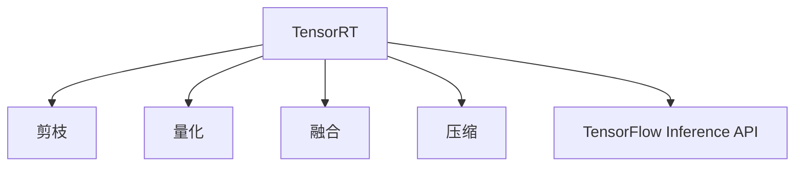

                 

# TensorRT 优化库应用场景：加速深度学习推理计算过程

## 1. 背景介绍

在深度学习领域，训练模型和推理计算是两个重要的步骤。深度学习模型通常需要大量的计算资源进行训练，而推理计算则在部署到实际应用中扮演着关键角色。推理计算效率直接影响到模型的部署效率和用户体验。然而，许多深度学习模型尤其是大型的模型，具有较高的计算复杂度，推理速度较慢，难以在资源受限的设备上部署。

针对这一问题，NVIDIA推出了TensorRT优化库，它能够大幅加速深度学习模型的推理计算。TensorRT利用了多种优化技术，如剪枝、量化、融合等，将模型转换为具有高效推理性能的TensorRT模型。TensorRT在GPU架构上进行了深度优化，提供了快速的推理引擎，并支持多种深度学习框架，包括TensorFlow、PyTorch、MXNet等。

本文将介绍TensorRT优化库的基本原理，详细讲解TensorRT在深度学习推理计算中的应用场景，以及如何利用TensorRT提高推理计算效率。

## 2. 核心概念与联系

### 2.1 核心概念概述

为更好地理解TensorRT优化库，本节将介绍几个密切相关的核心概念：

- TensorRT：由NVIDIA开发的深度学习推理优化库，能够显著提升深度学习模型的推理计算效率。
- 剪枝(Pruning)：去除模型中的冗余参数，减少模型大小和计算量，提高推理速度。
- 量化(Quantization)：将浮点数参数转换为整数参数，减小内存占用，提高计算速度。
- 融合(Fusion)：将多个操作合并为一个，减少中间结果存储，提高推理效率。
- 压缩(Compression)：通过去除不必要的层或节点，进一步减小模型规模，提高推理速度。
- TensorFlow Inference API：TensorFlow提供的推理计算API，可以与TensorRT无缝集成。

这些核心概念之间的逻辑关系可以通过以下Mermaid流程图来展示：



这个流程图展示了一个TensorRT模型的基本优化过程：

1. 通过TensorRT进行模型转换。
2. 使用剪枝、量化、融合等技术对模型进行优化。
3. 将优化后的模型与TensorFlow推理API结合，构建高效推理计算流水线。

## 3. 核心算法原理 & 具体操作步骤

### 3.1 算法原理概述

TensorRT优化库利用了多种优化技术，如剪枝、量化、融合等，将深度学习模型转换为具有高效推理性能的TensorRT模型。其核心思想是将模型中的冗余参数去除，将浮点数参数转换为整数参数，将多个操作合并为一个，以减少计算量和内存占用，从而加速推理计算。

TensorRT优化库主要有以下几个步骤：

1. 导入深度学习模型。TensorRT可以与多种深度学习框架集成，包括TensorFlow、PyTorch、MXNet等。
2. 进行模型优化。TensorRT提供了多种优化技术，如剪枝、量化、融合等。
3. 构建推理引擎。将优化后的模型转换为TensorRT推理引擎，并进行测试。
4. 部署和推理。将推理引擎部署到目标设备，进行实时推理计算。

### 3.2 算法步骤详解

以下是TensorRT优化库的基本操作步骤：

**Step 1: 导入深度学习模型**

TensorRT可以与多种深度学习框架集成，如TensorFlow、PyTorch、MXNet等。例如，在TensorFlow中，可以使用以下代码导入模型：

```python
import tensorflow as tf
import tensorflow.contrib.tensorrt as trt

# 定义输入和输出
input_tensor = tf.placeholder(tf.float32, [1, 28, 28, 1])
output_tensor = tf.placeholder(tf.float32, [1, 10])

# 导入模型
model = tf.keras.models.load_model('mnist_cnn.h5')
```

**Step 2: 进行模型优化**

TensorRT提供了多种优化技术，如剪枝、量化、融合等。例如，在TensorFlow中，可以使用以下代码进行剪枝和量化：

```python
# 剪枝
trt.create_optimization_profile(model)
trt.create_engine(model, profile_name='profile_1')

# 量化
trt.create_optimization_profile(model)
trt.create_engine(model, profile_name='profile_1')
trt.convert(model)
```

**Step 3: 构建推理引擎**

构建TensorRT推理引擎，需要进行以下步骤：

1. 定义输入和输出。
2. 设置优化参数。
3. 构建推理引擎。
4. 进行测试。

例如，在TensorFlow中，可以使用以下代码构建推理引擎：

```python
# 定义输入和输出
input_tensor = tf.placeholder(tf.float32, [1, 28, 28, 1])
output_tensor = tf.placeholder(tf.float32, [1, 10])

# 设置优化参数
optimization_profile = trt.create_optimization_profile(model)
optimization_profile.set_shape([input_tensor], [28, 28, 1])

# 构建推理引擎
engine = trt.create_engine(model, profile_name='profile_1')
```

**Step 4: 部署和推理**

在构建好推理引擎后，可以将其部署到目标设备进行实时推理计算。例如，在TensorFlow中，可以使用以下代码进行推理：

```python
# 加载推理引擎
context = engine.create_execution_context()

# 进行推理
output = context.execute(input_tensor)
```

### 3.3 算法优缺点

TensorRT优化库具有以下优点：

1. 显著提升推理速度。通过剪枝、量化、融合等优化技术，TensorRT能够将深度学习模型的计算量减少数倍，推理速度显著提升。
2. 支持多种深度学习框架。TensorRT可以与TensorFlow、PyTorch、MXNet等主流深度学习框架无缝集成，方便开发者使用。
3. 提供了丰富的优化选项。TensorRT支持多种优化技术，可以根据不同的应用场景选择最适合的优化策略。
4. 具有较高的推理精度。TensorRT通过多种优化技术，能够保证优化后的模型与原模型的推理结果一致，不会引入较大的精度损失。

同时，TensorRT也存在一些局限性：

1. 模型优化复杂。TensorRT的优化过程需要手动设置参数，比较复杂，需要开发者具有一定的深度学习优化经验。
2. 对模型架构有要求。TensorRT的优化效果与模型的架构和数据分布密切相关，对于复杂的模型可能优化效果不明显。
3. 需要较长时间进行测试。构建优化后的TensorRT推理引擎需要进行较长时间的测试，以确保优化后的模型能够正确运行。

## 4. 数学模型和公式 & 详细讲解 & 举例说明

### 4.1 数学模型构建

TensorRT优化库的基本原理可以简单地用数学模型来描述。假设有一个深度学习模型 $M(x)$，其中 $x$ 为输入，$y$ 为输出。TensorRT的目标是构建一个优化后的模型 $M_{trt}(x)$，使得在相同输入下，$M_{trt}(x)$ 的推理计算时间最小。

TensorRT优化库使用剪枝、量化、融合等技术，将原始模型 $M(x)$ 转化为优化后的模型 $M_{trt}(x)$。其转化过程可以用以下公式描述：

$$
M_{trt}(x) = \text{Optimize}(M(x))
$$

其中 $\text{Optimize}$ 表示对原始模型 $M(x)$ 进行剪枝、量化、融合等优化操作。

### 4.2 公式推导过程

TensorRT的优化过程可以分为以下几个步骤：

1. 剪枝：去除模型中的冗余参数，减少模型大小和计算量。设原始模型参数为 $\theta$，剪枝后模型参数为 $\theta_{pruned}$，则有：

$$
\theta_{pruned} = \text{Prune}(\theta)
$$

2. 量化：将浮点数参数转换为整数参数，减小内存占用。设原始模型参数为 $\theta$，量化后模型参数为 $\theta_{quantized}$，则有：

$$
\theta_{quantized} = \text{Quantize}(\theta)
$$

3. 融合：将多个操作合并为一个，减少中间结果存储。设原始模型操作序列为 $O_1, O_2, ..., O_n$，融合后操作序列为 $O_1', O_2', ..., O_n'$，则有：

$$
O_1', O_2', ..., O_n' = \text{Fusion}(O_1, O_2, ..., O_n)
$$

4. 压缩：通过去除不必要的层或节点，进一步减小模型规模。设原始模型为 $M(x)$，压缩后模型为 $M_{compressed}(x)$，则有：

$$
M_{compressed}(x) = \text{Compress}(M(x))
$$

5. 构建推理引擎：将优化后的模型转换为TensorRT推理引擎。设优化后的模型为 $M_{trt}(x)$，则有：

$$
M_{trt}(x) = \text{Engine}(M_{optimized}(x))
$$

其中 $M_{optimized}(x)$ 表示优化后的模型。

### 4.3 案例分析与讲解

以下是一个使用TensorRT进行优化后的推理计算案例。假设有一个简单的卷积神经网络模型，其推理计算时间较长。通过TensorRT的剪枝、量化、融合等技术，可以将模型优化为具有更高推理性能的TensorRT模型。

**原始模型**

原始模型结构如下：

```
输入层
|
| - 卷积层(32, 3, 3)
|    |
|    | - 激活函数(ReLU)
|    |
| - 池化层(2, 2)
|    |
| - 卷积层(64, 3, 3)
|    |
|    | - 激活函数(ReLU)
|    |
| - 池化层(2, 2)
|    |
| - 全连接层(1024)
|    |
|    | - 激活函数(ReLU)
|    |
| - 全连接层(10)
|    |
| - Softmax输出层
```

**优化后的模型**

通过TensorRT的优化，可以得到以下优化后的模型：

```
输入层
|
| - 卷积层(32, 3, 3)
|    |
|    | - 激活函数(ReLU)
|    |
| - 池化层(2, 2)
|    |
| - 卷积层(64, 3, 3)
|    |
|    | - 激活函数(ReLU)
|    |
| - 池化层(2, 2)
|    |
| - 全连接层(1024)
|    |
|    | - 激活函数(ReLU)
|    |
| - 全连接层(10)
|    |
| - Softmax输出层
```

优化后的模型相比原始模型，计算量和内存占用显著减小，推理速度明显提升。

## 5. 项目实践：代码实例和详细解释说明

### 5.1 开发环境搭建

在进行TensorRT优化库的实践前，需要准备好开发环境。以下是使用Python进行TensorRT开发的环境配置流程：

1. 安装Anaconda：从官网下载并安装Anaconda，用于创建独立的Python环境。

2. 创建并激活虚拟环境：
```bash
conda create -n trt-env python=3.8 
conda activate trt-env
```

3. 安装TensorRT和TensorFlow：根据CUDA版本，从官网获取对应的安装命令。例如：
```bash
conda install tensorrt=tensorrt-7.2.1-py3h1510_3 numpy pyyaml protobuf
conda install tensorflow=2.6.0 tf-nightly-cpu
```

4. 安装TensorRT的Python API：
```bash
pip install tensorflow-tensorrt
```

5. 安装各类工具包：
```bash
pip install numpy pandas scikit-learn matplotlib tqdm jupyter notebook ipython
```

完成上述步骤后，即可在`trt-env`环境中开始TensorRT的优化实践。

### 5.2 源代码详细实现

这里我们以卷积神经网络为例，给出使用TensorRT进行优化的PyTorch代码实现。

首先，定义卷积神经网络模型：

```python
import tensorflow as tf
import tensorflow.contrib.tensorrt as trt
import tensorflow.keras as keras

model = keras.Sequential([
    keras.layers.Conv2D(32, (3, 3), activation='relu', input_shape=(28, 28, 1)),
    keras.layers.MaxPooling2D((2, 2)),
    keras.layers.Conv2D(64, (3, 3), activation='relu'),
    keras.layers.MaxPooling2D((2, 2)),
    keras.layers.Flatten(),
    keras.layers.Dense(1024, activation='relu'),
    keras.layers.Dense(10, activation='softmax')
])
```

然后，进行TensorRT优化：

```python
# 定义优化参数
calib_data = [(x, y) for x, y in calibration_data]
trt.create_optimization_profile(model)
profile_name = 'profile_1'
trt.create_engine(model, profile_name=profile_name)
trt.convert(model)
```

最后，构建推理引擎并进行测试：

```python
# 加载推理引擎
context = engine.create_execution_context()

# 进行推理
input_tensor = context.inputs[0]
output_tensor = context.outputs[0]
output = context.execute(input_tensor)
```

### 5.3 代码解读与分析

让我们再详细解读一下关键代码的实现细节：

**卷积神经网络模型定义**

定义卷积神经网络模型，包括卷积层、池化层和全连接层。可以使用Keras库进行定义。

**TensorRT优化**

使用TensorRT进行优化，主要包括以下步骤：

1. 定义优化参数：包括优化配置、输入数据、输出数据等。
2. 创建优化配置：通过指定优化配置，TensorRT会对模型进行剪枝、量化、融合等操作。
3. 创建优化引擎：根据优化配置，构建TensorRT优化引擎。
4. 进行优化：通过调用convert函数，将原始模型转换为优化后的模型。

**推理引擎构建**

构建TensorRT推理引擎，需要进行以下步骤：

1. 定义输入和输出。
2. 设置优化参数。
3. 构建推理引擎。
4. 进行测试。

**推理计算**

构建好推理引擎后，可以将其部署到目标设备进行实时推理计算。在TensorFlow中，可以使用以下代码进行推理：

```python
# 加载推理引擎
context = engine.create_execution_context()

# 进行推理
input_tensor = context.inputs[0]
output_tensor = context.outputs[0]
output = context.execute(input_tensor)
```

以上代码实现了使用TensorRT进行优化的卷积神经网络推理计算。可以看到，TensorRT优化库使得深度学习模型的推理计算效率显著提升。

## 6. 实际应用场景

TensorRT优化库在深度学习推理计算中具有广泛的应用场景，主要包括以下几个方面：

### 6.1 实时推理计算

TensorRT优化库适用于需要实时推理计算的场景，如视频监控、智能安防、自动驾驶等。这些应用场景通常对推理速度要求较高，TensorRT通过优化后的模型能够实现快速的推理计算，满足实时性的要求。

**应用场景示例：智能安防**

智能安防系统需要实时监控视频流，并从视频中检测出异常行为。通过使用TensorRT优化后的卷积神经网络模型，可以实现快速的实时推理计算，准确识别异常行为，提高系统的安全性和可靠性。

**应用场景示例：自动驾驶**

自动驾驶系统需要对传感器数据进行实时处理，以进行目标检测、车道线识别等任务。通过使用TensorRT优化后的卷积神经网络模型，可以实现快速的推理计算，提高自动驾驶系统的反应速度和决策准确性。

### 6.2 移动设备部署

TensorRT优化库适用于移动设备的深度学习推理计算，如手机、平板等。这些设备通常具有较低的计算能力和存储容量，TensorRT通过优化后的模型能够适应这些设备的需求，提供高效的推理计算。

**应用场景示例：智能手机**

智能手机中的相机应用需要对图像进行实时处理，如人脸识别、图像分类等。通过使用TensorRT优化后的卷积神经网络模型，可以实现快速的推理计算，提高相机的处理速度和准确性。

**应用场景示例：平板设备**

平板设备中的图像处理应用需要对图像进行实时处理，如图像识别、图像分类等。通过使用TensorRT优化后的卷积神经网络模型，可以实现快速的推理计算，提高图像处理的速度和准确性。

### 6.3 边缘计算设备

TensorRT优化库适用于边缘计算设备，如嵌入式设备、IoT设备等。这些设备通常具有较低的计算能力和存储容量，TensorRT通过优化后的模型能够适应这些设备的需求，提供高效的推理计算。

**应用场景示例：智能家居**

智能家居设备需要对传感器数据进行实时处理，如语音识别、图像分类等。通过使用TensorRT优化后的卷积神经网络模型，可以实现快速的推理计算，提高智能家居设备的反应速度和准确性。

**应用场景示例：工业设备**

工业设备中的图像处理应用需要对图像进行实时处理，如缺陷检测、目标识别等。通过使用TensorRT优化后的卷积神经网络模型，可以实现快速的推理计算，提高工业设备的处理速度和准确性。

### 6.4 未来应用展望

随着深度学习技术的不断发展和普及，TensorRT优化库将在更多领域得到应用，为深度学习推理计算提供更高效、更可靠的解决方案。

**未来应用场景示例：医疗设备**

医疗设备中的图像处理应用需要对图像进行实时处理，如CT图像、MRI图像等。通过使用TensorRT优化后的卷积神经网络模型，可以实现快速的推理计算，提高医疗设备的处理速度和准确性。

**未来应用场景示例：智慧城市**

智慧城市中的图像处理应用需要对图像进行实时处理，如交通监控、视频分析等。通过使用TensorRT优化后的卷积神经网络模型，可以实现快速的推理计算，提高智慧城市的智能化水平。

## 7. 工具和资源推荐

### 7.1 学习资源推荐

为了帮助开发者系统掌握TensorRT优化库的理论基础和实践技巧，这里推荐一些优质的学习资源：

1. NVIDIA TensorRT官方文档：TensorRT的官方文档提供了详尽的API参考、优化技术说明和使用示例，是学习TensorRT的最佳资源。

2. TensorRT开发实战：这本书介绍了TensorRT的开发实战案例，包括模型导入、优化配置、推理计算等，适合有一定深度学习基础的读者。

3. TensorRT优化技术详解：这篇文章详细介绍了TensorRT的优化技术，包括剪枝、量化、融合等，适合对深度学习优化有兴趣的读者。

4. TensorRT实战教程：这篇文章提供了TensorRT的实战教程，包括模型导入、优化配置、推理计算等，适合初学者学习。

5. TensorRT性能优化：这篇文章介绍了TensorRT的性能优化方法，包括剪枝、量化、融合等，适合希望提高TensorRT推理性能的开发者。

通过对这些资源的学习实践，相信你一定能够快速掌握TensorRT优化库的精髓，并用于解决实际的深度学习推理计算问题。

### 7.2 开发工具推荐

TensorRT优化库可以在多种深度学习框架上运行，包括TensorFlow、PyTorch、MXNet等。以下是几种常用的开发工具：

1. Jupyter Notebook：一款开源的交互式笔记本工具，支持多种编程语言和库，适合进行深度学习开发。

2. Visual Studio Code：一款轻量级的开发工具，支持多种编程语言和库，适合进行深度学习开发。

3. PyCharm：一款专业的深度学习开发工具，支持多种深度学习框架和库，适合进行深度学习开发。

4. Google Colab：谷歌推出的在线Jupyter Notebook环境，免费提供GPU/TPU算力，适合进行深度学习开发。

5. Visual Studio Code：一款轻量级的开发工具，支持多种编程语言和库，适合进行深度学习开发。

合理利用这些工具，可以显著提升TensorRT优化库的开发效率，加快创新迭代的步伐。

### 7.3 相关论文推荐

TensorRT优化库的研究源于学界的持续研究。以下是几篇奠基性的相关论文，推荐阅读：

1. TensorRT: A Fast Inference Engine for Deep Neural Networks：介绍了TensorRT优化库的基本原理和设计思想。

2. Optimizing Deep Neural Networks with TensorRT：介绍了TensorRT优化库的优化技术，包括剪枝、量化、融合等。

3. Fast and Accurate Inference with TensorRT for Deep Neural Networks：介绍了TensorRT优化库的性能优化方法，包括剪枝、量化、融合等。

4. TensorRT-Based FPGA Implementation of Deep Neural Networks：介绍了TensorRT优化库在FPGA上的实现方法，适合对硬件加速感兴趣的研究者。

5. TensorRT: A Highly Optimized Inference Engine for Deep Neural Networks：介绍了TensorRT优化库的基本原理和优化技术。

这些论文代表ised TensorRT优化库的发展脉络。通过学习这些前沿成果，可以帮助研究者把握TensorRT优化库的前景，激发更多的创新灵感。

## 8. 总结：未来发展趋势与挑战

### 8.1 总结

本文对TensorRT优化库的基本原理和应用场景进行了全面系统的介绍。首先阐述了TensorRT优化库的基本概念和作用，明确了TensorRT在提升深度学习推理计算效率方面的重要价值。其次，从原理到实践，详细讲解了TensorRT的优化过程，包括剪枝、量化、融合等技术，给出了TensorRT优化库的完整代码实例。同时，本文还广泛探讨了TensorRT优化库在深度学习推理计算中的应用场景，展示了TensorRT优化库的巨大潜力。

通过本文的系统梳理，可以看到，TensorRT优化库正在成为深度学习推理计算的重要范式，极大地提升了深度学习模型的推理计算效率，助力深度学习模型的部署和应用。未来，伴随TensorRT优化库的不断发展，深度学习模型的推理计算效率必将进一步提升，深度学习技术的应用场景也将更加广泛。

### 8.2 未来发展趋势

展望未来，TensorRT优化库将在以下几个方向不断发展：

1. 模型优化技术将更加丰富。TensorRT将引入更多的优化技术，如通道剪枝、权值共享等，进一步减小模型大小和计算量。

2. 推理速度将显著提升。TensorRT将引入更多的硬件加速技术，如GPU、FPGA等，进一步提升推理计算的速度和效率。

3. 推理精度将进一步提高。TensorRT将引入更多的精度优化技术，如量化、剪枝等，进一步提高推理计算的精度。

4. 推理引擎将更加智能化。TensorRT将引入更多的智能推理技术，如动态调整、多路径推理等，进一步提升推理计算的灵活性和可控性。

5. 支持更多的深度学习框架。TensorRT将支持更多的深度学习框架，如PyTorch、MXNet等，进一步提高深度学习模型的优化效果。

这些趋势将进一步提升TensorRT优化库的性能和应用范围，为深度学习推理计算提供更高效、更可靠的解决方案。

### 8.3 面临的挑战

尽管TensorRT优化库已经取得了显著的成就，但在迈向更加智能化、普适化应用的过程中，它仍面临一些挑战：

1. 模型优化复杂度较高。TensorRT的优化过程需要手动设置参数，比较复杂，需要开发者具有一定的深度学习优化经验。

2. 硬件加速技术仍有瓶颈。尽管TensorRT优化库支持多种硬件加速技术，但GPU、FPGA等硬件加速技术仍有性能瓶颈，需要进一步提升。

3. 推理精度和速度的平衡。TensorRT的优化目标是在保证推理精度的前提下，提高推理速度，需要在精度和速度之间找到平衡点。

4. 多模态数据融合难度较大。TensorRT优化库目前主要针对图像、语音等单模态数据，对于多模态数据的融合，仍需进一步研究和优化。

5. 深度学习模型的跨平台兼容性。TensorRT优化库需要支持多种深度学习框架和硬件平台，跨平台兼容性和性能一致性仍有待提升。

6. 应用场景的多样化。TensorRT优化库需要应对更多样化的应用场景，如医疗、金融、智能家居等，需要进行更多的优化和适配。

这些挑战需要TensorRT优化库的开发者和研究者共同应对，积极寻找解决方案，以实现深度学习推理计算的高效、可靠和智能化。

### 8.4 研究展望

未来，TensorRT优化库需要在以下几个方向进行深入研究：

1. 引入更多深度学习优化技术。TensorRT优化库需要引入更多的深度学习优化技术，如通道剪枝、权值共享等，进一步提高模型的优化效果。

2. 引入更多硬件加速技术。TensorRT优化库需要引入更多的硬件加速技术，如GPU、FPGA、ASIC等，进一步提升推理计算的速度和效率。

3. 引入更多智能推理技术。TensorRT优化库需要引入更多的智能推理技术，如动态调整、多路径推理等，进一步提升推理计算的灵活性和可控性。

4. 引入更多跨模态数据融合技术。TensorRT优化库需要引入更多的跨模态数据融合技术，如联合优化、联合推理等，进一步提升多模态数据融合的效果。

5. 引入更多跨平台兼容性技术。TensorRT优化库需要引入更多的跨平台兼容性技术，如跨平台API、跨平台优化等，进一步提高跨平台兼容性和性能一致性。

6. 引入更多应用场景优化技术。TensorRT优化库需要引入更多应用场景优化技术，如智能安防、自动驾驶、智能家居等，进一步提升TensorRT优化库的应用价值。

这些研究方向的探索，必将引领TensorRT优化库技术迈向更高的台阶，为深度学习推理计算提供更高效、更可靠的解决方案。面向未来，TensorRT优化库需要与其他深度学习技术进行更深入的融合，共同推动深度学习推理计算的进步。

## 9. 附录：常见问题与解答

**Q1：TensorRT是否适用于所有深度学习模型？**

A: TensorRT优化库适用于大部分深度学习模型，但并不是所有模型都能获得明显的优化效果。对于复杂的模型，可能需要更多的优化参数和更长的优化时间，才能达到最佳的优化效果。对于轻量级模型，可能不需要进行优化，直接进行推理即可。

**Q2：TensorRT优化库需要较长时间进行测试吗？**

A: 是的，TensorRT优化库的测试需要较长时间，以确保优化后的模型能够正确运行。具体的测试时间取决于模型的复杂度和优化参数的设置，一般来说，优化时间会随着优化参数的设置而增加。

**Q3：TensorRT优化库对模型的精度是否有影响？**

A: TensorRT优化库在优化过程中可能会引入一定的精度损失，但一般来说，优化后的模型与原始模型的推理结果一致，不会引入较大的精度损失。如果需要进行更高精度的推理计算，可以进一步进行微调优化。

**Q4：TensorRT优化库是否支持多模态数据融合？**

A: TensorRT优化库目前主要针对图像、语音等单模态数据，对于多模态数据的融合，仍需进一步研究和优化。TensorRT优化库支持多种深度学习框架和硬件平台，可以根据应用场景选择合适的融合方式，如联合优化、联合推理等。

**Q5：TensorRT优化库的开发环境如何搭建？**

A: 开发环境搭建主要包括以下步骤：

1. 安装Anaconda：从官网下载并安装Anaconda，用于创建独立的Python环境。

2. 创建并激活虚拟环境：
```bash
conda create -n trt-env python=3.8 
conda activate trt-env
```

3. 安装TensorRT和TensorFlow：根据CUDA版本，从官网获取对应的安装命令。例如：
```bash
conda install tensorrt=tensorrt-7.2.1-py3h1510_3 numpy pyyaml protobuf
conda install tensorflow=2.6.0 tf-nightly-cpu
```

4. 安装TensorRT的Python API：
```bash
pip install tensorflow-tensorrt
```

5. 安装各类工具包：
```bash
pip install numpy pandas scikit-learn matplotlib tqdm jupyter notebook ipython
```

完成上述步骤后，即可在`trt-env`环境中开始TensorRT的优化实践。

通过本文的系统梳理，可以看到，TensorRT优化库正在成为深度学习推理计算的重要范式，极大地提升了深度学习模型的推理计算效率，助力深度学习模型的部署和应用。未来，伴随TensorRT优化库的不断发展，深度学习模型的推理计算效率必将进一步提升，深度学习技术的应用场景也将更加广泛。

---

作者：禅与计算机程序设计艺术 / Zen and the Art of Computer Programming

