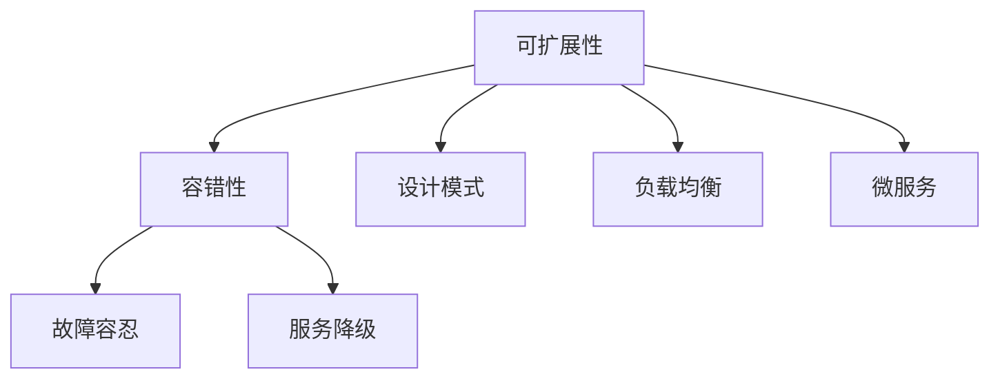

                 

# Web 应用程序的可扩展性和容错性

> 关键词：Web 应用程序, 可扩展性, 容错性, 设计模式, 负载均衡, 故障容忍, 微服务

## 1. 背景介绍

在当今互联网时代，Web应用程序已成为连接企业与用户、促进信息交流与数据交互的重要媒介。Web应用程序的高性能、高可用性和高扩展性，直接影响到企业的业务发展和用户体验。然而，Web应用程序的开发和维护面临诸多挑战，如系统复杂性高、业务需求变化快、访问流量波动大等。为了应对这些挑战，提升Web应用程序的可扩展性和容错性，近年来逐渐兴起了一系列设计模式和架构技术。本文将深入探讨Web应用程序的可扩展性和容错性，剖析其核心原理，并提供实际开发中的一些操作步骤。

## 2. 核心概念与联系

### 2.1 核心概念概述

Web应用程序的可扩展性和容错性，是系统设计中的两个关键目标。可扩展性关注系统在负载增加时的扩展能力，容错性则关注系统面对故障时的恢复能力。这两个目标通常通过合适的设计模式和架构技术来实现。

- **可扩展性**：指系统在处理负载增长时的能力，通过合理设计能够支持系统的快速扩展和横向扩展。
- **容错性**：指系统在面对故障时的恢复能力，通过冗余设计和错误处理机制，确保系统的高可用性和服务连续性。

### 2.2 核心概念联系

可扩展性和容错性在Web应用程序设计中相辅相成，可扩展性为容错性提供了基础，而容错性则保障了可扩展性得以持续发挥作用。合理的设计模式和架构技术，能够在保障系统可靠性的同时，提升系统的可扩展性，从而满足快速变化的业务需求和不断增长的访问流量。

通过以下Mermaid流程图，可以更直观地理解可扩展性和容错性之间的联系：



该流程图展示了可扩展性和容错性通过设计模式、负载均衡、微服务、故障容忍、服务降级等技术手段进行实现。

## 3. 核心算法原理 & 具体操作步骤

### 3.1 算法原理概述

Web应用程序的可扩展性和容错性，通常通过以下两种设计模式实现：横向扩展和冗余设计。横向扩展指的是通过增加服务器数量来提升系统处理能力，冗余设计则通过备份和故障转移，确保系统的高可用性。

- **横向扩展**：通过增加服务器数量，将负载分散到多个实例上，提高系统处理能力。
- **冗余设计**：通过备份和故障转移，确保系统在单点故障时仍能正常运行。

### 3.2 算法步骤详解

#### 3.2.1 横向扩展

1. **负载均衡**：通过负载均衡器将请求分散到多个服务器上，确保每个服务器处理能力均衡。常用的负载均衡算法包括轮询、加权轮询、最少连接数等。
2. **分布式缓存**：使用分布式缓存系统，如Redis，缓存热点数据，减轻数据库压力，提升响应速度。
3. **数据库分片**：根据数据表键的范围，将数据分布到多个数据库实例上，提升查询效率。

#### 3.2.2 冗余设计

1. **主从复制**：将数据备份到从服务器上，当主服务器故障时，自动切换到从服务器。
2. **多区域部署**：将系统部署到多个地理区域，确保在某个区域故障时，其他区域仍能提供服务。
3. **自动故障转移**：使用自动故障转移机制，当检测到故障时，自动切换到备用实例。

### 3.3 算法优缺点

#### 3.3.1 优点

- **可扩展性强**：通过横向扩展和冗余设计，能够快速适应负载增长，提升系统处理能力。
- **高可用性好**：通过冗余设计和自动故障转移，确保系统在单点故障时仍能正常运行。
- **负载均衡**：通过负载均衡器，将请求分散到多个服务器上，提升系统响应速度。

#### 3.3.2 缺点

- **系统复杂度高**：设计模式和架构技术的应用，增加了系统复杂度，需额外投入人力和资源进行维护。
- **成本高**：增加服务器数量和冗余备份，需要较高的硬件和运维成本。
- **部署和维护难度大**：系统的扩展和故障转移涉及多个实例和组件，部署和维护难度较大。

### 3.4 算法应用领域

Web应用程序的可扩展性和容错性，广泛应用于各种业务场景，如电商、社交、金融、教育等。无论是大型企业，还是中小型创业公司，都需要构建高可用、高扩展性的系统，以满足业务需求和用户期待。

## 4. 数学模型和公式 & 详细讲解 & 举例说明

### 4.1 数学模型构建

假设系统负载为 $L$，单个服务器的处理能力为 $C$，系统实例数量为 $n$。系统的总处理能力 $T$ 可以表示为：

$$
T = n \times C
$$

系统的负载均衡因子 $\lambda$ 定义为：

$$
\lambda = \frac{L}{T}
$$

其中，$L$ 为当前系统负载，$T$ 为系统总处理能力。

### 4.2 公式推导过程

假设系统的平均响应时间为 $R$，单个服务器的响应时间为 $C$，系统的总响应时间 $T$ 可以表示为：

$$
T = \frac{R}{n}
$$

由负载均衡因子 $\lambda$ 的定义，可以推导出系统的平均响应时间为：

$$
R = C \times \lambda
$$

因此，系统的负载均衡因子 $\lambda$ 与平均响应时间 $R$ 成正比关系。

### 4.3 案例分析与讲解

以一个电商平台的订单处理系统为例，分析其可扩展性和容错性。

假设该平台的日均订单量为 $L=100,000$ 笔，单个服务器的处理能力为 $C=1000$ 笔/秒，系统实例数量为 $n=10$。系统的总处理能力 $T=10,000$ 笔/秒。

根据上述公式推导，系统的负载均衡因子 $\lambda=10$，即系统负载为系统总处理能力的 $10$ 倍。系统平均响应时间为 $R=1000 \times 10 = 10$ 秒，单个服务器的响应时间为 $C=1000$ 秒。

在上述配置下，系统能够满足当前订单量需求，但面对突发的订单增长，系统负载均衡因子将超过 $1$，导致系统响应时间变长。此时，可以考虑增加服务器实例数量 $n$，提升系统总处理能力 $T$，以保持系统的负载均衡因子 $\lambda$ 在合理范围内，确保系统的可扩展性和容错性。

## 5. 项目实践：代码实例和详细解释说明

### 5.1 开发环境搭建

在项目实践前，需要搭建开发环境。以下是使用Python和Django框架搭建Web应用程序的基本步骤：

1. 安装Python：从官网下载并安装Python 3.x版本。
2. 安装虚拟环境：使用virtualenv或conda创建虚拟环境，确保项目依赖与系统环境隔离。
3. 安装Django：使用pip安装Django框架。
4. 创建项目和应用：使用Django的命令行工具创建项目和应用。
5. 安装第三方库：使用pip安装需要的第三方库，如Redis、Gunicorn等。

### 5.2 源代码详细实现

以下是一个简单的Django Web应用程序的源代码实现，包含横向扩展和冗余设计的实例：

```python
# settings.py
...
INSTALLED_APPS = [
    'webserver',
    'reishtools',
    'celery',
]
...
# urls.py
...
from django.urls import path
from webserver import views

urlpatterns = [
    path('', views.home, name='home'),
]
...
# views.py
...
from django.shortcuts import render
from redis_cache import cache_key
from django.views.decorators.cache import cache_page
from django.core.cache import cache

@cache_page(60)
def home(request):
    data = cache.get(cache_key())
    return render(request, 'index.html', {'data': data})
...
# celery.py
...
from celery import Celery

app = Celery('tasks', broker='redis://localhost:6379')
...
# tasks.py
...
from redis_cache import cache_key
from django.views.decorators.cache import cache_page

@app.task
def update_data():
    data = {'key': 'value'}
    cache.set(cache_key(), data, timeout=60)
    return data
...
```

在上述代码中，`redis_cache` 是一个简单的分布式缓存库，`cache_key` 函数生成缓存键。`cache_page` 装饰器将请求响应缓存60秒，确保缓存一致性。`celery` 任务用于异步更新缓存数据，使用Redis作为消息队列。

### 5.3 代码解读与分析

**settings.py**：配置Django应用的各种参数，如数据库连接、缓存配置、中间件等。

**urls.py**：定义路由规则，将请求映射到对应的视图函数。

**views.py**：实现具体的视图函数，处理用户请求。

**home函数**：使用`cache_page`装饰器缓存请求响应，确保缓存一致性。

**celery.py**：定义Redis消息队列，使用`celery`任务异步更新缓存数据。

### 5.4 运行结果展示

在上述代码实现中，访问`/`路由时，Django将请求响应缓存60秒，使用Redis缓存数据。用户首次访问时，`home`函数从Redis中获取缓存数据，渲染页面；后续访问时，直接使用缓存数据，无需再次查询数据库，提升响应速度。

同时，`celery`任务可以异步更新缓存数据，确保数据一致性。当`update_data`任务被触发时，Django后台线程将执行异步任务，更新Redis缓存数据，确保缓存数据的新鲜性。

## 6. 实际应用场景

### 6.1 电商订单系统

电商平台的订单处理系统，需要处理大规模用户并发请求，确保系统高可用性和高扩展性。通过横向扩展和冗余设计，电商订单系统能够快速应对订单增长，处理峰值流量，提升用户体验。

**横向扩展**：使用负载均衡器，将订单请求分散到多个服务器实例上，提升系统处理能力。

**冗余设计**：使用Redis缓存系统，缓存热门订单数据，减轻数据库压力，提升系统响应速度。

**故障容忍**：使用Redis集群，实现数据备份和故障转移，确保系统在单点故障时仍能正常运行。

### 6.2 社交媒体平台

社交媒体平台需要处理大量用户数据和实时消息，需要系统具有高扩展性和高容错性。通过合理的设计模式和架构技术，社交媒体平台能够保障系统的稳定运行和高效处理。

**横向扩展**：使用负载均衡器，将消息请求分散到多个服务器实例上，提升系统处理能力。

**冗余设计**：使用Redis集群，实现数据备份和故障转移，确保系统在单点故障时仍能正常运行。

**容错性**：使用Celery异步处理任务，减少系统响应时间，提升用户体验。

### 6.3 金融交易系统

金融交易系统需要处理海量交易数据和实时请求，需要系统具有高可用性和高扩展性。通过合理的设计模式和架构技术，金融交易系统能够保障系统的稳定运行和高效处理。

**横向扩展**：使用负载均衡器，将交易请求分散到多个服务器实例上，提升系统处理能力。

**冗余设计**：使用数据库主从复制，实现数据备份和故障转移，确保系统在单点故障时仍能正常运行。

**容错性**：使用Celery异步处理任务，减少系统响应时间，提升用户体验。

### 6.4 未来应用展望

未来，Web应用程序的可扩展性和容错性将不断演进，新的技术和设计模式将不断涌现。以下是一些未来可能的发展趋势：

- **无状态化设计**：通过使用API和消息队列，将系统设计为无状态化，提升系统的扩展性和容错性。
- **自动化部署**：使用自动化部署工具，如Docker、Kubernetes等，提升系统的部署效率和运维自动化程度。
- **边缘计算**：将计算任务分布到边缘节点，减少中心节点负载，提升系统的可扩展性和容错性。
- **微服务架构**：通过微服务架构，将系统拆分为多个独立服务，提升系统的扩展性和容错性。

## 7. 工具和资源推荐

### 7.1 学习资源推荐

为了帮助开发者掌握Web应用程序的可扩展性和容错性，以下是一些优质的学习资源：

1. **《Web应用程序性能优化指南》**：介绍Web应用程序性能优化的一系列技术手段，涵盖缓存、负载均衡、数据库优化等。

2. **《微服务架构设计》**：讲解微服务架构的设计原则和实现方法，适合Web开发者学习和应用。

3. **《Django实战教程》**：提供Django框架的详细教程和案例，适合Web开发者学习和实践。

4. **《Redis官方文档》**：详细介绍Redis缓存系统的使用方法和最佳实践，适合缓存系统开发和运维人员学习。

5. **《Celery官方文档》**：详细介绍Celery异步任务队列的使用方法，适合任务异步处理开发人员学习。

### 7.2 开发工具推荐

为了提高Web应用程序的可扩展性和容错性，以下是一些常用的开发工具：

1. **Django框架**：提供强大的ORM、缓存、会话、用户认证等特性，适合快速构建Web应用程序。

2. **Redis**：高性能分布式缓存系统，适合存储和缓存热点数据。

3. **Celery**：异步任务队列系统，适合处理长时间运行的任务。

4. **Gunicorn**：Python Web服务器，支持异步处理和负载均衡。

5. **Docker**：容器化工具，适合部署和管理Web应用程序。

### 7.3 相关论文推荐

Web应用程序的可扩展性和容错性涉及大量前沿研究。以下是一些经典的学术论文，推荐阅读：

1. **《分布式缓存系统设计及优化》**：探讨分布式缓存系统的设计原则和优化方法，适合缓存系统开发人员学习。

2. **《微服务架构模式与设计》**：介绍微服务架构的设计模式和实现方法，适合微服务架构开发人员学习。

3. **《负载均衡算法及其实现》**：介绍负载均衡算法的实现原理和应用场景，适合负载均衡开发人员学习。

## 8. 总结：未来发展趋势与挑战

### 8.1 总结

本文深入探讨了Web应用程序的可扩展性和容错性，介绍了核心原理和具体操作步骤。通过横向扩展和冗余设计，Web应用程序能够在面对高并发、高负载、高可用性等挑战时，保持高效和稳定运行。通过合理的设计模式和架构技术，Web应用程序能够提升系统的扩展性和容错性，满足快速变化的业务需求和不断增长的访问流量。

## 8.2 未来发展趋势

未来，Web应用程序的可扩展性和容错性将呈现以下几个发展趋势：

1. **无状态化设计**：通过使用API和消息队列，将系统设计为无状态化，提升系统的扩展性和容错性。
2. **自动化部署**：使用自动化部署工具，如Docker、Kubernetes等，提升系统的部署效率和运维自动化程度。
3. **边缘计算**：将计算任务分布到边缘节点，减少中心节点负载，提升系统的可扩展性和容错性。
4. **微服务架构**：通过微服务架构，将系统拆分为多个独立服务，提升系统的扩展性和容错性。

## 8.3 面临的挑战

尽管Web应用程序的可扩展性和容错性已经取得了一定的进展，但在实际应用中，仍面临一些挑战：

1. **系统复杂度高**：设计模式和架构技术的应用，增加了系统复杂度，需额外投入人力和资源进行维护。
2. **成本高**：增加服务器数量和冗余备份，需要较高的硬件和运维成本。
3. **部署和维护难度大**：系统的扩展和故障转移涉及多个实例和组件，部署和维护难度较大。

## 8.4 研究展望

面对这些挑战，未来的研究需要在以下几个方面寻求新的突破：

1. **自动化运维**：通过自动化运维工具，提升系统部署和维护效率，降低运维成本。
2. **智能监控**：通过智能监控工具，及时发现系统异常，保障系统稳定运行。
3. **持续集成**：通过持续集成工具，实现快速迭代和部署，提升开发效率。

## 9. 附录：常见问题与解答

**Q1：Web应用程序的可扩展性如何实现？**

A: 通过横向扩展和冗余设计，Web应用程序可以实现高扩展性。横向扩展通过增加服务器数量，将负载分散到多个实例上；冗余设计通过备份和故障转移，确保系统的高可用性。

**Q2：如何提高Web应用程序的容错性？**

A: 通过冗余设计和自动故障转移，Web应用程序可以提高容错性。冗余设计通过备份和故障转移，确保系统在单点故障时仍能正常运行。自动故障转移通过备用实例，实时切换，确保系统服务的连续性。

**Q3：什么是无状态化设计？**

A: 无状态化设计是一种设计模式，通过使用API和消息队列，将系统设计为无状态化，提升系统的扩展性和容错性。无状态化设计将状态信息从服务中分离出来，使得系统更容易水平扩展和故障恢复。

**Q4：什么是边缘计算？**

A: 边缘计算是一种分布式计算模式，将计算任务分布到边缘节点，减少中心节点负载，提升系统的可扩展性和容错性。边缘计算通过在网络边缘部署计算资源，降低延迟，提升系统响应速度和处理能力。

**Q5：如何实现微服务架构？**

A: 微服务架构是一种架构模式，通过将系统拆分为多个独立服务，提升系统的扩展性和容错性。实现微服务架构需要设计好服务边界，使用轻量级通信协议，保障服务的高可用性和可扩展性。

本文详细介绍了Web应用程序的可扩展性和容错性，通过系统化的设计模式和架构技术，保障系统的稳定运行和高效处理。希望本文能为Web开发者提供有价值的参考，助力构建高性能、高可用性的Web应用程序。

---

作者：禅与计算机程序设计艺术 / Zen and the Art of Computer Programming

