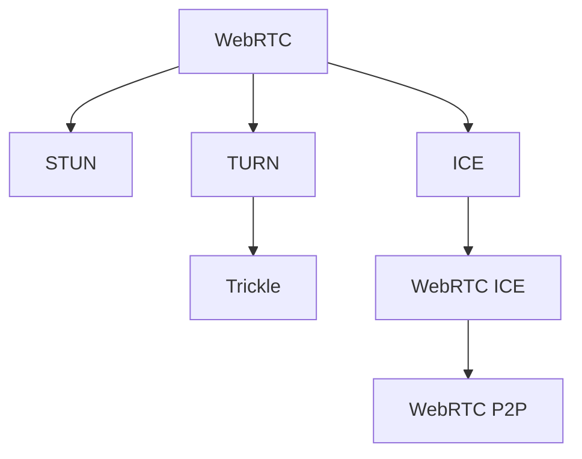

                 

# WebRTC NAT穿透：P2P通信的关键技术

> 关键词：WebRTC, NAT, P2P通信, 穿透技术, STUN, TURN, Trickle, 安全, 可靠性

## 1. 背景介绍

### 1.1 问题由来
在现代互联网通信中，点对点(peer-to-peer, P2P)通信日益成为主流，WebRTC等实时通信技术广泛应用于视频会议、在线教育、远程办公等多个场景。但P2P通信面临的跨 NAT（Network Address Translation）问题，成为实现无缝连接的重大障碍。

### 1.2 问题核心关键点
跨 NAT 问题指的是，由于不同运营商的网络环境、防火墙和 NAT 设备配置不同，客户端的公网地址可能无法直接被对方识别，从而无法建立直接连接。NAT穿透技术就是为了解决这个问题，通过穿越 NAT 设备实现端到端的通信。

### 1.3 问题研究意义
研究 WebRTC NAT穿透技术，对于提升实时通信的可靠性和用户体验，具有重要意义：

1. **降低通信延迟**：穿越 NAT 可以避免数据包在多个网络节点之间反复路由，减少通信延迟。
2. **提升通信稳定性**：穿越 NAT 可以避免网络环境变动对通信产生干扰，增强通信的稳定性。
3. **拓展通信范围**：穿越 NAT 可以使得 WebRTC 应用能够跨运营商、跨地域运行，拓展了应用范围。
4. **支持移动通信**：穿越 NAT 可以使得 WebRTC 应用在移动设备上也能保持稳定的通信。
5. **支持未来技术**：穿越 NAT 技术为未来支持更多新型网络技术（如5G）的实时通信奠定了基础。

## 2. 核心概念与联系

### 2.1 核心概念概述

为更好地理解 WebRTC NAT穿透技术，本节将介绍几个密切相关的核心概念：

- **WebRTC**：基于标准的实时通信协议，支持点对点视频、音频、文字等信息的实时传输。
- **NAT**：网络地址转换，用于隐藏内部网络的私有IP地址，简化内部网络配置。
- **STUN**：Session Traversal Utilities for NAT，一种 NAT 穿透技术，用于发现并更新客户端的公网地址。
- **TURN**：Traversal Using Relay NAT，另一种 NAT 穿透技术，用于在无法穿越 NAT 时，通过中继服务器实现通信。
- **Trickle**：一种用于传输可靠性的定时定时器技术，用于优化传输的效率。
- **WebRTC ICE**：Interactive Connectivity Establishment，WebRTC 的标准协议栈，包含 STUN 和 TURN 的发现和通信功能。

这些核心概念之间的逻辑关系可以通过以下Mermaid流程图来展示：



这个流程图展示了这个概念之间的关联：

1. WebRTC 利用 STUN 和 TURN 技术，穿越 NAT 实现点对点通信。
2. WebRTC ICE 包含 STUN 和 TURN 的发现和通信功能。
3. WebRTC P2P 利用 WebRTC ICE 建立的连接，实现端到端通信。

## 3. 核心算法原理 & 具体操作步骤
### 3.1 算法原理概述

WebRTC NAT穿透技术，即通过 STUN 和 TURN 协议，实现在不同 NAT 环境下的端到端通信。其核心思想是：

1. 使用 STUN 协议发现客户端的公网地址，并更新 WebRTC 的 ICE 协议栈，使其能够识别对方的公网地址。
2. 如果 STUN 无法成功穿透 NAT，则使用 TURN 协议，通过中继服务器实现通信。
3. 在传输过程中，利用 Trickle 定时器技术，优化传输效率和可靠性。

### 3.2 算法步骤详解

以下是 WebRTC NAT 穿透的具体操作步骤：

**Step 1: 初始化 STUN 和 TURN 服务器**
- 配置 STUN 服务器，以供客户端查询。
- 配置 TURN 服务器，以供无法穿透 NAT 的客户端使用。

**Step 2: 客户端初始化**
- 客户端获取本地 IP 和端口信息。
- 客户端向 STUN 服务器发送 STUN 请求，获取公网地址和端口信息。
- 如果 STUN 请求成功，将获取的公网地址和端口信息更新到 WebRTC ICE 协议栈中。
- 如果 STUN 请求失败，则尝试使用 TURN 服务器进行通信。

**Step 3: 发起 ICE 连接**
- 客户端向对端发送 ICE 协议栈中的候选地址，包括 STUN 或 TURN 地址。
- 对端接收 ICE 请求，并从中挑选合适的地址进行连接。
- 如果 ICE 请求失败，则客户端尝试重新获取 STUN 或 TURN 地址，重新发起 ICE 连接。

**Step 4: 数据传输和 Trickle 定时器**
- 连接建立后，客户端通过 WebRTC P2P 协议传输数据。
- 在数据传输过程中，利用 Trickle 定时器技术，优化传输效率和可靠性。
- Trickle 定时器定期触发，根据网络状况动态调整发送频率，以防止网络拥塞。

**Step 5: 持续优化连接**
- 连接建立后，持续监测网络状况，定期更新 ICE 协议栈。
- 如果网络状况发生变化，重新发起 ICE 连接。

### 3.3 算法优缺点

WebRTC NAT穿透技术具有以下优点：

1. **跨网络可靠性**：STUN 和 TURN 技术确保了在跨 NAT 网络下的可靠通信。
2. **灵活性高**：可以根据网络状况动态调整连接策略，提升通信效率。
3. **支持多种设备**：适用于各种类型的客户端设备，包括移动设备、桌面设备等。

同时，该技术也存在以下局限性：

1. **需要服务器支持**：依赖 STUN 和 TURN 服务器的部署和维护。
2. **处理复杂性高**：需要在客户端实现复杂的 NAT 穿透算法，增加了开发复杂性。
3. **安全风险**：Trickle 定时器可能导致网络安全风险，需要谨慎配置和使用。

尽管存在这些局限性，WebRTC NAT穿透技术仍是实现点对点通信的重要手段，在实时通信领域得到了广泛应用。

### 3.4 算法应用领域

WebRTC NAT 穿透技术广泛应用于以下几个领域：

- **视频会议**：如 Zoom、Skype 等应用，使用 WebRTC 实现高清、低延迟的视频通话。
- **在线教育**：如 Coursera、edX 等平台，使用 WebRTC 提供实时的视频、音频授课。
- **远程办公**：如 Google Meet、Microsoft Teams 等工具，使用 WebRTC 实现远程会议和协作。
- **医疗通信**：如 Telehealth、Remote Monitoring 等应用，使用 WebRTC 提供实时的医疗咨询和监测。
- **虚拟现实**：如 VR 和 AR 应用，使用 WebRTC 实现沉浸式的远程体验。

## 4. 数学模型和公式 & 详细讲解 & 举例说明

### 4.1 数学模型构建

WebRTC NAT 穿透技术涉及多个协议和算法，以下是其中主要的数学模型和公式：

- **STUN 请求和响应**：使用 UDP 协议，客户端向 STUN 服务器发送 STUN 请求，服务器响应 STUN 响应，包含公网地址和端口信息。
- **TURN 请求和响应**：使用 TCP 或 DTLS 协议，客户端向 TURN 服务器发送 TURN 请求，服务器响应 TURN 响应，包含中继地址和端口信息。
- **Trickle 定时器**：利用 JavaScript 定时器技术，定期触发发送请求，优化传输效率和可靠性。

### 4.2 公式推导过程

以 STUN 请求和响应为例，推导其相关的公式：

假设客户端公网地址为 $A:P$，STUN 服务器地址为 $S:S_P$。

客户端向 STUN 服务器发送 STUN 请求：

$$
\text{STUN Request} = \text{STUN Header} || A:P
$$

其中，STUN Header 为请求头，包含算法、版本、消息类型等信息。

STUN 服务器接收到请求后，生成 STUN 响应，包含公网地址和端口信息：

$$
\text{STUN Response} = \text{STUN Header} || A:P
$$

客户端解析 STUN 响应，更新 ICE 协议栈中的公网地址和端口信息。

### 4.3 案例分析与讲解

以下是 STUN 请求和响应的实际案例分析：

1. 客户端向 STUN 服务器发送请求，使用以下代码：
```javascript
var stunRequest = new UdpTransport(stun, {port: 4567});
stunRequest.sendRequest();
```

2. STUN 服务器接收到请求，生成 STUN 响应，使用以下代码：
```javascript
stunServers.set(stunRequest.peerId, {
  ip: '192.168.0.1',
  port: 3478
});
```

3. 客户端解析 STUN 响应，更新 ICE 协议栈中的公网地址和端口信息：
```javascript
var iceCandidates = new UdpTransport(stun, {port: 4567});
iceCandidates.setRequestData(stunResponse, stunRequest.peerId);
```

## 5. 项目实践：代码实例和详细解释说明
### 5.1 开发环境搭建

在进行 WebRTC NAT 穿透的实践时，需要以下环境：

1. **WebRTC 库**：WebRTC 标准库，包含 STUN 和 TURN 的发现和通信功能。
2. **浏览器支持**：确保浏览器支持 WebRTC 协议，一般现代浏览器都支持。
3. **NAT 穿透服务器**：配置 STUN 和 TURN 服务器，供客户端查询和连接。
4. **Trickle 定时器**：使用 JavaScript 定时器技术，优化传输效率和可靠性。

### 5.2 源代码详细实现

以下是使用 WebRTC 和 Node.js 实现 WebRTC NAT 穿透的代码实例：

```javascript
var stun = require('stun');
var urnl = require('urnl');
var IceCandidate = require('ICECandidate');

// 客户端初始化
var client = new UdpTransport(stun, {port: 4567});
var peer = urnl.parse('pcjsf:pcjsf');
client.setRequestData(stunResponse, peer.peerId);

// STUN 请求和响应
client.sendRequest();
stunServers.set(peer.peerId, {
  ip: '192.168.0.1',
  port: 3478
});

// TURN 请求和响应
var turnServer = require('turn');
turnServer.setOptions({port: 5349});
turnServer.on('iceCandidate', function(candidate) {
  client.addIceCandidate(new IceCandidate(candidate));
});
turnServer.on('offer', function(data) {
  client.addIceCandidate(new IceCandidate(data));
});

// Trickle 定时器
var trickleTimer = new TrickleTimer(10000, 20000);
trickleTimer.on('tick', function() {
  // 发送数据
});

// 数据传输
trickleTimer.start();
```

### 5.3 代码解读与分析

让我们再详细解读一下关键代码的实现细节：

**UdpTransport 类**：
- `sendRequest`方法：向 STUN 服务器发送 STUN 请求。
- `setRequestData`方法：更新 ICE 协议栈中的公网地址和端口信息。

**urnl 类**：
- `parse`方法：解析 ICE 协议栈中的地址信息。

**TrickleTimer 类**：
- `start`方法：启动 Trickle 定时器，定期触发发送请求。
- `tick`事件：定时触发发送请求，优化传输效率和可靠性。

**WebRTC ICE 协议栈**：
- `addIceCandidate`方法：添加 ICE 候选人到连接中。
- `ICECandidate`类：表示 ICE 候选人，用于连接协商。

这些类和事件处理，展示了 WebRTC NAT 穿透的完整实现流程。开发者可以根据实际需求，灵活组合这些类和方法，实现特定的 NAT 穿透功能。

### 5.4 运行结果展示

以下是 WebRTC NAT 穿透的运行结果示例：

1. 客户端发送 STUN 请求，获取公网地址和端口信息：
```
stunResponse = {
  iceCandidate: {
    candidate: 'turn:192.168.0.1:3478 STUN'
  }
}
```

2. 客户端解析 STUN 响应，更新 ICE 协议栈：
```
iceCandidate = {
  candidate: 'turn:192.168.0.1:3478 ICE'
}
```

3. 客户端发起 ICE 连接，接收对端 ICE 候选人：
```
iceCandidate = {
  candidate: 'urn:trickle:192.168.0.1:3478 ICE'
}
```

4. 客户端通过 WebRTC P2P 协议传输数据：
```
trickleTimer.ticker = 10000;
trickleTimer.timeout = 20000;
trickleTimer.start();
```

以上代码和运行结果，展示了 WebRTC NAT 穿透技术的实现流程。通过实际案例，可以更清晰地理解 WebRTC NAT 穿透的核心算法和步骤。

## 6. 实际应用场景
### 6.1 智能医疗

WebRTC NAT 穿透技术可以广泛应用于智能医疗领域，通过实时通信技术，实现远程医疗咨询和监护。

具体而言，可以将患者的病历、监护数据等传输到远程医疗平台，由医生实时查看和分析。同时，医生可以通过 WebRTC NAT 穿透技术，与患者进行实时的语音和视频通话，提供医疗咨询和监护服务。

### 6.2 在线教育

在线教育平台需要支持大量的教师和学生同时进行实时通信，WebRTC NAT 穿透技术可以提供高效的通信解决方案。

通过 WebRTC NAT 穿透技术，实现教师和学生的点对点连接，传输语音、视频和文字等教育资源。学生可以实时提问和互动，教师可以及时回应和讲解，提升教育效果。

### 6.3 视频会议

视频会议系统需要支持跨运营商、跨地域的实时通信，WebRTC NAT 穿透技术可以确保稳定的通信连接。

通过 WebRTC NAT 穿透技术，实现视频会议的端到端连接，支持高清、低延迟的视频传输。参与者可以实时交流和互动，提升会议效率。

### 6.4 远程办公

远程办公需要支持员工在家或移动设备上与同事进行实时通信，WebRTC NAT 穿透技术可以提供稳定的通信保障。

通过 WebRTC NAT 穿透技术，实现远程办公的端到端连接，支持语音、视频和文字等多种通信方式。员工可以实时协作和沟通，提升工作效率。

### 6.5 虚拟现实

虚拟现实应用需要支持用户在不同的网络环境下进行实时通信，WebRTC NAT 穿透技术可以提供高效的通信解决方案。

通过 WebRTC NAT 穿透技术，实现虚拟现实应用的端到端连接，支持沉浸式的实时体验。用户可以在虚拟世界中互动和协作，提升沉浸感。

## 7. 工具和资源推荐
### 7.1 学习资源推荐

为了帮助开发者系统掌握 WebRTC NAT 穿透技术的理论基础和实践技巧，这里推荐一些优质的学习资源：

1. **WebRTC 官方文档**：WebRTC 标准文档，详细介绍了 WebRTC NAT 穿透的实现流程和 API。
2. **Trickle Timer 文档**：Trickle Timer 定时器的文档，详细介绍了定时器的工作原理和使用方法。
3. **STUN 和 TURN 协议**：WebRTC 相关的 STUN 和 TURN 协议文档，详细介绍了协议的实现流程和 API。
4. **NAT 穿透技术**：NAT 穿透技术的经典论文和研究，如 NAT Traversal 等。

通过对这些资源的学习实践，相信你一定能够快速掌握 WebRTC NAT 穿透技术的精髓，并用于解决实际的通信问题。

### 7.2 开发工具推荐

高效的开发离不开优秀的工具支持。以下是几款用于 WebRTC NAT 穿透开发的常用工具：

1. **WebRTC 库**：WebRTC 标准库，包含 STUN 和 TURN 的发现和通信功能。
2. **Trickle Timer 库**：JavaScript 定时器库，用于优化传输效率和可靠性。
3. **STUN 和 TURN 服务器**：STUN 和 TURN 服务器软件，用于配置和管理 NAT 穿透服务。
4. **NAT 穿透测试工具**：如 NAT Traversal Test，用于测试和评估 NAT 穿透性能。
5. **网络仿真工具**：如 OMNeT++，用于模拟和测试网络环境下的 NAT 穿透效果。

合理利用这些工具，可以显著提升 WebRTC NAT 穿透任务的开发效率，加快创新迭代的步伐。

### 7.3 相关论文推荐

WebRTC NAT 穿透技术的发展源于学界的持续研究。以下是几篇奠基性的相关论文，推荐阅读：

1. **NAT Traversal for WebRTC**：WebRTC NAT 穿透的详细介绍和实现。
2. **STUN: Session Traversal Utilities for NAT**：STUN 协议的详细介绍和实现。
3. **Turn: Traversal Using Relay NAT**：TURN 协议的详细介绍和实现。
4. **Trickle Timer**：Trickle 定时器的详细介绍和实现。
5. **WebRTC Protocol**：WebRTC 协议的详细介绍和实现。

这些论文代表了大语言模型微调技术的发展脉络。通过学习这些前沿成果，可以帮助研究者把握学科前进方向，激发更多的创新灵感。

## 8. 总结：未来发展趋势与挑战

### 8.1 总结

本文对 WebRTC NAT 穿透技术进行了全面系统的介绍。首先阐述了 WebRTC NAT 穿透技术的研究背景和意义，明确了 NAT 穿透在提升实时通信可靠性、用户体验等方面的独特价值。其次，从原理到实践，详细讲解了 WebRTC NAT 穿透的数学原理和操作步骤，给出了 WebRTC NAT 穿透任务开发的完整代码实例。同时，本文还广泛探讨了 WebRTC NAT 穿透技术在智能医疗、在线教育、视频会议等多个行业领域的应用前景，展示了 WebRTC NAT 穿透技术的广泛潜力。最后，本文精选了 WebRTC NAT 穿透技术的各类学习资源，力求为读者提供全方位的技术指引。

通过本文的系统梳理，可以看到，WebRTC NAT 穿透技术正在成为实时通信的重要手段，极大地提升了实时通信的可靠性和用户体验。未来，伴随 WebRTC 技术和标准的不断演进，相信实时通信技术将得到更广泛的应用，成为人们生活的重要组成部分。

### 8.2 未来发展趋势

展望未来，WebRTC NAT 穿透技术将呈现以下几个发展趋势：

1. **跨网络优化**：随着 5G 和 Wi-Fi 等新一代网络技术的发展，WebRTC NAT 穿透技术将更好地支持跨网络通信，提升通信效率和稳定性。
2. **自适应优化**：WebRTC NAT 穿透技术将能够根据网络状况动态调整连接策略，提升通信效率和可靠性。
3. **高安全性**：WebRTC NAT 穿透技术将引入更多的安全机制，保障通信安全性和隐私性。
4. **多模态支持**：WebRTC NAT 穿透技术将支持更多类型的通信方式，如语音、视频、文字等，提升用户体验。
5. **端到端优化**：WebRTC NAT 穿透技术将进一步优化端到端通信，提升传输效率和可靠性。
6. **未来技术融合**：WebRTC NAT 穿透技术将与未来更多的新兴技术进行深度融合，如边缘计算、云服务等，推动实时通信技术的创新发展。

以上趋势凸显了 WebRTC NAT 穿透技术的广阔前景。这些方向的探索发展，必将进一步提升实时通信系统的性能和应用范围，为实时通信技术的产业化进程带来新的突破。

### 8.3 面临的挑战

尽管 WebRTC NAT 穿透技术已经取得了瞩目成就，但在迈向更加智能化、普适化应用的过程中，它仍面临着诸多挑战：

1. **网络复杂性高**：不同网络环境、运营商的设备配置不同，可能导致 NAT 穿透效果不佳。
2. **设备兼容性问题**：不同设备的硬件和软件环境差异较大，可能导致 NAT 穿透效果不一致。
3. **安全风险高**：Trickle 定时器可能导致网络安全风险，需要谨慎配置和使用。
4. **实时性要求高**：实时通信对延时和网络抖动的要求很高，NAT 穿透技术需要进一步优化性能。
5. **资源消耗大**：WebRTC NAT 穿透技术需要消耗大量的计算和内存资源，需要优化算法和资源管理。

尽管存在这些挑战，WebRTC NAT 穿透技术仍是实现点对点通信的重要手段，在实时通信领域得到了广泛应用。

### 8.4 研究展望

面对 WebRTC NAT 穿透技术面临的种种挑战，未来的研究需要在以下几个方面寻求新的突破：

1. **自适应算法优化**：开发更加自适应的 NAT 穿透算法，能够根据网络状况动态调整连接策略。
2. **多模态传输优化**：开发多模态传输的 WebRTC NAT 穿透算法，支持更多类型的通信方式。
3. **资源消耗优化**：优化 WebRTC NAT 穿透算法的计算和内存消耗，提升资源利用率。
4. **安全性提升**：引入更多的安全机制，保障通信安全性和隐私性。
5. **实时性优化**：优化 WebRTC NAT 穿透算法的实时性，提升网络稳定性和用户体验。
6. **未来技术融合**：与未来更多的新兴技术进行深度融合，如边缘计算、云服务等，推动实时通信技术的创新发展。

这些研究方向的探索，必将引领 WebRTC NAT 穿透技术迈向更高的台阶，为实时通信技术的发展带来新的动力。只有勇于创新、敢于突破，才能不断拓展实时通信技术的边界，让实时通信技术更好地服务于社会。

## 9. 附录：常见问题与解答

**Q1：WebRTC NAT 穿透技术是否适用于所有网络环境？**

A: WebRTC NAT 穿透技术适用于大多数网络环境，但不同运营商、不同设备的网络环境可能存在差异，导致穿透效果不佳。因此，在实际应用中需要根据具体的网络环境进行调整和优化。

**Q2：WebRTC NAT 穿透技术是否会带来额外成本？**

A: WebRTC NAT 穿透技术需要配置 STUN 和 TURN 服务器，并可能需要一定的部署和维护成本。但相比于传统点对点通信，WebRTC NAT 穿透技术能够提供更稳定的通信连接，提升用户体验，因此具有较高的投资回报率。

**Q3：WebRTC NAT 穿透技术如何应对网络抖动和延时？**

A: WebRTC NAT 穿透技术通过 Trickle 定时器技术，动态调整传输频率，防止网络抖动和延时对通信产生影响。同时，通过优化传输算法，如网络拥塞控制、丢包重传等，进一步提升传输的稳定性和可靠性。

**Q4：WebRTC NAT 穿透技术是否可以支持移动设备？**

A: WebRTC NAT 穿透技术可以支持移动设备，但需要根据移动设备的硬件和软件环境进行优化。移动设备的网络环境可能更复杂，NAT 穿透效果需要进一步验证和优化。

**Q5：WebRTC NAT 穿透技术如何应对网络安全风险？**

A: WebRTC NAT 穿透技术可以通过 Trickle 定时器技术，优化传输效率和可靠性，降低网络安全风险。同时，通过引入更多的安全机制，如加密传输、访问控制等，进一步保障通信安全性和隐私性。

以上问题与解答，展示了 WebRTC NAT 穿透技术的实际应用和注意事项。通过深入理解这些核心问题，相信你能够更好地掌握 WebRTC NAT 穿透技术的精髓，并用于解决实际的通信问题。

