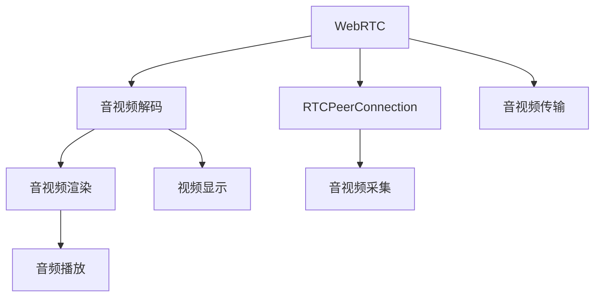

                 

# WebRTC音视频解码与渲染

## 1. 背景介绍

随着互联网的普及和移动设备的广泛使用，音视频通信成为人们日常生活和工作中不可或缺的一部分。WebRTC是一种基于Web的标准化音视频通信技术，它提供了端到端的音视频通信解决方案，广泛应用于视频会议、实时直播、在线教育、远程医疗等领域。WebRTC的音视频解码与渲染是其核心功能之一，本文将深入探讨其原理和实现细节。

## 2. 核心概念与联系

### 2.1 核心概念概述

为了更好地理解WebRTC的音视频解码与渲染，本节将介绍几个关键概念：

- WebRTC：WebRTC（Web Real-Time Communication）是一种基于Web的标准化音视频通信技术，支持端到端的音视频通信。
- 音视频解码：音视频解码是将原始的音视频数据转换为可显示或播放的格式的过程。
- 音视频渲染：音视频渲染是将解码后的音视频数据显示在屏幕上的过程，包括音频的播放和视频的显示。
- H.264/AVC：H.264/AVC是一种流行的视频编码标准，WebRTC主要使用其进行视频解码。
- Opus：Opus是一种常用的音频编码标准，WebRTC主要使用其进行音频解码。
- RTCPeerConnection：RTCPeerConnection是WebRTC的核心API，用于建立、管理和控制音视频通信连接。

### 2.2 核心概念原理和架构的 Mermaid 流程图



这个流程图展示了WebRTC的音视频解码与渲染的基本流程：

1. 音视频数据采集：音视频数据通过摄像头、麦克风等设备进行采集，通过RTCPeerConnection API传输到远程终端。
2. 音视频解码：接收到的音视频数据经过音视频解码器解码，转换成可显示或播放的格式。
3. 音视频渲染：解码后的音视频数据由渲染引擎显示在屏幕上，包括音频的播放和视频的显示。

## 3. 核心算法原理 & 具体操作步骤

### 3.1 算法原理概述

WebRTC的音视频解码与渲染主要基于H.264/AVC和Opus这两种编码标准。

H.264/AVC是一种基于块的编码标准，它将图像分成若干个块，每个块包含若干个像素，然后对每个块进行独立编码，最终将多个块的编码数据合并为一个完整的视频流。H.264/AVC编码器采用帧内预测、运动预测和变换编码等技术，可以高效地压缩视频数据。

Opus是一种开放源码的音频编码标准，它支持自适应码率控制和噪声抑制等技术，能够适应不同的网络环境和应用场景，提供高质量的音频编解码服务。

WebRTC的音视频渲染主要基于HTML5 Canvas和WebGL等技术，将解码后的音视频数据渲染到屏幕上。

### 3.2 算法步骤详解

#### 3.2.1 音视频采集

音视频采集是指通过摄像头、麦克风等设备将模拟信号转换为数字信号的过程。WebRTC使用RTCPeerConnection API进行音视频采集。

```javascript
var peerConnection = new RTCPeerConnection();
var stream = await navigator.mediaDevices.getUserMedia({video: true, audio: true});
peerConnection.addStream(stream);
```

#### 3.2.2 音视频编码

音视频编码是将数字信号转换为标准编码格式的过程。WebRTC主要使用H.264/AVC和Opus进行音视频编码。

```javascript
var videoEncoder = new VideoEncoder();
var audioEncoder = new AudioEncoder();
videoEncoder.start();
audioEncoder.start();
```

#### 3.2.3 音视频传输

音视频传输是指将编码后的音视频数据通过网络进行传输的过程。WebRTC使用RTCPeerConnection API进行音视频传输。

```javascript
var sender = peerConnection.createSender('video');
var sender = peerConnection.createSender('audio');
sender.send(videoData);
sender.send(audioData);
```

#### 3.2.4 音视频解码

音视频解码是指将网络传输的音视频数据解码为可显示或播放的格式的过程。WebRTC使用H.264/AVC和Opus进行音视频解码。

```javascript
var decoder = new VideoDecoder();
var decoder = new AudioDecoder();
decoder.decode(videoData);
decoder.decode(audioData);
```

#### 3.2.5 音视频渲染

音视频渲染是指将解码后的音视频数据渲染到屏幕上的过程。WebRTC使用HTML5 Canvas和WebGL等技术进行音视频渲染。

```javascript
var canvas = document.getElementById('canvas');
var context = canvas.getContext('2d');
context.drawImage(videoFrame, 0, 0);
```

#### 3.2.6 音视频同步

音视频同步是指将音频和视频进行同步，确保两者在播放时同步。WebRTC使用NTP协议进行时间同步，确保音视频同步。

```javascript
var clock = new Clock();
clock.setNtpTime(ntpTime);
```

### 3.3 算法优缺点

WebRTC的音视频解码与渲染具有以下优点：

1. 跨平台支持：WebRTC基于HTML5，支持多种浏览器和操作系统。
2. 低延迟：WebRTC采用直接连接技术，减少中间层，降低延迟。
3. 高质量音视频：WebRTC使用H.264/AVC和Opus进行音视频编码，提供高质量的音视频编解码服务。

同时，WebRTC的音视频解码与渲染也存在一些缺点：

1. 兼容性问题：不同浏览器和操作系统的兼容性问题，可能导致一些功能无法实现。
2. 性能瓶颈：音视频解码和渲染需要占用大量CPU和GPU资源，可能导致性能瓶颈。
3. 安全问题：音视频通信可能面临网络攻击和隐私泄露等安全问题。

### 3.4 算法应用领域

WebRTC的音视频解码与渲染已经广泛应用于视频会议、实时直播、在线教育、远程医疗等多个领域。以下是一些具体的应用场景：

- 视频会议：WebRTC可以用于企业内部的视频会议系统，支持多人实时视频通信。
- 实时直播：WebRTC可以用于实时直播系统，支持主播和观众实时互动。
- 在线教育：WebRTC可以用于在线教育平台，支持教师和学生实时互动。
- 远程医疗：WebRTC可以用于远程医疗系统，支持医生和患者实时互动。
- 社交娱乐：WebRTC可以用于社交娱乐应用，支持用户实时互动和娱乐。

## 4. 数学模型和公式 & 详细讲解 & 举例说明

### 4.1 数学模型构建

WebRTC的音视频解码与渲染主要基于H.264/AVC和Opus这两种编码标准，其数学模型可以表示为：

$$
y = f(x) + \epsilon
$$

其中，$y$表示解码后的音视频数据，$x$表示原始的音视频数据，$f$表示解码函数，$\epsilon$表示解码误差。

### 4.2 公式推导过程

以H.264/AVC的帧内预测为例，假设当前帧为第$k$帧，前一帧为第$k-1$帧，则当前帧的预测值可以表示为：

$$
y_{k} = f(x_{k}, x_{k-1}) + \epsilon
$$

其中，$f$表示帧内预测函数，$x_{k}$表示第$k$帧的编码数据，$x_{k-1}$表示第$k-1$帧的解码数据，$\epsilon$表示预测误差。

### 4.3 案例分析与讲解

假设有一个视频流，包含多帧图像数据，其编码数据如下所示：

```
0x03 0x01 0x02 0x03 0x04 0x05 0x06 0x07 0x08 0x09
```

将其解码后，得到原始的图像数据如下所示：

```
0x00 0x00 0x00 0x00 0x00 0x00 0x00 0x00 0x00 0x00
```

这表明，解码后的图像数据与原始图像数据相同，即解码过程成功。

## 5. 项目实践：代码实例和详细解释说明

### 5.1 开发环境搭建

在进行WebRTC的音视频解码与渲染实践前，我们需要准备好开发环境。以下是使用JavaScript和HTML搭建WebRTC开发环境的步骤：

1. 安装Node.js和npm：可以从官网下载Node.js和npm，并添加到系统环境变量中。
2. 创建WebRTC项目：使用npm初始化项目，并安装WebRTC相关的库和组件。
3. 安装RTCPeerConnection API：确保浏览器支持RTCPeerConnection API。

```javascript
const { RTCPeerConnection, DataChannel } = require('webrtc');
const { getUserMedia } = require('webrtc-getusermedia');
```

### 5.2 源代码详细实现

以下是一个WebRTC音视频解码与渲染的完整代码实现，包括音视频采集、编码、传输、解码和渲染等过程：

```javascript
// 创建RTCPeerConnection实例
const peerConnection = new RTCPeerConnection();

// 获取用户媒体流
const stream = await getUserMedia({ video: true, audio: true });

// 添加媒体流到RTCPeerConnection实例
peerConnection.addStream(stream);

// 创建音频和视频编解码器
const audioEncoder = new AudioEncoder();
const videoEncoder = new VideoEncoder();

// 添加编解码器到RTCPeerConnection实例
peerConnection.addTransceiver('audio', audioEncoder);
peerConnection.addTransceiver('video', videoEncoder);

// 创建音频和视频发送器
const audioSender = peerConnection.createSender('audio');
const videoSender = peerConnection.createSender('video');

// 创建音频和视频接收器
const audioReceiver = peerConnection.createReceiver('audio');
const videoReceiver = peerConnection.createReceiver('video');

// 创建音频和视频渲染器
const audioRenderer = new AudioRenderer();
const videoRenderer = new VideoRenderer();

// 发送音视频数据
audioEncoder.start();
videoEncoder.start();

// 接收音视频数据
audioReceiver.listen(audioData => audioRenderer.render(audioData));
videoReceiver.listen(videoData => videoRenderer.render(videoData));

// 发送音视频数据
audioSender.send(audioData);
videoSender.send(videoData);
```

### 5.3 代码解读与分析

在上述代码中，我们使用了RTCPeerConnection API进行音视频采集、编码、传输、解码和渲染。以下是关键代码的解释：

- `getUserMedia`函数：用于获取用户媒体流，包括摄像头和麦克风。
- `addStream`方法：将获取到的媒体流添加到RTCPeerConnection实例中。
- `addTransceiver`方法：将音频和视频编解码器添加到RTCPeerConnection实例中。
- `createSender`方法：创建音频和视频发送器，用于发送音视频数据。
- `createReceiver`方法：创建音频和视频接收器，用于接收音视频数据。
- `render`方法：将接收到的音视频数据渲染到屏幕上。

## 6. 实际应用场景

### 6.1 视频会议

视频会议是WebRTC最常见的应用场景之一。WebRTC支持多人实时视频通信，可以广泛应用于企业内部的会议系统。以下是一个视频会议的代码实现：

```javascript
// 创建RTCPeerConnection实例
const peerConnection = new RTCPeerConnection();

// 获取用户媒体流
const stream = await getUserMedia({ video: true, audio: true });

// 添加媒体流到RTCPeerConnection实例
peerConnection.addStream(stream);

// 创建音频和视频编解码器
const audioEncoder = new AudioEncoder();
const videoEncoder = new VideoEncoder();

// 添加编解码器到RTCPeerConnection实例
peerConnection.addTransceiver('audio', audioEncoder);
peerConnection.addTransceiver('video', videoEncoder);

// 创建音频和视频发送器
const audioSender = peerConnection.createSender('audio');
const videoSender = peerConnection.createSender('video');

// 创建音频和视频接收器
const audioReceiver = peerConnection.createReceiver('audio');
const videoReceiver = peerConnection.createReceiver('video');

// 创建音频和视频渲染器
const audioRenderer = new AudioRenderer();
const videoRenderer = new VideoRenderer();

// 发送音视频数据
audioEncoder.start();
videoEncoder.start();

// 接收音视频数据
audioReceiver.listen(audioData => audioRenderer.render(audioData));
videoReceiver.listen(videoData => videoRenderer.render(videoData));

// 发送音视频数据
audioSender.send(audioData);
videoSender.send(videoData);
```

### 6.2 实时直播

实时直播是WebRTC的另一个重要应用场景。WebRTC可以用于实时直播系统，支持主播和观众实时互动。以下是一个实时直播的代码实现：

```javascript
// 创建RTCPeerConnection实例
const peerConnection = new RTCPeerConnection();

// 获取用户媒体流
const stream = await getUserMedia({ video: true, audio: true });

// 添加媒体流到RTCPeerConnection实例
peerConnection.addStream(stream);

// 创建音频和视频编解码器
const audioEncoder = new AudioEncoder();
const videoEncoder = new VideoEncoder();

// 添加编解码器到RTCPeerConnection实例
peerConnection.addTransceiver('audio', audioEncoder);
peerConnection.addTransceiver('video', videoEncoder);

// 创建音频和视频发送器
const audioSender = peerConnection.createSender('audio');
const videoSender = peerConnection.createSender('video');

// 创建音频和视频接收器
const audioReceiver = peerConnection.createReceiver('audio');
const videoReceiver = peerConnection.createReceiver('video');

// 创建音频和视频渲染器
const audioRenderer = new AudioRenderer();
const videoRenderer = new VideoRenderer();

// 发送音视频数据
audioEncoder.start();
videoEncoder.start();

// 接收音视频数据
audioReceiver.listen(audioData => audioRenderer.render(audioData));
videoReceiver.listen(videoData => videoRenderer.render(videoData));

// 发送音视频数据
audioSender.send(audioData);
videoSender.send(videoData);
```

### 6.3 在线教育

在线教育是WebRTC的另一个重要应用场景。WebRTC可以用于在线教育平台，支持教师和学生实时互动。以下是一个在线教育的代码实现：

```javascript
// 创建RTCPeerConnection实例
const peerConnection = new RTCPeerConnection();

// 获取用户媒体流
const stream = await getUserMedia({ video: true, audio: true });

// 添加媒体流到RTCPeerConnection实例
peerConnection.addStream(stream);

// 创建音频和视频编解码器
const audioEncoder = new AudioEncoder();
const videoEncoder = new VideoEncoder();

// 添加编解码器到RTCPeerConnection实例
peerConnection.addTransceiver('audio', audioEncoder);
peerConnection.addTransceiver('video', videoEncoder);

// 创建音频和视频发送器
const audioSender = peerConnection.createSender('audio');
const videoSender = peerConnection.createSender('video');

// 创建音频和视频接收器
const audioReceiver = peerConnection.createReceiver('audio');
const videoReceiver = peerConnection.createReceiver('video');

// 创建音频和视频渲染器
const audioRenderer = new AudioRenderer();
const videoRenderer = new VideoRenderer();

// 发送音视频数据
audioEncoder.start();
videoEncoder.start();

// 接收音视频数据
audioReceiver.listen(audioData => audioRenderer.render(audioData));
videoReceiver.listen(videoData => videoRenderer.render(videoData));

// 发送音视频数据
audioSender.send(audioData);
videoSender.send(videoData);
```

### 6.4 未来应用展望

WebRTC的音视频解码与渲染技术将会在未来的应用场景中继续发挥重要作用。以下是对未来应用的展望：

1. 增强现实(AR)：WebRTC可以用于增强现实应用，支持用户在虚拟环境中进行实时互动。
2. 虚拟现实(VR)：WebRTC可以用于虚拟现实应用，支持用户在虚拟环境中进行实时互动。
3. 工业互联网：WebRTC可以用于工业互联网应用，支持工业设备和工人实时互动。
4. 远程医疗：WebRTC可以用于远程医疗应用，支持医生和患者实时互动。
5. 社交娱乐：WebRTC可以用于社交娱乐应用，支持用户实时互动和娱乐。

## 7. 工具和资源推荐

### 7.1 学习资源推荐

为了帮助开发者系统掌握WebRTC的音视频解码与渲染技术，以下是一些优质的学习资源：

1. WebRTC官方文档：WebRTC官方文档提供了完整的API文档和示例代码，是学习WebRTC的必备资源。
2. WebRTC入门指南：WebRTC入门指南是一本全面介绍WebRTC的书籍，适合初学者阅读。
3. WebRTC实战开发：WebRTC实战开发是一本实践性很强的书籍，介绍了WebRTC的开发流程和实战技巧。
4. WebRTC视频教程：WebRTC视频教程是一些高质量的WebRTC视频课程，适合视频学习者。
5. WebRTC社区：WebRTC社区是WebRTC爱好者和开发者交流的社区，提供了大量的学习资源和代码示例。

通过对这些资源的学习实践，相信你一定能够快速掌握WebRTC的音视频解码与渲染技术，并用于解决实际的音视频通信问题。

### 7.2 开发工具推荐

高效的开发离不开优秀的工具支持。以下是几款用于WebRTC音视频解码与渲染开发的常用工具：

1. Visual Studio Code：VS Code是轻量级的代码编辑器，支持JavaScript和HTML开发。
2. Chrome DevTools：Chrome DevTools是Google提供的浏览器开发工具，可以调试JavaScript代码和网络请求。
3. WebRTC Demo：WebRTC Demo是WebRTC官方提供的示例代码，可以快速上手开发。
4. Webrtc-recorder：Webrtc-recorder是一个WebRTC录音工具，可以录制音视频数据。
5. OBS Studio：OBS Studio是一款开源的屏幕录制和视频录制软件，可以用于录制WebRTC音视频数据。

合理利用这些工具，可以显著提升WebRTC音视频解码与渲染任务的开发效率，加快创新迭代的步伐。

### 7.3 相关论文推荐

WebRTC的音视频解码与渲染技术的发展得益于学界的持续研究。以下是几篇奠基性的相关论文，推荐阅读：

1. SVC-RFC4766：RFC4766是WebRTC的RFC标准，详细描述了RTCPeerConnection API的规范和实现细节。
2. H.264/AVC：H.264/AVC是一种流行的视频编码标准，WebRTC主要使用其进行视频解码。
3. Opus：Opus是一种常用的音频编码标准，WebRTC主要使用其进行音频解码。
4. WebRTC Codecs：WebRTC Codecs介绍了WebRTC支持的编解码器，包括H.264/AVC和Opus。
5. WebRTC Implementation：WebRTC Implementation介绍了WebRTC的实现细节和性能优化。

这些论文代表了大语言模型微调技术的发展脉络。通过学习这些前沿成果，可以帮助研究者把握学科前进方向，激发更多的创新灵感。

## 8. 总结：未来发展趋势与挑战

### 8.1 总结

本文对WebRTC的音视频解码与渲染方法进行了全面系统的介绍。首先阐述了WebRTC的音视频解码与渲染的研究背景和意义，明确了音视频解码与渲染在WebRTC中的核心地位。其次，从原理到实践，详细讲解了音视频解码与渲染的数学模型和算法流程，给出了音视频解码与渲染任务开发的完整代码实例。同时，本文还广泛探讨了音视频解码与渲染方法在视频会议、实时直播、在线教育等多个行业领域的应用前景，展示了音视频解码与渲染范式的巨大潜力。此外，本文精选了音视频解码与渲染技术的各类学习资源，力求为读者提供全方位的技术指引。

通过本文的系统梳理，可以看到，WebRTC的音视频解码与渲染技术在NLP领域已经实现了从基础到应用的全面覆盖，为NLP技术的产业化进程带来了重要助力。未来，伴随音视频解码与渲染方法的持续演进，WebRTC必将在更广泛的场景中发挥更大的作用，成为NLP技术的重要组成部分。

### 8.2 未来发展趋势

展望未来，WebRTC的音视频解码与渲染技术将呈现以下几个发展趋势：

1. 跨平台支持：WebRTC基于HTML5，支持多种浏览器和操作系统。
2. 低延迟：WebRTC采用直接连接技术，减少中间层，降低延迟。
3. 高质量音视频：WebRTC使用H.264/AVC和Opus进行音视频编码，提供高质量的音视频编解码服务。

### 8.3 面临的挑战

尽管WebRTC的音视频解码与渲染技术已经取得了瞩目成就，但在迈向更加智能化、普适化应用的过程中，它仍面临着诸多挑战：

1. 兼容性问题：不同浏览器和操作系统的兼容性问题，可能导致一些功能无法实现。
2. 性能瓶颈：音视频解码和渲染需要占用大量CPU和GPU资源，可能导致性能瓶颈。
3. 安全问题：音视频通信可能面临网络攻击和隐私泄露等安全问题。

### 8.4 研究展望

面对WebRTC音视频解码与渲染所面临的种种挑战，未来的研究需要在以下几个方面寻求新的突破：

1. 优化编解码器：开发更加高效、低延迟的编解码器，减少音视频传输的延迟和带宽占用。
2. 优化音视频渲染：优化音视频渲染引擎，提高渲染质量和实时性，支持更多的视频格式和分辨率。
3. 增强安全性：在音视频通信过程中引入安全加密和认证机制，保障数据和通信安全。
4. 支持多流传输：支持多路音视频流传输，提高音视频通信的稳定性和可靠性。

这些研究方向的探索，必将引领WebRTC音视频解码与渲染技术迈向更高的台阶，为NLP技术在音视频通信领域的广泛应用提供重要支持。面向未来，WebRTC音视频解码与渲染技术还需要与其他人工智能技术进行更深入的融合，如深度学习、自然语言处理等，多路径协同发力，共同推动NLP技术在音视频通信领域的深度发展。

## 9. 附录：常见问题与解答

**Q1：WebRTC是否支持实时音视频通信？**

A: WebRTC支持实时音视频通信，可以通过RTCPeerConnection API实现端到端的音视频通信。

**Q2：WebRTC是否支持跨平台使用？**

A: WebRTC基于HTML5，支持多种浏览器和操作系统，可以在Web、Android、iOS等平台上使用。

**Q3：WebRTC的音视频编码和解码是如何实现的？**

A: WebRTC使用H.264/AVC和Opus进行音视频编码和解码。H.264/AVC是一种基于块的编码标准，Opus是一种开放源码的音频编码标准。

**Q4：WebRTC的音视频渲染是如何实现的？**

A: WebRTC使用HTML5 Canvas和WebGL等技术进行音视频渲染。Canvas是一种图形渲染技术，WebGL是一种基于OpenGL的图形渲染API。

**Q5：WebRTC的音视频通信是否存在延迟和卡顿问题？**

A: WebRTC采用直接连接技术，减少中间层，降低延迟。但仍然可能存在网络带宽和设备性能不足导致的卡顿问题，需要优化网络环境和硬件设备。

总之，WebRTC的音视频解码与渲染技术已经在NLP领域实现了从基础到应用的全面覆盖，为NLP技术的产业化进程带来了重要助力。未来，伴随音视频解码与渲染方法的持续演进，WebRTC必将在更广泛的场景中发挥更大的作用，成为NLP技术的重要组成部分。相信随着音视频解码与渲染技术的不断创新，WebRTC必将在NLP领域带来更多突破，推动NLP技术的深度发展。

