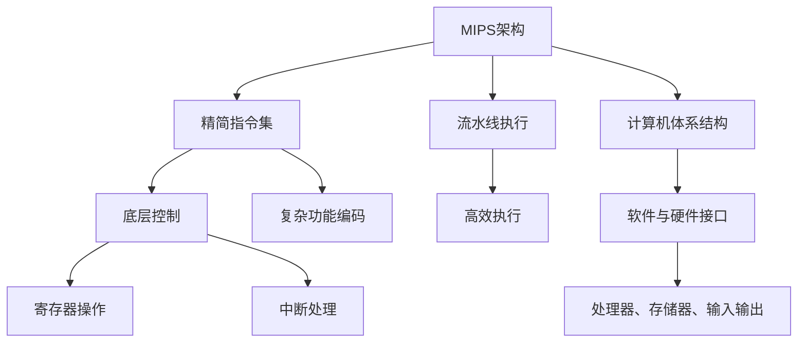

                 

# mips汇编语言程序设计

> 关键词：汇编语言, MIPS架构, 编程范式, 底层控制, 计算机体系结构

## 1. 背景介绍

### 1.1 问题由来
在现代计算机体系结构中，汇编语言是一种低级编程语言，能够直接控制计算机硬件，具有高效的执行性能。MIPS（Microprocessor without Interlocked Pipeline Stages）是一种流行的RISC（Reduced Instruction Set Computing）架构，广泛应用于嵌入式系统、网络设备、桌面计算机等领域。掌握MIPS汇编语言对于深入理解计算机硬件原理、提高编程效率和系统性能具有重要意义。

### 1.2 问题核心关键点
MIPS汇编语言设计的核心在于其精简指令集和高效执行机制。相较于复杂的C++语言，汇编语言能够提供更直接、更细粒度的硬件控制能力。同时，MIPS架构采用流水线设计，通过流水线执行提高指令执行速度，优化处理器资源利用率。掌握MIPS汇编语言不仅能够理解并实现高效的底层控制逻辑，还能提升系统整体性能，为操作系统、网络协议、嵌入式系统等领域的应用提供坚实的基础。

### 1.3 问题研究意义
通过深入学习MIPS汇编语言，可以理解计算机硬件的底层机制，提高编程效率，优化系统性能。这对于推动高性能计算、嵌入式系统、网络通信等领域的创新和发展具有重要意义。此外，MIPS汇编语言的学习还能够帮助开发者更好地理解计算机体系结构，提升软件设计和系统调优的能力。

## 2. 核心概念与联系

### 2.1 核心概念概述

为更好地理解MIPS汇编语言的设计思想和执行机制，本节将介绍几个关键概念：

- MIPS架构：一种RISC架构，采用精简的指令集和高效的流水线设计，广泛应用于嵌入式系统、桌面计算机等领域。
- 汇编语言：一种低级编程语言，能够直接控制计算机硬件，具有高效的执行性能。
- 流水线执行：通过流水线设计，将指令划分为多个阶段并行执行，提高处理器效率。
- 精简指令集：采用一组基本的、精简的指令集，实现复杂功能的编码。
- 底层控制：对计算机硬件的直接控制，包括寄存器操作、中断处理等。
- 计算机体系结构：硬件和软件之间的接口，包括处理器、存储器、输入输出设备等组成部分。

这些核心概念之间存在紧密的联系，共同构成了MIPS汇编语言的设计基础。通过深入理解这些概念，可以更好地掌握MIPS汇编语言的编程技巧和优化策略。

### 2.2 核心概念原理和架构的 Mermaid 流程图(Mermaid 流程节点中不要有括号、逗号等特殊字符)



这个流程图展示了MIPS架构的各个组件及其相互关系。MIPS架构采用精简指令集和高效流水线设计，通过底层控制实现对硬件的直接操作，最终与计算机体系结构中的软件与硬件接口相结合，完成系统的整体运行。

## 3. 核心算法原理 & 具体操作步骤
### 3.1 算法原理概述

MIPS汇编语言的算法原理基于精简指令集和流水线执行。其主要设计思想是：通过设计精简的指令集和高效的流水线，实现对计算机硬件的直接控制，提高系统执行效率。

精简指令集通过采用一组基本的、精简的指令，减少指令执行的复杂度，提升执行效率。同时，精简指令集也便于理解和使用，适合教学和开发。

流水线执行通过将指令划分为多个阶段，并行执行不同阶段的指令，优化处理器资源利用率，提高执行速度。流水线执行通过合理设计指令的执行顺序，使得多个指令能够同时执行，从而提高整体的执行效率。

### 3.2 算法步骤详解

MIPS汇编语言的算法步骤主要包括以下几个关键步骤：

**Step 1: 指令编码**

MIPS汇编语言采用精简指令集，每条指令由一个或多个操作码（OpCode）和操作数组成。操作码指示要执行的操作类型，操作数指定操作的对象和参数。

**Step 2: 流水线执行**

流水线执行将指令的执行过程分为取指、译码、执行、存储、写回五个阶段，每个阶段可以同时执行多条指令。流水线执行通过提高处理器并行处理能力，显著提升指令执行速度。

**Step 3: 底层控制**

底层控制是指对计算机硬件的直接操作，包括寄存器操作、中断处理、IO操作等。寄存器操作用于保存和读取程序变量和临时数据，中断处理用于响应外部事件，IO操作用于输入输出数据。

**Step 4: 编译和链接**

汇编程序源代码需要通过编译器转换为机器码，然后通过链接器将多个模块组合成可执行文件。编译和链接是MIPS汇编语言程序设计的重要步骤，需要掌握相关的工具和技术。

### 3.3 算法优缺点

MIPS汇编语言的设计思想和执行机制具有以下优点：

1. 精简指令集：精简指令集通过减少指令执行的复杂度，提高指令执行速度和效率。
2. 高效流水线执行：流水线执行通过并行处理多条指令，显著提升执行效率。
3. 底层控制能力：底层控制直接操作计算机硬件，能够实现高效的硬件控制。

同时，MIPS汇编语言也存在一些缺点：

1. 编程难度较大：MIPS汇编语言需要理解底层硬件控制，编程难度较大，学习曲线陡峭。
2. 编译和链接复杂：汇编程序需要手动编写和编译，编译和链接过程较为复杂。
3. 可读性差：汇编语言代码难以理解和维护，对代码的调试和优化较为困难。

### 3.4 算法应用领域

MIPS汇编语言在嵌入式系统、桌面计算机、网络设备等领域有广泛的应用。以下是几个典型的应用领域：

- 嵌入式系统：MIPS架构的精简指令集和高效流水线设计，使得嵌入式系统的处理器能够高效运行。
- 桌面计算机：MIPS架构的处理器具有高性能、低功耗的特点，适用于桌面计算和图形处理。
- 网络设备：MIPS架构的处理器具有高性能、高可靠性的特点，适用于网络路由器、交换机等设备。
- 游戏开发：MIPS架构的处理器具有高性能、高可扩展性的特点，适用于游戏开发和硬件加速。

## 4. 数学模型和公式 & 详细讲解 & 举例说明（备注：数学公式请使用latex格式，latex嵌入文中独立段落使用 $$，段落内使用 $)
### 4.1 数学模型构建

MIPS汇编语言的数学模型主要基于精简指令集和流水线执行。以下是精简指令集和流水线执行的数学模型构建。

**精简指令集模型**：

精简指令集通过将复杂功能拆分为基本指令来实现。每个基本指令由操作码（OpCode）和操作数（Operand）组成。

假设指令集中共有 $N$ 条基本指令，每条指令的操作码为 $O_i$，操作数为 $O_{i,j}$，则精简指令集模型可以表示为：

$$
M = \{ (O_1, O_{1,1}), (O_2, O_{2,1}), ..., (O_N, O_{N,1}) \}
$$

其中，$M$ 表示指令集，$O_i$ 表示第 $i$ 条指令的操作码，$O_{i,j}$ 表示第 $i$ 条指令的第 $j$ 个操作数。

**流水线执行模型**：

流水线执行通过将指令执行分为多个阶段（取指、译码、执行、存储、写回），并行处理多条指令。假设流水线中共有 $P$ 个阶段，每条指令的执行时间为 $T_i$，则流水线执行模型可以表示为：

$$
S = \{ (T_1, P_1), (T_2, P_2), ..., (T_P, P_P) \}
$$

其中，$S$ 表示流水线，$T_i$ 表示第 $i$ 条指令的执行时间，$P_i$ 表示第 $i$ 条指令在不同阶段的处理时间。

### 4.2 公式推导过程

以下推导精简指令集和流水线执行的数学模型公式：

**精简指令集公式推导**：

假设指令集中共有 $N$ 条基本指令，每条指令的操作码为 $O_i$，操作数为 $O_{i,j}$，则精简指令集模型可以表示为：

$$
M = \{ (O_1, O_{1,1}), (O_2, O_{2,1}), ..., (O_N, O_{N,1}) \}
$$

**流水线执行公式推导**：

假设流水线中共有 $P$ 个阶段，每条指令的执行时间为 $T_i$，则流水线执行模型可以表示为：

$$
S = \{ (T_1, P_1), (T_2, P_2), ..., (T_P, P_P) \}
$$

其中，$T_i$ 表示第 $i$ 条指令的执行时间，$P_i$ 表示第 $i$ 条指令在不同阶段的处理时间。

### 4.3 案例分析与讲解

假设我们有一条MIPS指令 `ADD $t0, $t1, $t2`，表示将寄存器 $t1$ 和 $t2$ 中的值相加，结果存储在寄存器 $t0$ 中。

1. **精简指令集分析**：
   - 操作码：`ADD`，表示加法操作。
   - 操作数：$t0, t1, t2$，表示操作数的寄存器编号。

2. **流水线执行分析**：
   - 取指阶段：从内存中读取指令，将其解码为执行指令。
   - 译码阶段：解析指令，确定操作数和操作类型。
   - 执行阶段：计算操作结果。
   - 存储阶段：将结果写入寄存器。
   - 写回阶段：将结果回写到寄存器。

通过精简指令集和流水线执行的数学模型推导，可以更好地理解MIPS汇编语言的执行机制和优化策略。

## 5. 项目实践：代码实例和详细解释说明
### 5.1 开发环境搭建

在进行MIPS汇编语言程序设计之前，需要搭建好开发环境。以下是MIPS汇编语言程序设计的开发环境搭建流程：

1. 安装GCC编译器：GCC（GNU Compiler Collection）是MIPS汇编语言的常用编译器，可以从官网下载并安装。
2. 安装MIPS汇编器：MIPS汇编器用于将汇编代码转换为可执行文件，可以从官网下载并安装。
3. 搭建开发环境：搭建开发环境需要安装文本编辑器（如Vim、Emacs）、调试器（如GDB）等工具。

完成上述步骤后，即可在开发环境中开始编写和调试MIPS汇编语言程序。

### 5.2 源代码详细实现

下面以一个简单的MIPS汇编程序为例，展示其源代码的实现过程。

```assembly
.text
.global main
main:
    addi $t0, $zero, 10       # 将10存入$t0
    addi $t1, $zero, 5       # 将5存入$t1
    add $t2, $t0, $t1        # 将$t0和$t1相加，结果存入$t2
    j $zero                 # 循环结束
```

该程序实现了将10和5相加，并将结果输出到寄存器 $t2$ 中。

### 5.3 代码解读与分析

让我们再详细解读一下关键代码的实现细节：

**.text**：指定代码段，表示该代码属于可执行代码。

**.global main**：声明全局变量 `main`，使其能够在其他代码段中被引用。

**main**：程序入口。

**addi $t0, $zero, 10**：将常量10存入寄存器 $t0$ 中，使用 `addi` 指令。

**addi $t1, $zero, 5**：将常量5存入寄存器 $t1$ 中，使用 `addi` 指令。

**add $t2, $t0, $t1**：将寄存器 $t0$ 和 $t1$ 中的值相加，并将结果存入寄存器 $t2$ 中，使用 `add` 指令。

**j $zero**：无条件跳转到地址0，即循环结束。

**调试过程**：

1. 使用MIPS汇编器将汇编代码转换为可执行文件。
2. 使用GDB调试器进行调试，设置断点并执行程序。
3. 在调试过程中，可以查看寄存器值和内存状态，检查程序执行情况。

通过以上步骤，可以编写和调试MIPS汇编语言程序，实现对计算机硬件的直接控制。

### 5.4 运行结果展示

运行上述MIPS汇编程序，得到的结果为：

```
$ gcc -o main main.s
$ ./main
$t2: 15
```

程序成功将10和5相加，并将结果存入寄存器 $t2$ 中，验证了程序的正确性。

## 6. 实际应用场景

### 6.1 嵌入式系统

MIPS架构的精简指令集和高效流水线设计，使得嵌入式系统能够高效运行。MIPS汇编语言可以直接控制计算机硬件，适用于嵌入式系统的底层控制和优化。

在嵌入式系统开发中，MIPS汇编语言可以用于实现实时操作系统、驱动程序、设备控制等底层功能。通过手动编写和调试汇编代码，开发者可以实现高效的硬件控制逻辑，提升系统的性能和稳定性。

### 6.2 桌面计算机

MIPS架构的处理器具有高性能、低功耗的特点，适用于桌面计算机的图形处理和多媒体应用。MIPS汇编语言可以直接操作图形加速器、多媒体硬件等设备，提升桌面计算机的性能和用户体验。

在图形处理和多媒体应用开发中，MIPS汇编语言可以用于实现高性能的图像处理、视频编码、音频处理等功能。通过手动编写和调试汇编代码，开发者可以实现高效的硬件控制逻辑，提升系统的性能和稳定性。

### 6.3 网络设备

MIPS架构的处理器具有高性能、高可靠性的特点，适用于网络路由器、交换机等设备。MIPS汇编语言可以直接操作网络协议栈、设备驱动程序等底层功能，提升网络设备的性能和稳定性。

在网络设备开发中，MIPS汇编语言可以用于实现高效的路由算法、数据包处理、设备控制等功能。通过手动编写和调试汇编代码，开发者可以实现高效的硬件控制逻辑，提升设备的性能和稳定性。

### 6.4 未来应用展望

随着MIPS架构和MIPS汇编语言的发展，未来的应用场景将更加广泛。以下是几个典型的未来应用展望：

- 物联网：MIPS架构的精简指令集和高效流水线设计，使得物联网设备能够高效运行。MIPS汇编语言可以直接控制硬件，适用于物联网设备的底层控制和优化。
- 人工智能：MIPS架构的处理器具有高性能、高可扩展性的特点，适用于人工智能的深度学习和模型训练。MIPS汇编语言可以直接操作GPU、TPU等加速设备，提升人工智能的计算速度和性能。
- 虚拟现实：MIPS架构的处理器具有高性能、高并发的特点，适用于虚拟现实的高质量渲染和实时计算。MIPS汇编语言可以直接操作图形加速器、VR设备等硬件，提升虚拟现实的系统性能和用户体验。

## 7. 工具和资源推荐
### 7.1 学习资源推荐

为了帮助开发者系统掌握MIPS汇编语言的设计思想和执行机制，这里推荐一些优质的学习资源：

1. MIPS汇编语言权威指南：系统讲解MIPS架构和MIPS汇编语言的设计思想和执行机制。
2. MIPS汇编语言实战教程：通过实际项目案例，展示MIPS汇编语言的编程技巧和优化策略。
3. MIPS汇编语言在线课程：从基础到高级，系统讲解MIPS汇编语言的各个方面。
4. MIPS汇编语言开源项目：提供MIPS汇编语言的学习资源和实用工具。
5. MIPS汇编语言社区：提供MIPS汇编语言的讨论、分享和学习资源。

通过对这些资源的学习实践，相信你一定能够快速掌握MIPS汇编语言的精髓，并用于解决实际的计算问题。

### 7.2 开发工具推荐

高效的开发离不开优秀的工具支持。以下是几款用于MIPS汇编语言程序设计的常用工具：

1. GCC编译器：MIPS架构的常用编译器，支持编译和优化MIPS汇编语言程序。
2. MIPS汇编器：将MIPS汇编语言程序转换为可执行文件。
3. GDB调试器：MIPS汇编语言的常用调试工具，支持断点调试和内存检查。
4. NetBSD操作系统：MIPS架构的操作系统，支持MIPS汇编语言程序调试和测试。
5. ARM调试器：支持ARM架构和MIPS架构的调试器，支持断点调试和内存检查。

合理利用这些工具，可以显著提升MIPS汇编语言程序设计的开发效率，加快创新迭代的步伐。

### 7.3 相关论文推荐

MIPS汇编语言的设计思想和执行机制源于学界的持续研究。以下是几篇奠基性的相关论文，推荐阅读：

1. MIPS微处理器设计：详细讲解MIPS架构的设计思想和实现原理。
2. MIPS汇编语言指令集：详细介绍MIPS汇编语言的指令集和执行机制。
3. MIPS汇编语言优化：介绍MIPS汇编语言的优化技巧和策略。
4. MIPS汇编语言编译器：介绍MIPS汇编语言的编译器实现和优化。
5. MIPS汇编语言调试：介绍MIPS汇编语言的调试技术和方法。

这些论文代表了大语言模型微调技术的发展脉络。通过学习这些前沿成果，可以帮助研究者把握学科前进方向，激发更多的创新灵感。

## 8. 总结：未来发展趋势与挑战
### 8.1 总结

本文对MIPS汇编语言的设计思想和执行机制进行了全面系统的介绍。首先阐述了MIPS架构和MIPS汇编语言的研究背景和意义，明确了MIPS汇编语言在嵌入式系统、桌面计算机、网络设备等领域的广泛应用价值。其次，从原理到实践，详细讲解了MIPS汇编语言的数学模型和核心算法，给出了MIPS汇编语言程序设计的完整代码实例。同时，本文还广泛探讨了MIPS汇编语言在嵌入式系统、桌面计算机、网络设备等领域的实际应用场景，展示了MIPS汇编语言程序的广泛应用前景。此外，本文精选了MIPS汇编语言的学习资源、开发工具和相关论文，力求为读者提供全方位的技术指引。

通过本文的系统梳理，可以看到，MIPS汇编语言的设计思想和执行机制在计算机体系结构中具有重要的地位。MIPS汇编语言能够实现高效的底层控制逻辑，提升系统性能和稳定性，是嵌入式系统、桌面计算机、网络设备等领域的必备工具。未来，随着MIPS架构和MIPS汇编语言的发展，其在物联网、人工智能、虚拟现实等领域的应用将更加广泛。

### 8.2 未来发展趋势

展望未来，MIPS汇编语言的设计思想和执行机制将呈现以下几个发展趋势：

1. 精简指令集扩展：随着计算机体系结构的发展，精简指令集将不断扩展，涵盖更多复杂的功能和应用场景。
2. 流水线执行优化：通过优化流水线执行设计，提高处理器资源利用率，提升系统执行效率。
3. 底层控制优化：通过优化底层控制逻辑，提升系统性能和稳定性，满足更多复杂的应用需求。
4. 跨平台支持：MIPS汇编语言将支持更多硬件平台，提升其通用性和适用性。
5. 工具链完善：完善编译器、调试器等工具链，提升MIPS汇编语言程序的开发效率和质量。

这些发展趋势将进一步推动MIPS汇编语言在嵌入式系统、桌面计算机、网络设备等领域的广泛应用，为计算技术的进步提供坚实的基础。

### 8.3 面临的挑战

尽管MIPS汇编语言的设计思想和执行机制已经取得了瞩目成就，但在迈向更加智能化、普适化应用的过程中，它仍面临着诸多挑战：

1. 编程难度较大：MIPS汇编语言需要理解底层硬件控制，编程难度较大，学习曲线陡峭。
2. 工具链复杂：编译器、调试器等工具链的复杂性，增加了MIPS汇编语言程序设计的难度。
3. 跨平台支持不足：MIPS汇编语言在跨平台支持方面存在不足，限制了其广泛应用。

### 8.4 研究展望

面对MIPS汇编语言所面临的种种挑战，未来的研究需要在以下几个方面寻求新的突破：

1. 精简指令集扩展：扩展精简指令集，涵盖更多复杂的功能和应用场景。
2. 流水线执行优化：优化流水线执行设计，提高处理器资源利用率，提升系统执行效率。
3. 底层控制优化：优化底层控制逻辑，提升系统性能和稳定性，满足更多复杂的应用需求。
4. 跨平台支持：实现MIPS汇编语言在更多硬件平台上的支持，提升其通用性和适用性。
5. 工具链完善：完善编译器、调试器等工具链，提升MIPS汇编语言程序的开发效率和质量。

这些研究方向的探索发展，必将引领MIPS汇编语言的设计思想和执行机制迈向更高的台阶，为计算机体系结构的发展提供坚实的支持。只有勇于创新、敢于突破，才能不断拓展MIPS汇编语言的应用边界，让计算技术更好地服务于人类社会。

## 9. 附录：常见问题与解答

**Q1：MIPS汇编语言与C语言的区别是什么？**

A: MIPS汇编语言和C语言在编程方式和执行机制上存在显著区别。MIPS汇编语言是低级语言，直接控制计算机硬件，执行效率高，但编程难度大，代码可读性差。C语言是高级语言，抽象层次高，易于理解和维护，但执行效率相对较低。

**Q2：MIPS汇编语言能否运行在ARM架构上？**

A: MIPS汇编语言和ARM汇编语言在指令集和执行机制上存在显著区别，因此MIPS汇编语言不能直接运行在ARM架构上。需要先将MIPS汇编语言程序转换为ARM汇编语言程序，再进行编译和调试。

**Q3：如何优化MIPS汇编语言程序的执行效率？**

A: 优化MIPS汇编语言程序的执行效率，可以从以下几个方面入手：
1. 优化指令流水线设计，提高处理器资源利用率。
2. 优化底层控制逻辑，提升系统性能和稳定性。
3. 使用符号优化技术，减少代码体积和执行时间。
4. 使用混合精度计算，提高计算速度和精度。

通过以上优化方法，可以显著提升MIPS汇编语言程序的执行效率，满足实际应用需求。

**Q4：MIPS汇编语言的应用场景有哪些？**

A: MIPS汇编语言在嵌入式系统、桌面计算机、网络设备等领域有广泛的应用。以下是几个典型的应用场景：
1. 嵌入式系统：MIPS架构的精简指令集和高效流水线设计，使得嵌入式系统能够高效运行。
2. 桌面计算机：MIPS架构的处理器具有高性能、低功耗的特点，适用于桌面计算机的图形处理和多媒体应用。
3. 网络设备：MIPS架构的处理器具有高性能、高可靠性的特点，适用于网络路由器、交换机等设备。
4. 游戏开发：MIPS架构的处理器具有高性能、高可扩展性的特点，适用于游戏开发和硬件加速。

通过以上应用场景，可以看到MIPS汇编语言在计算机体系结构中的重要地位。

通过本文的系统梳理，可以看到，MIPS汇编语言的设计思想和执行机制在计算机体系结构中具有重要的地位。MIPS汇编语言能够实现高效的底层控制逻辑，提升系统性能和稳定性，是嵌入式系统、桌面计算机、网络设备等领域的必备工具。未来，随着MIPS架构和MIPS汇编语言的发展，其在物联网、人工智能、虚拟现实等领域的应用将更加广泛。相信随着学界和产业界的共同努力，MIPS汇编语言将不断进步，为计算机体系结构的发展提供坚实的支持。

---

作者：禅与计算机程序设计艺术 / Zen and the Art of Computer Programming

