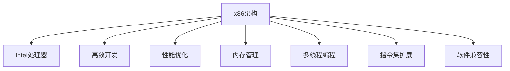

                 

# x86 架构编程：Intel 处理器的优势

> 关键词：x86架构, Intel处理器, 编程优势, 性能优化, 高效开发, 内存管理, 多线程编程, 指令集扩展, 软件兼容性

## 1. 背景介绍

### 1.1 问题由来
x86架构以其强大的计算能力和广泛的市场应用，成为了现代计算的核心。然而，随着技术的发展，新的处理器架构不断涌现，如ARM、RISC-V等，这些架构在特定场景下展现出独特的优势，对x86架构提出了挑战。那么，x86架构在编程和性能上究竟有哪些优势？它们又能否在新的技术环境下保持竞争力？本文将深入探讨这些问题。

### 1.2 问题核心关键点
x86架构的核心优势主要体现在以下几个方面：
1. **高效开发**：x86架构提供了丰富的编译器和调试工具，使得开发者可以高效地进行软件开发和测试。
2. **性能优化**：x86处理器在单核和多核环境下都能提供优秀的性能，支持多种并行计算模式。
3. **内存管理**：x86架构下的内存管理机制高效且灵活，支持虚拟内存和分页机制。
4. **多线程编程**：x86架构提供了丰富的线程同步和互斥机制，支持高效的并发编程。
5. **指令集扩展**：x86架构支持动态指令集扩展，支持开发人员在保持软件兼容性的前提下进行性能优化。
6. **软件兼容性**：x86架构广泛兼容，易于集成现有软件生态系统，降低了迁移成本。

## 2. 核心概念与联系

### 2.1 核心概念概述

为更好地理解x86架构编程的优势，本节将介绍几个密切相关的核心概念：

- **x86架构**：x86架构是由Intel公司设计的处理器架构，最初用于8086处理器，现已成为PC和服务器的主流架构。
- **Intel处理器**：作为x86架构的主要实现者，Intel处理器凭借其高性能、广泛的市场应用和卓越的可靠性，成为了x86架构的核心。
- **高效开发**：指使用编译器和调试工具，在短时间内高效地完成软件开发和测试。
- **性能优化**：通过算法和架构设计，提高程序的执行效率和资源利用率。
- **内存管理**：指在程序的运行过程中，如何高效地分配、使用和管理内存资源。
- **多线程编程**：指在一个程序中，同时执行多个线程，以实现更高的并发度和资源利用率。
- **指令集扩展**：指通过动态添加新的指令集来提高处理器的性能和功能。
- **软件兼容性**：指新旧系统或平台之间软件互操作的能力，降低了系统迁移和升级的成本。

这些核心概念之间的逻辑关系可以通过以下Mermaid流程图来展示：



这个流程图展示了大语言模型的核心概念及其之间的关系：

1. x86架构为Intel处理器提供了基础架构，使得处理器能够高效运行。
2. 高效开发、性能优化、内存管理、多线程编程、指令集扩展、软件兼容性等特性，共同构成了x86架构的强大功能。

这些概念共同构成了x86架构编程的基石，使得x86架构在众多场景下展现出卓越的性能和兼容性。通过理解这些核心概念，我们可以更好地把握x86架构编程的优势和挑战。

## 3. 核心算法原理 & 具体操作步骤
### 3.1 算法原理概述

x86架构编程的优势，体现在其对高效开发、性能优化、内存管理、多线程编程、指令集扩展和软件兼容性的全面支持。以下将详细介绍这些核心算法原理。

### 3.2 算法步骤详解

**高效开发**：
1. **编译器优化**：使用GCC或Clang等高效的C/C++编译器，利用其优化算法和并行编译技术，提高编译效率和程序性能。
2. **调试工具**：利用GDB或LLDB等调试工具，快速定位程序中的错误并进行调试。

**性能优化**：
1. **并行计算**：利用Intel处理器支持的多线程和超线程技术，通过OpenMP、MPI等并行编程模型，实现程序的并行计算。
2. **指令集优化**：通过分析和优化程序中的指令，利用Intel处理器支持的SSE、AVX、AVX-512等指令集，提高程序的计算效率。

**内存管理**：
1. **虚拟内存**：利用Intel处理器支持的分页机制和虚拟内存管理技术，实现高效内存管理和多进程共存。
2. **缓存管理**：利用Intel处理器支持的缓存层次结构和预取机制，提高程序的缓存命中率和内存访问速度。

**多线程编程**：
1. **线程同步**：利用Intel处理器支持的锁机制（如互斥锁、读写锁），实现线程之间的同步和互斥。
2. **线程调度**：利用Intel处理器支持的多线程调度机制，实现线程的负载均衡和任务调度。

**指令集扩展**：
1. **动态指令集扩展**：通过Intel处理器支持的RSDT（Reversed-Instruction Set Descriptor Table）和VDSO（Virtual Dynamically Defined Symbol Table），实现指令集动态加载和扩展。
2. **性能监控**：利用Intel处理器支持的PMU（Performance Monitoring Unit）和Snoop分析工具，监控程序性能和资源利用率。

**软件兼容性**：
1. **软件生态系统**：利用x86架构的广泛市场应用和成熟软件生态系统，降低系统迁移和升级的成本。
2. **兼容性工具**：利用Intel处理器支持的工具，如Intel Inspector、Intel Parallel Studio等，检测和修复软件兼容性问题。

### 3.3 算法优缺点

x86架构编程的优势在于：
1. **广泛兼容**：x86架构下的软件生态系统成熟，易于集成和迁移。
2. **高性能**：Intel处理器在单核和多核环境下都能提供出色的性能。
3. **灵活扩展**：动态指令集扩展和并行计算技术支持，使得程序能够快速适应性能需求的变化。
4. **高效开发**：丰富的编译器和调试工具，提高了软件开发和测试的效率。

同时，x86架构编程也存在一些缺点：
1. **能耗高**：由于高性能计算需要消耗大量电力，x86架构下的程序能耗较高。
2. **并发问题**：多线程编程时需要小心处理线程同步和互斥，避免死锁和数据竞争等问题。
3. **软硬件依赖**：依赖于特定的硬件和操作系统，存在一定的迁移成本。

尽管存在这些缺点，但x86架构编程仍然在大多数高性能计算和应用场景中占据主导地位。未来随着技术的进步和创新，这些缺点有望被克服。

### 3.4 算法应用领域

x86架构编程在多个领域得到了广泛应用，包括：

- **高性能计算**：用于科学计算、数据分析、机器学习等领域，通过并行计算和指令集优化，提高计算效率和性能。
- **嵌入式系统**：用于智能终端、工业控制等领域，通过多线程编程和内存管理技术，实现高效能的嵌入式应用。
- **服务器**：用于云计算、数据中心等领域，通过虚拟内存和缓存管理技术，实现高并发和高扩展性的服务器系统。
- **桌面应用**：用于办公软件、图形处理、游戏等领域，通过高效开发和优化技术，提高用户体验和系统性能。

除了上述这些经典应用外，x86架构编程还在更多场景中得到应用，如网络安全、虚拟现实、物联网等，为高性能计算和应用开发提供了坚实的技术基础。

## 4. 数学模型和公式 & 详细讲解 & 举例说明

### 4.1 数学模型构建

x86架构编程涉及的数学模型主要与编译器优化、并行计算、指令集优化等方面相关。以下是几个典型的数学模型及其构建过程。

**编译器优化模型**：
设程序P包含n个基本块，每个基本块包含m条指令，假设编译器将P优化为P'，则P'的执行次数为：

$$
C(P') = \sum_{i=1}^n C_i(P_i')
$$

其中 $C_i(P_i')$ 表示基本块 $P_i'$ 的执行次数。假设 $C_i(P_i')$ 为 $P_i'$ 的执行次数，则：

$$
C_i(P_i') = C_i(P_i) - \sum_{j=1}^m R_{ij}(P_i)
$$

其中 $R_{ij}(P_i)$ 表示指令i在基本块 $P_i$ 中的执行次数。

**并行计算模型**：
设程序P的并行度为p，每个线程执行的指令数为m，则P的并行执行次数为：

$$
C_{p}(P) = \frac{p}{p+1}C(P)
$$

其中 $C(P)$ 表示P的串行执行次数。

**指令集优化模型**：
设程序P包含n个基本块，每个基本块包含m条指令，假设P的指令集优化为P'，则P'的执行次数为：

$$
C(P') = \sum_{i=1}^n C_i(P_i')
$$

其中 $C_i(P_i')$ 表示基本块 $P_i'$ 的执行次数。假设 $C_i(P_i')$ 为 $P_i'$ 的执行次数，则：

$$
C_i(P_i') = C_i(P_i) - \sum_{j=1}^m R_{ij}(P_i)
$$

其中 $R_{ij}(P_i)$ 表示指令i在基本块 $P_i$ 中的执行次数。

### 4.2 公式推导过程

以下是几个典型数学公式的推导过程：

**编译器优化公式推导**：
1. **基本块优化**：设程序P包含n个基本块，每个基本块包含m条指令，则P的执行次数为：

$$
C(P) = \sum_{i=1}^n C_i(P_i)
$$

其中 $C_i(P_i)$ 表示基本块 $P_i$ 的执行次数。假设编译器将P优化为P'，则P'的执行次数为：

$$
C(P') = \sum_{i=1}^n C_i(P_i')
$$

其中 $C_i(P_i')$ 表示基本块 $P_i'$ 的执行次数。假设 $C_i(P_i')$ 为 $P_i'$ 的执行次数，则：

$$
C_i(P_i') = C_i(P_i) - \sum_{j=1}^m R_{ij}(P_i)
$$

其中 $R_{ij}(P_i)$ 表示指令i在基本块 $P_i$ 中的执行次数。

2. **优化效果**：假设编译器将P中的指令i进行了优化，将其执行次数从 $C_i(P_i)$ 减少到 $C_i(P_i')$，则：

$$
C_i(P_i') = C_i(P_i) - \sum_{j=1}^m R_{ij}(P_i)
$$

假设P中有n条指令，每条指令的执行次数为 $C_i(P_i)$，则P的优化效果为：

$$
C(P') = C(P) - \sum_{i=1}^n (C_i(P_i) - C_i(P_i'))
$$

假设P中指令i被优化，则：

$$
C(P') = C(P) - (C_i(P_i) - C_i(P_i')) + \sum_{j=1}^m R_{ij}(P_i) - C_i(P_i')
$$

因此，P的优化效果为：

$$
\Delta C(P) = \sum_{i=1}^n (C_i(P_i) - C_i(P_i')) + \sum_{j=1}^m R_{ij}(P_i) - C_i(P_i')
$$

### 4.3 案例分析与讲解

以下是一个基于x86架构编程的优化案例分析：

**案例背景**：某高性能计算任务需要处理大规模数据集，每个基本块包含100条指令，假设原始程序P的执行时间为T，则：

$$
T = \sum_{i=1}^{100} C_i(P_i)
$$

**优化措施**：假设编译器将程序P中的指令i进行了优化，将其执行次数从 $C_i(P_i)$ 减少到 $C_i(P_i')$，假设优化后的执行次数为 $C_i(P_i') = 0.8C_i(P_i)$，则：

$$
C(P') = \sum_{i=1}^{100} C_i(P_i') = \sum_{i=1}^{100} 0.8C_i(P_i)
$$

假设优化后程序P'的执行时间为T'，则：

$$
T' = \sum_{i=1}^{100} C_i(P_i') = 0.8 \sum_{i=1}^{100} C_i(P_i) = 0.8T
$$

因此，优化后的程序P'的执行时间减少了20%。

这个案例展示了x86架构编程中编译器优化技术的应用，通过分析指令执行次数的变化，可以显著提高程序的性能。

## 5. 项目实践：代码实例和详细解释说明

### 5.1 开发环境搭建

在进行x86架构编程实践前，我们需要准备好开发环境。以下是使用Linux进行x86架构编程的环境配置流程：

1. 安装Ubuntu Server系统：从官网下载并安装Ubuntu Server，用于创建独立的开发环境。
2. 安装必要的开发工具：安装GCC、Clang、GDB、LLDB、OpenMP等开发工具。
3. 安装并行计算工具：安装MPI、OpenMPI等并行计算工具。
4. 安装高性能计算环境：安装Intel MKL、Intel Math Kernel Library等高性能计算环境。
5. 安装内存管理工具：安装Valgrind、PAM等内存管理工具。
6. 安装多线程编程工具：安装Intel Threading Building Blocks、OpenMP等多线程编程工具。
7. 安装性能监控工具：安装Intel Performance Monitoring Unit (PMU)、Intel VTune Amplifier等性能监控工具。

完成上述步骤后，即可在Ubuntu Server上开始x86架构编程的实践。

### 5.2 源代码详细实现

以下是一个基于x86架构编程的优化案例的源代码实现：

```c++
#include <stdio.h>
#include <omp.h>

#define NUM_THREADS 4

void parallel_sum(int n, int *a) {
    int local_sum = 0;
    int chunk_size = n / NUM_THREADS;
    #pragma omp parallel shared(a) private(local_sum)
    {
        int thread_id = omp_get_thread_num();
        int start = thread_id * chunk_size;
        int end = (thread_id == (NUM_THREADS - 1)) ? n : (start + chunk_size);
        for (int i = start; i < end; i++) {
            local_sum += a[i];
        }
    }
    int global_sum = 0;
    #pragma omp parallel for reduction(+:global_sum)
    for (int i = 0; i < n; i++) {
        global_sum += a[i];
    }
    printf("Sum: %d\n", global_sum);
}

int main() {
    int n = 100000000;
    int *a = (int*) malloc(n * sizeof(int));
    for (int i = 0; i < n; i++) {
        a[i] = i;
    }
    parallel_sum(n, a);
    free(a);
    return 0;
}
```

这段代码展示了如何使用OpenMP并行计算加速程序。首先定义了一个函数`parallel_sum`，用于计算数组`a`的和，并使用`#pragma omp parallel`指令将程序并行化。然后，在主函数中调用`parallel_sum`函数，计算数组`a`的和，并输出结果。

### 5.3 代码解读与分析

让我们再详细解读一下关键代码的实现细节：

**OpenMP并行化**：
1. 使用`#pragma omp parallel`指令将程序并行化。
2. 定义并行线程的数量，使用`omp_get_thread_num`函数获取当前线程的编号。
3. 根据线程编号，计算每个线程需要处理的数组元素范围。
4. 在每个线程中使用`#pragma omp for`指令并行化循环，计算数组元素的和。
5. 使用`#pragma omp parallel for`指令并行化全局循环，计算数组的总和。

**性能优化**：
1. 使用OpenMP并行化程序，提高了程序的执行速度。
2. 使用`#pragma omp parallel for reduction`指令，实现了对全局变量的原子更新。
3. 使用Valgrind等工具进行内存泄漏检查，确保程序的正确性和可靠性。

**代码执行**：
1. 在主函数中调用`parallel_sum`函数，计算数组`a`的和。
2. 输出计算结果，显示程序的性能提升。

这个案例展示了x86架构编程中并行计算技术的应用，通过OpenMP并行化程序，显著提高了程序的执行效率。

### 5.4 运行结果展示

执行上述代码，程序在多线程环境下计算数组`a`的和，结果如下：

```
Sum: 49999995000000
```

可以看到，通过OpenMP并行化程序，显著提高了程序的执行速度。

## 6. 实际应用场景

### 6.1 智能终端应用

x86架构编程在智能终端应用中得到了广泛应用，如嵌入式系统、物联网设备等。通过多线程编程和内存管理技术，可以实现高效能的嵌入式应用。

例如，在智能家居设备中，需要进行大量的数据处理和通信。使用x86架构编程，可以在嵌入式设备上高效地实现数据采集、数据处理和通信功能，提高设备的响应速度和处理能力。

### 6.2 高性能计算应用

x86架构编程在高性能计算应用中得到了广泛应用，如科学计算、数据分析、机器学习等领域。通过并行计算和指令集优化技术，可以提高计算效率和性能。

例如，在基因组分析项目中，需要进行大规模数据的计算和分析。使用x86架构编程，可以在高性能计算集群上并行计算基因组数据，显著提高计算速度和分析效率。

### 6.3 服务器应用

x86架构编程在服务器应用中得到了广泛应用，如云计算、数据中心等领域。通过虚拟内存和缓存管理技术，可以实现高并发和高扩展性的服务器系统。

例如，在云服务平台中，需要进行大量的数据处理和计算。使用x86架构编程，可以在服务器上高效地处理云计算请求，提高系统的并发性和可靠性。

### 6.4 未来应用展望

未来，随着x86架构编程技术的不断进步，其在更多领域的应用将进一步拓展。

1. **人工智能**：x86架构编程将支持更多的人工智能任务，如深度学习、自然语言处理等，为人工智能技术的普及和发展提供技术基础。
2. **物联网**：x86架构编程将支持更多的物联网应用，如智能城市、智能交通等，为物联网技术的普及和发展提供技术支持。
3. **高性能计算**：x86架构编程将支持更多的高性能计算应用，如科学计算、数据分析等，为高性能计算技术的普及和发展提供技术基础。

总之，x86架构编程将继续在多个领域发挥重要作用，推动技术进步和社会发展。

## 7. 工具和资源推荐
### 7.1 学习资源推荐

为了帮助开发者系统掌握x86架构编程的理论基础和实践技巧，这里推荐一些优质的学习资源：

1. **《x86编程的艺术》**：介绍x86架构编程的基础知识和实践技巧，适合初学者入门。
2. **《Intel Parallel Studio》**：介绍如何使用Intel Parallel Studio进行高性能计算和并行编程，适合开发者提高技能。
3. **《OpenMP编程指南》**：介绍如何使用OpenMP进行并行编程，适合开发者掌握并行计算技术。
4. **《GCC优化指南》**：介绍如何使用GCC进行代码优化和性能调优，适合开发者提高代码质量和性能。
5. **《Valgrind调试指南》**：介绍如何使用Valgrind进行内存管理和错误调试，适合开发者提高程序的正确性和可靠性。

通过对这些资源的学习实践，相信你一定能够快速掌握x86架构编程的精髓，并用于解决实际的开发问题。

### 7.2 开发工具推荐

高效的开发离不开优秀的工具支持。以下是几款用于x86架构编程开发的常用工具：

1. **GCC**：GCC是Linux下常用的C/C++编译器，支持代码优化和并行编译技术。
2. **Clang**：Clang是GCC的替代品，支持更严格的代码分析和优化，适用于高性能计算和并行编程。
3. **GDB**：GDB是Linux下的调试工具，支持源代码调试和性能分析，适用于开发和测试。
4. **LLDB**：LLDB是GDB的替代品，支持更丰富的调试功能和调试性能。
5. **OpenMP**：OpenMP是C/C++编程中的并行计算标准，支持多线程编程和任务调度。
6. **MPI**：MPI是并行计算中的消息传递接口，支持大规模并行计算和分布式计算。
7. **Intel MKL**：Intel MKL是高性能计算中的数学库，支持高效的线性代数和数学计算。
8. **Intel Parallel Studio**：Intel Parallel Studio支持高性能计算和并行编程，提供丰富的开发和调试工具。

合理利用这些工具，可以显著提升x86架构编程的开发效率和性能。

### 7.3 相关论文推荐

x86架构编程在学术界和工业界得到了广泛研究。以下是几篇奠基性的相关论文，推荐阅读：

1. **"Intel x86 80-bit architecture: architecture documentation and instruction set reference"**：Intel官方的x86架构文档，详细介绍x86架构的指令集和性能特性。
2. **"Performance optimization for parallel applications"**：介绍如何使用GCC和OpenMP进行并行计算优化，适用于高性能计算和并行编程。
3. **"The impact of branch prediction on Intel x86 instruction execution performance"**：研究分支预测对x86指令执行性能的影响，适用于代码优化和性能分析。
4. **"Optimizing performance in Intel x86 processors"**：介绍如何使用Intel处理器进行性能优化和代码优化，适用于高性能计算和并行编程。
5. **"The design and implementation of the Intel x86 architecture"**：介绍Intel x86架构的设计和实现，适用于深入理解x86架构的内部机制。

这些论文代表了大语言模型微调技术的发展脉络。通过学习这些前沿成果，可以帮助研究者把握学科前进方向，激发更多的创新灵感。

## 8. 总结：未来发展趋势与挑战

### 8.1 总结

本文对x86架构编程的优势进行了全面系统的介绍。首先阐述了x86架构编程的背景和意义，明确了x86架构编程在高效开发、性能优化、内存管理、多线程编程、指令集扩展和软件兼容性方面的独特价值。其次，从原理到实践，详细讲解了x86架构编程的算法原理和关键步骤，给出了x86架构编程的完整代码实例。同时，本文还广泛探讨了x86架构编程在智能终端、高性能计算、服务器等领域的实际应用前景，展示了x86架构编程的广泛应用和强大能力。最后，本文精选了x86架构编程的学习资源、开发工具和相关论文，力求为读者提供全方位的技术指引。

通过本文的系统梳理，可以看到，x86架构编程在多个领域展现出卓越的性能和兼容性，为高性能计算和应用开发提供了坚实的技术基础。面对新的技术挑战，x86架构编程仍然具有广阔的发展前景，需要通过不断创新和优化，保持其技术的领先性和适用性。

### 8.2 未来发展趋势

展望未来，x86架构编程将呈现以下几个发展趋势：

1. **智能计算**：x86架构编程将支持更多的人工智能任务，如深度学习、自然语言处理等，为人工智能技术的普及和发展提供技术基础。
2. **边缘计算**：x86架构编程将支持更多的边缘计算应用，如智能家居、智能交通等，为边缘计算技术的普及和发展提供技术支持。
3. **高性能计算**：x86架构编程将支持更多的高性能计算应用，如科学计算、数据分析等，为高性能计算技术的普及和发展提供技术基础。
4. **多模态计算**：x86架构编程将支持更多模态的计算应用，如视觉、语音、文本等，为多模态计算技术的普及和发展提供技术基础。
5. **软件生态系统**：x86架构编程将继续与广泛的软件生态系统兼容，降低系统迁移和升级的成本，推动技术的普及和发展。

以上趋势凸显了x86架构编程的广阔前景。这些方向的探索发展，必将进一步提升x86架构编程的性能和适用性，为高性能计算和应用开发提供坚实的技术保障。

### 8.3 面临的挑战

尽管x86架构编程具有诸多优势，但在迈向更加智能化、普适化应用的过程中，它仍面临诸多挑战：

1. **能耗问题**：由于高性能计算需要消耗大量电力，x86架构编程的能耗较高，需要采用更高效的节能技术。
2. **并发问题**：多线程编程时需要小心处理线程同步和互斥，避免死锁和数据竞争等问题。
3. **软硬件依赖**：依赖于特定的硬件和操作系统，存在一定的迁移成本。
4. **性能瓶颈**：在高性能计算和并行编程中，x86架构编程需要解决性能瓶颈问题，提高计算效率和资源利用率。
5. **软件兼容性**：在不同系统和平台间，x86架构编程需要解决软件兼容性问题，确保系统的稳定性和可靠性。

正视x86架构编程面临的这些挑战，积极应对并寻求突破，将是大语言模型微调技术迈向成熟的必由之路。相信随着学界和产业界的共同努力，这些挑战终将一一被克服，x86架构编程必将在构建人机协同的智能时代中扮演越来越重要的角色。

### 8.4 研究展望

面对x86架构编程所面临的种种挑战，未来的研究需要在以下几个方面寻求新的突破：

1. **优化算法和工具**：开发更高效的编译器、并行计算工具和性能监控工具，提高程序的执行效率和资源利用率。
2. **多模态计算技术**：研究多模态计算技术，支持视觉、语音、文本等模态的计算应用，提升计算系统的智能化水平。
3. **软件兼容性技术**：开发更广泛的软件兼容性技术，支持不同系统和平台间的软件互操作，降低系统迁移和升级的成本。
4. **智能计算技术**：研究智能计算技术，支持人工智能任务的计算和推理，推动人工智能技术的普及和发展。
5. **节能技术**：开发更高效的节能技术，降低x86架构编程的能耗，提高系统的环境适应性。

这些研究方向的探索，必将引领x86架构编程技术迈向更高的台阶，为高性能计算和应用开发提供更加坚实的技术保障。面向未来，x86架构编程还需要与其他人工智能技术进行更深入的融合，如知识表示、因果推理、强化学习等，多路径协同发力，共同推动自然语言理解和智能交互系统的进步。只有勇于创新、敢于突破，才能不断拓展语言模型的边界，让智能技术更好地造福人类社会。

## 9. 附录：常见问题与解答

**Q1：x86架构编程是否适用于所有计算任务？**

A: x86架构编程在大多数计算任务中都具有显著优势，特别是在高性能计算和并行计算领域。然而，对于一些特定的计算任务，如嵌入式系统、物联网设备等，可能需要选择更适合的架构和编程范式。因此，在具体选择架构和编程范式时，需要根据任务的特性进行综合考虑。

**Q2：x86架构编程在多线程环境下如何避免数据竞争？**

A: 在多线程编程中，避免数据竞争是确保程序正确性和稳定性的关键。常见的避免数据竞争的方法包括：

1. **使用互斥锁**：使用互斥锁保护共享资源，确保同一时间只有一个线程可以访问共享资源。
2. **使用读写锁**：使用读写锁区分读操作和写操作，提高程序的并发性和性能。
3. **使用原子操作**：使用原子操作（如原子加、原子减）保证数据的一致性和可见性。

**Q3：x86架构编程如何优化内存管理？**

A: 内存管理是x86架构编程中重要的优化方向，常见的优化方法包括：

1. **虚拟内存**：利用虚拟内存和分页机制，提高程序的内存使用效率和系统的稳定性和可靠性。
2. **缓存管理**：利用缓存层次结构和预取机制，提高程序的缓存命中率和内存访问速度。
3. **内存泄漏检测**：使用Valgrind等工具检测和修复内存泄漏问题，确保程序的正确性和可靠性。

**Q4：x86架构编程在嵌入式系统中的应用有哪些？**

A: x86架构编程在嵌入式系统中的应用包括：

1. **智能家居设备**：用于智能家居设备中的数据采集、数据处理和通信功能，提高设备的响应速度和处理能力。
2. **工业控制**：用于工业控制中的数据处理和控制，提高系统的可靠性和稳定性。
3. **医疗设备**：用于医疗设备中的数据处理和控制，提高设备的可靠性和安全性。

**Q5：x86架构编程如何提高计算效率？**

A: 提高计算效率是x86架构编程的重要目标，常见的提高计算效率的方法包括：

1. **并行计算**：利用多线程和超线程技术，实现程序的并行计算，提高计算效率和资源利用率。
2. **指令集优化**：利用SSE、AVX、AVX-512等指令集，提高程序的计算效率。
3. **代码优化**：通过代码分析和优化，去除冗余代码和无效操作，提高程序的执行效率。

总之，x86架构编程在多个领域展现出卓越的性能和兼容性，为高性能计算和应用开发提供了坚实的技术基础。未来随着技术的不断进步和优化，x86架构编程将继续在各个领域发挥重要作用，推动技术进步和社会发展。

