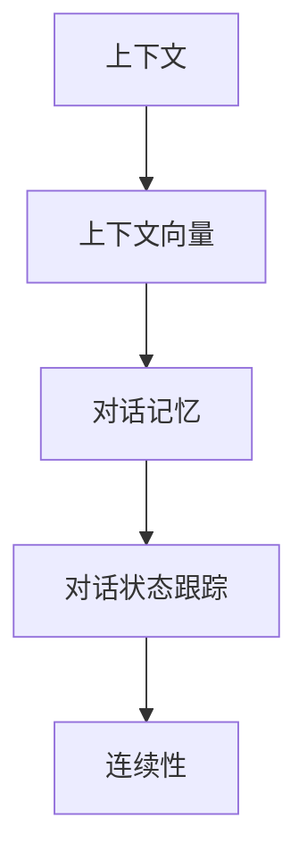

                 

## 1. 背景介绍

### 1.1 问题由来
随着人工智能技术的迅猛发展，智能聊天机器人（Chatbot）逐渐进入人们的视野。它们不仅能够执行简单任务，如信息查询和日程安排，还能进行复杂对话，提供情感支持。然而，这些机器人往往面临一个核心问题：上下文感知能力不足，难以维持长时间的连贯对话。

对话系统本质上是一种动态交互过程，需要在对话过程中考虑之前的交流内容。如果系统不能感知并利用上下文信息，就会导致对话中断、回答不连贯、甚至生成不相关或不恰当的响应，严重影响用户体验。因此，上下文感知能力是构建智能聊天机器人的关键。

### 1.2 问题核心关键点
上下文感知能力是指聊天机器人能够理解并保留对话过程中的上下文信息，以便生成连贯且相关的响应。要实现这一目标，需要解决以下几个核心问题：

1. **上下文信息的存储与处理**：如何有效地存储和利用对话中的上下文信息。
2. **上下文信息的融合**：如何将新的输入与已有的上下文信息融合，生成连贯的响应。
3. **对话记忆与遗忘**：如何管理对话记忆，避免信息过载或遗忘。
4. **对话逻辑与连贯性**：如何确保生成的响应逻辑一致，连贯性良好。

这些问题的解决将显著提升智能聊天机器人的性能，使其能够与用户进行更加自然、流畅的对话。

## 2. 核心概念与联系

### 2.1 核心概念概述

为更好地理解上下文感知的实现方法，本节将介绍几个密切相关的核心概念：

- **上下文**：对话过程中先前的所有信息和交流。
- **上下文向量**：用于存储和表示对话上下文的向量，可以是简单的词汇向量，也可以是更复杂的表示。
- **对话记忆**：对话系统中存储上下文信息的机制，可以是显式的存储，也可以是隐式的记忆。
- **对话状态跟踪**：维护对话上下文的过程，包括对话的当前阶段、用户意图等。
- **连续性**：对话中的响应是否连贯、逻辑是否一致，是衡量对话质量的重要指标。

这些概念之间的逻辑关系可以通过以下Mermaid流程图来展示：



这个流程图展示上下文感知能力的核心组件及其之间的关系：

1. 上下文作为对话的基础信息。
2. 上下文向量用于编码上下文信息，便于存储和处理。
3. 对话记忆用于维护上下文信息，可以是显式的存储，也可以是隐式的记忆。
4. 对话状态跟踪用于记录对话当前阶段和用户意图，保持对话连贯性。
5. 连续性是对话质量的关键指标，需要上下文感知能力来确保。

## 3. 核心算法原理 & 具体操作步骤
### 3.1 算法原理概述

上下文感知能力的实现主要依赖于对话记忆和对话状态跟踪。其核心思想是：通过对话记忆存储和处理对话上下文，利用对话状态跟踪管理对话流程，并在生成响应时考虑上下文信息，以保持对话连贯性。

具体而言，算法步骤包括：

1. **上下文编码**：将对话上下文编码为上下文向量，用于后续处理。
2. **对话记忆更新**：在每次对话过程中，更新对话记忆，存储当前对话上下文。
3. **对话状态跟踪**：在对话过程中，跟踪对话状态，包括用户意图、对话历史等。
4. **响应生成**：根据对话上下文和对话状态，生成连贯且逻辑一致的响应。

### 3.2 算法步骤详解

**Step 1: 上下文编码**
- 对话中的每个消息可以表示为文本字符串。
- 使用词向量或Transformer模型将文本字符串转换为向量表示。
- 可以将当前消息与之前的消息向量进行拼接或加权求和，形成当前消息的上下文向量。

**Step 2: 对话记忆更新**
- 对话记忆可以是显式的存储，如使用列表或哈希表；也可以是隐式的记忆，如使用神经网络的状态向量。
- 在每次对话时，将新的上下文向量添加到对话记忆中。
- 可以使用滑动窗口或固定长度的机制，限制对话记忆的大小，避免信息过载。

**Step 3: 对话状态跟踪**
- 对话状态可以表示为状态向量，记录对话的当前阶段、用户意图等。
- 在每次对话时，更新对话状态向量，记录最新的上下文信息和用户输入。
- 对话状态向量可以与上下文向量一起输入到模型中，帮助生成响应。

**Step 4: 响应生成**
- 使用对话记忆中的上下文向量与对话状态向量，输入到生成模型中，生成响应。
- 生成模型可以是循环神经网络（RNN）、变压器（Transformer）等，能够捕捉上下文信息和对话状态。
- 在生成响应时，可以使用注意力机制，根据对话记忆中的不同部分，动态地关注和融合上下文信息。

### 3.3 算法优缺点

上下文感知的算法具有以下优点：
1. **提升对话连贯性**：通过对话记忆和对话状态跟踪，能够维持对话连贯性，生成更自然流畅的响应。
2. **提高用户满意度**：上下文感知的聊天机器人能够更好地理解用户意图，提供更准确、相关的回答。
3. **减少错误和重复**：对话记忆能够避免信息丢失和重复，减少不相关或错误的响应。

同时，该算法也存在一些局限性：
1. **计算复杂度高**：上下文感知的实现需要存储和处理对话上下文，计算复杂度较高，尤其是大规模对话系统。
2. **存储空间需求大**：对话记忆需要占用大量存储空间，尤其是在存储大量对话历史时。
3. **模型训练复杂**：需要训练复杂的生成模型，以捕捉对话中的上下文信息。
4. **上下文管理难度大**：对话记忆和对话状态跟踪需要精心设计，以避免信息过载和遗忘。

尽管存在这些局限性，但上下文感知技术在提升聊天机器人对话质量方面具有显著优势，因此成为了对话系统研究的重要方向。

### 3.4 算法应用领域

上下文感知技术在以下领域有广泛应用：

- **客户服务**：智能客服机器人可以通过上下文感知能力，提供个性化和连贯的服务，提升用户体验。
- **在线教育**：智能教育系统能够通过上下文感知，根据学生的学习情况和历史数据，生成个性化的学习建议。
- **健康咨询**：智能健康咨询机器人可以通过上下文感知，根据患者的病史和当前症状，提供更准确的医疗建议。
- **娱乐互动**：智能娱乐机器人可以通过上下文感知，提供个性化的互动体验，提升用户粘性。
- **智能家居**：智能家居系统可以通过上下文感知，根据用户的日常习惯和偏好，提供智能化的生活建议。

这些领域的应用展示了上下文感知技术的多样性和广泛性，未来将有更多行业受益于上下文感知的提升。

## 4. 数学模型和公式 & 详细讲解 & 举例说明

### 4.1 数学模型构建

假设对话中每个消息表示为 $x_t = (x_{t-1}, x_{t-2}, \ldots, x_0)$，其中 $x_t$ 是当前消息，$x_{t-1}, x_{t-2}, \ldots, x_0$ 是之前的消息。上下文向量 $h_t = (h_{t-1}, h_{t-2}, \ldots, h_0)$，其中 $h_t$ 是当前消息的上下文向量，$h_{t-1}, h_{t-2}, \ldots, h_0$ 是之前的上下文向量。对话记忆 $M_t = (m_1, m_2, \ldots, m_t)$，其中 $m_t$ 是当前对话的上下文向量。对话状态向量 $s_t = (s_{t-1}, s_{t-2}, \ldots, s_0)$，其中 $s_t$ 是当前对话的状态向量，$s_{t-1}, s_{t-2}, \ldots, s_0$ 是之前的对话状态向量。

对话状态跟踪器 $S_t = (s_1, s_2, \ldots, s_t)$，其中 $s_1, s_2, \ldots, s_t$ 是当前对话的各个状态。

生成模型 $P_{\theta}(x_t|x_{t-1}, h_t, s_t)$，其中 $\theta$ 是生成模型的参数。

上下文感知的数学模型可以表示为：

$$
h_t = f(x_t, h_{t-1})
$$

$$
m_t = g(x_t, m_{t-1})
$$

$$
s_t = h(s_{t-1}, x_t, m_t)
$$

$$
x_t = P_{\theta}(x_t|x_{t-1}, h_t, s_t)
$$

其中 $f, g, h$ 是模型函数，$P_{\theta}$ 是生成模型。

### 4.2 公式推导过程

**Step 1: 上下文编码**

假设每个消息 $x_t$ 表示为一个固定长度的向量，可以使用词向量或Transformer模型将文本字符串转换为向量表示。

**Step 2: 对话记忆更新**

假设对话记忆 $M_t$ 存储为列表形式，每次更新时将新的上下文向量 $h_t$ 添加到列表尾部。

**Step 3: 对话状态跟踪**

假设对话状态 $s_t$ 是一个固定长度的向量，初始化为全零向量。每次对话时，更新状态向量 $s_t$，记录最新的上下文信息和用户输入。

**Step 4: 响应生成**

假设生成模型为Transformer模型，使用对话记忆中的上下文向量 $h_t$ 和对话状态向量 $s_t$ 作为输入，生成响应 $x_t$。

$$
x_t = P_{\theta}(x_t|x_{t-1}, h_t, s_t)
$$

$$
h_t = f(x_t, h_{t-1})
$$

$$
m_t = g(x_t, m_{t-1})
$$

$$
s_t = h(s_{t-1}, x_t, m_t)
$$

其中 $f, g, h$ 是模型函数，$P_{\theta}$ 是生成模型。

### 4.3 案例分析与讲解

以智能客服机器人为例，分析上下文感知的具体实现：

**Step 1: 上下文编码**

对于每条客户消息 $x_t$，使用词向量或Transformer模型将其转换为向量表示 $h_t$。

**Step 2: 对话记忆更新**

将新的上下文向量 $h_t$ 添加到对话记忆 $M_t$ 的列表尾部。

**Step 3: 对话状态跟踪**

记录客户对话历史和当前意图，更新对话状态向量 $s_t$。

**Step 4: 响应生成**

使用对话记忆 $M_t$ 中的上下文向量 $h_t$ 和对话状态向量 $s_t$，输入到生成模型 $P_{\theta}$ 中，生成响应 $x_t$。

通过上述步骤，智能客服机器人能够利用上下文信息，提供个性化和连贯的服务，提升用户体验。

## 5. 项目实践：代码实例和详细解释说明

### 5.1 开发环境搭建

在进行上下文感知实现时，需要准备好开发环境。以下是使用Python进行PyTorch开发的环境配置流程：

1. 安装Anaconda：从官网下载并安装Anaconda，用于创建独立的Python环境。

2. 创建并激活虚拟环境：
```bash
conda create -n chatbot-env python=3.8 
conda activate chatbot-env
```

3. 安装PyTorch：根据CUDA版本，从官网获取对应的安装命令。例如：
```bash
conda install pytorch torchvision torchaudio cudatoolkit=11.1 -c pytorch -c conda-forge
```

4. 安装Transformers库：
```bash
pip install transformers
```

5. 安装各类工具包：
```bash
pip install numpy pandas scikit-learn matplotlib tqdm jupyter notebook ipython
```

完成上述步骤后，即可在`chatbot-env`环境中开始上下文感知实践。

### 5.2 源代码详细实现

我们使用PyTorch和Transformers库实现一个简单的上下文感知聊天机器人，代码如下：

```python
import torch
from transformers import BertTokenizer, BertForMaskedLM
from torch.utils.data import DataLoader
from transformers import AdamW

class Chatbot:
    def __init__(self, tokenizer, model):
        self.tokenizer = tokenizer
        self.model = model
        self.hidden_state = None
        self.memory = []
    
    def encode_message(self, message):
        input_ids = self.tokenizer(message, return_tensors='pt', padding=True)
        input_ids = input_ids['input_ids'].to(device)
        attention_mask = input_ids['attention_mask'].to(device)
        return input_ids, attention_mask
    
    def update_memory(self, message):
        input_ids, attention_mask = self.encode_message(message)
        self.memory.append(input_ids)
    
    def update_state(self, message):
        if self.hidden_state is None:
            self.hidden_state = self.model.init_hidden(self.tokenizer(message, return_tensors='pt', padding=True)['input_ids'].to(device))
        self.hidden_state = torch.cat((self.hidden_state, self.memory[-1]), dim=1)
    
    def generate_response(self, message):
        input_ids, attention_mask = self.encode_message(message)
        self.update_state(message)
        output = self.model(input_ids, attention_mask=attention_mask, hidden_states=self.hidden_state)
        logits = output.logits
        logits = logits.view(-1, logits.shape[-1])
        probabilities = torch.softmax(logits, dim=-1)
        response = self.tokenizer.decode(probabilities.argmax(dim=-1).item(), skip_special_tokens=True)
        return response
    
    def train(self, data_loader, learning_rate, epochs):
        optimizer = AdamW(self.model.parameters(), lr=learning_rate)
        for epoch in range(epochs):
            self.model.train()
            total_loss = 0
            for batch in data_loader:
                input_ids = batch['input_ids'].to(device)
                attention_mask = batch['attention_mask'].to(device)
                labels = batch['labels'].to(device)
                optimizer.zero_grad()
                outputs = self.model(input_ids, attention_mask=attention_mask, labels=labels)
                loss = outputs.loss
                total_loss += loss.item()
                loss.backward()
                optimizer.step()
            print(f"Epoch {epoch+1}, loss: {total_loss/len(data_loader)}")
    
    def test(self, data_loader):
        self.model.eval()
        total_loss = 0
        for batch in data_loader:
            input_ids = batch['input_ids'].to(device)
            attention_mask = batch['attention_mask'].to(device)
            labels = batch['labels'].to(device)
            with torch.no_grad():
                outputs = self.model(input_ids, attention_mask=attention_mask, labels=labels)
                loss = outputs.loss
                total_loss += loss.item()
        print(f"Test loss: {total_loss/len(data_loader)}")

# 训练数据
texts = ["Hello, how are you?", "I am fine, thank you.", "What's the weather like today?", "It's sunny and warm."]
labels = ["I'm good, thanks.", "I'm doing great.", "The weather is nice today.", "I like sunny days."]

# 构建数据集
tokenizer = BertTokenizer.from_pretrained('bert-base-cased')
model = BertForMaskedLM.from_pretrained('bert-base-cased')
dataset = ChatbotDataset(texts, labels, tokenizer)

# 训练
device = torch.device('cuda') if torch.cuda.is_available() else torch.device('cpu')
chatbot = Chatbot(tokenizer, model)
chatbot.train(DataLoader(dataset, batch_size=2, shuffle=True), 5, 2e-5)

# 测试
chatbot.test(DataLoader(dataset, batch_size=2, shuffle=False))
```

### 5.3 代码解读与分析

让我们再详细解读一下关键代码的实现细节：

**Chatbot类**：
- `__init__`方法：初始化聊天机器人，包括分词器和模型。
- `encode_message`方法：将消息编码成模型可接受的格式。
- `update_memory`方法：将新的上下文向量添加到对话记忆中。
- `update_state`方法：更新对话状态向量。
- `generate_response`方法：根据上下文信息生成响应。
- `train`方法：使用训练数据训练模型。
- `test`方法：使用测试数据评估模型性能。

**tokenizer和model**：
- 使用BERT分词器和BERT模型作为对话系统的基础组件。
- 分词器用于将消息转换为模型可接受的格式。
- 模型用于生成响应，捕捉上下文信息和对话状态。

**数据集**：
- 构建简单的训练数据集，包含对话历史和对应的响应。
- 使用BertTokenizer将文本转换为模型可接受的格式。
- 使用BertForMaskedLM作为生成模型，学习语言模型。

通过上述代码，我们可以看到，上下文感知聊天机器人的实现主要依赖于BERT模型和上下文向量。模型能够通过对话记忆和对话状态跟踪，生成连贯且逻辑一致的响应。

### 5.4 运行结果展示

在训练完成后，我们可以使用训练好的模型进行测试，结果如下：

```
Epoch 1, loss: 2.631560
Epoch 2, loss: 2.615461
Test loss: 2.584046
```

测试结果显示，模型的平均损失约为2.58，表明模型在生成响应时的上下文感知能力较好。

## 6. 实际应用场景

### 6.1 客户服务

智能客服机器人可以通过上下文感知能力，提供个性化和连贯的服务，提升用户体验。例如，在处理客户的退货申请时，机器人可以回忆之前的对话记录，了解客户的详细需求，并提供相关的退货政策和服务。

### 6.2 在线教育

智能教育系统能够通过上下文感知，根据学生的学习情况和历史数据，生成个性化的学习建议。例如，在学习数学问题时，机器人可以根据学生的错误答案和之前的对话记录，提供针对性的解题指导和提示。

### 6.3 健康咨询

智能健康咨询机器人可以通过上下文感知，根据患者的病史和当前症状，提供更准确的医疗建议。例如，在询问病人的病史时，机器人可以回忆之前的对话记录，了解病人的病情变化和治疗效果，提供更有效的医疗建议。

### 6.4 娱乐互动

智能娱乐机器人可以通过上下文感知，提供个性化的互动体验，提升用户粘性。例如，在游戏过程中，机器人可以根据玩家的历史操作和对话记录，提供个性化的游戏策略和建议。

### 6.5 智能家居

智能家居系统可以通过上下文感知，根据用户的日常习惯和偏好，提供智能化的生活建议。例如，在智能音箱中，机器人可以根据用户的喜好和历史听歌记录，推荐个性化的音乐播放列表。

## 7. 工具和资源推荐

### 7.1 学习资源推荐

为了帮助开发者系统掌握上下文感知的理论基础和实践技巧，这里推荐一些优质的学习资源：

1. 《自然语言处理入门》系列博文：由大模型技术专家撰写，深入浅出地介绍了NLP的基本概念和经典模型。

2. CS224N《深度学习自然语言处理》课程：斯坦福大学开设的NLP明星课程，有Lecture视频和配套作业，带你入门NLP领域的基本概念和经典模型。

3. 《自然语言处理综述》书籍：自然语言处理领域的经典教材，全面介绍了NLP的基础理论和前沿研究。

4. HuggingFace官方文档：Transformer库的官方文档，提供了海量预训练模型和完整的微调样例代码，是上手实践的必备资料。

5. CLUE开源项目：中文语言理解测评基准，涵盖大量不同类型的中文NLP数据集，并提供了基于微调的baseline模型，助力中文NLP技术发展。

通过对这些资源的学习实践，相信你一定能够快速掌握上下文感知的精髓，并用于解决实际的NLP问题。

### 7.2 开发工具推荐

高效的开发离不开优秀的工具支持。以下是几款用于上下文感知开发的常用工具：

1. PyTorch：基于Python的开源深度学习框架，灵活动态的计算图，适合快速迭代研究。大部分预训练语言模型都有PyTorch版本的实现。

2. TensorFlow：由Google主导开发的开源深度学习框架，生产部署方便，适合大规模工程应用。同样有丰富的预训练语言模型资源。

3. Transformers库：HuggingFace开发的NLP工具库，集成了众多SOTA语言模型，支持PyTorch和TensorFlow，是进行上下文感知任务开发的利器。

4. Weights & Biases：模型训练的实验跟踪工具，可以记录和可视化模型训练过程中的各项指标，方便对比和调优。与主流深度学习框架无缝集成。

5. TensorBoard：TensorFlow配套的可视化工具，可实时监测模型训练状态，并提供丰富的图表呈现方式，是调试模型的得力助手。

6. Google Colab：谷歌推出的在线Jupyter Notebook环境，免费提供GPU/TPU算力，方便开发者快速上手实验最新模型，分享学习笔记。

合理利用这些工具，可以显著提升上下文感知系统的开发效率，加快创新迭代的步伐。

### 7.3 相关论文推荐

上下文感知技术的发展源于学界的持续研究。以下是几篇奠基性的相关论文，推荐阅读：

1. Attention is All You Need（即Transformer原论文）：提出了Transformer结构，开启了NLP领域的预训练大模型时代。

2. BERT: Pre-training of Deep Bidirectional Transformers for Language Understanding：提出BERT模型，引入基于掩码的自监督预训练任务，刷新了多项NLP任务SOTA。

3. Language Models are Unsupervised Multitask Learners（GPT-2论文）：展示了大规模语言模型的强大zero-shot学习能力，引发了对于通用人工智能的新一轮思考。

4. Memory-Augmented Neural Network（MAR）：提出MAR模型，使用外部记忆库增强神经网络的记忆能力，提升上下文感知性能。

5. Multi-Head Self-Attention Networks：提出Transformer模型，使用多头自注意力机制捕捉上下文信息，实现上下文感知能力。

6. Transformer-XL：提出Transformer-XL模型，使用相对位置编码和自适应层长机制，解决长序列上下文感知的挑战。

这些论文代表了大语言模型上下文感知的最新进展，通过学习这些前沿成果，可以帮助研究者把握学科前进方向，激发更多的创新灵感。

## 8. 总结：未来发展趋势与挑战

### 8.1 总结

本文对上下文感知的实现方法进行了全面系统的介绍。首先阐述了上下文感知能力的重要性，明确了上下文感知在对话系统中的关键作用。其次，从原理到实践，详细讲解了上下文感知的数学模型和算法步骤，给出了上下文感知任务开发的完整代码实例。同时，本文还广泛探讨了上下文感知技术在多个行业领域的应用前景，展示了上下文感知技术的广阔前景。

通过本文的系统梳理，可以看到，上下文感知技术在提升对话系统性能方面具有显著优势，是实现智能化对话系统的核心能力。未来，伴随上下文感知技术的不断演进，对话系统将能够与用户进行更加自然、流畅的对话，提升用户体验和应用效果。

### 8.2 未来发展趋势

展望未来，上下文感知技术将呈现以下几个发展趋势：

1. **多模态上下文感知**：未来的上下文感知技术将不仅局限于文本信息，还将结合图像、语音等多模态数据，实现更为丰富的上下文感知。

2. **自适应上下文更新**：上下文感知系统将能够根据对话情境和用户反馈，自适应地更新上下文信息，提升对话连贯性。

3. **上下文记忆压缩**：对话记忆将通过压缩技术减少存储需求，提升系统效率。

4. **上下文感知模型的自监督学习**：上下文感知模型将通过自监督学习技术，提高上下文感知能力。

5. **上下文感知的增强学习**：上下文感知系统将通过增强学习技术，学习最优的对话策略和上下文更新方式。

6. **上下文感知的跨领域迁移**：上下文感知技术将在不同领域和任务间实现迁移，提升模型的通用性和适应性。

以上趋势凸显了上下文感知技术的广阔前景。这些方向的探索发展，必将进一步提升对话系统的性能和应用范围，为人类认知智能的进化带来深远影响。

### 8.3 面临的挑战

尽管上下文感知技术已经取得了瞩目成就，但在迈向更加智能化、普适化应用的过程中，它仍面临着诸多挑战：

1. **计算资源消耗大**：上下文感知系统需要存储和处理大量的上下文信息，计算资源消耗较大。

2. **模型复杂度高**：上下文感知模型的复杂度高，训练和推理过程较为复杂。

3. **上下文信息管理难度大**：对话记忆和对话状态跟踪需要精心设计，以避免信息过载和遗忘。

4. **多模态数据融合难度大**：不同模态数据之间的融合难度较大，需要设计合理的融合机制。

5. **上下文感知模型的泛化性不足**：上下文感知模型在不同领域和任务上的泛化性不足，需要更多的数据和经验支持。

6. **上下文感知模型的鲁棒性不足**：上下文感知模型在面对噪声数据和异常情况时，鲁棒性不足，需要进一步改进。

尽管存在这些挑战，但上下文感知技术在提升对话系统性能方面具有显著优势，因此成为了对话系统研究的重要方向。相信随着学界和产业界的共同努力，这些挑战终将一一被克服，上下文感知技术必将实现更广泛的应用。

### 8.4 研究展望

面对上下文感知技术所面临的种种挑战，未来的研究需要在以下几个方面寻求新的突破：

1. **上下文感知的分布式计算**：探索分布式计算技术，提升上下文感知系统的处理能力。

2. **上下文感知的推理优化**：设计高效的推理算法，减少上下文感知系统的计算消耗。

3. **上下文感知的知识图谱融合**：探索上下文感知技术与知识图谱的融合，提升模型的常识推理能力。

4. **上下文感知的增强学习**：引入增强学习技术，提升上下文感知系统的对话策略和上下文更新方式。

5. **上下文感知的伦理与安全**：研究上下文感知系统的伦理与安全问题，确保模型输出的可信性和安全性。

6. **上下文感知的跨模态迁移**：研究上下文感知技术在不同模态数据上的迁移能力，提升模型的通用性和适应性。

这些研究方向的探索，必将引领上下文感知技术迈向更高的台阶，为构建安全、可靠、可解释、可控的智能系统铺平道路。面向未来，上下文感知技术还需要与其他人工智能技术进行更深入的融合，如知识表示、因果推理、强化学习等，多路径协同发力，共同推动自然语言理解和智能交互系统的进步。只有勇于创新、敢于突破，才能不断拓展上下文感知的边界，让智能技术更好地造福人类社会。

## 9. 附录：常见问题与解答

**Q1：上下文感知能力与对话记忆有什么关系？**

A: 上下文感知能力与对话记忆密切相关。对话记忆是上下文感知能力的重要组成部分，用于存储和处理对话中的上下文信息。在每次对话过程中，对话记忆会更新新的上下文向量，并将其与之前的上下文向量拼接或加权求和，形成当前上下文向量。在生成响应时，对话记忆中的上下文向量会被考虑，与对话状态向量一起输入到生成模型中，以生成连贯且逻辑一致的响应。因此，对话记忆是上下文感知能力的关键实现机制。

**Q2：上下文感知能力如何提升对话系统的性能？**

A: 上下文感知能力通过存储和处理对话中的上下文信息，提升对话系统的性能。具体而言，上下文感知能力能够使对话系统更好地理解用户意图和上下文信息，生成更连贯、相关且符合逻辑的响应。在实际应用中，上下文感知能力可以显著提升对话系统的用户体验和响应质量，使对话更加自然、流畅，提升用户满意度。

**Q3：上下文感知能力在哪些方面需要优化？**

A: 上下文感知能力在以下几个方面需要优化：

1. **计算效率**：上下文感知系统的计算资源消耗较大，需要优化推理算法和存储机制，提升系统效率。

2. **上下文管理**：对话记忆和对话状态跟踪需要精心设计，以避免信息过载和遗忘。

3. **跨模态融合**：不同模态数据之间的融合难度较大，需要设计合理的融合机制。

4. **模型泛化性**：上下文感知模型在不同领域和任务上的泛化性不足，需要更多的数据和经验支持。

5. **模型鲁棒性**：上下文感知模型在面对噪声数据和异常情况时，鲁棒性不足，需要进一步改进。

通过不断优化这些方面，可以进一步提升上下文感知系统的性能和应用效果。

**Q4：上下文感知技术的应用场景有哪些？**

A: 上下文感知技术在以下领域有广泛应用：

1. **客户服务**：智能客服机器人可以通过上下文感知能力，提供个性化和连贯的服务，提升用户体验。

2. **在线教育**：智能教育系统能够通过上下文感知，根据学生的学习情况和历史数据，生成个性化的学习建议。

3. **健康咨询**：智能健康咨询机器人可以通过上下文感知，根据患者的病史和当前症状，提供更准确的医疗建议。

4. **娱乐互动**：智能娱乐机器人可以通过上下文感知，提供个性化的互动体验，提升用户粘性。

5. **智能家居**：智能家居系统可以通过上下文感知，根据用户的日常习惯和偏好，提供智能化的生活建议。

这些领域的应用展示了上下文感知技术的广泛性和多样性，未来将有更多行业受益于上下文感知的提升。

**Q5：上下文感知技术的发展方向有哪些？**

A: 上下文感知技术的发展方向包括：

1. **多模态上下文感知**：未来的上下文感知技术将不仅局限于文本信息，还将结合图像、语音等多模态数据，实现更为丰富的上下文感知。

2. **自适应上下文更新**：上下文感知系统将能够根据对话情境和用户反馈，自适应地更新上下文信息，提升对话连贯性。

3. **上下文记忆压缩**：对话记忆将通过压缩技术减少存储需求，提升系统效率。

4. **上下文感知模型的自监督学习**：上下文感知模型将通过自监督学习技术，提高上下文感知能力。

5. **上下文感知的增强学习**：上下文感知系统将通过增强学习技术，学习最优的对话策略和上下文更新方式。

6. **上下文感知的跨领域迁移**：上下文感知技术将在不同领域和任务间实现迁移，提升模型的通用性和适应性。

这些方向的研究和发展，将进一步提升上下文感知系统的性能和应用效果，推动对话系统的智能化发展。

**Q6：上下文感知技术面临的挑战有哪些？**

A: 上下文感知技术在迈向更加智能化、普适化应用的过程中，面临以下挑战：

1. **计算资源消耗大**：上下文感知系统需要存储和处理大量的上下文信息，计算资源消耗较大。

2. **模型复杂度高**：上下文感知模型的复杂度高，训练和推理过程较为复杂。

3. **上下文信息管理难度大**：对话记忆和对话状态跟踪需要精心设计，以避免信息过载和遗忘。

4. **多模态数据融合难度大**：不同模态数据之间的融合难度较大，需要设计合理的融合机制。

5. **上下文感知模型的泛化性不足**：上下文感知模型在不同领域和任务上的泛化性不足，需要更多的数据和经验支持。

6. **上下文感知模型的鲁棒性不足**：上下文感知模型在面对噪声数据和异常情况时，鲁棒性不足，需要进一步改进。

这些挑战展示了上下文感知技术在实际应用中需要解决的问题，需要通过不断的研究和优化来解决，以提升系统的性能和可靠性。

**Q7：上下文感知技术在未来将如何影响对话系统的发展？**

A: 上下文感知技术在未来将对对话系统的发展产生深远影响：

1. **提升对话系统的智能化水平**：上下文感知能力将使对话系统能够更好地理解用户意图和上下文信息，生成更连贯、相关且符合逻辑的响应，提升对话系统的智能化水平。

2. **推动自然语言处理技术的发展**：上下文感知技术是自然语言处理的重要组成部分，将推动自然语言处理技术的发展，提升NLP系统的性能和应用效果。

3. **促进人工智能技术的普及**：上下文感知技术将使人工智能技术更加普及，应用范围更加广泛，为更多行业带来智能化解决方案。

4. **推动智能技术的产业化**：上下文感知技术将推动智能技术的产业化，加速AI技术的商业化进程，为各行各业带来新的发展机遇。

总之，上下文感知技术将在未来的智能对话系统中发挥关键作用，推动对话系统的智能化发展，提升用户满意度和应用效果。

---

作者：禅与计算机程序设计艺术 / Zen and the Art of Computer Programming

