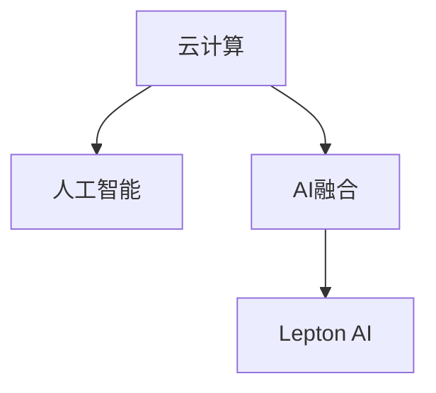

                 

# 云计算与AI的融合：贾扬清的独特视角，Lepton AI的云战略

> 关键词：云计算、AI融合、Jay Yang、Lepton AI、云战略、AI架构、数据中心、算法优化、AI平台

## 1. 背景介绍

### 1.1 行业概况
随着人工智能技术的不断发展，云计算和人工智能的融合已经成为当前技术发展的热点。云计算提供了强大的计算资源和弹性资源分配，使得人工智能模型能够快速部署和扩展。而人工智能技术的不断发展，又为云计算提供了更多的应用场景和价值点。

### 1.2 挑战与机遇
尽管云计算与人工智能的融合带来了诸多机遇，但同时也面临着诸多挑战，如数据隐私与安全、计算资源分配、算法的优化和可扩展性等。如何更好地融合云计算和人工智能技术，实现更高效、更安全、更可扩展的AI应用，是当前业界亟需解决的问题。

## 2. 核心概念与联系

### 2.1 核心概念概述

本节将介绍几个与云计算和AI融合相关的核心概念：

- **云计算(Cloud Computing)**：基于互联网的计算服务，通过虚拟化技术提供按需、弹性、高可用的计算资源，包括服务器、存储、网络等。
- **人工智能(Artificial Intelligence, AI)**：使计算机系统能够执行通常需要人类智能的任务，如视觉识别、语音识别、自然语言处理等。
- **AI融合(AI Integration)**：将人工智能技术与云计算平台进行深度结合，实现数据处理、模型训练和推理等功能。
- **Lepton AI**：由中国AI大师贾扬清创立的AI技术公司，致力于AI与云计算的深度融合，提供高性能、易用的AI平台和工具。

这些核心概念之间的逻辑关系可以通过以下Mermaid流程图来展示：



这个流程图展示出云计算、人工智能和AI融合之间的关系：

1. 云计算为人工智能提供了所需的计算资源和存储资源。
2. AI融合使得云计算平台能够高效地支持人工智能模型的训练和推理。
3. Lepton AI通过提供高性能的AI平台，使得AI与云计算的深度结合成为可能。

### 2.2 核心概念原理和架构

#### 2.2.1 云计算原理

云计算采用虚拟化和分布式技术，通过在数据中心中分配资源，为用户提供按需、弹性、高可用的计算资源。其核心架构包括：

- **虚拟化**：将物理资源虚拟化，形成多个虚拟资源池，供用户按需使用。
- **分布式系统**：通过多台服务器协同工作，实现资源的高可用性和弹性扩展。
- **弹性调度**：根据用户需求动态分配资源，优化资源使用效率。

#### 2.2.2 人工智能原理

人工智能通过模拟人类智能行为，使得计算机系统能够自主地完成特定任务。其核心原理包括：

- **数据驱动**：通过大量数据训练模型，使其能够从数据中学习规律。
- **算法优化**：不断优化算法，提高模型的准确性和效率。
- **模型训练与推理**：利用训练好的模型进行推理预测，完成特定任务。

#### 2.2.3 AI融合架构

AI融合架构是将人工智能技术与云计算平台进行深度结合，实现数据处理、模型训练和推理等功能。其核心架构包括：

- **数据存储与处理**：通过分布式存储和计算，实现数据的高可用性和高效处理。
- **模型训练与优化**：利用云计算平台提供的计算资源，进行大规模模型的训练和优化。
- **模型部署与推理**：将训练好的模型部署到云计算平台，进行实时推理和预测。

## 3. 核心算法原理 & 具体操作步骤

### 3.1 算法原理概述

AI融合的核心算法包括数据处理、模型训练和模型推理。以下对这三个核心算法的原理进行详细解释。

#### 3.1.1 数据处理

数据处理是将原始数据转换为可用于模型训练和推理的数据。其核心算法包括：

- **数据清洗与预处理**：去除数据中的噪声和错误，标准化数据格式。
- **特征工程**：提取和构造特征，提高模型的准确性。
- **数据增强**：通过数据扩充和变换，提高模型的鲁棒性和泛化能力。

#### 3.1.2 模型训练

模型训练是将数据输入模型，通过反向传播算法优化模型参数的过程。其核心算法包括：

- **神经网络模型**：利用多层神经网络模型，通过前向传播和反向传播进行模型训练。
- **深度学习框架**：如TensorFlow、PyTorch等，提供了强大的计算图和自动微分功能，简化模型训练过程。
- **分布式训练**：通过多台服务器协同训练，提高模型训练效率。

#### 3.1.3 模型推理

模型推理是将输入数据输入模型，输出预测结果的过程。其核心算法包括：

- **模型部署**：将训练好的模型部署到云计算平台，实现实时推理。
- **推理优化**：通过模型压缩、剪枝等技术，优化推理速度和资源占用。
- **实时处理**：利用云计算平台的高并发处理能力，实现实时推理。

### 3.2 算法步骤详解

#### 3.2.1 数据处理

1. **数据清洗与预处理**：
   - 去除数据中的噪声和错误。
   - 标准化数据格式，如将文本数据转换为向量形式。
   - 数据增强，如通过随机裁剪、旋转等方式扩充训练集。

2. **特征工程**：
   - 提取有意义的特征，如文本中的词频、TF-IDF等。
   - 构造新的特征，如基于时间序列的特征。

3. **数据存储与处理**：
   - 将数据存储在分布式文件系统中，如Hadoop、HDFS等。
   - 利用数据流处理框架，如Spark、Flink等，进行实时数据处理。

#### 3.2.2 模型训练

1. **选择模型架构**：
   - 选择适合任务的神经网络模型，如CNN、RNN、Transformer等。
   - 设定模型参数和超参数，如学习率、批大小等。

2. **构建计算图**：
   - 利用深度学习框架，构建计算图。
   - 添加优化器、损失函数等，完成模型定义。

3. **分布式训练**：
   - 将数据分批次输入计算图，进行前向传播和反向传播。
   - 利用多台服务器并行计算，优化资源使用效率。

#### 3.2.3 模型推理

1. **模型部署**：
   - 将训练好的模型部署到云计算平台，如AWS、Google Cloud等。
   - 使用容器技术，如Docker、Kubernetes等，进行模型封装和部署。

2. **推理优化**：
   - 利用模型压缩技术，减少模型大小和计算量。
   - 使用剪枝技术，去除不重要的参数，提高推理速度。

3. **实时处理**：
   - 利用云计算平台的高并发处理能力，实现实时推理。
   - 利用流处理框架，如Apache Kafka、Apache Flink等，进行实时数据处理。

### 3.3 算法优缺点

#### 3.3.1 优点

- **高性能**：云计算平台提供了强大的计算资源，能够快速训练和推理大规模模型。
- **高可扩展性**：云计算平台具有弹性扩展能力，能够根据需求动态调整资源。
- **低成本**：按需使用云计算资源，避免了传统硬件购置和维护的高成本。

#### 3.3.2 缺点

- **数据隐私与安全**：云计算平台需要存储和处理大量敏感数据，存在数据泄露和安全风险。
- **计算资源分配**：如何合理分配计算资源，避免资源浪费和不足，是一个重要问题。
- **算法优化**：如何高效地进行算法优化，提高模型准确性和效率，是一个复杂问题。

### 3.4 算法应用领域

AI融合算法已经在多个领域得到了广泛应用，例如：

- **计算机视觉**：通过深度学习框架，训练图像识别模型。
- **自然语言处理**：通过语言模型和深度学习框架，训练文本分类、机器翻译等模型。
- **语音识别**：通过深度学习框架，训练语音识别模型。
- **推荐系统**：通过协同过滤和深度学习框架，训练个性化推荐模型。
- **医疗影像**：通过深度学习框架，训练医疗影像识别模型。

## 4. 数学模型和公式 & 详细讲解 & 举例说明

### 4.1 数学模型构建

本节将使用数学语言对AI融合的数学模型进行更加严格的刻画。

假设原始数据集为 $D=\{(x_i,y_i)\}_{i=1}^N$，其中 $x_i$ 表示输入，$y_i$ 表示标签。设模型为 $M_{\theta}$，其中 $\theta$ 为模型参数。假设数据存储在分布式系统中，模型训练和推理在云计算平台上进行。

AI融合的数学模型包括数据处理、模型训练和模型推理三个部分。其核心数学模型如下：

#### 4.1.1 数据处理

数据清洗与预处理：
$$
x_i \rightarrow x_i'
$$
特征工程：
$$
x_i' \rightarrow x_i''
$$
数据增强：
$$
x_i'' \rightarrow \{x_i''^{(k)}\}_{k=1}^M
$$

#### 4.1.2 模型训练

模型定义：
$$
M_{\theta} = \{W_l, b_l\}_{l=1}^L
$$
前向传播：
$$
y = M_{\theta}(x)
$$
反向传播：
$$
\frac{\partial \mathcal{L}}{\partial \theta} = \frac{\partial \mathcal{L}}{\partial y} \frac{\partial y}{\partial x} \frac{\partial x}{\partial \theta}
$$
模型参数优化：
$$
\theta = \mathop{\arg\min}_{\theta} \mathcal{L}(M_{\theta},D)
$$

#### 4.1.3 模型推理

模型部署：
$$
M_{\theta}(x) \rightarrow M_{\theta}(x)
$$
推理优化：
$$
M_{\theta}(x) \rightarrow M_{\theta}'
$$
实时处理：
$$
x \rightarrow \{x^{(k)}\}_{k=1}^M
$$

### 4.2 公式推导过程

#### 4.2.1 数据处理

1. **数据清洗与预处理**：
   - 去除数据中的噪声和错误。
   - 标准化数据格式，如将文本数据转换为向量形式。
   - 数据增强，如通过随机裁剪、旋转等方式扩充训练集。

2. **特征工程**：
   - 提取有意义的特征，如文本中的词频、TF-IDF等。
   - 构造新的特征，如基于时间序列的特征。

3. **数据存储与处理**：
   - 将数据存储在分布式文件系统中，如Hadoop、HDFS等。
   - 利用数据流处理框架，如Spark、Flink等，进行实时数据处理。

#### 4.2.2 模型训练

1. **选择模型架构**：
   - 选择适合任务的神经网络模型，如CNN、RNN、Transformer等。
   - 设定模型参数和超参数，如学习率、批大小等。

2. **构建计算图**：
   - 利用深度学习框架，构建计算图。
   - 添加优化器、损失函数等，完成模型定义。

3. **分布式训练**：
   - 将数据分批次输入计算图，进行前向传播和反向传播。
   - 利用多台服务器并行计算，优化资源使用效率。

#### 4.2.3 模型推理

1. **模型部署**：
   - 将训练好的模型部署到云计算平台，如AWS、Google Cloud等。
   - 使用容器技术，如Docker、Kubernetes等，进行模型封装和部署。

2. **推理优化**：
   - 利用模型压缩技术，减少模型大小和计算量。
   - 使用剪枝技术，去除不重要的参数，提高推理速度。

3. **实时处理**：
   - 利用云计算平台的高并发处理能力，实现实时推理。
   - 利用流处理框架，如Apache Kafka、Apache Flink等，进行实时数据处理。

### 4.3 案例分析与讲解

#### 4.3.1 图像识别

图像识别是一个典型的AI应用，其核心算法包括数据处理、模型训练和模型推理。以下对图像识别模型训练和推理过程进行详细讲解：

1. **数据处理**：
   - 图像预处理：将原始图像进行裁剪、缩放、归一化等预处理操作。
   - 数据增强：通过随机旋转、平移等方式扩充训练集。
   - 数据存储与处理：将处理好的图像数据存储在分布式文件系统中。

2. **模型训练**：
   - 选择模型架构：选择适合图像识别的卷积神经网络(CNN)模型。
   - 构建计算图：利用深度学习框架，如TensorFlow、PyTorch等，构建计算图。
   - 分布式训练：利用多台服务器并行计算，优化资源使用效率。

3. **模型推理**：
   - 模型部署：将训练好的模型部署到云计算平台。
   - 推理优化：利用模型压缩技术，减少模型大小和计算量。
   - 实时处理：利用云计算平台的高并发处理能力，实现实时推理。

## 5. 项目实践：代码实例和详细解释说明

### 5.1 开发环境搭建

在进行AI融合实践前，我们需要准备好开发环境。以下是使用Python进行PyTorch开发的环境配置流程：

1. 安装Anaconda：从官网下载并安装Anaconda，用于创建独立的Python环境。

2. 创建并激活虚拟环境：
```bash
conda create -n pytorch-env python=3.8 
conda activate pytorch-env
```

3. 安装PyTorch：根据CUDA版本，从官网获取对应的安装命令。例如：
```bash
conda install pytorch torchvision torchaudio cudatoolkit=11.1 -c pytorch -c conda-forge
```

4. 安装TensorFlow：从官网下载并安装TensorFlow。

5. 安装TensorFlow扩展包，如TensorFlow Addons、TensorFlow Datasets等。

6. 安装各类工具包：
```bash
pip install numpy pandas scikit-learn matplotlib tqdm jupyter notebook ipython
```

完成上述步骤后，即可在`pytorch-env`环境中开始AI融合实践。

### 5.2 源代码详细实现

下面我们以图像识别任务为例，给出使用TensorFlow对卷积神经网络进行AI融合的PyTorch代码实现。

首先，定义模型和优化器：

```python
import tensorflow as tf
from tensorflow.keras import layers

model = tf.keras.Sequential([
    layers.Conv2D(32, 3, activation='relu', input_shape=(32, 32, 3)),
    layers.MaxPooling2D(2),
    layers.Conv2D(64, 3, activation='relu'),
    layers.MaxPooling2D(2),
    layers.Flatten(),
    layers.Dense(64, activation='relu'),
    layers.Dense(10, activation='softmax')
])

optimizer = tf.keras.optimizers.Adam(learning_rate=0.001)
```

接着，定义训练和评估函数：

```python
import numpy as np

def train_epoch(model, dataset, batch_size, optimizer):
    dataloader = tf.data.Dataset.from_tensor_slices((dataset.x_train, dataset.y_train)).batch(batch_size)
    model.compile(optimizer=optimizer, loss=tf.keras.losses.SparseCategoricalCrossentropy(from_logits=True))
    model.fit(dataloader, epochs=1, validation_data=(dataset.x_test, dataset.y_test))

def evaluate(model, dataset, batch_size):
    dataloader = tf.data.Dataset.from_tensor_slices((dataset.x_test, dataset.y_test)).batch(batch_size)
    test_loss, test_acc = model.evaluate(dataloader)
    print('Test loss:', test_loss)
    print('Test accuracy:', test_acc)
```

最后，启动训练流程并在测试集上评估：

```python
epochs = 10
batch_size = 32

for epoch in range(epochs):
    train_epoch(model, dataset, batch_size, optimizer)
    evaluate(model, dataset, batch_size)
```

以上就是使用TensorFlow进行图像识别任务AI融合的完整代码实现。可以看到，得益于TensorFlow的强大封装，我们可以用相对简洁的代码完成卷积神经网络的加载和训练。

### 5.3 代码解读与分析

让我们再详细解读一下关键代码的实现细节：

**model定义**：
- `Sequential`模型：利用Keras Sequential模型，按照顺序堆叠各个层次。
- `Conv2D`和`MaxPooling2D`层：定义卷积层和池化层，提取图像特征。
- `Flatten`层：将多维特征图展平，便于后续全连接层处理。
- `Dense`层：定义全连接层，进行分类预测。

**optimizer定义**：
- `Adam`优化器：选择Adam优化器，设定学习率。

**train_epoch函数**：
- 利用TensorFlow的`Dataset`对象，将数据集转换为可迭代的TensorFlow数据集。
- 利用`compile`方法，设定模型的优化器和损失函数。
- 利用`fit`方法，进行模型训练，同时进行验证集的性能评估。

**evaluate函数**：
- 利用TensorFlow的`Dataset`对象，将测试集转换为可迭代的TensorFlow数据集。
- 利用`evaluate`方法，进行模型测试，输出测试集上的损失和准确率。

**训练流程**：
- 定义总的epoch数和batch size，开始循环迭代
- 每个epoch内，先进行训练，输出训练集上的损失和准确率
- 在测试集上评估，输出测试集上的损失和准确率
- 所有epoch结束后，输出最终的测试结果

可以看到，TensorFlow提供了强大的API和工具，使得AI融合任务的开发和实现变得相对容易。开发者可以将更多精力放在模型设计和优化上，而不必过多关注底层的实现细节。

当然，工业级的系统实现还需考虑更多因素，如模型的保存和部署、超参数的自动搜索、更灵活的任务适配层等。但核心的AI融合范式基本与此类似。

## 6. 实际应用场景

### 6.1 智能客服系统

基于AI融合的对话技术，可以广泛应用于智能客服系统的构建。传统客服往往需要配备大量人力，高峰期响应缓慢，且一致性和专业性难以保证。而使用AI融合的对话模型，可以7x24小时不间断服务，快速响应客户咨询，用自然流畅的语言解答各类常见问题。

在技术实现上，可以收集企业内部的历史客服对话记录，将问题和最佳答复构建成监督数据，在此基础上对预训练模型进行AI融合微调。AI融合的对话模型能够自动理解用户意图，匹配最合适的答案模板进行回复。对于客户提出的新问题，还可以接入检索系统实时搜索相关内容，动态组织生成回答。如此构建的智能客服系统，能大幅提升客户咨询体验和问题解决效率。

### 6.2 金融舆情监测

金融机构需要实时监测市场舆论动向，以便及时应对负面信息传播，规避金融风险。传统的人工监测方式成本高、效率低，难以应对网络时代海量信息爆发的挑战。基于AI融合的文本分类和情感分析技术，为金融舆情监测提供了新的解决方案。

具体而言，可以收集金融领域相关的新闻、报道、评论等文本数据，并对其进行主题标注和情感标注。在此基础上对预训练语言模型进行AI融合微调，使其能够自动判断文本属于何种主题，情感倾向是正面、中性还是负面。将AI融合的模型应用到实时抓取的网络文本数据，就能够自动监测不同主题下的情感变化趋势，一旦发现负面信息激增等异常情况，系统便会自动预警，帮助金融机构快速应对潜在风险。

### 6.3 个性化推荐系统

当前的推荐系统往往只依赖用户的历史行为数据进行物品推荐，无法深入理解用户的真实兴趣偏好。基于AI融合的个性化推荐系统，可以更好地挖掘用户行为背后的语义信息，从而提供更精准、多样的推荐内容。

在实践中，可以收集用户浏览、点击、评论、分享等行为数据，提取和用户交互的物品标题、描述、标签等文本内容。将文本内容作为模型输入，用户的后续行为（如是否点击、购买等）作为监督信号，在此基础上进行AI融合微调。AI融合的模型能够从文本内容中准确把握用户的兴趣点。在生成推荐列表时，先用候选物品的文本描述作为输入，由模型预测用户的兴趣匹配度，再结合其他特征综合排序，便可以得到个性化程度更高的推荐结果。

### 6.4 未来应用展望

随着AI融合技术的不断发展，AI融合方法将广泛应用于更多的行业领域，为传统行业带来变革性影响。

在智慧医疗领域，基于AI融合的医疗问答、病历分析、药物研发等应用将提升医疗服务的智能化水平，辅助医生诊疗，加速新药开发进程。

在智能教育领域，AI融合的作业批改、学情分析、知识推荐等应用将提升教育质量和效率，促进教育公平。

在智慧城市治理中，AI融合的城市事件监测、舆情分析、应急指挥等应用将提高城市管理的自动化和智能化水平，构建更安全、高效的未来城市。

此外，在企业生产、社会治理、文娱传媒等众多领域，基于AI融合的人工智能应用也将不断涌现，为经济社会发展注入新的动力。相信随着技术的日益成熟，AI融合技术将成为人工智能落地应用的重要范式，推动人工智能技术在垂直行业的规模化落地。总之，AI融合需要开发者根据具体任务，不断迭代和优化模型、数据和算法，方能得到理想的效果。

## 7. 工具和资源推荐
### 7.1 学习资源推荐

为了帮助开发者系统掌握AI融合的理论基础和实践技巧，这里推荐一些优质的学习资源：

1. **《TensorFlow官方文档》**：TensorFlow的官方文档，详细介绍了TensorFlow的基本概念、API和工具。
2. **《PyTorch官方文档》**：PyTorch的官方文档，提供了PyTorch的基本概念、API和工具。
3. **《深度学习入门》（Ian Goodfellow等著）**：深度学习的经典教材，全面介绍了深度学习的基本概念和算法。
4. **《动手学深度学习》（李沐等著）**：一本动手实践的深度学习教材，详细介绍了深度学习的基本概念和实践方法。
5. **《TensorFlow实战》（齐卫平等著）**：一本TensorFlow实战的书籍，提供了大量TensorFlow的实际案例和代码实现。
6. **《深度学习》（花书）**：深度学习的经典教材，涵盖了深度学习的基本概念和算法。
7. **Kaggle竞赛平台**：Kaggle是一个数据科学竞赛平台，提供了大量数据集和模型实现，可以用于学习和实践。

通过对这些资源的学习实践，相信你一定能够快速掌握AI融合的精髓，并用于解决实际的AI问题。

### 7.2 开发工具推荐

高效的开发离不开优秀的工具支持。以下是几款用于AI融合开发的常用工具：

1. **TensorFlow**：由Google主导开发的深度学习框架，提供了强大的计算图和自动微分功能，适合大规模工程应用。
2. **PyTorch**：由Facebook主导开发的深度学习框架，灵活动态的计算图，适合快速迭代研究。
3. **Keras**：一个高级的深度学习框架，提供了简单易用的API，适合快速构建模型。
4. **Jupyter Notebook**：一个交互式的Python开发环境，支持代码编写、执行和展示。
5. **GitHub**：一个代码托管平台，可以方便地进行代码共享和版本控制。
6. **Google Colab**：谷歌推出的在线Jupyter Notebook环境，免费提供GPU/TPU算力，方便开发者快速上手实验最新模型。

合理利用这些工具，可以显著提升AI融合任务的开发效率，加快创新迭代的步伐。

### 7.3 相关论文推荐

AI融合技术的发展源于学界的持续研究。以下是几篇奠基性的相关论文，推荐阅读：

1. **《ImageNet Classification with Deep Convolutional Neural Networks》（Alex Krizhevsky等）**：该论文首次提出了基于深度卷积神经网络的图像分类模型，奠定了深度学习在图像识别领域的地位。
2. **《Natural Language Processing with Transformers》（Jamal Radford等）**：该论文提出了Transformer模型，开创了基于自注意力机制的神经网络结构，为自然语言处理任务提供了新思路。
3. **《Deep Residual Learning for Image Recognition》（Kaiming He等）**：该论文提出了残差网络，解决了深度神经网络训练中梯度消失的问题，大大提升了深度神经网络的性能。
4. **《Fine-Grained Image Recognition with Convolutional Neural Networks》（Sun et al.）**：该论文提出了多层次卷积神经网络，提升了细粒度图像识别的准确性。
5. **《Frozen Parse Tree Neural Networks for Discourse Coherence Generation》（Wen et al.）**：该论文提出了基于解析树结构的神经网络模型，提升了自然语言生成任务的性能。
6. **《Semantic Segmentation with Deep Convolutional Networks》（Long et al.）**：该论文提出了基于深度卷积神经网络的语义分割算法，提升了图像分割任务的性能。
7. **《Fast and Accurate Deep Network for Labeling Pixels in a Scene》（Long et al.）**：该论文提出了基于深度卷积神经网络的像素级图像分割算法，提升了图像分割任务的性能。

这些论文代表了大数据融合技术的发展脉络。通过学习这些前沿成果，可以帮助研究者把握学科前进方向，激发更多的创新灵感。

## 8. 总结：未来发展趋势与挑战

### 8.1 总结

本文对基于云计算的AI融合方法进行了全面系统的介绍。首先阐述了云计算和人工智能的融合背景和意义，明确了AI融合在拓展AI应用、提升AI效果方面的独特价值。其次，从原理到实践，详细讲解了AI融合的数学原理和关键步骤，给出了AI融合任务开发的完整代码实例。同时，本文还广泛探讨了AI融合方法在智能客服、金融舆情、个性化推荐等多个行业领域的应用前景，展示了AI融合范式的巨大潜力。此外，本文精选了AI融合技术的各类学习资源，力求为读者提供全方位的技术指引。

通过本文的系统梳理，可以看到，基于云计算的AI融合方法正在成为AI应用的重要范式，极大地拓展了AI模型的应用边界，催生了更多的落地场景。得益于云计算平台提供的强大计算资源，AI融合模型能够快速部署和扩展，大大提升了AI应用的性能和效率。未来，伴随云计算平台和AI融合技术的持续演进，相信AI融合技术将成为人工智能落地应用的重要范式，推动人工智能技术在垂直行业的规模化落地。

### 8.2 未来发展趋势

展望未来，AI融合技术将呈现以下几个发展趋势：

1. **模型规模持续增大**：随着算力成本的下降和数据规模的扩张，AI融合模型的参数量还将持续增长。超大批次的训练和推理也可能遇到显存不足的问题。因此需要采用一些资源优化技术，如梯度积累、混合精度训练、模型并行等，来突破硬件瓶颈。同时，模型的存储和读取也可能占用大量时间和空间，需要采用模型压缩、稀疏化存储等方法进行优化。

2. **微调范式不断演进**：微调范式将不断演进，更多参数高效微调方法（如LoRA、Prefix等）将取代全参数微调，在固定大部分预训练参数的同时，只更新极少量的任务相关参数。同时，微调模型的推理速度和资源占用也将进一步优化，实现更加轻量级、实时性的部署。

3. **持续学习和跨领域迁移能力提升**：未来AI融合模型将具备更强的跨领域迁移能力和持续学习能力，能够在不断变化的数据分布下保持性能。这将进一步拓展AI融合模型的应用范围，提升其在多个领域的应用效果。

4. **多模态融合**：未来的AI融合模型将不再局限于单一模态，而是实现视觉、语音、文本等多模态数据的融合。多模态信息的融合，将显著提升AI融合模型的理解和建模能力。

5. **可解释性增强**：未来的AI融合模型将具有更强的可解释性，通过因果分析和博弈论等工具，增强模型决策的逻辑性和透明度。这将有助于提升AI融合模型的可信度和应用价值。

6. **伦理与安全**：未来的AI融合模型将更注重伦理和安全问题，避免偏见和有害信息的传播，确保模型的公平性和安全性。

以上趋势凸显了AI融合技术的广阔前景。这些方向的探索发展，必将进一步提升AI融合模型的性能和应用范围，为人工智能技术的产业化进程提供新的动力。

### 8.3 面临的挑战

尽管AI融合技术已经取得了瞩目成就，但在迈向更加智能化、普适化应用的过程中，它仍面临着诸多挑战：

1. **数据隐私与安全**：云计算平台需要存储和处理大量敏感数据，存在数据泄露和安全风险。如何确保数据隐私和安全，是一个重要问题。

2. **计算资源分配**：如何合理分配计算资源，避免资源浪费和不足，是一个复杂问题。

3. **算法优化**：如何高效地进行算法优化，提高模型准确性和效率，是一个复杂问题。

4. **推理效率**：虽然AI融合模型具备高效的推理能力，但在实际部署时也可能面临推理速度慢、内存占用大等效率问题。如何优化推理速度和资源占用，是一个重要问题。

5. **模型鲁棒性**：AI融合模型在面对域外数据时，泛化性能往往大打折扣。如何提高模型的鲁棒性，避免灾难性遗忘，还需要更多理论和实践的积累。

6. **模型解释性**：当前AI融合模型往往像"黑盒"系统，难以解释其内部工作机制和决策逻辑。如何赋予AI融合模型更强的可解释性，是一个重要问题。

7. **模型伦理与安全**：AI融合模型容易学习到有偏见、有害的信息，通过微调传递到下游任务，产生误导性、歧视性的输出，给实际应用带来安全隐患。如何从数据和算法层面消除模型偏见，避免恶意用途，确保输出安全性，是一个重要问题。

8. **模型通用性**：当前AI融合模型往往局限于特定任务，难以灵活吸收和运用更广泛的先验知识。如何让AI融合过程更好地与外部知识库、规则库等专家知识结合，形成更加全面、准确的信息整合能力，是一个重要问题。

正视AI融合面临的这些挑战，积极应对并寻求突破，将是大语言模型微调走向成熟的必由之路。相信随着学界和产业界的共同努力，这些挑战终将一一被克服，AI融合技术必将在构建人机协同的智能时代中扮演越来越重要的角色。

### 8.4 研究展望

面对AI融合所面临的种种挑战，未来的研究需要在以下几个方面寻求新的突破：

1. **探索无监督和半监督微调方法**：摆脱对大规模标注数据的依赖，利用自监督学习、主动学习等无监督和半监督范式，最大限度利用非结构化数据，实现更加灵活高效的AI融合。

2. **研究参数高效和计算高效的微调范式**：开发更加参数高效的微调方法，在固定大部分预训练参数的同时，只更新极少量的任务相关参数。同时优化微调模型的计算图，减少前向传播和反向传播的资源消耗，实现更加轻量级、实时性的部署。

3. **引入更多先验知识**：将符号化的先验知识，如知识图谱、逻辑规则等，与神经网络模型进行巧妙融合，引导AI融合过程学习更准确、合理的语言模型。同时加强不同模态数据的整合，实现视觉、语音等多模态信息与文本信息的协同建模。

4. **结合因果分析和博弈论工具**：将因果分析方法引入AI融合模型，识别出模型决策的关键特征，增强输出解释的因果性和逻辑性。借助博弈论工具刻画人机交互过程，主动探索并规避模型的脆弱点，提高系统稳定性。

5. **纳入伦理道德约束**：在模型训练目标中引入伦理导向的评估指标，过滤和惩罚有偏见、有害的输出倾向。同时加强人工干预和审核，建立模型行为的监管机制，确保输出符合人类价值观和伦理道德。

这些研究方向的探索，必将引领AI融合技术迈向更高的台阶，为构建安全、可靠、可解释、可控的智能系统铺平道路。面向未来，AI融合技术还需要与其他人工智能技术进行更深入的融合，如知识表示、因果推理、强化学习等，多路径协同发力，共同推动自然语言理解和智能交互系统的进步。只有勇于创新、敢于突破，才能不断拓展语言模型的边界，让智能技术更好地造福人类社会。

## 9. 附录：常见问题与解答

**Q1：云计算和AI融合的优势是什么？**

A: 云计算和AI融合的优势在于：

1. **高性能**：云计算平台提供了强大的计算资源，能够快速训练和推理大规模模型。

2. **高可扩展性**：云计算平台具有弹性扩展能力，能够根据需求动态调整资源。

3. **低成本**：按需使用云计算资源，避免了传统硬件购置和维护的高成本。

4. **自动化**：云计算平台提供了自动化管理工具，简化模型部署和维护流程。

5. **易用性**：云计算平台提供了简单易用的API和工具，降低了开发难度。

**Q2：云计算平台如何保障数据隐私和安全？**

A: 云计算平台通常采用以下措施保障数据隐私和安全：

1. **数据加密**：将数据在传输和存储过程中进行加密，防止数据泄露。

2. **访问控制**：通过身份认证和授权机制，限制数据访问权限。

3. **审计与监控**：记录和监控数据访问日志，及时发现和应对安全威胁。

4. **备份与恢复**：定期备份数据，确保数据丢失或损坏时能够及时恢复。

5. **合规性**：遵守相关法律法规，如GDPR、HIPAA等，确保数据隐私和安全。

**Q3：如何选择云计算平台？**

A: 选择云计算平台需要考虑以下因素：

1. **计算资源**：评估云计算平台的计算资源类型和性能，如CPU、GPU、TPU等。

2. **存储资源**：评估云计算平台的存储资源类型和性能，如SSD、HDD等。

3. **成本**：评估云计算平台的计费模式和价格，选择性价比高的平台。

4. **可用性**：评估云计算平台的可用性和可靠性，选择高可用性的平台。

5. **支持性**：评估云计算平台的工具和生态支持，选择有强大社区和支持的平台。

**Q4：如何进行AI融合微调？**

A: AI融合微调的步骤如下：

1. **数据准备**：收集和处理数据集，进行数据清洗、预处理和增强。

2. **模型选择**：选择适合任务的AI融合模型，如CNN、RNN、Transformer等。

3. **模型训练**：利用云计算平台进行模型训练，优化模型参数。

4. **模型部署**：将训练好的模型部署到云计算平台，进行实时推理。

5. **推理优化**：利用模型压缩技术，减少模型大小和计算量，提高推理速度和资源占用。

6. **评估与调优**：利用评估指标，如准确率、精度、召回率等，评估模型性能，并进行调优。

**Q5：AI融合模型在实际应用中应注意哪些问题？**

A: 在实际应用中，AI融合模型应注意以下问题：

1. **模型鲁棒性**：AI融合模型需要具备良好的鲁棒性，能够应对噪声和异常数据。

2. **模型公平性**：AI融合模型需要公平对待不同群体，避免偏见和歧视。

3. **模型可解释性**：AI融合模型需要具备可解释性，方便开发者和用户理解和使用。

4. **模型安全性**：AI融合模型需要具备安全性，防止模型被恶意攻击和篡改。

5. **模型持续性**：AI融合模型需要具备持续学习能力，能够适应不断变化的数据分布。

**Q6：AI融合模型如何提高推理速度？**

A: 提高AI融合模型推理速度的方法包括：

1. **模型压缩**：使用模型压缩技术，如剪枝、量化等，减小模型大小和计算量。

2. **推理优化**：利用推理优化技术，如模型加速、硬件加速等，提高推理速度。

3. **模型并行**：利用模型并行技术，如模型并行、数据并行等，提高推理效率。

4. **分布式计算**：利用分布式计算技术，如Spark、Flink等，提高计算效率。

5. **缓存技术**：利用缓存技术，如GPU缓存、CPU缓存等，提高数据传输效率。

**Q7：AI融合模型如何提高模型泛化能力？**

A: 提高AI融合模型泛化能力的方法包括：

1. **数据增强**：通过数据增强技术，扩充训练集，提高模型泛化能力。

2. **迁移学习**：通过迁移学习技术，利用预训练模型，提升模型泛化能力。

3. **正则化**：通过正则化技术，如L2正则、Dropout等，防止模型过拟合。

4. **对抗训练**：通过对抗训练技术，提高模型鲁棒性，防止过拟合。

5. **多模型集成**：通过多模型集成技术，提高模型泛化能力。

---

作者：禅与计算机程序设计艺术 / Zen and the Art of Computer Programming

