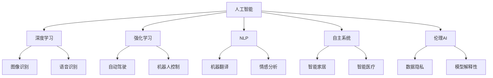

                 

# 人工智能在2050年的应用与发展

## 1. 背景介绍

### 1.1 问题由来
随着科技的迅猛发展，人工智能（AI）已经成为推动社会进步和改变人类生活的重要力量。2050年，我们可以预见，AI将在多个领域实现广泛的应用，极大地改变人类的生产生活方式。从医疗、教育到交通、娱乐，AI的融入将使人类社会更加高效、智能和可持续。

### 1.2 问题核心关键点
人工智能的未来应用将涉及多个方面，包括自动化、自主学习、人机交互、数据治理和伦理道德。AI技术的普及将对社会、经济、文化、教育等领域产生深远影响。

- 自动化：自动化技术将取代许多重复性工作，提高生产效率。
- 自主学习：通过深度学习和强化学习，AI将具备更强的自我优化能力，解决更多复杂问题。
- 人机交互：AI将更好地理解和响应人类需求，实现更自然、更流畅的人机交流。
- 数据治理：AI将帮助我们更好地管理和分析海量数据，为决策提供支持。
- 伦理道德：随着AI的广泛应用，如何确保AI的透明性、公正性和安全性成为重要课题。

## 2. 核心概念与联系

### 2.1 核心概念概述

为更好地理解2050年人工智能的应用与发展，本节将介绍几个关键概念：

- 人工智能（Artificial Intelligence, AI）：指通过算法、数据和计算能力实现机器自动地执行通常需要人类智能的任务。

- 深度学习（Deep Learning）：一种基于神经网络的机器学习技术，通过多层网络结构提取输入数据的复杂特征，实现高精度的预测和分类。

- 强化学习（Reinforcement Learning, RL）：一种学习方式，通过与环境的交互，AI模型根据反馈调整策略，以最大化预期奖励。

- 自然语言处理（Natural Language Processing, NLP）：使计算机能够理解和处理人类语言，实现语言模型、翻译、问答等任务。

- 自主系统（Autonomous Systems）：不需要人工干预，能够自主完成特定任务的机器系统，如自动驾驶汽车、智能机器人等。

- 伦理AI（Ethical AI）：强调AI技术的透明性、公平性和安全性，确保其应用符合人类价值观和伦理道德。

这些概念之间的逻辑关系可以通过以下Mermaid流程图来展示：



这个流程图展示了人工智能的关键技术及其应用方向：

1. 深度学习：包括图像识别、语音识别等感知任务。
2. 强化学习：应用于自动驾驶、机器人控制等需要实时决策的场景。
3. 自然语言处理：包括机器翻译、情感分析等语言任务。
4. 自主系统：涉及智能家居、智能医疗等需要自主执行任务的系统。
5. 伦理AI：关注数据隐私、模型解释性等伦理道德问题。

这些核心概念共同构成了人工智能技术的基石，决定了其在2050年的应用前景和发展方向。

## 3. 核心算法原理 & 具体操作步骤
### 3.1 算法原理概述

人工智能在2050年的应用与发展，基于先进的算法和技术。以下是对这些核心算法原理的详细解释：

- **深度学习**：深度学习通过构建多层神经网络结构，学习输入数据的复杂特征，实现高精度的预测和分类。例如，卷积神经网络（CNN）用于图像识别，循环神经网络（RNN）用于自然语言处理。

- **强化学习**：强化学习通过与环境的交互，AI模型根据反馈调整策略，以最大化预期奖励。例如，通过模拟自动驾驶场景，AI模型学习最优驾驶策略。

- **自然语言处理**：自然语言处理使计算机能够理解和处理人类语言，实现语言模型、翻译、问答等任务。例如，BERT模型在自然语言理解方面表现卓越，广泛应用于各种NLP任务。

- **自主系统**：自主系统不需要人工干预，能够自主完成特定任务的机器系统。例如，自动驾驶汽车通过传感器和算法实现自主驾驶。

- **伦理AI**：伦理AI强调AI技术的透明性、公平性和安全性，确保其应用符合人类价值观和伦理道德。例如，数据隐私保护和模型解释性是伦理AI的核心关注点。

### 3.2 算法步骤详解

人工智能在2050年的应用与发展，需要遵循以下关键步骤：

1. **需求分析**：确定应用的具体场景和目标，分析用户需求和期望。
2. **数据收集与预处理**：收集相关数据，进行数据清洗和标注，为模型训练提供数据基础。
3. **模型选择与训练**：选择合适的算法和技术，对数据进行训练和优化。
4. **系统集成与测试**：将训练好的模型集成到应用系统中，进行系统测试和优化。
5. **部署与应用**：将系统部署到实际环境中，进行大规模应用和监测，持续优化和升级。

### 3.3 算法优缺点

人工智能在2050年的应用与发展，具有以下优点：

- 高效性：AI能够自动完成重复性工作，提高生产效率。
- 创新性：AI具备自我优化能力，能够解决复杂问题，推动技术进步。
- 普适性：AI技术适用于多个领域，具备广泛的应用前景。

同时，AI技术也存在以下局限性：

- 依赖数据：AI模型依赖高质量的数据进行训练，数据不足可能影响模型性能。
- 缺乏解释：AI模型通常是"黑盒"系统，难以解释其内部决策逻辑。
- 伦理风险：AI应用可能带来伦理和道德问题，如偏见、歧视、隐私等。

## 4. 数学模型和公式 & 详细讲解

### 4.1 数学模型构建

为更好地理解人工智能在2050年的应用与发展，本节将介绍几个关键数学模型和公式。

**深度学习模型**：
假设深度学习模型为$f(x;\theta)$，其中$x$为输入数据，$\theta$为模型参数。深度学习模型通常由多层神经网络组成，每层包含多个神经元。

**强化学习模型**：
假设强化学习模型为$Q(s,a;\theta)$，其中$s$为状态，$a$为动作，$\theta$为模型参数。强化学习模型通过与环境的交互，学习最优策略。

**自然语言处理模型**：
假设自然语言处理模型为$P(w|\text{Context};\theta)$，其中$w$为词语，$\text{Context}$为上下文，$\theta$为模型参数。自然语言处理模型通常用于语言模型、机器翻译等任务。

### 4.2 公式推导过程

**深度学习模型推导**：
假设深度学习模型由$n$层组成，第$i$层的输入为$x^{(i-1)}$，输出为$x^{(i)}$，激活函数为$f(\cdot)$，权重矩阵为$W^{(i)}$，偏置向量为$b^{(i)}$。深度学习模型的前向传播过程如下：

$$
x^{(0)} = \text{Input}
$$
$$
x^{(1)} = f(W^{(1)}x^{(0)} + b^{(1)})
$$
$$
x^{(2)} = f(W^{(2)}x^{(1)} + b^{(2)})
$$
$$
\vdots
$$
$$
x^{(n)} = f(W^{(n)}x^{(n-1)} + b^{(n)})
$$

其中，$f(\cdot)$为激活函数，通常采用ReLU、Sigmoid等函数。

**强化学习模型推导**：
假设强化学习模型采用Q-learning算法，状态为$s_t$，动作为$a_t$，奖励为$r_{t+1}$，下一状态为$s_{t+1}$，模型参数为$\theta$。Q-learning算法的目标是最小化未来奖励的期望值：

$$
Q(s,a;\theta) = r_t + \gamma \max_{a'} Q(s',a';\theta)
$$

其中，$\gamma$为折扣因子，通常取值在0.9到0.99之间。

**自然语言处理模型推导**：
假设自然语言处理模型为语言模型，输入为$x$，输出为$y$，模型参数为$\theta$。语言模型的目标是最小化预测误差：

$$
\mathcal{L}(\theta) = -\frac{1}{N} \sum_{i=1}^N \log P(y_i|x_i;\theta)
$$

其中，$N$为样本数量，$P(y_i|x_i;\theta)$为预测概率。

### 4.3 案例分析与讲解

**深度学习案例**：
假设有一张手写数字图片，深度学习模型可以自动将其分类为0到9中的一个数字。模型由多个卷积层和池化层组成，经过多层非线性变换，最终输出分类结果。

**强化学习案例**：
假设有一辆自动驾驶汽车，需要学习在复杂道路环境中行驶。通过与环境的交互，模型学习最优驾驶策略，包括加速、减速、转向等。

**自然语言处理案例**：
假设有一个机器翻译系统，需要将英文文本翻译成中文。模型首先使用语言模型对文本进行编码，然后使用解码器生成翻译结果。

## 5. 项目实践：代码实例和详细解释说明
### 5.1 开发环境搭建

在进行人工智能在2050年的应用与发展实践前，我们需要准备好开发环境。以下是使用Python进行TensorFlow开发的环境配置流程：

1. 安装Anaconda：从官网下载并安装Anaconda，用于创建独立的Python环境。

2. 创建并激活虚拟环境：
```bash
conda create -n tf-env python=3.8 
conda activate tf-env
```

3. 安装TensorFlow：根据CUDA版本，从官网获取对应的安装命令。例如：
```bash
conda install tensorflow tensorflow-cpu
```

4. 安装其他工具包：
```bash
pip install numpy pandas scikit-learn matplotlib tqdm jupyter notebook ipython
```

完成上述步骤后，即可在`tf-env`环境中开始项目实践。

### 5.2 源代码详细实现

下面我们以自然语言处理（NLP）任务为例，给出使用TensorFlow进行深度学习模型训练的PyTorch代码实现。

首先，定义NLP任务的数据处理函数：

```python
import tensorflow as tf
from tensorflow.keras.preprocessing.text import Tokenizer
from tensorflow.keras.preprocessing.sequence import pad_sequences

tokenizer = Tokenizer(num_words=10000, oov_token='<OOV>')
tokenizer.fit_on_texts(texts)

texts_encoded = tokenizer.texts_to_sequences(texts)
padded_texts = pad_sequences(texts_encoded, maxlen=128, padding='post')
```

然后，定义模型和优化器：

```python
from tensorflow.keras.models import Sequential
from tensorflow.keras.layers import Embedding, LSTM, Dense

model = Sequential()
model.add(Embedding(input_dim=10000, output_dim=128, input_length=128))
model.add(LSTM(128))
model.add(Dense(1, activation='sigmoid'))

optimizer = tf.keras.optimizers.Adam(lr=0.001)
```

接着，定义训练和评估函数：

```python
def train_epoch(model, dataset, batch_size, optimizer):
    model.compile(loss='binary_crossentropy', optimizer=optimizer, metrics=['accuracy'])
    model.fit(dataset['input'], dataset['label'], batch_size=batch_size, epochs=10, validation_data=(val_dataset['input'], val_dataset['label']))
    
def evaluate(model, dataset, batch_size):
    model.evaluate(dataset['input'], dataset['label'])
```

最后，启动训练流程并在测试集上评估：

```python
epochs = 10
batch_size = 32

for epoch in range(epochs):
    train_epoch(model, train_dataset, batch_size, optimizer)
    
print("Epoch %d, loss: %f, accuracy: %f" % (epoch+1, loss, accuracy))
    
print("Test results:")
evaluate(model, test_dataset, batch_size)
```

以上就是使用TensorFlow进行深度学习模型训练的完整代码实现。可以看到，TensorFlow提供了方便的API和可视化工具，使得深度学习模型的开发和训练变得高效便捷。

### 5.3 代码解读与分析

让我们再详细解读一下关键代码的实现细节：

**Tokenization**：
- 定义一个tokenizer，使用前10000个最常用的单词作为词典。
- 将文本数据转化为序列，使用post padding的方式进行填充，确保所有序列长度一致。

**模型定义**：
- 定义一个包含嵌入层、LSTM层和全连接层的神经网络模型。
- 使用二分类交叉熵损失函数和Adam优化器。

**训练过程**：
- 使用fit函数进行模型训练，设置训练集和验证集。
- 训练10个epoch后，输出训练损失和精度。
- 在测试集上评估模型性能，输出评估结果。

## 6. 实际应用场景

### 6.1 智慧医疗

人工智能在2050年的应用中，智慧医疗是一个重要的领域。AI技术可以辅助医生进行疾病诊断、治疗方案制定、药物研发等工作，提升医疗服务的质量和效率。

- **疾病诊断**：AI可以分析患者的历史数据和当前症状，快速诊断出可能患有的疾病。例如，通过分析CT、MRI等医学影像，AI可以检测出早期癌症、脑出血等疾病。
- **治疗方案制定**：AI可以根据患者的基因信息和病史，推荐个性化的治疗方案。例如，通过分析基因组数据，AI可以预测药物的疗效和副作用，提供最佳的治疗方案。
- **药物研发**：AI可以加速药物的研发过程，通过模拟药物分子与靶点结合的过程，预测药物的效果和副作用。例如，AI可以预测化合物的生物活性，加速新药的研发进程。

### 6.2 智能交通

智能交通是另一个重要应用领域，AI技术可以改善交通管理、提高道路安全、优化交通流量等。

- **交通管理**：AI可以实时分析交通数据，优化信号灯控制和交通流量。例如，通过分析交通摄像头和传感器数据，AI可以预测交通流量，调整信号灯的配时，减少交通拥堵。
- **自动驾驶**：AI可以实现自动驾驶技术，提高行车安全和效率。例如，通过深度学习和强化学习算法，AI可以学习最优驾驶策略，实现无人驾驶汽车。
- **智能监控**：AI可以实时监控交通状况，提供实时预警和报告。例如，通过分析车载传感器数据和视频监控数据，AI可以检测异常情况，提供预警和报警。

### 6.3 智能制造

智能制造是工业4.0的重要组成部分，AI技术可以优化生产流程、提高生产效率、降低生产成本。

- **生产优化**：AI可以实时分析生产数据，优化生产流程和设备。例如，通过分析机器传感器数据，AI可以预测设备故障，提前进行维护和更换。
- **质量控制**：AI可以实时检测产品质量，减少不合格品率。例如，通过分析产品图像和传感器数据，AI可以检测出产品缺陷，提高产品质量。
- **供应链管理**：AI可以优化供应链管理，提高供应链效率。例如，通过分析库存数据和市场需求，AI可以预测库存需求，优化库存管理。

### 6.4 未来应用展望

人工智能在2050年的应用将涉及多个领域，具有广泛的前景。以下是对未来应用前景的展望：

- **智慧城市**：AI可以提升城市管理效率，改善城市环境，提高居民生活质量。例如，通过分析城市数据，AI可以优化城市规划，改善交通管理，提高公共服务水平。
- **智能教育**：AI可以个性化教育内容，提供个性化学习方案，提高教育效果。例如，通过分析学生学习数据，AI可以提供个性化辅导，帮助学生更好地掌握知识。
- **智能农业**：AI可以优化农业生产，提高农业生产效率，降低生产成本。例如，通过分析土壤数据和气象数据，AI可以优化种植方案，提高作物产量和质量。
- **智能金融**：AI可以优化金融服务，提高金融效率，降低金融风险。例如，通过分析交易数据，AI可以预测市场趋势，优化投资组合，降低投资风险。

## 7. 工具和资源推荐
### 7.1 学习资源推荐

为了帮助开发者系统掌握人工智能在2050年的应用与发展，这里推荐一些优质的学习资源：

1. 《深度学习》系列书籍：由吴恩达等人所著，深入浅出地介绍了深度学习的基本概念和经典模型。

2. 《强化学习》课程：由斯坦福大学开设的深度学习课程，涵盖深度学习和强化学习的最新进展。

3. 《自然语言处理》书籍：由Daniel Jurafsky和James H. Martin所著，全面介绍了自然语言处理的基本概念和前沿技术。

4. TensorFlow官方文档：TensorFlow的官方文档，提供了丰富的API和教程，适合深入学习TensorFlow。

5. PyTorch官方文档：PyTorch的官方文档，提供了灵活的深度学习框架，适合快速迭代研究。

通过对这些资源的学习实践，相信你一定能够快速掌握人工智能在2050年的应用与发展，并用于解决实际的NLP问题。

### 7.2 开发工具推荐

高效的开发离不开优秀的工具支持。以下是几款用于人工智能在2050年的应用与发展的常用工具：

1. TensorFlow：由Google主导开发的深度学习框架，支持分布式计算，适合大规模工程应用。

2. PyTorch：由Facebook开发的深度学习框架，灵活高效，适合快速迭代研究。

3. Keras：高层次的深度学习框架，易于使用，适合初学者入门。

4. Jupyter Notebook：交互式编程环境，支持Python和R等语言，适合快速开发和调试。

5. Visual Studio Code：轻量级代码编辑器，支持Python和TensorFlow等工具。

合理利用这些工具，可以显著提升人工智能在2050年的应用与发展的开发效率，加快创新迭代的步伐。

### 7.3 相关论文推荐

人工智能在2050年的应用与发展源于学界的持续研究。以下是几篇奠基性的相关论文，推荐阅读：

1. AlphaGo论文：DeepMind团队发布的AlphaGo论文，展示了深度学习和强化学习在围棋中的应用。

2. GPT-3论文：OpenAI发布的GPT-3论文，展示了大规模语言模型在自然语言处理中的潜力。

3. Reinforcement Learning in Robotics：涉及强化学习在机器人控制中的应用，展示了AI在实际场景中的广泛应用。

4. Generative Adversarial Networks：涉及生成对抗网络在图像生成和自然语言处理中的应用，展示了AI技术的创新潜力。

这些论文代表了大语言模型微调技术的发展脉络。通过学习这些前沿成果，可以帮助研究者把握学科前进方向，激发更多的创新灵感。

## 8. 总结：未来发展趋势与挑战

### 8.1 总结

本文对人工智能在2050年的应用与发展进行了全面系统的介绍。首先阐述了AI技术的背景和未来应用前景，明确了AI技术在医疗、交通、制造等各个领域的重要作用。其次，从原理到实践，详细讲解了深度学习、强化学习和自然语言处理等核心算法，给出了实际应用场景的代码实现。同时，本文还探讨了AI技术在2050年面临的挑战，包括数据依赖、模型解释性、伦理道德等，提供了系统的解决方案。

通过本文的系统梳理，可以看到，人工智能在2050年的应用与发展将极大地改变人类的生产生活方式，带来深刻的社会变革。AI技术在多个领域的应用前景广阔，但也需要我们不断探索和优化，确保其应用的安全性和可靠性。

### 8.2 未来发展趋势

展望未来，人工智能在2050年的应用与发展将呈现以下几个趋势：

1. 自动化程度更高：AI技术将进一步自动化，取代更多的重复性工作，提高生产效率。
2. 模型复杂度更高：深度学习模型将具备更强的复杂性，可以处理更复杂的任务，推动技术进步。
3. 数据治理更规范：AI技术将需要更规范的数据治理，确保数据的质量和隐私。
4. 伦理道德更重视：AI技术的伦理道德问题将更加受到重视，确保其应用符合人类价值观和伦理道德。
5. 多模态融合更深入：AI技术将实现多模态融合，整合视觉、听觉、文本等多种信息，实现更全面的理解和决策。

以上趋势凸显了人工智能在2050年的应用与发展前景，将极大地改变人类的生产生活方式。AI技术将进一步推动社会进步，带来更多的创新和便利。

### 8.3 面临的挑战

尽管人工智能在2050年的应用与发展前景广阔，但在迈向更加智能化、普适化应用的过程中，仍面临诸多挑战：

1. 数据依赖：AI技术依赖高质量的数据进行训练，数据不足可能影响模型性能。
2. 模型复杂度：深度学习模型复杂度高，训练和推理成本高，需要更多高性能硬件支持。
3. 模型可解释性：AI模型通常是"黑盒"系统，难以解释其内部决策逻辑，需要更多的解释性研究。
4. 伦理道德：AI技术的伦理道德问题需要更多的关注和研究，确保其应用符合人类价值观和伦理道德。

## 8.4 研究展望

面对人工智能在2050年的应用与发展所面临的挑战，未来的研究需要在以下几个方面寻求新的突破：

1. 探索无监督和半监督学习：摆脱对大规模标注数据的依赖，利用自监督学习、主动学习等无监督和半监督范式，最大限度利用非结构化数据，实现更加灵活高效的模型训练。

2. 研究参数高效和计算高效的微调范式：开发更加参数高效的微调方法，在固定大部分预训练参数的同时，只更新极少量的任务相关参数。同时优化微调模型的计算图，减少前向传播和反向传播的资源消耗，实现更加轻量级、实时性的部署。

3. 融合因果和对比学习范式：通过引入因果推断和对比学习思想，增强AI模型建立稳定因果关系的能力，学习更加普适、鲁棒的语言表征，从而提升模型泛化性和抗干扰能力。

4. 引入更多先验知识：将符号化的先验知识，如知识图谱、逻辑规则等，与神经网络模型进行巧妙融合，引导AI模型学习更准确、合理的语言模型。同时加强不同模态数据的整合，实现视觉、语音等多模态信息与文本信息的协同建模。

5. 结合因果分析和博弈论工具：将因果分析方法引入AI模型，识别出模型决策的关键特征，增强输出解释的因果性和逻辑性。借助博弈论工具刻画人机交互过程，主动探索并规避模型的脆弱点，提高系统稳定性。

6. 纳入伦理道德约束：在AI模型训练目标中引入伦理导向的评估指标，过滤和惩罚有偏见、有害的输出倾向。同时加强人工干预和审核，建立模型行为的监管机制，确保输出符合人类价值观和伦理道德。

这些研究方向的探索，必将引领人工智能在2050年的应用与发展迈向更高的台阶，为构建安全、可靠、可解释、可控的智能系统铺平道路。面向未来，人工智能技术还需要与其他人工智能技术进行更深入的融合，如知识表示、因果推理、强化学习等，多路径协同发力，共同推动人工智能技术的进步。只有勇于创新、敢于突破，才能不断拓展人工智能的边界，让智能技术更好地造福人类社会。

## 9. 附录：常见问题与解答

**Q1：人工智能在2050年的应用将涉及哪些领域？**

A: 人工智能在2050年的应用将涉及多个领域，包括医疗、交通、制造、智慧城市、智能教育等。AI技术在这些领域中具有广泛的应用前景。

**Q2：人工智能在2050年的应用面临哪些挑战？**

A: 人工智能在2050年的应用面临多个挑战，包括数据依赖、模型复杂度、模型可解释性、伦理道德等。我们需要不断探索和优化，确保AI技术的透明性、公平性和安全性。

**Q3：人工智能在2050年的应用如何影响社会？**

A: 人工智能在2050年的应用将极大地改变人类的生产生活方式，带来深刻的社会变革。AI技术将提升生产效率，优化资源配置，改善生活质量，推动社会进步。

**Q4：如何确保人工智能在2050年的应用符合伦理道德？**

A: 确保人工智能在2050年的应用符合伦理道德，需要建立透明的AI模型，加强数据隐私保护，引入伦理导向的评估指标，建立模型行为的监管机制。

---

作者：禅与计算机程序设计艺术 / Zen and the Art of Computer Programming

