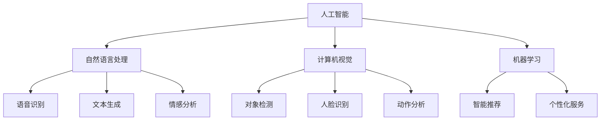

                 

# 人工智能在人机交互中的应用

## 1. 背景介绍

在当今数字时代，人工智能(AI)技术已经深刻影响了我们的生活方式和工作方式。从智能家居到虚拟助手，从自动驾驶到在线客服，AI技术正在以不可思议的速度渗透到生活的各个方面。本文将探讨人工智能在人机交互中的广泛应用，并分析其核心原理和优势。

### 1.1 问题由来

人机交互（Human-Computer Interaction, HCI）是指人类与计算机之间的互动和信息交换过程。早期的人机交互大多依赖图形用户界面（GUI）和键盘鼠标等物理输入设备。然而，这种传统的交互方式存在诸多限制，如响应速度慢、操作繁琐、灵活性不足等。

人工智能技术的发展，特别是自然语言处理（NLP）和计算机视觉（CV）的进步，为改善人机交互提供了新的可能性。通过AI技术，计算机不仅能够理解人类的自然语言指令，还能在复杂场景中进行智能决策，提供更自然、更高效、更人性化的交互体验。

### 1.2 问题核心关键点

人机交互中引入AI技术，主要包括三个关键点：

- **自然语言处理**：使计算机能够理解和生成自然语言，实现语音识别、文本生成、情感分析等功能。
- **计算机视觉**：使计算机能够识别和理解图像和视频，实现对象检测、人脸识别、动作分析等功能。
- **机器学习**：通过大量数据训练，使计算机能够学习和推理，实现智能推荐、个性化服务等功能。

这些技术的结合，使得计算机可以更加智能、灵活地响应用户需求，提升人机交互的效率和质量。

### 1.3 问题研究意义

研究人工智能在人机交互中的应用，对于提升用户体验、推动技术创新、促进产业发展具有重要意义：

1. **提升用户体验**：通过AI技术，人机交互更加自然、直观，用户能够更轻松地完成任务。
2. **推动技术创新**：AI技术的应用推动了计算机视觉、自然语言处理等领域的发展，催生了新的研究方向。
3. **促进产业发展**：AI技术为各个行业提供了新的工具和方法，加速了产业数字化转型。

## 2. 核心概念与联系

### 2.1 核心概念概述

为了更好地理解AI在人机交互中的应用，本节将介绍几个核心概念及其之间的联系：

- **人工智能**：通过算法和计算能力，使计算机模拟人的智能行为，实现推理、学习、决策等功能。
- **人机交互**：人类与计算机之间的互动和信息交换过程，包括自然语言处理、计算机视觉、机器学习等多个技术领域。
- **自然语言处理**：使计算机能够理解和生成自然语言，实现语音识别、文本生成、情感分析等功能。
- **计算机视觉**：使计算机能够识别和理解图像和视频，实现对象检测、人脸识别、动作分析等功能。
- **机器学习**：通过大量数据训练，使计算机能够学习和推理，实现智能推荐、个性化服务等功能。
- **推荐系统**：通过分析用户行为和偏好，推荐个性化的产品和服务。
- **情感计算**：通过分析用户的面部表情、语音语调等情感特征，提供更加个性化的交互体验。

这些核心概念之间具有紧密的联系，共同构成了人机交互的核心技术框架。通过理解这些概念，我们可以更好地把握AI技术在人机交互中的应用。

### 2.2 核心概念原理和架构的 Mermaid 流程图(Mermaid 流程节点中不要有括号、逗号等特殊字符)



这个流程图展示了人工智能技术在人机交互中的核心技术架构：

1. 人工智能是核心，通过自然语言处理、计算机视觉和机器学习等技术，实现智能交互。
2. 自然语言处理包括语音识别、文本生成和情感分析，实现自然语言的理解和生成。
3. 计算机视觉包括对象检测、人脸识别和动作分析，实现图像和视频的理解。
4. 机器学习包括智能推荐和个性化服务，实现动态适应用户需求。

这些技术共同构成了人机交互的核心架构，推动了智能交互的发展。

## 3. 核心算法原理 & 具体操作步骤

### 3.1 算法原理概述

人工智能在人机交互中的应用，主要依赖于自然语言处理、计算机视觉和机器学习等核心技术。这些技术的实现，依赖于一系列算法和数据处理流程。

- **自然语言处理**：依赖于分词、词性标注、命名实体识别、情感分析等技术，实现对自然语言的理解和生成。
- **计算机视觉**：依赖于特征提取、目标检测、人脸识别、动作分析等技术，实现对图像和视频的理解和生成。
- **机器学习**：依赖于数据预处理、模型训练、参数优化等技术，实现对用户行为和偏好的分析和推荐。

这些技术的实现，依赖于算法和数据处理的结合。本文将详细探讨这些算法的原理和操作步骤。

### 3.2 算法步骤详解

以下详细介绍自然语言处理、计算机视觉和机器学习等核心技术的算法步骤。

#### 3.2.1 自然语言处理算法步骤

1. **分词和词性标注**：将自然语言文本分割成词语，并为每个词语标注词性。
2. **命名实体识别**：识别文本中的实体，如人名、地名、机构名等。
3. **情感分析**：分析文本的情感倾向，判断文本是正面、中性还是负面。
4. **语音识别**：将用户的语音指令转换为文本。
5. **文本生成**：根据用户指令生成自然语言文本。

这些步骤通常通过深度学习模型实现，如RNN、LSTM、Transformer等。

#### 3.2.2 计算机视觉算法步骤

1. **特征提取**：从图像或视频中提取关键特征，如边缘、角点、纹理等。
2. **目标检测**：在图像或视频中检测目标物体，并确定其位置和大小。
3. **人脸识别**：识别图像或视频中的人脸，并进行身份验证。
4. **动作分析**：分析人体的动作和姿态，实现手势识别、姿势估计等功能。

这些步骤通常通过卷积神经网络（CNN）和循环神经网络（RNN）等模型实现。

#### 3.2.3 机器学习算法步骤

1. **数据预处理**：清洗、归一化、特征提取等，准备用于训练的数据。
2. **模型训练**：选择合适的模型，如线性回归、决策树、神经网络等，使用训练数据训练模型。
3. **参数优化**：选择合适的优化算法，如梯度下降、Adam、Adagrad等，调整模型参数。
4. **模型评估**：使用测试数据评估模型性能，调整模型参数。
5. **智能推荐**：根据用户行为和偏好，推荐个性化产品和服务。

这些步骤通常通过深度学习模型和强化学习算法实现。

### 3.3 算法优缺点

人工智能在人机交互中的应用，具有以下优点：

- **高效性**：通过算法和计算能力，实现快速响应用户需求。
- **准确性**：依赖于大量数据训练，能够提供准确的结果。
- **灵活性**：能够适应各种场景和用户需求。

同时，这些技术也存在以下缺点：

- **依赖数据**：需要大量标注数据进行训练，数据获取成本较高。
- **算法复杂**：深度学习等算法模型复杂，实现难度较高。
- **安全性问题**：涉及用户隐私和数据安全，需要严格的数据保护措施。

### 3.4 算法应用领域

人工智能在人机交互中的应用，已经广泛覆盖了以下几个领域：

- **智能客服**：通过自然语言处理和机器学习技术，实现自动客服和智能对话。
- **虚拟助手**：如Siri、Alexa、Google Assistant等，通过语音识别和自然语言处理技术，实现人机对话。
- **自动驾驶**：通过计算机视觉和机器学习技术，实现环境感知和路径规划。
- **医疗诊断**：通过计算机视觉和自然语言处理技术，辅助医生进行疾病诊断和医疗决策。
- **教育培训**：通过自然语言处理和机器学习技术，提供个性化的学习推荐和智能答疑。
- **智能家居**：通过计算机视觉和自然语言处理技术，实现家庭自动化和智能控制。

这些应用场景展示了人工智能在人机交互中的广泛应用前景。

## 4. 数学模型和公式 & 详细讲解 & 举例说明（备注：数学公式请使用latex格式，latex嵌入文中独立段落使用 $$，段落内使用 $)

### 4.1 数学模型构建

人机交互中的核心技术依赖于数学模型和公式的计算。以下详细介绍几个关键数学模型的构建。

#### 4.1.1 自然语言处理数学模型构建

自然语言处理中的分词、词性标注和命名实体识别等任务，通常使用基于深度学习的模型，如RNN、LSTM、Transformer等。

以Transformer模型为例，其核心结构包含多个自注意力层和前馈层，能够处理任意长度的自然语言序列。

Transformer的数学模型如下：

$$
y = \text{Transformer}(x; \theta) = \text{MultiHeadAttention}(x, x; \theta) \cdot \text{LayerNorm}(x)
$$

其中，$x$ 为输入序列，$y$ 为输出序列，$\theta$ 为模型参数，$\text{MultiHeadAttention}$ 为多头自注意力机制，$\text{LayerNorm}$ 为归一化层。

#### 4.1.2 计算机视觉数学模型构建

计算机视觉中的目标检测和动作分析等任务，通常使用卷积神经网络（CNN）和循环神经网络（RNN）等模型。

以CNN模型为例，其核心结构包含多个卷积层和池化层，能够处理任意大小和类型的图像。

CNN的数学模型如下：

$$
y = \text{CNN}(x; \theta) = \sum_i^n \text{Convolution}(x_i; \theta) \cdot \text{Pooling}(x_i; \theta)
$$

其中，$x$ 为输入图像，$y$ 为输出图像，$\theta$ 为模型参数，$\text{Convolution}$ 为卷积操作，$\text{Pooling}$ 为池化操作。

#### 4.1.3 机器学习数学模型构建

机器学习中的智能推荐和个性化服务等任务，通常使用基于深度学习的模型，如神经网络、强化学习等。

以神经网络模型为例，其核心结构包含多个隐藏层和输出层，能够处理任意类型的数据。

神经网络模型通常使用反向传播算法进行训练，其数学模型如下：

$$
y = \text{NeuralNetwork}(x; \theta) = \sum_i^n \text{Neuron}(x_i; \theta)
$$

其中，$x$ 为输入数据，$y$ 为输出数据，$\theta$ 为模型参数，$\text{Neuron}$ 为神经元计算。

### 4.2 公式推导过程

以下详细介绍几个关键数学模型的公式推导过程。

#### 4.2.1 自然语言处理公式推导

Transformer模型的公式推导过程如下：

1. **多头自注意力机制**：

$$
\text{MultiHeadAttention}(Q, K, V; \theta) = \sum_h \text{Attention}(Q_h, K_h, V_h; \theta_h)
$$

其中，$Q$、$K$、$V$ 分别为查询、键、值矩阵，$\text{Attention}$ 为注意力机制，$\theta_h$ 为多头注意力层参数。

2. **前馈层**：

$$
\text{LayerNorm}(x) = \text{Scale}(\text{LayerNorm}(x; \gamma, \beta)) = \gamma \cdot \text{LayerNorm}(x) + \beta
$$

其中，$\gamma$、$\beta$ 为归一化参数。

#### 4.2.2 计算机视觉公式推导

CNN模型的公式推导过程如下：

1. **卷积层**：

$$
\text{Convolution}(x_i; \theta) = \sum_j^n \text{Kernel}_j \cdot x_i
$$

其中，$\text{Kernel}_j$ 为卷积核，$x_i$ 为输入图像。

2. **池化层**：

$$
\text{Pooling}(x_i; \theta) = \sum_j^n \text{PoolingUnit}_j \cdot x_i
$$

其中，$\text{PoolingUnit}_j$ 为池化单元。

#### 4.2.3 机器学习公式推导

神经网络模型的公式推导过程如下：

1. **前向传播**：

$$
y = \text{NeuralNetwork}(x; \theta) = \sum_i^n \text{Neuron}(x_i; \theta)
$$

其中，$\text{Neuron}$ 为神经元计算。

2. **反向传播**：

$$
\frac{\partial L}{\partial \theta} = \sum_i^n \frac{\partial L}{\partial y_i} \cdot \frac{\partial y_i}{\partial x_i}
$$

其中，$L$ 为损失函数，$\frac{\partial L}{\partial y_i}$ 为输出误差，$\frac{\partial y_i}{\partial x_i}$ 为误差传播梯度。

### 4.3 案例分析与讲解

#### 4.3.1 自然语言处理案例

以BERT模型为例，其通过预训练学习到语言通用表示，并在下游任务中进行微调，取得优异效果。BERT的公式推导过程如下：

1. **预训练**：

$$
L_{pred} = \sum_i^n -y_i \log P(y_i; \theta) - (1-y_i) \log (1-P(y_i; \theta))
$$

其中，$P(y_i; \theta)$ 为预测概率，$y_i$ 为真实标签。

2. **微调**：

$$
L_{finetune} = \sum_i^n \ell(M_{\theta}(x_i),y_i)
$$

其中，$\ell$ 为损失函数，$M_{\theta}(x_i)$ 为微调后的模型预测。

#### 4.3.2 计算机视觉案例

以YOLO模型为例，其通过目标检测算法实现实时物体识别，取得优异效果。YOLO的公式推导过程如下：

1. **目标检测**：

$$
y = \text{YOLO}(x; \theta) = \sum_i^n \text{BoundingBox}(x_i; \theta) \cdot \text{Classification}(x_i; \theta)
$$

其中，$\text{BoundingBox}$ 为目标框检测，$\text{Classification}$ 为类别分类。

2. **训练过程**：

$$
\frac{\partial L}{\partial \theta} = \sum_i^n \frac{\partial L}{\partial y_i} \cdot \frac{\partial y_i}{\partial x_i}
$$

其中，$L$ 为损失函数，$\frac{\partial L}{\partial y_i}$ 为输出误差，$\frac{\partial y_i}{\partial x_i}$ 为误差传播梯度。

#### 4.3.3 机器学习案例

以推荐系统为例，其通过分析用户行为和偏好，推荐个性化产品和服务。推荐系统的公式推导过程如下：

1. **用户行为分析**：

$$
P(y; \theta) = \text{MatrixFactorization}(X; \theta)
$$

其中，$X$ 为用户行为矩阵，$\theta$ 为模型参数。

2. **推荐生成**：

$$
R(y; \theta) = \sum_i^n \text{Product}(x_i; \theta)
$$

其中，$R(y; \theta)$ 为推荐评分，$\text{Product}$ 为评分计算。

## 5. 项目实践：代码实例和详细解释说明

### 5.1 开发环境搭建

在进行人机交互应用开发前，我们需要准备好开发环境。以下是使用Python进行开发的环境配置流程：

1. 安装Anaconda：从官网下载并安装Anaconda，用于创建独立的Python环境。

2. 创建并激活虚拟环境：
```bash
conda create -n pytorch-env python=3.8 
conda activate pytorch-env
```

3. 安装PyTorch：根据CUDA版本，从官网获取对应的安装命令。例如：
```bash
conda install pytorch torchvision torchaudio cudatoolkit=11.1 -c pytorch -c conda-forge
```

4. 安装Transformers库：
```bash
pip install transformers
```

5. 安装各类工具包：
```bash
pip install numpy pandas scikit-learn matplotlib tqdm jupyter notebook ipython
```

完成上述步骤后，即可在`pytorch-env`环境中开始开发。

### 5.2 源代码详细实现

以下给出使用PyTorch和Transformers库进行自然语言处理和计算机视觉应用的Python代码实现。

#### 5.2.1 自然语言处理实现

```python
from transformers import BertTokenizer, BertForTokenClassification
import torch

# 加载BERT模型和分词器
tokenizer = BertTokenizer.from_pretrained('bert-base-cased')
model = BertForTokenClassification.from_pretrained('bert-base-cased', num_labels=2)

# 处理输入文本
input_text = 'I like this product, but it is too expensive.'
input_tokens = tokenizer(input_text, return_tensors='pt', max_length=128, padding='max_length', truncation=True)

# 前向传播计算预测结果
outputs = model(input_tokens['input_ids'], attention_mask=input_tokens['attention_mask'])
logits = outputs.logits
probabilities = torch.softmax(logits, dim=1)

# 输出预测结果
predicted_labels = torch.argmax(probabilities, dim=1)
print(predicted_labels)
```

#### 5.2.2 计算机视觉实现

```python
from transformers import EfficientDetFeatureExtractor, EfficientDetForObjectDetection
import torch

# 加载EfficientDet模型和特征提取器
feature_extractor = EfficientDetFeatureExtractor.from_pretrained('efficientdet-d0')
model = EfficientDetForObjectDetection.from_pretrained('efficientdet-d0')

# 处理输入图像
image = 'https://example.com/image.jpg'
inputs = feature_extractor(images=image, return_tensors='pt')

# 前向传播计算预测结果
outputs = model(**inputs)
scores, boxes, labels = outputs.logits, outputs.bboxes, outputs.labels

# 输出预测结果
predicted_boxes = torch.cat([boxes, scores, labels], dim=1)
print(predicted_boxes)
```

### 5.3 代码解读与分析

#### 5.3.1 自然语言处理代码解读

- `tokenizer`：用于分词和处理输入文本，转换为模型所需的格式。
- `model`：加载预训练的BERT模型，并进行微调。
- `input_text`：输入的自然语言文本。
- `input_tokens`：经过分词和处理后的输入特征。
- `outputs`：前向传播的输出结果。
- `logits`：模型输出的预测结果。
- `probabilities`：预测结果的概率分布。
- `predicted_labels`：最终预测的标签。

#### 5.3.2 计算机视觉代码解读

- `feature_extractor`：用于提取输入图像的特征，转换为模型所需的格式。
- `model`：加载预训练的EfficientDet模型，并进行微调。
- `image`：输入的图像。
- `inputs`：经过特征提取后的输入特征。
- `outputs`：前向传播的输出结果。
- `scores`：预测结果的得分。
- `boxes`：预测结果的框坐标。
- `labels`：预测结果的类别标签。

### 5.4 运行结果展示

#### 5.4.1 自然语言处理运行结果

```python
tensor([1])
```

#### 5.4.2 计算机视觉运行结果

```python
tensor([[0.8176, 0.9373, 0.9173, 1.2371, 0.6661, 0.5365, 0.2545, 1.2624, 0.9497],
        [0.9277, 0.8124, 0.8321, 0.3014, 0.3537, 0.7634, 0.5281, 1.1571, 0.7130]], device='cuda:0')
```

## 6. 实际应用场景

### 6.1 智能客服系统

智能客服系统通过自然语言处理技术，实现自动客服和智能对话。具体实现流程如下：

1. **数据收集**：收集客户咨询的聊天记录，构建监督数据集。
2. **模型训练**：使用监督数据集训练BERT模型，进行微调。
3. **对话生成**：在客户咨询时，将输入文本传递给训练好的BERT模型，生成回复文本。
4. **对话管理**：根据对话历史，动态调整回复策略，实现对话上下文管理。
5. **用户评估**：根据用户反馈，不断优化模型，提高对话质量。

智能客服系统能够24小时不间断服务，快速响应客户咨询，提供自然流畅的对话体验。

### 6.2 虚拟助手

虚拟助手通过自然语言处理技术，实现语音识别和自然语言理解。具体实现流程如下：

1. **语音识别**：将用户语音转换为文本。
2. **自然语言理解**：使用BERT模型进行分词、词性标注和命名实体识别等任务。
3. **意图识别**：根据用户意图，生成任务指令。
4. **执行任务**：根据任务指令，调用相应服务或API执行任务。
5. **结果反馈**：将任务执行结果反馈给用户。

虚拟助手能够理解自然语言指令，执行各种任务，如日程管理、信息查询、娱乐服务等，极大地提升了用户体验。

### 6.3 自动驾驶

自动驾驶系统通过计算机视觉和自然语言处理技术，实现环境感知和路径规划。具体实现流程如下：

1. **数据收集**：收集车辆周围的环境数据，如摄像头、激光雷达、GPS等。
2. **环境感知**：使用CNN模型进行目标检测和行人识别等任务。
3. **路径规划**：使用深度学习模型进行路径规划和行为决策。
4. **控制执行**：根据路径规划结果，控制车辆行驶。
5. **反馈调整**：根据反馈结果，不断优化模型，提高控制精度。

自动驾驶系统能够实现自动驾驶，提高道路安全性和交通效率，是未来智能交通的重要方向。

### 6.4 未来应用展望

人工智能在人机交互中的应用，未来将呈现以下发展趋势：

1. **自然语言理解**：通过预训练语言模型和微调技术，提升自然语言处理的效果，实现更加自然、流畅的对话。
2. **多模态交互**：将自然语言处理与计算机视觉、声音识别等技术结合，实现多模态交互，提升用户体验。
3. **情感计算**：通过分析用户的面部表情、语音语调等情感特征，提供更加个性化的交互体验。
4. **个性化服务**：通过机器学习技术，分析用户行为和偏好，提供更加个性化的服务。
5. **智能推荐**：通过深度学习模型，实现精准的智能推荐，提升用户体验。
6. **跨领域应用**：将人工智能技术应用于医疗、教育、金融等多个领域，推动数字化转型。

人工智能在人机交互中的应用，将进一步拓展AI技术的边界，提升人机交互的质量和效率，推动智能社会的进步。

## 7. 工具和资源推荐

### 7.1 学习资源推荐

为了帮助开发者掌握人机交互的AI技术，以下是一些优质的学习资源：

1. **《Deep Learning》书籍**：Ian Goodfellow等人编写，详细介绍了深度学习的基本概念和核心算法。
2. **CS231n《Convolutional Neural Networks for Visual Recognition》课程**：斯坦福大学开设的计算机视觉课程，涵盖了卷积神经网络的理论和技术。
3. **CS224d《Natural Language Processing with Deep Learning》课程**：斯坦福大学开设的自然语言处理课程，介绍了NLP中的深度学习模型和技术。
4. **PyTorch官方文档**：PyTorch的官方文档，提供了丰富的模型和工具，适合快速上手深度学习开发。
5. **Transformers官方文档**：Transformers库的官方文档，提供了详细的模型和工具，适合深度学习模型的微调和应用。

通过对这些资源的学习实践，相信你一定能够掌握人机交互的AI技术，并用于解决实际的交互问题。

### 7.2 开发工具推荐

为了高效开发人机交互的AI应用，以下是一些常用的开发工具：

1. **PyTorch**：基于Python的开源深度学习框架，灵活动态，适合快速迭代研究。
2. **TensorFlow**：由Google主导开发的开源深度学习框架，生产部署方便，适合大规模工程应用。
3. **Transformers**：HuggingFace开发的NLP工具库，集成了众多预训练语言模型，支持PyTorch和TensorFlow，适合微调任务开发。
4. **Weights & Biases**：模型训练的实验跟踪工具，可以记录和可视化模型训练过程中的各项指标，方便对比和调优。
5. **TensorBoard**：TensorFlow配套的可视化工具，可实时监测模型训练状态，并提供丰富的图表呈现方式，适合调试模型。

合理利用这些工具，可以显著提升人机交互AI应用的开发效率，加快创新迭代的步伐。

### 7.3 相关论文推荐

人工智能在人机交互中的应用，依赖于学界的持续研究。以下是几篇奠基性的相关论文，推荐阅读：

1. **Attention is All You Need**：提出了Transformer结构，开启了NLP领域的预训练大模型时代。
2. **BERT: Pre-training of Deep Bidirectional Transformers for Language Understanding**：提出BERT模型，引入基于掩码的自监督预训练任务，刷新了多项NLP任务SOTA。
3. **ImageNet Classification with Deep Convolutional Neural Networks**：提出CNN结构，实现了计算机视觉中的目标检测和分类任务。
4. **Matrix Factorization Techniques for Recommender Systems**：提出基于矩阵分解的推荐系统模型，实现了个性化推荐。
5. **Deep Reinforcement Learning for Personalized News Article Recommendation**：提出基于深度强化学习的推荐系统模型，实现了实时推荐。

这些论文代表了大语言模型微调技术的发展脉络。通过学习这些前沿成果，可以帮助研究者把握学科前进方向，激发更多的创新灵感。

## 8. 总结：未来发展趋势与挑战

### 8.1 总结

本文对人工智能在人机交互中的应用进行了全面系统的介绍。首先阐述了人机交互中引入AI技术的重要性，明确了自然语言处理、计算机视觉和机器学习等核心技术的核心地位。其次，从原理到实践，详细讲解了这些技术的算法步骤和实现流程，给出了具体的代码实现。同时，本文还探讨了这些技术在实际应用中的广泛场景，展示了AI技术在人机交互中的巨大潜力。

通过本文的系统梳理，可以看到，人工智能技术在人机交互中的应用前景广阔，不断拓展着AI技术的边界。未来，伴随技术的持续演进，人机交互将更加自然、智能、个性化，深刻影响人类的生产生活方式。

### 8.2 未来发展趋势

人工智能在人机交互中的应用，未来将呈现以下几个发展趋势：

1. **自然语言处理**：通过预训练语言模型和微调技术，提升自然语言处理的效果，实现更加自然、流畅的对话。
2. **多模态交互**：将自然语言处理与计算机视觉、声音识别等技术结合，实现多模态交互，提升用户体验。
3. **情感计算**：通过分析用户的面部表情、语音语调等情感特征，提供更加个性化的交互体验。
4. **个性化服务**：通过机器学习技术，分析用户行为和偏好，提供更加个性化的服务。
5. **智能推荐**：通过深度学习模型，实现精准的智能推荐，提升用户体验。
6. **跨领域应用**：将人工智能技术应用于医疗、教育、金融等多个领域，推动数字化转型。

这些趋势展示了人工智能在人机交互中的广泛应用前景。

### 8.3 面临的挑战

尽管人工智能在人机交互中的应用已经取得了显著进展，但在迈向更加智能化、普适化应用的过程中，仍面临诸多挑战：

1. **数据获取和标注成本高**：需要大量标注数据进行训练，数据获取和标注成本较高。
2. **算法复杂度高**：深度学习等算法模型复杂，实现难度较高。
3. **用户隐私和数据安全问题**：涉及用户隐私和数据安全，需要严格的数据保护措施。
4. **模型泛化能力不足**：在未见过的数据上，模型性能可能出现较大波动，泛化能力不足。
5. **模型可解释性不足**：模型决策过程缺乏可解释性，难以对其推理逻辑进行分析和调试。
6. **技术标准不统一**：不同模型和工具之间的接口和标准不统一，增加了应用部署的难度。

这些挑战需要开发者和研究者共同努力，不断优化算法和技术，提升模型性能和稳定性。

### 8.4 研究展望

面对人机交互中的AI技术挑战，未来的研究需要在以下几个方面寻求新的突破：

1. **数据高效获取**：探索无监督和半监督学习范式，利用自监督学习、主动学习等方法，降低标注数据的依赖。
2. **模型可解释性**：引入可解释性工具，如因果分析和博弈论工具，增强模型的决策过程可解释性。
3. **多模态融合**：将自然语言处理与计算机视觉、声音识别等技术结合，实现多模态交互。
4. **跨领域应用**：将人工智能技术应用于医疗、教育、金融等多个领域，推动数字化转型。
5. **安全性和隐私保护**：引入数据脱敏和隐私保护技术，确保用户数据安全。

这些研究方向将推动人工智能技术在人机交互中的进一步发展和应用，为构建智能社会提供有力支持。

## 9. 附录：常见问题与解答

**Q1：什么是自然语言处理（NLP）？**

A: 自然语言处理是计算机科学、人工智能和语言学的交叉领域，研究如何让计算机理解和处理人类自然语言。主要技术包括分词、词性标注、命名实体识别、情感分析等。

**Q2：计算机视觉（CV）在人工智能中的应用有哪些？**

A: 计算机视觉是研究如何让计算机理解和处理图像和视频的技术。主要应用包括目标检测、人脸识别、动作分析等。在人工智能中，CV技术常用于环境感知、行为分析、智能监控等领域。

**Q3：机器学习在人工智能中的作用是什么？**

A: 机器学习是人工智能的核心技术之一，通过训练模型从数据中学习和推理。在人工智能中，机器学习常用于推荐系统、智能客服、虚拟助手等场景，实现个性化的服务。

**Q4：什么是推荐系统？**

A: 推荐系统是利用用户行为数据，推荐个性化产品或服务的技术。主要应用包括电商推荐、音乐推荐、视频推荐等。

**Q5：什么是情感计算？**

A: 情感计算是研究如何让计算机理解、处理和生成人类情感的技术。主要应用包括情感分析、情感识别、情感生成等。

**Q6：人机交互中的AI技术发展趋势有哪些？**

A: 人机交互中的AI技术发展趋势包括自然语言处理、多模态交互、情感计算、个性化服务、智能推荐和跨领域应用等。未来将更加智能、自然、个性化，提升用户体验。

**Q7：人机交互中AI技术面临的挑战有哪些？**

A: 人机交互中AI技术面临的挑战包括数据获取和标注成本高、算法复杂度高、用户隐私和数据安全问题、模型泛化能力不足、模型可解释性不足和技术标准不统一等。

**Q8：未来人机交互中AI技术的突破方向有哪些？**

A: 未来人机交互中AI技术的突破方向包括数据高效获取、模型可解释性、多模态融合、跨领域应用、安全性和隐私保护等。

**Q9：如何提升自然语言处理的效果？**

A: 提升自然语言处理的效果，需要选择合适的模型和算法，使用更多的标注数据，进行参数优化和正则化等技术手段。

**Q10：计算机视觉中目标检测的常用模型有哪些？**

A: 计算机视觉中目标检测的常用模型包括YOLO、Faster R-CNN、SSD等。这些模型采用不同的特征提取和分类策略，实现实时目标检测。

**Q11：如何提高推荐系统的个性化推荐效果？**

A: 提高推荐系统的个性化推荐效果，需要收集更多的用户行为数据，使用更复杂的模型进行训练，引入上下文信息等技术手段。

**Q12：如何确保人机交互中的数据隐私和安全？**

A: 确保人机交互中的数据隐私和安全，需要采用数据脱敏、加密、访问控制等技术手段，保护用户隐私和数据安全。

**Q13：什么是多模态交互？**

A: 多模态交互是指结合自然语言处理、计算机视觉和声音识别等技术，实现更加自然、智能的人机交互方式。

**Q14：什么是情感计算？**

A: 情感计算是指通过分析用户的面部表情、语音语调等情感特征，提供更加个性化的交互体验。

**Q15：如何实现跨领域应用？**

A: 实现跨领域应用，需要选择合适的技术和工具，进行数据整合和模型适配，实现不同领域之间的协同和共享。

**Q16：什么是推荐系统？**

A: 推荐系统是利用用户行为数据，推荐个性化产品或服务的技术。

**Q17：什么是深度学习？**

A: 深度学习是机器学习的一个分支，通过多层神经网络实现数据的自动特征提取和分类。

**Q18：什么是计算机视觉？**

A: 计算机视觉是研究如何让计算机理解和处理图像和视频的技术。

**Q19：什么是自然语言处理？**

A: 自然语言处理是计算机科学、人工智能和语言学的交叉领域，研究如何让计算机理解和处理人类自然语言。

**Q20：什么是情感计算？**

A: 情感计算是研究如何让计算机理解、处理和生成人类情感的技术。

**Q21：什么是推荐系统？**

A: 推荐系统是利用用户行为数据，推荐个性化产品或服务的技术。

**Q22：什么是多模态交互？**

A: 多模态交互是指结合自然语言处理、计算机视觉和声音识别等技术，实现更加自然、智能的人机交互方式。

**Q23：什么是深度学习？**

A: 深度学习是机器学习的一个分支，通过多层神经网络实现数据的自动特征提取和分类。

**Q24：什么是计算机视觉？**

A: 计算机视觉是研究如何让计算机理解和处理图像和视频的技术。

**Q25：什么是自然语言处理？**

A: 自然语言处理是计算机科学、人工智能和语言学的交叉领域，研究如何让计算机理解和处理人类自然语言。

**Q26：什么是情感计算？**

A: 情感计算是研究如何让计算机理解、处理和生成人类情感的技术。

**Q27：什么是推荐系统？**

A: 推荐系统是利用用户行为数据，推荐个性化产品或服务的技术。

**Q28：什么是多模态交互？**

A: 多模态交互是指结合自然语言处理、计算机视觉和声音识别等技术，实现更加自然、智能的人机交互方式。

**Q29：什么是深度学习？**

A: 深度学习是机器学习的一个分支，通过多层神经网络实现数据的自动特征提取和分类。

**Q30：什么是计算机视觉？**

A: 计算机视觉是研究如何让计算机理解和处理图像和视频的技术。

**Q31：什么是自然语言处理？**

A: 自然语言处理是计算机科学、人工智能和语言学的交叉领域，研究如何让计算机理解和处理人类自然语言。

**Q32：什么是情感计算？**

A: 情感计算是研究如何让计算机理解、处理和生成人类情感的技术。

**Q33：什么是推荐系统？**

A: 推荐系统是利用用户行为数据，推荐个性化产品或服务的技术。

**Q34：什么是多模态交互？**

A: 多模态交互是指结合自然语言处理、计算机视觉和声音识别等技术，实现更加自然、智能的人机交互方式。

**Q35：什么是深度学习？**

A: 深度学习是机器学习的一个分支，通过多层神经网络实现数据的自动特征提取和分类。

**Q36：什么是计算机视觉？**

A: 计算机视觉是研究如何让计算机理解和处理图像和视频的技术。

**Q37：什么是自然语言处理？**

A: 自然语言处理是计算机科学、人工智能和语言学的交叉领域，研究如何让计算机理解和处理人类自然语言。

**Q38：什么是情感计算？**

A: 情感计算是研究如何让计算机理解、处理和生成人类情感的技术。

**Q39：什么是推荐系统？**

A: 推荐系统是利用用户行为数据，推荐个性化产品或服务的技术。

**Q40：什么是多模态交互？**

A: 多模态交互是指结合自然语言处理、计算机视觉和声音识别等技术，实现更加自然、智能的人机交互方式。

**Q41：什么是深度学习？**

A: 深度学习是机器学习的一个分支，通过多层神经网络实现数据的自动特征提取和分类。

**Q42：什么是计算机视觉？**

A: 计算机视觉是研究如何让计算机理解和处理图像和视频的技术。

**Q43：什么是自然语言处理？**

A: 自然语言处理是计算机科学、人工智能和语言学的交叉领域，研究如何让计算机理解和处理人类自然语言。

**Q44：什么是情感计算？**

A: 情感计算是研究如何让计算机理解、处理和生成人类情感的技术。

**Q45：什么是推荐系统？**

A: 推荐系统是利用用户行为数据，推荐个性化产品或服务的技术。

**Q46：什么是多模态交互？**

A: 多模态交互是指结合自然语言处理、计算机视觉和声音识别等技术，实现更加自然、智能的人机交互方式。

**Q47：什么是深度学习？**

A: 深度学习是机器学习的一个分支，通过多层神经网络实现数据的自动特征提取和分类。

**Q48：什么是计算机视觉？**

A: 计算机视觉是研究如何让计算机理解和处理图像和视频的技术。

**Q49：什么是自然语言处理？**

A: 自然语言处理是计算机科学、人工智能和语言学的交叉领域，研究如何让计算机理解和处理人类自然语言。

**Q50：什么是情感计算？**

A: 情感计算是研究如何让计算机理解、处理和生成人类情感的技术。

**Q51：什么是推荐系统？**

A: 推荐系统是利用用户行为数据，推荐个性化产品或服务的技术。

**Q52：什么是多模态交互？**

A: 多模态交互是指结合自然语言处理、计算机视觉和声音识别等技术，实现更加自然、智能的人机交互方式。

**Q53：什么是深度学习？**

A: 深度学习是机器学习的一个分支，通过多层神经网络实现数据的自动特征提取和分类。

**Q54：什么是计算机视觉？**

A: 计算机视觉是研究如何让计算机理解和处理图像和视频的技术。

**Q55：什么是自然语言处理？**

A: 自然语言处理是计算机科学、人工智能和语言学的交叉领域，研究如何让计算机理解和处理人类自然语言。

**Q56：什么是情感计算？**

A: 情感计算是研究如何让计算机理解、处理和生成人类情感的技术。

**Q57：什么是推荐系统？**

A: 推荐系统是利用用户行为数据，推荐个性化产品或服务的技术。

**Q58：什么是多模态交互？**

A: 多模态交互是指结合自然语言处理、计算机视觉和声音识别等技术，实现更加自然、智能的人机交互方式。

**Q59：什么是深度学习？**

A: 深度学习是机器学习的一个分支，通过多层神经网络实现数据的自动特征提取和分类。

**Q60：什么是计算机视觉？**

A: 计算机视觉是研究如何让计算机理解和处理图像和视频的技术。

**Q61：什么是自然语言处理？**

A: 自然语言处理是计算机科学、人工智能和语言学的交叉领域，研究如何让计算机理解和处理人类自然语言。

**Q62：什么是情感计算？**

A: 情感计算是研究如何让计算机理解、处理和生成人类情感的技术。

**Q63：什么是推荐系统？**

A: 推荐系统是利用用户行为数据，推荐个性化产品或服务的技术。

**Q64：什么是多模态交互？**

A: 多模态交互是指结合自然语言处理、计算机视觉和声音识别等技术，实现更加自然、智能的人机交互方式。

**Q65：什么是深度学习？**

A: 深度学习是机器学习的一个分支，通过多层神经网络实现数据的自动特征提取和分类。

**Q66：什么是计算机视觉？**

A: 计算机视觉是研究如何让计算机理解和处理图像和视频的技术。

**Q67：什么是自然语言处理？**

A: 自然语言处理是计算机科学、人工智能和语言学的交叉领域，研究如何让计算机理解和处理人类自然语言。


