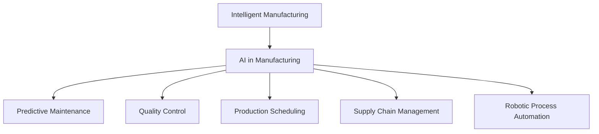

                 

# 人工智能在制造和自动化中的应用

> 关键词：人工智能, 制造自动化, 机器学习, 机器人流程自动化, 智能制造, 供应链管理, 工业4.0

## 1. 背景介绍

### 1.1 问题由来

制造业作为国民经济的支柱，长期以来依赖于机械化和自动化技术的发展。然而，随着市场竞争加剧和技术迭代加速，传统的制造业面临着效率低、成本高、灵活性差等挑战。在此背景下，人工智能技术的兴起为制造业带来了新的发展契机，推动了智能制造和自动化转型。

智能制造指的是将先进的信息技术（如物联网、大数据、云计算等）与制造技术深度融合，实现从设计、生产到物流的端到端智能化。智能制造能够显著提升生产效率，优化资源配置，降低生产成本，增强企业竞争力。

人工智能技术在制造和自动化中的应用，涵盖从预测性维护、质量控制、生产调度、到供应链优化等各个环节，使得制造过程更加精准、灵活、高效。本文将详细介绍AI在制造和自动化中的应用原理、操作步骤及未来发展方向。

### 1.2 问题核心关键点

人工智能在制造和自动化中的应用主要集中在以下几个方面：

- 预测性维护：利用机器学习算法对设备运行状态进行实时监测和预测，提前识别故障，避免意外停机。
- 质量控制：通过图像识别、声音分析等技术，对生产过程中的产品进行实时检测和分类，提高产品质量。
- 生产调度：基于优化算法和模拟仿真技术，对生产流程进行实时优化和调度，提升生产效率。
- 供应链管理：运用智能算法优化库存管理、物流配送，实现供应链的精细化运营。
- 机器人流程自动化：利用机器人和自动化系统，替代部分人工操作，提升生产线的自动化水平。

这些应用场景展示了人工智能在制造业中的巨大潜力，并推动了工业4.0的到来。

## 2. 核心概念与联系

### 2.1 核心概念概述

为了更好地理解AI在制造和自动化中的应用，本节将介绍几个密切相关的核心概念：

- 人工智能（Artificial Intelligence, AI）：使计算机系统能够模拟人类智能行为的技术，包括机器学习、深度学习、自然语言处理等。
- 智能制造（Intelligent Manufacturing）：将信息技术和制造技术深度融合，实现生产过程的智能化。
- 机器人流程自动化（Robotic Process Automation, RPA）：通过自动化软件模拟人类操作，处理大量重复性、规则化的任务。
- 预测性维护（Predictive Maintenance）：利用数据分析和机器学习，预测设备故障，提前进行维护。
- 质量控制（Quality Control）：通过对生产过程中的产品进行检测和分类，确保产品质量符合标准。
- 生产调度（Production Scheduling）：基于优化算法和模拟仿真技术，对生产流程进行优化和调度。
- 供应链管理（Supply Chain Management, SCM）：运用智能算法优化库存管理、物流配送，实现供应链的精细化运营。

这些核心概念之间的逻辑关系可以通过以下Mermaid流程图来展示：



这个流程图展示了大语言模型的核心概念及其之间的关系：

1. 智能制造是AI在制造业应用的基础，通过将AI技术与制造技术深度融合，实现生产过程的智能化。
2. 预测性维护、质量控制、生产调度、供应链管理、机器人流程自动化等都是智能制造的重要组成部分。
3. 这些技术通过AI技术的应用，实现了生产过程的精准化、自动化和高效化。

## 3. 核心算法原理 & 具体操作步骤

### 3.1 算法原理概述

人工智能在制造和自动化中的应用，主要基于以下几个核心算法原理：

- 机器学习（Machine Learning, ML）：通过训练数据，使计算机系统能够自动学习和优化，提高预测和决策的准确性。
- 深度学习（Deep Learning, DL）：一种特殊的机器学习算法，利用多层神经网络模型，处理复杂的非线性数据。
- 自然语言处理（Natural Language Processing, NLP）：使计算机能够理解和处理人类语言的技术。
- 优化算法（Optimization Algorithms）：如遗传算法、模拟退火、蚁群算法等，用于生产调度、优化算法。
- 仿真技术（Simulation Technology）：通过模拟仿真技术，预测生产过程和设备运行状态，优化生产流程。

这些算法原理为大语言模型在制造和自动化中的应用提供了坚实的理论基础和技术支撑。

### 3.2 算法步骤详解

基于AI的智能制造和自动化过程一般包括以下几个关键步骤：

**Step 1: 数据收集与预处理**
- 收集制造过程中的传感器数据、生产记录、订单信息、质量报告等数据。
- 清洗和整理数据，去除噪音和异常值，确保数据的准确性和完整性。

**Step 2: 模型选择与训练**
- 选择合适的机器学习或深度学习模型，如决策树、随机森林、卷积神经网络（CNN）、循环神经网络（RNN）等。
- 利用历史数据对模型进行训练，调整模型参数，使其具备较高的预测和决策能力。

**Step 3: 模型评估与优化**
- 在验证集上评估模型的性能，使用准确率、召回率、F1-score等指标。
- 根据评估结果，调整模型参数，优化模型性能。

**Step 4: 部署与应用**
- 将训练好的模型部署到生产线上，进行实时监测和预测。
- 根据模型预测结果，自动触发相应的控制措施，如停机维护、调整参数、优化调度等。

**Step 5: 持续改进**
- 收集新数据，更新训练集，持续改进模型性能。
- 定期对模型进行评估和优化，确保其长期有效。

### 3.3 算法优缺点

AI在制造和自动化中的应用具有以下优点：
1. 提高生产效率：通过自动化和智能化的生产流程，显著提升生产效率和资源利用率。
2. 降低生产成本：减少人工操作和资源浪费，降低生产成本。
3. 增强决策能力：利用数据分析和机器学习，提升生产调度和质量控制的决策能力。
4. 优化供应链管理：通过智能算法优化库存和物流，提高供应链的灵活性和响应速度。

同时，该方法也存在一些局限性：
1. 数据依赖：模型的性能高度依赖于数据的质量和数量，数据不足或数据偏差可能导致预测不准确。
2. 模型复杂度：复杂的深度学习模型需要大量的计算资源和存储空间，初期投入较高。
3. 维护成本：AI系统的维护和更新需要专业技术人才，成本较高。
4. 技术门槛：需要一定的技术储备和专业知识，对企业的技术团队提出了较高要求。

尽管存在这些局限性，但总体而言，AI在制造和自动化中的应用具有巨大的潜力，能够为企业带来显著的经济效益和竞争力提升。

### 3.4 算法应用领域

AI在制造和自动化中的应用涵盖多个领域，包括但不限于：

- 预测性维护：对设备运行状态进行实时监测和预测，提前识别故障。
- 质量控制：利用图像识别和声音分析等技术，对产品进行实时检测和分类。
- 生产调度：基于优化算法和仿真技术，对生产流程进行优化和调度。
- 供应链管理：利用智能算法优化库存管理、物流配送，实现供应链的精细化运营。
- 机器人流程自动化：利用机器人和自动化系统，替代人工操作，提升生产线的自动化水平。
- 智能制造：将AI技术与制造技术深度融合，实现生产过程的智能化。

这些应用领域展示了AI在制造和自动化中的广泛应用和重要价值，为企业的数字化转型提供了有力支持。

## 4. 数学模型和公式 & 详细讲解 & 举例说明

### 4.1 数学模型构建

本节将使用数学语言对基于AI的智能制造和自动化过程进行更加严格的刻画。

记设备运行状态为 $X$，机器学习模型为 $f(X;\theta)$，其中 $\theta$ 为模型参数。假设模型预测的故障概率为 $p$，真实故障概率为 $q$，则预测误差 $e$ 为：

$$
e = p - q
$$

定义模型在训练集上的平均预测误差为：

$$
\bar{e} = \frac{1}{N} \sum_{i=1}^N |p_i - q_i|
$$

模型的目标是最小化平均预测误差 $\bar{e}$，即：

$$
\theta^* = \mathop{\arg\min}_{\theta} \bar{e}
$$

在实践中，我们通常使用交叉熵损失函数对模型进行训练。假设模型输出的故障概率为 $p_i$，真实标签为 $y_i$，则交叉熵损失函数为：

$$
\ell = -\frac{1}{N} \sum_{i=1}^N y_i \log p_i + (1-y_i) \log (1-p_i)
$$

模型训练的目标是最小化损失函数 $\ell$。

### 4.2 公式推导过程

以下我们以预测性维护为例，推导模型训练过程的详细步骤。

假设设备运行状态 $X_i$ 对应的故障概率为 $p_i$，真实故障概率为 $q_i$。为了训练预测性维护模型，我们收集大量的设备运行数据 $X=\{X_1, X_2, ..., X_N\}$，并将这些数据作为训练集。

首先，我们需要定义模型的损失函数。假设模型对设备运行状态 $X_i$ 的预测故障概率为 $p_i$，真实故障概率为 $q_i$，则预测误差 $e_i$ 为：

$$
e_i = p_i - q_i
$$

模型的目标是最小化平均预测误差 $\bar{e}$，即：

$$
\theta^* = \mathop{\arg\min}_{\theta} \bar{e} = \mathop{\arg\min}_{\theta} \frac{1}{N} \sum_{i=1}^N |p_i - q_i|
$$

为了方便求解，我们可以定义一个新的损失函数 $L$：

$$
L = -\frac{1}{N} \sum_{i=1}^N y_i \log p_i + (1-y_i) \log (1-p_i)
$$

其中 $y_i$ 为模型的预测结果，即 $p_i$。因此，模型训练的目标是最小化损失函数 $L$：

$$
\theta^* = \mathop{\arg\min}_{\theta} L
$$

通过梯度下降等优化算法，模型不断更新参数 $\theta$，最小化损失函数 $L$。当训练集上的平均预测误差 $\bar{e}$ 收敛到足够小的水平时，训练结束。

### 4.3 案例分析与讲解

以一个简单的预测性维护案例为例，展示模型训练过程。

假设我们有一个包含 $N=100$ 个设备运行状态的数据集，每个数据包含10个特征 $x_i = (x_{i1}, x_{i2}, ..., x_{i10})$，对应一个设备故障概率 $q_i$。我们的目标是训练一个预测模型 $f(X;\theta)$，以预测设备故障概率 $p_i$。

首先，我们需要对数据进行预处理，将数据标准化：

$$
x_{ij}' = \frac{x_{ij} - \mu_{ij}}{\sigma_{ij}}
$$

其中 $\mu_{ij}$ 为特征 $x_{ij}$ 的均值，$\sigma_{ij}$ 为特征 $x_{ij}$ 的标准差。

然后，我们将标准化后的数据输入模型 $f(X;\theta)$ 进行训练，调整模型参数 $\theta$，最小化损失函数 $L$。训练过程中，我们不断迭代计算梯度，更新模型参数：

$$
\theta \leftarrow \theta - \eta \nabla_{\theta} L
$$

其中 $\eta$ 为学习率，$\nabla_{\theta} L$ 为损失函数 $L$ 对参数 $\theta$ 的梯度。

最后，我们使用验证集评估模型性能，根据评估结果调整模型参数，优化模型性能。

## 5. 项目实践：代码实例和详细解释说明

### 5.1 开发环境搭建

在进行AI在制造和自动化中的应用实践前，我们需要准备好开发环境。以下是使用Python进行TensorFlow开发的环境配置流程：

1. 安装Anaconda：从官网下载并安装Anaconda，用于创建独立的Python环境。

2. 创建并激活虚拟环境：
```bash
conda create -n tf-env python=3.8 
conda activate tf-env
```

3. 安装TensorFlow：根据CUDA版本，从官网获取对应的安装命令。例如：
```bash
conda install tensorflow tensorflow-gpu=cuda-11.1 -c conda-forge
```

4. 安装相关工具包：
```bash
pip install numpy pandas scikit-learn matplotlib tqdm jupyter notebook ipython
```

完成上述步骤后，即可在`tf-env`环境中开始AI在制造和自动化中的应用实践。

### 5.2 源代码详细实现

这里我们以预测性维护为例，给出使用TensorFlow进行模型训练的Python代码实现。

首先，定义预测性维护模型：

```python
import tensorflow as tf

model = tf.keras.Sequential([
    tf.keras.layers.Dense(64, activation='relu', input_shape=(num_features,)),
    tf.keras.layers.Dense(1, activation='sigmoid')
])
```

然后，准备训练数据：

```python
features = ...
labels = ...

train_dataset = tf.data.Dataset.from_tensor_slices((features, labels))
train_dataset = train_dataset.shuffle(buffer_size=1000).batch(batch_size)

validation_dataset = tf.data.Dataset.from_tensor_slices((features, labels))
validation_dataset = validation_dataset.batch(batch_size)
```

接着，定义损失函数和优化器：

```python
loss_fn = tf.keras.losses.BinaryCrossentropy()
optimizer = tf.keras.optimizers.Adam()
```

最后，进行模型训练：

```python
num_epochs = 100

model.compile(optimizer=optimizer, loss=loss_fn, metrics=['accuracy'])

model.fit(train_dataset, validation_data=validation_dataset, epochs=num_epochs)
```

以上就是使用TensorFlow对预测性维护模型进行训练的完整代码实现。可以看到，TensorFlow提供了方便的API，使得模型训练过程非常简单。

### 5.3 代码解读与分析

让我们再详细解读一下关键代码的实现细节：

**Sequential模型**：
- 定义了包含两个Dense层的神经网络模型，输入层为64个神经元，输出层为1个神经元，激活函数为Sigmoid，用于二分类问题。

**数据集准备**：
- `features`和`labels`变量用于存储训练数据和标签。
- `train_dataset`和`validation_dataset`变量用于定义训练集和验证集数据集，使用`from_tensor_slices`方法从TensorFlow数据集中读取数据。
- `shuffle`和`batch`方法用于数据预处理，确保数据随机性和批量化处理，提高模型训练效率。

**损失函数和优化器**：
- 使用`tf.keras.losses.BinaryCrossentropy`定义二分类交叉熵损失函数。
- 使用`tf.keras.optimizers.Adam`定义Adam优化器，学习率为默认值0.001。

**模型训练**：
- `model.compile`方法定义模型编译参数，包括损失函数、优化器和评估指标。
- `model.fit`方法进行模型训练，`train_dataset`和`validation_dataset`分别传入训练集和验证集数据集，`epochs`指定训练轮数。

可以看到，TensorFlow提供了简单易用的API，使得模型训练过程非常直观，适合快速迭代和调试。

## 6. 实际应用场景

### 6.1 智能制造

智能制造是大规模采用AI和自动化技术的典型应用场景。通过将AI技术应用于制造过程的各个环节，实现生产流程的自动化、智能化和精准化。

智能制造的核心是工业物联网（IIoT），通过传感器、摄像头等设备采集生产过程中的各种数据，实时监测设备运行状态、产品质量、生产效率等关键指标。利用AI技术对这些数据进行分析和处理，可以实现以下功能：

- 预测性维护：利用机器学习算法对设备运行状态进行实时监测和预测，提前识别故障，避免意外停机。
- 质量控制：通过图像识别、声音分析等技术，对产品进行实时检测和分类，提高产品质量。
- 生产调度：基于优化算法和模拟仿真技术，对生产流程进行实时优化和调度，提升生产效率。
- 供应链管理：利用智能算法优化库存管理、物流配送，实现供应链的精细化运营。

这些技术的应用，使得智能制造在提高生产效率、降低成本、提升产品质量等方面取得了显著成效。

### 6.2 预测性维护

预测性维护是AI在制造和自动化中应用最广泛的技术之一。通过实时监测设备运行状态，预测设备故障，提前进行维护，避免意外停机，降低维护成本。

预测性维护的核心是利用机器学习算法对设备运行数据进行分析，建立设备运行状态与故障之间的关系。常见的算法包括时间序列分析、神经网络、支持向量机等。

以一个简单的预测性维护案例为例，假设我们有一个包含100个设备运行数据的数据集，每个数据包含10个特征，对应一个设备故障概率。我们的目标是训练一个预测模型，以预测设备故障概率。

首先，我们需要对数据进行预处理，将数据标准化：

$$
x_{ij}' = \frac{x_{ij} - \mu_{ij}}{\sigma_{ij}}
$$

然后，我们将标准化后的数据输入模型 $f(X;\theta)$ 进行训练，调整模型参数 $\theta$，最小化损失函数 $L$。训练过程中，我们不断迭代计算梯度，更新模型参数：

$$
\theta \leftarrow \theta - \eta \nabla_{\theta} L
$$

最后，我们使用验证集评估模型性能，根据评估结果调整模型参数，优化模型性能。

## 7. 工具和资源推荐

### 7.1 学习资源推荐

为了帮助开发者系统掌握AI在制造和自动化中的应用，这里推荐一些优质的学习资源：

1. 《深度学习》系列书籍：Deep Learning by Ian Goodfellow, Yoshua Bengio, Aaron Courville。深入浅出地介绍了深度学习的原理、应用和实践。
2. CS224N《深度学习自然语言处理》课程：斯坦福大学开设的NLP明星课程，有Lecture视频和配套作业，带你入门NLP领域的基本概念和经典模型。
3. HuggingFace官方文档：提供了丰富的预训练语言模型和代码样例，是学习和应用深度学习模型的重要资源。
4. TensorFlow官方文档：TensorFlow的官方文档，提供了详细的API和教程，适合快速上手实验最新模型。
5. PyTorch官方文档：PyTorch的官方文档，提供了简单易用的API和丰富的教程，适合快速迭代和调试。

通过对这些资源的学习实践，相信你一定能够快速掌握AI在制造和自动化中的应用精髓，并用于解决实际的制造问题。

### 7.2 开发工具推荐

高效的开发离不开优秀的工具支持。以下是几款用于AI在制造和自动化中的应用开发的常用工具：

1. TensorFlow：由Google主导开发的开源深度学习框架，生产部署方便，适合大规模工程应用。
2. PyTorch：基于Python的开源深度学习框架，灵活动态的计算图，适合快速迭代研究。
3. Keras：一个高层次的深度学习API，易于上手，适合快速实验和原型开发。
4. Jupyter Notebook：一个交互式笔记本环境，适合进行代码实验和数据探索。
5. Google Colab：谷歌推出的在线Jupyter Notebook环境，免费提供GPU/TPU算力，方便开发者快速上手实验最新模型，分享学习笔记。

合理利用这些工具，可以显著提升AI在制造和自动化中的应用开发效率，加快创新迭代的步伐。

### 7.3 相关论文推荐

AI在制造和自动化中的应用源于学界的持续研究。以下是几篇奠基性的相关论文，推荐阅读：

1. "The Google Brain Team". "Machine Learning in Manufacturing: A Survey". arXiv preprint arXiv:2006.02025 (2020).
2. "Balogh, S., Keleher, M., Rosga, K., Zhao, S., & Trubatch, A." "A survey on machine learning for manufacturing". International Journal of Manufacturing Technology and Management (2021).
3. "Qin, Y., & Prasanna, P." "AI-enabled Predictive Maintenance: A Survey". IEEE Access (2020).
4. "Xie, H., & Li, X." "Machine learning for production quality control". International Journal of Advanced Manufacturing Technology (2019).
5. "Kim, Y., & Cho, W." "A Survey on the Application of Deep Learning to Predictive Maintenance". Transactions of the Korean Society for Precision Engineering (2020).

这些论文代表了大语言模型在制造和自动化中的应用发展脉络。通过学习这些前沿成果，可以帮助研究者把握学科前进方向，激发更多的创新灵感。

## 8. 总结：未来发展趋势与挑战

### 8.1 总结

本文对AI在制造和自动化中的应用进行了全面系统的介绍。首先阐述了AI在制造和自动化中的应用背景和意义，明确了AI技术在智能制造中的独特价值。其次，从原理到实践，详细讲解了AI在预测性维护、质量控制、生产调度、供应链管理等各个环节的应用，给出了AI在制造和自动化中的应用实例。最后，本文还探讨了AI在制造和自动化中的应用前景，提供了系统的学习资源和开发工具推荐。

通过本文的系统梳理，可以看到，AI在制造和自动化中的应用具有广阔的发展前景，能够显著提升制造效率、降低成本、提升产品质量。未来，伴随AI技术的不断进步，AI在制造和自动化中的应用将会更加深入和广泛。

### 8.2 未来发展趋势

展望未来，AI在制造和自动化中的应用将呈现以下几个发展趋势：

1. 深度学习模型的进步：未来的深度学习模型将更加复杂和强大，具备更强的泛化能力和自适应能力，能够在更加复杂的制造环境中发挥作用。
2. 自动化和智能化的提升：通过自动化设备和智能化控制，实现生产过程的全面自动化，提升生产效率和灵活性。
3. 数据驱动的优化：基于大数据分析和智能算法，优化生产流程和资源配置，实现资源利用最大化。
4. 工业物联网的普及：通过传感器和物联网技术，实现生产过程中的实时监测和控制，提升生产过程的透明性和可控性。
5. 智能协同的生产环境：通过智能化的生产线和智能化的设备，实现人机协同生产，提升生产效率和生产质量。

这些趋势展示了AI在制造和自动化中的巨大潜力，并将推动工业4.0的全面实现。

### 8.3 面临的挑战

尽管AI在制造和自动化中的应用已经取得了一定的成果，但在迈向更加智能化、普适化应用的过程中，它仍面临着诸多挑战：

1. 数据安全与隐私：在生产过程中收集和处理大量数据，如何保障数据的安全和隐私是一个重要问题。
2. 技术标准与规范：目前AI在制造和自动化中的应用尚未形成统一的标准和规范，制约了技术的普及和应用。
3. 技术集成与融合：AI技术需要与其他技术（如物联网、工业自动化等）进行深度集成和融合，才能实现全面的智能化。
4. 成本与投资：AI技术的引入需要大量的前期投资，包括硬件设备、软件开发和人才培养等，成本较高。
5. 技术门槛与人才培养：AI技术的引入需要企业具备较高的技术门槛，需要培养一批专业的人才团队。

这些挑战需要产业界和学术界共同努力，才能解决AI在制造和自动化中的应用问题，推动技术进一步发展。

### 8.4 研究展望

未来的研究需要从以下几个方向进行突破：

1. 数据融合与多源数据融合：利用多种数据源，如传感器数据、生产记录、质量报告等，进行多源数据的融合分析，提升预测和决策的准确性。
2. 自动化与智能化生产线的协同：利用自动化设备和智能化控制系统，实现人机协同生产，提升生产效率和生产质量。
3. 智能决策支持系统：开发智能决策支持系统，利用AI技术进行生产调度和资源优化，实现生产过程的智能决策。
4. 知识表示与推理：利用知识图谱和推理技术，建立智能制造的知识图谱，增强系统的知识表示和推理能力。
5. 智能安全管理：利用AI技术进行智能安全管理，预测设备故障，提前进行维护，提高生产过程的安全性和可靠性。

这些研究方向将推动AI在制造和自动化中的应用进一步发展，为企业的智能化转型提供技术支持。

## 9. 附录：常见问题与解答

**Q1：AI在制造和自动化中的应用是否存在安全风险？**

A: AI在制造和自动化中的应用确实存在一定的安全风险。例如，数据泄露、恶意攻击等问题可能导致生产线的安全风险。为了保障系统的安全性，需要在数据处理、模型训练、系统部署等环节采取多种安全措施。例如，使用数据脱敏、加密等技术保障数据安全，使用对抗训练、鲁棒性分析等技术提升模型的鲁棒性，使用安全认证、访问控制等技术保障系统的安全性。

**Q2：AI在制造和自动化中的应用是否需要高技术门槛？**

A: AI在制造和自动化中的应用需要一定的技术门槛，但并非高不可攀。企业可以从简单的应用入手，逐步引入AI技术，逐步提升技术能力。例如，可以引入智能监控系统、自动化生产线等，逐步过渡到智能决策支持系统、智能安全管理等高级应用。同时，AI技术供应商也提供了大量的工具和资源，帮助企业快速上手和应用。

**Q3：AI在制造和自动化中的应用是否需要大量的前期投资？**

A: AI在制造和自动化中的应用确实需要一定的前期投资，包括硬件设备、软件开发和人才培养等。但是，这些投资可以带来显著的回报，例如提升生产效率、降低成本、提升产品质量等。同时，AI技术的应用也可以提高企业的竞争力，在市场竞争中获得优势。因此，企业需要权衡投资和回报，综合考虑AI技术的应用价值。

**Q4：AI在制造和自动化中的应用是否适用于所有类型的制造企业？**

A: AI在制造和自动化中的应用适用于大多数制造企业，但是不同的企业需要根据自身特点和需求进行选择。例如，对于一些对成本敏感、资源有限的制造企业，可以选择一些较为简单的AI应用，如智能监控系统、自动化生产线等。对于一些资源丰富、技术能力较高的企业，可以选择一些更加复杂的AI应用，如智能决策支持系统、智能安全管理等。

总之，AI在制造和自动化中的应用具有广阔的发展前景，能够为企业带来显著的经济效益和竞争力提升。企业需要根据自身情况和需求，选择适合的应用场景和技术路线，逐步引入AI技术，实现数字化转型。

