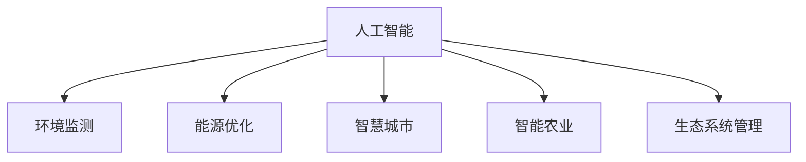

                 

# 人工智能在气候变化和可持续发展中的应用

> 关键词：人工智能,气候变化,可持续发展,环境监测,能源优化,智慧城市,智能农业,生态系统管理

## 1. 背景介绍

### 1.1 问题由来
随着全球气候变化的加剧，环境问题已经成为人类面临的重大挑战。气候变化导致极端天气事件频发、生物多样性锐减、水资源短缺等，严重威胁着地球的生态系统和人类的生存发展。与此同时，全球资源能源短缺、人口增长、城市化进程加速等问题也愈发严峻，对可持续发展提出了更高的要求。

人工智能（AI）作为当今技术领域的重要突破，通过其强大的计算能力、数据处理能力和模型学习能力，为应对气候变化和推动可持续发展提供了全新的工具和手段。AI技术能够从海量数据中提取出隐含的模式和规律，辅助决策者制定更加科学合理的策略。

### 1.2 问题核心关键点
人工智能在气候变化和可持续发展中的应用，主要集中在以下几个方面：
1. **环境监测和预测**：通过AI模型实时监测环境指标，预测未来气候变化趋势。
2. **能源优化**：利用AI优化能源使用和分配，提高能源利用效率，减少碳排放。
3. **智慧城市管理**：通过AI技术构建智能城市，提高城市运行效率，减少资源浪费。
4. **智能农业**：借助AI技术提升农业生产效率，减少资源消耗，促进农业可持续发展。
5. **生态系统管理**：AI模型可用于生态系统监测、物种保护和自然灾害预警等。

### 1.3 问题研究意义
利用人工智能技术应对气候变化和推动可持续发展，具有以下重要意义：
1. **提高决策效率和精度**：AI技术能够处理大量复杂数据，辅助决策者快速分析问题，制定有效策略。
2. **实现资源优化配置**：AI技术能优化能源、水资源等资源配置，减少浪费，提高利用效率。
3. **促进绿色技术创新**：AI在环境监测、能源管理等方面的应用，推动了新材料、新工艺、新能源等绿色技术的创新和应用。
4. **构建智能生态系统**：AI技术在生态系统管理中的应用，有助于构建更加智能、健康的生态系统。
5. **提升公众参与度**：AI在环境教育、科普等方面的应用，提高了公众对气候变化和可持续发展的认知和参与度。

## 2. 核心概念与联系

### 2.1 核心概念概述

为更好地理解人工智能在气候变化和可持续发展中的应用，本节将介绍几个密切相关的核心概念：

- **人工智能(AI)**：利用计算机模拟人脑智能过程，包括感知、学习、推理、决策等能力。AI通过算法和模型，从数据中学习知识，解决复杂问题。

- **环境监测**：通过传感器、卫星等技术手段，实时监测大气、水质、土壤等环境指标，为环境管理和决策提供数据支持。

- **能源优化**：利用AI技术优化能源的使用和分配，提高能源利用效率，减少碳排放。

- **智慧城市**：基于物联网、大数据、AI等技术，构建智能化的城市管理系统，提高城市运行效率，减少资源浪费。

- **智能农业**：通过AI技术提升农业生产效率，减少资源消耗，推动农业可持续发展。

- **生态系统管理**：利用AI模型对生态系统进行监测、分析和预测，辅助制定保护措施，促进生态系统健康。

这些核心概念之间的逻辑关系可以通过以下Mermaid流程图来展示：



这个流程图展示了一个典型的AI应用场景，即AI技术通过环境监测、能源优化、智慧城市管理、智能农业和生态系统管理等环节，辅助解决气候变化和可持续发展问题。

## 3. 核心算法原理 & 具体操作步骤
### 3.1 算法原理概述

人工智能在气候变化和可持续发展中的应用，本质上是利用AI算法和模型处理和分析大量环境数据，提取关键信息，辅助制定决策方案的过程。具体而言，主要包括以下几个步骤：

1. **数据收集与预处理**：收集环境监测数据、能源使用数据、城市运行数据、农业生产数据、生态系统数据等，并进行清洗、标注和标准化。

2. **模型训练与优化**：选择合适的AI模型（如深度学习、强化学习、优化算法等），利用历史数据进行训练和调优，得到高效的模型。

3. **模型应用与验证**：将训练好的模型应用到实际环境，进行实时监测和预测，评估模型效果，不断优化和迭代。

### 3.2 算法步骤详解

以下是基于深度学习模型的环境监测和预测的具体步骤：

1. **数据收集**：利用卫星、地面监测站、传感器等技术手段，收集大气、水质、土壤等环境指标数据。

2. **数据预处理**：清洗数据，处理缺失值、异常值，进行归一化、标准化等预处理，将数据转换为模型所需的格式。

3. **模型选择**：选择合适的深度学习模型，如卷积神经网络（CNN）、长短期记忆网络（LSTM）、注意力机制（Attention）等，用于环境监测和预测。

4. **模型训练**：使用历史环境数据对模型进行训练，调整模型参数，最小化预测误差。

5. **模型评估**：在验证集上对模型进行评估，计算预测精度、召回率、F1分数等指标，评估模型性能。

6. **模型应用**：将训练好的模型应用到实时环境数据，进行实时监测和预测。

### 3.3 算法优缺点

基于深度学习模型的环境监测和预测，具有以下优点：
1. **高精度预测**：深度学习模型能处理大量复杂数据，提取隐含模式，实现高精度预测。
2. **实时监测**：模型可以在线处理实时数据，实现实时环境监测和预警。
3. **自我优化**：模型通过不断学习新数据，自我优化性能，适应环境变化。

同时，也存在一些局限性：
1. **数据依赖**：模型性能依赖于数据质量和数量，数据不充分可能影响预测效果。
2. **计算资源需求**：深度学习模型通常需要较大的计算资源和存储空间，成本较高。
3. **模型复杂性**：模型结构复杂，需要大量的实验和调试才能优化，对开发者要求较高。

### 3.4 算法应用领域

深度学习在环境监测和预测中的应用，已覆盖了多个领域，如：

- **气候变化预测**：利用气候模型预测未来气候变化趋势，为政策制定提供科学依据。
- **水质监测**：通过深度学习模型监测水质指标，及时发现污染源，进行治理。
- **空气质量预测**：预测未来空气质量，指导公众健康防护措施。
- **生态系统监测**：监测生物多样性变化，评估生态系统健康状况。
- **灾害预警**：利用深度学习模型进行自然灾害预警，减少灾害损失。

除了深度学习，其他AI技术也在环境监测和预测中发挥了重要作用：

- **强化学习**：通过模拟训练，优化能源管理和智能城市运行策略，提高资源利用效率。
- **优化算法**：如遗传算法、粒子群算法等，用于求解复杂的资源配置问题，实现高效优化。
- **专家系统**：结合领域知识和AI技术，构建智能决策系统，提供专业化的解决方案。

## 4. 数学模型和公式 & 详细讲解 & 举例说明
### 4.1 数学模型构建

以下是一个简单的环境监测模型的数学模型构建过程。

假设环境监测数据为 $X=(x_1, x_2, ..., x_n)$，其中 $x_i$ 表示第 $i$ 个监测指标。目标预测环境指标 $Y=(y_1, y_2, ..., y_m)$，其中 $y_i$ 表示第 $i$ 个预测指标。

使用深度学习模型 $f$ 进行环境监测，模型的输出为 $\hat{Y}=f(X)$。模型损失函数为 $L(Y, \hat{Y})$，常用的损失函数包括均方误差损失（MSE）、交叉熵损失（CE）等。

具体模型构建步骤如下：

1. **输入数据**：将环境监测数据 $X$ 输入模型 $f$。
2. **模型前向传播**：模型进行前向传播，得到预测结果 $\hat{Y}$。
3. **损失计算**：计算预测结果与真实标签之间的损失 $L(Y, \hat{Y})$。
4. **反向传播**：根据损失函数计算梯度，更新模型参数。
5. **模型输出**：输出最终预测结果。

### 4.2 公式推导过程

以均方误差损失函数为例，其推导过程如下：

设 $X=(x_1, x_2, ..., x_n)$，$Y=(y_1, y_2, ..., y_m)$，$\hat{Y}=f(X)$，则均方误差损失函数 $L(Y, \hat{Y})$ 定义为：

$$
L(Y, \hat{Y}) = \frac{1}{2} \sum_{i=1}^m (y_i - \hat{y}_i)^2
$$

其中 $\hat{y}_i$ 表示模型预测结果的第 $i$ 个指标。

### 4.3 案例分析与讲解

以水质监测为例，假设输入数据为水温、pH值、溶解氧等指标，目标预测指标为水质污染程度。

首先，收集历史水质数据，将其分为训练集和验证集。使用深度学习模型（如LSTM）对训练集进行训练，得到预测模型。然后，在验证集上评估模型性能，使用均方误差损失函数计算预测误差，不断调整模型参数，优化模型性能。最后，将训练好的模型应用到实时水质数据，进行实时水质监测和预警。

## 5. 项目实践：代码实例和详细解释说明
### 5.1 开发环境搭建

在进行项目实践前，我们需要准备好开发环境。以下是使用Python进行深度学习开发的环境配置流程：

1. 安装Anaconda：从官网下载并安装Anaconda，用于创建独立的Python环境。

2. 创建并激活虚拟环境：
```bash
conda create -n env_name python=3.8 
conda activate env_name
```

3. 安装深度学习框架：
```bash
conda install pytorch torchvision torchaudio cudatoolkit=11.1 -c pytorch -c conda-forge
```

4. 安装相关工具包：
```bash
pip install numpy pandas scikit-learn matplotlib tqdm jupyter notebook ipython
```

完成上述步骤后，即可在虚拟环境中开始项目实践。

### 5.2 源代码详细实现

以下是一个使用LSTM模型进行水质监测的PyTorch代码实现。

```python
import torch
import torch.nn as nn
import torch.optim as optim
import torch.utils.data as Data

# 定义LSTM模型
class LSTM(nn.Module):
    def __init__(self, input_size, hidden_size, output_size):
        super(LSTM, self).__init__()
        self.hidden_size = hidden_size
        self.lstm = nn.LSTM(input_size, hidden_size)
        self.fc = nn.Linear(hidden_size, output_size)
        
    def forward(self, x, hx=None):
        if hx is None:
            h0 = torch.zeros(1, x.size(0), self.hidden_size).to(device)
            c0 = torch.zeros(1, x.size(0), self.hidden_size).to(device)
            hx = (h0, c0)
        
        out, (hn, cn) = self.lstm(x, hx)
        out = self.fc(out[:, -1, :])
        return out, hx

# 加载数据
class WaterQualityDataset(Data.Dataset):
    def __init__(self, data):
        self.data = data
        self.num_features = len(data[0])
        self.num_samples = len(data)
        
    def __len__(self):
        return self.num_samples
    
    def __getitem__(self, idx):
        sample = self.data[idx]
        x = torch.tensor(sample[:-1]).float().to(device)
        y = torch.tensor(sample[-1]).float().to(device)
        return x, y

# 定义模型和优化器
model = LSTM(input_size, hidden_size, output_size)
optimizer = optim.Adam(model.parameters(), lr=0.001)

# 训练模型
device = torch.device('cuda' if torch.cuda.is_available() else 'cpu')
model.to(device)

for epoch in range(num_epochs):
    for i, (x, y) in enumerate(train_loader):
        x = x.to(device)
        y = y.to(device)
        output, _ = model(x)
        loss = nn.MSELoss()(output, y)
        optimizer.zero_grad()
        loss.backward()
        optimizer.step()
```

### 5.3 代码解读与分析

让我们再详细解读一下关键代码的实现细节：

**LSTM模型**：
- 定义了LSTM模型结构，包括LSTM层和线性层。LSTM层负责处理时间序列数据，线性层将LSTM层的输出转换为预测结果。
- `forward`方法中，如果隐状态 `hx` 为空，则初始化隐状态和细胞状态；否则，继续使用已有的隐状态和细胞状态进行计算。

**WaterQualityDataset类**：
- 定义了一个数据集类，用于加载水质监测数据。将数据集分为输入特征 `x` 和输出标签 `y`，并返回一个包含 `x` 和 `y` 的Tensor对象。

**模型训练**：
- 使用Adam优化器对模型进行训练。在每个epoch中，对训练集数据进行迭代，计算损失并更新模型参数。

## 6. 实际应用场景
### 6.1 环境监测

在环境监测领域，深度学习模型广泛应用于空气质量监测、水质监测、土壤污染监测等。这些模型能够实时监测环境指标，发现污染源，并进行预警。

以水质监测为例，深度学习模型可以监测水中的氮、磷等污染物浓度，预测水质变化趋势，辅助水务部门进行水质管理。模型通过实时监测站采集的水质数据进行训练，逐步提升预测精度。在预测结果超出正常范围时，系统会触发警报，及时通知相关部门进行处理。

### 6.2 能源优化

在能源优化领域，深度学习模型用于优化能源使用和分配，提高能源利用效率，减少碳排放。

例如，在智能电网中，深度学习模型可以优化电力负荷分配，预测电力需求，减少电网损耗。通过实时监测用户用电情况，预测电力负荷峰值，自动调整电力供应，优化电网运行效率。此外，深度学习模型还可以用于智能建筑的能源管理，优化供暖、制冷、照明等系统的运行，减少能源消耗。

### 6.3 智慧城市管理

智慧城市是未来城市发展的重要方向。深度学习模型在智慧城市管理中发挥了重要作用，如交通管理、环境监测、应急响应等。

以交通管理为例，深度学习模型可以实时监测交通流量，预测拥堵情况，优化交通信号灯控制，减少交通拥堵。模型通过传感器和摄像头采集的交通数据进行训练，逐步提升预测精度。在预测到拥堵情况时，系统会动态调整信号灯控制策略，缓解交通压力。

### 6.4 智能农业

智能农业是现代农业发展的重要方向。深度学习模型在智能农业中用于作物监测、病虫害预测、农业机器人控制等。

例如，在作物监测中，深度学习模型可以监测作物的生长情况，预测病虫害发生，辅助农民及时采取防治措施。模型通过无人机和传感器采集的农作物数据进行训练，逐步提升预测精度。在预测到病虫害发生时，系统会及时发出警报，指导农民进行防治。

### 6.5 生态系统管理

深度学习模型在生态系统管理中的应用包括物种监测、生态系统健康评估等。

例如，在物种监测中，深度学习模型可以监测野生动物种群数量，评估生态系统健康状况。模型通过摄像头和传感器采集的生态数据进行训练，逐步提升监测精度。在监测到野生动物种群数量异常时，系统会及时发出警报，辅助生态保护部门采取保护措施。

## 7. 工具和资源推荐
### 7.1 学习资源推荐

为了帮助开发者系统掌握AI在气候变化和可持续发展中的应用，这里推荐一些优质的学习资源：

1. **深度学习框架官方文档**：如PyTorch、TensorFlow等深度学习框架的官方文档，提供了丰富的学习资源和样例代码。

2. **在线课程**：如Coursera、Udacity等平台上的深度学习课程，系统讲解深度学习理论和实践。

3. **开源项目**：如CLUE、TensorFlow Model Garden等开源项目，提供了丰富的环境监测和能源优化的深度学习模型和代码实现。

4. **学术论文**：如JMLR、IEEE Transactions on Neural Networks and Learning Systems等期刊上的相关论文，提供了最新的研究进展和前沿技术。

通过这些学习资源的学习实践，相信你一定能够快速掌握AI在气候变化和可持续发展中的应用，并用于解决实际的环保问题。

### 7.2 开发工具推荐

高效的开发离不开优秀的工具支持。以下是几款用于AI在环境监测和可持续发展中应用开发的常用工具：

1. **深度学习框架**：如PyTorch、TensorFlow等深度学习框架，支持丰富的深度学习模型和算法，适用于各种复杂的深度学习任务。

2. **数据可视化工具**：如Tableau、Matplotlib等工具，用于数据可视化和模型评估，帮助开发者快速理解数据和模型性能。

3. **在线协作平台**：如Jupyter Notebook、Google Colab等平台，方便开发者在云端进行协作开发和数据处理。

4. **模型训练加速工具**：如TensorFlow、PyTorch等框架提供了GPU/TPU等加速工具，加速模型训练和推理过程。

5. **自动机器学习工具**：如AutoML、Scikit-Learn等工具，自动完成模型选择、超参数优化等任务，降低模型开发难度。

合理利用这些工具，可以显著提升AI在环境监测和可持续发展中的应用开发效率，加快创新迭代的步伐。

### 7.3 相关论文推荐

AI在环境监测和可持续发展中的应用，近年来已成为研究热点。以下是几篇奠基性的相关论文，推荐阅读：

1. **《Air Quality Prediction Using Convolutional Neural Networks》**：介绍了使用卷积神经网络进行空气质量预测的方法，具有较高的准确率和实时性。

2. **《Water Quality Monitoring Using Deep Learning》**：讨论了使用深度学习模型进行水质监测的实现方法和应用效果，提供了丰富的案例和数据支持。

3. **《Energy Optimization Using Deep Reinforcement Learning》**：研究了使用深度强化学习进行能源优化的方法，具有较好的资源利用效率和鲁棒性。

4. **《Sustainable Agriculture Using AI》**：探讨了使用AI技术进行智能农业管理的实现方法，提供了多种模型和算法选择。

5. **《Ecosystem Health Assessment Using AI》**：介绍了使用AI模型进行生态系统健康评估的方法，具有较高的监测精度和实时性。

这些论文代表了大规模环境监测和能源优化领域的研究进展，通过学习这些前沿成果，可以帮助研究者把握学科前进方向，激发更多的创新灵感。

## 8. 总结：未来发展趋势与挑战
### 8.1 总结

本文对人工智能在气候变化和可持续发展中的应用进行了全面系统的介绍。首先阐述了AI技术在环境监测、能源优化、智慧城市管理、智能农业和生态系统管理等方面的应用背景和意义，明确了AI技术在解决气候变化和推动可持续发展中的重要作用。其次，从原理到实践，详细讲解了深度学习模型的构建和应用，给出了完整的代码实例。同时，本文还广泛探讨了AI技术在多个行业领域的应用前景，展示了AI技术的巨大潜力。

通过本文的系统梳理，可以看到，AI技术在环境监测和可持续发展中的应用已经取得了显著成果，但在迈向更加智能化、普适化应用的过程中，仍面临着诸多挑战：

### 8.2 未来发展趋势

展望未来，AI在环境监测和可持续发展中的应用将呈现以下几个发展趋势：

1. **模型规模不断增大**：随着计算能力的提升和数据量的增加，深度学习模型将变得更加复杂和高效。超大规模模型能够更好地捕捉数据中的复杂关系，实现更高精度的预测和优化。

2. **数据融合和协同应用**：未来AI应用将更加注重多源数据融合和协同应用。通过融合多源数据，可以提升模型的泛化能力和鲁棒性，实现更加智能和全面的环境监测和优化。

3. **自适应和学习机制**：未来AI模型将具备更强的自适应和学习能力，能够根据环境变化和数据分布进行自我优化和更新。

4. **模型解释性和透明性**：为满足监管和伦理要求，未来的AI模型将更加注重可解释性和透明性，提供更加明确和可理解的系统输出。

5. **跨学科应用**：AI技术将在更多学科中得到应用，如环境科学、经济学、社会学等，促进跨学科融合，推动可持续发展。

### 8.3 面临的挑战

尽管AI在环境监测和可持续发展中的应用取得了显著进展，但在迈向更加智能化、普适化应用的过程中，仍面临以下挑战：

1. **数据质量和多样性**：高质量、多样化的数据是AI应用的前提，但环境监测数据往往存在缺失、噪声和异构性，需要进一步清洗和处理。

2. **模型复杂性和可解释性**：深度学习模型结构复杂，难以解释和理解，对模型的可解释性和透明性要求较高。

3. **资源和计算成本**：深度学习模型需要大量的计算资源和存储空间，成本较高，需要进一步优化和简化。

4. **环境复杂性和动态性**：环境数据具有复杂性和动态性，难以用单一模型进行全面描述，需要多种模型和算法相结合，动态调整策略。

5. **伦理和社会影响**：AI技术的应用可能带来隐私、安全、公平等问题，需要制定相应的伦理规范和监管措施。

### 8.4 研究展望

面对AI在环境监测和可持续发展中面临的挑战，未来的研究需要在以下几个方面寻求新的突破：

1. **数据预处理和增强**：开发高效的数据预处理和增强方法，提升数据质量和多样性，增强模型的泛化能力。

2. **模型简化和优化**：开发更加轻量级和高效的模型，降低计算成本，提高模型部署和应用的效率。

3. **模型解释和透明性**：研究模型解释和透明性技术，提供更加可理解的系统输出，增强模型的可信度和可接受性。

4. **跨学科融合**：推动AI技术与环境科学、经济学、社会学等多学科的融合，实现更全面、更智能的环境监测和优化。

5. **伦理和社会影响评估**：研究AI技术的伦理和社会影响，制定相应的伦理规范和监管措施，确保AI技术的应用符合社会价值和道德标准。

这些研究方向的探索，必将引领AI在环境监测和可持续发展中的应用迈向更高的台阶，为构建智能、绿色、可持续的未来社会提供有力支持。

## 9. 附录：常见问题与解答
### 9.1 Q1: 如何使用AI进行环境监测？

A: AI可以通过深度学习模型进行环境监测。首先，收集环境监测数据，并将其分为训练集和验证集。然后使用深度学习模型（如卷积神经网络、长短期记忆网络等）对训练集进行训练，得到预测模型。在验证集上评估模型性能，不断调整模型参数，优化模型性能。最后，将训练好的模型应用到实时环境数据，进行实时监测和预警。

### 9.2 Q2: AI在能源优化中的应用有哪些？

A: AI在能源优化中的应用包括智能电网优化、智能建筑能源管理等。例如，在智能电网中，深度学习模型可以优化电力负荷分配，预测电力需求，减少电网损耗。通过实时监测用户用电情况，预测电力负荷峰值，自动调整电力供应，优化电网运行效率。此外，深度学习模型还可以用于智能建筑的能源管理，优化供暖、制冷、照明等系统的运行，减少能源消耗。

### 9.3 Q3: AI在智慧城市管理中的应用有哪些？

A: AI在智慧城市管理中的应用包括交通管理、环境监测、应急响应等。例如，在交通管理中，深度学习模型可以实时监测交通流量，预测拥堵情况，优化交通信号灯控制，减少交通拥堵。模型通过传感器和摄像头采集的交通数据进行训练，逐步提升预测精度。在预测到拥堵情况时，系统会动态调整信号灯控制策略，缓解交通压力。

### 9.4 Q4: AI在智能农业中的应用有哪些？

A: AI在智能农业中的应用包括作物监测、病虫害预测、农业机器人控制等。例如，在作物监测中，深度学习模型可以监测作物的生长情况，预测病虫害发生，辅助农民及时采取防治措施。模型通过无人机和传感器采集的农作物数据进行训练，逐步提升预测精度。在预测到病虫害发生时，系统会及时发出警报，指导农民进行防治。

### 9.5 Q5: AI在生态系统管理中的应用有哪些？

A: AI在生态系统管理中的应用包括物种监测、生态系统健康评估等。例如，在物种监测中，深度学习模型可以监测野生动物种群数量，评估生态系统健康状况。模型通过摄像头和传感器采集的生态数据进行训练，逐步提升监测精度。在监测到野生动物种群数量异常时，系统会及时发出警报，辅助生态保护部门采取保护措施。

---

作者：禅与计算机程序设计艺术 / Zen and the Art of Computer Programming

