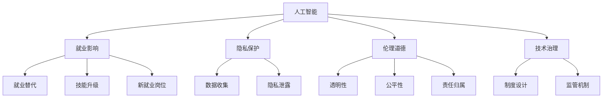

                 

# 人工智能：社会影响与思考

> 关键词：人工智能,社会影响,伦理道德,就业,隐私,技术治理

## 1. 背景介绍

### 1.1 问题由来

人工智能（AI）作为现代科技的重要分支，正在迅速渗透到各行各业，从智能制造、自动驾驶到医疗诊断、金融风控，AI的应用场景已经无所不在。但随着AI技术的普及，其带来的社会影响也日益显著。一方面，AI的引入大幅提升了效率，创造了巨大的经济效益；另一方面，AI技术的推广也带来了就业替代、隐私泄露、伦理道德等一系列社会问题。如何平衡AI的正面和负面影响，使其更好地服务于人类社会，成为当前学术界和产业界共同关注的重大课题。

### 1.2 问题核心关键点

本文将从AI的社会影响入手，深入探讨AI在就业、隐私、伦理道德等方面的影响，并提出相应的对策建议。通过理清AI技术的内在机制与外部效应，希望能为社会各界提供有益的参考，促进AI技术的健康发展。

## 2. 核心概念与联系

### 2.1 核心概念概述

为更深入理解AI的社会影响，首先介绍几个关键概念：

- **人工智能**：指模拟、延伸和扩展人的智能的计算机系统。包括感知、理解、学习、推理、规划、决策、控制、协作、沟通、自然语言处理、视觉识别等能力。

- **就业影响**：AI技术对劳动市场产生的影响，包括自动化替代、技能升级、新就业岗位的创造等。

- **隐私保护**：AI技术对个人隐私的潜在威胁，如数据收集、存储、分析过程中的隐私泄露。

- **伦理道德**：AI系统决策和行动中应遵循的道德准则，如透明性、公平性、责任归属等。

- **技术治理**：对AI技术的开发、应用、监管等过程进行制度设计和机制构建，以保障其良性发展。

这些概念之间的关系可以通过以下Mermaid流程图来展示：



这个流程图展示了AI技术在不同方面的应用和影响，及其与伦理道德、技术治理的密切联系。

## 3. 核心算法原理 & 具体操作步骤

### 3.1 算法原理概述

AI技术基于算法和数据训练模型，通过这些模型来实现对真实世界的模拟和决策。AI算法主要包括监督学习、无监督学习、强化学习等，通过大量数据和计算资源进行模型训练和优化。AI的运行依赖于数据的质量和数量，数据偏差或不足可能导致模型出现偏见或不公平现象。

AI的社会影响主要体现在以下几个方面：

- **就业影响**：自动化技术可能替代部分重复性工作，造成就业市场的结构性变化。但同时也会创造出新的岗位需求，要求劳动力进行技能升级。
- **隐私保护**：AI系统在处理大量数据时，可能引发隐私泄露问题，如个人信息的滥用和侵权。
- **伦理道德**：AI系统在决策过程中可能存在算法偏见，影响公平性和透明性。如何确保AI系统的行为符合伦理道德标准，是技术治理的关键。

### 3.2 算法步骤详解

AI的社会影响评估可以分为以下几个步骤：

1. **数据收集与分析**：收集与AI应用相关的各类数据，包括就业市场数据、隐私数据、伦理案例等，并进行初步分析。
2. **模型训练与评估**：构建AI模型，使用相关数据进行训练和评估，识别AI在就业、隐私、伦理等方面的潜在影响。
3. **政策制定与实施**：基于模型评估结果，制定相应的政策措施，并通过法规、标准、指导文件等形式进行实施。
4. **效果监测与反馈**：对政策实施效果进行监测，收集反馈信息，不断调整和优化政策，确保其有效性。

### 3.3 算法优缺点

AI技术在提升社会效率和创造经济效益的同时，也存在以下缺点：

**优点**：

- 提高生产效率：通过自动化和智能化，大幅提升生产力和质量。
- 创造新价值：通过数据驱动决策，发现新的市场机会和商业模式。
- 促进社会创新：推动各行业的创新发展，促进科技进步。

**缺点**：

- 就业替代：自动化技术可能导致某些岗位的消失，造成结构性失业。
- 隐私泄露：AI系统对大量数据的处理可能引发隐私问题，数据滥用风险增加。
- 伦理道德：AI决策过程可能存在算法偏见，影响社会公平。

### 3.4 算法应用领域

AI技术在多个领域的应用已经产生了深远的社会影响：

- **医疗**：AI辅助诊断、个性化治疗等，提高了医疗效率和精度，但同时也对医生的工作方式和医疗伦理提出了挑战。
- **金融**：AI风控、量化交易等，提升了金融服务的智能化水平，但也可能加剧金融市场的风险。
- **教育**：AI辅导、个性化教育等，提供了新的教学手段，但也引发了对教育公平和隐私的担忧。
- **公共安全**：AI在反恐、监控、交通管理中的应用，提高了公共安全水平，但也带来了数据隐私和伦理道德的问题。

## 4. 数学模型和公式 & 详细讲解 & 举例说明

### 4.1 数学模型构建

假设有一个简单的AI决策模型，其输入为 $x$，输出为 $y$。模型的目标是最小化预测误差，即：

$$
\min_{\theta} \frac{1}{n} \sum_{i=1}^n (y_i - f_{\theta}(x_i))^2
$$

其中，$f_{\theta}(x)$ 为模型在参数 $\theta$ 下的预测函数，$y_i$ 为实际输出，$n$ 为样本数量。

### 4.2 公式推导过程

对于线性回归模型，预测函数可表示为：

$$
f_{\theta}(x) = \theta_0 + \theta_1 x_1 + \theta_2 x_2 + \cdots + \theta_n x_n
$$

其中，$\theta_0, \theta_1, \theta_2, \cdots, \theta_n$ 为模型参数。目标函数的梯度为：

$$
\nabla_{\theta} \mathcal{L}(\theta) = \frac{2}{n} \sum_{i=1}^n (y_i - f_{\theta}(x_i)) x_i
$$

利用梯度下降法，更新模型参数的公式为：

$$
\theta \leftarrow \theta - \eta \nabla_{\theta} \mathcal{L}(\theta)
$$

其中，$\eta$ 为学习率。

### 4.3 案例分析与讲解

以AI在医疗领域的应用为例，构建一个简单的医疗诊断模型。假设输入为患者的症状描述 $x$，输出为诊断结果 $y$。模型使用线性回归进行训练，通过最小化误诊率来优化模型参数。

首先，收集大量医疗数据，分为训练集和测试集。对训练集进行特征工程，提取重要特征，如症状、病史等。然后使用训练集训练模型，计算模型在测试集上的误诊率，评估模型性能。

通过不断调整模型参数，优化模型结构，可以实现较高的诊断准确率。但同时也需要注意，模型可能会对某些特定症状出现偏差，影响诊断公平性。因此，需要在模型训练中加入公平性约束，避免算法偏见。

## 5. 项目实践：代码实例和详细解释说明

### 5.1 开发环境搭建

进行AI项目开发，首先需要搭建开发环境。以下是使用Python进行TensorFlow开发的环境配置流程：

1. 安装Anaconda：从官网下载并安装Anaconda，用于创建独立的Python环境。

2. 创建并激活虚拟环境：
```bash
conda create -n ai-env python=3.8 
conda activate ai-env
```

3. 安装TensorFlow：根据CUDA版本，从官网获取对应的安装命令。例如：
```bash
conda install tensorflow -c conda-forge
```

4. 安装各类工具包：
```bash
pip install numpy pandas scikit-learn matplotlib tqdm jupyter notebook ipython
```

完成上述步骤后，即可在`ai-env`环境中开始AI项目开发。

### 5.2 源代码详细实现

下面我们以医疗诊断为例，给出使用TensorFlow构建简单线性回归模型的代码实现。

首先，定义数据处理函数：

```python
import numpy as np
import tensorflow as tf

def load_data(filename):
    data = np.loadtxt(filename, delimiter=',')
    x = data[:, :-1]
    y = data[:, -1]
    return x, y

def train_test_split(x, y, test_size=0.2):
    np.random.seed(0)
    indices = np.random.permutation(len(x))
    split_idx = int(len(x) * test_size)
    x_train = x[indices[:split_idx]]
    x_test = x[indices[split_idx:]]
    y_train = y[indices[:split_idx]]
    y_test = y[indices[split_idx:]]
    return x_train, x_test, y_train, y_test

def train_model(x_train, y_train, x_test, y_test, learning_rate=0.01, epochs=100):
    x_train = np.array(x_train, dtype=np.float32)
    y_train = np.array(y_train, dtype=np.float32)
    x_test = np.array(x_test, dtype=np.float32)
    y_test = np.array(y_test, dtype=np.float32)
    
    with tf.Session() as sess:
        x = tf.placeholder(tf.float32, shape=[None, len(x_train[0])])
        y = tf.placeholder(tf.float32, shape=[None])
        w = tf.Variable(tf.random_normal([len(x_train[0]), 1]))
        b = tf.Variable(tf.random_normal([1]))
        y_pred = tf.matmul(x, w) + b
        
        loss = tf.reduce_mean(tf.square(y_pred - y))
        optimizer = tf.train.GradientDescentOptimizer(learning_rate).minimize(loss)
        
        sess.run(tf.global_variables_initializer())
        
        for epoch in range(epochs):
            _, loss_val = sess.run([optimizer, loss], feed_dict={x: x_train, y: y_train})
            if epoch % 10 == 0:
                test_loss = sess.run(loss, feed_dict={x: x_test, y: y_test})
                print(f"Epoch {epoch+1}, train loss: {loss_val:.4f}, test loss: {test_loss:.4f}")
```

然后，定义训练和评估函数：

```python
def evaluate_model(x_test, y_test):
    with tf.Session() as sess:
        x = tf.placeholder(tf.float32, shape=[None, len(x_train[0])])
        y = tf.placeholder(tf.float32, shape=[None])
        w = tf.Variable(tf.random_normal([len(x_train[0]), 1]))
        b = tf.Variable(tf.random_normal([1]))
        y_pred = tf.matmul(x, w) + b
        
        loss = tf.reduce_mean(tf.square(y_pred - y))
        test_loss = sess.run(loss, feed_dict={x: x_test, y: y_test})
        print(f"Test loss: {test_loss:.4f}")
```

最后，启动训练流程并在测试集上评估：

```python
x_train, x_test, y_train, y_test = train_test_split(*load_data('data.txt'))
train_model(x_train, y_train, x_test, y_test)

evaluate_model(x_test, y_test)
```

以上就是使用TensorFlow对医疗诊断数据进行简单线性回归模型微调的完整代码实现。可以看到，TensorFlow提供了强大的计算图和自动微分功能，使得模型训练和评估变得简单高效。

### 5.3 代码解读与分析

让我们再详细解读一下关键代码的实现细节：

**load_data函数**：
- 读取数据文件，将其转换为NumPy数组。

**train_test_split函数**：
- 对数据进行随机打乱，分割为训练集和测试集。

**train_model函数**：
- 定义输入和输出占位符，构建线性回归模型。
- 定义损失函数和优化器，进行梯度下降训练。
- 在每个epoch输出训练损失和测试损失，以便监测模型训练情况。

**evaluate_model函数**：
- 使用测试集数据评估模型性能，输出测试损失。

通过这段代码，可以直观地理解TensorFlow进行线性回归模型训练的基本流程。

## 6. 实际应用场景

### 6.1 智慧医疗

AI在医疗领域的应用已经初见成效，如AI辅助诊断、个性化治疗、药物研发等。通过AI技术，可以大幅提升医疗服务的智能化水平，缩短诊疗时间，降低误诊率。

但在实际应用中，AI的伦理道德问题也日益凸显。如算法偏见可能导致某些群体的误诊率增加，隐私泄露可能带来数据滥用风险。因此，在AI医疗应用中，必须严格遵循伦理道德准则，确保算法公平性和数据安全性。

### 6.2 智能制造

AI技术在智能制造领域的应用同样广泛，如工业机器人自动化、供应链优化、质量检测等。通过AI技术，可以提升生产效率和产品质量，降低成本。

然而，AI在制造领域的应用也引发了对就业的影响。一些重复性工作可能被自动化取代，导致工人失业。因此，需要结合技能培训和职业转型，帮助工人适应新岗位需求，实现平稳过渡。

### 6.3 金融风控

AI在金融风控中的应用主要集中在风险评估、欺诈检测、信用评分等方面。通过AI技术，可以实时监测交易行为，提前识别潜在风险，提高金融系统的安全性。

但AI在金融风控中的过度依赖，也可能带来伦理道德问题。如AI在信贷评估中可能存在算法偏见，影响公平性。因此，需要建立健全的AI治理机制，确保AI决策的透明性和公平性。

## 7. 工具和资源推荐

### 7.1 学习资源推荐

为了帮助开发者系统掌握AI技术，这里推荐一些优质的学习资源：

1. 《深度学习》系列书籍：由多位AI领域专家联合撰写，系统介绍了深度学习的基本原理和算法。

2. 《机器学习实战》：通过多个实际项目案例，介绍了机器学习的基本流程和常用算法。

3. TensorFlow官方文档：提供了完整的TensorFlow学习指南和API文档，是学习TensorFlow的重要资源。

4. Kaggle竞赛平台：通过参加各类数据科学竞赛，实践AI技术，积累经验。

5. Coursera机器学习课程：斯坦福大学提供的免费在线课程，涵盖了机器学习的基本概念和常用算法。

通过对这些资源的学习实践，相信你一定能够快速掌握AI技术的精髓，并用于解决实际的AI问题。

### 7.2 开发工具推荐

高效的开发离不开优秀的工具支持。以下是几款用于AI开发常用的工具：

1. TensorFlow：基于Python的开源深度学习框架，提供了强大的计算图和自动微分功能，适合快速迭代研究。

2. PyTorch：基于Python的深度学习框架，支持动态计算图和GPU加速，适合研究人员使用。

3. Scikit-learn：基于Python的机器学习库，提供了多种常用算法的实现，适合数据科学家使用。

4. Weights & Biases：模型训练的实验跟踪工具，可以记录和可视化模型训练过程中的各项指标，方便对比和调优。

5. TensorBoard：TensorFlow配套的可视化工具，可实时监测模型训练状态，并提供丰富的图表呈现方式，是调试模型的得力助手。

6. Jupyter Notebook：轻量级的交互式编程环境，支持多种编程语言和库，是数据科学家常用的开发工具。

合理利用这些工具，可以显著提升AI项目开发的效率，加快创新迭代的步伐。

### 7.3 相关论文推荐

AI技术的发展源于学界的持续研究。以下是几篇奠基性的相关论文，推荐阅读：

1. AlphaGo论文：DeepMind在《自然》杂志上发表的AlphaGo战胜围棋世界冠军的论文，展示了深度学习在复杂决策问题上的巨大潜力。

2. GAN论文：Ian Goodfellow等人在《生成对抗网络》论文中提出的生成对抗网络（GAN）算法，是生成模型领域的里程碑工作。

3. Transformer论文：Attention机制的提出，是神经网络领域的一次重大突破，奠定了大语言模型的基础。

4. 数据驱动的伦理研究论文：如David Dang paper《Data, Algorithms and Ethics》，探讨了数据驱动决策中的伦理问题，强调了数据来源和算法透明性的重要性。

这些论文代表了大AI技术的发展脉络。通过学习这些前沿成果，可以帮助研究者把握学科前进方向，激发更多的创新灵感。

## 8. 总结：未来发展趋势与挑战

### 8.1 总结

本文从AI技术的内在机制出发，探讨了AI在就业、隐私、伦理道德等方面的社会影响。通过理清AI技术的内在机制与外部效应，希望能为社会各界提供有益的参考，促进AI技术的健康发展。

### 8.2 未来发展趋势

展望未来，AI技术的发展趋势如下：

1. 自动化与智能化融合：AI将更加智能化，能够理解复杂的自然语言和情感，提供更加个性化和人性化的服务。
2. 多模态融合：AI将融合视觉、语音、文本等多种模态数据，实现跨领域智能交互。
3. 伦理道德重视：AI技术的发展将更加注重伦理道德，确保其公平性、透明性和安全性。
4. 数据驱动决策：AI将更多地依赖数据驱动决策，通过不断学习，提升决策的准确性和稳定性。

### 8.3 面临的挑战

尽管AI技术在许多领域取得了显著成果，但也面临诸多挑战：

1. 算法偏见：AI系统可能存在算法偏见，影响公平性。如何解决算法偏见问题，确保AI系统的公正性，是当前的研究热点。
2. 数据隐私：AI系统需要大量数据进行训练，如何保护用户隐私，防止数据滥用，是重要的技术难题。
3. 伦理道德：AI系统的决策过程缺乏透明度，可能导致伦理道德问题。如何确保AI系统的决策透明性和可解释性，是技术治理的关键。
4. 安全性：AI系统可能存在安全漏洞，如对抗样本攻击，如何增强AI系统的鲁棒性，是未来的研究重点。

### 8.4 研究展望

面对AI技术面临的挑战，未来的研究需要在以下几个方面寻求新的突破：

1. 算法公平性研究：开发更公平、更透明的算法，消除算法偏见，提升AI系统的公正性。
2. 数据隐私保护：研究隐私保护技术，如差分隐私、联邦学习等，确保用户数据的安全性和隐私性。
3. 伦理道德规范：制定伦理道德规范和标准，建立AI系统的伦理审核机制，确保其行为符合人类价值观和伦理道德。
4. 安全性提升：研究抗攻击技术，如对抗样本防御、鲁棒性提升等，确保AI系统的安全性。

这些研究方向的探索，必将引领AI技术迈向更高的台阶，为构建安全、可靠、可解释、可控的智能系统铺平道路。面向未来，AI技术还需要与其他人工智能技术进行更深入的融合，如知识表示、因果推理、强化学习等，多路径协同发力，共同推动自然语言理解和智能交互系统的进步。只有勇于创新、敢于突破，才能不断拓展AI技术的边界，让智能技术更好地造福人类社会。

## 9. 附录：常见问题与解答

**Q1：AI技术在就业市场会产生哪些影响？**

A: AI技术在就业市场的影响主要体现在自动化替代和技能升级两个方面：

1. **自动化替代**：AI技术可以自动完成重复性、标准化程度高的工作，如数据录入、文档审核等，可能导致这些岗位的消失。

2. **技能升级**：AI技术需要大量数据和计算资源进行训练，需要专业人员进行维护和优化。因此，技能要求更高的岗位需求会增加，如数据科学家、算法工程师等。

**Q2：AI技术如何影响隐私保护？**

A: AI技术在处理大量数据时，可能引发隐私泄露问题，如数据滥用和侵权。主要影响包括：

1. **数据收集**：AI系统需要收集和处理大量的个人信息，可能导致数据泄露风险增加。

2. **数据存储和分析**：AI系统在处理和分析数据时，可能将敏感信息暴露出来，增加隐私泄露风险。

3. **数据共享**：AI系统可能将数据共享给第三方，导致用户隐私被滥用。

**Q3：如何确保AI系统的公平性和透明性？**

A: 确保AI系统的公平性和透明性，需要从数据和算法两个方面进行改进：

1. **数据公平性**：使用多样化和代表性的数据集进行训练，避免数据偏见。使用公平性评估指标，如平衡性、代表性等，确保数据集的公平性。

2. **算法透明性**：使用可解释性模型，如决策树、线性回归等，提高模型的透明性。使用可视化工具，如LIME、SHAP等，对模型进行可视化解释。

3. **公平性约束**：在模型训练中加入公平性约束，如公平性损失函数，防止算法偏见。

**Q4：AI技术在医疗领域有哪些应用？**

A: AI技术在医疗领域的应用包括：

1. **辅助诊断**：使用AI技术对医学影像、病历等进行分析和诊断，提高诊断准确率。

2. **个性化治疗**：使用AI技术对患者进行个性化治疗方案制定，提高治疗效果。

3. **药物研发**：使用AI技术对药物分子进行模拟和筛选，加速新药研发进程。

4. **健康监测**：使用AI技术对患者健康数据进行分析和监测，预测疾病风险。

**Q5：AI技术在智能制造中的应用有哪些？**

A: AI技术在智能制造中的应用包括：

1. **工业机器人自动化**：使用AI技术对工业机器人进行智能控制，提高生产效率和精度。

2. **供应链优化**：使用AI技术对供应链进行优化管理，提高物流效率和资源利用率。

3. **质量检测**：使用AI技术对产品质量进行智能检测，提高检测准确率和效率。

4. **预测维护**：使用AI技术对设备进行故障预测和维护，降低停机时间和维护成本。

**Q6：AI技术在金融风控中的应用有哪些？**

A: AI技术在金融风控中的应用包括：

1. **风险评估**：使用AI技术对金融交易行为进行风险评估，识别潜在风险。

2. **欺诈检测**：使用AI技术对金融欺诈行为进行识别和预防，提高安全性。

3. **信用评分**：使用AI技术对借款人进行信用评分，提高信贷决策的准确性。

4. **市场预测**：使用AI技术对金融市场进行预测分析，提供决策支持。

通过本文的系统梳理，可以看到，AI技术在各领域的应用已经深入人心，其带来的社会影响也日益显著。为了确保AI技术的健康发展，社会各界需要共同努力，从数据、算法、伦理道德等方面进行全面优化，才能让AI技术更好地服务于人类社会。

---

作者：禅与计算机程序设计艺术 / Zen and the Art of Computer Programming

