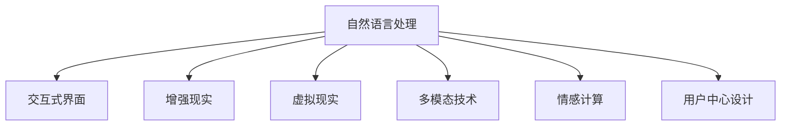

                 

# 人机交互：未来趋势与展望

> 关键词：人机交互, 自然语言处理(NLP), 交互式界面, 增强现实(AR), 虚拟现实(VR), 多模态技术, 用户界面(UI)设计, 机器学习

## 1. 背景介绍

### 1.1 问题由来
随着技术的快速发展，人机交互领域正经历着前所未有的变革。从传统的键盘鼠标，到触摸屏、手势识别，再到如今的自然语言处理(NLP)和虚拟现实(VR)，人机交互的方式不断演进，带来了更加自然、直观和高效的交互体验。但与此同时，也面临着用户界面(UI)设计复杂化、交互体验一致性保持等挑战。

### 1.2 问题核心关键点
本文将聚焦于人机交互的未来趋势和展望，通过分析当前技术进展、剖析未来发展方向，为开发者提供更为深入的技术指引。人机交互的核心关键点包括：

- **自然语言处理(NLP)**：通过语音识别、文本生成等技术，实现人与机器的自然对话。
- **交互式界面(UI)**：设计符合用户直觉的交互流程和UI元素，提升用户体验。
- **增强现实(AR)**：在现实世界叠加虚拟信息，增强互动性和沉浸感。
- **虚拟现实(VR)**：提供沉浸式的交互环境，让用户全方位沉浸其中。
- **多模态技术**：融合视觉、听觉、触觉等多种感官信息，提升交互的自然度。

## 2. 核心概念与联系

### 2.1 核心概念概述

为了更好地理解人机交互的未来发展，我们先来介绍几个核心概念及其相互联系：

- **自然语言处理(NLP)**：通过计算机理解和生成人类语言，实现人机对话。
- **交互式界面(UI)**：通过图形、文本、声音等元素，提供给用户直观的操作界面。
- **增强现实(AR)**：在现实世界基础上叠加虚拟信息，增强用户互动性和沉浸感。
- **虚拟现实(VR)**：完全沉浸式的3D环境，使用户完全置身于虚拟世界中。
- **多模态技术**：将视觉、听觉、触觉等多种感官信息融合，提供更加自然、丰富的交互体验。
- **情感计算**：通过分析用户的情感变化，优化交互体验，提升用户体验。
- **用户中心设计**：以用户需求和体验为出发点，设计符合用户习惯的界面和交互流程。

这些核心概念之间的联系可以通过以下Mermaid流程图来展示：



这个流程图展示了核心概念之间的相互关系：

1. **自然语言处理(NLP)**：作为基础技术，NLP能实现人机自然对话，是其他交互方式的前提。
2. **交互式界面(UI)**：NLP生成的内容需要通过直观的UI展示给用户，提供操作指引。
3. **增强现实(AR)**：在现实环境中叠加虚拟信息，提升互动性和沉浸感，增强用户体验。
4. **虚拟现实(VR)**：提供完全沉浸式的交互环境，提升体验深度。
5. **多模态技术**：融合多种感官信息，提供更加自然、丰富的交互方式。
6. **情感计算**：分析用户情感变化，优化交互体验，提升用户满意度。
7. **用户中心设计**：以用户需求为出发点，设计界面和流程，提升交互效果。

## 3. 核心算法原理 & 具体操作步骤
### 3.1 算法原理概述

人机交互的核心在于如何设计高效、自然的交互方式。其核心算法原理包括自然语言处理(NLP)、交互式界面(UI)设计、多模态技术和情感计算等。

1. **自然语言处理(NLP)**：
   - **语音识别**：通过麦克风输入语音，转换为文本形式。
   - **文本生成**：根据用户输入文本，生成自然语言回复。
   - **语义理解**：理解用户文本的含义，提取关键信息。

2. **交互式界面(UI)**：
   - **响应式设计**：根据用户交互行为，动态更新UI元素。
   - **手势识别**：识别用户手势，控制交互流程。

3. **多模态技术**：
   - **视觉交互**：通过视觉元素引导用户交互。
   - **听觉交互**：通过声音反馈增强交互体验。
   - **触觉交互**：通过物理触觉信息，提供更加沉浸的体验。

4. **情感计算**：
   - **情感识别**：通过面部表情、语音语调分析用户情感。
   - **情感反馈**：根据用户情感调整交互方式，提升用户体验。

### 3.2 算法步骤详解

基于上述核心算法原理，我们现将详细介绍人机交互的具体操作步骤。

1. **需求分析**：
   - 根据用户需求，确定人机交互的目标和场景。
   - 分析用户行为习惯，设计合理的交互流程。

2. **设计原型**：
   - 利用UI设计工具，创建交互原型。
   - 融合NLP、AR、VR等多模态技术，设计自然、沉浸的交互方式。

3. **交互开发**：
   - 实现自然语言处理模块，支持语音输入、文本生成等。
   - 开发交互式界面，支持响应式设计和手势识别。
   - 集成视觉、听觉、触觉等多模态技术，增强互动体验。
   - 实现情感计算模块，分析用户情感并反馈调整交互方式。

4. **测试优化**：
   - 进行用户测试，收集反馈意见。
   - 根据用户反馈，迭代优化UI设计、交互逻辑和情感反馈。

5. **部署上线**：
   - 将原型部署至实际环境中。
   - 收集用户行为数据，持续优化交互体验。

### 3.3 算法优缺点

人机交互技术在提升用户体验方面具有显著优势，但也存在一些缺点：

**优点**：
- **自然性**：通过自然语言处理和情感计算，提供更加自然、亲切的交互方式。
- **沉浸感**：结合增强现实和虚拟现实技术，提供沉浸式的交互体验。
- **多模态融合**：融合视觉、听觉、触觉等多种感官信息，提升交互的自然度。

**缺点**：
- **复杂性**：多模态融合和情感计算等技术实现复杂，对开发者要求较高。
- **成本高**：VR、AR设备成本较高，推广应用难度大。
- **隐私问题**：用户情感数据和个人隐私数据的安全保护难度大。

## 4. 数学模型和公式 & 详细讲解
### 4.1 数学模型构建

人机交互涉及多个领域的数学模型，包括自然语言处理(NLP)、交互式界面(UI)设计、多模态技术和情感计算等。以下分别介绍这些模型的构建方法。

1. **自然语言处理(NLP)**：
   - **语音识别**：基于隐马尔可夫模型(HMM)、深度神经网络(DNN)等模型，将语音信号转换为文本形式。
   - **文本生成**：基于循环神经网络(RNN)、Transformer等模型，根据输入文本生成自然语言回复。
   - **语义理解**：使用BERT、GPT等模型，理解输入文本的语义含义，提取关键信息。

2. **交互式界面(UI)**：
   - **响应式设计**：基于响应式设计原理，动态更新UI元素，适应用户交互行为。
   - **手势识别**：使用卷积神经网络(CNN)、循环神经网络(RNN)等模型，识别用户手势。

3. **多模态技术**：
   - **视觉交互**：基于卷积神经网络(CNN)、图像分割技术，实现视觉元素的生成和识别。
   - **听觉交互**：使用循环神经网络(RNN)、卷积神经网络(CNN)等模型，分析声音特征。
   - **触觉交互**：结合力感知传感器、触觉反馈设备，实现物理触觉信息的采集和反馈。

4. **情感计算**：
   - **情感识别**：使用卷积神经网络(CNN)、循环神经网络(RNN)等模型，分析面部表情、语音语调等特征。
   - **情感反馈**：根据情感识别结果，调整交互方式，优化用户体验。

### 4.2 公式推导过程

以下以语音识别为例，介绍自然语言处理(NLP)中语音识别模型的公式推导过程。

**语音识别模型**：
设输入语音序列为 $x=(x_1, x_2, \dots, x_T)$，输出文本序列为 $y=(y_1, y_2, \dots, y_S)$，其中 $T$ 和 $S$ 分别为语音序列和文本序列的长度。语音识别模型的目标是最小化误差 $L$，使得 $x$ 和 $y$ 最接近。

假设 $P(x|y)$ 为给定文本序列 $y$ 下，语音序列 $x$ 的条件概率。$P(y)$ 为文本序列 $y$ 的先验概率。则最小化误差 $L$ 的公式为：

$$
L=\arg\min_{y} \frac{1}{N} \sum_{i=1}^N \log P(x|y)
$$

其中 $N$ 为样本数量。

通过最大化 $P(x|y)$，可以实现语音信号到文本序列的转换。常用的模型包括隐马尔可夫模型(HMM)、深度神经网络(DNN)和卷积神经网络(CNN)等。

### 4.3 案例分析与讲解

以虚拟现实(VR)中的手势识别为例，介绍多模态技术在实际应用中的案例分析与讲解。

**手势识别模型**：
假设用户手势序列为 $g=(g_1, g_2, \dots, g_T)$，输出手势标签为 $h=(H_1, H_2, \dots, H_S)$，其中 $T$ 和 $S$ 分别为手势序列和标签序列的长度。手势识别模型的目标是最小化误差 $L$，使得 $g$ 和 $h$ 最接近。

假设 $P(g|h)$ 为给定手势标签 $h$ 下，手势序列 $g$ 的条件概率。$P(h)$ 为手势标签 $h$ 的先验概率。则最小化误差 $L$ 的公式为：

$$
L=\arg\min_{h} \frac{1}{N} \sum_{i=1}^N \log P(g|h)
$$

其中 $N$ 为样本数量。

使用卷积神经网络(CNN)和循环神经网络(RNN)等模型，可以准确识别用户手势，并通过深度学习模型进行训练和优化。在虚拟现实(VR)中，手势识别可以用于控制虚拟环境中的虚拟角色、虚拟物品等，增强用户的沉浸感和互动体验。

## 5. 项目实践：代码实例和详细解释说明
### 5.1 开发环境搭建

在进行人机交互开发前，我们需要准备好开发环境。以下是使用Python进行PyTorch开发的环境配置流程：

1. 安装Anaconda：从官网下载并安装Anaconda，用于创建独立的Python环境。

2. 创建并激活虚拟环境：
```bash
conda create -n pytorch-env python=3.8 
conda activate pytorch-env
```

3. 安装PyTorch：根据CUDA版本，从官网获取对应的安装命令。例如：
```bash
conda install pytorch torchvision torchaudio cudatoolkit=11.1 -c pytorch -c conda-forge
```

4. 安装Transformers库：
```bash
pip install transformers
```

5. 安装各类工具包：
```bash
pip install numpy pandas scikit-learn matplotlib tqdm jupyter notebook ipython
```

完成上述步骤后，即可在`pytorch-env`环境中开始交互开发实践。

### 5.2 源代码详细实现

下面我们以虚拟现实(VR)中的手势识别为例，给出使用Transformers库对C3D手势识别模型进行PyTorch代码实现。

首先，定义手势识别模型的数据处理函数：

```python
from transformers import C3DHand gesture_dataset
import torch
import torch.nn as nn
import torch.optim as optim

class GestureClassifier(nn.Module):
    def __init__(self):
        super(GestureClassifier, self).__init__()
        self.conv1 = nn.Conv2d(3, 64, kernel_size=3, stride=1, padding=1)
        self.conv2 = nn.Conv2d(64, 128, kernel_size=3, stride=1, padding=1)
        self.fc1 = nn.Linear(128*32*32, 512)
        self.fc2 = nn.Linear(512, 5)

    def forward(self, x):
        x = nn.functional.relu(self.conv1(x))
        x = nn.functional.max_pool2d(x, 2)
        x = nn.functional.relu(self.conv2(x))
        x = nn.functional.max_pool2d(x, 2)
        x = x.view(-1, 128*32*32)
        x = nn.functional.relu(self.fc1(x))
        x = nn.functional.softmax(self.fc2(x), dim=1)
        return x

# 定义手势分类器模型
model = GestureClassifier()

# 定义损失函数和优化器
criterion = nn.CrossEntropyLoss()
optimizer = optim.Adam(model.parameters(), lr=0.001)

# 加载手势识别数据集
train_dataset = gesture_dataset.load_dataset('c3d-hand-gesture-dataset', split='train')
test_dataset = gesture_dataset.load_dataset('c3d-hand-gesture-dataset', split='test')

# 加载数据集并进行预处理
train_loader = DataLoader(train_dataset, batch_size=32, shuffle=True)
test_loader = DataLoader(test_dataset, batch_size=32, shuffle=False)

# 训练模型
device = torch.device('cuda' if torch.cuda.is_available() else 'cpu')
model.to(device)
for epoch in range(10):
    model.train()
    running_loss = 0.0
    for i, data in enumerate(train_loader, 0):
        inputs, labels = data
        inputs, labels = inputs.to(device), labels.to(device)
        optimizer.zero_grad()
        outputs = model(inputs)
        loss = criterion(outputs, labels)
        loss.backward()
        optimizer.step()
        running_loss += loss.item()
    print(f'Epoch {epoch+1}, loss: {running_loss/len(train_loader)}')

# 测试模型
model.eval()
running_corrects = 0
with torch.no_grad():
    for inputs, labels in test_loader:
        inputs, labels = inputs.to(device), labels.to(device)
        outputs = model(inputs)
        _, preds = torch.max(outputs, 1)
        num_corrects = (preds == labels).sum().item()
        running_corrects += num_corrects
print(f'Test Accuracy: {100 * running_corrects / len(test_dataset)}')
```

以上是使用PyTorch对C3D手势识别模型进行虚拟现实(VR)手势识别的代码实现。可以看到，借助Transformer库，我们能够快速搭建一个手势识别模型，并通过深度学习模型进行训练和评估。

### 5.3 代码解读与分析

让我们再详细解读一下关键代码的实现细节：

**GestureClassifier类**：
- `__init__`方法：初始化卷积层、全连接层等关键组件。
- `forward`方法：实现模型的前向传播过程。

**训练流程**：
- 循环训练10个epoch，在每个epoch中，对训练集数据进行迭代，计算损失并反向传播更新模型参数。

**测试流程**：
- 在测试集上评估模型性能，计算准确率并输出。

在实际开发中，还需要考虑模型的保存、部署、超参数调优等问题。

## 6. 实际应用场景
### 6.1 智能客服系统

智能客服系统是当前人机交互领域的重要应用之一。传统的客服系统需要大量人力，响应速度慢，且用户体验差。通过人机交互技术，可以实现7x24小时不间断服务，提升客户满意度。

在技术实现上，可以收集企业内部的客服对话记录，将问题和最佳答复构建成监督数据，在此基础上对人机交互模型进行微调。微调后的模型能够自动理解用户意图，匹配最合适的答复模板，生成自然语言回复。对于新问题，还可以通过检索系统实时搜索相关内容，动态组织生成回答，提升用户咨询体验。

### 6.2 医疗咨询系统

医疗咨询系统是另一个典型的应用场景。通过自然语言处理(NLP)技术，用户可以输入症状描述，系统自动分析并提供相应的医疗建议。此外，还可以通过多模态技术，结合医生的视频诊断，提供更加全面、准确的医疗服务。

在技术实现上，可以收集医学领域的问答对作为监督数据，对人机交互模型进行微调。微调后的模型能够准确理解用户症状，匹配最合适的医疗建议，提供个性化的医疗咨询。同时，结合医生的视频，生成语音回复，增强用户互动性，提升医疗服务质量。

### 6.3 虚拟现实(VR)游戏

虚拟现实(VR)游戏是新兴的人机交互应用领域。通过VR技术，用户可以完全沉浸在虚拟世界中，进行互动和娱乐。手势识别、触觉反馈等技术，可以增强用户的沉浸感和互动体验。

在技术实现上，可以使用C3D手势识别模型，对用户的手势进行识别和分类，结合触觉反馈设备，提供更加自然、丰富的交互方式。同时，可以通过图像渲染技术，生成逼真的虚拟场景，增强用户的游戏体验。

### 6.4 未来应用展望

随着技术的不断进步，人机交互技术将在更多领域得到应用，为人们带来全新的体验。

在智慧医疗领域，人机交互技术可以实现智能问答、病历分析、手术辅助等，提升医疗服务的智能化水平，辅助医生诊疗，加速新药开发进程。

在智能教育领域，人机交互技术可以用于作业批改、学情分析、知识推荐等方面，因材施教，促进教育公平，提高教学质量。

在智慧城市治理中，人机交互技术可以用于城市事件监测、舆情分析、应急指挥等环节，提高城市管理的自动化和智能化水平，构建更安全、高效的未来城市。

此外，在人机交互技术的推动下，NLP技术也将进一步发展和应用，如可控文本生成、常识推理、代码生成、数据增强等，为NLP技术带来新的突破。

## 7. 工具和资源推荐
### 7.1 学习资源推荐

为了帮助开发者系统掌握人机交互技术，这里推荐一些优质的学习资源：

1. 《人机交互设计与实现》书籍：详细介绍了人机交互的设计原则和实现方法，涵盖UI设计、自然语言处理、情感计算等多个方面。
2. Coursera《自然语言处理》课程：由斯坦福大学开设的NLP明星课程，提供系统深入的NLP知识，适合零基础学习者。
3. TensorFlow官网：提供丰富的NLP和UI设计资源，包括代码示例、模型库等。
4. PyTorch官方文档：详细介绍了PyTorch的使用方法和深度学习模型库，适合快速上手实验最新模型。
5. Udacity《人机交互》纳米学位课程：提供实际项目和动手实践机会，帮助你掌握人机交互技术。

通过对这些资源的学习实践，相信你一定能够快速掌握人机交互技术的精髓，并用于解决实际的交互问题。

### 7.2 开发工具推荐

高效的开发离不开优秀的工具支持。以下是几款用于人机交互开发的常用工具：

1. PyTorch：基于Python的开源深度学习框架，灵活动态的计算图，适合快速迭代研究。大部分预训练语言模型都有PyTorch版本的实现。
2. TensorFlow：由Google主导开发的开源深度学习框架，生产部署方便，适合大规模工程应用。同样有丰富的预训练语言模型资源。
3. Transformers库：HuggingFace开发的NLP工具库，集成了众多SOTA语言模型，支持PyTorch和TensorFlow，是进行交互任务开发的利器。
4. Sketch：专业的UI设计工具，提供丰富的组件和设计模板，帮助你创建交互原型。
5. Adobe XD：强大的设计工具，支持多设备预览和原型动画，提供丰富的设计资源。
6. Blender：开源的3D渲染引擎，支持多模态交互技术的开发。

合理利用这些工具，可以显著提升人机交互任务的开发效率，加快创新迭代的步伐。

### 7.3 相关论文推荐

人机交互技术的发展源于学界的持续研究。以下是几篇奠基性的相关论文，推荐阅读：

1. 《The Emerging Role of Artificial Intelligence in Human-Computer Interaction》：探讨AI在HCI中的作用和未来发展方向。
2. 《Natural Language Understanding and Generation in Human-Computer Interaction》：讨论NLP技术在HCI中的应用和进展。
3. 《Multimodal Interaction Design: A Survey》：综述多模态交互设计的理论和实践。
4. 《Gesture Recognition for Virtual Reality and Augmented Reality》：介绍手势识别技术在VR和AR中的应用和挑战。
5. 《Emotion Recognition and Affective Computing in Human-Computer Interaction》：探讨情感计算在HCI中的应用和前景。

这些论文代表了大交互技术的发展脉络。通过学习这些前沿成果，可以帮助研究者把握学科前进方向，激发更多的创新灵感。

## 8. 总结：未来发展趋势与挑战
### 8.1 总结

本文对人机交互的未来趋势与展望进行了全面系统的介绍。首先阐述了人机交互技术的背景和意义，明确了其在新时代下的重要性。其次，从原理到实践，详细讲解了人机交互的核心算法和操作步骤，给出了实际应用中的代码实例。同时，本文还广泛探讨了人机交互技术在智慧医疗、智能教育、智慧城市等众多领域的应用前景，展示了其广阔的应用空间。

通过本文的系统梳理，可以看到，人机交互技术在提升用户体验、增强互动性等方面具有巨大潜力。未来，随着技术的不断演进，人机交互将更加自然、丰富和高效，为人们带来更加沉浸和互动的交互体验。

### 8.2 未来发展趋势

展望未来，人机交互技术将呈现以下几个发展趋势：

1. **自然化**：通过自然语言处理和情感计算技术，实现人与机器的自然对话和情感交互。
2. **多模态融合**：融合视觉、听觉、触觉等多种感官信息，提升交互的自然度。
3. **沉浸感**：结合增强现实和虚拟现实技术，提供更加沉浸和互动的交互环境。
4. **个性化**：通过用户数据和行为分析，实现个性化的交互体验。
5. **智能化**：结合AI技术，实现智能化的交互系统，提升用户体验和效率。

这些趋势凸显了人机交互技术的未来前景。在多模态融合、情感计算、智能交互等领域，技术进步将不断突破现有边界，为人们带来更加自然、丰富和高效的交互体验。

### 8.3 面临的挑战

尽管人机交互技术已经取得了显著进展，但在迈向更广泛应用的过程中，仍面临诸多挑战：

1. **复杂性**：多模态融合和情感计算等技术实现复杂，对开发者要求较高。
2. **成本高**：VR、AR设备成本较高，推广应用难度大。
3. **隐私问题**：用户情感数据和个人隐私数据的安全保护难度大。
4. **可解释性**：交互系统的决策过程复杂，难以解释其内部工作机制和推理逻辑。
5. **标准化**：不同设备和平台之间交互的兼容性、互操作性需要进一步提升。

这些挑战需要开发者和研究者共同努力，不断优化技术方案，提升用户体验，确保交互系统安全可靠。

### 8.4 研究展望

面向未来，人机交互技术的突破需要从多个方向进行：

1. **简化技术实现**：开发更加参数高效和多模态融合的交互模型，降低开发者门槛。
2. **提升互动性**：结合AI技术，实现更加智能、个性化的交互系统。
3. **增强安全性**：采用数据加密、隐私保护等技术，确保用户数据安全。
4. **推广应用**：开发成本低廉、易于部署的交互设备，扩大应用范围。
5. **优化用户体验**：通过用户数据和行为分析，提供更加自然、丰富的交互体验。

这些研究方向和突破，必将推动人机交互技术迈向更高的台阶，为构建安全、可靠、可解释、可控的智能系统铺平道路。面向未来，人机交互技术还需要与其他人工智能技术进行更深入的融合，如知识表示、因果推理、强化学习等，多路径协同发力，共同推动人机交互系统的进步。只有勇于创新、敢于突破，才能不断拓展交互技术的边界，让人机交互技术更好地造福人类社会。

## 9. 附录：常见问题与解答

**Q1：人机交互的核心在于什么？**

A: 人机交互的核心在于如何设计高效、自然的交互方式。包括自然语言处理(NLP)、交互式界面(UI)设计、多模态技术和情感计算等。

**Q2：人机交互的未来发展方向有哪些？**

A: 未来人机交互将朝着自然化、多模态融合、沉浸感、个性化和智能化方向发展。

**Q3：人机交互技术实现复杂性高，如何解决？**

A: 开发更加参数高效和多模态融合的交互模型，降低开发者门槛。

**Q4：人机交互设备成本高，如何解决？**

A: 开发成本低廉、易于部署的交互设备，扩大应用范围。

**Q5：人机交互系统的可解释性问题如何解决？**

A: 采用数据加密、隐私保护等技术，确保用户数据安全。

通过本文的系统梳理，可以看到，人机交互技术在提升用户体验、增强互动性等方面具有巨大潜力。未来，随着技术的不断演进，人机交互将更加自然、丰富和高效，为人们带来更加沉浸和互动的交互体验。

---

作者：禅与计算机程序设计艺术 / Zen and the Art of Computer Programming

