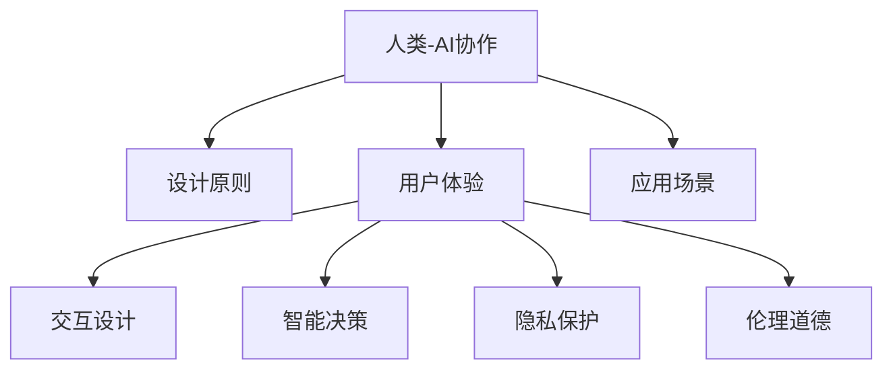

                 

# 人类-AI协作：为人类服务的设计

> 关键词：
- 人类-AI协作
- 设计原则
- 用户体验
- 应用场景
- 交互设计
- 智能决策
- 隐私保护
- 伦理道德

## 1. 背景介绍

随着人工智能(AI)技术的飞速发展，AI与人类之间的协作方式正在经历深刻的变革。无论是简单的日常任务处理，还是复杂的决策支持，AI正逐渐成为人类工作的得力助手。然而，如何设计AI系统，使其能够真正服务于人类，同时维护人类的利益和尊严，成为了当前研究的热点话题。

### 1.1 问题由来

近年来，AI技术的广泛应用带来了诸多便利，但也引发了一些伦理、隐私和安全性问题。例如，自动化系统可能取代低技能工作，导致就业不平等；智能监控系统可能侵犯个人隐私，引发数据滥用争议。这些问题促使我们重新思考AI设计的核心原则，探索如何让AI系统更好地服务于人类。

### 1.2 问题核心关键点

AI设计的核心问题在于如何平衡技术创新与人类福祉之间的关系。具体而言，需要考虑以下几点：
- 确保AI系统的决策透明性和可解释性。
- 防止AI系统在决策过程中引入偏见和歧视。
- 保护用户的隐私和数据安全。
- 促进AI系统与人类之间的有效沟通与协作。

本文将围绕这些核心问题，探讨人类-AI协作的设计原则，并给出具体应用场景和实践指导。

## 2. 核心概念与联系

### 2.1 核心概念概述

为了更好地理解人类-AI协作的设计原则，本节将介绍几个密切相关的核心概念：

- **人类-AI协作（Human-AI Collaboration）**：指AI系统与人类用户之间的互动过程，旨在利用AI的强大能力提升人类的工作效率和生活质量。
- **设计原则（Design Principles）**：在AI系统设计中需要遵循的一系列指导性准则，确保系统的道德性和有效性。
- **用户体验（User Experience）**：衡量AI系统是否满足用户需求、提升用户满意度的重要指标。
- **应用场景（Use Cases）**：AI系统在不同领域和环境中的应用实例，如医疗、教育、金融等。
- **交互设计（Interaction Design）**：专注于提升AI与用户之间交互的自然性和高效性。
- **智能决策（Intelligent Decision-Making）**：指AI系统根据数据和知识进行推理和决策的能力。
- **隐私保护（Privacy Protection）**：确保AI系统在处理个人数据时，符合隐私保护法规和伦理标准。
- **伦理道德（Ethical Standards）**：指导AI系统设计和管理的一系列道德准则，避免有害行为和技术滥用。

这些核心概念之间的逻辑关系可以通过以下Mermaid流程图来展示：



这个流程图展示了我文中的核心概念及其之间的关系：

1. 人类-AI协作是AI系统设计的核心目标。
2. 设计原则指导AI系统的整体设计方向。
3. 用户体验衡量AI系统的实用性与用户满意度。
4. 应用场景展示AI系统的具体应用实例。
5. 交互设计关注AI与用户的自然交互方式。
6. 智能决策反映AI系统的决策能力和合理性。
7. 隐私保护确保用户数据的安全与隐私。
8. 伦理道德是AI设计的基础，指导系统的行为规范。

这些概念共同构成了人类-AI协作的设计框架，使得AI系统能够更好地服务于人类，同时维护人类的利益和尊严。

## 3. 核心算法原理 & 具体操作步骤
### 3.1 算法原理概述

人类-AI协作的设计原则，核心在于确保AI系统的透明度、公正性、隐私保护和伦理道德。这些原则贯穿于AI系统的各个环节，包括数据获取、模型训练、决策输出等。

### 3.2 算法步骤详解

基于上述设计原则，AI系统设计可以概括为以下步骤：

1. **数据获取**：从合法、透明的数据源获取数据，确保数据的公正性和代表性。
2. **模型训练**：利用公正、透明的数据集训练AI模型，避免引入偏见和歧视。
3. **智能决策**：通过透明、可解释的决策过程，输出对人类有益的决策。
4. **隐私保护**：在数据收集和存储过程中，确保用户隐私和安全。
5. **伦理审查**：定期进行伦理审查，确保AI系统的行为符合伦理道德规范。

这些步骤在实际操作中，需要根据具体应用场景进行调整和优化。

### 3.3 算法优缺点

人类-AI协作的设计原则具有以下优点：
1. 提升用户体验：通过提升系统的透明度和交互性，提高用户的使用体验。
2. 促进公平正义：通过公正、透明的数据和模型训练，避免偏见和歧视。
3. 保护用户隐私：通过数据加密和匿名化等措施，确保用户隐私安全。
4. 强化伦理道德：通过定期伦理审查，确保系统行为符合道德规范。

同时，这些原则也存在一定的局限性：
1. 实施难度高：需要投入大量资源和技术，确保每个环节的透明性和公正性。
2. 技术门槛高：对AI工程师和伦理学家等专业人士的需求增加。
3. 隐私争议：数据隐私保护与数据利用的平衡，需要在法律和技术上寻求新的解决方案。

尽管存在这些局限性，但这些设计原则仍然是我们当前能够采取的最佳行动方案。未来需要进一步研究，寻求更好的实现方法和技术手段。

### 3.4 算法应用领域

人类-AI协作的设计原则广泛应用于各种应用场景，例如：

- **医疗健康**：利用AI系统进行疾病诊断、治疗方案推荐、病历记录分析等，提升医疗服务的质量。
- **教育培训**：通过智能助教和个性化学习推荐，提升学习效果和教学质量。
- **金融服务**：使用AI系统进行风险评估、欺诈检测、投资建议等，提升金融服务的可靠性。
- **交通出行**：利用AI系统进行智能导航、路况预测、安全监控等，提升交通系统的安全性。
- **智能客服**：通过智能问答和情感识别，提供更高效、更人性化的客户服务。
- **智能家居**：利用AI系统进行环境控制、安全监测、能源管理等，提升家庭生活的便利性。

这些领域的应用，不仅能够展示AI技术的强大能力，还能够促进社会福祉的提升。

## 4. 数学模型和公式 & 详细讲解  
### 4.1 数学模型构建

本节将使用数学语言对人类-AI协作的设计原则进行更加严格的刻画。

### 4.2 公式推导过程

为了更好地衡量AI系统的透明度和公正性，我们可以定义以下数学模型：

1. **透明度度量（Transparency Metric）**：用于衡量AI系统的决策过程是否可解释和透明。
   - 定义：$T = \sum_{i=1}^n (r_i \times t_i)$，其中 $r_i$ 为决策过程中第 $i$ 步的可解释性评分，$t_i$ 为该步骤的权重。

2. **公正性度量（Fairness Metric）**：用于衡量AI系统在数据处理和决策过程中是否存在偏见。
   - 定义：$F = \frac{1}{N} \sum_{i=1}^N (p_i - q_i)$，其中 $p_i$ 为正类样本在训练集中的比例，$q_i$ 为预测结果中正类的比例。

### 4.3 案例分析与讲解

下面以智能客服系统为例，分析如何应用这些度量指标进行设计：

- **数据获取**：从合法网站和客户反馈中获取数据，确保数据的多样性和公正性。
- **模型训练**：使用公平训练算法，确保模型不会对某些特定群体存在偏见。
- **智能决策**：设计可解释的决策过程，提供详细的推理逻辑。
- **隐私保护**：在数据存储和传输过程中，采用加密和匿名化等措施。
- **伦理审查**：定期进行伦理审查，确保系统行为符合道德规范。

## 5. 项目实践：代码实例和详细解释说明
### 5.1 开发环境搭建

在进行AI系统开发前，需要先准备好开发环境。以下是使用Python进行AI系统开发的典型环境配置流程：

1. 安装Python：根据操作系统，从官网下载并安装Python。
2. 安装必要的库：如Numpy、Pandas、Scikit-learn、TensorFlow、PyTorch等，可以使用`pip`命令进行安装。
3. 安装AI框架：如TensorFlow、PyTorch等，同样使用`pip`命令进行安装。
4. 安装Jupyter Notebook：使用`pip`命令进行安装，方便进行代码调试和数据可视化。
5. 安装Git：从官网下载并安装Git，用于版本控制和代码托管。

完成上述步骤后，即可在Python环境中进行AI系统的开发和调试。

### 5.2 源代码详细实现

下面以一个简单的AI医疗诊断系统为例，给出Python代码实现。

```python
import numpy as np
import pandas as pd
from sklearn.model_selection import train_test_split
from sklearn.linear_model import LogisticRegression
from sklearn.metrics import accuracy_score
from sklearn.metrics import confusion_matrix

# 加载数据
data = pd.read_csv('medical_data.csv')

# 数据预处理
# ...

# 训练模型
X_train, X_test, y_train, y_test = train_test_split(X, y, test_size=0.2, random_state=42)
model = LogisticRegression()
model.fit(X_train, y_train)

# 测试模型
y_pred = model.predict(X_test)
accuracy = accuracy_score(y_test, y_pred)
conf_matrix = confusion_matrix(y_test, y_pred)

# 输出结果
print(f'Accuracy: {accuracy:.2f}')
print(f'Confusion Matrix:\n{conf_matrix}')
```

这个示例代码实现了简单的逻辑回归模型，用于医疗诊断任务。可以看到，AI系统开发需要包括数据预处理、模型训练、测试和输出结果等多个步骤。

### 5.3 代码解读与分析

让我们再详细解读一下关键代码的实现细节：

**数据加载与预处理**：
- `pd.read_csv()`方法用于从CSV文件中加载数据。
- `train_test_split()`方法用于将数据集分为训练集和测试集。
- 数据预处理可能包括清洗、特征选择、归一化等操作。

**模型训练与测试**：
- `LogisticRegression()`用于建立逻辑回归模型。
- `model.fit()`方法用于训练模型。
- `model.predict()`方法用于预测测试集的标签。
- `accuracy_score()`和`confusion_matrix()`方法用于计算模型的精度和混淆矩阵。

**结果输出**：
- 使用`print()`函数输出模型的精度和混淆矩阵。

通过代码示例，我们可以看到AI系统开发的流程和细节。开发者需要将数据、模型和算法进行合理设计，确保系统的透明度和公正性。

## 6. 实际应用场景
### 6.1 智能医疗健康

在智能医疗健康领域，AI系统可以辅助医生进行疾病诊断和治疗方案推荐。例如，通过分析患者的症状和病历数据，AI系统可以给出疾病风险评估，并推荐合适的治疗方案。

在具体实现上，需要考虑以下几点：
- 数据获取：从医院信息系统、电子病历等合法渠道获取患者数据。
- 模型训练：使用公平训练算法，确保模型不会对某些疾病存在偏见。
- 智能决策：设计透明的决策逻辑，提供详细的推理过程。
- 隐私保护：在数据存储和传输过程中，采用加密和匿名化措施。
- 伦理审查：定期进行伦理审查，确保系统行为符合医疗伦理规范。

### 6.2 智能教育培训

在智能教育培训领域，AI系统可以辅助教师进行个性化学习推荐，提升学习效果和教学质量。例如，通过分析学生的学习行为和成绩，AI系统可以推荐合适的学习资源和习题，帮助学生提升学习效率。

在具体实现上，需要考虑以下几点：
- 数据获取：从学习管理系统、考试数据等合法渠道获取学生数据。
- 模型训练：使用公平训练算法，确保模型不会对某些学习方式存在偏见。
- 智能决策：设计透明的推荐过程，提供详细的推荐逻辑。
- 隐私保护：在数据存储和传输过程中，采用加密和匿名化措施。
- 伦理审查：定期进行伦理审查，确保系统行为符合教育伦理规范。

### 6.3 智能金融服务

在智能金融服务领域，AI系统可以辅助银行进行风险评估和欺诈检测，提升金融服务的可靠性。例如，通过分析用户的交易数据和行为数据，AI系统可以识别出可疑交易和潜在风险。

在具体实现上，需要考虑以下几点：
- 数据获取：从合法金融数据源获取用户数据。
- 模型训练：使用公平训练算法，确保模型不会对某些交易类型存在偏见。
- 智能决策：设计透明的决策过程，提供详细的推理逻辑。
- 隐私保护：在数据存储和传输过程中，采用加密和匿名化措施。
- 伦理审查：定期进行伦理审查，确保系统行为符合金融伦理规范。

### 6.4 未来应用展望

随着AI技术的不断进步，未来AI系统将在更多领域得到应用，为社会带来深刻变革。

在智慧城市治理中，AI系统可以用于智能交通、环境监测、公共安全等领域，提升城市管理的自动化和智能化水平。

在智慧农业中，AI系统可以用于作物识别、病虫害预测、精准农业等，提升农业生产的效率和质量。

在智慧能源中，AI系统可以用于智能电网、能源管理、可再生能源优化等，提升能源利用效率。

未来，AI系统将在更多垂直领域发挥重要作用，为人类社会的可持续发展提供新的动力。

## 7. 工具和资源推荐
### 7.1 学习资源推荐

为了帮助开发者掌握人类-AI协作的设计原则，这里推荐一些优质的学习资源：

1. **《人工智能伦理指南》**：提供关于AI伦理和道德的全面指导，帮助开发者设计符合道德规范的AI系统。
2. **《数据科学与人工智能》课程**：涵盖数据获取、数据预处理、模型训练等基础知识，是入门AI系统开发的好选择。
3. **《智能系统设计》书籍**：介绍智能系统的设计原则和实践技巧，帮助开发者设计透明、公正、可信的AI系统。
4. **Google AI Design**：提供关于AI系统设计的基础知识，涵盖用户体验、交互设计、隐私保护等内容。
5. **OpenAI Policy Lab**：专注于AI系统的伦理和道德设计，提供丰富的实践案例和资源。

通过对这些资源的学习实践，相信你一定能够掌握人类-AI协作的设计原则，设计出符合道德规范、公正透明、高效实用的AI系统。

### 7.2 开发工具推荐

高效的AI系统开发离不开优秀的工具支持。以下是几款用于AI系统开发的常用工具：

1. **PyTorch**：基于Python的开源深度学习框架，灵活动态的计算图，适合快速迭代研究。
2. **TensorFlow**：由Google主导开发的开源深度学习框架，生产部署方便，适合大规模工程应用。
3. **TensorBoard**：TensorFlow配套的可视化工具，可实时监测模型训练状态，并提供丰富的图表呈现方式。
4. **Jupyter Notebook**：交互式代码编辑器，支持多种编程语言，方便进行代码调试和数据可视化。
5. **Weights & Biases**：模型训练的实验跟踪工具，可以记录和可视化模型训练过程中的各项指标，方便对比和调优。
6. **Git**：版本控制系统，用于代码管理和协作，确保团队高效协作。

合理利用这些工具，可以显著提升AI系统开发的效率，加快创新迭代的步伐。

### 7.3 相关论文推荐

人类-AI协作的研究源于学界的持续探索。以下是几篇奠基性的相关论文，推荐阅读：

1. **《公平与透明的AI系统设计》**：提出公平与透明AI系统的设计原则，指导AI系统开发。
2. **《隐私保护在AI系统中的应用》**：探讨隐私保护技术在AI系统中的应用，确保用户数据安全。
3. **《伦理道德在AI系统中的应用》**：提供AI系统伦理道德设计的指导，避免有害行为和技术滥用。
4. **《透明与可解释AI系统的研究进展》**：总结透明与可解释AI系统的最新进展，为设计透明AI系统提供参考。
5. **《公平与公正AI系统的研究进展》**：总结公平与公正AI系统的最新进展，为设计公正AI系统提供参考。

这些论文代表了我文中所述设计原则的发展脉络。通过学习这些前沿成果，可以帮助研究者把握学科前进方向，激发更多的创新灵感。

## 8. 总结：未来发展趋势与挑战
### 8.1 总结

本文对人类-AI协作的设计原则进行了全面系统的介绍。首先阐述了AI系统设计的重要性，明确了系统设计的核心原则，包括透明度、公正性、隐私保护和伦理道德。其次，从原理到实践，详细讲解了AI系统的设计步骤，并给出了具体应用场景和实践指导。

通过本文的系统梳理，可以看到，人类-AI协作的设计原则是当前AI系统设计的核心，能够确保系统在服务于人类的同时，维护人类的利益和尊严。未来，这些设计原则将引领AI技术向更加智能化、普适化方向发展，为人类社会的可持续发展提供新的动力。

### 8.2 未来发展趋势

展望未来，人类-AI协作的设计原则将呈现以下几个发展趋势：

1. **跨领域融合**：AI系统将与其他技术如区块链、物联网、边缘计算等进行深度融合，形成更加全面、智能的技术体系。
2. **数据民主化**：通过开放数据平台和数据共享机制，提升数据的透明度和可访问性，实现数据民主化。
3. **伦理标准化**：制定AI系统的伦理标准和规范，确保系统的行为符合道德和社会价值观。
4. **透明可解释**：开发透明、可解释的AI系统，提升用户信任和接受度。
5. **隐私保护增强**：通过隐私保护技术和数据匿名化手段，确保用户数据的安全和隐私。

这些趋势凸显了人类-AI协作设计的广阔前景，推动AI技术向更加透明、公正、可信的方向发展。

### 8.3 面临的挑战

尽管人类-AI协作的设计原则已经取得了显著进展，但在迈向更加智能化、普适化应用的过程中，仍面临诸多挑战：

1. **技术复杂性高**：设计符合道德规范、公正透明的AI系统，需要在技术上投入大量资源。
2. **隐私保护难题**：如何在保护隐私的同时，充分利用数据进行AI训练，是一个技术难题。
3. **伦理道德冲突**：如何平衡技术创新与伦理道德，避免有害行为和技术滥用，需要更多的研究和实践。
4. **公众信任问题**：用户对AI系统的信任度仍需提高，需要更多的教育和透明性。
5. **法规和技术不匹配**：现有的法律和技术标准，无法完全适应快速发展的AI技术。

解决这些挑战，需要学界、业界和政府的共同努力，制定更完善的法规和标准，提升公众对AI技术的理解和信任。

### 8.4 研究展望

面对人类-AI协作设计面临的挑战，未来的研究需要在以下几个方面寻求新的突破：

1. **透明可解释AI**：开发更加透明、可解释的AI系统，提升用户信任和接受度。
2. **公平公正AI**：设计公平、公正的AI系统，避免偏见和歧视。
3. **隐私保护技术**：研究新的隐私保护技术，确保用户数据的安全和隐私。
4. **伦理道德规范**：制定AI系统的伦理规范和标准，指导系统的设计和应用。
5. **跨领域融合**：探索AI与其他技术的深度融合，提升系统的综合能力。

这些研究方向的探索，必将引领人类-AI协作设计向更高的台阶发展，为构建安全、可靠、可解释、可控的智能系统铺平道路。面向未来，人类-AI协作设计需要与其他人工智能技术进行更深入的融合，共同推动自然语言理解和智能交互系统的进步。

## 9. 附录：常见问题与解答

**Q1: 如何确保AI系统的透明度和公正性？**

A: 确保AI系统的透明度和公正性，需要从数据获取、模型训练、智能决策等各个环节进行严格控制。具体措施包括：
- 数据获取：从合法、透明的数据源获取数据。
- 模型训练：使用公平训练算法，确保模型不会对某些特定群体存在偏见。
- 智能决策：设计透明的决策过程，提供详细的推理逻辑。

**Q2: 如何在保护隐私的同时，充分利用数据进行AI训练？**

A: 数据隐私保护与数据利用的平衡，需要在技术上寻求新的解决方案。具体措施包括：
- 数据匿名化：对数据进行去标识化处理，确保数据无法追溯到具体个体。
- 数据加密：在数据传输和存储过程中，采用加密技术保护数据安全。
- 隐私计算：采用差分隐私、联邦学习等技术，在不泄露数据隐私的前提下，进行数据分析和模型训练。

**Q3: 如何设计符合伦理道德规范的AI系统？**

A: 设计符合伦理道德规范的AI系统，需要从伦理审查、透明性、隐私保护等多个方面进行考虑。具体措施包括：
- 伦理审查：定期进行伦理审查，确保系统行为符合道德规范。
- 透明性：提供系统的决策过程和推理逻辑，确保用户信任。
- 隐私保护：在数据处理和存储过程中，采用加密和匿名化等措施，确保用户隐私安全。

通过这些措施，可以有效避免AI系统中的伦理和道德问题，确保系统的公正性和透明度。

**Q4: 如何提高AI系统的可信度和用户信任？**

A: 提高AI系统的可信度和用户信任，需要从系统设计、用户教育和透明性等多个方面进行考虑。具体措施包括：
- 系统设计：设计透明、可解释的AI系统，提供详细的推理逻辑和决策依据。
- 用户教育：通过科普教育，提高用户对AI技术的理解和接受度。
- 透明性：提供系统的决策过程和推理逻辑，确保用户信任。

通过这些措施，可以有效提升用户对AI系统的信任和接受度，推动AI技术在更多领域的普及和应用。

**Q5: 如何在AI系统中实现隐私保护和数据利用之间的平衡？**

A: 隐私保护和数据利用之间的平衡，需要在技术上寻求新的解决方案。具体措施包括：
- 数据匿名化：对数据进行去标识化处理，确保数据无法追溯到具体个体。
- 数据加密：在数据传输和存储过程中，采用加密技术保护数据安全。
- 隐私计算：采用差分隐私、联邦学习等技术，在不泄露数据隐私的前提下，进行数据分析和模型训练。

这些技术手段可以在保护隐私的同时，充分利用数据进行AI训练，确保系统的公正性和透明度。

---

作者：禅与计算机程序设计艺术 / Zen and the Art of Computer Programming

