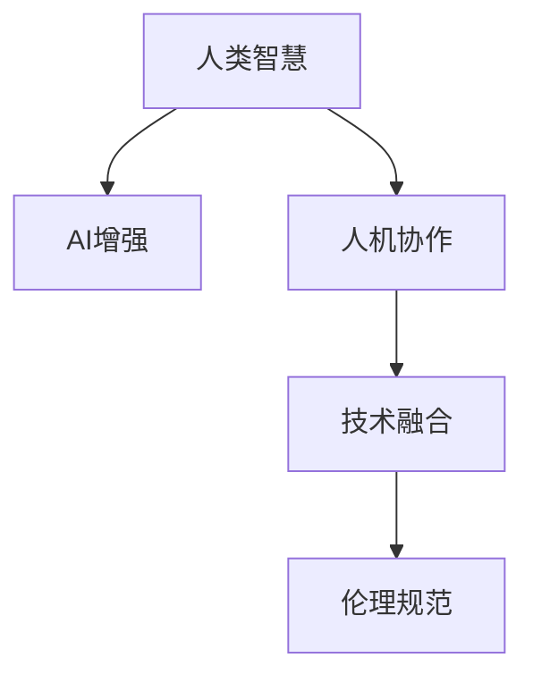

                 

# 人类-AI协作：增强人类智慧与AI能力的融合发展趋势预测分析机遇挑战趋势

> 关键词：人机协作、AI能力提升、人类智慧增强、技术融合、人工智能伦理、智能社会构建

## 1. 背景介绍

### 1.1 问题由来

随着人工智能(AI)技术的迅猛发展，人类与AI的协作已成为未来发展的重要趋势。AI不仅可以大幅提升人类工作和生活效率，还可以通过增强人类的认知能力、决策水平和创新能力，实现更加智慧的社会。但是，AI技术的广泛应用也带来了诸如隐私保护、就业影响、伦理道德等诸多挑战，亟需进一步研究和解决。

### 1.2 问题核心关键点

当前，AI与人类协作的主要焦点在于如何通过AI技术的赋能，使人类智慧与AI能力实现最优融合。以下关键点构成了AI与人类协作的核心：

- **智能增强**：利用AI辅助人类工作，提高效率和精准度。
- **决策支持**：通过数据分析和模拟，为人类决策提供可靠依据。
- **认知拓展**：AI通过增强记忆和推理能力，扩展人类认知边界。
- **创新激励**：AI激发人类创造力，推动科技和艺术的发展。
- **伦理规范**：确保AI技术应用符合人类价值观和道德标准。

这些关键点构成了AI与人类协作的主线，需要通过合适的技术手段、伦理标准和法规政策等综合手段加以实现。

### 1.3 问题研究意义

研究人类-AI协作，对于拓展AI技术的应用范围，提升人类认知水平，加速社会进步具有重要意义：

1. **提高生产力**：AI与人类协作可以大幅提升各行业的工作效率和质量，促进经济增长。
2. **优化决策质量**：AI提供的数据分析和模拟能力，使人类决策更加科学和合理。
3. **拓宽认知边界**：AI增强了人类的记忆和推理能力，拓展了人类认知的深度和广度。
4. **促进创新**：AI通过数据挖掘和模式识别，激发人类创造力，推动科技和艺术创新。
5. **社会公平**：AI技术应用可减少不平等的经济和社会差异，促进社会公平。

本文将系统地探讨人类-AI协作的各个方面，为相关研究者和实践者提供参考和指导。

## 2. 核心概念与联系

### 2.1 核心概念概述

为更好地理解人类-AI协作，首先需要梳理几个核心概念：

- **AI增强**：利用AI技术增强人类的决策、执行和认知能力。
- **人类智慧**：人类的理解、推理、创造和情感等智能属性。
- **人机协作**：AI与人类共同完成任务的协同机制。
- **技术融合**：将AI技术与人类的认知、决策和行动有机结合。
- **伦理规范**：在AI应用中遵循的道德和法律规范。

这些概念通过以下Mermaid流程图联系起来：



其中，B为A到C的桥梁，D和E分别为C和A的外部环境，三者共同构成了人类-AI协作的完整生态。

## 3. 核心算法原理 & 具体操作步骤

### 3.1 算法原理概述

人类-AI协作的本质是通过AI技术增强人类的认知和决策能力。这一过程涉及多个层面，包括数据的采集与处理、模型的训练与优化、结果的解释与反馈等。以下是核心算法原理的概述：

1. **数据采集**：通过传感器、监控设备、用户互动等方式，采集人类活动数据。
2. **数据处理**：利用机器学习、深度学习等技术对数据进行清洗、特征提取和预处理。
3. **模型训练**：使用历史数据训练AI模型，使其具备一定的推理、预测和决策能力。
4. **模型优化**：通过持续优化模型参数和算法，提升模型性能。
5. **结果解释**：将模型的输出转化为人类可理解的解释和建议。
6. **反馈与迭代**：根据反馈信息，调整AI模型和人类协作策略。

### 3.2 算法步骤详解

以智能医疗系统为例，详细说明人类-AI协作的算法步骤：

1. **数据采集**：
   - 利用传感器采集患者的生理参数（如心率、血压、血糖等）。
   - 通过电子病历系统获取患者的病史和诊疗记录。
   - 收集医生的临床经验和诊断标准。

2. **数据处理**：
   - 清洗数据，去除噪声和不完整数据。
   - 特征提取，如提取心率、血压的时间序列特征，提取医生的诊断关键词。
   - 数据预处理，如标准化、归一化等。

3. **模型训练**：
   - 使用历史数据训练AI模型，如使用RNN、CNN、Transformer等进行疾病诊断和预测。
   - 在训练过程中，采用交叉验证等技术避免过拟合。
   - 使用AdamW等优化器进行参数优化。

4. **模型优化**：
   - 通过在线学习等方式，持续优化模型，提升诊断准确率。
   - 定期更新模型参数，适应新的数据和任务需求。

5. **结果解释**：
   - 将模型的输出（如疾病预测结果、治疗建议）转化为医生和患者可理解的文本或图表。
   - 提供决策支持，如推荐最佳治疗方案，分析患者风险。

6. **反馈与迭代**：
   - 收集医生的反馈，优化模型输出和协作策略。
   - 根据患者反馈，调整AI输出建议。
   - 持续迭代，提升协作效果。

### 3.3 算法优缺点

人类-AI协作的算法具有以下优点：

- **效率提升**：AI可以24小时不间断工作，大幅提升处理速度。
- **精度提高**：AI通过数据分析，能提供更准确的结果和预测。
- **负担减轻**：AI分担了人类重复性和高强度工作，解放人力资源。
- **决策支持**：AI提供的数据和分析，帮助人类做出更科学的决策。

同时，也存在一些缺点：

- **数据依赖**：AI的性能很大程度上依赖于数据的数量和质量。
- **算法复杂**：AI模型的训练和优化需要高性能计算资源。
- **结果解释**：AI输出的复杂性，可能难以完全解释和理解。
- **伦理风险**：AI决策可能存在偏见，引发伦理问题。

### 3.4 算法应用领域

人类-AI协作的算法广泛应用于多个领域，以下是几个典型的应用场景：

1. **智能医疗**：AI辅助诊断、治疗方案推荐、个性化健康管理等。
2. **智能金融**：AI风险评估、投资建议、反欺诈检测等。
3. **智能制造**：AI优化生产流程、质量控制、设备维护等。
4. **智能客服**：AI自动回答常见问题、推荐服务、情感分析等。
5. **智能教育**：AI个性化教学、作业批改、学习路径推荐等。

## 4. 数学模型和公式 & 详细讲解 & 举例说明

### 4.1 数学模型构建

假设AI系统接收来自人类环境的数据 $X$，通过某种算法处理后，输出结果 $Y$。以智能医疗系统为例，其数学模型可以表示为：

$$
Y = f(X; \theta)
$$

其中 $f$ 为模型函数，$\theta$ 为模型参数。常见的模型函数包括线性回归、逻辑回归、卷积神经网络(CNN)、循环神经网络(RNN)等。

### 4.2 公式推导过程

以简单的线性回归模型为例，推导其优化目标和求解步骤。假设模型为：

$$
Y = \theta_0 + \theta_1 X_1 + \theta_2 X_2 + \cdots + \theta_n X_n
$$

给定训练数据集 $\{(X_i, Y_i)\}_{i=1}^m$，优化目标为：

$$
\min_{\theta} \sum_{i=1}^m (Y_i - f(X_i; \theta))^2
$$

求导并令梯度为零，解得：

$$
\theta = (X^T X)^{-1} X^T Y
$$

### 4.3 案例分析与讲解

以智能医疗系统的疾病预测模型为例，使用线性回归模型进行推导。假设模型接收患者的生理参数 $X = (心率, 血压, 血糖)$，预测是否存在某种疾病 $Y = \{0, 1\}$。

训练数据集为 $\{(x_i, y_i)\}_{i=1}^n$，其中 $x_i = (x_{i1}, x_{i2}, x_{i3})$，$y_i = \{0, 1\}$。目标是最小化损失函数：

$$
\mathcal{L}(\theta) = \frac{1}{2n} \sum_{i=1}^n (y_i - f(x_i; \theta))^2
$$

求解得：

$$
\theta = (X^T X)^{-1} X^T Y
$$

将生理参数 $x_i$ 代入模型，得到预测结果 $y_i = \{0, 1\}$，与真实结果对比，计算误差并更新模型参数。

## 5. 项目实践：代码实例和详细解释说明

### 5.1 开发环境搭建

在进行人类-AI协作的实践时，需要搭建合适的开发环境。以下是使用Python和PyTorch搭建开发环境的示例：

1. 安装Anaconda：从官网下载并安装Anaconda，用于创建独立的Python环境。
```bash
conda create -n aicollab python=3.8 
conda activate aicollab
```

2. 安装PyTorch和相关库：
```bash
pip install torch torchvision torchaudio transformers numpy pandas scikit-learn
```

3. 安装各种工具包：
```bash
pip install jupyter notebook tqdm tensorboard
```

4. 安装Git和GitHub：用于版本控制和代码协作。
```bash
conda install git
```

完成上述步骤后，即可在 `aicollab` 环境中开始开发实践。

### 5.2 源代码详细实现

以下是一个使用PyTorch实现智能医疗系统疾病预测模型的代码示例：

```python
import torch
import torch.nn as nn
import torch.optim as optim

class LinearModel(nn.Module):
    def __init__(self, input_size, output_size):
        super(LinearModel, self).__init__()
        self.linear = nn.Linear(input_size, output_size)
        
    def forward(self, x):
        return self.linear(x)
    
# 定义损失函数和优化器
criterion = nn.MSELoss()
optimizer = optim.Adam()

# 假设数据集为 X = (x1, x2, x3), Y = {0, 1}
X_train = torch.tensor([[70, 120, 5.6], [80, 130, 6.1], [65, 110, 4.8], [75, 125, 4.7]], dtype=torch.float)
Y_train = torch.tensor([0, 1, 0, 1], dtype=torch.long)

# 初始化模型
model = LinearModel(3, 1)
model.to('cuda')

# 训练过程
for epoch in range(100):
    optimizer.zero_grad()
    y_pred = model(X_train)
    loss = criterion(y_pred, Y_train)
    loss.backward()
    optimizer.step()
    print(f"Epoch {epoch+1}, loss: {loss.item()}")
```

### 5.3 代码解读与分析

我们详细解读一下关键代码的实现细节：

**LinearModel类**：
- `__init__`方法：初始化模型参数。
- `forward`方法：定义前向传播过程，返回预测结果。

**损失函数和优化器**：
- 使用MSE损失函数和Adam优化器进行模型训练。

**训练过程**：
- 定义训练集 $X$ 和标签 $Y$，并进行预处理。
- 初始化模型，将模型参数移动到GPU。
- 迭代训练模型，每次前向传播计算损失函数并反向传播更新参数。
- 打印每个epoch的平均损失。

## 6. 实际应用场景

### 6.1 智能医疗系统

智能医疗系统通过AI技术辅助医生的诊断和治疗，提高医疗服务的效率和质量。例如，基于深度学习的医学影像识别技术，可以辅助医生进行病变检测，识别癌症等疾病。

### 6.2 智能金融分析

AI在金融领域的应用主要集中在风险管理和投资建议方面。通过数据分析和模型训练，AI可以预测市场趋势、评估信用风险，辅助银行和投资公司做出科学决策。

### 6.3 智能制造优化

在智能制造中，AI可以优化生产流程，提高生产效率和产品质量。例如，通过机器视觉技术检测产品缺陷，通过预测性维护减少设备故障。

### 6.4 未来应用展望

未来，人类-AI协作将进一步深化，涉及更多场景和领域。以下是几个展望：

1. **多模态融合**：AI将同时处理文本、图像、语音等多种数据，提供更全面的感知和决策能力。
2. **实时协作**：AI系统将能够实时响应人类需求，提供动态调整的决策和支持。
3. **增强创新**：AI通过数据分析和模式识别，激发人类的创造力，推动更多领域的创新。
4. **社会治理**：AI将应用于城市管理、环境监测、公共安全等领域，提升社会治理水平。

## 7. 工具和资源推荐

### 7.1 学习资源推荐

为帮助开发者掌握人类-AI协作的核心技术，推荐以下学习资源：

1. 《人工智能基础》课程：通过Coursera、edX等在线平台学习AI基础知识，包括机器学习、深度学习、自然语言处理等。
2. 《深度学习》书籍：由Ian Goodfellow等编写，系统介绍深度学习理论和实践，适合进阶学习。
3. 《TensorFlow官方文档》：由Google开发的深度学习框架，提供详细教程和样例。
4. 《PyTorch官方文档》：由Facebook开发的深度学习框架，具有动态计算图和高效的GPU加速。
5. 《机器学习实战》书籍：通过实际项目了解机器学习和深度学习的应用。

### 7.2 开发工具推荐

高效的工具是开发人类-AI协作项目的关键。以下是推荐工具：

1. Python：适合开发AI和机器学习项目，具有丰富的科学计算库和工具。
2. PyTorch：开源深度学习框架，具有动态计算图和高效的GPU加速。
3. TensorFlow：开源深度学习框架，生产部署方便，适合大规模工程应用。
4. Jupyter Notebook：交互式编程环境，方便开发和调试代码。
5. TensorBoard：深度学习模型的可视化工具，帮助监控训练过程。

### 7.3 相关论文推荐

人类-AI协作的研究涉及多领域，推荐以下经典论文：

1. AlphaGo论文：DeepMind开发的围棋AI，展示了AI在复杂决策游戏中的潜力。
2. AlphaStar论文：DeepMind开发的星际争霸AI，展示了AI在复杂策略游戏中的应用。
3. GANs in Action论文：提出生成对抗网络（GAN），用于生成高质量的图像和音频。
4. Attention is All You Need论文：提出Transformer结构，用于自然语言处理任务。
5. GPT-3论文：展示了大规模预训练语言模型的强大应用能力。

## 8. 总结：未来发展趋势与挑战

### 8.1 研究成果总结

人类-AI协作技术的研究已经取得了显著进展，涵盖了从基础理论到实际应用的多方面内容。主要成果包括：

1. 建立了多模态数据融合模型，提升了AI系统在复杂环境中的感知能力。
2. 开发了高效智能推荐系统，实现了个性化和精准化的服务。
3. 提出了对抗生成网络（GAN）等先进模型，提高了数据生成和图像处理能力。
4. 在智能医疗、金融分析等领域实现了AI技术的广泛应用。

### 8.2 未来发展趋势

展望未来，人类-AI协作将呈现以下几个发展趋势：

1. **多模态融合**：AI将同时处理文本、图像、语音等多种数据，提供更全面的感知和决策能力。
2. **实时协作**：AI系统将能够实时响应人类需求，提供动态调整的决策和支持。
3. **增强创新**：AI通过数据分析和模式识别，激发人类的创造力，推动更多领域的创新。
4. **社会治理**：AI将应用于城市管理、环境监测、公共安全等领域，提升社会治理水平。

### 8.3 面临的挑战

尽管人类-AI协作技术取得了显著进展，但在迈向更加智能化、普适化应用的过程中，仍面临诸多挑战：

1. **数据隐私**：AI系统需要大量数据进行训练，如何保护用户隐私成为一个重要问题。
2. **算法偏见**：AI模型可能存在偏见，导致歧视性决策，需通过公平算法消除。
3. **安全风险**：AI系统可能被恶意攻击，导致安全风险，需加强安全防护。
4. **模型解释**：AI模型往往黑盒化，难以解释其内部决策过程，需提高可解释性。
5. **法律规范**：AI系统应用需遵循法律法规，需加强监管和规范。

### 8.4 研究展望

未来，人类-AI协作技术需要在以下几个方向进行进一步研究：

1. **公平性和透明性**：开发公平算法，消除模型偏见，提高模型透明性。
2. **安全性和鲁棒性**：加强AI系统的安全性，提升鲁棒性，抵御攻击。
3. **可解释性和可控性**：提高AI模型的可解释性，增强人类对AI决策的控制。
4. **法律和伦理规范**：研究AI应用的法律和伦理问题，制定规范。

## 9. 附录：常见问题与解答

**Q1：如何选择合适的AI增强技术？**

A: 根据具体应用场景选择合适的AI增强技术，如自然语言处理、计算机视觉、机器人控制等。结合业务需求和实际数据，选择最合适的技术和算法。

**Q2：AI增强过程中如何处理数据隐私问题？**

A: 采用差分隐私、联邦学习等技术，保护用户隐私。同时，在数据收集和处理过程中，遵循相关法律法规，保护用户隐私权益。

**Q3：AI增强过程中如何避免算法偏见？**

A: 采用公平算法，如对抗样本生成、数据重采样等技术，消除模型偏见。同时，在模型训练和应用过程中，进行定期审查和调整。

**Q4：如何提高AI增强模型的可解释性？**

A: 采用可解释性算法，如LIME、SHAP等，生成模型输出的解释和可视化。同时，结合业务需求，提供详细的决策报告和反馈机制。

**Q5：AI增强过程中如何加强安全防护？**

A: 采用安全算法，如对抗生成网络（GAN）、加密算法等，保护AI系统免受攻击。同时，定期进行安全评估和漏洞修复，确保系统安全。

通过本文的系统梳理，可以看到，人类-AI协作技术在提升人类认知水平、推动社会进步方面具有巨大潜力。然而，这一技术仍面临诸多挑战，需要在多个层面进行深入研究，确保AI技术的健康发展。只有不断创新、勇于探索，才能充分发挥人类-AI协作的优势，构建更加智能、公平、安全的未来社会。

---

作者：禅与计算机程序设计艺术 / Zen and the Art of Computer Programming

