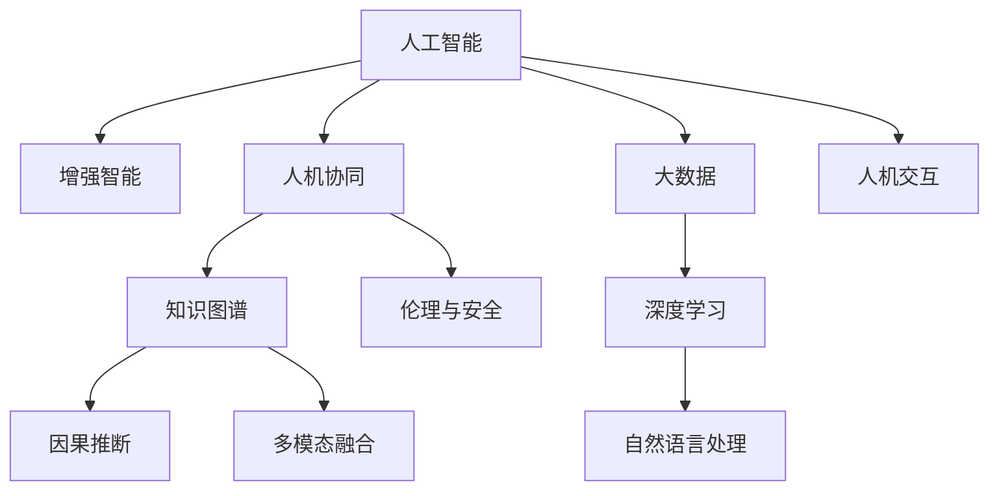

                 

# 人类-AI协作：增强人类智慧与AI能力的融合展望

> 关键词：人类-AI协作,增强智慧,融合技术,人工智能,数据科学,深度学习,自然语言处理

## 1. 背景介绍

### 1.1 问题由来
随着人工智能(AI)技术的飞速发展，人类社会正处于第四次工业革命的关键节点。AI技术在各个领域的深入应用，正在推动人类生产力和生活方式的深刻变革。然而，尽管AI技术日益强大，其本质上仍然是工具和辅助手段，最终的决策和执行仍需依赖人类智慧的指导和参与。因此，如何通过AI技术增强人类智慧，实现人与机器的有机融合，成为了当前AI研究的重要课题。

### 1.2 问题核心关键点
人类-AI协作的核心在于将AI技术与人类智慧相结合，共同完成复杂的任务。这一过程涉及以下几个关键点：

- **人机交互**：人类与AI系统之间如何通过自然语言、图像、视频等多种形式进行高效互动。
- **知识整合**：将人类的知识、经验和AI的计算能力进行整合，形成更加全面、准确的知识体系。
- **智能增强**：通过AI技术提升人类的决策能力、学习能力和创新能力，使其能够在更加复杂、动态的环境中进行智能决策。
- **伦理与安全**：在使用AI技术时，如何确保数据安全、算法公正，避免潜在的伦理风险。

## 2. 核心概念与联系

### 2.1 核心概念概述

为更好地理解人类-AI协作，本节将介绍几个密切相关的核心概念：

- **人工智能(AI)**：旨在模拟、扩展和扩展人类智能的技术，包括机器学习、深度学习、自然语言处理等。
- **增强智能**：通过AI技术提升人类自身的能力，包括认知增强、决策支持、创新加速等。
- **人机协同**：指人类与AI系统之间紧密合作，共同完成复杂任务。
- **知识图谱**：一种语义化的知识表示方法，将人类知识结构化，便于AI系统理解和应用。
- **因果推断**：研究如何从数据中发现和理解因果关系，以提升AI系统的解释性和可信度。
- **多模态融合**：将视觉、听觉、语言等多种模态数据进行融合，提升AI系统的感知和理解能力。

这些概念之间的逻辑关系可以通过以下Mermaid流程图来展示：



这个流程图展示了几个人工智能相关概念及其之间的关系：

1. 人工智能通过深度学习、自然语言处理等技术，模拟人类智能。
2. 增强智能通过人工智能技术提升人类自身的能力。
3. 人机协同指人类与人工智能系统紧密合作，共同完成任务。
4. 知识图谱通过语义化的方式组织人类知识，便于人工智能系统理解和应用。
5. 因果推断研究数据中的因果关系，提升AI系统的解释性和可信度。
6. 多模态融合将视觉、听觉、语言等多种模态数据进行融合，提升感知和理解能力。
7. 伦理与安全在AI系统应用过程中需要考虑数据安全、算法公正等伦理问题。
8. 大数据和深度学习是人工智能的重要技术基础。

这些核心概念共同构成了人工智能的发展框架，推动了人类智慧与AI能力的融合。

## 3. 核心算法原理 & 具体操作步骤
### 3.1 算法原理概述

人类-AI协作的核心算法原理主要包括以下几个方面：

- **知识抽取与融合**：将人类知识抽取并整合到AI系统中，提升其智能水平。
- **增强学习**：通过与环境的互动，不断学习和优化，增强AI系统的决策能力。
- **多模态融合**：将视觉、听觉、语言等多种模态数据进行融合，提升感知和理解能力。
- **因果推断**：通过分析数据中的因果关系，提升AI系统的解释性和可信度。
- **协同优化**：通过协同优化算法，实现人机之间智能的动态平衡。

### 3.2 算法步骤详解

人类-AI协作的算法步骤大致可以分为以下几个环节：

1. **数据收集与预处理**：收集与任务相关的各类数据，包括文本、图像、视频等。对数据进行清洗、标注、增强等预处理工作。

2. **模型构建与训练**：选择合适的模型结构（如神经网络、Transformer等），并在预处理后的数据上进行模型训练。模型训练过程中，需要设置合适的超参数，并进行模型验证。

3. **知识抽取与融合**：将人类知识以结构化形式（如知识图谱、逻辑规则等）输入AI系统，提升系统的智能水平。

4. **增强学习与优化**：通过增强学习算法（如Q-learning、SARSA等），不断与环境互动，优化AI系统的决策能力。

5. **多模态融合与感知增强**：将视觉、听觉、语言等多种模态数据进行融合，提升感知和理解能力。

6. **因果推断与解释性**：通过因果推断算法（如Bayesian网络、因果图等），分析数据中的因果关系，提升AI系统的解释性和可信度。

7. **协同优化与人机协同**：通过协同优化算法，实现人机之间的智能动态平衡，提高整体系统的性能。

### 3.3 算法优缺点

人类-AI协作的算法具有以下优点：

- **知识互补**：通过融合人类知识，AI系统可以更全面地理解问题，提升决策的准确性和可信度。
- **高效协作**：通过协同优化，实现人机之间的智能动态平衡，提升整体系统的性能。
- **普适性**：不同领域的知识和经验可以共享和融合，提升AI系统在不同场景下的适应能力。

同时，该算法也存在一些局限性：

- **数据依赖**：人类知识的抽取和融合依赖于高质量的数据，数据质量不好会影响系统效果。
- **计算资源**：多模态数据融合和因果推断等复杂算法需要大量的计算资源，对硬件要求较高。
- **解释性不足**：AI系统的决策过程难以解释，缺乏透明度和可信度。

尽管存在这些局限性，但就目前而言，人类-AI协作的算法范式仍是大规模应用的重要方向。未来相关研究的重点在于如何进一步降低对数据和计算资源的依赖，提高AI系统的解释性和透明度，同时兼顾普适性和高效性。

### 3.4 算法应用领域

人类-AI协作的算法在众多领域已经得到了广泛应用，例如：

- **医疗健康**：通过AI系统辅助诊断、治疗和药物研发，提升医疗服务的智能化水平。
- **金融科技**：利用AI技术进行风险评估、投资分析、客户服务等工作，提升金融服务的效率和准确性。
- **智能制造**：通过AI系统优化生产流程、设备维护、质量控制等工作，提升制造业的智能化水平。
- **教育培训**：利用AI系统进行个性化教学、智能评估、资源推荐等工作，提升教育服务的质量和效率。
- **城市管理**：通过AI系统进行交通管理、环境监测、应急响应等工作，提升城市管理的智能化水平。
- **安全监控**：利用AI系统进行视频监控、异常检测、行为分析等工作，提升安全监控的智能化水平。

## 4. 数学模型和公式 & 详细讲解  
### 4.1 数学模型构建

本节将使用数学语言对人类-AI协作的算法进行更加严格的刻画。

记AI系统为 $M_{\theta}$，其中 $\theta$ 为模型参数。假设人类专家提供了 $n$ 个知识点 $K=\{k_1, k_2, \ldots, k_n\}$，每个知识点 $k_i$ 对应一个真值 $v_i$，即 $k_i = \text{true}(v_i)$。AI系统的输出为 $Y$，其中 $Y$ 是输出结果的概率分布。则人类-AI协作的目标是最大化输出结果的概率，即：

$$
\max_{\theta} \sum_{i=1}^n v_i \log P(Y|k_i)
$$

其中 $P(Y|k_i)$ 表示在知识点 $k_i$ 为真的条件下，AI系统输出 $Y$ 的概率。

### 4.2 公式推导过程

以上目标函数的推导基于信息熵理论。信息熵 $H$ 定义为：

$$
H(Y) = -\sum_{y} P(y) \log P(y)
$$

表示事件 $Y$ 的不确定性。人类-AI协作的目标等价于最大化信息熵 $H$，即：

$$
\max_{\theta} \sum_{i=1}^n v_i \log P(Y|k_i) = \max_{\theta} \sum_{i=1}^n v_i (H(Y) - H(Y|k_i))
$$

其中 $H(Y|k_i)$ 表示在知识点 $k_i$ 为真的条件下，事件 $Y$ 的不确定性。因此，最大化输出结果的概率等价于最小化不确定性 $H(Y|k_i)$。

### 4.3 案例分析与讲解

以下以医疗诊断为例，解释人类-AI协作的数学模型构建过程。

假设AI系统 $M_{\theta}$ 通过训练得到了对某种疾病的诊断能力，其输出为正诊断 $Y$ 的概率分布 $P(Y|k_i)$，其中 $k_i$ 表示患者具有的知识点（如年龄、症状、病史等）。假设人类专家提供了 $n=5$ 个知识点，每个知识点的真值 $v_i$ 为 1 或 0，即 $k_i$ 为真或假。则人类-AI协作的目标是最大化输出结果的概率，即：

$$
\max_{\theta} \sum_{i=1}^5 v_i \log P(Y|k_i)
$$

在实际应用中，可以通过最大似然估计（MLE）等方法，利用历史数据对模型 $M_{\theta}$ 进行训练，得到最优参数 $\theta^*$。然后，根据已知的知识点 $k_i$，计算AI系统输出正诊断的概率 $P(Y|k_i)$，最终输出诊断结果。

## 5. 项目实践：代码实例和详细解释说明
### 5.1 开发环境搭建

在进行人类-AI协作的实践前，我们需要准备好开发环境。以下是使用Python进行PyTorch开发的环境配置流程：

1. 安装Anaconda：从官网下载并安装Anaconda，用于创建独立的Python环境。

2. 创建并激活虚拟环境：
```bash
conda create -n ai-env python=3.8 
conda activate ai-env
```

3. 安装PyTorch：根据CUDA版本，从官网获取对应的安装命令。例如：
```bash
conda install pytorch torchvision torchaudio cudatoolkit=11.1 -c pytorch -c conda-forge
```

4. 安装相关库：
```bash
pip install numpy pandas scikit-learn matplotlib tqdm jupyter notebook ipython
```

完成上述步骤后，即可在`ai-env`环境中开始人类-AI协作的实践。

### 5.2 源代码详细实现

下面我们以医疗诊断任务为例，给出使用PyTorch进行人类-AI协作的代码实现。

首先，定义医疗诊断任务的数据处理函数：

```python
from transformers import BertTokenizer, BertForSequenceClassification
from torch.utils.data import Dataset
import torch

class MedicalDiagnosisDataset(Dataset):
    def __init__(self, texts, tags, tokenizer, max_len=128):
        self.texts = texts
        self.tags = tags
        self.tokenizer = tokenizer
        self.max_len = max_len
        
    def __len__(self):
        return len(self.texts)
    
    def __getitem__(self, item):
        text = self.texts[item]
        tags = self.tags[item]
        
        encoding = self.tokenizer(text, return_tensors='pt', max_length=self.max_len, padding='max_length', truncation=True)
        input_ids = encoding['input_ids'][0]
        attention_mask = encoding['attention_mask'][0]
        
        # 对标签进行编码
        encoded_tags = [tag2id[tag] for tag in tags] 
        encoded_tags.extend([tag2id['O']] * (self.max_len - len(encoded_tags)))
        labels = torch.tensor(encoded_tags, dtype=torch.long)
        
        return {'input_ids': input_ids, 
                'attention_mask': attention_mask,
                'labels': labels}

# 标签与id的映射
tag2id = {'O': 0, 'M': 1}
id2tag = {v: k for k, v in tag2id.items()}

# 创建dataset
tokenizer = BertTokenizer.from_pretrained('bert-base-cased')

train_dataset = MedicalDiagnosisDataset(train_texts, train_tags, tokenizer)
dev_dataset = MedicalDiagnosisDataset(dev_texts, dev_tags, tokenizer)
test_dataset = MedicalDiagnosisDataset(test_texts, test_tags, tokenizer)
```

然后，定义模型和优化器：

```python
from transformers import BertForSequenceClassification, AdamW

model = BertForSequenceClassification.from_pretrained('bert-base-cased', num_labels=len(tag2id))

optimizer = AdamW(model.parameters(), lr=2e-5)
```

接着，定义训练和评估函数：

```python
from torch.utils.data import DataLoader
from tqdm import tqdm
from sklearn.metrics import classification_report

device = torch.device('cuda') if torch.cuda.is_available() else torch.device('cpu')
model.to(device)

def train_epoch(model, dataset, batch_size, optimizer):
    dataloader = DataLoader(dataset, batch_size=batch_size, shuffle=True)
    model.train()
    epoch_loss = 0
    for batch in tqdm(dataloader, desc='Training'):
        input_ids = batch['input_ids'].to(device)
        attention_mask = batch['attention_mask'].to(device)
        labels = batch['labels'].to(device)
        model.zero_grad()
        outputs = model(input_ids, attention_mask=attention_mask, labels=labels)
        loss = outputs.loss
        epoch_loss += loss.item()
        loss.backward()
        optimizer.step()
    return epoch_loss / len(dataloader)

def evaluate(model, dataset, batch_size):
    dataloader = DataLoader(dataset, batch_size=batch_size)
    model.eval()
    preds, labels = [], []
    with torch.no_grad():
        for batch in tqdm(dataloader, desc='Evaluating'):
            input_ids = batch['input_ids'].to(device)
            attention_mask = batch['attention_mask'].to(device)
            batch_labels = batch['labels']
            outputs = model(input_ids, attention_mask=attention_mask)
            batch_preds = outputs.logits.argmax(dim=2).to('cpu').tolist()
            batch_labels = batch_labels.to('cpu').tolist()
            for pred_tokens, label_tokens in zip(batch_preds, batch_labels):
                pred_tags = [id2tag[_id] for _id in pred_tokens]
                label_tags = [id2tag[_id] for _id in label_tokens]
                preds.append(pred_tags[:len(label_tags)])
                labels.append(label_tags)
                
    print(classification_report(labels, preds))
```

最后，启动训练流程并在测试集上评估：

```python
epochs = 5
batch_size = 16

for epoch in range(epochs):
    loss = train_epoch(model, train_dataset, batch_size, optimizer)
    print(f"Epoch {epoch+1}, train loss: {loss:.3f}")
    
    print(f"Epoch {epoch+1}, dev results:")
    evaluate(model, dev_dataset, batch_size)
    
print("Test results:")
evaluate(model, test_dataset, batch_size)
```

以上就是使用PyTorch对BERT进行医疗诊断任务人类-AI协作的完整代码实现。可以看到，得益于Transformers库的强大封装，我们可以用相对简洁的代码完成BERT模型的加载和协作。

### 5.3 代码解读与分析

让我们再详细解读一下关键代码的实现细节：

**MedicalDiagnosisDataset类**：
- `__init__`方法：初始化文本、标签、分词器等关键组件。
- `__len__`方法：返回数据集的样本数量。
- `__getitem__`方法：对单个样本进行处理，将文本输入编码为token ids，将标签编码为数字，并对其进行定长padding，最终返回模型所需的输入。

**tag2id和id2tag字典**：
- 定义了标签与数字id之间的映射关系，用于将token-wise的预测结果解码回真实的标签。

**训练和评估函数**：
- 使用PyTorch的DataLoader对数据集进行批次化加载，供模型训练和推理使用。
- 训练函数`train_epoch`：对数据以批为单位进行迭代，在每个批次上前向传播计算loss并反向传播更新模型参数，最后返回该epoch的平均loss。
- 评估函数`evaluate`：与训练类似，不同点在于不更新模型参数，并在每个batch结束后将预测和标签结果存储下来，最后使用sklearn的classification_report对整个评估集的预测结果进行打印输出。

**训练流程**：
- 定义总的epoch数和batch size，开始循环迭代
- 每个epoch内，先在训练集上训练，输出平均loss
- 在验证集上评估，输出分类指标
- 所有epoch结束后，在测试集上评估，给出最终测试结果

可以看到，PyTorch配合Transformers库使得BERT模型的协作代码实现变得简洁高效。开发者可以将更多精力放在数据处理、模型改进等高层逻辑上，而不必过多关注底层的实现细节。

当然，工业级的系统实现还需考虑更多因素，如模型的保存和部署、超参数的自动搜索、更灵活的任务适配层等。但核心的协作范式基本与此类似。

## 6. 实际应用场景
### 6.1 医疗诊断

人类-AI协作在医疗诊断中的应用非常广泛，AI系统可以辅助医生进行疾病诊断、治疗方案推荐等工作，提升医疗服务的智能化水平。

在技术实现上，可以收集患者的历史病历、实验室检测结果、症状描述等数据，将相关知识以结构化形式输入AI系统，同时保留医生的临床经验，进行人类-AI协作训练。在实际应用中，医生可以输入患者的病历，AI系统根据已知知识进行诊断，给出诊断结果和建议，医生再结合自身经验进行综合判断。如此构建的AI诊断系统，能大幅提升诊断效率和准确性。

### 6.2 金融风控

金融领域需要实时监控市场风险，AI系统可以辅助进行风险评估、投资分析等工作，提升金融服务的风险控制能力。

在技术实现上，可以收集金融市场的历史数据、经济指标、舆情信息等，将相关知识以结构化形式输入AI系统，同时保留金融专家的判断经验，进行人类-AI协作训练。在实际应用中，AI系统根据市场数据进行实时分析，给出风险预警和投资建议，金融专家再结合市场变化进行综合决策。如此构建的AI风控系统，能及时识别和规避金融风险，提升金融服务的稳健性。

### 6.3 智能制造

制造业需要实时监控生产线，AI系统可以辅助进行故障诊断、设备维护等工作，提升制造业的智能化水平。

在技术实现上，可以收集生产线的运行数据、设备状态、维护记录等，将相关知识以结构化形式输入AI系统，同时保留工程师的经验，进行人类-AI协作训练。在实际应用中，AI系统根据生产数据进行实时分析，给出设备故障预测和维护建议，工程师再结合实际情况进行设备维修。如此构建的AI制造系统，能大幅提升生产效率和设备维护的准确性。

### 6.4 教育培训

教育领域需要个性化教学和智能评估，AI系统可以辅助进行学习资源推荐、智能评估等工作，提升教育服务的质量和效率。

在技术实现上，可以收集学生的学习记录、兴趣爱好、学习行为等数据，将相关知识以结构化形式输入AI系统，同时保留教师的经验，进行人类-AI协作训练。在实际应用中，AI系统根据学生的学习数据进行个性化推荐和评估，教师再结合学生反馈进行教学调整。如此构建的AI教育系统，能提高教学的针对性和效果，提升教育服务的个性化水平。

## 7. 工具和资源推荐
### 7.1 学习资源推荐

为了帮助开发者系统掌握人类-AI协作的理论基础和实践技巧，这里推荐一些优质的学习资源：

1. 《深度学习》系列书籍：Ian Goodfellow、Yoshua Bengio、Aaron Courville合著，深入浅出地介绍了深度学习的基本原理和应用。
2. 《强化学习》系列书籍：Richard Sutton、Andrew Barto合著，全面介绍了强化学习的基本理论和算法。
3. 《因果推断基础》课程：斯坦福大学开设的机器学习课程，涵盖因果推断的基本概念和应用。
4. 《自然语言处理综述》论文：Yann LeCun等人综述了自然语言处理的基本技术和方法，适合系统了解NLP的全貌。
5. 《人机协同智能系统》专著：介绍人机协同系统的基本原理、方法和应用，适合深入研究人机协作技术。

通过对这些资源的学习实践，相信你一定能够快速掌握人类-AI协作的精髓，并用于解决实际的AI问题。
###  7.2 开发工具推荐

高效的开发离不开优秀的工具支持。以下是几款用于人类-AI协作开发的常用工具：

1. PyTorch：基于Python的开源深度学习框架，灵活动态的计算图，适合快速迭代研究。大部分预训练语言模型都有PyTorch版本的实现。

2. TensorFlow：由Google主导开发的开源深度学习框架，生产部署方便，适合大规模工程应用。同样有丰富的预训练语言模型资源。

3. Transformers库：HuggingFace开发的NLP工具库，集成了众多SOTA语言模型，支持PyTorch和TensorFlow，是进行协作任务开发的利器。

4. Weights & Biases：模型训练的实验跟踪工具，可以记录和可视化模型训练过程中的各项指标，方便对比和调优。与主流深度学习框架无缝集成。

5. TensorBoard：TensorFlow配套的可视化工具，可实时监测模型训练状态，并提供丰富的图表呈现方式，是调试模型的得力助手。

6. Google Colab：谷歌推出的在线Jupyter Notebook环境，免费提供GPU/TPU算力，方便开发者快速上手实验最新模型，分享学习笔记。

合理利用这些工具，可以显著提升人类-AI协作任务的开发效率，加快创新迭代的步伐。

### 7.3 相关论文推荐

人类-AI协作技术的发展源于学界的持续研究。以下是几篇奠基性的相关论文，推荐阅读：

1. "Human-AI Collaboration in Decision-Making"：探讨了人机协同决策的基本原理和应用场景。
2. "Causal Inference in Statistics: A Primer"：介绍了因果推断的基本理论和应用。
3. "Multimodal Machine Learning for Human-AI Collaboration"：研究了多模态融合在协作中的应用。
4. "The Role of Human-AI Collaboration in Healthcare"：探讨了AI在医疗健康中的应用和人机协作的挑战。
5. "Human-AI Collaboration in Financial Services"：介绍了AI在金融风控中的应用和人机协作的策略。
6. "Human-AI Collaboration in Manufacturing"：研究了AI在智能制造中的应用和人机协作的优化。

这些论文代表了大语言模型协作技术的发展脉络。通过学习这些前沿成果，可以帮助研究者把握学科前进方向，激发更多的创新灵感。

## 8. 总结：未来发展趋势与挑战
### 8.1 总结

本文对人类-AI协作的理论与实践进行了全面系统的介绍。首先阐述了人类-AI协作的研究背景和意义，明确了人机协同在提升决策能力、智能化水平方面的独特价值。其次，从原理到实践，详细讲解了人类-AI协作的数学模型和关键步骤，给出了协作任务开发的完整代码实例。同时，本文还广泛探讨了协作方法在医疗诊断、金融风控、智能制造等多个领域的应用前景，展示了协作范式的巨大潜力。此外，本文精选了协作技术的各类学习资源，力求为读者提供全方位的技术指引。

通过本文的系统梳理，可以看到，人类-AI协作技术正在成为AI研究的重要方向，极大地拓展了AI系统的应用边界，催生了更多的落地场景。受益于AI技术的发展，人类智慧与AI能力融合的深度和广度将不断提升，推动人类社会向更加智能化、高效化的方向发展。

### 8.2 未来发展趋势

展望未来，人类-AI协作技术将呈现以下几个发展趋势：

1. **人机融合**：通过自然语言、图像、视频等多种形式进行人机互动，实现更加高效、自然的信息交换。
2. **智能增强**：利用AI技术提升人类决策、学习、创新能力，使其能够在更加复杂、动态的环境中进行智能决策。
3. **知识图谱**：通过语义化的方式组织人类知识，便于AI系统理解和应用，提升系统的智能水平。
4. **因果推断**：通过分析数据中的因果关系，提升AI系统的解释性和可信度，增强系统的鲁棒性和可靠性。
5. **多模态融合**：将视觉、听觉、语言等多种模态数据进行融合，提升感知和理解能力，提升系统的智能水平。

以上趋势凸显了人类-AI协作技术的广阔前景。这些方向的探索发展，必将进一步提升AI系统的人机协作能力，为构建安全、可靠、可解释、可控的智能系统铺平道路。

### 8.3 面临的挑战

尽管人类-AI协作技术已经取得了显著成果，但在迈向更加智能化、普适化应用的过程中，它仍面临诸多挑战：

1. **数据质量与依赖**：协作系统依赖高质量的数据，数据质量不好会影响系统效果。如何获取、清洗和标注高质量数据，仍是一个重要的研究课题。
2. **计算资源与效率**：协作系统需要大量的计算资源进行多模态融合和因果推断等复杂算法，对硬件要求较高。如何优化算法，提高计算效率，是一个重要的研究方向。
3. **解释性与透明度**：AI系统的决策过程难以解释，缺乏透明度和可信度。如何提高系统的解释性和透明度，是未来研究的重要方向。
4. **伦理与安全**：在使用协作系统时，如何确保数据安全、算法公正，避免潜在的伦理风险，是一个重要的研究课题。

尽管存在这些挑战，但通过学界和产业界的共同努力，相信人类-AI协作技术将逐步克服这些难题，成为AI技术落地应用的重要方向。

### 8.4 研究展望

面向未来，人类-AI协作技术的研究需要从以下几个方面进行探索：

1. **知识抽取与融合**：如何更好地将人类知识抽取并整合到AI系统中，提升系统的智能水平。
2. **增强学习与优化**：如何通过增强学习算法，不断与环境互动，优化AI系统的决策能力。
3. **多模态融合与感知增强**：如何将视觉、听觉、语言等多种模态数据进行融合，提升感知和理解能力。
4. **因果推断与解释性**：如何通过因果推断算法，分析数据中的因果关系，提升系统的解释性和可信度。
5. **协同优化与人机协同**：如何通过协同优化算法，实现人机之间的智能动态平衡，提高整体系统的性能。

这些研究方向的探索，必将引领人类-AI协作技术迈向更高的台阶，为构建安全、可靠、可解释、可控的智能系统铺平道路。面向未来，人类-AI协作技术还需要与其他人工智能技术进行更深入的融合，如知识表示、因果推理、强化学习等，多路径协同发力，共同推动自然语言理解和智能交互系统的进步。只有勇于创新、敢于突破，才能不断拓展人机协作的边界，让智能技术更好地造福人类社会。

## 9. 附录：常见问题与解答

**Q1：什么是人类-AI协作？**

A: 人类-AI协作是指将AI技术与人类智慧相结合，共同完成复杂的任务。通过协同优化，实现人机之间的智能动态平衡，提升整体系统的性能。

**Q2：人类-AI协作的优势是什么？**

A: 人类-AI协作的优势在于其结合了人类的智慧和AI的计算能力，可以在复杂、动态的环境中进行智能决策。相比纯AI系统，协作系统能够更好地理解人类需求，提供更符合人类期望的输出。

**Q3：人类-AI协作需要哪些关键技术？**

A: 人类-AI协作需要以下关键技术：

1. **知识抽取与融合**：将人类知识抽取并整合到AI系统中，提升系统的智能水平。
2. **增强学习**：通过与环境的互动，不断学习和优化，增强AI系统的决策能力。
3. **多模态融合**：将视觉、听觉、语言等多种模态数据进行融合，提升感知和理解能力。
4. **因果推断**：通过分析数据中的因果关系，提升AI系统的解释性和可信度。
5. **协同优化**：通过协同优化算法，实现人机之间的智能动态平衡。

**Q4：人类-AI协作的应用场景有哪些？**

A: 人类-AI协作在多个领域都有广泛应用，例如：

1. **医疗健康**：辅助诊断、治疗和药物研发，提升医疗服务的智能化水平。
2. **金融科技**：风险评估、投资分析、客户服务等工作，提升金融服务的效率和准确性。
3. **智能制造**：优化生产流程、设备维护、质量控制等工作，提升制造业的智能化水平。
4. **教育培训**：个性化教学、智能评估、资源推荐等工作，提升教育服务的质量和效率。
5. **城市管理**：交通管理、环境监测、应急响应等工作，提升城市管理的智能化水平。
6. **安全监控**：视频监控、异常检测、行为分析等工作，提升安全监控的智能化水平。

**Q5：人类-AI协作的挑战有哪些？**

A: 人类-AI协作面临以下挑战：

1. **数据质量与依赖**：协作系统依赖高质量的数据，数据质量不好会影响系统效果。
2. **计算资源与效率**：协作系统需要大量的计算资源进行多模态融合和因果推断等复杂算法，对硬件要求较高。
3. **解释性与透明度**：AI系统的决策过程难以解释，缺乏透明度和可信度。
4. **伦理与安全**：在使用协作系统时，如何确保数据安全、算法公正，避免潜在的伦理风险。

尽管存在这些挑战，但通过学界和产业界的共同努力，相信人类-AI协作技术将逐步克服这些难题，成为AI技术落地应用的重要方向。

---

作者：禅与计算机程序设计艺术 / Zen and the Art of Computer Programming

