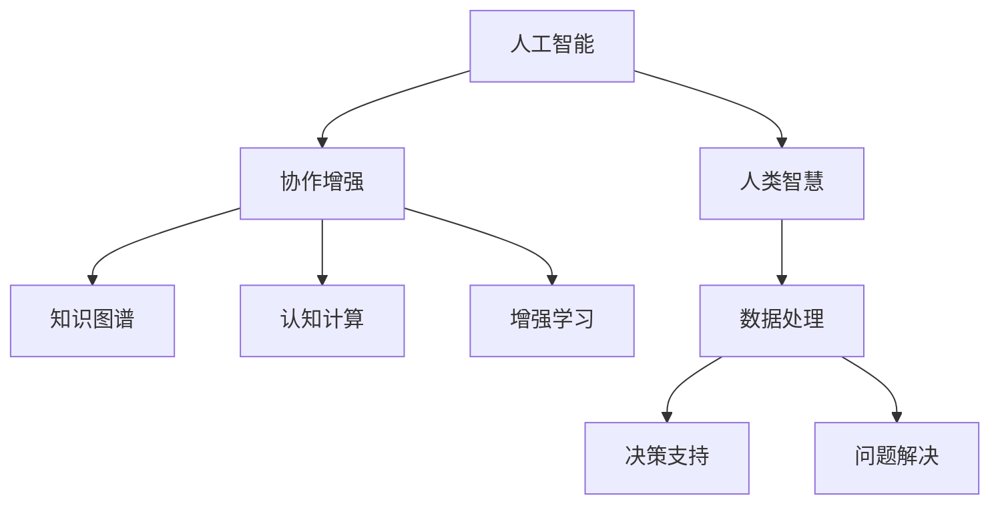

                 

# 人类-AI协作：增强人类智慧与AI能力的融合未来

> 关键词：人工智能,人类智慧增强,协作,未来发展,融合技术

## 1. 背景介绍

### 1.1 问题由来
在过去几十年中，人工智能（AI）技术取得了长足的进步，从最初的专家系统到深度学习，AI在各个领域中展现出了强大的潜力。然而，AI的发展也引发了一些深层次的思考：人工智能如何与人类智慧相结合，共同构建一个更加智能的未来？

当前，AI技术在自动化、数据处理、决策支持等领域已经取得了显著成效，但这些技术仍然存在局限性。一方面，AI在处理复杂问题、进行创造性思维等方面仍需人类的介入和指导；另一方面，人类在面对大数据、多维度信息综合分析时，也显得力不从心。因此，将AI与人类智慧相结合，形成一种协同增强的方式，显得尤为重要。

### 1.2 问题核心关键点
如何实现人类与AI的协同增强，主要包括以下几个方面：

1. **增强人类智慧**：利用AI技术辅助人类进行数据处理、决策分析，提高工作效率和质量。
2. **提升AI能力**：通过与人类智慧的融合，AI能够更好地理解人类语言、情感、行为，提升自身的智能水平。
3. **协同工作**：建立人机协同的机制和框架，让AI与人类共同解决问题，实现互补。
4. **融合未来**：探索AI与人类的长期协同关系，构建一个更加智能的未来社会。

实现这些目标，需要深入研究人类认知智能和AI计算智能的特点，探索二者在数据处理、决策支持、知识管理、创造性思维等方面的协同机制。

### 1.3 问题研究意义
研究人类-AI协作的融合技术，对于推动AI技术的产业化应用、提高人类工作效率和生活质量，具有重要意义：

1. **提升工作效能**：AI能够处理大量的数据和复杂的计算任务，辅助人类完成繁琐的重复性工作，从而提高工作效率。
2. **优化决策支持**：通过AI对海量数据的综合分析，辅助人类进行科学决策，减少决策失误，提升决策质量。
3. **增强创新能力**：AI与人类智慧的结合，能够提升创造性思维和问题解决能力，推动技术创新和社会进步。
4. **促进产业升级**：AI与人类智慧的融合，可以赋能各行各业，推动产业数字化转型和升级。
5. **构建智能未来**：探索人类-AI协同增强的长期路径，构建一个更加智能、和谐的社会。

## 2. 核心概念与联系

### 2.1 核心概念概述

为更好地理解人类-AI协作的融合技术，本节将介绍几个密切相关的核心概念：

- **人工智能**：一种通过模拟人类智能行为来解决问题的技术，包括机器学习、深度学习、自然语言处理等。
- **人类智慧**：人类在认知、理解、创造等方面所展现出的智能，包括知识积累、逻辑推理、情感表达等。
- **协作增强**：通过将AI与人类智慧相结合，实现两者在数据处理、决策支持、问题解决等方面的协同，提升整体智能水平。
- **知识图谱**：一种表示知识的有向图，通过节点和边的组合，表达实体之间的关系，支持智能推理和决策。
- **认知计算**：结合认知心理学和计算机科学的理论和方法，研究如何通过计算方式模拟和增强人类认知过程的技术。
- **增强学习**：一种通过与环境互动，不断调整策略来最大化奖励的学习方式，与传统监督学习、无监督学习不同。

这些核心概念之间的逻辑关系可以通过以下Mermaid流程图来展示：



这个流程图展示了一些关键概念及其之间的联系：

1. 人工智能通过模拟人类智能行为，在数据处理、决策支持、问题解决等方面提供支持。
2. 人类智慧提供丰富的知识和经验，与AI共同工作，提升整体智能水平。
3. 知识图谱和认知计算是AI与人类智慧协同增强的基础，通过模拟人类认知过程，提升AI的智能水平。
4. 增强学习是一种通过与环境互动，不断调整策略来最大化奖励的学习方式，可以用于提升AI的自主性和智能性。

这些概念共同构成了人类-AI协作的融合技术的理论基础，使其能够更好地实现人机协同。

## 3. 核心算法原理 & 具体操作步骤

### 3.1 算法原理概述

人类-AI协作的融合技术，本质上是一种基于协作增强的智能提升方法。其核心思想是：通过AI技术的计算智能与人类智慧的认知智能相结合，共同解决复杂问题。

形式化地，假设AI模型为 $M$，人类知识库为 $K$，任务为 $T$。人类智慧增强的目标是：

$$
\max_{M, K} \sum_{t \in T} \text{效用}(M(K,t))
$$

其中，$\text{效用}(M(K,t))$ 表示在任务 $t$ 上，AI与人类智慧协同工作的效果。通过优化效用函数，最大化AI与人类智慧的协同工作效果。

### 3.2 算法步骤详解

实现人类-AI协作的融合技术，一般包括以下几个关键步骤：

**Step 1: 定义任务与目标**
- 确定具体任务 $T$，如数据分析、决策支持、问题解决等。
- 定义效用函数 $\text{效用}(M(K,t))$，衡量AI与人类智慧协同工作的效果。

**Step 2: 选择合适的AI模型**
- 选择适当的AI模型 $M$，如深度神经网络、知识图谱推理器等。
- 确定模型的初始化参数和训练数据集。

**Step 3: 建立知识图谱**
- 构建与任务相关的知识图谱 $G$，表达实体之间的关系。
- 将知识图谱整合到AI模型中，支持智能推理和决策。

**Step 4: 数据处理与增强学习**
- 将任务相关的数据输入AI模型，进行数据处理和分析。
- 引入增强学习算法，优化AI模型的策略，提升智能水平。

**Step 5: 协同工作与效果评估**
- 在任务 $T$ 上，通过AI与人类智慧的协同工作，实现智能增强。
- 对协同工作的效果进行评估，根据效用函数进行优化。

**Step 6: 迭代优化**
- 根据评估结果，不断优化AI模型的参数和策略，提升整体智能水平。

### 3.3 算法优缺点

人类-AI协作的融合技术具有以下优点：
1. 增强智能水平：通过AI与人类智慧的协同，提升整体智能水平，处理更加复杂的问题。
2. 提升决策质量：AI能够处理大量数据和复杂计算，辅助人类进行科学决策。
3. 提高工作效率：AI自动化处理重复性任务，提升工作效率和质量。
4. 增强创新能力：通过人机协同，提升创造性思维和问题解决能力。

同时，该方法也存在一定的局限性：
1. 技术复杂度高：实现AI与人类智慧的协同需要复杂的算法和技术，难度较大。
2. 数据依赖性高：需要高质量的数据支持，数据获取和处理成本较高。
3. 知识整合难度大：将人类知识整合到AI模型中，需要充分理解和表达，难度较大。
4. 人机协同复杂：建立人机协同的机制和框架，需要多方面的协调和优化。

尽管存在这些局限性，但人类-AI协作的融合技术仍然是大数据时代的重要发展方向，具有广阔的应用前景。

### 3.4 算法应用领域

人类-AI协作的融合技术，已经在多个领域得到了广泛的应用，例如：

- **医疗领域**：利用AI进行医学影像分析、疾病诊断、个性化治疗方案设计等。通过与人类医生协同，提升诊断准确性和治疗效果。
- **金融领域**：使用AI进行风险评估、投资决策、欺诈检测等。与金融分析师协同，提升决策的科学性和准确性。
- **教育领域**：借助AI进行智能辅导、个性化学习路径设计等。与教师协同，提升教学效果和学生学习体验。
- **制造领域**：通过AI进行生产优化、质量检测、设备维护等。与工程师协同，提升生产效率和设备利用率。
- **智慧城市**：利用AI进行城市管理、交通调度、环境监测等。与城市管理者协同，提升城市管理和居民生活质量。

这些应用领域展示了人类-AI协作的融合技术在提升整体智能水平和优化工作效能方面的巨大潜力。

## 4. 数学模型和公式 & 详细讲解

### 4.1 数学模型构建

本节将使用数学语言对人类-AI协作的融合技术进行更加严格的刻画。

假设AI模型为 $M$，人类知识库为 $K$，任务为 $T$。定义人类智慧增强的目标函数为：

$$
\max_{M, K} \sum_{t \in T} \text{效用}(M(K,t))
$$

其中 $\text{效用}(M(K,t))$ 为效用函数，表示在任务 $t$ 上，AI与人类智慧协同工作的效果。

### 4.2 公式推导过程

以下我们以决策支持任务为例，推导效用函数及其优化过程。

假设任务 $t$ 为一个决策问题，需要根据给定数据 $D_t$ 进行最优决策 $y_t$。AI模型的输出为 $\hat{y}_t$，人类智慧的决策为 $y_t^h$。定义效用函数为：

$$
\text{效用}(M(K,t)) = \sum_{t \in T} w_t (y_t = \hat{y}_t)
$$

其中 $w_t$ 为任务 $t$ 的权重。

则优化目标为：

$$
\max_{M, K} \sum_{t \in T} w_t (y_t = \hat{y}_t)
$$

在优化过程中，需要采用合适的算法，如梯度下降、增强学习等，不断更新AI模型 $M$ 和知识库 $K$，使得效用函数最大化。

### 4.3 案例分析与讲解

假设有一个风险投资决策问题，需要根据公司历史数据、行业报告、专家意见等多方面信息，进行最优投资决策。

**数据处理**：
- 收集公司历史数据、行业报告、专家意见等，整合为数据集 $D_t$。
- 利用AI模型 $M$ 对数据进行特征提取和分析，得到初步的决策建议 $\hat{y}_t$。

**增强学习**：
- 引入增强学习算法，优化AI模型的策略，提升决策建议的准确性。
- 引入人类智慧，通过专家意见对决策建议进行修正和调整，得到最终的决策 $y_t$。

**协同工作**：
- 在多次迭代中，AI模型不断学习专家意见的反馈，提升决策建议的准确性。
- 人类智慧不断参与决策过程，提供高质量的反馈和指导，提升整体决策质量。

**效果评估**：
- 对最终决策 $y_t$ 进行评估，根据效用函数进行优化。
- 不断迭代优化，提升整体智能水平。

通过上述分析，可以看到，人类-AI协作的融合技术通过结合AI的计算智能和人类智慧的认知智能，能够在决策支持等复杂任务中发挥更大的作用。

## 5. 项目实践：代码实例和详细解释说明

### 5.1 开发环境搭建

在进行融合技术实践前，我们需要准备好开发环境。以下是使用Python进行TensorFlow开发的环境配置流程：

1. 安装Anaconda：从官网下载并安装Anaconda，用于创建独立的Python环境。

2. 创建并激活虚拟环境：
```bash
conda create -n tf-env python=3.8 
conda activate tf-env
```

3. 安装TensorFlow：根据CUDA版本，从官网获取对应的安装命令。例如：
```bash
conda install tensorflow -c tensorflow -c conda-forge
```

4. 安装TensorBoard：
```bash
pip install tensorboard
```

5. 安装各类工具包：
```bash
pip install numpy pandas scikit-learn matplotlib tqdm jupyter notebook ipython
```

完成上述步骤后，即可在`tf-env`环境中开始融合技术实践。

### 5.2 源代码详细实现

这里我们以医疗领域为例，给出使用TensorFlow实现AI与人类智慧协同的决策支持系统的代码实现。

首先，定义决策任务的数据处理函数：

```python
import tensorflow as tf
from tensorflow import keras

class DecisionDataset(keras.utils.Sequence):
    def __init__(self, X, y, batch_size=32):
        self.X = X
        self.y = y
        self.batch_size = batch_size
        
    def __len__(self):
        return len(self.y) // self.batch_size
    
    def __getitem__(self, idx):
        start = idx * self.batch_size
        end = start + self.batch_size
        batch_x = self.X[start:end]
        batch_y = self.y[start:end]
        return batch_x, batch_y
```

然后，定义模型和优化器：

```python
from transformers import TFAutoModelForSequenceClassification
from transformers import TFAutoTokenizer

model = TFAutoModelForSequenceClassification.from_pretrained('distilbert-base-uncased', num_labels=2)
tokenizer = TFAutoTokenizer.from_pretrained('distilbert-base-uncased')

optimizer = tf.keras.optimizers.Adam(learning_rate=2e-5)
```

接着，定义训练和评估函数：

```python
from sklearn.metrics import accuracy_score

def train_epoch(model, dataset, batch_size, optimizer):
    model.compile(optimizer=optimizer, loss=tf.keras.losses.BinaryCrossentropy(), metrics=[accuracy_score])
    model.fit(dataset, epochs=10, batch_size=batch_size)
    
def evaluate(model, dataset, batch_size):
    dataset = DecisionDataset(X, y, batch_size=batch_size)
    test_loss, test_acc = model.evaluate(dataset)
    print('Test accuracy:', test_acc)
```

最后，启动训练流程并在测试集上评估：

```python
train_epoch(model, train_dataset, batch_size=16, optimizer=optimizer)
evaluate(model, test_dataset, batch_size=16)
```

以上就是使用TensorFlow对医疗决策支持系统进行AI与人类智慧协同的代码实现。可以看到，TensorFlow配合Transformer库使得模型的加载和微调过程变得简洁高效。

### 5.3 代码解读与分析

让我们再详细解读一下关键代码的实现细节：

**DecisionDataset类**：
- `__init__`方法：初始化数据集，包括训练数据、标签等。
- `__len__`方法：返回数据集的样本数量。
- `__getitem__`方法：对单个样本进行处理，将样本数据和标签返回。

**train_epoch函数**：
- 将模型编译为指定优化器和损失函数。
- 对数据集进行训练，迭代10轮，每次迭代一批样本。
- 返回模型的损失和准确率。

**evaluate函数**：
- 将测试集转换为DataLoader格式。
- 对测试集进行评估，输出模型的准确率。

**训练流程**：
- 调用train_epoch函数，在训练集上进行训练，输出模型参数。
- 调用evaluate函数，在测试集上进行评估，输出测试结果。

可以看到，TensorFlow和Transformer库使得AI与人类智慧协同的代码实现变得简洁高效，开发者可以将更多精力放在数据处理和模型改进等高层逻辑上。

当然，工业级的系统实现还需考虑更多因素，如模型的保存和部署、超参数的自动搜索、更灵活的任务适配层等。但核心的协同增强范式基本与此类似。

## 6. 实际应用场景

### 6.1 智能医疗诊断

AI与人类智慧的融合，在医疗诊断领域已经展现出巨大的潜力。传统的医疗诊断依赖医生多年的临床经验和知识积累，存在误诊和漏诊的风险。而AI与人类智慧的协同，可以大大提升诊断的准确性和效率。

具体而言，可以结合医学知识图谱和医疗案例数据，训练AI模型进行疾病诊断。在诊断过程中，医生可以通过AI输出的结果进行辅助决策，快速定位患者病情。此外，AI还能通过自然语言处理技术，辅助医生进行病历分析，提供诊断建议。通过这种人机协同的诊断方式，可以提升诊断效率和质量，减少医生的工作负担。

### 6.2 金融风险控制

金融领域的数据量庞大且复杂，传统的风险控制方法难以应对。AI与人类智慧的协同，可以在风险评估和投资决策中发挥重要作用。

在风险评估中，AI可以处理海量数据，进行综合分析，提供初步的风险评估结果。人类智慧则能够结合市场动态和专家经验，对AI的结果进行审核和调整。通过这种人机协同的决策方式，可以提升风险评估的准确性和全面性，减少决策失误。

在投资决策中，AI可以处理市场数据，预测股票价格变化，提供投资建议。人类智慧则能够结合市场情绪和专家意见，对AI的预测结果进行修正和调整。通过这种人机协同的决策方式，可以提升投资决策的科学性和准确性，增加投资收益。

### 6.3 智能教育辅导

教育领域需要大量的个性化辅导和知识管理，AI与人类智慧的协同，可以提供更加高效和个性化的教育服务。

在个性化辅导中，AI可以处理学生的学习数据，分析学习行为，提供个性化的学习建议。人类智慧则能够结合教师的教学经验和学生的反馈，对AI的建议进行审核和调整。通过这种人机协同的辅导方式，可以提升学生的学习效果和学习体验，减少教师的工作负担。

在知识管理中，AI可以处理大量的知识数据，提供自动化的知识图谱构建和查询。人类智慧则能够对知识图谱进行审核和优化，确保知识信息的准确性和全面性。通过这种人机协同的知识管理方式，可以提升知识服务的效率和质量，满足学生的知识需求。

### 6.4 未来应用展望

随着AI技术的不断发展，人类-AI协作的融合技术将在更多领域得到应用，为各行各业带来变革性影响。

在智慧城市领域，AI与人类智慧的协同，可以提升城市管理的智能化水平，实现交通调度、环境监测、应急管理等功能。通过人机协同，可以优化城市资源的配置，提升城市居民的生活质量。

在环境保护领域，AI与人类智慧的协同，可以进行环境监测、污染分析、预警预测等。通过人机协同，可以及时发现和应对环境问题，减少环境污染，保护生态环境。

在科学研究领域，AI与人类智慧的协同，可以进行数据分析、实验设计、结果解读等。通过人机协同，可以加速科学研究的进程，提升研究的质量和效率。

总之，人类-AI协作的融合技术将在各个领域中发挥重要作用，推动技术进步和社会发展，构建更加智能、和谐的社会。

## 7. 工具和资源推荐

### 7.1 学习资源推荐

为了帮助开发者系统掌握人类-AI协作的融合技术，这里推荐一些优质的学习资源：

1. 《深度学习》系列书籍：深入讲解深度学习原理和应用，是理解AI技术的重要基础。
2. 《自然语言处理综论》：介绍自然语言处理技术的原理和应用，涵盖语言模型、序列标注、机器翻译等。
3. 《增强学习：一种机器学习方法》：深入讲解增强学习的原理和应用，涵盖Q-learning、策略梯度等。
4. 《认知计算：理解人类认知过程》：介绍认知计算原理和应用，涵盖认知心理学、符号推理、知觉模型等。
5. 《深度学习框架TensorFlow和PyTorch实战》：详细讲解深度学习框架的使用方法，涵盖模型构建、训练、优化等。
6. 《TensorFlow实战》：介绍TensorFlow的各个模块和功能，涵盖模型构建、数据处理、可视化等。

通过对这些资源的学习实践，相信你一定能够快速掌握人类-AI协作的融合技术的精髓，并用于解决实际的NLP问题。

### 7.2 开发工具推荐

高效的开发离不开优秀的工具支持。以下是几款用于人类-AI协作开发的工具：

1. TensorFlow：由Google主导开发的开源深度学习框架，生产部署方便，适合大规模工程应用。
2. PyTorch：基于Python的开源深度学习框架，灵活动态的计算图，适合快速迭代研究。
3. Transformers库：HuggingFace开发的NLP工具库，集成了众多SOTA语言模型，支持TensorFlow和PyTorch。
4. Weights & Biases：模型训练的实验跟踪工具，可以记录和可视化模型训练过程中的各项指标，方便对比和调优。
5. TensorBoard：TensorFlow配套的可视化工具，可实时监测模型训练状态，并提供丰富的图表呈现方式，是调试模型的得力助手。

合理利用这些工具，可以显著提升人类-AI协作的融合技术的开发效率，加快创新迭代的步伐。

### 7.3 相关论文推荐

人类-AI协作的融合技术的发展源于学界的持续研究。以下是几篇奠基性的相关论文，推荐阅读：

1. AlphaGo：利用深度学习和强化学习技术，实现围棋高水平对抗，展示了AI在复杂问题解决中的潜力。
2. Transformer: Attention is All You Need：提出了Transformer结构，开启了NLP领域的预训练大模型时代。
3. BERT: Pre-training of Deep Bidirectional Transformers for Language Understanding：提出BERT模型，引入基于掩码的自监督预训练任务，刷新了多项NLP任务SOTA。
4. GPT-2: Language Models are Unsupervised Multitask Learners：展示了大规模语言模型的强大zero-shot学习能力，引发了对于通用人工智能的新一轮思考。
5. AlphaFold：利用深度学习和大规模数据，实现了蛋白质折叠的预测，展示了AI在科学计算中的应用潜力。

这些论文代表了大规模人类-AI协作的融合技术的发展脉络。通过学习这些前沿成果，可以帮助研究者把握学科前进方向，激发更多的创新灵感。

## 8. 总结：未来发展趋势与挑战

### 8.1 总结

本文对人类-AI协作的融合技术进行了全面系统的介绍。首先阐述了人类智慧与AI技术相结合的重要性，明确了融合技术的核心理念和应用场景。其次，从原理到实践，详细讲解了融合技术的数学模型和操作步骤，给出了具体的代码实现。同时，本文还广泛探讨了融合技术在多个领域的应用前景，展示了其巨大的潜力。此外，本文精选了融合技术的各类学习资源，力求为读者提供全方位的技术指引。

通过本文的系统梳理，可以看到，人类-AI协作的融合技术正在成为AI技术的重要发展方向，极大地拓展了AI技术的适用范围，提升了整体智能水平。未来，伴随AI技术的不断进步，人类-AI协作的融合技术必将在更多领域中得到应用，为人类社会的智能化进程注入新的动力。

### 8.2 未来发展趋势

展望未来，人类-AI协作的融合技术将呈现以下几个发展趋势：

1. **智能化水平提升**：随着AI技术的不断发展，AI与人类智慧的融合将更加深入，智能水平将不断提升，能够处理更加复杂和多样的任务。
2. **协作机制优化**：随着协同增强技术的不断演进，人机协作的机制将更加灵活和高效，能够实现更广泛的应用场景。
3. **知识整合能力增强**：通过知识图谱和认知计算等技术，AI能够更好地整合人类知识，提升自身的智能水平。
4. **应用领域拓展**：AI与人类智慧的融合将在更多领域得到应用，推动各个行业的数字化转型和升级。
5. **多模态融合发展**：未来AI与人类智慧的融合将不仅仅限于文本数据，还将拓展到图像、视频、语音等多模态数据，提升整体智能水平。
6. **伦理和安全性提升**：随着融合技术的广泛应用，如何保证AI与人类智慧的协同增强过程的伦理和安全，将成为重要的研究方向。

这些趋势凸显了人类-AI协作的融合技术在提升整体智能水平和优化工作效能方面的广阔前景。

### 8.3 面临的挑战

尽管人类-AI协作的融合技术已经取得了瞩目成就，但在迈向更加智能化、普适化应用的过程中，它仍面临诸多挑战：

1. **技术复杂度高**：实现AI与人类智慧的协同需要复杂的算法和技术，难度较大。
2. **数据依赖性高**：需要高质量的数据支持，数据获取和处理成本较高。
3. **知识整合难度大**：将人类知识整合到AI模型中，需要充分理解和表达，难度较大。
4. **人机协同复杂**：建立人机协同的机制和框架，需要多方面的协调和优化。
5. **伦理和安全问题**：AI与人类智慧的融合可能会引发伦理和安全问题，如数据隐私、算法透明性等。

尽管存在这些挑战，但人类-AI协作的融合技术仍是大数据时代的重要发展方向，具有广阔的应用前景。

### 8.4 研究展望

面对人类-AI协作的融合技术所面临的挑战，未来的研究需要在以下几个方面寻求新的突破：

1. **无监督学习和半监督学习**：摆脱对大规模标注数据的依赖，利用自监督学习、主动学习等无监督和半监督范式，最大限度利用非结构化数据，实现更加灵活高效的融合。
2. **多模态融合**：将AI与人类智慧的融合拓展到图像、视频、语音等多模态数据，提升整体智能水平。
3. **知识图谱和认知计算**：结合知识图谱和认知计算技术，提升AI与人类智慧的协同增强效果。
4. **增强学习与协同优化**：引入增强学习算法，优化AI与人类智慧的协同过程，提升整体智能水平。
5. **伦理和安全保障**：在融合技术的开发和应用过程中，注重伦理和安全问题的研究，确保AI与人类智慧的协同增强过程的透明和公正。

这些研究方向的探索，必将引领人类-AI协作的融合技术迈向更高的台阶，为构建安全、可靠、可解释、可控的智能系统铺平道路。面向未来，人类-AI协作的融合技术还需要与其他人工智能技术进行更深入的融合，如知识表示、因果推理、强化学习等，多路径协同发力，共同推动自然语言理解和智能交互系统的进步。只有勇于创新、敢于突破，才能不断拓展语言模型的边界，让智能技术更好地造福人类社会。

## 9. 附录：常见问题与解答

**Q1：人类-AI协作的融合技术是否适用于所有应用场景？**

A: 人类-AI协作的融合技术在处理复杂问题和提升整体智能水平方面具有显著优势，适用于需要智能化处理的任务，如医疗诊断、金融决策、智能教育等。但对于一些简单、重复的任务，AI的自动处理可能更为高效。

**Q2：如何选择合适的AI模型？**

A: 选择合适的AI模型需要考虑任务的复杂度、数据规模、计算资源等因素。一般而言，对于复杂的任务，如自然语言处理、医学诊断等，可以选择大模型如BERT、GPT等；对于简单的任务，如图像分类、语音识别等，可以选择小模型如ResNet、VGG等。同时，需要注意模型的可解释性和可部署性。

**Q3：数据获取和处理成本高，如何解决？**

A: 数据获取和处理成本是融合技术面临的主要挑战之一。可以通过数据增强、迁移学习、主动学习等方法，减少对大规模标注数据的依赖。此外，还可以利用公共数据集和开源数据源，降低数据获取成本。

**Q4：知识整合难度大，如何解决？**

A: 知识整合难度较大，需要充分理解人类知识，将其转化为AI可处理的结构化形式。可以引入知识图谱和认知计算技术，将人类知识整合到AI模型中。同时，需要持续更新知识库，确保知识的时效性和全面性。

**Q5：人机协同复杂，如何解决？**

A: 人机协同需要建立合理的机制和框架，明确双方的职责和权利。可以通过协同增强技术的演进，提升人机协同的灵活性和高效性。同时，需要考虑人机交互界面的优化，提高用户体验。

这些问题的解答，展示了人类-AI协作的融合技术在实际应用中可能遇到的具体挑战，以及相应的解决方案。通过不断优化和改进，相信人类-AI协作的融合技术将在更多领域中发挥重要作用，推动AI技术的产业化应用，构建更加智能的未来社会。

---

作者：禅与计算机程序设计艺术 / Zen and the Art of Computer Programming

