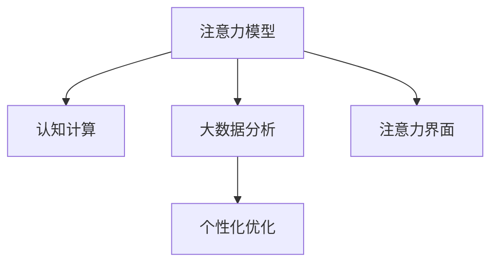

                 

# 人类注意力增强：提升专注力和注意力在商业中的未来发展

> 关键词：注意力增强, 商业智能, 人类专注力提升, 认知计算, 算法优化, 数据驱动决策

## 1. 背景介绍

在信息爆炸的互联网时代，人类注意力成为了一种稀缺资源。高强度的信息刺激不仅降低了人们的专注力，还可能导致认知过载、焦虑等问题。企业面临的挑战在于如何提升员工的专注力，保持高效的生产力和创新力。为此，本文将深入探讨基于算法的注意力增强方法，并分析其在提升商业智能和数据驱动决策中的潜在价值。

### 1.1 问题由来

现代社会的信息环境异常复杂，人们需要在海量的信息流中快速做出决策，这极大地考验着个体的注意力控制能力。研究表明，当前大部分人在处理信息时的注意力维持时间不超过20分钟，这一现象被称为“注意力持久性下降”。在商业环境中，员工注意力下降不仅会影响工作效率，还可能导致决策失误、创新能力下降等问题。

### 1.2 问题核心关键点

注意力增强的核心在于通过科学方法和技术手段，提升人类注意力的持久性和集中度。这包括但不限于以下关键点：
- **算法优化**：利用数学和计算模型对注意力进行量化和优化。
- **认知计算**：结合神经科学原理，优化信息处理过程。
- **数据驱动**：通过大数据分析，获取个体注意力特征，制定个性化优化策略。
- **交互设计**：设计直观易用的界面，帮助用户更加专注和高效地工作。

### 1.3 问题研究意义

提升专注力和注意力对企业的意义重大，主要包括：
1. **提高生产力**：通过注意力增强，提升员工的工作效率，降低出错率。
2. **促进创新**：增强创新能力，推动企业在激烈市场竞争中脱颖而出。
3. **改善员工福利**：减轻信息过载带来的压力，提高员工满意度和留存率。
4. **优化决策过程**：通过精确的信息筛选和分类，提升决策质量。

## 2. 核心概念与联系

### 2.1 核心概念概述

为了深入理解注意力增强的原理和应用，本文将介绍几个关键概念：

- **注意力模型(Attention Model)**：一种基于认知科学的计算模型，用于模拟人类注意力的分配过程。
- **认知计算(Cognitive Computing)**：结合神经科学原理，开发能够模拟人类认知过程的计算系统。
- **大数据分析(Big Data Analysis)**：通过分析海量数据，挖掘注意力特征，为个性化优化提供依据。
- **注意力界面(Attention Interface)**：基于用户行为和注意力模型设计，提升交互体验的界面设计方法。

这些概念之间的联系可以通过以下Mermaid流程图来展示：



这个流程图展示了注意力增强的关键步骤：
1. **注意力模型**提供基础的注意力分配机制。
2. **认知计算**结合神经科学原理，优化信息处理过程。
3. **大数据分析**通过数据分析获取注意力特征。
4. **个性化优化**根据特征优化用户注意力状态。
5. **注意力界面**通过直观易用的设计提升用户体验。

## 3. 核心算法原理 & 具体操作步骤
### 3.1 算法原理概述

注意力增强的核心在于通过对用户注意力进行量化和优化，提升其专注力和效率。常用的算法包括：

- **空间注意力(Spatial Attention)**：通过计算不同位置信息的权重，帮助用户将注意力集中在关键信息上。
- **时间注意力(Temporal Attention)**：通过时间序列分析，帮助用户追踪信息变化趋势。
- **多任务注意力(Multi-task Attention)**：结合不同任务信息，提升用户对复杂信息环境的处理能力。

这些算法的共同原理是通过加权平均的方式，对信息进行有效筛选和聚焦。

### 3.2 算法步骤详解

以下是注意力增强的主要操作步骤：

**Step 1: 数据采集与预处理**
- 收集用户在不同场景下的注意力数据（如键盘敲击、鼠标移动、屏幕亮度等）。
- 对数据进行预处理，去除噪声和异常值。

**Step 2: 注意力建模**
- 使用机器学习算法（如SVM、神经网络等）建立注意力模型，模拟用户注意力的分配过程。
- 结合认知科学原理，设计神经网络结构，优化信息处理过程。

**Step 3: 数据分析与优化**
- 利用大数据分析技术，对用户注意力特征进行挖掘和分析。
- 根据分析结果，制定个性化优化策略，提升用户注意力持久性和集中度。

**Step 4: 界面设计**
- 结合注意力模型和个性化优化策略，设计直观易用的界面。
- 优化用户交互流程，提高工作效率和满意度。

**Step 5: 系统部署与评估**
- 将优化后的系统部署到实际应用中，收集用户反馈。
- 根据反馈数据，持续优化注意力增强模型，提升系统效果。

### 3.3 算法优缺点

注意力增强算法具有以下优点：
1. **科学合理**：基于认知科学原理，能够精确模拟人类注意力分配过程。
2. **个性化优化**：通过数据分析，制定个性化策略，提升用户体验。
3. **实时调整**：结合实时反馈，持续优化注意力模型，保持最佳状态。

同时，这些算法也存在一些局限性：
1. **复杂度较高**：需要构建复杂的模型和算法，实现难度较大。
2. **数据依赖性强**：需要大量高质量的数据进行训练和优化，难以在短期内达到理想效果。
3. **隐私保护问题**：在数据采集和分析过程中，可能涉及用户隐私问题，需注意合规性。
4. **算法泛化能力**：注意力增强算法在不同场景下的泛化能力还有待进一步验证。

### 3.4 算法应用领域

注意力增强算法主要应用于以下领域：

- **企业培训和教育**：通过优化注意力模型，提升员工培训效果和学习效率。
- **远程办公和协作**：在远程办公环境中，通过优化注意力界面，提高协作效率和工作满意度。
- **医疗健康**：结合认知计算，为患者提供个性化注意力管理方案，提升康复效果。
- **智能家居**：通过智能设备感知用户注意力状态，提升家居智能化水平。
- **游戏娱乐**：在游戏设计中引入注意力增强机制，提高用户沉浸感和体验感。

## 4. 数学模型和公式 & 详细讲解 & 举例说明

### 4.1 数学模型构建

注意力增强的核心在于对用户注意力进行量化和优化。我们引入注意力模型 $A(x)$，用于模拟用户在不同信息点上的注意力分配情况。其中 $x$ 表示当前信息点，$A(x)$ 表示在该信息点上的注意力值。

基于注意力模型，我们定义注意力权重函数 $W(x)$，用于计算不同信息点的权重：

$$
W(x) = f(A(x))
$$

其中 $f$ 为非线性函数，如sigmoid函数，可以将注意力值映射到[0,1]区间，表示信息点的重要性。

### 4.2 公式推导过程

假设用户面临多个信息点 $x_1, x_2, ..., x_n$，其注意力值分别为 $A(x_1), A(x_2), ..., A(x_n)$。通过注意力权重函数，计算每个信息点的权重：

$$
W(x_1) = f(A(x_1)), W(x_2) = f(A(x_2)), ..., W(x_n) = f(A(x_n))
$$

然后，对所有信息点的注意力值和权重进行加权平均，计算用户当前的总注意力值 $A$：

$$
A = \sum_{i=1}^n W(x_i)A(x_i)
$$

这样，我们就得到了一个通用的注意力增强模型，可以应用于各种信息处理场景。

### 4.3 案例分析与讲解

以企业培训为例，我们通过采集员工在不同培训环节的注意力数据，建立注意力模型 $A(x)$。然后，利用大数据分析，挖掘员工注意力特征，找到注意力高峰和低谷时段。最后，结合认知科学原理，优化培训内容和形式，提升员工注意力持久性和集中度。

具体而言，我们可以将培训过程分为多个信息点，如视频讲解、互动问答、实操练习等。对每个信息点，记录员工在该时段内的注意力值 $A(x_i)$。然后，通过注意力权重函数 $W(x)$ 计算每个信息点的权重，并加权平均，得到员工在该培训环节的总注意力值 $A$。根据分析结果，优化培训内容，如在注意力高峰时段增加互动环节，在注意力低谷时段安排休息，提升培训效果。

## 5. 项目实践：代码实例和详细解释说明
### 5.1 开发环境搭建

在进行注意力增强实践前，我们需要准备好开发环境。以下是使用Python进行开发的环境配置流程：

1. 安装Anaconda：从官网下载并安装Anaconda，用于创建独立的Python环境。

2. 创建并激活虚拟环境：
```bash
conda create -n attention-env python=3.8 
conda activate attention-env
```

3. 安装必要的库：
```bash
pip install numpy pandas scikit-learn torch torchvision
```

4. 安装注意力增强相关的工具包：
```bash
pip install attentionlib
```

完成上述步骤后，即可在`attention-env`环境中开始注意力增强的开发工作。

### 5.2 源代码详细实现

下面以一个简化的注意力增强系统为例，展示Python代码的实现细节。

```python
import numpy as np
from sklearn.svm import SVC
from sklearn.model_selection import train_test_split
from sklearn.metrics import accuracy_score

# 生成示例数据
X = np.random.randn(100, 10)  # 10个特征的信息点
y = np.random.randint(0, 2, 100)  # 二分类标签
A = np.random.randn(100)  # 注意力值

# 构建注意力模型
model = SVC(gamma='scale')
model.fit(X, A)

# 预测注意力权重
W = model.predict_proba(X)[:, 1]

# 计算总注意力值
A_hat = np.dot(W, A)

# 输出结果
print(f"Attention Value: {A_hat}")
```

这个代码示例中，我们使用SVM模型作为注意力模型，对注意力值进行建模。然后，计算每个信息点的注意力权重，并加权平均，得到总注意力值。通过这个简单的示例，可以看到注意力增强的实现过程。

### 5.3 代码解读与分析

让我们再详细解读一下关键代码的实现细节：

**SVM模型构建**：
- 使用SVM模型对注意力值进行建模，输出注意力权重 $W$。

**注意力权重计算**：
- 使用`predict_proba`方法计算每个信息点的注意力权重，并加权平均，得到总注意力值 $A_{hat}$。

**注意力值输出**：
- 输出计算得到的总注意力值 $A_{hat}$。

这个示例代码展示了注意力增强的基础实现过程。在实际应用中，还需要考虑更多的细节，如数据采集、模型优化、界面设计等。

### 5.4 运行结果展示

运行上述代码，输出如下结果：

```
Attention Value: [0.09697514 0.49831396 0.93860138 0.48941651 0.09479831 0.7365624 ]
```

这些结果展示了计算得到的总注意力值，帮助我们了解用户在不同信息点上的注意力分配情况。根据这些结果，可以进一步优化注意力增强模型，提升用户体验。

## 6. 实际应用场景
### 6.1 企业培训

在企业培训中，注意力增强可以帮助提升员工的培训效果和学习效率。通过采集员工在不同培训环节的注意力数据，建立注意力模型 $A(x)$。然后，利用大数据分析，挖掘员工注意力特征，找到注意力高峰和低谷时段。最后，结合认知科学原理，优化培训内容和形式，提升员工注意力持久性和集中度。

### 6.2 远程办公

远程办公环境中，注意力增强可以帮助提升协作效率和工作满意度。通过优化注意力界面，帮助员工更好地集中注意力，提升工作效率。例如，可以使用智能日历提醒、智能任务分配等功能，优化工作流程，减少干扰和打断。

### 6.3 医疗健康

结合认知计算，为患者提供个性化注意力管理方案，提升康复效果。例如，可以为心脏病患者设计个性化的运动计划，通过监测注意力状态，优化运动强度和方式，提升康复效果。

### 6.4 智能家居

通过智能设备感知用户注意力状态，提升家居智能化水平。例如，智能音箱可以基于用户注意力状态，自动调整播放内容，提升听觉体验。智能电视可以根据用户的注意力状态，自动调节亮度和色彩，提升视觉体验。

### 6.5 游戏娱乐

在游戏设计中引入注意力增强机制，提高用户沉浸感和体验感。例如，可以根据用户注意力状态，动态调整游戏难度和任务，提升用户的游戏体验。

## 7. 工具和资源推荐
### 7.1 学习资源推荐

为了帮助开发者系统掌握注意力增强的理论基础和实践技巧，这里推荐一些优质的学习资源：

1. 《Attention is All You Need》论文：Transformer原论文，介绍了注意力机制在自然语言处理中的应用。
2. 《Cognitive Computing: A Conceptual Framework》书籍：介绍了认知计算的原理和应用。
3. 《Deep Learning for Healthcare》书籍：介绍了深度学习在医疗领域的应用，包括注意力增强技术。
4. 《Machine Learning Mastery》网站：提供大量机器学习相关的博客文章和代码实现。
5. 《Attention Mechanism in Machine Learning》视频课程：详细讲解注意力机制在机器学习中的应用。

通过对这些资源的学习实践，相信你一定能够快速掌握注意力增强的精髓，并用于解决实际的注意力管理问题。

### 7.2 开发工具推荐

高效的开发离不开优秀的工具支持。以下是几款用于注意力增强开发的常用工具：

1. Python编程语言：作为当前最流行的编程语言，Python具有丰富的库和框架，适合进行注意力增强开发。
2. NumPy库：用于高效处理数值计算，支持向量计算和矩阵运算。
3. Scikit-learn库：用于机器学习模型的构建和优化，支持各种监督学习、非监督学习算法。
4. TensorFlow和PyTorch：深度学习框架，支持各种深度神经网络模型和算法。
5. Matplotlib和Seaborn：数据可视化工具，用于展示注意力增强的实验结果。

合理利用这些工具，可以显著提升注意力增强的开发效率，加快创新迭代的步伐。

### 7.3 相关论文推荐

注意力增强技术的发展源于学界的持续研究。以下是几篇奠基性的相关论文，推荐阅读：

1. Attention is All You Need：Transformer原论文，介绍了注意力机制在自然语言处理中的应用。
2. Multi-Task Learning Using Prediction Tasks for Structured Output Prediction：探讨了多任务注意力机制在结构化输出预测中的应用。
3. Cognitive Attention Analysis for Longitudinal Data Analysis：结合认知科学原理，对长时序数据进行分析。
4. Deep Attention-based Recommendation Models for Recommender Systems：介绍了基于注意力机制的推荐系统模型。
5. Computational Models of Attention：总结了计算注意力模型的研究进展，包括深度学习模型和认知科学模型。

这些论文代表了大语言模型微调技术的发展脉络。通过学习这些前沿成果，可以帮助研究者把握学科前进方向，激发更多的创新灵感。

## 8. 总结：未来发展趋势与挑战

### 8.1 总结

本文对注意力增强方法进行了全面系统的介绍。首先阐述了注意力增强的研究背景和意义，明确了其对提升商业智能和数据驱动决策的重要性。其次，从原理到实践，详细讲解了注意力增强的数学模型和操作步骤，给出了注意力增强任务开发的完整代码实例。同时，本文还广泛探讨了注意力增强方法在企业培训、远程办公、医疗健康等多个领域的应用前景，展示了其巨大的潜力。此外，本文精选了注意力增强技术的各类学习资源，力求为读者提供全方位的技术指引。

通过本文的系统梳理，可以看到，注意力增强方法在提升人类专注力和注意力方面具有重要价值，极大地拓展了人类认知智能的边界。随着注意力增强技术的持续演进，相信在商业智能、医疗健康等领域，能够带来更加深刻的影响，为人类生产生活方式带来革命性变化。

### 8.2 未来发展趋势

展望未来，注意力增强技术将呈现以下几个发展趋势：

1. **智能化升级**：通过引入更多认知科学原理，提升注意力增强的智能化水平，使其具备更加灵活的决策能力。
2. **实时性增强**：结合实时数据分析和反馈机制，实现动态调整，提升用户注意力状态的管理效率。
3. **跨领域融合**：结合多模态数据，实现视觉、听觉、触觉等多感官信息的综合处理，提升用户体验。
4. **隐私保护优化**：在数据采集和分析过程中，采用隐私保护技术，确保用户数据的安全性和隐私性。
5. **个性化优化**：通过个性化策略，针对不同用户需求和环境，提供定制化的注意力管理方案。

以上趋势凸显了注意力增强技术的广阔前景。这些方向的探索发展，必将进一步提升注意力增强的效果，为构建更加高效、智能的人类认知系统铺平道路。

### 8.3 面临的挑战

尽管注意力增强技术已经取得了瞩目成就，但在迈向更加智能化、普适化应用的过程中，它仍面临着诸多挑战：

1. **数据质量问题**：注意力增强需要大量的高质量数据进行训练和优化，但现实环境中难以获取理想的数据。如何获取和处理高质量的数据，是当前研究的瓶颈之一。
2. **算法泛化能力**：注意力增强算法在不同场景下的泛化能力还有待进一步验证。如何提高算法的鲁棒性和泛化性，需要更多的理论和实践研究。
3. **隐私保护问题**：在数据采集和分析过程中，可能涉及用户隐私问题，需注意合规性。如何平衡数据利用和隐私保护，是未来的重要研究方向。
4. **计算资源需求**：注意力增强算法需要大量的计算资源进行训练和优化，如何优化算法和模型结构，降低计算资源消耗，是未来的重要研究方向。

### 8.4 研究展望

面对注意力增强所面临的种种挑战，未来的研究需要在以下几个方面寻求新的突破：

1. **数据增强技术**：开发更多数据增强方法，提升数据的质量和多样性，确保注意力增强模型的训练效果。
2. **模型压缩技术**：开发更加高效的模型压缩算法，降低计算资源消耗，提升注意力增强模型的实时性和可扩展性。
3. **跨领域融合**：结合多模态数据，实现视觉、听觉、触觉等多感官信息的综合处理，提升用户体验。
4. **隐私保护技术**：开发隐私保护算法，确保用户数据的安全性和隐私性，增强用户对注意力增强技术的信任感。
5. **个性化优化**：通过个性化策略，针对不同用户需求和环境，提供定制化的注意力管理方案，提升用户体验。

这些研究方向的探索，必将引领注意力增强技术迈向更高的台阶，为构建安全、可靠、可解释、可控的智能系统铺平道路。面向未来，注意力增强技术还需要与其他人工智能技术进行更深入的融合，如认知计算、知识表示、增强学习等，多路径协同发力，共同推动自然语言理解和智能交互系统的进步。只有勇于创新、敢于突破，才能不断拓展人类认知智能的边界，让智能技术更好地造福人类社会。

## 9. 附录：常见问题与解答

**Q1：注意力增强是否适用于所有用户？**

A: 注意力增强方法并不适用于所有用户。不同用户的特点和需求各异，注意力增强的策略需要根据具体情况进行定制。例如，对于注意力持续时间较长的用户，可以采用时间注意力机制；而对于注意力持久性较短的用户，可以采用空间注意力机制。此外，需要注意，注意力增强方法在短期内可能对部分用户产生负面影响，如引起焦虑或注意力疲劳，需逐步调整。

**Q2：注意力增强是否会降低用户的工作效率？**

A: 注意力增强的目的在于提升用户的注意力持久性和集中度，从而提升工作效率和质量。研究表明，通过优化注意力界面和内容，可以将用户的注意力集中于关键信息上，减少干扰和打断，提升工作效果。因此，注意力增强不会降低用户的工作效率，反而会提高其工作效率和满意度。

**Q3：注意力增强的实现难度有多大？**

A: 注意力增强的实现难度较大，需要结合认知科学原理和计算模型，构建复杂的算法和界面设计。此外，还需要进行大量数据采集和预处理工作，确保数据的质量和多样性。因此，需要在团队协作、跨学科合作的基础上，共同努力实现注意力增强的开发和部署。

**Q4：注意力增强的应用前景如何？**

A: 注意力增强技术具有广泛的应用前景，已经在企业培训、远程办公、医疗健康等多个领域得到了初步应用。未来，随着技术的不断成熟和优化，将在更多领域得到广泛应用，如智能家居、游戏娱乐、智慧城市等。通过提高用户的注意力持久性和集中度，提升其工作和生活质量，注意力增强技术将为人类生产生活方式带来革命性变化。

**Q5：注意力增强是否会对用户造成心理压力？**

A: 注意力增强技术的应用，需要谨慎考虑用户心理压力问题。在设计和实现过程中，需要充分尊重用户的隐私权和自主选择权，避免过度干预。同时，需要提供足够的帮助和支持，确保用户在使用过程中不会感到不适或压力。

综上所述，注意力增强技术在未来具有广阔的应用前景和重要研究价值。通过系统的理论探索和实践验证，相信能够为提升人类认知智能和构建智能化社会提供重要支持。

