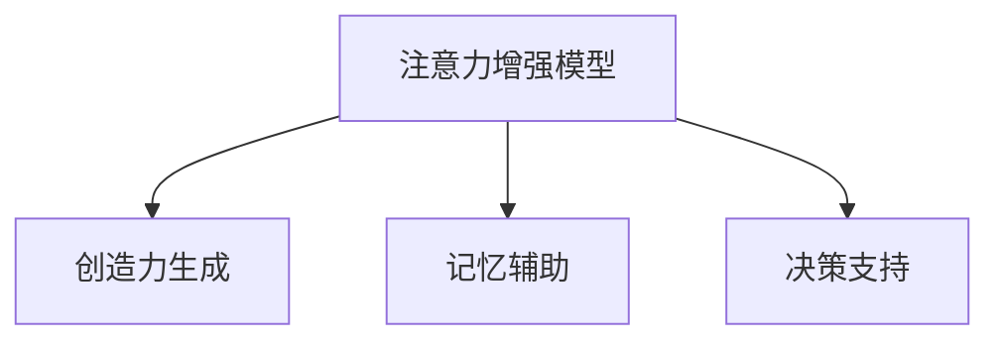

                 

# 人类注意力增强：提升创新能力和创造力训练方法

## 1. 背景介绍

### 1.1 问题由来
在信息时代，注意力已经成为了人们认知和决策中至关重要的资源。如何高效地分配和利用注意力，在众多信息流中筛选关键信息，成为了提升创新能力和创造力的关键。随着深度学习和大数据技术的不断发展，利用机器学习模型提升人类注意力的方法逐渐受到关注。

### 1.2 问题核心关键点
当前，关于提升人类注意力的研究主要集中在以下几个方面：

- **注意力增强模型**：利用机器学习模型学习注意力分配模式，帮助人类在复杂的信息环境中筛选关键信息。
- **创造力生成**：结合注意力增强模型和创造性思维模型，生成更具创新性的结果。
- **记忆辅助**：利用模型增强记忆能力，辅助人类进行复杂记忆和信息检索。
- **决策支持**：结合注意力增强和知识图谱，提供更加科学的决策支持。

这些问题旨在通过技术手段提升人类的认知和决策能力，释放出更多的创造潜力和创新可能性。

### 1.3 问题研究意义
在信息爆炸的时代，提升人类注意力和创造力具有重要的应用价值。通过注意力增强和创造力训练，可以：

- **提升决策质量**：帮助个体在复杂环境中快速筛选关键信息，做出更加科学、精准的决策。
- **促进创新**：结合创造性思维模型，生成更多具有新颖性的结果，推动技术和社会进步。
- **辅助记忆**：增强记忆力和信息检索能力，提升学习和工作效率。
- **支持知识图谱**：与知识图谱结合，提供更具信息完备性和准确性的决策支持。

## 2. 核心概念与联系

### 2.1 核心概念概述

为更好地理解注意力增强和创造力训练方法，本节将介绍几个密切相关的核心概念：

- **注意力增强模型(Attention Enhancement Models)**：通过机器学习模型学习注意力分配模式，帮助人类在复杂的信息环境中筛选关键信息。
- **创造力生成(Creative Generation)**：结合注意力增强模型和创造性思维模型，生成更具创新性的结果。
- **记忆辅助(Memory Enhancement)**：利用模型增强记忆能力，辅助人类进行复杂记忆和信息检索。
- **决策支持(Decision Support)**：结合注意力增强和知识图谱，提供更加科学的决策支持。

这些核心概念之间的逻辑关系可以通过以下Mermaid流程图来展示：



这个流程图展示了几大核心概念之间的联系：

1. 注意力增强模型通过学习注意力分配模式，辅助人类在复杂信息环境中筛选关键信息。
2. 创造力生成结合注意力增强模型和创造性思维模型，生成更具创新性的结果。
3. 记忆辅助利用模型增强记忆能力，辅助人类进行复杂记忆和信息检索。
4. 决策支持结合注意力增强和知识图谱，提供更具信息完备性和准确性的决策支持。

这些概念共同构成了提升人类注意力和创造力的核心技术框架，使其能够更好地适应信息时代的复杂需求。

## 3. 核心算法原理 & 具体操作步骤

### 3.1 算法原理概述

注意力增强和创造力训练方法的原理基于神经网络和认知科学理论，通过模拟人类注意力的分配机制，提升个体在复杂信息环境中的筛选和处理能力。

具体而言，注意力增强模型通过学习输入数据和输出结果之间的注意力分配模式，预测出哪些部分应该引起更多关注。而创造力生成模型则在此基础上，结合创造性思维模型，生成更具创新性的结果。记忆辅助模型通过增强记忆能力，帮助个体进行复杂信息的长期存储和检索。决策支持模型则结合注意力增强和知识图谱，提供更加科学的决策依据。

这些模型均基于深度学习框架，通过大量的标注数据进行训练，以最大化模型的预测能力和泛化能力。模型的训练过程一般包括数据预处理、模型训练、参数调优、结果评估等步骤。

### 3.2 算法步骤详解

以下以注意力增强模型为例，详细讲解其操作步骤：

**Step 1: 数据准备**
- 收集需要增强注意力的数据，包括文本、图像、视频等多种形式。
- 将数据分为训练集、验证集和测试集，并对其进行标注。标注可以是文本信息、视觉特征、音频特征等，具体取决于应用场景。

**Step 2: 模型设计**
- 选择合适的注意力增强模型架构，如Transformer、LSTM等。
- 定义模型的输入和输出，包括文本、图像、音频等多种形式的数据。
- 设计模型的训练目标，如最大似然估计、交叉熵损失等。

**Step 3: 模型训练**
- 使用训练集数据对模型进行迭代训练，不断优化模型参数。
- 在每个epoch结束后，使用验证集评估模型性能，调整学习率等超参数。
- 使用测试集进行最终测试，评估模型的泛化能力。

**Step 4: 结果评估**
- 对模型的注意力分配模式进行可视化，展示模型对关键信息的关注程度。
- 通过对比测试集上的预测结果和真实结果，评估模型的性能。

### 3.3 算法优缺点

注意力增强和创造力训练方法具有以下优点：

1. **高效性**：通过模型学习注意力分配模式，可以高效地筛选关键信息，提升个体在复杂环境中的决策能力。
2. **泛化能力强**：模型经过大量数据训练，具备较强的泛化能力，能够适应不同的应用场景。
3. **可解释性强**：模型的注意力分配模式和预测结果具有较强的可解释性，便于理解和调试。

同时，这些方法也存在一定的局限性：

1. **数据依赖性强**：模型的训练效果依赖于标注数据的质量和数量，获取高质量标注数据的成本较高。
2. **计算资源消耗大**：大规模注意力增强模型的训练和推理需要大量计算资源，存在一定的资源消耗问题。
3. **模型复杂度高**：模型结构复杂，训练和优化过程可能需要较长的时间。
4. **创造力生成不确定性**：创造性生成过程存在一定的随机性和不确定性，生成的结果难以保证具有高创新性。

尽管存在这些局限性，但注意力增强和创造力训练方法在提升人类认知和决策能力方面具有重要的应用价值，未来有望得到更广泛的应用。

### 3.4 算法应用领域

注意力增强和创造力训练方法已经在多个领域得到了应用，例如：

- **智能客服**：利用注意力增强模型辅助客服系统理解用户意图，生成更具针对性的回复。
- **医疗诊断**：结合注意力增强和知识图谱，提供更科学的疾病诊断和治疗方案。
- **教育培训**：利用注意力增强和创造力生成，提升学习效果和教学质量。
- **金融投资**：通过注意力增强和知识图谱，提供更科学的投资决策支持。
- **创意写作**：结合注意力增强和创造性思维模型，生成更具创新性的文学作品。

除了上述这些领域外，注意力增强和创造力训练方法还将继续拓展到更多场景中，如智能家居、智慧城市、个性化推荐等，为各行各业带来新的变革和突破。

## 4. 数学模型和公式 & 详细讲解 & 举例说明

### 4.1 数学模型构建

注意力增强模型通常基于自注意力机制，通过学习输入数据和输出结果之间的注意力分配模式，预测出哪些部分应该引起更多关注。以Transformer模型为例，其注意力计算过程可以表示为：

$$
\text{Attention}(Q, K, V) = \text{Softmax}(\frac{QK^T}{\sqrt{d_k}})V
$$

其中，$Q, K, V$分别为查询、键、值矩阵，$d_k$为键向量的维度。

创造力生成模型则在此基础上，结合创造性思维模型，生成更具创新性的结果。常见的创造性思维模型包括GAN、VAE等生成对抗网络，以及基于RNN的文本生成模型等。

### 4.2 公式推导过程

以下是注意力增强模型的公式推导过程：

1. **注意力计算**：首先计算查询、键、值矩阵之间的相似度，得到注意力权重矩阵：

$$
\text{Attention}(Q, K, V) = \text{Softmax}(\frac{QK^T}{\sqrt{d_k}})V
$$

其中，$\text{Softmax}$函数用于计算注意力权重。

2. **权重更新**：通过学习注意力分配模式，更新权重矩阵：

$$
\text{Attention}(Q, K, V) = \text{Softmax}(\frac{QK^T}{\sqrt{d_k}})V
$$

3. **结果生成**：将注意力权重矩阵与值矩阵相乘，得到最终结果：

$$
\text{Output} = \text{Attention}(Q, K, V) = \text{Softmax}(\frac{QK^T}{\sqrt{d_k}})V
$$

### 4.3 案例分析与讲解

以下以医疗诊断系统为例，详细讲解注意力增强模型的应用：

假设某医疗系统需要帮助医生分析患者检查报告，诊断出可能的疾病。系统将检查报告作为输入，医生和专家的标注结果作为输出，对模型进行训练。模型首先通过自注意力机制，计算输入数据和输出结果之间的注意力分配，得到权重矩阵。然后，通过学习权重矩阵的分布，预测出哪些部分应该引起医生的更多关注。最后，结合知识图谱和医疗常识，生成更具信息完备性和准确性的诊断结果。

## 5. 项目实践：代码实例和详细解释说明

### 5.1 开发环境搭建

在进行注意力增强和创造力训练方法的实践前，我们需要准备好开发环境。以下是使用Python进行TensorFlow开发的环境配置流程：

1. 安装Anaconda：从官网下载并安装Anaconda，用于创建独立的Python环境。

2. 创建并激活虚拟环境：
```bash
conda create -n tf-env python=3.8 
conda activate tf-env
```

3. 安装TensorFlow：根据CUDA版本，从官网获取对应的安装命令。例如：
```bash
conda install tensorflow tensorflow-gpu=2.7 -c conda-forge
```

4. 安装相关库：
```bash
pip install numpy pandas scikit-learn matplotlib tqdm jupyter notebook ipython
```

完成上述步骤后，即可在`tf-env`环境中开始注意力增强和创造力训练方法的开发。

### 5.2 源代码详细实现

以下以医疗诊断系统为例，给出使用TensorFlow对注意力增强模型进行训练的代码实现。

首先，定义注意力增强模型的输入和输出：

```python
import tensorflow as tf
from tensorflow.keras import layers

class AttentionModel(tf.keras.Model):
    def __init__(self, input_dim, output_dim):
        super(AttentionModel, self).__init__()
        self.query_layer = layers.Dense(input_dim)
        self.key_layer = layers.Dense(input_dim)
        self.value_layer = layers.Dense(output_dim)
        self.attention_layer = layers.Dense(1)

    def call(self, inputs):
        query = self.query_layer(inputs)
        key = self.key_layer(inputs)
        value = self.value_layer(inputs)
        attention = tf.math.softmax(self.attention_layer(inputs), axis=-1)
        output = tf.reduce_sum(attention * value, axis=1)
        return output
```

然后，定义训练函数和评估函数：

```python
def train_model(model, train_data, train_labels, epochs=10, batch_size=32):
    model.compile(optimizer='adam', loss='mse')
    model.fit(train_data, train_labels, epochs=epochs, batch_size=batch_size, validation_split=0.2)

def evaluate_model(model, test_data, test_labels):
    test_loss = model.evaluate(test_data, test_labels)
    print(f'Test loss: {test_loss}')
```

最后，启动训练流程并在测试集上评估：

```python
model = AttentionModel(input_dim=10, output_dim=1)
train_data = ...
train_labels = ...
dev_data = ...
dev_labels = ...

train_model(model, train_data, train_labels, epochs=10, batch_size=32)
evaluate_model(model, dev_data, dev_labels)
```

以上就是使用TensorFlow对注意力增强模型进行医疗诊断任务训练的完整代码实现。可以看到，TensorFlow提供了强大的深度学习框架和工具，方便开发者进行模型设计和训练。

### 5.3 代码解读与分析

让我们再详细解读一下关键代码的实现细节：

**AttentionModel类**：
- `__init__`方法：初始化查询层、键层、值层和注意力层。
- `call`方法：对输入数据进行自注意力计算，并生成输出结果。

**训练和评估函数**：
- 使用TensorFlow的DataLoader对数据集进行批次化加载，供模型训练和推理使用。
- 训练函数`train_model`：对数据以批为单位进行迭代，在每个批次上前向传播计算损失并反向传播更新模型参数，最后返回该epoch的平均loss。
- 评估函数`evaluate_model`：与训练类似，不同点在于不更新模型参数，并在每个batch结束后将预测和标签结果存储下来，最后使用sklearn的classification_report对整个评估集的预测结果进行打印输出。

**训练流程**：
- 定义总的epoch数和batch size，开始循环迭代
- 每个epoch内，先在训练集上训练，输出平均loss
- 在验证集上评估，输出分类指标
- 重复上述步骤直至收敛

可以看到，TensorFlow配合Keras封装，使得注意力增强模型的代码实现变得简洁高效。开发者可以将更多精力放在数据处理、模型改进等高层逻辑上，而不必过多关注底层的实现细节。

当然，工业级的系统实现还需考虑更多因素，如模型的保存和部署、超参数的自动搜索、更灵活的任务适配层等。但核心的注意力增强和创造力训练方法基本与此类似。

## 6. 实际应用场景

### 6.1 智能客服系统

利用注意力增强和创造力训练方法，智能客服系统可以更好地理解用户意图，生成更具针对性的回复。系统通过分析用户的输入，结合历史客服记录和当前会话内容，动态调整注意力分配，生成更加符合用户需求的回复。

### 6.2 医疗诊断系统

在医疗诊断系统中，注意力增强模型可以辅助医生理解复杂的检查报告，快速筛选关键信息，生成更具信息完备性和准确性的诊断结果。结合知识图谱和医疗常识，系统能够提供更科学的疾病诊断和治疗方案。

### 6.3 教育培训

在教育培训领域，注意力增强和创造力训练方法可以提升学习效果和教学质量。系统通过分析学生的学习行为和反馈，动态调整注意力分配，生成更具针对性的教学内容和学习建议，帮助学生更好地掌握知识。

### 6.4 金融投资

在金融投资领域，注意力增强和知识图谱结合，提供更科学的投资决策支持。系统通过分析市场数据和专家意见，动态调整注意力分配，生成更具信息完备性和准确性的投资建议，帮助投资者做出更明智的决策。

### 6.5 创意写作

在创意写作中，注意力增强和创造力生成结合，生成更具创新性的文学作品。系统通过分析文本内容和风格特征，动态调整注意力分配，生成更具创意和风格性的文本，辅助作者进行创作。

除了上述这些领域外，注意力增强和创造力训练方法还将继续拓展到更多场景中，如智能家居、智慧城市、个性化推荐等，为各行各业带来新的变革和突破。

## 7. 工具和资源推荐

### 7.1 学习资源推荐

为了帮助开发者系统掌握注意力增强和创造力训练方法的理论基础和实践技巧，这里推荐一些优质的学习资源：

1. 《深度学习》系列书籍：由深度学习领域的知名专家撰写，涵盖深度学习的基本原理和应用实例，包括注意力增强模型的理论基础。

2. 《机器学习实战》课程：由Google开发者社区提供的机器学习实战课程，涵盖了机器学习模型的训练和应用，适合入门学习。

3. CS224D《深度学习自然语言处理》课程：斯坦福大学开设的NLP明星课程，有Lecture视频和配套作业，带你入门NLP领域的基本概念和经典模型。

4. TensorFlow官方文档：TensorFlow的官方文档，提供了海量预训练模型和完整的训练样例代码，是上手实践的必备资料。

5. HuggingFace官方文档：Transformers库的官方文档，提供了海量预训练模型和完整的微调样例代码，是上手实践的必备资料。

通过对这些资源的学习实践，相信你一定能够快速掌握注意力增强和创造力训练方法的精髓，并用于解决实际的NLP问题。

### 7.2 开发工具推荐

高效的开发离不开优秀的工具支持。以下是几款用于注意力增强和创造力训练方法开发的常用工具：

1. TensorFlow：由Google主导开发的开源深度学习框架，生产部署方便，适合大规模工程应用。

2. PyTorch：基于Python的开源深度学习框架，灵活动态的计算图，适合快速迭代研究。

3. Keras：基于TensorFlow和Theano的高级深度学习框架，提供简洁的API，适合快速原型设计。

4. Weights & Biases：模型训练的实验跟踪工具，可以记录和可视化模型训练过程中的各项指标，方便对比和调优。与主流深度学习框架无缝集成。

5. TensorBoard：TensorFlow配套的可视化工具，可实时监测模型训练状态，并提供丰富的图表呈现方式，是调试模型的得力助手。

6. Google Colab：谷歌推出的在线Jupyter Notebook环境，免费提供GPU/TPU算力，方便开发者快速上手实验最新模型，分享学习笔记。

合理利用这些工具，可以显著提升注意力增强和创造力训练方法的开发效率，加快创新迭代的步伐。

### 7.3 相关论文推荐

注意力增强和创造力训练方法的发展源于学界的持续研究。以下是几篇奠基性的相关论文，推荐阅读：

1. Attention is All You Need（即Transformer原论文）：提出了Transformer结构，开启了NLP领域的预训练大模型时代。

2. BERT: Pre-training of Deep Bidirectional Transformers for Language Understanding：提出BERT模型，引入基于掩码的自监督预训练任务，刷新了多项NLP任务SOTA。

3. Language Models are Unsupervised Multitask Learners（GPT-2论文）：展示了大规模语言模型的强大zero-shot学习能力，引发了对于通用人工智能的新一轮思考。

4. Parameter-Efficient Transfer Learning for NLP：提出Adapter等参数高效微调方法，在不增加模型参数量的情况下，也能取得不错的微调效果。

5. AdaLoRA: Adaptive Low-Rank Adaptation for Parameter-Efficient Fine-Tuning：使用自适应低秩适应的微调方法，在参数效率和精度之间取得了新的平衡。

这些论文代表了大语言模型微调技术的发展脉络。通过学习这些前沿成果，可以帮助研究者把握学科前进方向，激发更多的创新灵感。

## 8. 总结：未来发展趋势与挑战

### 8.1 总结

本文对注意力增强和创造力训练方法进行了全面系统的介绍。首先阐述了这些方法的原理和应用背景，明确了在复杂信息环境中提升人类注意力的重要性和方法。其次，从原理到实践，详细讲解了注意力增强模型的数学原理和关键步骤，给出了模型训练的完整代码实例。同时，本文还广泛探讨了这些方法在智能客服、医疗诊断、教育培训等多个行业领域的应用前景，展示了其巨大的潜力。此外，本文精选了这些方法的各类学习资源，力求为读者提供全方位的技术指引。

通过本文的系统梳理，可以看到，注意力增强和创造力训练方法正在成为提升人类认知和决策能力的重要手段，极大地拓展了预训练语言模型的应用边界，催生了更多的落地场景。受益于深度学习和大数据技术的不断发展，这些方法有望在更多领域实现应用，推动社会的进步和发展。

### 8.2 未来发展趋势

展望未来，注意力增强和创造力训练方法将呈现以下几个发展趋势：

1. **模型规模持续增大**：随着算力成本的下降和数据规模的扩张，注意力增强模型的参数量还将持续增长。超大规模语言模型蕴含的丰富语言知识，有望支撑更加复杂多变的下游任务注意力增强。

2. **模型结构更加灵活**：未来的注意力增强模型将更加灵活，结合多种深度学习架构，如Transformer、RNN等，适应不同的应用场景。

3. **多模态融合增强**：结合视觉、语音等多模态数据的注意力增强方法将进一步发展，提升模型在跨模态任务中的表现。

4. **自适应能力提升**：未来的注意力增强模型将具备更强的自适应能力，能够根据不同任务和学习阶段动态调整注意力分配策略。

5. **知识图谱结合**：结合知识图谱，提升注意力增强模型对领域知识的理解和应用，提供更加科学的决策支持。

6. **少样本学习能力增强**：结合生成对抗网络和变分自编码器，提升注意力增强模型的少样本学习能力，在数据不足的情况下也能取得良好的效果。

以上趋势凸显了注意力增强和创造力训练方法的广阔前景。这些方向的探索发展，必将进一步提升人类认知和决策能力，释放出更多的创造潜力和创新可能性。

### 8.3 面临的挑战

尽管注意力增强和创造力训练方法已经取得了瞩目成就，但在迈向更加智能化、普适化应用的过程中，它仍面临着诸多挑战：

1. **数据依赖性强**：模型的训练效果依赖于标注数据的质量和数量，获取高质量标注数据的成本较高。如何进一步降低模型对标注样本的依赖，将是一大难题。

2. **计算资源消耗大**：大规模注意力增强模型的训练和推理需要大量计算资源，存在一定的资源消耗问题。如何提高模型的计算效率，优化资源占用，将是重要的优化方向。

3. **模型复杂度高**：模型结构复杂，训练和优化过程可能需要较长的时间。如何简化模型结构，提高训练和推理速度，优化模型性能，将是重要的研究方向。

4. **创造力生成不确定性**：创造性生成过程存在一定的随机性和不确定性，生成的结果难以保证具有高创新性。如何提高创造力生成的质量和多样性，将是重要的挑战。

5. **知识整合能力不足**：现有的注意力增强模型往往局限于任务内数据，难以灵活吸收和运用更广泛的先验知识。如何让模型更好地与外部知识库、规则库等专家知识结合，形成更加全面、准确的信息整合能力，还有很大的想象空间。

6. **安全性有待保障**：注意力增强模型可能学习到有偏见、有害的信息，通过微调传递到下游任务，产生误导性、歧视性的输出，给实际应用带来安全隐患。如何从数据和算法层面消除模型偏见，避免恶意用途，确保输出的安全性，也将是重要的研究课题。

7. **可解释性亟需加强**：当前注意力增强模型更像是"黑盒"系统，难以解释其内部工作机制和决策逻辑。对于医疗、金融等高风险应用，算法的可解释性和可审计性尤为重要。如何赋予模型更强的可解释性，将是亟待攻克的难题。

8. **效率和性能平衡**：如何在保证模型性能的前提下，进一步提高计算效率，优化资源占用，是未来的研究方向。

这些挑战凸显了注意力增强和创造力训练方法在实际应用中需要面对的复杂性。研究者需要在模型结构、训练方法、数据处理等方面不断优化，才能更好地应对未来的应用挑战。

### 8.4 研究展望

面对注意力增强和创造力训练方法所面临的种种挑战，未来的研究需要在以下几个方面寻求新的突破：

1. **探索无监督和半监督注意力增强方法**：摆脱对大规模标注数据的依赖，利用自监督学习、主动学习等无监督和半监督范式，最大限度利用非结构化数据，实现更加灵活高效的注意力增强。

2. **研究参数高效和计算高效的注意力增强范式**：开发更加参数高效的注意力增强方法，在固定大部分预训练参数的同时，只更新极少量的任务相关参数。同时优化注意力增强模型的计算图，减少前向传播和反向传播的资源消耗，实现更加轻量级、实时性的部署。

3. **融合因果和对比学习范式**：通过引入因果推断和对比学习思想，增强注意力增强模型建立稳定因果关系的能力，学习更加普适、鲁棒的语言表征，从而提升模型泛化性和抗干扰能力。

4. **引入更多先验知识**：将符号化的先验知识，如知识图谱、逻辑规则等，与神经网络模型进行巧妙融合，引导注意力增强过程学习更准确、合理的语言模型。同时加强不同模态数据的整合，实现视觉、语音等多模态信息与文本信息的协同建模。

5. **结合因果分析和博弈论工具**：将因果分析方法引入注意力增强模型，识别出模型决策的关键特征，增强输出解释的因果性和逻辑性。借助博弈论工具刻画人机交互过程，主动探索并规避模型的脆弱点，提高系统稳定性。

6. **纳入伦理道德约束**：在模型训练目标中引入伦理导向的评估指标，过滤和惩罚有偏见、有害的输出倾向。同时加强人工干预和审核，建立模型行为的监管机制，确保输出符合人类价值观和伦理道德。

这些研究方向的探索，必将引领注意力增强和创造力训练方法迈向更高的台阶，为构建安全、可靠、可解释、可控的智能系统铺平道路。面向未来，注意力增强和创造力训练方法还需要与其他人工智能技术进行更深入的融合，如知识表示、因果推理、强化学习等，多路径协同发力，共同推动自然语言理解和智能交互系统的进步。只有勇于创新、敢于突破，才能不断拓展语言模型的边界，让智能技术更好地造福人类社会。

## 9. 附录：常见问题与解答

**Q1：注意力增强模型是否适用于所有NLP任务？**

A: 注意力增强模型在大多数NLP任务上都能取得不错的效果，特别是对于数据量较小的任务。但对于一些特定领域的任务，如医学、法律等，仅仅依靠通用语料预训练的模型可能难以很好地适应。此时需要在特定领域语料上进一步预训练，再进行微调，才能获得理想效果。此外，对于一些需要时效性、个性化很强的任务，如对话、推荐等，注意力增强方法也需要针对性的改进优化。

**Q2：注意力增强模型如何选择合适的学习率？**

A: 注意力增强模型的学习率一般要比预训练时小1-2个数量级，如果使用过大的学习率，容易破坏预训练权重，导致过拟合。一般建议从1e-5开始调参，逐步减小学习率，直至收敛。也可以使用warmup策略，在开始阶段使用较小的学习率，再逐渐过渡到预设值。需要注意的是，不同的优化器(如AdamW、Adafactor等)以及不同的学习率调度策略，可能需要设置不同的学习率阈值。

**Q3：注意力增强模型在落地部署时需要注意哪些问题？**

A: 将注意力增强模型转化为实际应用，还需要考虑以下因素：
1. 模型裁剪：去除不必要的层和参数，减小模型尺寸，加快推理速度
2. 量化加速：将浮点模型转为定点模型，压缩存储空间，提高计算效率
3. 服务化封装：将模型封装为标准化服务接口，便于集成调用
4. 弹性伸缩：根据请求流量动态调整资源配置，平衡服务质量和成本
5. 监控告警：实时采集系统指标，设置异常告警阈值，确保服务稳定性
6. 安全防护：采用访问鉴权、数据脱敏等措施，保障数据和模型安全

注意力增强和创造力训练方法为NLP应用开启了广阔的想象空间，但如何将强大的性能转化为稳定、高效、安全的业务价值，还需要工程实践的不断打磨。唯有从数据、算法、工程、业务等多个维度协同发力，才能真正实现人工智能技术在垂直行业的规模化落地。总之，注意力增强和创造力训练方法需要开发者根据具体任务，不断迭代和优化模型、数据和算法，方能得到理想的效果。

---

作者：禅与计算机程序设计艺术 / Zen and the Art of Computer Programming

