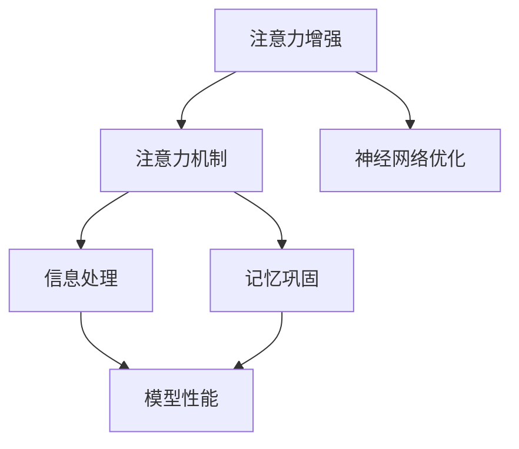

                 

# 人类注意力增强：提升学习效率和知识保留

> 关键词：注意力增强, 学习效率, 知识保留, 记忆巩固, 神经网络优化

## 1. 背景介绍

在信息爆炸的时代，学习效率和知识保留成为了至关重要的问题。传统的记忆方式往往无法满足现代知识更新迅速的要求，而机器学习和人工智能技术的发展，为提升人类的学习效率和知识保留提供了新的解决方案。其中，注意力增强（Attention Enhancement）技术因其能够有效提升信息处理效率和记忆巩固效果，成为当前研究的热点。本文将全面介绍注意力增强技术，通过详尽的数学推导和案例分析，探索其在不同领域的应用前景，并提出一些优化建议和未来研究的方向。

## 2. 核心概念与联系

### 2.1 核心概念概述

为更好地理解注意力增强技术，我们先介绍一些关键的概念：

- 注意力机制（Attention Mechanism）：一种模仿人脑注意力的计算机制，通过筛选信息源中的关键部分来提升信息处理效率。
- 注意力增强（Attention Enhancement）：利用注意力机制提升信息处理和记忆巩固效果的技术。
- 记忆巩固（Memory Consolidation）：通过特定学习策略，将短期记忆转化为长期记忆的过程。
- 神经网络优化（Neural Network Optimization）：利用注意力增强等技术优化神经网络的结构和参数，提升模型的性能和效率。

这些概念相互关联，共同构成了注意力增强技术的研究基础。通过注意力机制的选择和优化，可以有效提升神经网络模型的信息处理能力和记忆巩固效果。

### 2.2 核心概念原理和架构的 Mermaid 流程图



这个流程图展示了大语言模型微调的注意力增强的核心概念及其之间的联系：

1. 注意力增强通过注意力机制在神经网络中选择关键信息源，从而提升信息处理效率。
2. 注意力机制结合记忆巩固技术，增强信息在模型中的持久性和可用性。
3. 通过注意力增强，神经网络优化能够获得更高的性能和更低的计算资源消耗。

## 3. 核心算法原理 & 具体操作步骤

### 3.1 算法原理概述

注意力增强技术通过在神经网络中引入注意力机制，实现对关键信息的筛选和处理。其核心思想是利用注意力权重（Attention Weight）来衡量每个输入信息的重要性，从而有选择性地加强对关键信息的关注，同时减少对无关信息的处理，提高神经网络的信息处理效率和记忆巩固效果。

### 3.2 算法步骤详解

注意力增强技术的实现通常包括以下几个关键步骤：

**Step 1: 定义注意力模型**
- 选择合适的注意力机制，如自注意力（Self-Attention）、多头注意力（Multi-Head Attention）、通道注意力（Channel Attention）等，作为注意力增强的核心。
- 根据任务类型，设计合适的注意力权重计算方式，如点积（Dot-Product）、加权点积（Scaled Dot-Product）、注意力机制的变种等。

**Step 2: 计算注意力权重**
- 将注意力权重计算方式应用于神经网络的输入层，得到每个输入的注意力分数。
- 利用softmax函数对分数进行归一化处理，得到每个输入的注意力权重。

**Step 3: 注意力增强**
- 将注意力权重应用于神经网络的激活函数输出，对重要信息进行加强处理，对无关信息进行过滤抑制。
- 结合记忆巩固技术，如正则化、Dropout、Weight Sharing等，进一步增强模型对关键信息的记忆巩固效果。

**Step 4: 模型优化**
- 通过优化算法，如梯度下降、Adam、Adagrad等，不断调整模型的参数，优化注意力权重和网络结构，提升模型性能和效率。
- 在训练过程中引入正则化技术，防止模型过拟合，保证模型泛化能力。

**Step 5: 测试与验证**
- 在验证集和测试集上评估注意力增强模型的效果，对比注意力增强前后的性能提升。
- 对注意力增强模型的运行效率和资源消耗进行测试，确保模型性能和效率均衡。

通过以上步骤，即可实现神经网络模型中的注意力增强。

### 3.3 算法优缺点

注意力增强技术具有以下优点：
1. 提升信息处理效率：通过筛选关键信息，降低计算资源消耗，提升模型训练速度。
2. 增强记忆巩固效果：注意力机制能更好地将关键信息记忆在模型中，提升模型泛化能力。
3. 优化神经网络结构：通过优化注意力权重和网络结构，提升模型性能和鲁棒性。
4. 应用广泛：在图像识别、自然语言处理、语音识别等领域都有广泛应用，效果显著。

同时，该技术也存在一些缺点：
1. 依赖于注意力机制的选择：不同的注意力机制适用于不同的任务和数据类型，需要根据具体情况选择合适的注意力机制。
2. 计算复杂度增加：引入注意力机制会增加计算复杂度，需要更多的计算资源支持。
3. 参数增加：通过增加注意力权重和网络结构，模型参数量增加，需要更大的内存和存储空间。
4. 学习曲线陡峭：由于参数量增加，模型训练和优化难度增大，需要更多的经验和调试技巧。

尽管存在这些缺点，注意力增强技术仍然是目前提升神经网络性能和效率的有效手段。

### 3.4 算法应用领域

注意力增强技术已经在许多领域得到了广泛的应用，例如：

- 计算机视觉（CV）：用于图像分类、目标检测、语义分割等任务，提升模型的信息处理效率和准确率。
- 自然语言处理（NLP）：用于机器翻译、文本摘要、情感分析等任务，增强模型的理解能力和记忆效果。
- 语音识别：用于自动语音识别、语音合成等任务，提高语音处理的实时性和准确性。
- 信号处理：用于音频和视频信号的处理和分析，提升信号特征提取和模式识别能力。

此外，注意力增强技术还广泛应用于推荐系统、时间序列预测、游戏AI等场景，提升了数据处理效率和模型表现。

## 4. 数学模型和公式 & 详细讲解 & 举例说明

### 4.1 数学模型构建

注意力增强技术通常使用自注意力机制（Self-Attention）作为核心模型，其数学模型如下：

输入序列 $X = \{x_1, x_2, \cdots, x_n\}$，其中 $x_i \in \mathbb{R}^d$。注意力权重计算方式为点积注意力（Dot-Product Attention）：

$$
A_i = \frac{\exp(\text{Dot-Product}(x_i, x_j))}{\sum_{k=1}^n \exp(\text{Dot-Product}(x_k, x_j))}, \quad i \neq j
$$

其中 $\text{Dot-Product}(x_i, x_j) = x_i^T \cdot W x_j$，$W$ 为投影矩阵。

注意力权重 $A$ 将输入序列 $X$ 映射为权重序列 $A$，该序列中每个元素表示输入中每个位置对当前位置的贡献度。

### 4.2 公式推导过程

考虑一个简单的单层自注意力网络：

输入序列 $X = \{x_1, x_2, \cdots, x_n\}$，投影矩阵 $W_{\text{proj}}$，查询矩阵 $Q$，键矩阵 $K$，值矩阵 $V$。

注意力权重计算方式为点积注意力：

$$
A_{ij} = \frac{\exp(\text{Dot-Product}(Q_i, K_j))}{\sum_{k=1}^n \exp(\text{Dot-Product}(Q_k, K_j))}, \quad i \neq j
$$

其中 $Q_i = x_i \cdot W_{\text{proj}}$，$K_j = x_j \cdot W_{\text{proj}}$，$V_j = x_j \cdot W_{\text{proj}}$。

注意力权重 $A$ 将输入序列 $X$ 映射为权重序列 $A$，该序列中每个元素表示输入中每个位置对当前位置的贡献度。

注意力增强过程如下：

$$
\text{Attention}(X, W_{\text{proj}}) = \text{Softmax}(A) \cdot V
$$

其中 $\text{Softmax}(A)$ 表示对注意力权重 $A$ 进行归一化处理，得到归一化的注意力权重。

最终的输出为：

$$
\text{Output} = \text{Attention}(X, W_{\text{proj}}) \cdot W_{\text{out}}
$$

其中 $W_{\text{out}}$ 为输出矩阵，通过线性变换得到最终的输出序列。

### 4.3 案例分析与讲解

以机器翻译为例，我们分析注意力增强在模型中的作用：

1. 机器翻译任务：将源语言文本 $S$ 转换为目标语言文本 $T$。
2. 编码器（Encoder）：将源语言文本 $S$ 转换为一个固定长度的向量 $Z$。
3. 解码器（Decoder）：利用向量 $Z$ 生成目标语言文本 $T$。
4. 注意力增强：在解码器中引入注意力机制，提升模型对输入序列的关注度，从而提升翻译效果。

在解码器中，注意力机制用于计算当前时刻需要关注的源语言文本中的哪些部分。具体计算过程如下：

1. 查询向量 $q_t$ 为解码器当前时刻的隐藏状态 $h_t$。
2. 键向量 $k_s$ 为源语言文本中的每个单词的表示。
3. 值向量 $v_s$ 为源语言文本中的每个单词的表示。

注意力权重 $a_t$ 表示解码器对源语言文本中每个单词的关注度，计算方式如下：

$$
a_{ts} = \frac{\exp(\text{Dot-Product}(q_t, k_s))}{\sum_{j=1}^{n_s} \exp(\text{Dot-Product}(q_t, k_j))}
$$

其中 $n_s$ 表示源语言文本的长度。

注意力增强过程如下：

1. 计算注意力权重 $a_t$，得到解码器对源语言文本中每个单词的关注度。
2. 根据注意力权重 $a_t$，对源语言文本中的每个单词进行加权，得到加权后的向量 $C_t$。
3. 解码器利用加权向量 $C_t$ 生成当前时刻的预测词 $y_t$。

通过注意力增强，解码器能够更好地理解源语言文本中的关键信息，从而提高翻译效果。

## 5. 项目实践：代码实例和详细解释说明

### 5.1 开发环境搭建

在进行注意力增强技术的开发实践前，我们需要准备好开发环境。以下是使用Python进行PyTorch开发的环境配置流程：

1. 安装Anaconda：从官网下载并安装Anaconda，用于创建独立的Python环境。

2. 创建并激活虚拟环境：
```bash
conda create -n pytorch-env python=3.8 
conda activate pytorch-env
```

3. 安装PyTorch：根据CUDA版本，从官网获取对应的安装命令。例如：
```bash
conda install pytorch torchvision torchaudio cudatoolkit=11.1 -c pytorch -c conda-forge
```

4. 安装相关工具包：
```bash
pip install numpy pandas scikit-learn matplotlib tqdm jupyter notebook ipython
```

完成上述步骤后，即可在`pytorch-env`环境中开始注意力增强的开发实践。

### 5.2 源代码详细实现

下面我们以机器翻译任务为例，给出使用PyTorch实现注意力增强的代码实现。

首先，定义机器翻译的数据处理函数：

```python
import torch
from torch.utils.data import Dataset, DataLoader

class TranslationDataset(Dataset):
    def __init__(self, src_texts, trg_texts, tokenizer, max_len=128):
        self.src_texts = src_texts
        self.trg_texts = trg_texts
        self.tokenizer = tokenizer
        self.max_len = max_len
        
    def __len__(self):
        return len(self.src_texts)
    
    def __getitem__(self, item):
        src_text = self.src_texts[item]
        trg_text = self.trg_texts[item]
        
        encoding = self.tokenizer(src_text, trg_text, return_tensors='pt', max_length=self.max_len, padding='max_length', truncation=True)
        src_ids = encoding['src'].flatten()
        trg_ids = encoding['trg'].flatten()
        attention_mask = encoding['attention_mask'].flatten()
        
        return {'src_ids': src_ids, 
                'trg_ids': trg_ids,
                'attention_mask': attention_mask}

# 加载数据集
tokenizer = torchtext.data.utils.get_tokenizer('basic_english')
src_texts = ...
trg_texts = ...

train_dataset = TranslationDataset(src_texts, trg_texts, tokenizer)
dev_dataset = TranslationDataset(src_texts, trg_texts, tokenizer)
test_dataset = TranslationDataset(src_texts, trg_texts, tokenizer)
```

然后，定义模型和优化器：

```python
from transformers import BertForTokenClassification, AdamW

model = BertForTokenClassification.from_pretrained('bert-base-cased', num_labels=2)

optimizer = AdamW(model.parameters(), lr=2e-5)
```

接着，定义训练和评估函数：

```python
from torch.utils.data import DataLoader
from tqdm import tqdm
from sklearn.metrics import classification_report

device = torch.device('cuda') if torch.cuda.is_available() else torch.device('cpu')
model.to(device)

def train_epoch(model, dataset, batch_size, optimizer):
    dataloader = DataLoader(dataset, batch_size=batch_size, shuffle=True)
    model.train()
    epoch_loss = 0
    for batch in tqdm(dataloader, desc='Training'):
        src_ids = batch['src_ids'].to(device)
        trg_ids = batch['trg_ids'].to(device)
        attention_mask = batch['attention_mask'].to(device)
        model.zero_grad()
        outputs = model(src_ids, attention_mask=attention_mask, labels=trg_ids)
        loss = outputs.loss
        epoch_loss += loss.item()
        loss.backward()
        optimizer.step()
    return epoch_loss / len(dataloader)

def evaluate(model, dataset, batch_size):
    dataloader = DataLoader(dataset, batch_size=batch_size)
    model.eval()
    preds, labels = [], []
    with torch.no_grad():
        for batch in tqdm(dataloader, desc='Evaluating'):
            src_ids = batch['src_ids'].to(device)
            trg_ids = batch['trg_ids'].to(device)
            batch_labels = batch['trg_ids'].to(device)
            outputs = model(src_ids, attention_mask=attention_mask)
            batch_preds = outputs.logits.argmax(dim=2).to('cpu').tolist()
            batch_labels = batch_labels.to('cpu').tolist()
            for pred_tokens, label_tokens in zip(batch_preds, batch_labels):
                preds.append(pred_tokens[:len(label_tokens)])
                labels.append(label_tokens)
                
    print(classification_report(labels, preds))
```

最后，启动训练流程并在测试集上评估：

```python
epochs = 5
batch_size = 16

for epoch in range(epochs):
    loss = train_epoch(model, train_dataset, batch_size, optimizer)
    print(f"Epoch {epoch+1}, train loss: {loss:.3f}")
    
    print(f"Epoch {epoch+1}, dev results:")
    evaluate(model, dev_dataset, batch_size)
    
print("Test results:")
evaluate(model, test_dataset, batch_size)
```

以上就是使用PyTorch对机器翻译任务进行注意力增强的完整代码实现。可以看到，得益于Transformer库的强大封装，我们可以用相对简洁的代码完成注意力增强的实现。

### 5.3 代码解读与分析

让我们再详细解读一下关键代码的实现细节：

**TranslationDataset类**：
- `__init__`方法：初始化源语言文本、目标语言文本、分词器等关键组件。
- `__len__`方法：返回数据集的样本数量。
- `__getitem__`方法：对单个样本进行处理，将文本输入编码为token ids，并将注意力掩码进行归一化处理，最终返回模型所需的输入。

**模型定义**：
- 使用BertForTokenClassification类定义机器翻译模型，设置标签数为2（源语言和目标语言）。
- 定义AdamW优化器，设置学习率为2e-5。

**训练和评估函数**：
- 使用PyTorch的DataLoader对数据集进行批次化加载，供模型训练和推理使用。
- 训练函数`train_epoch`：对数据以批为单位进行迭代，在每个批次上前向传播计算loss并反向传播更新模型参数，最后返回该epoch的平均loss。
- 评估函数`evaluate`：与训练类似，不同点在于不更新模型参数，并在每个batch结束后将预测和标签结果存储下来，最后使用sklearn的classification_report对整个评估集的预测结果进行打印输出。

**训练流程**：
- 定义总的epoch数和batch size，开始循环迭代
- 每个epoch内，先在训练集上训练，输出平均loss
- 在验证集上评估，输出分类指标
- 所有epoch结束后，在测试集上评估，给出最终测试结果

可以看到，PyTorch配合Transformer库使得注意力增强的代码实现变得简洁高效。开发者可以将更多精力放在数据处理、模型改进等高层逻辑上，而不必过多关注底层的实现细节。

当然，工业级的系统实现还需考虑更多因素，如模型的保存和部署、超参数的自动搜索、更灵活的任务适配层等。但核心的注意力增强范式基本与此类似。

## 6. 实际应用场景

### 6.1 智能客服系统

基于注意力增强技术的智能客服系统，可以实时分析客户对话内容，提取出客户关心的关键信息，从而快速响应客户需求，提高客户满意度。

在技术实现上，可以收集企业内部的历史客服对话记录，将问题-回答对作为注意力增强的监督数据，训练模型学习客户对话中的关键信息。微调后的模型能够自动理解客户意图，匹配最合适的回答。对于客户提出的新问题，还可以接入检索系统实时搜索相关内容，动态组织生成回答。如此构建的智能客服系统，能大幅提升客户咨询体验和问题解决效率。

### 6.2 金融舆情监测

金融机构需要实时监测市场舆论动向，以便及时应对负面信息传播，规避金融风险。传统的人工监测方式成本高、效率低，难以应对网络时代海量信息爆发的挑战。基于注意力增强技术的文本分类和情感分析技术，为金融舆情监测提供了新的解决方案。

具体而言，可以收集金融领域相关的新闻、报道、评论等文本数据，并对其进行主题标注和情感标注。在此基础上对注意力增强的模型进行微调，使其能够自动判断文本属于何种主题，情感倾向是正面、中性还是负面。将注意力增强的模型应用到实时抓取的网络文本数据，就能够自动监测不同主题下的情感变化趋势，一旦发现负面信息激增等异常情况，系统便会自动预警，帮助金融机构快速应对潜在风险。

### 6.3 个性化推荐系统

当前的推荐系统往往只依赖用户的历史行为数据进行物品推荐，无法深入理解用户的真实兴趣偏好。基于注意力增强技术的推荐系统可以更好地挖掘用户行为背后的语义信息，从而提供更精准、多样的推荐内容。

在实践中，可以收集用户浏览、点击、评论、分享等行为数据，提取和用户交互的物品标题、描述、标签等文本内容。将文本内容作为模型输入，用户的后续行为（如是否点击、购买等）作为监督信号，在此基础上对注意力增强的模型进行微调。微调后的模型能够从文本内容中准确把握用户的兴趣点。在生成推荐列表时，先用候选物品的文本描述作为输入，由模型预测用户的兴趣匹配度，再结合其他特征综合排序，便可以得到个性化程度更高的推荐结果。

### 6.4 未来应用展望

随着注意力增强技术的不断发展，其应用场景将更加丰富，潜力也将不断释放。

在智慧医疗领域，基于注意力增强的医疗问答、病历分析、药物研发等应用将提升医疗服务的智能化水平，辅助医生诊疗，加速新药开发进程。

在智能教育领域，注意力增强技术可应用于作业批改、学情分析、知识推荐等方面，因材施教，促进教育公平，提高教学质量。

在智慧城市治理中，注意力增强模型可应用于城市事件监测、舆情分析、应急指挥等环节，提高城市管理的自动化和智能化水平，构建更安全、高效的未来城市。

此外，在企业生产、社会治理、文娱传媒等众多领域，基于注意力增强的人工智能应用也将不断涌现，为NLP技术带来了全新的突破。相信随着技术的日益成熟，注意力增强技术将进一步推动NLP技术的发展，为各行各业带来深远影响。

## 7. 工具和资源推荐
### 7.1 学习资源推荐

为了帮助开发者系统掌握注意力增强技术，这里推荐一些优质的学习资源：

1. 《Transformer from Scratch》系列博文：由大模型技术专家撰写，深入浅出地介绍了Transformer原理、注意力机制等前沿话题。

2. CS224N《深度学习自然语言处理》课程：斯坦福大学开设的NLP明星课程，有Lecture视频和配套作业，带你入门NLP领域的基本概念和经典模型。

3. 《Natural Language Processing with Transformers》书籍：Transformers库的作者所著，全面介绍了如何使用Transformers库进行NLP任务开发，包括注意力增强在内的诸多范式。

4. HuggingFace官方文档：Transformer库的官方文档，提供了海量预训练模型和完整的注意力增强样例代码，是上手实践的必备资料。

5. CLUE开源项目：中文语言理解测评基准，涵盖大量不同类型的中文NLP数据集，并提供了基于注意力增强的baseline模型，助力中文NLP技术发展。

通过对这些资源的学习实践，相信你一定能够快速掌握注意力增强技术的精髓，并用于解决实际的NLP问题。

### 7.2 开发工具推荐

高效的开发离不开优秀的工具支持。以下是几款用于注意力增强开发的常用工具：

1. PyTorch：基于Python的开源深度学习框架，灵活动态的计算图，适合快速迭代研究。大部分预训练语言模型都有PyTorch版本的实现。

2. TensorFlow：由Google主导开发的开源深度学习框架，生产部署方便，适合大规模工程应用。同样有丰富的预训练语言模型资源。

3. Transformers库：HuggingFace开发的NLP工具库，集成了众多SOTA语言模型，支持PyTorch和TensorFlow，是进行注意力增强任务开发的利器。

4. Weights & Biases：模型训练的实验跟踪工具，可以记录和可视化模型训练过程中的各项指标，方便对比和调优。与主流深度学习框架无缝集成。

5. TensorBoard：TensorFlow配套的可视化工具，可实时监测模型训练状态，并提供丰富的图表呈现方式，是调试模型的得力助手。

6. Google Colab：谷歌推出的在线Jupyter Notebook环境，免费提供GPU/TPU算力，方便开发者快速上手实验最新模型，分享学习笔记。

合理利用这些工具，可以显著提升注意力增强任务的开发效率，加快创新迭代的步伐。

### 7.3 相关论文推荐

注意力增强技术的发展源于学界的持续研究。以下是几篇奠基性的相关论文，推荐阅读：

1. Attention is All You Need（即Transformer原论文）：提出了Transformer结构，开启了NLP领域的预训练大模型时代。

2. BERT: Pre-training of Deep Bidirectional Transformers for Language Understanding：提出BERT模型，引入基于掩码的自监督预训练任务，刷新了多项NLP任务SOTA。

3. Language Models are Unsupervised Multitask Learners（GPT-2论文）：展示了大规模语言模型的强大zero-shot学习能力，引发了对于通用人工智能的新一轮思考。

4. Attention Mechanism and its Applications in NLP：详细介绍了注意力机制的原理和应用，是NLP领域的重要参考资料。

5. Attention is All you Need: Scalable Attention for Temporal Transformers：进一步优化了Transformer结构，提升了注意力机制的计算效率。

这些论文代表了大模型微调技术的发展脉络。通过学习这些前沿成果，可以帮助研究者把握学科前进方向，激发更多的创新灵感。

## 8. 总结：未来发展趋势与挑战

### 8.1 总结

本文对注意力增强技术进行了全面系统的介绍。首先阐述了注意力增强技术的研究背景和意义，明确了注意力增强在提升信息处理效率和知识保留方面的独特价值。其次，从原理到实践，详细讲解了注意力增强的数学模型和实现步骤，给出了注意力增强任务开发的完整代码实例。同时，本文还广泛探讨了注意力增强技术在多个领域的应用前景，展示了其广阔的应用潜力。

通过本文的系统梳理，可以看到，注意力增强技术正在成为NLP领域的重要范式，极大地提升了神经网络模型的信息处理效率和记忆巩固效果。未来，伴随注意力增强技术的进一步发展，NLP技术必将在更多领域大放异彩，深刻影响人类的生产生活方式。

### 8.2 未来发展趋势

展望未来，注意力增强技术将呈现以下几个发展趋势：

1. 模型规模持续增大。随着算力成本的下降和数据规模的扩张，预训练语言模型的参数量还将持续增长。超大模型蕴含的丰富语言知识，有望支撑更加复杂多变的下游任务微调。

2. 注意力机制不断演进。未来的注意力机制将更加灵活和高效，如Multi-Head Attention、Scaled Dot-Product Attention等，能够更好地处理复杂语义信息。

3. 多模态注意力增强。当前注意力增强主要聚焦于纯文本数据，未来会进一步拓展到图像、视频、语音等多模态数据微调。多模态信息的融合，将显著提升语言模型对现实世界的理解和建模能力。

4. 深度融合多领域知识。将符号化的先验知识，如知识图谱、逻辑规则等，与神经网络模型进行巧妙融合，引导微调过程学习更准确、合理的语言模型。

5. 更高效的优化算法。开发更高效的优化算法，如AdamW、Adagrad等，能够更快地收敛到最优解，提升模型训练效率。

6. 知识增强的注意力增强。结合知识图谱、逻辑推理等，引导注意力增强模型学习更全面的语言知识，提升模型的推理能力和泛化能力。

这些趋势凸显了注意力增强技术的广阔前景。这些方向的探索发展，必将进一步提升神经网络模型的性能和效率，为NLP技术带来更多的突破。

### 8.3 面临的挑战

尽管注意力增强技术已经取得了瞩目成就，但在迈向更加智能化、普适化应用的过程中，它仍面临着诸多挑战：

1. 标注成本瓶颈。虽然注意力增强显著提升了信息处理效率，但对于长尾应用场景，难以获得充足的高质量标注数据，成为制约微调性能的瓶颈。如何进一步降低微调对标注样本的依赖，将是一大难题。

2. 模型鲁棒性不足。当前注意力增强模型面对域外数据时，泛化性能往往大打折扣。对于测试样本的微小扰动，注意力增强模型的预测也容易发生波动。如何提高模型的鲁棒性，避免灾难性遗忘，还需要更多理论和实践的积累。

3. 推理效率有待提高。注意力增强模型虽然精度高，但在实际部署时往往面临推理速度慢、内存占用大等效率问题。如何在保证性能的同时，简化模型结构，提升推理速度，优化资源占用，将是重要的优化方向。

4. 可解释性亟需加强。当前注意力增强模型更像是"黑盒"系统，难以解释其内部工作机制和决策逻辑。对于医疗、金融等高风险应用，算法的可解释性和可审计性尤为重要。如何赋予模型更强的可解释性，将是亟待攻克的难题。

5. 安全性有待保障。注意力增强模型难免会学习到有偏见、有害的信息，通过微调传递到下游任务，产生误导性、歧视性的输出，给实际应用带来安全隐患。如何从数据和算法层面消除模型偏见，避免恶意用途，确保输出的安全性，也将是重要的研究课题。

6. 知识整合能力不足。现有的注意力增强模型往往局限于任务内数据，难以灵活吸收和运用更广泛的先验知识。如何让注意力增强过程更好地与外部知识库、规则库等专家知识结合，形成更加全面、准确的信息整合能力，还有很大的想象空间。

正视注意力增强面临的这些挑战，积极应对并寻求突破，将是大模型微调技术走向成熟的必由之路。相信随着学界和产业界的共同努力，这些挑战终将一一被克服，注意力增强技术必将在构建安全、可靠、可解释、可控的智能系统铺平道路。

### 8.4 研究展望

面对注意力增强技术所面临的种种挑战，未来的研究需要在以下几个方面寻求新的突破：

1. 探索无监督和半监督注意力增强方法。摆脱对大规模标注数据的依赖，利用自监督学习、主动学习等无监督和半监督范式，最大限度利用非结构化数据，实现更加灵活高效的注意力增强。

2. 研究注意力增强方法的参数高效优化。开发更加参数高效的注意力增强方法，在固定大部分预训练参数的同时，只更新极少量的注意力权重，减小计算资源消耗。

3. 融合因果和对比学习范式。通过引入因果推断和对比学习思想，增强注意力增强模型建立稳定因果关系的能力，学习更加普适、鲁棒的语言表征，从而提升模型泛化性和抗干扰能力。

4. 引入更多先验知识。将符号化的先验知识，如知识图谱、逻辑规则等，与神经网络模型进行巧妙融合，引导注意力增强模型学习更准确、合理的语言模型。同时加强不同模态数据的整合，实现视觉、语音等多模态信息与文本信息的协同建模。

5. 结合因果分析和博弈论工具。将因果分析方法引入注意力增强模型，识别出模型决策的关键特征，增强输出解释的因果性和逻辑性。借助博弈论工具刻画人机交互过程，主动探索并规避模型的脆弱点，提高系统稳定性。

6. 纳入伦理道德约束。在模型训练目标中引入伦理导向的评估指标，过滤和惩罚有偏见、有害的输出倾向。同时加强人工干预和审核，建立模型行为的监管机制，确保输出符合人类价值观和伦理道德。

这些研究方向的探索，必将引领注意力增强技术迈向更高的台阶，为构建安全、可靠、可解释、可控的智能系统铺平道路。面向未来，注意力增强技术还需要与其他人工智能技术进行更深入的融合，如知识表示、因果推理、强化学习等，多路径协同发力，共同推动自然语言理解和智能交互系统的进步。只有勇于创新、敢于突破，才能不断拓展语言模型的边界，让智能技术更好地造福人类社会。

## 9. 附录：常见问题与解答

**Q1：注意力增强是否适用于所有NLP任务？**

A: 注意力增强在大多数NLP任务上都能取得不错的效果，特别是对于数据量较小的任务。但对于一些特定领域的任务，如医学、法律等，仅仅依靠通用语料预训练的模型可能难以很好地适应。此时需要在特定领域语料上进一步预训练，再进行微调，才能获得理想效果。此外，对于一些需要时效性、个性化很强的任务，如对话、推荐等，注意力增强方法也需要针对性的改进优化。

**Q2：注意力增强过程中如何选择合适的注意力机制？**

A: 选择合适的注意力机制需要根据具体任务和数据类型进行评估。一般来说，自注意力机制适用于文本序列数据，多头注意力机制适用于复杂语义信息，通道注意力机制适用于图像数据。可以通过实验比较不同注意力机制的性能，选择最适合的机制进行微调。

**Q3：注意力增强模型在落地部署时需要注意哪些问题？**

A: 将注意力增强模型转化为实际应用，还需要考虑以下因素：

1. 模型裁剪：去除不必要的层和参数，减小模型尺寸，加快推理速度
2. 量化加速：将浮点模型转为定点模型，压缩存储空间，提高计算效率
3. 服务化封装：将模型封装为标准化服务接口，便于集成调用
4. 弹性伸缩：根据请求流量动态调整资源配置，平衡服务质量和成本
5. 监控告警：实时采集系统指标，设置异常告警阈值，确保服务稳定性
6. 安全防护：采用访问鉴权、数据脱敏等措施，保障数据和模型安全

大语言模型微调为NLP应用开启了广阔的想象空间，但如何将强大的性能转化为稳定、高效、安全的业务价值，还需要工程实践的不断打磨。唯有从数据、算法、工程、业务等多个维度协同发力，才能真正实现人工智能技术在垂直行业的规模化落地。总之，注意力增强需要开发者根据具体任务，不断迭代和优化模型、数据和算法，方能得到理想的效果。

---

作者：禅与计算机程序设计艺术 / Zen and the Art of Computer Programming

