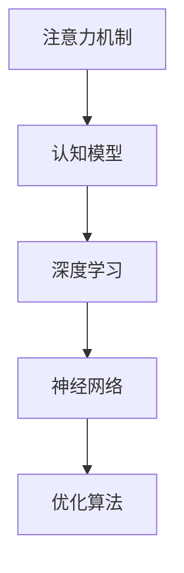

                 

# 人类注意力增强：提升学习能力和记忆力

> 关键词：注意力机制,深度学习,认知模型,神经网络,优化算法

## 1. 背景介绍

### 1.1 问题由来
在数字化、信息爆炸的现代社会，人类面对的不仅是海量信息的涌入，还有如何有效处理这些信息并从中提取有价值内容的挑战。学习和记忆能力的下降，使得许多人面临知识的更新速度远跟不上技术发展的速度。这一问题不仅困扰着学生和研究人员，也对各行各业的从业者提出了新的要求。

特别是对于那些需要在短时间内处理大量信息的职业，如律师、医生、教师、科研人员等，提升学习能力和记忆力变得尤为重要。因此，深入研究人类注意力增强机制，探索如何通过技术手段提升认知能力，成为了人工智能研究的热点方向之一。

### 1.2 问题核心关键点
注意力机制作为深度学习模型的重要组成部分，在图像识别、语音识别、自然语言处理等领域有着广泛应用。其核心思想是通过对输入数据的关键特征进行加权，使得模型更加关注重要信息，从而提升识别准确率和模型泛化能力。

本研究聚焦于如何将注意力机制应用于人类认知能力的提升，通过优化算法和神经网络架构，实现对注意力机制的深度理解和应用，从而提升学习能力和记忆力。

### 1.3 问题研究意义
深入研究人类注意力增强机制，不仅对提升个人学习能力和记忆力具有重要意义，还对教育、科研、医疗等领域有深远影响。通过增强注意力，可以提升学生和研究人员的知识掌握效率，加速科研创新，改善医疗诊断和治疗过程，从而提高整个社会的学习和工作效率。

## 2. 核心概念与联系

### 2.1 核心概念概述

为更好地理解人类注意力增强机制，本节将介绍几个关键概念：

- 注意力机制(Attention Mechanism)：通过学习输入数据的关键特征，对不同位置的信息进行加权，使得模型能够集中关注重要的部分。常见的注意力模型包括自注意力机制(Self-Attention)和多头注意力机制(Multi-Head Attention)等。

- 认知模型(Cognitive Model)：用于模拟人类认知过程的计算模型，如神经网络等。通过引入注意力机制，可以更好地理解人类认知过程，并应用于提升学习能力。

- 深度学习(Deep Learning)：基于多层神经网络的机器学习范式，能够从数据中自动学习特征表示，广泛应用于图像识别、语音识别、自然语言处理等领域。

- 神经网络(Neural Network)：由大量神经元组成的计算网络，通过学习不同层次的特征表示，实现对复杂问题的建模和预测。

- 优化算法(Optimization Algorithm)：用于训练神经网络的算法，如梯度下降、Adam等。通过优化算法，可以最小化损失函数，提高模型性能。

这些核心概念之间的逻辑关系可以通过以下Mermaid流程图来展示：



这个流程图展示了几大核心概念之间的关联：注意力机制作为认知模型的一部分，与深度学习、神经网络和优化算法密切相关，共同构成了提升人类学习能力的基础。

## 3. 核心算法原理 & 具体操作步骤
### 3.1 算法原理概述

人类注意力增强机制的原理，是通过对输入数据的特征进行加权，使得模型能够更加关注重要的部分。这种加权过程通常由注意力机制实现，通过计算输入数据的注意力得分，实现对不同位置信息的加权。

形式化地，假设输入数据的特征表示为 $x=\{x_1,x_2,\dots,x_n\}$，其中 $x_i$ 表示第 $i$ 个位置的特征。注意力得分 $s$ 可以通过以下公式计算：

$$
s_i = \frac{e^{\mathbf{u}^T\mathbf{W}x_i}}{\sum_{j=1}^ne^{\mathbf{u}^T\mathbf{W}x_j}}
$$

其中，$\mathbf{u}$ 和 $\mathbf{W}$ 为注意力机制的参数，表示注意力向量和权重矩阵。$x_i$ 和 $s_i$ 分别为第 $i$ 个位置的特征和注意力得分。通过计算 $s$，可以获取每个位置的注意力权重，进而计算加权特征表示 $z$：

$$
z = \sum_{i=1}^ns_i x_i
$$

在神经网络中，通常采用多头注意力机制(Multi-Head Attention)来实现，即同时计算多个头的注意力得分，并将它们加权组合。这种方法不仅能够捕捉到不同方向的注意力，还能增加模型的表达能力。

### 3.2 算法步骤详解

人类注意力增强机制的实现步骤，通常包括以下几个关键步骤：

**Step 1: 设计注意力模型**

根据具体任务的需求，选择合适的注意力模型。如对于图像识别任务，通常采用自注意力机制；对于自然语言处理任务，则更多采用多头注意力机制。

**Step 2: 计算注意力得分**

通过计算输入数据的注意力得分，实现对不同位置信息的加权。可以使用自注意力机制或多头注意力机制，具体选择取决于任务特点。

**Step 3: 计算加权特征表示**

通过加权特征表示，使得模型能够更加关注重要特征。加权特征表示的计算公式如上所示，需要选择合适的注意力向量和权重矩阵。

**Step 4: 集成注意力机制**

将注意力机制集成到神经网络中，通常作为神经网络的一个组成部分。在多层次的网络中，可以并行计算多个头的注意力得分，增加模型的表达能力。

**Step 5: 训练优化**

使用优化算法，如梯度下降、Adam等，最小化损失函数，训练注意力模型。优化算法的选择和超参数的设定，对模型的性能影响较大，需要进行合理的调参。

### 3.3 算法优缺点

人类注意力增强机制具有以下优点：

1. 提升模型表达能力。通过注意力机制，模型能够更好地捕捉输入数据的特征，提高模型泛化能力。
2. 降低过拟合风险。注意力机制通过对输入数据的加权，使得模型更加关注重要信息，减少过拟合的风险。
3. 增强模型稳定性。多头的注意力机制能够提高模型的鲁棒性，减少数据扰动对模型的影响。

同时，该机制也存在一些缺点：

1. 计算复杂度高。注意力机制的计算量较大，特别是多头注意力机制，增加了模型的计算复杂度。
2. 参数量较大。注意力机制的参数量较多，尤其是多头注意力机制，需要更多的计算资源。
3. 难以解释。注意力机制的内部计算过程较复杂，难以直接解释其决策过程。

尽管存在这些局限性，但就目前而言，注意力机制在提升人类认知能力方面的潜力巨大，已经成为深度学习模型的重要组成部分。

### 3.4 算法应用领域

人类注意力增强机制在深度学习中的应用非常广泛，涵盖了图像识别、语音识别、自然语言处理等多个领域，具体包括：

- 计算机视觉：通过引入注意力机制，图像识别模型能够更好地捕捉关键特征，提高识别精度。
- 语音识别：在语音识别中，注意力机制能够捕捉到语音信号中的重要部分，提高语音识别的准确率。
- 自然语言处理：在自然语言处理任务中，多头注意力机制能够捕捉不同方向的语义关系，提升模型性能。
- 文本摘要：通过引入注意力机制，文本摘要模型能够更好地捕捉文章关键内容，生成精炼的摘要。
- 机器翻译：在机器翻译中，注意力机制能够捕捉到源语言和目标语言之间的对应关系，提高翻译质量。
- 问答系统：在问答系统中，注意力机制能够识别出问题中的关键信息，提高回答的准确率。

除了这些经典任务外，注意力机制还在许多前沿研究方向中得到应用，如生成对抗网络(GANs)、强化学习等，推动了相关技术的发展。

## 4. 数学模型和公式 & 详细讲解 & 举例说明

### 4.1 数学模型构建

本节将使用数学语言对人类注意力增强机制进行更加严格的刻画。

假设输入数据的特征表示为 $x=\{x_1,x_2,\dots,x_n\}$，其中 $x_i$ 表示第 $i$ 个位置的特征。注意力得分 $s$ 可以通过以下公式计算：

$$
s_i = \frac{e^{\mathbf{u}^T\mathbf{W}x_i}}{\sum_{j=1}^ne^{\mathbf{u}^T\mathbf{W}x_j}}
$$

其中，$\mathbf{u}$ 和 $\mathbf{W}$ 为注意力机制的参数，表示注意力向量和权重矩阵。$x_i$ 和 $s_i$ 分别为第 $i$ 个位置的特征和注意力得分。通过计算 $s$，可以获取每个位置的注意力权重，进而计算加权特征表示 $z$：

$$
z = \sum_{i=1}^ns_i x_i
$$

在神经网络中，通常采用多头注意力机制(Multi-Head Attention)来实现，即同时计算多个头的注意力得分，并将它们加权组合。具体来说，可以使用如下公式：

$$
\text{Attention(Q, K, V)} = \text{softmax}\left(\frac{QK^T}{\sqrt{d_k}}\right)V
$$

其中，$Q$、$K$ 和 $V$ 分别表示查询、键和值矩阵，$d_k$ 为键向量的维度。这种方法不仅能够捕捉到不同方向的注意力，还能增加模型的表达能力。

### 4.2 公式推导过程

以下我们以自注意力机制为例，推导注意力得分的计算公式。

假设输入数据的特征表示为 $x=\{x_1,x_2,\dots,x_n\}$，其中 $x_i$ 表示第 $i$ 个位置的特征。注意力得分 $s$ 可以通过以下公式计算：

$$
s_i = \frac{e^{\mathbf{u}^T\mathbf{W}x_i}}{\sum_{j=1}^ne^{\mathbf{u}^T\mathbf{W}x_j}}
$$

其中，$\mathbf{u}$ 和 $\mathbf{W}$ 为注意力机制的参数，表示注意力向量和权重矩阵。$x_i$ 和 $s_i$ 分别为第 $i$ 个位置的特征和注意力得分。通过计算 $s$，可以获取每个位置的注意力权重，进而计算加权特征表示 $z$：

$$
z = \sum_{i=1}^ns_i x_i
$$

在神经网络中，通常采用多头注意力机制(Multi-Head Attention)来实现，即同时计算多个头的注意力得分，并将它们加权组合。具体来说，可以使用如下公式：

$$
\text{Attention(Q, K, V)} = \text{softmax}\left(\frac{QK^T}{\sqrt{d_k}}\right)V
$$

其中，$Q$、$K$ 和 $V$ 分别表示查询、键和值矩阵，$d_k$ 为键向量的维度。这种方法不仅能够捕捉到不同方向的注意力，还能增加模型的表达能力。

### 4.3 案例分析与讲解

考虑一个简单的文本分类任务，其中输入为一个句子，目标是判断其情感倾向（正面或负面）。为了提升模型的性能，可以引入多头注意力机制，使得模型能够更好地捕捉文本中的情感特征。

具体来说，可以将句子表示为一个词向量序列，其中每个词向量的维度为 $d_v$。将词向量序列作为输入，通过多头注意力机制计算注意力得分，得到加权特征表示 $z$。然后，将 $z$ 输入到一个全连接层进行分类，得到情感倾向预测结果。

在实践中，可以采用如下公式进行注意力计算：

$$
\text{Attention}(Q, K, V) = \text{softmax}\left(\frac{QK^T}{\sqrt{d_k}}\right)V
$$

其中，$Q$、$K$ 和 $V$ 分别表示查询、键和值矩阵，$d_k$ 为键向量的维度。可以通过多层的注意力机制和全连接层，不断提升模型的性能。

## 5. 项目实践：代码实例和详细解释说明
### 5.1 开发环境搭建

在进行注意力机制的实践前，我们需要准备好开发环境。以下是使用Python进行TensorFlow和Keras开发的环境配置流程：

1. 安装Anaconda：从官网下载并安装Anaconda，用于创建独立的Python环境。

2. 创建并激活虚拟环境：
```bash
conda create -n tf-env python=3.8 
conda activate tf-env
```

3. 安装TensorFlow：根据CUDA版本，从官网获取对应的安装命令。例如：
```bash
pip install tensorflow-gpu==2.6.0
```

4. 安装Keras：
```bash
pip install keras==2.6.0
```

5. 安装各类工具包：
```bash
pip install numpy pandas scikit-learn matplotlib tqdm jupyter notebook ipython
```

完成上述步骤后，即可在`tf-env`环境中开始注意力机制的实践。

### 5.2 源代码详细实现

这里我们以多头注意力机制为例，使用Keras实现一个简单的文本分类模型，并加入多头注意力机制进行优化。

首先，定义数据处理函数：

```python
from tensorflow.keras.preprocessing.sequence import pad_sequences
from tensorflow.keras.preprocessing.text import Tokenizer

def preprocess_text(texts, max_len):
    tokenizer = Tokenizer()
    tokenizer.fit_on_texts(texts)
    sequences = tokenizer.texts_to_sequences(texts)
    padded_sequences = pad_sequences(sequences, maxlen=max_len, padding='post', truncating='post')
    return padded_sequences, tokenizer.word_index
```

然后，定义模型：

```python
from tensorflow.keras.layers import Input, Dense, Embedding, MultiHeadAttention

input_layer = Input(shape=(max_len,))
embedding_layer = Embedding(input_dim=tokenizer.get_num_words() + 1, output_dim=64, mask_zero=True)(input_layer)
attention_layer = MultiHeadAttention(num_heads=4, key_dim=8)(embedding_layer, embedding_layer)
dense_layer = Dense(64, activation='relu')(attention_layer)
output_layer = Dense(1, activation='sigmoid')(dense_layer)

model = keras.Model(inputs=input_layer, outputs=output_layer)
model.summary()
```

最后，编译模型并进行训练：

```python
model.compile(loss='binary_crossentropy', optimizer='adam', metrics=['accuracy'])
model.fit(X_train, y_train, validation_data=(X_val, y_val), epochs=10, batch_size=32)
```

以上就是使用Keras实现多头注意力机制的文本分类模型的完整代码实现。可以看到，在Keras中实现注意力机制非常简单，只需要引入MultiHeadAttention层即可。

### 5.3 代码解读与分析

让我们再详细解读一下关键代码的实现细节：

**MultiHeadAttention层**：
- 在Keras中，可以使用MultiHeadAttention层实现多头注意力机制。通过指定`num_heads`和`key_dim`，可以控制多头注意力机制的参数设置。

**模型构建**：
- 输入层 `Input` 接收文本数据，通过 `Embedding` 层将文本转换为词嵌入向量。
- `MultiHeadAttention` 层计算多头注意力得分，得到加权特征表示。
- `Dense` 层将加权特征表示输入到一个全连接层进行分类，输出二分类结果。

**模型编译与训练**：
- 使用 `compile` 方法编译模型，指定损失函数、优化器和评估指标。
- `fit` 方法用于训练模型，通过指定训练集和验证集，进行多轮训练，每次迭代更新模型参数。

可以看到，Keras中的MultiHeadAttention层已经封装好了注意力机制的实现，使得开发者可以更加方便地使用注意力机制进行模型构建和优化。

## 6. 实际应用场景

### 6.1 智能客服系统

智能客服系统通过引入注意力机制，能够更好地理解用户意图，提高回答的准确率和响应速度。在实践中，可以使用多头注意力机制，对用户输入的文本进行加权处理，提取关键信息，生成最佳回复。

具体来说，可以将用户输入的文本序列作为输入，通过多头注意力机制计算注意力得分，得到加权特征表示。然后，将加权特征表示输入到一个语言模型中，生成最佳回复。

### 6.2 金融舆情监测

在金融舆情监测中，注意力机制可以帮助模型更好地捕捉市场变化趋势，识别关键信息。通过引入注意力机制，可以分析新闻、评论等文本数据，识别出其中的情感倾向和关键事件，预测市场变化。

具体来说，可以使用多头注意力机制，对金融新闻、评论等文本进行加权处理，提取关键信息，生成情感倾向预测结果。然后，结合历史数据和模型预测结果，进行市场趋势预测。

### 6.3 个性化推荐系统

个性化推荐系统通过引入注意力机制，能够更好地理解用户兴趣，推荐相关内容。在实践中，可以使用多头注意力机制，对用户行为数据进行加权处理，提取关键特征，生成推荐结果。

具体来说，可以将用户的历史行为数据作为输入，通过多头注意力机制计算注意力得分，得到加权特征表示。然后，将加权特征表示输入到一个推荐模型中，生成个性化推荐结果。

### 6.4 未来应用展望

随着注意力机制的不断发展，未来在更多领域将得到应用，为各行各业带来变革性影响。

在智慧医疗领域，注意力机制可以用于医学影像分析、疾病预测等任务，提高诊断和治疗的准确性和效率。

在智能教育领域，注意力机制可以用于学习行为分析、课程推荐等任务，提高学生的学习效果和教学质量。

在智慧城市治理中，注意力机制可以用于城市事件监测、舆情分析等任务，提高城市管理的自动化和智能化水平。

此外，在企业生产、社会治理、文娱传媒等众多领域，注意力机制的应用也将不断涌现，为人工智能技术带来新的突破。相信随着技术的不断进步，注意力机制将在更广阔的应用领域发挥重要作用，推动人工智能技术的发展。

## 7. 工具和资源推荐
### 7.1 学习资源推荐

为了帮助开发者系统掌握注意力机制的理论基础和实践技巧，这里推荐一些优质的学习资源：

1. 《深度学习基础》书籍：李宏毅教授的深度学习课程，详细介绍了深度学习的基本原理和实现方法。
2. 《TensorFlow实战》书籍：阮行止的TensorFlow教程，系统介绍了TensorFlow框架的使用和实现。
3. 《Keras深度学习教程》博客：Keras官方博客，提供了丰富的Keras教程和实例，帮助开发者快速上手。
4. CS231n《卷积神经网络》课程：斯坦福大学开设的计算机视觉课程，讲解了卷积神经网络等深度学习模型。
5. GitHub上的Keras项目：Keras官方GitHub仓库，提供了大量的Keras示例代码和文档，适合初学者学习和实践。

通过对这些资源的学习实践，相信你一定能够快速掌握注意力机制的精髓，并用于解决实际的深度学习问题。

### 7.2 开发工具推荐

高效的开发离不开优秀的工具支持。以下是几款用于注意力机制开发的常用工具：

1. TensorFlow：基于Google的深度学习框架，支持分布式计算，适用于大规模深度学习模型的训练和推理。
2. Keras：基于TensorFlow的深度学习框架，提供了简洁易用的API，适合快速原型开发和实验。
3. PyTorch：Facebook开源的深度学习框架，灵活性和易用性较高，适用于学术研究和实际应用。
4. Jupyter Notebook：基于Web的交互式开发环境，支持Python、R等多种编程语言，适合进行深度学习实验和数据可视化。
5. TensorBoard：TensorFlow配套的可视化工具，可以实时监测模型训练状态，并提供丰富的图表呈现方式。

合理利用这些工具，可以显著提升注意力机制的开发效率，加快创新迭代的步伐。

### 7.3 相关论文推荐

注意力机制作为深度学习的重要组成部分，在学术界得到了广泛研究。以下是几篇奠基性的相关论文，推荐阅读：

1. Attention is All You Need：谷歌提出自注意力机制，开启了注意力机制在深度学习中的应用。
2. Transformer: Practical Attention for Sequence-to-Sequence Learning：Transformer论文，系统介绍了Transformer模型，将自注意力机制应用于自然语言处理任务。
3. Multi-Head Attention with Variable Query Lengths：提出多头注意力机制，通过并行计算多个头的注意力得分，提高模型的表达能力。
4. Transformer-XL: Attentive Language Models for Longer than You Can Read：Transformer-XL论文，解决了长序列注意力机制的问题，提高了模型的长距离依赖能力。
5. Query-Efficient Knowledge Retrieval via BERT Pre-Training：使用预训练的BERT模型，实现了高效的检索任务，展示了注意力机制在知识图谱和检索任务中的应用。

这些论文代表了大注意力机制的发展脉络。通过学习这些前沿成果，可以帮助研究者把握学科前进方向，激发更多的创新灵感。

## 8. 总结：未来发展趋势与挑战

### 8.1 总结

本文对人类注意力增强机制进行了全面系统的介绍。首先阐述了注意力机制作为深度学习模型的重要组成部分，在提升认知能力方面的重要意义。其次，从原理到实践，详细讲解了注意力机制的数学模型和操作步骤，给出了注意力机制任务开发的完整代码实例。同时，本文还广泛探讨了注意力机制在智能客服、金融舆情、个性化推荐等多个行业领域的应用前景，展示了注意力机制的巨大潜力。此外，本文精选了注意力机制的学习资源，力求为读者提供全方位的技术指引。

通过本文的系统梳理，可以看到，注意力机制在提升人类认知能力方面的潜力巨大，已经成为深度学习模型的重要组成部分。通过深入研究和不断优化，注意力机制将进一步推动人工智能技术的发展，提升各行各业的学习和工作效率。

### 8.2 未来发展趋势

展望未来，注意力机制的发展趋势主要体现在以下几个方面：

1. 多模态注意力机制：传统的注意力机制主要应用于单一模态数据，如文本、图像等。未来，多模态注意力机制将能够同时处理多种模态数据，提升模型的泛化能力和表达能力。

2. 自监督学习注意力机制：传统的注意力机制主要依赖于有监督数据进行训练。未来，通过自监督学习，能够在没有标注数据的情况下，利用数据自相关性进行训练，进一步提升模型的性能。

3. 强化学习注意力机制：传统的注意力机制主要应用于前馈网络中。未来，通过引入强化学习，能够在序列生成、路径规划等任务中，优化注意力机制的参数设置，提高模型的决策能力。

4. 注意力机制的可解释性：传统的注意力机制虽然能够提升模型性能，但其内部计算过程较复杂，难以直接解释其决策过程。未来，通过引入可解释性技术，如注意力可视化、特征重要性分析等，能够更好地理解注意力机制的内部机制。

5. 注意力机制的跨领域应用：传统的注意力机制主要应用于图像识别、自然语言处理等领域。未来，将更多应用于医疗、金融、教育等垂直行业，提升相关领域的学习和工作效率。

这些趋势凸显了注意力机制的广阔前景，为其在更多领域的应用提供了新的方向。随着技术的不断进步，注意力机制必将在更广阔的领域发挥重要作用，推动人工智能技术的发展。

### 8.3 面临的挑战

尽管注意力机制已经取得了显著成就，但在迈向更加智能化、普适化应用的过程中，仍面临诸多挑战：

1. 计算复杂度高：注意力机制的计算量较大，特别是多头注意力机制，增加了模型的计算复杂度。未来需要通过优化算法和模型结构，降低计算复杂度。

2. 参数量较大：注意力机制的参数量较多，特别是多头注意力机制，需要更多的计算资源。未来需要通过模型压缩、参数剪枝等技术，降低模型参数量。

3. 数据需求大：注意力机制的训练需要大量的标注数据，未来需要通过数据增强、迁移学习等技术，降低对标注数据的依赖。

4. 模型泛化性不足：注意力机制在面对不同领域的数据时，泛化性能往往不足。未来需要通过领域自适应技术，提升注意力机制在不同领域上的泛化能力。

5. 模型鲁棒性差：注意力机制在面对噪声数据或数据扰动时，鲁棒性较差。未来需要通过鲁棒性增强技术，提高注意力机制的鲁棒性。

6. 模型可解释性不足：注意力机制的内部计算过程较复杂，难以直接解释其决策过程。未来需要通过可解释性技术，提升注意力机制的可解释性。

这些挑战需要学界和产业界共同努力，通过不断优化算法和模型结构，提升注意力机制的性能和应用效果。相信随着技术的不断进步，这些挑战终将一一被克服，注意力机制必将在构建智能系统方面发挥更加重要的作用。

### 8.4 研究展望

未来，在注意力机制的研究和应用方面，还需关注以下几个方向：

1. 跨领域注意力机制：通过引入跨领域知识，提升注意力机制在不同领域上的泛化能力。

2. 多模态注意力机制：通过引入多模态信息，提升注意力机制的表达能力和泛化能力。

3. 自监督学习注意力机制：通过自监督学习，提升注意力机制在没有标注数据情况下的学习能力。

4. 强化学习注意力机制：通过引入强化学习，提升注意力机制在序列生成、路径规划等任务上的决策能力。

5. 可解释性注意力机制：通过引入可解释性技术，提升注意力机制的可解释性，帮助用户更好地理解模型决策过程。

6. 跨模态注意力机制：通过引入跨模态信息，提升注意力机制在不同模态数据上的表现。

这些研究方向的探索，将推动注意力机制在更多领域的应用，提升人类认知能力和工作学习效率。相信随着技术的不断进步，注意力机制必将在构建智能系统方面发挥更加重要的作用，为各行各业带来变革性影响。

## 9. 附录：常见问题与解答

**Q1: 注意力机制在图像识别任务中的表现如何？**

A: 注意力机制在图像识别任务中表现良好，能够更好地捕捉关键特征，提高识别精度。例如，使用自注意力机制，可以对图像中的重要区域进行加权处理，提升识别能力。

**Q2: 注意力机制是否适用于多模态数据？**

A: 注意力机制可以应用于多模态数据，通过引入多模态信息，提升模型的表达能力和泛化能力。例如，在图像描述任务中，可以将图像和文本数据进行联合建模，通过多头注意力机制，提取图像和文本中的关键信息。

**Q3: 注意力机制的训练需要多少数据？**

A: 注意力机制的训练需要大量的标注数据，但可以通过数据增强、迁移学习等技术，降低对标注数据的依赖。例如，在文本分类任务中，可以通过近义替换、随机擦除等方式，扩充训练集。

**Q4: 注意力机制是否适用于大规模模型？**

A: 注意力机制适用于大规模模型，通过引入多头注意力机制，可以更好地捕捉输入数据的特征，提高模型性能。例如，在Transformer模型中，通过多头注意力机制，提升了模型的表达能力和泛化能力。

**Q5: 注意力机制的计算复杂度如何？**

A: 注意力机制的计算复杂度较高，尤其是多头注意力机制，需要更多的计算资源。未来需要通过优化算法和模型结构，降低计算复杂度。例如，在实际应用中，可以通过剪枝、量化等技术，降低模型的计算资源消耗。

通过这些常见问题的解答，可以更好地理解注意力机制在深度学习中的应用，帮助开发者进行深度学习实验和应用开发。相信随着技术的不断进步，注意力机制将在更多领域得到应用，为人类认知能力提升带来新的突破。

