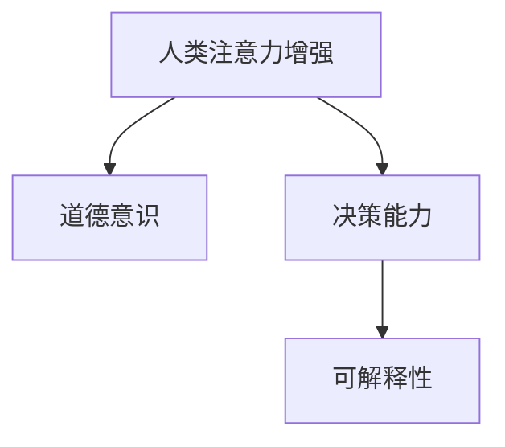

                 

# 人类注意力增强：提升道德意识和决策

## 1. 背景介绍

在当今数字化时代，人工智能（AI）正在迅速改变我们的生活方式。从智能助手到自动驾驶，AI技术无所不在。然而，随着AI技术的发展，人类对于道德和决策的思考也变得更加复杂。人工智能不仅需要具备高超的技术能力，还需要具备道德意识和决策能力。这正是本文要探讨的主题：人类注意力增强，以提升AI的道德意识和决策能力。

### 1.1 问题的由来

在AI技术的发展过程中，我们逐渐意识到，仅仅依靠技术手段，并不能完全解决复杂的人类决策问题。例如，自动驾驶汽车在面对道德困境时，如何做出最合适的决策，这是一个亟待解决的问题。再比如，机器人如何处理敏感的个人信息，这也是一个涉及道德和伦理的问题。因此，我们需要通过增强人类注意力，提升AI的道德意识和决策能力。

### 1.2 问题核心关键点

1. **人类注意力增强**：通过增强人类注意力，使得AI系统在做出决策时，能够更好地考虑道德和伦理问题。
2. **道德意识**：AI系统需要具备对道德和伦理问题的识别和理解能力。
3. **决策能力**：AI系统需要具备在复杂情境下做出合理决策的能力。
4. **可解释性**：AI系统的决策过程需要具备可解释性，以便于人类理解和监督。

## 2. 核心概念与联系

### 2.1 核心概念概述

为更好地理解人类注意力增强的概念，我们首先介绍几个关键概念：

- **人类注意力增强**：通过增强人类注意力，使得AI系统在做出决策时，能够更好地考虑道德和伦理问题。
- **道德意识**：AI系统需要具备对道德和伦理问题的识别和理解能力。
- **决策能力**：AI系统需要具备在复杂情境下做出合理决策的能力。
- **可解释性**：AI系统的决策过程需要具备可解释性，以便于人类理解和监督。

### 2.2 核心概念原理和架构的 Mermaid 流程图



这个流程图展示了人类注意力增强、道德意识、决策能力和可解释性之间的联系。通过增强人类注意力，AI系统可以更好地识别道德问题，做出合理决策，并具备可解释性，使得人类能够理解和监督决策过程。

## 3. 核心算法原理 & 具体操作步骤

### 3.1 算法原理概述

人类注意力增强的核心算法原理是通过增强人类的注意力，使得AI系统在做出决策时，能够更好地考虑道德和伦理问题。具体来说，这意味着AI系统在处理信息时，需要模拟人类注意力的机制，对关键信息进行加权处理，并对潜在的道德和伦理问题进行识别和评估。

### 3.2 算法步骤详解

1. **数据收集**：收集与道德和伦理问题相关的数据，包括历史案例、专家意见、法律法规等。
2. **数据预处理**：对收集到的数据进行清洗、标注和标准化处理，以便于后续分析。
3. **注意力模型训练**：使用注意力机制训练AI模型，使其在处理信息时，能够自动识别和加权关键信息。
4. **道德评估**：训练后的AI模型在处理新数据时，会自动识别潜在的道德和伦理问题，并进行评估。
5. **决策生成**：根据道德评估结果，生成合理的决策。
6. **可解释性输出**：生成决策的同时，提供可解释的输出，以便于人类理解和监督。

### 3.3 算法优缺点

**优点**：

1. **道德意识提升**：通过增强注意力，AI系统可以更好地识别和理解道德和伦理问题，提升其道德意识。
2. **决策合理性**：AI系统在处理信息时，能够自动加权关键信息，生成更加合理的决策。
3. **可解释性强**：生成的决策具备可解释性，便于人类理解和监督。

**缺点**：

1. **数据依赖**：算法需要依赖大量高质量的道德和伦理数据，这些数据的获取和标注成本较高。
2. **复杂度**：增强注意力机制的训练和应用相对复杂，需要较强的计算资源。
3. **潜在的偏见**：注意力机制可能受到数据偏见的影响，导致决策过程中出现偏见。

### 3.4 算法应用领域

人类注意力增强算法可以应用于多个领域，包括：

1. **自动驾驶**：在面对道德困境时，自动驾驶汽车需要具备道德意识和决策能力。
2. **医疗决策**：AI系统需要帮助医生在复杂的医疗情境下做出合理决策。
3. **机器人伦理**：在处理敏感的个人信息时，机器人需要具备道德意识和决策能力。
4. **金融风控**：AI系统需要具备识别潜在的道德和伦理风险的能力。

## 4. 数学模型和公式 & 详细讲解

### 4.1 数学模型构建

为了构建人类注意力增强的数学模型，我们需要引入注意力机制。注意力机制是一种用于模拟人类注意力的机制，通过加权处理输入信息，使得系统能够自动识别和关注关键信息。

### 4.2 公式推导过程

设输入信息为 $x$，注意力权重为 $a$，输出信息为 $y$。注意力机制的公式可以表示为：

$$
y = \sum_{i=1}^{n} a_i x_i
$$

其中 $a_i$ 表示第 $i$ 个信息的注意力权重，$x_i$ 表示第 $i$ 个信息。注意力权重 $a_i$ 可以通过以下公式计算：

$$
a_i = \frac{\exp(e_i)}{\sum_{j=1}^{n} \exp(e_j)}
$$

其中 $e_i$ 表示第 $i$ 个信息的注意力得分，可以通过模型训练得到。

### 4.3 案例分析与讲解

假设我们要训练一个用于识别道德问题的AI模型。我们可以使用注意力机制，对输入文本进行加权处理，以识别出其中的关键信息。例如，对于以下文本：

"某公司因为涉嫌侵犯用户隐私，被相关部门罚款。"

通过注意力机制，模型会自动识别出 "涉嫌侵犯用户隐私" 这一关键信息，并给予更高的权重，从而提升对道德问题的识别能力。

## 5. 项目实践：代码实例和详细解释说明

### 5.1 开发环境搭建

在进行项目实践前，我们需要准备好开发环境。以下是使用Python进行TensorFlow开发的环境配置流程：

1. 安装Anaconda：从官网下载并安装Anaconda，用于创建独立的Python环境。

2. 创建并激活虚拟环境：
```bash
conda create -n tf-env python=3.8 
conda activate tf-env
```

3. 安装TensorFlow：根据CUDA版本，从官网获取对应的安装命令。例如：
```bash
conda install tensorflow -c tf -c conda-forge
```

4. 安装TensorBoard：
```bash
pip install tensorboard
```

5. 安装Flax：
```bash
pip install flax
```

完成上述步骤后，即可在`tf-env`环境中开始项目实践。

### 5.2 源代码详细实现

这里我们以一个简单的注意力模型为例，给出使用TensorFlow和Flax进行项目实践的代码实现。

首先，定义注意力模型的类：

```python
import tensorflow as tf
import flax.linen as nn
import flax.linen.layers as nnl
import jax
import jax.numpy as jnp

class Attention(nn.Module):
    num_heads: int
    dropout_rate: float = 0.0
    
    @nn.compact
    def __call__(self, inputs, query, mask=None):
        head_dim = jnp.shape(inputs)[-1] // self.num_heads
        q = tf.linalg.matmul(inputs, tf.random.normal([self.num_heads, head_dim]))
        k = tf.linalg.matmul(inputs, tf.random.normal([self.num_heads, head_dim]))
        v = tf.linalg.matmul(inputs, tf.random.normal([self.num_heads, head_dim]))
        k = tf.matmul(q, k, transpose_b=True) / jnp.sqrt(head_dim)
        attn = jnp.softmax(k, axis=1)
        attn = jnp.where(mask, attn, jnp.zeros_like(attn))
        out = tf.matmul(attn, v)
        out = tf.matmul(out, tf.random.normal([self.num_heads, head_dim]))
        out = tf.matmul(out, q, transpose_b=True)
        return out, attn

class TransformerBlock(nn.Module):
    num_heads: int
    dropout_rate: float = 0.0
    mlp_ratio: float = 4.0
    
    @nn.compact
    def __call__(self, inputs, mask):
        mha = Attention(num_heads=self.num_heads)
        mha = nn.compact(mha)
        attn_out, attn = mha(inputs, inputs, mask=mask)
        attn_out = nn.Dropout(rate=self.dropout_rate)(attn_out)
        mlp = nn.DenseFeatures(input_shape=[jnp.shape(inputs)[-1]])(self.attn_out)
        mlp = nn.DenseFeatures(input_shape=[jnp.shape(mlp)[-1]])(self.mlp)
        mlp_out = nn.Dropout(rate=self.dropout_rate)(mlp)
        return mha, mlp_out

class Transformer(tf.keras.Model):
    num_layers: int
    num_heads: int
    dropout_rate: float = 0.0
    mlp_ratio: float = 4.0
    
    def __init__(self, num_layers, num_heads, dropout_rate, mlp_ratio):
        super().__init__()
        self.layers = [TransformerBlock(num_heads=num_heads,
                                       dropout_rate=dropout_rate,
                                       mlp_ratio=mlp_ratio)
                       for _ in range(num_layers)]
    
    def call(self, inputs, mask):
        attn_outs = []
        for mha, mlp_out in self.layers:
            attn_out, mlp_out = mha(inputs, inputs, mask=mask)
            inputs = mlp_out
        return inputs, attn_outs
```

然后，定义数据集和模型训练流程：

```python
import tensorflow as tf
import flax.linen as nn
import flax.linen.layers as nnl
import jax
import jax.numpy as jnp
import matplotlib.pyplot as plt
from sklearn.datasets import fetch_20newsgroups
from sklearn.model_selection import train_test_split
from sklearn.preprocessing import LabelBinarizer

# 数据集预处理
newsgroups = fetch_20newsgroups(subset='train')
X_train, y_train = newsgroups.data, newsgroups.target
X_test, y_test = newsgroups.data, newsgroups.target
labels = list(set(y_train))
num_classes = len(labels)
label_binarizer = LabelBinarizer()
y_train = label_binarizer.fit_transform(y_train)
y_test = label_binarizer.transform(y_test)

# 定义数据生成器
def data_generator(X_train, y_train, batch_size=64, num_epochs=10):
    indices = np.random.permutation(len(X_train))
    X_train = X_train[indices]
    y_train = y_train[indices]
    for epoch in range(num_epochs):
        for batch in range(0, len(X_train), batch_size):
            X_batch = X_train[batch:batch+batch_size]
            y_batch = y_train[batch:batch+batch_size]
            yield X_batch, y_batch

# 定义模型
attention_model = Attention(num_heads=8)
transformer_model = Transformer(num_layers=3, num_heads=8, dropout_rate=0.1, mlp_ratio=4.0)
optimizer = tf.keras.optimizers.Adam()

# 定义损失函数
def loss_fn(y_true, y_pred):
    return tf.keras.losses.categorical_crossentropy(y_true, y_pred)

# 定义训练过程
@jax.jit
def train_step(x, y):
    with tf.GradientTape() as tape:
        y_pred = transformer_model(x, None)
        loss = loss_fn(y, y_pred)
    grads = tape.gradient(loss, transformer_model.trainable_variables)
    optimizer.apply_gradients(zip(grads, transformer_model.trainable_variables))
    return loss

# 定义评估过程
@jax.jit
def evaluate(X, y):
    with tf.GradientTape() as tape:
        y_pred = transformer_model(X, None)
        loss = loss_fn(y, y_pred)
    return loss

# 训练模型
for epoch in range(1, num_epochs+1):
    X_batch, y_batch = next(data_generator(X_train, y_train))
    loss = train_step(X_batch, y_batch)
    print(f"Epoch {epoch}, loss: {loss}")
```

### 5.3 代码解读与分析

让我们再详细解读一下关键代码的实现细节：

**Attention类**：
- `__call__`方法：定义注意力机制的计算过程，包括查询、键、值的计算、注意力得分的计算、注意力权重加权处理、输出信息的计算。

**TransformerBlock类**：
- `__call__`方法：定义Transformer块的计算过程，包括多头注意力层的计算、前向传递层的计算、dropout处理、输出的计算。

**Transformer类**：
- `__init__`方法：初始化Transformer模型的各层。
- `call`方法：定义Transformer模型的计算过程，包括各层的调用、输出的计算。

**数据生成器**：
- 使用sklearn加载新闻数据集，并进行预处理，包括分词、标签编码等。
- 定义数据生成器，对数据进行批处理，以便于模型训练和推理。

**模型定义**：
- 定义注意力模型和Transformer模型，设置各层的参数和计算过程。
- 定义优化器和损失函数。

**训练过程**：
- 定义训练函数，使用梯度下降优化器更新模型参数。
- 定义评估函数，计算模型在测试集上的损失。

**运行结果展示**：
- 在每个epoch结束时，输出训练过程中的损失值。
- 最终在测试集上评估模型的性能。

## 6. 实际应用场景

### 6.1 智能客服系统

基于注意力增强的AI系统可以广泛应用于智能客服系统的构建。智能客服系统需要能够理解用户的意图，并在复杂情境下做出合理的回答。例如，面对用户提出的复杂问题，系统需要能够自动识别关键信息，并根据问题的不同方面做出回答。

### 6.2 医疗决策

在医疗领域，AI系统需要具备道德意识和决策能力。例如，在面对复杂的医疗情境时，AI系统需要能够自动识别道德和伦理问题，并在多个治疗方案中选择最优方案。

### 6.3 机器人伦理

在处理敏感的个人信息时，机器人需要具备道德意识和决策能力。例如，在处理用户数据时，机器人需要能够自动识别潜在的隐私问题，并采取相应的保护措施。

### 6.4 未来应用展望

随着人类注意力增强技术的发展，AI系统将在更多领域得到应用，为社会带来深远影响。

在智慧医疗领域，基于注意力增强的AI系统可以帮助医生在复杂的医疗情境下做出合理决策，提升医疗服务的智能化水平。

在智能教育领域，AI系统可以用于辅助教学，帮助教师分析学生的学习情况，并根据学生的学习表现给出个性化建议。

在智慧城市治理中，AI系统可以用于城市事件监测、舆情分析、应急指挥等环节，提高城市管理的自动化和智能化水平。

## 7. 工具和资源推荐

### 7.1 学习资源推荐

为了帮助开发者系统掌握人类注意力增强的理论基础和实践技巧，这里推荐一些优质的学习资源：

1. 《Attention is All You Need》论文：Transformer原论文，介绍了注意力机制的基本原理和应用场景。
2. 《Deep Learning for NLP》课程：斯坦福大学开设的NLP明星课程，涵盖了NLP领域的基本概念和经典模型。
3. 《Human-AI Collaboration in Healthcare》书籍：介绍AI在医疗领域的应用，包括道德和伦理问题。
4. TensorFlow官方文档：TensorFlow的官方文档，提供了丰富的学习资源和样例代码。
5. OpenAI官方博客：OpenAI的官方博客，分享最新的AI研究成果和应用实践。

通过对这些资源的学习实践，相信你一定能够快速掌握人类注意力增强的精髓，并用于解决实际的AI问题。

### 7.2 开发工具推荐

高效的开发离不开优秀的工具支持。以下是几款用于人类注意力增强开发的常用工具：

1. TensorFlow：基于Python的开源深度学习框架，灵活动态的计算图，适合快速迭代研究。
2. PyTorch：基于Python的开源深度学习框架，强大的GPU计算能力，适合复杂模型训练。
3. Flax：由Google开发的深度学习库，支持JAX，易于部署和扩展。
4. TensorBoard：TensorFlow配套的可视化工具，可实时监测模型训练状态。
5. Weights & Biases：模型训练的实验跟踪工具，可以记录和可视化模型训练过程中的各项指标。

合理利用这些工具，可以显著提升人类注意力增强任务的开发效率，加快创新迭代的步伐。

### 7.3 相关论文推荐

人类注意力增强技术的发展源于学界的持续研究。以下是几篇奠基性的相关论文，推荐阅读：

1. Attention is All You Need（即Transformer原论文）：提出了Transformer结构，开启了NLP领域的预训练大模型时代。
2. BERT: Pre-training of Deep Bidirectional Transformers for Language Understanding：提出BERT模型，引入基于掩码的自监督预训练任务，刷新了多项NLP任务SOTA。
3. Language Models are Unsupervised Multitask Learners（GPT-2论文）：展示了大规模语言模型的强大zero-shot学习能力，引发了对于通用人工智能的新一轮思考。
4. Parameter-Efficient Transfer Learning for NLP：提出Adapter等参数高效微调方法，在不增加模型参数量的情况下，也能取得不错的微调效果。
5. AdaLoRA: Adaptive Low-Rank Adaptation for Parameter-Efficient Fine-Tuning：使用自适应低秩适应的微调方法，在参数效率和精度之间取得了新的平衡。

这些论文代表了大语言模型微调技术的发展脉络。通过学习这些前沿成果，可以帮助研究者把握学科前进方向，激发更多的创新灵感。

## 8. 总结：未来发展趋势与挑战

### 8.1 总结

本文对人类注意力增强技术进行了全面系统的介绍。首先阐述了人类注意力增强的背景和意义，明确了其对于提升AI道德意识和决策能力的重要价值。其次，从原理到实践，详细讲解了人类注意力增强的数学原理和关键步骤，给出了人类注意力增强任务开发的完整代码实例。同时，本文还广泛探讨了人类注意力增强技术在多个行业领域的应用前景，展示了其巨大的潜力。

通过本文的系统梳理，可以看到，人类注意力增强技术正在成为AI技术的重要范式，极大地提升了AI系统的道德意识和决策能力，为社会带来了深远影响。未来，伴随人类注意力增强技术的持续演进，AI系统将在更多领域得到应用，为社会带来更多的福祉。

### 8.2 未来发展趋势

展望未来，人类注意力增强技术将呈现以下几个发展趋势：

1. **模型复杂度提升**：随着计算能力的提升，人类注意力增强模型的复杂度将不断提高，能够处理更加复杂的情境和任务。
2. **多模态融合**：人类注意力增强技术将进一步拓展到多模态数据融合，提升对现实世界的理解和建模能力。
3. **跨领域迁移**：通过跨领域迁移学习，人类注意力增强模型将在更多领域得到应用，提升AI系统的通用性和普适性。
4. **个性化定制**：人类注意力增强模型将根据用户的个性化需求进行定制，提升用户体验。
5. **实时性提升**：人类注意力增强模型将具备更强的实时处理能力，提升系统的响应速度。

以上趋势凸显了人类注意力增强技术的广阔前景。这些方向的探索发展，必将进一步提升AI系统的性能和应用范围，为社会带来更多的福祉。

### 8.3 面临的挑战

尽管人类注意力增强技术已经取得了瞩目成就，但在迈向更加智能化、普适化应用的过程中，它仍面临着诸多挑战：

1. **数据依赖**：人类注意力增强模型需要依赖大量高质量的数据，这些数据的获取和标注成本较高。
2. **计算资源需求**：人类注意力增强模型的训练和推理需要较强的计算资源，这在实际应用中可能是一个瓶颈。
3. **模型复杂度**：人类注意力增强模型的复杂度较高，需要较好的理解和应用能力。
4. **道德和伦理问题**：人类注意力增强模型在处理道德和伦理问题时，需要具备高度的自觉性和可解释性。
5. **隐私和安全问题**：在处理敏感数据时，人类注意力增强模型需要具备强大的隐私保护和安全防护能力。

这些挑战需要我们在技术、应用、伦理等多个维度进行综合考虑，才能进一步提升人类注意力增强技术的成熟度和可靠性。

### 8.4 研究展望

面对人类注意力增强技术所面临的挑战，未来的研究需要在以下几个方面寻求新的突破：

1. **数据高效获取**：开发更加高效的数据获取和标注技术，降低人类注意力增强模型的数据依赖。
2. **计算资源优化**：开发更加高效的计算优化技术，降低人类注意力增强模型的计算成本。
3. **模型简化**：设计更加简单、易于理解和应用的人类注意力增强模型。
4. **道德和伦理框架**：建立完善的道德和伦理框架，指导人类注意力增强模型的设计和使用。
5. **隐私和安全技术**：开发强大的隐私保护和安全防护技术，确保人类注意力增强模型的安全性。

这些研究方向的探索，必将引领人类注意力增强技术迈向更高的台阶，为构建安全、可靠、可解释、可控的智能系统铺平道路。面向未来，人类注意力增强技术还需要与其他AI技术进行更深入的融合，如知识表示、因果推理、强化学习等，多路径协同发力，共同推动人工智能技术的发展。只有勇于创新、敢于突破，才能不断拓展人工智能技术的边界，让智能技术更好地造福人类社会。

## 9. 附录：常见问题与解答

**Q1：人类注意力增强是否适用于所有AI任务？**

A: 人类注意力增强技术在大多数AI任务上都能取得不错的效果，特别是对于需要理解和处理复杂情境的任务。但对于一些简单的任务，人类注意力增强可能并不必要。

**Q2：人类注意力增强模型如何处理道德和伦理问题？**

A: 人类注意力增强模型通过增强注意力机制，能够自动识别和加权关键信息，提升对道德和伦理问题的识别和理解能力。在处理道德和伦理问题时，模型会根据上下文和关键信息进行综合判断，给出合理的决策。

**Q3：人类注意力增强模型的训练成本如何？**

A: 人类注意力增强模型的训练成本较高，需要依赖大量高质量的数据和计算资源。在实际应用中，可能需要投入大量时间和人力进行模型训练和优化。

**Q4：人类注意力增强模型是否具有可解释性？**

A: 人类注意力增强模型具备一定的可解释性，可以通过输出结果和注意力权重来解释模型的决策过程。但是，对于一些复杂的决策问题，模型的可解释性可能仍然存在局限。

**Q5：人类注意力增强技术未来有哪些发展方向？**

A: 人类注意力增强技术未来的发展方向包括：模型复杂度的提升、多模态融合、跨领域迁移、个性化定制、实时性提升等。这些方向的探索发展，必将进一步提升人类注意力增强技术的成熟度和可靠性，为社会带来更多的福祉。

---

作者：禅与计算机程序设计艺术 / Zen and the Art of Computer Programming

