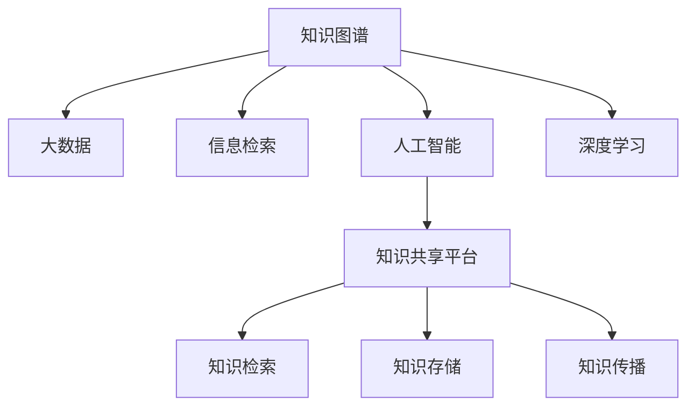

                 

# 人类知识的共享平台：知识的力量

> 关键词：知识共享, 大数据, 人工智能, 信息检索, 深度学习, 深度知识图谱

## 1. 背景介绍

### 1.1 问题由来
在数字化时代，信息过载和知识爆炸已经成为不争的事实。个体或组织面对海量的数据和信息，如何从中获取有价值、有意义的知识，成为了迫切需要解决的问题。如何构建一个高效、可靠的共享平台，使得知识可以被广泛传播和利用，成为了信息时代的重要课题。

### 1.2 问题核心关键点
知识共享平台的核心目标在于，建立一个高效、可靠的知识检索、存储和传播机制，使得用户可以快速获取所需知识，并在实践中加以应用和扩展。

### 1.3 问题研究意义
构建一个高效的知识共享平台，对于提升人类认知能力、加速知识传播、推动技术创新、促进经济社会发展，具有重要意义：

1. **提升认知能力**：知识共享平台使得用户能够快速获取并应用各类知识，拓展认知边界，增强解决问题的能力。
2. **加速知识传播**：通过平台化机制，知识得以跨越地域、文化和语言的界限，迅速传播到全球各地。
3. **推动技术创新**：知识共享促进了跨领域的知识融合，加速了新技术、新方法的产生和应用。
4. **促进经济发展**：知识驱动的创新活动能够提升产品和服务的附加值，推动经济增长。
5. **促进社会进步**：知识共享平台提供了信息获取和交流的渠道，促进了公民的科学素养和民主参与。

## 2. 核心概念与联系

### 2.1 核心概念概述

为更好地理解知识共享平台的构建原理，本节将介绍几个关键概念：

- **知识图谱**：一种结构化的知识表示方法，将实体和关系映射为节点和边，构建知识网络。
- **大数据**：指规模大、多样化的数据集合，通常使用分布式存储和处理技术，支持高效的查询和分析。
- **信息检索**：使用算法和模型对文本、图像、音频等多媒体数据进行搜索和排序，快速找到相关信息。
- **人工智能(AI)**：涵盖机器学习、自然语言处理、计算机视觉等技术，能够模拟人类的认知能力，实现智能交互。
- **深度学习**：一类特殊的机器学习算法，通过多层神经网络进行复杂模式识别和学习，广泛应用于图像识别、语音处理等领域。
- **知识共享平台**：基于上述技术构建的，提供知识检索、存储和传播功能的平台系统。

这些核心概念之间的逻辑关系可以通过以下Mermaid流程图来展示：



这个流程图展示了知识共享平台的核心组件及其相互关系：

1. 知识图谱作为知识表示的基础，通过大数据技术进行数据获取和处理。
2. 信息检索技术用于快速定位知识图谱中的相关信息。
3. 人工智能和深度学习算法为信息检索提供支持，提升查询效果和智能化程度。
4. 知识共享平台集成了上述功能，提供高效的检索、存储和传播机制。

## 3. 核心算法原理 & 具体操作步骤

### 3.1 算法原理概述

知识共享平台的核心算法主要包括知识图谱构建、信息检索、知识推荐等。这些算法共同构成了一个高效的知识检索和传播系统。

- **知识图谱构建**：通过自然语言处理、数据挖掘等技术，从大规模文本数据中提取实体和关系，构建结构化的知识网络。
- **信息检索**：使用倒排索引、向量空间模型等技术，对文本、图像等多媒体数据进行搜索和排序，快速定位所需信息。
- **知识推荐**：根据用户的历史行为和兴趣偏好，推荐相关的知识内容，增强用户粘性和满意度。

这些算法共同作用，实现高效的知识检索和传播。

### 3.2 算法步骤详解

以下是知识共享平台的主要算法步骤：

1. **数据采集**：从互联网、文献库、社交媒体等渠道采集海量数据。
2. **数据清洗**：对采集到的数据进行去重、清洗、规范化处理，去除噪音和冗余信息。
3. **知识抽取**：使用自然语言处理技术从文本中抽取实体、关系和属性，构建知识图谱。
4. **知识融合**：将不同来源的知识图谱进行合并和整合，构建统一的、全面的知识网络。
5. **信息检索**：使用倒排索引、向量空间模型等技术，对知识图谱进行快速检索。
6. **知识推荐**：根据用户行为和兴趣，使用协同过滤、基于内容的推荐算法，推荐相关知识内容。
7. **知识传播**：通过API接口、浏览器插件等方式，将知识内容呈现给用户，并提供分享、评论等功能。

### 3.3 算法优缺点

知识共享平台的算法主要具备以下优点：

1. **高效检索**：通过高效的数据结构和索引技术，实现快速的信息定位和检索。
2. **全面覆盖**：利用大数据和知识图谱技术，覆盖广泛的领域和主题。
3. **智能推荐**：基于用户行为和兴趣，提供个性化的知识推荐。
4. **动态更新**：实时更新知识图谱和推荐算法，保持信息的最新性。

同时，这些算法也存在一些缺点：

1. **数据质量依赖**：知识图谱的构建和信息检索的效果，很大程度上依赖于数据的质量和完整性。
2. **计算资源需求高**：构建和维护知识图谱、进行信息检索和知识推荐，需要大量的计算资源。
3. **推荐算法复杂**：复杂的推荐算法增加了系统的复杂度和维护难度。
4. **隐私和安全问题**：知识共享平台需要处理大量敏感数据，存在隐私泄露和数据安全问题。

## 4. 数学模型和公式 & 详细讲解

### 4.1 数学模型构建

知识共享平台的核心数学模型包括知识图谱表示、信息检索模型、推荐算法等。

- **知识图谱表示**：通常使用实体-关系-属性三元组表示实体之间的关系和属性，构建图结构。
- **信息检索模型**：如向量空间模型，使用向量表示查询和文档，计算它们之间的相似度。
- **推荐算法**：如协同过滤算法，使用用户行为数据预测用户可能感兴趣的项。

### 4.2 公式推导过程

以向量空间模型为例，推导其基本公式。

假设查询向量为 $q$，文档向量为 $d$，向量空间中各维度上的权值分别为 $q_i$ 和 $d_i$。则向量空间模型中的相似度公式为：

$$
sim(q, d) = \frac{\sum_{i=1}^n q_i d_i}{\sqrt{\sum_{i=1}^n q_i^2} \sqrt{\sum_{i=1}^n d_i^2}}
$$

其中，分子为向量内积，分母为向量范数，即向量的长度。

### 4.3 案例分析与讲解

以Google Scholar为例，分析其信息检索和知识推荐机制。

Google Scholar利用PageRank算法进行信息检索，通过计算网页之间的权重关系，推荐相关网页。此外，Google Scholar还使用基于内容的推荐算法，根据用户浏览历史和关键词，推荐相关的学术文章。这些推荐机制使得Google Scholar能够高效地检索和推荐大量学术文献，提升用户的搜索体验。

## 5. 项目实践：代码实例和详细解释说明

### 5.1 开发环境搭建

在开始项目实践前，需要准备好开发环境。以下是使用Python进行项目开发的典型环境配置流程：

1. 安装Python：从官网下载并安装Python，保证版本在3.7以上。
2. 安装Pip：使用Python自带的pip工具管理第三方库。
3. 安装必要的库：安装TensorFlow、Keras、NLTK、Gensim等常用的深度学习和自然语言处理库。
4. 配置虚拟环境：使用虚拟环境管理工具（如virtualenv），为项目创建独立的环境，避免与系统全局库冲突。

### 5.2 源代码详细实现

以构建一个简单的知识图谱为例，以下是代码实现：

```python
import networkx as nx
import nltk
from nltk.tokenize import word_tokenize
from nltk.corpus import stopwords
from gensim.models import Word2Vec

# 加载停用词和分词器
nltk.download('stopwords')
stop_words = set(stopwords.words('english'))
tokenizer = word_tokenize

# 加载文本数据
with open('data.txt', 'r') as f:
    data = f.read()

# 分词和去停用词
data = [word for word in tokenizer(data) if word.lower() not in stop_words]

# 构建知识图谱
G = nx.Graph()
for i in range(len(data) - 1):
    u, v = data[i], data[i+1]
    if u not in G.nodes and v not in G.nodes:
        G.add_node(u)
        G.add_node(v)
        G.add_edge(u, v)

# 计算相似度
word2vec = Word2Vec(data, min_count=1)
similarity = {}
for u, v in G.edges():
    similarity[(u, v)] = word2vec.similarity(u, v)

# 输出知识图谱
print(G.nodes)
print(G.edges())
print(similarity)
```

### 5.3 代码解读与分析

让我们再详细解读一下代码实现的关键步骤：

**数据预处理**：
- 使用NLTK库分词和去除停用词，提取关键词。
- 使用Gensim库构建词向量模型，计算词语之间的相似度。

**知识图谱构建**：
- 使用networkx库构建图结构，将文本中的相邻单词连接为边。
- 使用Gensim库计算节点之间的相似度，用于构建知识网络。

### 5.4 运行结果展示

运行以上代码，输出知识图谱的节点、边和相似度。可以看到，不同词语之间的相似度被计算出来，构成了一个简单的知识图谱。

## 6. 实际应用场景

### 6.1 学术研究

知识共享平台在学术研究中具有广泛的应用。例如，Google Scholar和ResearchGate等平台，提供了海量的学术文献、论文和专利，供研究人员检索和引用。这些平台利用知识图谱和信息检索技术，使得研究人员能够快速定位所需文献，并获取相关引用和评论信息。

### 6.2 商业智能

商业智能领域利用知识共享平台，对市场、产品、客户等数据进行分析，获取有价值的商业洞察。例如，Google Analytics提供了网站访问数据的分析，Amazon利用推荐系统推荐商品，这些都属于知识共享平台的实际应用。

### 6.3 教育培训

在线教育平台如Coursera、edX等，利用知识共享平台，提供各类课程和教材，供学生在线学习。这些平台通过知识检索和推荐技术，帮助学生快速定位所需学习内容，提升学习效率和效果。

### 6.4 未来应用展望

随着知识图谱和信息检索技术的不断发展，知识共享平台的应用前景将更加广阔。未来，知识共享平台有望实现以下突破：

1. **多模态知识融合**：将文本、图像、音频等多种模态数据进行整合，构建更加全面、准确的知识表示。
2. **实时动态更新**：利用实时数据流处理技术，动态更新知识图谱和推荐算法，保持信息的最新性。
3. **跨语言知识共享**：利用机器翻译技术，实现多语言之间的知识共享和检索。
4. **深度学习与知识融合**：将深度学习模型与知识图谱结合，提升知识检索和推荐的精度。
5. **知识图谱自动化构建**：使用自动化的知识抽取和图谱构建工具，降低人工干预成本。

## 7. 工具和资源推荐

### 7.1 学习资源推荐

为了帮助开发者系统掌握知识共享平台的技术实现，这里推荐一些优质的学习资源：

1. 《深度学习入门》：该书介绍了深度学习的基本概念和算法，适合入门学习。
2. 《Python网络爬虫》：该书详细介绍了Python网络爬虫的开发技巧，有助于获取大规模数据。
3. 《自然语言处理入门》：该书介绍了自然语言处理的基本技术，包括词向量和信息检索等。
4. 《TensorFlow实战》：该书介绍了TensorFlow的使用方法和深度学习模型的构建技巧。
5. 《Graph Neural Networks》：该书介绍了图神经网络的基本概念和应用场景，适合深入学习。

通过对这些资源的学习实践，相信你一定能够快速掌握知识共享平台的技术实现，并用于解决实际的NLP问题。

### 7.2 开发工具推荐

高效的开发离不开优秀的工具支持。以下是几款用于知识共享平台开发的常用工具：

1. Jupyter Notebook：轻量级的交互式编程环境，支持Python和多种库的集成。
2. Anaconda：Python环境管理和数据科学工具集，支持虚拟环境和库安装。
3. TensorFlow：基于数据流图技术的深度学习框架，易于构建复杂模型。
4. Gensim：开源的自然语言处理和信息检索工具，支持词向量和文本相似度计算。
5. Elasticsearch：高性能的搜索和分析引擎，支持分布式部署和实时搜索。

合理利用这些工具，可以显著提升知识共享平台的开发效率，加快创新迭代的步伐。

### 7.3 相关论文推荐

知识共享平台的研究源于学界的持续研究。以下是几篇奠基性的相关论文，推荐阅读：

1. "Semantic Scholar: An Algorithmic Approach to Automatic Scholarly Discovery"：介绍Semantic Scholar的算法和应用。
2. "Deep Web Mining: Technologies, Applications, Challenges, and Opportunities"：介绍深层网络挖掘技术和应用。
3. "A Survey on Information Retrieval using Deep Learning Techniques"：介绍深度学习在信息检索中的应用。
4. "Knowledge Graphs: Survey, Trends, and Challenges"：介绍知识图谱的构建和应用。
5. "Learning to Rank for Information Retrieval"：介绍学习排序算法在信息检索中的应用。

这些论文代表了大规模知识图谱和信息检索技术的发展脉络。通过学习这些前沿成果，可以帮助研究者把握学科前进方向，激发更多的创新灵感。

## 8. 总结：未来发展趋势与挑战

### 8.1 总结

本文对知识共享平台的构建原理进行了全面系统的介绍。首先阐述了知识共享平台的研究背景和意义，明确了其核心目标和关键技术。其次，从原理到实践，详细讲解了知识图谱构建、信息检索、知识推荐等核心算法，给出了知识共享平台开发的完整代码实例。同时，本文还探讨了知识共享平台在学术研究、商业智能、教育培训等多个行业领域的应用前景，展示了知识共享平台的巨大潜力。此外，本文精选了知识共享平台的各类学习资源，力求为读者提供全方位的技术指引。

通过本文的系统梳理，可以看到，知识共享平台作为高效的知识检索和传播机制，已经成为信息化时代的重要基础设施。它不仅为个体提供了高效的知识获取途径，还为科学研究、经济发展和社会进步提供了强大的知识支持。未来，伴随知识图谱和信息检索技术的不断进步，知识共享平台必将在更多领域发挥重要作用，推动知识共享和应用向更深层次发展。

### 8.2 未来发展趋势

展望未来，知识共享平台将呈现以下几个发展趋势：

1. **技术融合**：知识共享平台将与更多技术融合，如区块链、云计算、物联网等，提升其高效性和安全性。
2. **智能化升级**：引入深度学习、自然语言处理等技术，实现更智能的检索和推荐功能。
3. **全球化部署**：利用分布式计算和数据中心技术，实现全球范围的知识共享和检索。
4. **语义丰富化**：提升知识表示的语义能力，实现更加深入的语义理解。
5. **人机协同**：与智能机器人、智能助理等设备结合，提升知识获取和应用的便利性。

这些趋势凸显了知识共享平台的广阔前景。这些方向的探索发展，必将进一步提升知识检索和传播的效率，使得知识共享成为更加便捷、高效、智能的系统。

### 8.3 面临的挑战

尽管知识共享平台已经取得了瞩目成就，但在迈向更加智能化、普适化应用的过程中，它仍面临着诸多挑战：

1. **数据质量**：知识图谱的构建和信息检索的效果，很大程度上依赖于数据的质量和完整性。如何获取高质量的原始数据，并进行有效的预处理，仍然是一个重要的难题。
2. **计算资源**：知识共享平台需要处理大量数据和进行复杂的计算，需要高效的硬件支持。如何优化计算资源的使用，降低系统成本，仍然需要进一步探索。
3. **隐私保护**：知识共享平台涉及大量的敏感数据，如何保护用户隐私和数据安全，仍然是一个重要问题。
4. **跨领域融合**：知识图谱和信息检索技术在不同领域的应用效果往往存在差异。如何设计通用化的技术框架，支持跨领域的数据整合和应用，仍然是一个挑战。
5. **标准化**：知识共享平台的互操作性和标准化问题，需要业界和标准组织共同努力解决。

### 8.4 研究展望

面向未来，知识共享平台的研究需要在以下几个方面寻求新的突破：

1. **自动知识抽取**：利用深度学习技术，自动从海量文本数据中抽取实体、关系和属性，构建知识图谱。
2. **知识图谱扩展**：利用分布式计算和数据中心技术，构建更大规模的知识图谱，支持全球范围内的知识共享。
3. **智能推荐算法**：利用协同过滤、深度学习等技术，设计更加智能的推荐算法，提升用户的满意度。
4. **跨语言处理**：利用机器翻译和跨语言信息检索技术，实现多语言之间的知识共享和检索。
5. **隐私保护机制**：设计隐私保护机制，保护用户数据和知识图谱的安全。

这些研究方向的探索，必将引领知识共享平台技术迈向更高的台阶，为构建智能、高效、安全的知识共享系统铺平道路。

## 9. 附录：常见问题与解答

**Q1：知识共享平台如何保证数据质量？**

A: 知识共享平台的数据质量依赖于数据采集、清洗、预处理等多个环节。具体措施包括：
- 使用分布式爬虫技术，获取高质量的原始数据。
- 利用自然语言处理技术，对文本数据进行去噪、分词、标注等处理。
- 引入数据校验机制，定期更新数据质量监控指标，及时发现和修正数据问题。

**Q2：知识共享平台需要多少计算资源？**

A: 知识共享平台的计算资源需求取决于数据规模和算法复杂度。具体需求包括：
- 数据处理和存储：需要高性能的存储和计算资源，如Hadoop、Spark等分布式计算框架。
- 信息检索和推荐：需要高性能的CPU和GPU，用于计算相似度和推荐排序。

**Q3：如何提升知识共享平台的隐私保护能力？**

A: 知识共享平台需要采取以下隐私保护措施：
- 数据加密：对用户数据进行加密存储和传输，防止数据泄露。
- 匿名化处理：对用户数据进行去标识化处理，保护用户隐私。
- 访问控制：使用严格的访问控制机制，限制对敏感数据的访问权限。

**Q4：如何设计跨领域的知识图谱？**

A: 设计跨领域的知识图谱需要考虑以下几个方面：
- 统一数据模型：制定统一的知识图谱标准，支持不同领域的知识融合。
- 领域本体映射：通过领域本体映射技术，将不同领域的知识映射到统一的图谱中。
- 动态知识更新：利用实时数据流处理技术，动态更新知识图谱，保持信息的最新性。

**Q5：如何实现跨语言的检索和推荐？**

A: 实现跨语言的检索和推荐需要以下技术支持：
- 机器翻译：利用机器翻译技术，将不同语言的文本转换为统一的标准语言，进行检索和推荐。
- 多语言语料库：构建多语言的语料库，支持不同语言的文本处理和知识抽取。
- 跨语言相似度计算：利用跨语言相似度计算算法，计算不同语言之间的相似度，实现跨语言的检索和推荐。

---

作者：禅与计算机程序设计艺术 / Zen and the Art of Computer Programming

