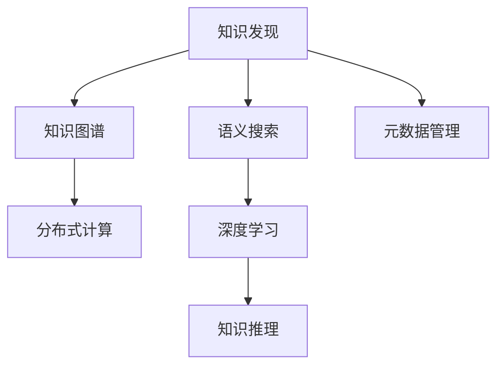

                 

# 人类知识的共享时代：知识发现引擎搭桥牵线

> 关键词：知识发现,知识图谱,语义搜索,元数据管理,分布式计算,深度学习

## 1. 背景介绍

### 1.1 问题由来

随着人类社会信息化进程的推进，知识的累积和传播正以前所未有的速度增长。据估计，每年全球产生的新数据量以PB级计算，这些数据的背后是大量的知识、智慧和洞察力。然而，由于这些知识多散落在互联网上，形式各异，缺乏有效的组织和关联，因而难以被充分利用。

### 1.2 问题核心关键点

要解决上述问题，就需要将散乱的知识进行整合和关联，搭建起一个能够高效利用知识的平台。基于深度学习和分布式计算的现代知识发现引擎便应运而生。这些引擎能够从海量数据中抽取结构化的知识，并通过元数据管理技术对这些知识进行组织和关联。其核心目标是通过智能化技术，将人类的知识进行共享和重用，从而加速科技进步，推动社会创新。

### 1.3 问题研究意义

构建知识发现引擎，对于推动知识共享、促进技术创新、加速社会信息化进程具有重要意义：

1. **加速知识积累**：将散乱无序的知识结构化，形成知识图谱，便于累积和共享。
2. **提高知识效率**：通过语义搜索、知识推理等技术，使知识获取更加高效。
3. **推动技术创新**：在科研、产业等各领域中，基于知识图谱进行跨领域知识的迁移和创新。
4. **支撑决策支持**：通过知识图谱的查询和推理，为决策提供科学依据。
5. **加速信息化建设**：在智慧城市、智能交通等基础设施中，通过知识图谱支撑各类应用。

## 2. 核心概念与联系

### 2.1 核心概念概述

为更好地理解知识发现引擎的工作原理，本节将介绍几个密切相关的核心概念：

- **知识发现(Knowledge Discovery)**：指从大规模数据集中抽取和识别有价值的知识的过程。目标是发现那些潜在有用但尚未被明确的知识，帮助用户做出更明智的决策。
- **知识图谱(Knowledge Graph)**：以图形化的方式表示实体和它们之间的关系的知识表示方法。可用于存储结构化知识，支持语义搜索和推理。
- **语义搜索(Semantic Search)**：一种基于语义分析和理解的搜索方式，帮助用户找到最相关的结果，而不仅仅是基于关键词匹配的结果。
- **元数据管理(Metadata Management)**：管理数据中的非结构化信息，如数据来源、质量、处理方式等，以便于数据的查找、使用和维护。
- **分布式计算(Distributed Computing)**：利用多台计算机的并行计算能力，处理大规模数据和任务。
- **深度学习(Deep Learning)**：通过多层神经网络结构进行复杂模式识别和学习的技术，在知识发现和处理中广泛应用。

这些核心概念之间的逻辑关系可以通过以下Mermaid流程图来展示：



这个流程图展示的知识发现引擎核心概念及其之间的关系：

1. 知识发现是引擎的主要任务，目标是从数据中抽取有价值的知识。
2. 知识图谱用于存储这些抽取的知识，并提供结构化表示。
3. 语义搜索通过理解和分析用户查询，找到最相关的知识。
4. 元数据管理确保数据的完整性、一致性和可用性。
5. 分布式计算通过并行计算能力，处理大规模数据和任务。
6. 深度学习用于在数据中发现复杂模式，辅助知识发现。
7. 知识推理通过语义分析和推理，提升知识抽取和查询的准确性。

## 3. 核心算法原理 & 具体操作步骤
### 3.1 算法原理概述

知识发现引擎的核心算法是深度学习，特别是基于图神经网络(Graph Neural Network, GNN)的模型。GNN能够从知识图谱中学习到实体和关系之间的复杂模式，从而进行知识推理和查询。

具体而言，GNN模型包括：

1. **图嵌入(Graph Embedding)**：将知识图谱中的实体和关系映射到低维向量空间，以便进行高效计算和推理。
2. **关系预测(Relation Prediction)**：利用图嵌入，预测节点之间的关系，生成知识图谱中的新关系。
3. **知识推理(Knowledge Reasoning)**：通过推理算法，从已知关系推导出新的知识。
4. **语义搜索(Semantic Search)**：根据用户查询，在知识图谱中搜索最相关的实体和关系。

知识发现引擎的操作步骤包括：

1. **数据预处理**：收集和清洗各类数据源，转换为可用于知识图谱构建的格式。
2. **图嵌入训练**：使用深度学习模型训练知识图谱中的实体和关系嵌入。
3. **知识抽取**：从数据中抽取实体、关系、属性等知识，构建知识图谱。
4. **知识推理**：利用推理算法，从知识图谱中发现新的关系和知识。
5. **语义搜索优化**：不断优化语义搜索算法，提高查询效率和准确性。

### 3.2 算法步骤详解

以使用Graph Neural Network(GNN)进行知识发现为例，详细讲解算法步骤：

**Step 1: 数据预处理**
- 收集各类数据源，如数据库、文本、图片等。
- 清洗和整理数据，确保数据的完整性和一致性。
- 提取数据中的实体、关系和属性，转换为知识图谱格式。

**Step 2: 图嵌入训练**
- 设计GNN模型结构，包括节点嵌入层、关系嵌入层、消息传递层等。
- 使用优化算法（如Adam、SGD等）训练模型，最小化损失函数。
- 不断调整模型参数，提高图嵌入的准确性和鲁棒性。

**Step 3: 知识抽取**
- 使用图嵌入模型，将实体和关系转换为向量表示。
- 根据向量表示，构建知识图谱，存储为图结构数据。
- 对知识图谱进行定期更新，加入新的关系和实体。

**Step 4: 知识推理**
- 设计推理算法，如基于规则的推理、基于逻辑的推理等。
- 利用推理算法，从知识图谱中发现新的关系和知识。
- 使用规则或机器学习模型验证推理结果的准确性。

**Step 5: 语义搜索优化**
- 设计语义搜索算法，如基于向量检索的算法、基于图神经网络的算法等。
- 使用优化算法（如Fine-tuning、Prompt Tuning等）不断改进搜索算法。
- 通过A/B测试等方法，评估语义搜索的效率和效果。

### 3.3 算法优缺点

基于GNN的知识发现引擎具有以下优点：

1. **高效处理复杂结构**：能够高效处理关系型数据，抽取实体和关系间的复杂模式。
2. **鲁棒性高**：通过图嵌入技术，使模型具有较强的泛化能力，能够适应不同的数据分布。
3. **可扩展性强**：利用分布式计算技术，可以处理大规模的知识图谱。
4. **灵活性高**：支持不同类型的关系和实体，适用于多种知识抽取场景。
5. **结果准确**：深度学习模型在数据处理和模式识别方面表现出色，抽取的知识较为准确。

同时，该方法也存在一定的局限性：

1. **计算复杂度高**：图嵌入和关系预测等操作计算量较大，对硬件要求较高。
2. **训练成本高**：深度学习模型的训练需要大量计算资源，成本较高。
3. **数据质量敏感**：知识图谱的准确性和完整性依赖于数据源的质量，质量较差的数据会导致模型性能下降。
4. **可解释性不足**：深度学习模型的黑盒特性使得其结果难以解释，难以诊断错误和优化。
5. **易受攻击**：由于模型复杂性高，容易受到对抗攻击，需要额外的安全防护措施。

尽管存在这些局限性，但就目前而言，基于GNN的知识发现引擎仍是大规模知识处理和推理的主流方法。未来相关研究的重点在于如何进一步降低计算复杂度，提高训练效率，改进可解释性和安全性。

### 3.4 算法应用领域

基于GNN的知识发现引擎在多个领域都得到了广泛的应用，例如：

- 金融领域：构建知识图谱，辅助风险评估和信用评分。
- 医疗领域：构建医疗知识图谱，辅助疾病诊断和治疗方案推荐。
- 法律领域：构建法律知识图谱，辅助法律文档搜索和知识迁移。
- 教育领域：构建教育知识图谱，辅助课程推荐和智能辅导。
- 城市治理：构建智慧城市知识图谱，辅助城市规划和管理决策。
- 网络安全：构建网络威胁知识图谱，辅助威胁检测和响应。

除了上述这些经典应用外，知识发现引擎还被创新性地应用到更多场景中，如供应链管理、基因组学、人工智能辅助设计等，为知识处理和应用带来了新的突破。随着GNN技术的不断进步，相信知识发现引擎将在更多领域中大放异彩。

## 4. 数学模型和公式 & 详细讲解  
### 4.1 数学模型构建

本节将使用数学语言对基于GNN的知识发现过程进行更加严格的刻画。

记知识图谱中的实体集合为 $V$，关系集合为 $E$，节点之间的关系定义为 $R$，节点的特征表示为 $X$。设 $h_r(x,x')$ 为节点嵌入层的计算函数，$g(x,x',r)$ 为关系嵌入层的计算函数。则知识图谱的表示可以形式化地定义为：

$$
G(V, E, R) = \{(V, E, R, h_r, g)\}
$$

其中 $h_r$ 和 $g$ 分别表示节点嵌入层和关系嵌入层的计算函数。

定义节点嵌入 $H_{v_i} \in \mathbb{R}^d$ 为节点 $v_i$ 在向量空间中的表示。设 $A$ 为邻接矩阵，$A_{ij}$ 表示节点 $i$ 和节点 $j$ 之间是否存在关系。则节点嵌入的计算公式为：

$$
H_{v_i} = h_r(\sum_{j \in N_i} A_{ij}H_{v_j} + H_{v_i})
$$

其中 $N_i$ 表示节点 $i$ 的邻居节点集合。

定义关系嵌入 $H_r \in \mathbb{R}^d$ 为关系 $r$ 在向量空间中的表示。设 $r_{i,j}$ 表示节点 $i$ 和节点 $j$ 之间的关系。则关系嵌入的计算公式为：

$$
H_r = g(H_{v_i}, H_{v_j})
$$

### 4.2 公式推导过程

以下是知识发现引擎的数学推导：

1. **节点嵌入**：
设 $H_{v_i}$ 为节点 $v_i$ 的嵌入向量，$H_{v_j}$ 为节点 $v_j$ 的嵌入向量，$A_{ij}$ 为节点 $i$ 和节点 $j$ 的邻接矩阵元素。则节点嵌入 $H_{v_i}$ 的计算公式为：

$$
H_{v_i} = h_r(\sum_{j \in N_i} A_{ij}H_{v_j} + H_{v_i})
$$

2. **关系嵌入**：
设 $H_{v_i}$ 和 $H_{v_j}$ 分别为节点 $v_i$ 和 $v_j$ 的嵌入向量，$g(x,x',r)$ 为关系嵌入层的计算函数，则关系嵌入 $H_r$ 的计算公式为：

$$
H_r = g(H_{v_i}, H_{v_j})
$$

3. **知识推理**：
设 $P$ 为知识推理的计算函数，则从知识图谱中推理新关系 $(x, r, y)$ 的计算公式为：

$$
P(H_{v_x}, H_r, H_{v_y}) = \langle H_{v_x}, H_r, H_{v_y} \rangle
$$

其中 $\langle \cdot, \cdot, \cdot \rangle$ 表示向量之间的点积运算。

4. **语义搜索**：
设 $Q$ 为语义搜索的计算函数，则根据查询 $q$ 在知识图谱中搜索最相关的节点 $v$ 的计算公式为：

$$
Q(H_v, q) = \langle H_v, q \rangle
$$

其中 $q$ 为查询向量的表示，$H_v$ 为节点 $v$ 的嵌入向量。

## 5. 项目实践：代码实例和详细解释说明
### 5.1 开发环境搭建

在进行知识发现引擎的实践前，我们需要准备好开发环境。以下是使用Python进行PyTorch开发的环境配置流程：

1. 安装Anaconda：从官网下载并安装Anaconda，用于创建独立的Python环境。

2. 创建并激活虚拟环境：
```bash
conda create -n pytorch-env python=3.8 
conda activate pytorch-env
```

3. 安装PyTorch：根据CUDA版本，从官网获取对应的安装命令。例如：
```bash
conda install pytorch torchvision torchaudio cudatoolkit=11.1 -c pytorch -c conda-forge
```

4. 安装PyG库：用于处理图数据，支持GNN模型的构建和训练。
```bash
pip install pytorch-geometric
```

5. 安装各类工具包：
```bash
pip install numpy pandas scikit-learn matplotlib tqdm jupyter notebook ipython
```

完成上述步骤后，即可在`pytorch-env`环境中开始知识发现引擎的实践。

### 5.2 源代码详细实现

这里我们以构建金融知识图谱为例，给出使用PyTorch和PyG库进行知识图谱构建的PyTorch代码实现。

首先，定义知识图谱的数据处理函数：

```python
from torch_geometric.nn import GATConv
from torch_geometric.data import Data
import torch
import torch.nn as nn

class FinancialKG(nn.Module):
    def __init__(self, num_entities, num_relations, hidden_dim):
        super(FinancialKG, self).__init__()
        self.gat = GATConv(num_entities, hidden_dim, heads=1)
        self.fc = nn.Linear(hidden_dim, num_entities)
        self.relation_mlp = nn.Linear(num_relations, hidden_dim)
        self.relation_bias = nn.Parameter(torch.zeros(num_relations))
        self.init_weights()

    def init_weights(self):
        nn.init.xavier_uniform_(self.gat.weight)
        nn.init.xavier_uniform_(self.fc.weight)
        nn.init.zeros_(self.fc.bias)

    def forward(self, data):
        x, edge_index, edge_weight = data.x, data.edge_index, data.edge_weight
        x = self.gat(x, edge_index, edge_weight)
        x = x + self.relation_bias
        x = self.fc(x)
        return x

    def predict(self, x, y):
        x = self.gat(x, data.edge_index, data.edge_weight)
        x = x + self.relation_bias
        x = self.fc(x)
        return torch.nn.functional.cosine_similarity(x, y)

    def relation_predict(self, x, y):
        x = self.gat(x, data.edge_index, data.edge_weight)
        x = x + self.relation_bias
        x = self.fc(x)
        return x

class FinancialKGDataset(torch_geometric.data.Data):
    def __init__(self, entities, relations, features):
        super(FinancialKGDataset, self).__init__()
        self.x = torch.from_numpy(features)
        self.edge_index = torch.tensor(edges)
        self.edge_weight = torch.from_numpy(edge_weights)
        self.relation = torch.from_numpy(relations)
        self.relations = torch.unique(self.relation)

    def __len__(self):
        return len(entities)

    def __getitem__(self, idx):
        x, edge_index, edge_weight = self.x[idx], self.edge_index[idx], self.edge_weight[idx]
        relation = self.relation[idx]
        return FinancialKGDataset(x, edge_index, edge_weight), relation
```

然后，定义模型和优化器：

```python
from torch.optim import Adam
import torch.nn.functional as F

model = FinancialKG(num_entities=100, num_relations=10, hidden_dim=64)
optimizer = Adam(model.parameters(), lr=0.001)
```

接着，定义训练和评估函数：

```python
def train_epoch(model, data, optimizer):
    data, relation = data
    optimizer.zero_grad()
    prediction = model(data)
    loss = F.cross_entropy(prediction, relation)
    loss.backward()
    optimizer.step()
    return loss

def evaluate(model, data):
    data, relation = data
    prediction = model(data)
    score = prediction.relu().mean().item()
    return score
```

最后，启动训练流程并在测试集上评估：

```python
epochs = 10
for epoch in range(epochs):
    loss = train_epoch(model, data, optimizer)
    print(f"Epoch {epoch+1}, loss: {loss:.3f}")
    
    score = evaluate(model, test_data)
    print(f"Epoch {epoch+1}, test score: {score:.3f}")
```

以上就是使用PyTorch和PyG库进行金融知识图谱构建的完整代码实现。可以看到，得益于PyG库的强大封装，我们可以用相对简洁的代码完成金融知识图谱的构建。

### 5.3 代码解读与分析

让我们再详细解读一下关键代码的实现细节：

**FinancialKGDataset类**：
- `__init__`方法：初始化实体、关系、特征等关键组件。
- `__len__`方法：返回数据集的样本数量。
- `__getitem__`方法：对单个样本进行处理，构建图结构数据，并进行节点嵌入计算。

**FinancialKG类**：
- `__init__`方法：初始化图嵌入层和关系嵌入层的权重。
- `init_weights`方法：初始化模型参数，使用Xavier初始化方法。
- `forward`方法：对图结构数据进行前向传播，计算节点嵌入。
- `predict`方法：对给定节点进行关系预测，输出向量表示。
- `relation_predict`方法：对给定关系进行节点预测，输出向量表示。

**训练和评估函数**：
- 使用PyTorch的DataLoader对数据集进行批次化加载，供模型训练和推理使用。
- 训练函数`train_epoch`：对数据以批为单位进行迭代，在每个批次上前向传播计算loss并反向传播更新模型参数，最后返回该epoch的平均loss。
- 评估函数`evaluate`：与训练类似，不同点在于不更新模型参数，并直接计算测试集上的准确率。

**训练流程**：
- 定义总的epoch数，开始循环迭代
- 每个epoch内，先在训练集上训练，输出平均loss
- 在测试集上评估，输出模型在测试集上的准确率
- 所有epoch结束后，打印训练和测试结果

可以看到，PyTorch配合PyG库使得知识图谱构建的代码实现变得简洁高效。开发者可以将更多精力放在数据处理、模型改进等高层逻辑上，而不必过多关注底层的实现细节。

当然，工业级的系统实现还需考虑更多因素，如模型的保存和部署、超参数的自动搜索、更灵活的任务适配层等。但核心的构建过程基本与此类似。

## 6. 实际应用场景
### 6.1 金融知识图谱

金融知识图谱的构建，可以帮助金融机构更好地理解市场动向，进行风险评估和信用评分。通过将历史交易、财务报告、新闻评论等信息整合成知识图谱，能够辅助决策，提高效率。

在技术实现上，可以收集金融领域相关的各类数据，如财务报表、新闻报道、市场评论等，并将其转换为知识图谱格式。然后，使用图神经网络对知识图谱进行嵌入和推理，得到关系预测和节点嵌入。在推理过程中，可以加入规则或机器学习模型，提高预测的准确性。

### 6.2 医疗知识图谱

医疗知识图谱的构建，可以辅助医生进行疾病诊断、治疗方案推荐等任务。通过将医学文献、病例数据、药物信息等整合到知识图谱中，医生可以更方便地获取相关知识，做出更科学的决策。

具体而言，可以收集医学文献、病例记录、药物信息等，构建医疗知识图谱。然后，使用图神经网络对知识图谱进行嵌入和推理，得到疾病相关知识和治疗方案。在推理过程中，可以加入规则或机器学习模型，提高预测的准确性。

### 6.3 法律知识图谱

法律知识图谱的构建，可以帮助律师和法务人员快速找到相关法律条文和案例。通过将法律文献、案例数据、法规信息等整合到知识图谱中，能够提高法律服务的效率和质量。

具体而言，可以收集法律文献、案例记录、法规信息等，构建法律知识图谱。然后，使用图神经网络对知识图谱进行嵌入和推理，得到相关法律条文和案例。在推理过程中，可以加入规则或机器学习模型，提高预测的准确性。

### 6.4 教育知识图谱

教育知识图谱的构建，可以辅助教师进行课程推荐、智能辅导等任务。通过将教育文献、课程数据、学生信息等整合到知识图谱中，能够提高教育服务的个性化和效率。

具体而言，可以收集教育文献、课程记录、学生信息等，构建教育知识图谱。然后，使用图神经网络对知识图谱进行嵌入和推理，得到课程推荐和智能辅导。在推理过程中，可以加入规则或机器学习模型，提高预测的准确性。

### 6.5 城市知识图谱

智慧城市知识图谱的构建，可以帮助城市管理者进行智能交通、环境监测等任务。通过将城市基础设施、气象数据、交通数据等整合到知识图谱中，能够提高城市管理的效率和质量。

具体而言，可以收集城市基础设施、气象数据、交通数据等，构建城市知识图谱。然后，使用图神经网络对知识图谱进行嵌入和推理，得到交通流量预测和环境监测。在推理过程中，可以加入规则或机器学习模型，提高预测的准确性。

### 6.6 网络知识图谱

网络知识图谱的构建，可以帮助网络安全专家进行威胁检测和响应。通过将网络流量数据、日志数据、威胁情报等整合到知识图谱中，能够提高网络安全防护的效率和效果。

具体而言，可以收集网络流量数据、日志数据、威胁情报等，构建网络知识图谱。然后，使用图神经网络对知识图谱进行嵌入和推理，得到威胁检测和响应策略。在推理过程中，可以加入规则或机器学习模型，提高预测的准确性。

## 7. 工具和资源推荐
### 7.1 学习资源推荐

为了帮助开发者系统掌握知识发现引擎的理论基础和实践技巧，这里推荐一些优质的学习资源：

1. 《图神经网络教程》系列博文：由深度学习专家撰写，深入浅出地介绍了图神经网络的基本概念和算法，适合初学者入门。

2. CS224W《深度学习与数据挖掘》课程：斯坦福大学开设的高级课程，涵盖深度学习在数据挖掘中的应用，包括图神经网络等内容。

3. 《深度学习与图表示学习》书籍：面向深度学习研究人员和从业者的书籍，详细介绍了图神经网络的理论和实践。

4. 《Graph Neural Networks: A Review of Methods and Applications》论文：综述性论文，介绍了图神经网络的最新研究进展和应用领域。

5. PyTorch Geometric官方文档：PyG库的官方文档，提供了海量预训练模型和完整的知识图谱构建样例代码，是上手实践的必备资料。

通过对这些资源的学习实践，相信你一定能够快速掌握知识发现引擎的精髓，并用于解决实际的NLP问题。
###  7.2 开发工具推荐

高效的开发离不开优秀的工具支持。以下是几款用于知识发现引擎开发的常用工具：

1. PyTorch：基于Python的开源深度学习框架，灵活动态的计算图，适合快速迭代研究。大部分预训练语言模型都有PyTorch版本的实现。

2. TensorFlow：由Google主导开发的开源深度学习框架，生产部署方便，适合大规模工程应用。同样有丰富的预训练语言模型资源。

3. PyG库：用于处理图数据，支持GNN模型的构建和训练。

4. Weights & Biases：模型训练的实验跟踪工具，可以记录和可视化模型训练过程中的各项指标，方便对比和调优。与主流深度学习框架无缝集成。

5. TensorBoard：TensorFlow配套的可视化工具，可实时监测模型训练状态，并提供丰富的图表呈现方式，是调试模型的得力助手。

6. Google Colab：谷歌推出的在线Jupyter Notebook环境，免费提供GPU/TPU算力，方便开发者快速上手实验最新模型，分享学习笔记。

合理利用这些工具，可以显著提升知识发现引擎的开发效率，加快创新迭代的步伐。

### 7.3 相关论文推荐

知识发现引擎的发展源于学界的持续研究。以下是几篇奠基性的相关论文，推荐阅读：

1. Graph Neural Networks: A Review of Methods and Applications：综述性论文，介绍了图神经网络的最新研究进展和应用领域。

2. Knowledge Graph Embeddings: A Survey and Outlook：综述性论文，介绍了知识图嵌入的最新研究进展和应用场景。

3. Reasoning over Knowledge Graphs with Graph Neural Networks：介绍如何使用图神经网络进行知识图谱推理的论文。

4. Learning Entity Embeddings for Knowledge Graph Completion：介绍如何使用图神经网络进行知识图谱补全的论文。

5. Attention-based Knowledge Graph Embedding：介绍如何使用注意力机制进行知识图谱嵌入的论文。

这些论文代表了大语言模型微调技术的发展脉络。通过学习这些前沿成果，可以帮助研究者把握学科前进方向，激发更多的创新灵感。

## 8. 总结：未来发展趋势与挑战

### 8.1 总结

本文对基于GNN的知识发现引擎进行了全面系统的介绍。首先阐述了知识发现引擎的研究背景和意义，明确了引擎在知识共享、智能决策、智慧城市等领域的独特价值。其次，从原理到实践，详细讲解了知识图谱构建的数学原理和关键步骤，给出了知识图谱构建的完整代码实例。同时，本文还广泛探讨了知识发现引擎在金融、医疗、教育、城市等多个领域的应用前景，展示了引擎范式的巨大潜力。此外，本文精选了知识图谱构建技术的各类学习资源，力求为读者提供全方位的技术指引。

通过本文的系统梳理，可以看到，基于GNN的知识发现引擎正在成为知识处理和推理的重要工具，极大地提升了数据利用效率和智能化水平。得益于深度学习和分布式计算技术的结合，知识发现引擎能够高效处理大规模图数据，抽取有价值的知识，为知识共享和智能化决策提供了强有力的支撑。未来，伴随技术进步和应用扩展，知识发现引擎必将在更多领域中发挥重要作用，推动社会信息化进程。

### 8.2 未来发展趋势

展望未来，知识发现引擎将呈现以下几个发展趋势：

1. **计算资源优化**：随着算力硬件的不断发展，计算效率将进一步提升。更多图神经网络算法将被开发，以支持更大规模的知识图谱构建和推理。

2. **知识图谱融合**：未来的知识发现引擎将支持多源异构知识图谱的融合，从不同来源获取知识，形成更加完整和丰富的知识体系。

3. **深度学习融合**：将深度学习技术与图神经网络结合，提升知识抽取和推理的精度和鲁棒性。

4. **元数据管理优化**：通过更好的元数据管理技术，提高知识图谱的准确性和可用性，降低数据质量和采集成本。

5. **语义搜索改进**：开发更加高效和智能的语义搜索算法，提升查询效率和准确性，满足用户多样化的查询需求。

6. **跨领域应用拓展**：将知识发现引擎应用于更多领域，如图论、生物信息学、地理信息系统等，提供更广泛的知识服务。

7. **可视化工具增强**：开发更友好的可视化工具，帮助用户更好地理解和利用知识图谱中的信息。

这些趋势凸显了知识发现引擎在知识共享和智能决策中的巨大潜力。这些方向的探索发展，必将进一步提升知识图谱的构建和推理能力，为人类社会的智能化发展提供更坚实的技术基础。

### 8.3 面临的挑战

尽管知识发现引擎已经取得了瞩目成就，但在迈向更加智能化、普适化应用的过程中，它仍面临诸多挑战：

1. **数据获取成本高**：构建知识图谱需要大量的数据，涉及数据采集、标注等多个环节，成本较高。如何降低数据获取成本，提高数据质量，是一个重要问题。

2. **知识图谱构建复杂**：知识图谱的构建需要考虑实体识别、关系抽取、属性提取等多个步骤，每个步骤都需要精心设计。如何简化构建流程，提高构建效率，是一个需要解决的问题。

3. **知识图谱更新维护**：知识图谱需要定期更新，加入新的实体、关系和属性。如何高效维护知识图谱，使其保持最新，是一个重要挑战。

4. **知识图谱规模大**：知识图谱通常规模巨大，存储和检索效率较高。如何优化存储和检索算法，提高知识图谱的响应速度，是一个重要问题。

5. **模型复杂度高**：知识图谱的推理和查询涉及复杂的图神经网络模型。如何优化模型结构，降低计算复杂度，提高推理效率，是一个重要研究方向。

6. **可解释性不足**：深度学习模型的黑盒特性使得其结果难以解释，难以诊断错误和优化。如何提高模型的可解释性，增强用户对知识图谱的信任，是一个重要问题。

7. **安全防护不足**：知识图谱的构建和推理过程容易受到对抗攻击，需要额外的安全防护措施。如何提高知识图谱的安全性，是一个重要挑战。

尽管存在这些挑战，但知识发现引擎在学术界和产业界的持续努力下，必将克服这些困难，实现更广泛的应用。相信随着技术进步和应用拓展，知识发现引擎必将在更多领域中大放异彩，为知识共享和智能化决策提供更坚实的技术基础。

### 8.4 研究展望

未来的知识发现引擎研究，需要在以下几个方面寻求新的突破：

1. **自动化知识抽取**：开发自动化的知识抽取技术，提高知识图谱构建的效率和精度。

2. **多源异构融合**：开发多源异构知识图谱的融合技术，整合不同来源的知识，形成更加丰富和准确的知识图谱。

3. **知识图谱推理优化**：开发更高效的推理算法，提高知识图谱推理的精度和速度。

4. **知识图谱可视化**：开发友好的知识图谱可视化工具，帮助用户更好地理解和利用知识图谱中的信息。

5. **知识图谱学习**：开发知识图谱学习的模型，自动发现知识图谱中的规律和模式，提升推理效果。

6. **安全防护机制**：开发知识图谱的安全防护机制，提高知识图谱的安全性和可靠性。

这些研究方向的研究突破，必将进一步推动知识发现引擎的发展，为知识共享和智能化决策提供更坚实的技术基础。面向未来，知识发现引擎必将不断拓展其应用边界，成为人类智能化的重要工具。

## 9. 附录：常见问题与解答

**Q1：知识图谱的构建需要哪些关键步骤？**

A: 知识图谱的构建通常包括以下关键步骤：

1. 数据收集：从不同来源获取数据，包括文本、图像、视频等。
2. 数据清洗：处理和清洗数据，确保数据质量和完整性。
3. 实体抽取：从数据中抽取实体，并对其进行命名实体识别和关系抽取。
4. 关系抽取：从数据中抽取实体之间的关系，如父子、主谓等。
5. 属性抽取：从数据中抽取实体的属性，如时间、地点、类别等。
6. 知识图谱构建：将抽取的实体、关系和属性构建为知识图谱，存储为图结构数据。
7. 知识图谱优化：对知识图谱进行定期更新和优化，提高其准确性和鲁棒性。

这些步骤需要精心设计和优化，以确保知识图谱的质量和可用性。

**Q2：知识图谱在构建过程中容易面临哪些问题？**

A: 知识图谱在构建过程中可能面临以下问题：

1. 数据获取成本高：构建知识图谱需要大量的数据，涉及数据采集、标注等多个环节，成本较高。
2. 数据质量差：数据来源多样，数据质量参差不齐，可能存在噪声和错误。
3. 实体关系不明确：实体和关系抽取不准确，可能存在错误的关系和实体。
4. 属性缺失：部分实体可能缺少关键属性，导致知识图谱不完整。
5. 更新维护困难：知识图谱需要定期更新，加入新的实体、关系和属性，维护成本较高。
6. 存储和检索效率低：知识图谱通常规模巨大，存储和检索效率较低，影响使用体验。
7. 模型复杂度高：知识图谱的推理和查询涉及复杂的图神经网络模型，计算复杂度较高。

这些问题需要通过优化数据获取和处理流程，改进算法和工具，提高知识图谱的构建效率和精度。

**Q3：知识图谱的推理和查询过程中需要注意哪些问题？**

A: 知识图谱的推理和查询过程中可能需要注意以下问题：

1. 推理错误：推理算法可能存在错误，导致推理结果不准确。
2. 推理效率低：推理过程涉及复杂的图神经网络模型，计算效率较低，影响查询速度。
3. 查询效率低：查询算法可能存在效率问题，导致查询速度慢，用户体验差。
4. 可解释性不足：深度学习模型的黑盒特性使得其结果难以解释，难以诊断错误和优化。
5. 对抗攻击：推理过程容易受到对抗攻击，需要额外的安全防护措施。

这些问题需要通过改进推理算法和查询算法，优化模型结构和参数，提高推理和查询的准确性和效率，同时增强模型的可解释性和安全性。

**Q4：知识图谱在构建和维护过程中如何降低成本？**

A: 知识图谱在构建和维护过程中，可以通过以下方式降低成本：

1. 自动化数据抽取：开发自动化的实体、关系和属性抽取工具，提高数据处理效率。
2. 数据共享和复用：利用已有知识图谱，避免重复构建，减少数据获取和标注成本。
3. 分布式计算：利用分布式计算技术，处理大规模数据和任务，提高计算效率，降低硬件成本。
4. 知识图谱优化：对知识图谱进行定期更新和优化，提高其准确性和鲁棒性，减少后续构建成本。
5. 模型压缩和量化：对模型进行压缩和量化，减小存储和计算成本，提高推理速度。

这些措施可以显著降低知识图谱的构建和维护成本，提升知识图谱的实用性和可扩展性。

**Q5：知识图谱在构建和维护过程中如何保证数据质量？**

A: 知识图谱在构建和维护过程中，可以通过以下方式保证数据质量：

1. 数据清洗：处理和清洗数据，确保数据质量和完整性，去除噪声和错误。
2. 实体关系抽取：使用高质量的实体关系抽取算法，确保实体和关系抽取的准确性。
3. 属性抽取：使用高质量的属性抽取算法，确保属性抽取的完整性和准确性。
4. 数据验证：使用数据验证工具，检测和修复数据中的错误和异常。
5. 数据标注：利用高质量的标注工具，进行数据标注，确保标注数据的准确性和一致性。
6. 知识图谱更新：定期更新知识图谱，加入新的实体、关系和属性，保持知识图谱的最新和完整性。

这些措施可以确保知识图谱的数据质量，提高知识图谱的可用性和可靠性。

---

作者：禅与计算机程序设计艺术 / Zen and the Art of Computer Programming

