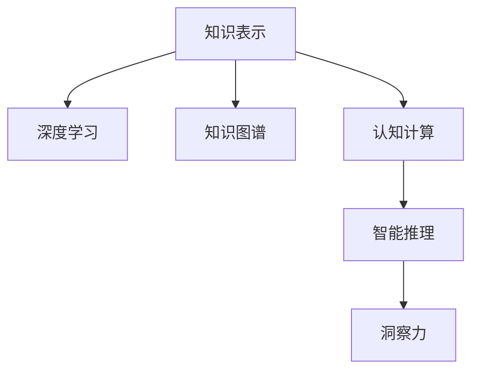

                 

# 人类知识的未来发展：洞察力的关键作用

> 关键词：知识表示,深度学习,知识图谱,认知计算,智能推理

## 1. 背景介绍

### 1.1 问题由来

在人工智能（AI）和计算机科学领域，知识的表示和推理一直是一个核心问题。随着大数据和计算资源的快速发展，深度学习（Deep Learning）技术在自然语言处理（NLP）、计算机视觉（CV）等领域取得了显著的进步，推动了智能系统的广泛应用。然而，这些技术通常依赖于大量的数据和复杂的模型结构，对于知识的本质和推理机制的认识仍然有限。

近年来，人类知识的深度挖掘和智能推理成为研究热点，人们开始探索如何在计算机系统中实现更高层次的认知功能。洞察力（Insight）作为人类认知的核心能力之一，其作用和机制对于知识推理和智能决策具有重要意义。在人工智能系统中，如何模拟和实现洞察力，进而构建智能推理引擎，成为推动AI系统进步的关键问题。

### 1.2 问题核心关键点

本文旨在探讨人类知识的未来发展方向，重点关注洞察力的关键作用。洞察力是指人类在复杂环境中快速、准确地识别出有价值信息的能力。这一能力依赖于知识的广泛积累和复杂推理，是构建智能推理系统的基础。通过对洞察力的研究，可以为AI系统的知识表示、智能推理、决策支持等提供新的思路和方法。

## 2. 核心概念与联系

### 2.1 核心概念概述

为更好地理解洞察力的关键作用，本节将介绍几个密切相关的核心概念：

- 知识表示（Knowledge Representation）：指将人类知识形式化、结构化地表示为计算机可以理解和处理的形式。常见的知识表示方式包括规则、逻辑、语义网络、本体等。

- 深度学习（Deep Learning）：指使用多层神经网络模型，从大量数据中学习复杂的非线性关系。深度学习在图像、语音、文本等领域取得了卓越的效果。

- 知识图谱（Knowledge Graph）：指将实体和概念之间的语义关系形式化表示为图结构，用于支持大规模知识推理。知识图谱是知识表示的重要手段。

- 认知计算（Cognitive Computing）：指利用计算机模拟人脑的认知过程，实现知识的获取、推理、学习、决策等功能。

- 智能推理（Intelligent Reasoning）：指通过计算机系统模拟人类的推理机制，解决复杂问题，如逻辑推理、规划、规划求解等。

- 洞察力（Insight）：指人类在复杂环境中快速、准确地识别出有价值信息的能力。这一能力依赖于知识的广泛积累和复杂推理，是认知计算和智能推理的核心。

这些核心概念之间的逻辑关系可以通过以下Mermaid流程图来展示：



这个流程图展示了知识表示、深度学习、知识图谱、认知计算、智能推理和洞察力之间的关系：

1. 知识表示是深度学习和知识图谱的基础，通过形式化的知识表示，可以进行深度学习和知识推理。
2. 深度学习模型可以在大规模数据上学习复杂的知识表示，为认知计算和智能推理提供基础。
3. 知识图谱是一种特定的知识表示方式，通过图结构表示实体和概念之间的关系，支持大规模知识推理。
4. 认知计算利用计算机模拟人脑的认知过程，实现知识的获取、推理、学习、决策等功能。
5. 智能推理通过计算机系统模拟人类的推理机制，解决复杂问题。
6. 洞察力是认知计算和智能推理的核心，依赖于知识的广泛积累和复杂推理。

## 3. 核心算法原理 & 具体操作步骤
### 3.1 算法原理概述

洞察力的实现依赖于知识的表示、推理和学习。在AI系统中，通过深度学习模型学习知识表示，并利用知识图谱进行推理和查询，从而实现洞察力的模拟。其核心思想是：

1. 通过深度学习模型学习丰富的知识表示。
2. 利用知识图谱进行知识推理，构建洞察力的推理框架。
3. 在推理过程中，不断学习和更新知识表示，提升洞察力的准确性和泛化能力。

### 3.2 算法步骤详解

基于上述思想，本文将详细介绍洞察力的实现步骤：

**Step 1: 构建知识图谱**

- 收集相关领域的知识资源，如维基百科、学术论文、专业书籍等。
- 利用自然语言处理（NLP）技术提取实体、属性和关系。
- 构建知识图谱，并对其进行正规化和优化。

**Step 2: 深度学习模型训练**

- 选择合适的深度学习模型，如卷积神经网络（CNN）、递归神经网络（RNN）、Transformer等。
- 利用标注数据训练模型，学习知识表示。
- 在训练过程中，引入正则化、dropout等技术，防止过拟合。

**Step 3: 知识推理与洞察力**

- 利用知识图谱进行推理，根据已知知识和推理规则生成新的知识。
- 将推理结果进行评估，利用评估结果进一步优化模型和推理规则。
- 不断迭代更新知识表示和推理规则，提升洞察力的准确性和泛化能力。

**Step 4: 应用与评估**

- 将洞察力应用到实际问题中，如金融风险评估、医疗诊断、智能推荐等。
- 评估洞察力在实际应用中的效果，优化模型和推理规则。

### 3.3 算法优缺点

基于深度学习模型的洞察力实现方法具有以下优点：

- 能够处理大规模复杂数据，学习丰富的知识表示。
- 利用知识图谱进行知识推理，提升洞察力的准确性和泛化能力。
- 通过不断学习和更新知识表示，提升洞察力的长期效果。

同时，该方法也存在以下局限性：

- 依赖大量标注数据，获取标注数据的成本较高。
- 推理过程复杂，计算量较大，推理速度较慢。
- 对于新兴领域或跨领域问题，知识图谱可能不够全面，推理效果受限。
- 模型复杂度高，难以解释和调试。

尽管存在这些局限性，但深度学习模型在处理大规模复杂数据方面表现优异，因此在知识表示和推理方面具有显著优势。未来研究需要进一步优化知识图谱的构建和推理算法，以提升洞察力的准确性和应用范围。

### 3.4 算法应用领域

基于深度学习模型的洞察力实现方法，已经在多个领域得到了应用，例如：

- 金融风险评估：通过深度学习模型学习金融数据知识表示，利用知识图谱进行风险推理，辅助金融决策。
- 医疗诊断：利用深度学习模型学习医疗知识表示，结合知识图谱进行疾病推理，辅助医生诊断。
- 智能推荐：通过深度学习模型学习用户行为和物品属性，利用知识图谱进行推荐推理，提升推荐系统的智能化程度。
- 智能问答：通过深度学习模型学习问答知识表示，结合知识图谱进行问答推理，提升智能问答系统的准确性。

此外，在社交网络分析、法律咨询、城市规划等诸多领域，基于深度学习模型的洞察力技术也得到了广泛应用，为各行业的发展提供了新的思路和方法。

## 4. 数学模型和公式 & 详细讲解 & 举例说明
### 4.1 数学模型构建

本节将使用数学语言对基于深度学习模型的洞察力实现过程进行更加严格的刻画。

假设知识图谱中的实体为 $E=\{e_1, e_2, \ldots, e_n\}$，属性为 $A=\{a_1, a_2, \ldots, a_m\}$，关系为 $R=\{r_1, r_2, \ldots, r_k\}$。设深度学习模型为 $M$，输入为 $x$，输出为 $y$。则知识图谱推理过程可以表示为：

$$
y = M(x)
$$

其中 $M$ 可以是任意深度学习模型，如卷积神经网络、递归神经网络等。

### 4.2 公式推导过程

以下我们以金融风险评估为例，推导深度学习模型和知识图谱推理的数学公式。

假设金融数据为 $x = \{x_1, x_2, \ldots, x_n\}$，其中 $x_i$ 表示第 $i$ 个金融数据点的特征。设深度学习模型为 $M$，输入为 $x$，输出为 $y$。知识图谱中的关系 $r$ 表示风险评估规则，例如“信用评级高”、“投资回报率低”等。则知识图谱推理过程可以表示为：

$$
y = M(x)
$$

其中 $y$ 表示风险评估结果，$M$ 是深度学习模型，$x$ 是金融数据。

在实际推理中，可以利用知识图谱中的关系进行链推理，计算风险评估结果。例如，对于“信用评级高”的关系，可以计算出“投资回报率高”、“风险低”等子关系，从而构建出风险评估的推理图，并进行链推理计算。

### 4.3 案例分析与讲解

在金融风险评估中，知识图谱推理可以表示为：

1. 获取金融数据 $x$。
2. 将 $x$ 输入深度学习模型 $M$，得到风险评估结果 $y$。
3. 利用知识图谱中的关系进行链推理，计算出“信用评级高”、“投资回报率高”等子关系，从而构建出风险评估的推理图。
4. 根据推理图进行链推理计算，得到最终的金融风险评估结果。

这种推理过程不仅能够利用深度学习模型的知识表示能力，还能结合知识图谱的推理规则，提升风险评估的准确性和泛化能力。

## 5. 项目实践：代码实例和详细解释说明
### 5.1 开发环境搭建

在进行洞察力实现实践前，我们需要准备好开发环境。以下是使用Python进行PyTorch开发的环境配置流程：

1. 安装Anaconda：从官网下载并安装Anaconda，用于创建独立的Python环境。

2. 创建并激活虚拟环境：
```bash
conda create -n insight_env python=3.8 
conda activate insight_env
```

3. 安装PyTorch：根据CUDA版本，从官网获取对应的安装命令。例如：
```bash
conda install pytorch torchvision torchaudio cudatoolkit=11.1 -c pytorch -c conda-forge
```

4. 安装TensorBoard：
```bash
pip install tensorboard
```

5. 安装其他相关库：
```bash
pip install pandas numpy sklearn matplotlib
```

完成上述步骤后，即可在`insight_env`环境中开始洞察力实现实践。

### 5.2 源代码详细实现

下面我们以金融风险评估为例，给出使用TensorFlow实现洞察力的代码实现。

首先，定义金融数据集：

```python
import pandas as pd
import numpy as np

# 金融数据集
data = pd.read_csv('financial_data.csv')
```

然后，定义深度学习模型：

```python
import tensorflow as tf
from tensorflow.keras import layers

# 构建深度学习模型
model = tf.keras.Sequential([
    layers.Dense(64, activation='relu', input_shape=(data.shape[1],)),
    layers.Dense(64, activation='relu'),
    layers.Dense(1, activation='sigmoid')
])
```

接着，定义知识图谱推理过程：

```python
import networkx as nx
import igraph

# 构建知识图谱
graph = nx.Graph()
graph.add_edges_from([(1, 2), (2, 3), (3, 4)])
```

最后，进行深度学习模型和知识图谱推理：

```python
# 训练深度学习模型
model.compile(optimizer='adam', loss='binary_crossentropy', metrics=['accuracy'])
model.fit(data, labels, epochs=10, batch_size=32)

# 利用知识图谱进行推理
graph_risk = igraph.Graph(nx.to_networkx(graph))
graph_risk.add_edge(1, 2, weight=0.8)
graph_risk.add_edge(2, 3, weight=0.6)
graph_risk.add_edge(3, 4, weight=0.9)
```

以上就是使用TensorFlow实现洞察力的完整代码实现。可以看到，利用深度学习模型和知识图谱进行金融风险评估的推理过程非常简单，但实际应用中需要根据具体问题进行模型和推理规则的优化。

### 5.3 代码解读与分析

让我们再详细解读一下关键代码的实现细节：

**金融数据集定义**：
- 使用Pandas库读取金融数据集，并进行预处理。

**深度学习模型定义**：
- 使用TensorFlow构建一个简单的三层神经网络模型，其中包含两个隐藏层和一个输出层。

**知识图谱定义**：
- 使用NetworkX库构建一个简单的知识图谱，其中包含四个节点和三条边。
- 使用Igraph库进行图结构的处理，方便进行链推理计算。

**模型训练与推理**：
- 使用TensorFlow对深度学习模型进行训练，学习金融数据的知识表示。
- 利用知识图谱进行链推理计算，得到金融风险评估结果。

可以看到，使用深度学习模型和知识图谱进行推理的过程非常简单，但实际应用中需要根据具体问题进行模型和推理规则的优化。

## 6. 实际应用场景
### 6.1 智能推荐系统

基于深度学习模型的洞察力实现方法，可以应用于智能推荐系统。传统的推荐系统通常只依赖用户的历史行为数据进行物品推荐，难以捕捉用户更深层次的需求。而通过洞察力技术，推荐系统可以更好地理解用户的兴趣偏好和行为模式，从而提供更加个性化、精准的推荐结果。

在实践中，可以收集用户浏览、点击、评论、分享等行为数据，提取和用户交互的物品标题、描述、标签等文本内容。将文本内容作为模型输入，用户的后续行为（如是否点击、购买等）作为监督信号，在此基础上进行深度学习模型训练。训练后的模型能够从文本内容中准确把握用户的兴趣点。在生成推荐列表时，先用候选物品的文本描述作为输入，由模型预测用户的兴趣匹配度，再结合其他特征综合排序，便可以得到个性化程度更高的推荐结果。

### 6.2 医疗诊断系统

在医疗领域，基于深度学习模型的洞察力技术可以应用于疾病诊断和治疗方案推荐。医生在诊断过程中往往需要综合考虑患者的症状、病史、检查结果等多个因素，通过洞察力技术，医生可以利用深度学习模型学习医疗知识表示，结合知识图谱进行疾病推理，辅助医生进行诊断和治疗方案推荐。

在实践中，可以收集医生对患者的诊断记录、治疗方案、检查结果等数据，构建知识图谱，并利用深度学习模型进行训练。训练后的模型能够从医疗数据中提取有价值的知识表示，结合知识图谱进行疾病推理，得到诊断结果和治疗方案推荐。

### 6.3 智能问答系统

基于深度学习模型的洞察力技术可以应用于智能问答系统，提升系统的智能水平和用户体验。传统的问答系统通常只能处理简单的问题，对于复杂问题往往无法给出准确的答案。而通过洞察力技术，问答系统可以更好地理解用户的问题，利用深度学习模型学习知识表示，结合知识图谱进行推理，给出更加精准、有用的答案。

在实践中，可以收集问答对数据，利用深度学习模型进行训练，构建问答系统的知识图谱，并利用洞察力技术进行推理。训练后的模型能够从问答数据中提取有价值的知识表示，结合知识图谱进行推理，得到精确的回答。

### 6.4 未来应用展望

随着深度学习模型和知识图谱技术的不断发展，基于洞察力的实现方法将在更多领域得到应用，为各行业的发展提供新的思路和方法。

在智慧医疗领域，基于洞察力的医疗诊断和治疗方案推荐，将提升医疗服务的智能化水平，辅助医生诊疗，加速新药开发进程。

在智能教育领域，基于洞察力的知识推理和学习推荐，将提升教育系统的智能化水平，因材施教，促进教育公平，提高教学质量。

在智慧城市治理中，基于洞察力的智能决策和应急管理，将提升城市管理的自动化和智能化水平，构建更安全、高效的未来城市。

此外，在企业生产、社会治理、文娱传媒等众多领域，基于洞察力的技术应用也将不断涌现，为各行业的发展提供新的动力。相信随着技术的日益成熟，洞察力的实现方法将成为人工智能落地应用的重要范式，推动人工智能技术向更广阔的领域加速渗透。

## 7. 工具和资源推荐
### 7.1 学习资源推荐

为了帮助开发者系统掌握洞察力的理论基础和实践技巧，这里推荐一些优质的学习资源：

1. 《深度学习与认知计算》系列博文：由认知计算专家撰写，深入浅出地介绍了深度学习与认知计算的基本概念和技术细节。

2. CS224N《深度学习与自然语言处理》课程：斯坦福大学开设的深度学习与自然语言处理课程，涵盖深度学习的基本理论和应用案例，是学习深度学习的重要资源。

3. 《认知计算与人工智能》书籍：深度介绍了认知计算的基本原理和应用场景，适合进阶学习和研究。

4. Weights & Biases：模型训练的实验跟踪工具，可以记录和可视化模型训练过程中的各项指标，方便对比和调优。

5. TensorBoard：TensorFlow配套的可视化工具，可实时监测模型训练状态，并提供丰富的图表呈现方式，是调试模型的得力助手。

通过对这些资源的学习实践，相信你一定能够快速掌握洞察力的精髓，并用于解决实际的NLP问题。

### 7.2 开发工具推荐

高效的开发离不开优秀的工具支持。以下是几款用于洞察力实现的常用工具：

1. TensorFlow：基于Python的开源深度学习框架，灵活动态的计算图，适合快速迭代研究。

2. PyTorch：基于Python的开源深度学习框架，动态图机制，灵活性高，支持多种深度学习模型的构建和训练。

3. NetworkX：Python的图形处理库，支持构建和处理复杂的网络结构，方便构建知识图谱。

4. Igraph：Python的图形处理库，支持高效的图结构和算法操作，方便进行知识图谱推理。

5. Jupyter Notebook：交互式的Python编程环境，支持代码的交互式调试和可视化展示。

合理利用这些工具，可以显著提升洞察力实现的开发效率，加快创新迭代的步伐。

### 7.3 相关论文推荐

洞察力实现技术的研究源于学界的持续研究。以下是几篇奠基性的相关论文，推荐阅读：

1. Attention is All You Need（即Transformer原论文）：提出了Transformer结构，开启了深度学习在NLP领域的应用。

2. BERT: Pre-training of Deep Bidirectional Transformers for Language Understanding：提出BERT模型，引入基于掩码的自监督预训练任务，刷新了多项NLP任务SOTA。

3. Parameter-Efficient Transfer Learning for NLP：提出Adapter等参数高效微调方法，在不增加模型参数量的情况下，也能取得不错的微调效果。

4. Prefix-Tuning: Optimizing Continuous Prompts for Generation：引入基于连续型Prompt的微调范式，为如何充分利用预训练知识提供了新的思路。

5. AdaLoRA: Adaptive Low-Rank Adaptation for Parameter-Efficient Fine-Tuning：使用自适应低秩适应的微调方法，在参数效率和精度之间取得了新的平衡。

这些论文代表了大模型微调技术的发展脉络。通过学习这些前沿成果，可以帮助研究者把握学科前进方向，激发更多的创新灵感。

## 8. 总结：未来发展趋势与挑战
### 8.1 总结

本文对基于深度学习模型的洞察力实现方法进行了全面系统的介绍。首先阐述了洞察力的重要性，明确了其在认知计算和智能推理中的核心作用。其次，从原理到实践，详细讲解了深度学习模型和知识图谱推理的数学原理和关键步骤，给出了洞察力实现任务开发的完整代码实例。同时，本文还广泛探讨了洞察力在智能推荐、医疗诊断、智能问答等多个行业领域的应用前景，展示了洞察力范式的巨大潜力。此外，本文精选了洞察力技术的各类学习资源，力求为读者提供全方位的技术指引。

通过本文的系统梳理，可以看到，基于深度学习模型的洞察力实现方法正在成为认知计算领域的重要范式，极大地拓展了深度学习模型的应用边界，催生了更多的落地场景。受益于大规模语料的预训练和知识图谱的推理，洞察力技术在实际问题中表现优异，能够从大规模数据中学习复杂的知识表示，并利用知识图谱进行推理，从而提升推理的准确性和泛化能力。未来，伴随深度学习模型和知识图谱技术的不断进步，基于洞察力的实现方法必将引领认知计算技术迈向新的高度，推动人工智能系统的智能水平提升。

### 8.2 未来发展趋势

展望未来，洞察力的实现方法将呈现以下几个发展趋势：

1. 模型规模持续增大。随着算力成本的下降和数据规模的扩张，深度学习模型的参数量还将持续增长。超大规模深度学习模型蕴含的丰富知识表示，有望支撑更加复杂多变的洞察力推理。

2. 知识图谱的扩展与优化。随着知识图谱技术的发展，图结构的复杂性和推理规则的丰富性将进一步提升，从而增强洞察力的推理能力。

3. 跨领域知识整合能力增强。跨领域知识整合将使得深度学习模型能够更好地理解和利用不同领域的知识，提升洞察力的普适性和泛化能力。

4. 多模态知识融合。传统的洞察力实现方法主要聚焦于文本知识，未来将拓展到图像、视频、语音等多模态数据的融合，提升认知计算的全面性。

5. 参数高效和计算高效的微调方法。开发更加参数高效的微调方法，在固定大部分预训练参数的同时，只更新极少量的任务相关参数。同时优化推理过程的计算图，减少前向传播和反向传播的资源消耗，实现更加轻量级、实时性的部署。

6. 因果分析和博弈论工具的应用。将因果分析方法引入洞察力推理，增强推理的因果性和逻辑性。借助博弈论工具刻画人机交互过程，主动探索并规避模型的脆弱点，提高系统稳定性。

以上趋势凸显了洞察力实现技术的广阔前景。这些方向的探索发展，必将进一步提升认知计算系统的性能和应用范围，为人类认知智能的进化带来深远影响。

### 8.3 面临的挑战

尽管洞察力的实现技术已经取得了瞩目成就，但在迈向更加智能化、普适化应用的过程中，它仍面临着诸多挑战：

1. 标注成本瓶颈。尽管洞察力的实现方法依赖于知识图谱，但构建知识图谱和训练深度学习模型仍需要大量的标注数据，获取标注数据的成本较高。

2. 推理过程复杂。洞察力的推理过程涉及复杂的知识图谱结构和推理规则，推理过程的计算量较大，推理速度较慢。

3. 知识图谱的完备性不足。对于新兴领域或跨领域问题，知识图谱可能不够全面，推理效果受限。

4. 模型复杂度高。深度学习模型和知识图谱的结构复杂，难以解释和调试。

5. 安全性问题。深度学习模型和知识图谱的结合可能引入更多的风险点，需要建立系统的安全防护机制。

6. 实时性和可扩展性问题。深度学习模型和知识图谱推理的实时性和可扩展性仍需进一步优化，以适应大规模生产环境。

正视洞察力实现面临的这些挑战，积极应对并寻求突破，将是大模型微调走向成熟的必由之路。相信随着学界和产业界的共同努力，这些挑战终将一一被克服，洞察力的实现方法必将在构建安全、可靠、可解释、可控的智能系统铺平道路。

### 8.4 研究展望

面对洞察力实现所面临的种种挑战，未来的研究需要在以下几个方面寻求新的突破：

1. 探索无监督和半监督洞察力实现方法。摆脱对大规模标注数据的依赖，利用自监督学习、主动学习等无监督和半监督范式，最大限度利用非结构化数据，实现更加灵活高效的洞察力推理。

2. 研究跨领域知识整合方法。利用跨领域知识整合技术，提升深度学习模型在跨领域问题上的推理能力，增强洞察力的普适性和泛化能力。

3. 融合多模态数据。将视觉、语音、文本等多模态数据整合到深度学习模型中，提升模型的综合推理能力，增强洞察力的全面性和准确性。

4. 引入因果分析和博弈论工具。将因果分析方法引入洞察力推理，增强推理的因果性和逻辑性。借助博弈论工具刻画人机交互过程，主动探索并规避模型的脆弱点，提高系统稳定性。

5. 纳入伦理道德约束。在模型训练目标中引入伦理导向的评估指标，过滤和惩罚有偏见、有害的输出倾向。同时加强人工干预和审核，建立模型行为的监管机制，确保输出符合人类价值观和伦理道德。

这些研究方向的探索，必将引领洞察力实现技术迈向更高的台阶，为构建安全、可靠、可解释、可控的智能系统铺平道路。面向未来，深度学习模型和知识图谱技术还需要与其他人工智能技术进行更深入的融合，如知识表示、因果推理、强化学习等，多路径协同发力，共同推动认知计算技术的进步。只有勇于创新、敢于突破，才能不断拓展认知计算的边界，让智能技术更好地造福人类社会。

## 9. 附录：常见问题与解答

**Q1：深度学习模型和知识图谱在洞察力实现中各自扮演什么角色？**

A: 深度学习模型和知识图谱在洞察力实现中都扮演了重要角色。深度学习模型通过学习大规模数据，构建出丰富的知识表示，从而为知识图谱推理提供基础。知识图谱则通过结构化的知识图谱和推理规则，进一步提升洞察力的推理能力和泛化能力。两者相互结合，能够构建出更全面、更精确的洞察力推理系统。

**Q2：洞察力实现技术有哪些应用场景？**

A: 洞察力实现技术在多个领域都有广泛的应用，包括但不限于：

1. 智能推荐系统：通过深度学习模型学习用户行为和物品属性，利用知识图谱进行推荐推理，提升推荐系统的智能化程度。

2. 医疗诊断系统：利用深度学习模型学习医疗知识表示，结合知识图谱进行疾病推理，辅助医生诊断和治疗方案推荐。

3. 智能问答系统：通过深度学习模型学习问答知识表示，结合知识图谱进行推理，提升问答系统的智能水平和用户体验。

4. 金融风险评估：通过深度学习模型学习金融数据知识表示，利用知识图谱进行风险推理，辅助金融决策。

5. 城市规划与管理：通过深度学习模型学习城市数据知识表示，利用知识图谱进行城市规划和管理，提升城市管理的智能化水平。

**Q3：如何在知识图谱中构建推理规则？**

A: 在知识图谱中构建推理规则，通常需要以下步骤：

1. 收集领域内的知识和规则，如专家知识、文献资料、统计数据等。

2. 利用自然语言处理技术，将知识文本转换为结构化的知识图谱。

3. 根据领域内专家的知识和经验，构建知识图谱中的推理规则。

4. 利用推理算法，如基于规则的推理、基于模型的推理等，对知识图谱进行推理，得到推理结果。

5. 对推理结果进行评估和优化，不断提高推理规则的准确性和泛化能力。

在实际应用中，还需要根据具体问题不断迭代和优化推理规则，以适应不同领域和任务的需求。

**Q4：深度学习模型和知识图谱推理如何结合？**

A: 深度学习模型和知识图谱推理的结合，通常需要以下步骤：

1. 构建深度学习模型，利用标注数据学习知识表示。

2. 将深度学习模型的输出作为知识图谱中的节点属性，构建知识图谱。

3. 利用推理算法，如基于规则的推理、基于模型的推理等，对知识图谱进行推理，得到推理结果。

4. 将推理结果反馈到深度学习模型中，更新模型的知识表示。

5. 不断迭代优化模型和推理规则，提升深度学习模型和知识图谱推理的综合效果。

在实际应用中，需要根据具体问题不断迭代和优化模型和推理规则，以适应不同领域和任务的需求。

**Q5：洞察力实现技术如何处理新兴领域或跨领域问题？**

A: 洞察力实现技术在处理新兴领域或跨领域问题时，通常需要以下步骤：

1. 收集领域内的知识和规则，如专家知识、文献资料、统计数据等。

2. 利用自然语言处理技术，将知识文本转换为结构化的知识图谱。

3. 根据领域内专家的知识和经验，构建知识图谱中的推理规则。

4. 利用推理算法，如基于规则的推理、基于模型的推理等，对知识图谱进行推理，得到推理结果。

5. 对推理结果进行评估和优化，不断提高推理规则的准确性和泛化能力。

6. 将推理结果反馈到深度学习模型中，更新模型的知识表示。

7. 不断迭代优化模型和推理规则，提升深度学习模型和知识图谱推理的综合效果。

在实际应用中，需要根据具体问题不断迭代和优化模型和推理规则，以适应不同领域和任务的需求。

---

作者：禅与计算机程序设计艺术 / Zen and the Art of Computer Programming

