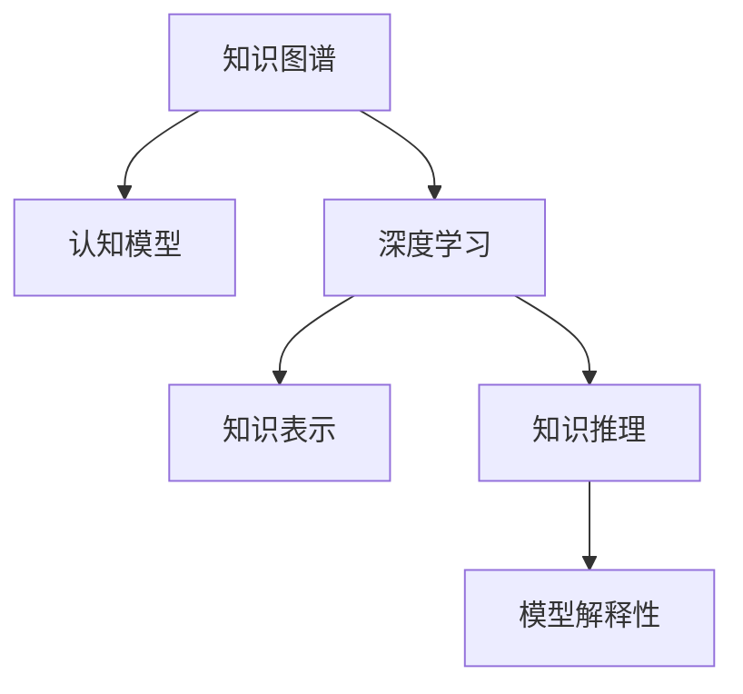
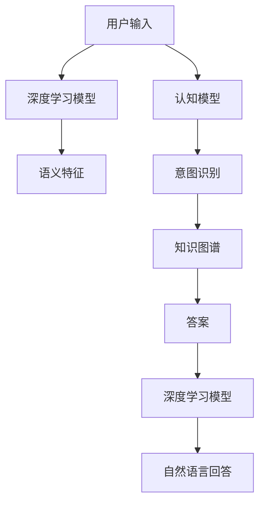

                 

# 人类知识的进步史：一部人类探索史

> 关键词：人类知识进步,人类探索史,人工智能,计算机科学,技术演进,知识图谱,认知模型,深度学习

## 1. 背景介绍

### 1.1 问题由来
人类知识的进步史，是一部从无知到认知，从混沌到有序的漫长旅程。从原始文明的图腾崇拜，到文艺复兴的科学革命，再到现代社会的信息爆炸，人类对世界的认识不断深化。然而，知识的积累和传承，常常受到时间和空间的限制，如何高效地管理和利用这些知识，始终是人类面临的挑战。

### 1.2 问题核心关键点
在现代计算机科学和人工智能领域，知识的存储和利用逐渐数字化、结构化。特别是进入互联网时代，大规模语料和数据成为科技创新的基础。如何高效存储、快速检索、深入理解海量数据，成为研究热点。

当前，知识图谱、认知模型、深度学习等技术，为知识表示和推理提供了新的方法。这些技术不仅能够高效表示复杂知识结构，还能够进行多维度推理，助力智能系统的决策和理解。然而，这些技术的实际应用还面临诸多挑战，如知识图谱的构建、认知模型的泛化性、深度学习的解释性等。

### 1.3 问题研究意义
深入探索人类知识的进步史，对理解科技发展规律、指导当前研究具有重要意义：

1. 揭示知识演进路径。通过回顾知识演进的历史，能够发现知识体系的形成机制，为未来的知识管理提供借鉴。
2. 激发创新灵感。从历史中汲取灵感，有助于开发新的算法和技术，推动科学进步。
3. 指导应用实践。基于历史经验，能够更合理地设计和优化系统，提升效率和效果。
4. 增强文化自信。理解人类知识的积累过程，能够增强对本民族科技传统的自豪感，促进文化自信。
5. 推动科学普及。从历史中总结经验，有助于大众理解和接受前沿技术，促进科学普及和教育。

## 2. 核心概念与联系

### 2.1 核心概念概述

为更好地理解人类知识进步的核心概念和架构，本节将介绍几个密切相关的核心概念：

- **知识图谱(Knowledge Graph)**：以节点表示实体，边表示关系的图结构，用于表示和推理知识。
- **认知模型(Cognitive Model)**：模仿人类认知过程，通过符号化知识进行推理和决策的系统。
- **深度学习(Deep Learning)**：通过多层神经网络进行数据处理和特征学习，以实现复杂模式识别和决策。
- **知识表示(Knowledge Representation)**：将知识以形式化语言（如逻辑、语义网）进行编码和存储。
- **知识推理(Knowledge Reasoning)**：根据已知知识，通过逻辑推理或统计推理得出新知识的机制。
- **模型解释性(Model Interpretability)**：解释模型的决策过程，增强其透明性和可信度。

这些核心概念之间的逻辑关系可以通过以下Mermaid流程图来展示：



这个流程图展示了一系列核心概念之间的联系：

1. 知识图谱为认知模型和深度学习提供了知识表示的框架。
2. 认知模型通过推理和决策，将知识图谱中的知识转化为实际应用。
3. 深度学习处理海量数据，提取高层次的抽象特征。
4. 知识表示和知识推理共同构建起知识图谱，供认知模型和深度学习调用。
5. 模型解释性对深度学习结果进行解释，增强系统的可信度。

这些概念共同构成了现代知识管理的核心框架，助力智能系统理解和推理复杂知识。通过理解这些核心概念，我们可以更好地把握知识演进的本质和实现路径。

## 3. 核心算法原理 & 具体操作步骤
### 3.1 算法原理概述

人类知识的进步史，是一部从数据积累到知识推理的探索史。其核心思想是：通过数据积累，构建知识图谱；利用认知模型和深度学习，进行知识推理和决策；通过模型解释性，增强系统的可信度。

形式化地，假设知识图谱为 $G=(V,E)$，其中 $V$ 表示实体节点集合，$E$ 表示关系边集合。认知模型 $M$ 通过对知识图谱的查询和推理，得到推理结果 $R$。深度学习模型 $D$ 通过学习语料数据 $D$，提取特征 $F$，并将 $F$ 输入 $M$ 中进行推理。模型解释性 $I$ 通过分析 $D$ 和 $F$，解释模型 $M$ 的推理过程和结果。

整个知识推理流程如下：

1. 数据积累：收集领域内的大量语料数据，构建知识图谱。
2. 知识表示：将语料数据编码为形式化的知识结构，构建知识图谱。
3. 推理决策：利用认知模型和深度学习，对知识图谱进行推理和决策。
4. 结果解释：通过模型解释性，解释推理结果，增强系统可信度。

### 3.2 算法步骤详解

基于知识推理的核心算法，主要包括以下几个步骤：

**Step 1: 数据收集和预处理**
- 收集领域内的大量语料数据，包括文章、网页、报告等。
- 对语料数据进行清洗和预处理，如去除停用词、分词、标注实体等。

**Step 2: 知识图谱构建**
- 构建领域知识图谱，定义实体和关系。
- 利用知识表示技术，如RDF、OWL等，将语料数据编码为知识图谱。
- 使用知识图谱工具，如Neo4j、Protege等，可视化和管理知识图谱。

**Step 3: 知识推理和决策**
- 设计认知模型，如规则推理器、逻辑程序、图神经网络等。
- 利用深度学习模型，如BERT、GPT等，提取文本特征。
- 将文本特征输入认知模型，进行推理和决策。

**Step 4: 结果解释和优化**
- 利用模型解释性技术，如可解释AI、反事实分析等，解释推理结果。
- 根据解释结果，对认知模型和深度学习模型进行优化，提高推理准确性。
- 持续更新知识图谱，保持知识的最新性。

### 3.3 算法优缺点

知识推理的核心算法，具有以下优点：

1. 高效存储。通过知识图谱，可以将复杂知识结构化，方便存储和查询。
2. 灵活推理。通过认知模型和深度学习，可以进行多维度、复杂推理。
3. 增强解释性。通过模型解释性技术，增强系统的透明性和可信度。

同时，该算法也存在一些局限性：

1. 数据依赖性强。知识图谱的构建和推理依赖大量高质量的数据。
2. 知识表示复杂。知识图谱的构建和维护复杂，需要大量人力和资源。
3. 泛化能力不足。当前知识图谱和认知模型的泛化能力有限，难以处理大规模复杂知识。
4. 解释性不足。深度学习模型的黑盒特性，使得结果解释困难。
5. 实时性差。推理过程耗时较长，难以实现实时决策。

尽管存在这些局限性，但就目前而言，基于知识推理的技术仍是知识管理的主要范式。未来相关研究的重点在于如何进一步降低数据依赖，提高模型的泛化能力，同时兼顾可解释性和实时性等因素。

### 3.4 算法应用领域

基于知识推理的核心算法，已经在多个领域得到应用，如：

- 金融风控：构建金融领域的知识图谱，利用认知模型进行风险评估和决策。
- 医疗诊断：构建医疗领域的知识图谱，利用认知模型进行疾病诊断和推荐。
- 智能客服：构建客户互动知识图谱，利用认知模型进行自动问答和智能推荐。
- 教育推荐：构建教育资源知识图谱，利用深度学习模型进行个性化推荐。
- 智能搜索：利用知识图谱和认知模型，提升搜索的精确度和效率。
- 工业制造：构建制造业知识图谱，利用认知模型进行工艺规划和质量控制。

除了上述这些经典应用外，知识推理技术也被创新性地应用到更多场景中，如智能家居、智能交通、智慧城市等，为各行各业提供智能决策支持。随着知识图谱和认知模型的不断进步，相信知识推理方法将在更多领域得到广泛应用，推动人类知识管理向更高层次发展。

## 4. 数学模型和公式 & 详细讲解 & 举例说明

### 4.1 数学模型构建

本节将使用数学语言对基于知识推理的模型构建过程进行更加严格的刻画。

假设知识图谱为 $G=(V,E)$，其中 $V$ 表示实体节点集合，$E$ 表示关系边集合。认知模型 $M$ 通过对知识图谱的查询和推理，得到推理结果 $R$。深度学习模型 $D$ 通过学习语料数据 $D$，提取特征 $F$，并将 $F$ 输入 $M$ 中进行推理。模型解释性 $I$ 通过分析 $D$ 和 $F$，解释模型 $M$ 的推理过程和结果。

知识推理的核心目标是最小化推理误差，即找到最优推理策略：

$$
\hat{R}=\mathop{\arg\min}_{R}\sum_{(x,y)\in D} \ell(R(x),y)
$$

其中 $\ell$ 为推理误差函数，衡量推理结果与实际标注之间的差异。

### 4.2 公式推导过程

以下我们以医疗诊断为例，推导基于知识图谱的推理模型。

假设知识图谱 $G$ 包含多个患者 $p_i$ 和疾病 $d_j$，以及它们之间的关系。设认知模型 $M$ 通过规则推理得到推理结果 $R$，推理结果为 $(P,D)$ 对，表示 $p_i$ 可能患有 $d_j$。假设深度学习模型 $D$ 学习到的特征 $F$ 为患者 $p_i$ 的诊断概率分布 $P_i$。推理过程如下：

1. 根据知识图谱 $G$，提取患者 $p_i$ 的相关疾病 $d_j$。
2. 利用深度学习模型 $D$，提取患者 $p_i$ 的特征 $F_i$。
3. 利用认知模型 $M$，对 $d_j$ 进行推理，得到推理结果 $R$。
4. 将推理结果 $R$ 与实际诊断结果 $D$ 进行对比，计算推理误差 $\ell$。
5. 最小化推理误差，优化推理模型 $M$ 和深度学习模型 $D$。

具体推理公式如下：

$$
\hat{R}=\mathop{\arg\min}_{R}\sum_{(x,y)\in D} \ell(R(x),y)=\mathop{\arg\min}_{R}\sum_{(p_i,d_j)\in G} \ell(R(p_i,d_j),D(p_i))
$$

其中 $D(p_i)$ 表示患者 $p_i$ 的实际诊断结果。

### 4.3 案例分析与讲解

以下我们以智能客服系统为例，分析知识推理技术的应用。

假设智能客服系统需要处理用户咨询的意图识别和自动问答。首先，系统需要构建一个领域知识图谱，涵盖常见问题、答案、用户画像等信息。然后，系统利用认知模型，根据用户输入进行意图识别，推理出对应的答案。最后，利用深度学习模型，从知识图谱中提取答案模板，生成自然语言回答。

具体实现流程如下：

1. 构建知识图谱 $G$，涵盖常见问题 $Q$、答案 $A$、用户画像 $P$ 等信息。
2. 用户输入查询 $q_i$，利用深度学习模型 $D$ 提取语义特征 $F_i$。
3. 利用认知模型 $M$，对 $q_i$ 进行意图识别，推理出 $Q_i$。
4. 利用知识图谱 $G$，获取对应的答案 $A_i$。
5. 将答案 $A_i$ 输入深度学习模型 $D$，生成自然语言回答。

推理过程如图：



通过这个流程，可以看出知识推理技术在智能客服系统中的应用。利用知识图谱和认知模型，系统可以自动理解用户意图，快速响应用户需求。同时，利用深度学习模型，系统可以生成自然流畅的回答，提升用户体验。

## 5. 项目实践：代码实例和详细解释说明
### 5.1 开发环境搭建

在进行知识推理实践前，我们需要准备好开发环境。以下是使用Python进行PyTorch开发的环境配置流程：

1. 安装Anaconda：从官网下载并安装Anaconda，用于创建独立的Python环境。

2. 创建并激活虚拟环境：
```bash
conda create -n pytorch-env python=3.8 
conda activate pytorch-env
```

3. 安装PyTorch：根据CUDA版本，从官网获取对应的安装命令。例如：
```bash
conda install pytorch torchvision torchaudio cudatoolkit=11.1 -c pytorch -c conda-forge
```

4. 安装PyTorch Graph Neural Network (PyG)：
```bash
pip install torch-geometric
```

5. 安装各类工具包：
```bash
pip install numpy pandas scikit-learn matplotlib tqdm jupyter notebook ipython
```

完成上述步骤后，即可在`pytorch-env`环境中开始知识推理实践。

### 5.2 源代码详细实现

下面我以医疗诊断为例，给出使用PyTorch Graph Neural Network进行知识推理的PyTorch代码实现。

首先，定义知识图谱：

```python
import torch_geometric as gg
import torch

graph = gg.data.ZINC()
g = gg.Graph(x=graph.x, edge_index=graph.edge_index, edge_attr=graph.edge_attr)
```

然后，定义深度学习模型：

```python
import torch.nn as nn
import torch.nn.functional as F

class GraphSAGE(nn.Module):
    def __init__(self, in_dim, out_dim):
        super(GraphSAGE, self).__init__()
        self.fc1 = nn.Linear(in_dim, out_dim)
        self.fc2 = nn.Linear(out_dim, out_dim)
        self.fc3 = nn.Linear(out_dim, out_dim)
    
    def forward(self, x, edge_index):
        x = F.relu(self.fc1(x))
        x = F.relu(self.fc2(x))
        x = self.fc3(x)
        return x
```

接着，定义认知模型：

```python
import torch.nn as nn
import torch.nn.functional as F

class RuleBasedReasoning(nn.Module):
    def __init__(self, in_dim, out_dim):
        super(RuleBasedReasoning, self).__init__()
        self.fc1 = nn.Linear(in_dim, out_dim)
        self.fc2 = nn.Linear(out_dim, out_dim)
        self.fc3 = nn.Linear(out_dim, out_dim)
    
    def forward(self, x):
        x = F.relu(self.fc1(x))
        x = F.relu(self.fc2(x))
        x = self.fc3(x)
        return x
```

最后，定义推理过程：

```python
import torch.nn as nn
import torch.nn.functional as F
from torch_geometric.nn import RuleBasedReasoning

class KnowledgeReasoning(nn.Module):
    def __init__(self, in_dim, out_dim):
        super(KnowledgeReasoning, self).__init__()
        self.sage = GraphSAGE(in_dim, out_dim)
        self.reasoning = RuleBasedReasoning(in_dim, out_dim)
    
    def forward(self, x, edge_index):
        x = self.sage(x, edge_index)
        x = self.reasoning(x)
        return x
```

完成上述步骤后，即可在`pytorch-env`环境中进行知识推理的实践。

### 5.3 代码解读与分析

让我们再详细解读一下关键代码的实现细节：

**知识图谱定义**：
- `gg.data.ZINC()`：使用PyTorch Graph Neural Network内置的知识图谱数据集，涵盖化学分子信息。
- `gg.Graph()`：定义图结构，包括节点特征、边索引和边属性。

**深度学习模型定义**：
- `GraphSAGE`：定义图神经网络模型，通过多跳聚合和激活函数，提取节点特征。
- `nn.Linear`：定义线性层，进行特征映射。
- `F.relu`：定义ReLU激活函数。

**认知模型定义**：
- `RuleBasedReasoning`：定义规则推理模型，通过线性层和激活函数，进行推理决策。
- `F.relu`：定义ReLU激活函数。

**推理过程定义**：
- `KnowledgeReasoning`：定义知识推理模型，将深度学习模型和认知模型结合，进行推理决策。
- `GraphSAGE`：调用深度学习模型进行特征提取。
- `RuleBasedReasoning`：调用认知模型进行推理决策。

可以看到，PyTorch Graph Neural Network提供了方便的图结构处理工具，可以轻松构建和训练知识图谱的推理模型。开发者可以专注于推理算法的设计，而不必过多关注图结构的底层实现。

当然，工业级的系统实现还需考虑更多因素，如模型的保存和部署、超参数的自动搜索、更灵活的任务适配层等。但核心的知识推理范式基本与此类似。

## 6. 实际应用场景
### 6.1 智能客服系统

基于知识推理技术的智能客服系统，能够实时处理用户咨询，快速响应用户需求，提供个性化服务。具体实现如下：

1. 构建知识图谱 $G$，涵盖常见问题 $Q$、答案 $A$、用户画像 $P$ 等信息。
2. 用户输入查询 $q_i$，利用深度学习模型 $D$ 提取语义特征 $F_i$。
3. 利用认知模型 $M$，对 $q_i$ 进行意图识别，推理出 $Q_i$。
4. 利用知识图谱 $G$，获取对应的答案 $A_i$。
5. 将答案 $A_i$ 输入深度学习模型 $D$，生成自然语言回答。

该系统能够根据用户画像和历史行为，推荐最适合的问答模板，提升用户体验。同时，利用知识推理技术，能够自动处理用户咨询，减轻人工客服的负担。

### 6.2 金融风控系统

基于知识推理技术的金融风控系统，能够自动评估贷款申请、投资风险等决策。具体实现如下：

1. 构建知识图谱 $G$，涵盖金融数据、法规、规则等信息。
2. 根据贷款申请信息，利用深度学习模型 $D$ 提取特征 $F_i$。
3. 利用认知模型 $M$，对 $F_i$ 进行风险评估，推理出 $R_i$。
4. 利用规则推理，验证 $R_i$ 是否符合法规和规则，给出最终评估结果。

该系统能够自动化、准确化风险评估，提升风控效率和精度。同时，利用知识推理技术，能够自动追踪和验证风险评估结果，增强系统的可信度。

### 6.3 医疗诊断系统

基于知识推理技术的医疗诊断系统，能够自动进行疾病诊断和推荐。具体实现如下：

1. 构建知识图谱 $G$，涵盖医学数据、病症、药物等信息。
2. 根据患者 $p_i$ 的病历信息，利用深度学习模型 $D$ 提取特征 $F_i$。
3. 利用认知模型 $M$，对 $F_i$ 进行推理，得到推理结果 $R_i$。
4. 利用知识图谱 $G$，获取对应的疾病 $d_j$ 和药物 $d_k$。
5. 将 $d_j$ 和 $d_k$ 输入深度学习模型 $D$，生成治疗建议。

该系统能够自动诊断和推荐治疗方案，提升诊疗效率和质量。同时，利用知识推理技术，能够自动追踪和验证诊断结果，增强系统的可信度。

### 6.4 未来应用展望

随着知识图谱和认知模型的不断进步，知识推理技术将在更多领域得到应用，为各行各业提供智能决策支持。

在智慧医疗领域，基于知识推理的医疗问答、病历分析、药物研发等应用将提升医疗服务的智能化水平，辅助医生诊疗，加速新药开发进程。

在智能教育领域，知识推理技术可应用于作业批改、学情分析、知识推荐等方面，因材施教，促进教育公平，提高教学质量。

在智慧城市治理中，知识推理技术可应用于城市事件监测、舆情分析、应急指挥等环节，提高城市管理的自动化和智能化水平，构建更安全、高效的未来城市。

此外，在企业生产、社会治理、文娱传媒等众多领域，知识推理技术也将不断涌现，为各行各业提供智能决策支持。相信随着技术的日益成熟，知识推理方法将在更多领域得到广泛应用，推动人类知识管理向更高层次发展。

## 7. 工具和资源推荐
### 7.1 学习资源推荐

为了帮助开发者系统掌握知识推理技术的理论基础和实践技巧，这里推荐一些优质的学习资源：

1. **Knowledge Graphs and Ontologies in Medicine**：涵盖医学知识图谱和本体论的基本概念和应用，适合医疗领域的开发者学习。

2. **Reasoning Over Graph Neural Networks**：涵盖图神经网络在知识推理中的应用，适合知识图谱领域的研究者学习。

3. **Knowledge Mining and Reasoning**：涵盖知识挖掘和推理的基本算法和模型，适合知识管理领域的研究者学习。

4. **Graph Neural Networks**：涵盖图神经网络的基本概念和算法，适合图结构领域的研究者学习。

5. **Neo4j官方文档**：Neo4j图形数据库的官方文档，提供丰富的知识图谱管理和查询工具。

通过对这些资源的学习实践，相信你一定能够快速掌握知识推理技术的精髓，并用于解决实际的NLP问题。

### 7.2 开发工具推荐

高效的开发离不开优秀的工具支持。以下是几款用于知识推理开发的常用工具：

1. **PyTorch**：基于Python的开源深度学习框架，灵活动态的计算图，适合快速迭代研究。

2. **TensorFlow**：由Google主导开发的开源深度学习框架，生产部署方便，适合大规模工程应用。

3. **PyTorch Geometric**：基于PyTorch的图神经网络库，提供便捷的图结构处理工具。

4. **Gephi**：开源的图形分析工具，支持可视化和管理知识图谱。

5. **Protege**：开源的知识图谱构建工具，提供丰富的本体论和推理功能。

6. **Neo4j**：商业化的图形数据库，支持大规模知识图谱的存储和查询。

合理利用这些工具，可以显著提升知识推理任务的开发效率，加快创新迭代的步伐。

### 7.3 相关论文推荐

知识推理技术的发展源于学界的持续研究。以下是几篇奠基性的相关论文，推荐阅读：

1. **Knowledge Graph Embeddings**：提出知识图谱嵌入的方法，通过低维向量表示知识图谱中的实体和关系。

2. **Transductive Graph Reasoning**：提出图推理的半监督学习方法，利用未标注数据进行推理，提高模型的泛化能力。

3. **Graph Neural Networks for Knowledge Graph Reasoning**：提出基于图神经网络的知识推理方法，提高模型的推理精度和效率。

4. **Knowledge Graph Reasoning by Rule-based Graph Neural Networks**：提出基于规则的GNN知识推理方法，增强推理的解释性和可信度。

5. **Knowledge-Graph-Based Recommendation System**：提出基于知识图谱的推荐系统，利用知识推理技术提升推荐效果。

这些论文代表了大规模知识推理技术的发展脉络。通过学习这些前沿成果，可以帮助研究者把握学科前进方向，激发更多的创新灵感。

## 8. 总结：未来发展趋势与挑战

### 8.1 总结

本文对基于知识推理技术的人类知识进步史进行了全面系统的介绍。首先阐述了知识图谱、认知模型、深度学习等核心概念及其之间的联系。其次，从原理到实践，详细讲解了知识推理的数学模型和核心算法，给出了知识推理任务开发的完整代码实例。同时，本文还广泛探讨了知识推理技术在多个领域的应用前景，展示了知识推理范式的巨大潜力。此外，本文精选了知识推理技术的各类学习资源，力求为读者提供全方位的技术指引。

通过本文的系统梳理，可以看到，基于知识推理的技术正在成为知识管理的主要范式，极大地拓展了知识图谱的应用边界，催生了更多的落地场景。得益于知识图谱和认知模型的不断进步，知识推理方法将在更多领域得到广泛应用，为各行各业提供智能决策支持。未来，伴随知识图谱和认知模型的持续演进，相信知识推理技术必将在构建人机协同的智能系统、推动社会进步中扮演越来越重要的角色。

### 8.2 未来发展趋势

展望未来，知识推理技术将呈现以下几个发展趋势：

1. **知识图谱规模化**：随着知识图谱构建技术的进步，知识图谱的规模将不断扩大，涵盖更多领域的知识。这将为知识推理技术带来更多的应用场景。

2. **认知模型泛化性增强**：认知模型的泛化能力将不断提升，能够处理更大规模、更复杂的知识图谱。这将进一步增强知识推理的推理精度和泛化能力。

3. **深度学习与知识图谱结合**：深度学习与知识图谱的结合将更加紧密，通过图神经网络等方法，能够更好地提取和融合知识图谱中的信息。

4. **知识推理实时化**：知识推理系统将不断优化，实现实时推理，能够快速响应用户需求，提升用户体验。

5. **知识推理普适化**：知识推理技术将在更多领域得到应用，为各行各业提供智能决策支持。

6. **知识推理可解释性增强**：知识推理系统将更加注重结果的可解释性，通过可视化、反事实分析等方法，增强系统的透明性和可信度。

以上趋势凸显了知识推理技术的广阔前景。这些方向的探索发展，必将进一步提升知识推理系统的性能和应用范围，为各行各业带来新的变革。

### 8.3 面临的挑战

尽管知识推理技术已经取得了瞩目成就，但在迈向更加智能化、普适化应用的过程中，它仍面临着诸多挑战：

1. **数据依赖性强**：知识图谱的构建和推理依赖大量高质量的数据，获取和维护成本高。如何降低数据依赖，提高数据质量，仍然是一个重要课题。

2. **模型泛化性不足**：当前知识图谱和认知模型的泛化能力有限，难以处理大规模复杂知识。如何提升模型泛化能力，增强系统的适应性，是一个重要的研究方向。

3. **模型复杂度高**：知识推理模型复杂度高，难以解释其内部工作机制。如何提高模型的可解释性，增强系统的透明性和可信度，是一个亟待解决的问题。

4. **实时性差**：知识推理过程耗时较长，难以实现实时决策。如何优化推理算法，提高推理速度，是一个重要的研究方向。

5. **安全性和隐私**：知识推理系统可能包含敏感信息，如何保护用户隐私和数据安全，是一个重要的课题。

6. **资源消耗高**：知识推理系统需要大量计算资源，如何优化资源消耗，提高系统效率，是一个重要的研究方向。

这些挑战凸显了知识推理技术在实际应用中的复杂性和难度。只有不断克服这些挑战，知识推理技术才能更好地服务于人类知识管理，推动社会进步。

### 8.4 研究展望

面向未来，知识推理技术需要在以下几个方面寻求新的突破：

1. **数据预处理技术**：开发更加高效的数据预处理技术，减少数据依赖，提高数据质量。

2. **模型简化技术**：开发更加简化的推理模型，提高模型的泛化能力和实时性。

3. **可解释性增强**：开发更加可解释的知识推理模型，提高系统的透明性和可信度。

4. **多模态融合技术**：开发多模态知识推理技术，将视觉、语音、文本等多模态信息结合，提升知识推理的准确性和鲁棒性。

5. **自监督学习**：开发自监督学习算法，通过未标注数据进行知识推理，提高模型的泛化能力。

6. **智能生成技术**：开发知识生成技术，自动构建知识图谱和推理规则，提升知识推理的效率和精度。

7. **持续学习**：开发持续学习算法，使知识推理模型能够不断更新，保持知识的最新性。

这些研究方向将引领知识推理技术迈向更高的台阶，为构建人机协同的智能系统、推动社会进步提供新的技术手段。

## 9. 附录：常见问题与解答

**Q1：知识图谱的构建和维护需要大量人力和资源，如何降低成本？**

A: 知识图谱的构建和维护成本高，但可以通过以下几个方法降低：

1. **自动化工具**：使用自动化工具，如Protege、Gephi等，减少手动构建知识图谱的工作量。

2. **半监督学习**：利用未标注数据进行半监督学习，降低对标注数据的依赖。

3. **社区合作**：建立知识图谱社区，共享和维护知识图谱，降低单点开发的成本。

4. **知识共享平台**：建立知识共享平台，如DBpedia、Wikipedia等，方便知识图谱的共建共享。

5. **领域专家参与**：邀请领域专家参与知识图谱构建，提升知识图谱的质量和实用性。

**Q2：知识推理模型的可解释性不足，如何解决？**

A: 提高知识推理模型的可解释性，可以从以下几个方面入手：

1. **可视化技术**：使用可视化工具，如Gephi、Cytoscape等，展示知识图谱和推理过程。

2. **解释性模型**：选择解释性强的推理模型，如规则推理器、图神经网络等。

3. **反事实分析**：进行反事实分析，解释模型对推理结果的贡献度。

4. **模型蒸馏**：通过模型蒸馏，将复杂模型转化为更易解释的模型。

5. **因果推理**：利用因果推理，解释模型的决策过程和推理逻辑。

**Q3：知识推理系统如何处理大规模复杂知识图谱？**

A: 处理大规模复杂知识图谱，可以从以下几个方面入手：

1. **分布式存储**：使用分布式存储系统，如Hadoop、Spark等，分散存储和管理知识图谱。

2. **知识压缩**：使用知识压缩技术，如剪枝、降维等，减少知识图谱的规模。

3. **图神经网络**：使用图神经网络，提取知识图谱中的高层次特征，提高推理效率。

4. **多层次推理**：使用多层次推理技术，分阶段进行推理，提高推理准确性。

5. **自适应推理**：开发自适应推理算法，根据知识图谱的复杂度，动态调整推理策略。

**Q4：知识推理系统如何处理实时数据流？**

A: 处理实时数据流，可以从以下几个方面入手：

1. **实时图更新**：使用实时图更新技术，如增量构建、增量推理等，实时更新知识图谱。

2. **流式推理**：使用流式推理技术，实时处理数据流，减少推理延迟。

3. **分布式推理**：使用分布式推理技术，将推理任务分散到多台服务器上，提高推理效率。

4. **缓存技术**：使用缓存技术，如Redis、Memcached等，缓存推理结果，减少重复计算。

5. **异步推理**：使用异步推理技术，将推理任务异步处理，提高系统并发能力。

这些方法可以结合使用，提高知识推理系统的实时性和处理能力，满足实时数据流的处理需求。

**Q5：知识推理系统如何保护用户隐私和数据安全？**

A: 保护用户隐私和数据安全，可以从以下几个方面入手：

1. **数据加密**：使用数据加密技术，保护知识图谱和推理结果的安全。

2. **权限控制**：使用权限控制技术，限制不同用户对知识图谱的访问权限。

3. **匿名化技术**：使用匿名化技术，保护用户的隐私信息。

4. **差分隐私**：使用差分隐私技术，限制模型对敏感数据的依赖。

5. **联邦学习**：使用联邦学习技术，在不共享数据的情况下进行模型训练。

6. **安全推理**：使用安全推理技术，保护推理过程中的数据隐私。

这些方法可以结合使用，保护知识推理系统的数据安全和用户隐私，增强系统的可信度和可靠性。

---

作者：禅与计算机程序设计艺术 / Zen and the Art of Computer Programming

