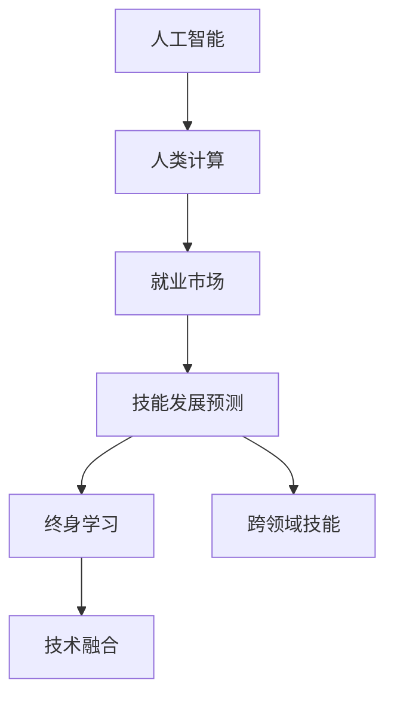

                 

# 人类计算：AI时代的未来就业市场与技能发展预测

> 关键词：人工智能,人类计算,就业市场,技能发展预测,技能更新,终身学习,人工智能就业,跨领域技能,技术融合

## 1. 背景介绍

### 1.1 问题由来
随着人工智能（AI）技术的快速发展，其在各个领域的应用日益广泛，导致就业市场正在经历深刻变革。特别是那些涉及重复性、低技能劳动的岗位，正逐渐被AI替代。根据统计，自动化技术每年在全球减少约8百万个就业岗位，而另一方面，AI新创造的岗位也正在快速增长。

### 1.2 问题核心关键点
当前，AI与人类计算（Human-Computing）的融合正改变着职业结构的分布，并催生出许多新型岗位。人工智能不仅在降低一些岗位的需求，也在创造新的职业机会。了解AI时代下就业市场的变化和未来趋势，对于个人职业规划和教育机构人才培养具有重要意义。

### 1.3 问题研究意义
研究AI时代下的就业市场变化和未来趋势，对政策制定者、教育机构、企业和个人都具有重要的战略意义。通过预测未来的就业市场和技能需求，可以帮助相关方制定更有效的教育和就业策略，确保劳动力能够适应新的技术环境。

## 2. 核心概念与联系

### 2.1 核心概念概述

为更好地理解AI时代下就业市场和技能发展的变化，本节将介绍几个关键概念：

- 人工智能(Artificial Intelligence, AI)：指通过计算机和算法模仿人类智能的行为和决策能力，包括机器学习、深度学习、自然语言处理等技术。

- 人类计算(Human-Computing)：指人类与计算机之间的协同工作方式，人类负责提出问题、设计模型和解释结果，而计算机则负责执行计算和数据处理。

- 就业市场(Employment Market)：指劳动力的供需关系和岗位分布状况，影响着个人和企业的就业状况。

- 技能发展预测(Skill Development Prediction)：指通过对未来就业市场趋势的预测，指导当前的教育和职业培训，以培养适应未来需求的劳动力。

- 终身学习(Lifelong Learning)：指个人在职业生涯中不断学习和适应新技能的需求，以保持其市场竞争力。

- 跨领域技能(Cross-Disciplinary Skills)：指能够跨越多个学科和行业，具有通用性和适应性的技能，如批判性思维、数据分析等。

- 技术融合(Technology Integration)：指不同技术之间的融合，如AI与传统行业技术的结合，促进新职业的产生和传统职位的改造。

这些概念之间的逻辑关系可以通过以下Mermaid流程图来展示：



这个流程图展示了几大关键概念之间的关系：

1. 人工智能通过人类计算提供决策和执行能力，改变就业市场结构。
2. 就业市场变化引导技能发展预测，指导终身学习。
3. 跨领域技能和终身学习的培养促进技术融合，催生新职业。

## 3. 核心算法原理 & 具体操作步骤
### 3.1 算法原理概述

技能发展预测的算法基于统计学、数据挖掘和机器学习等方法，旨在从历史数据中发现规律，预测未来技能需求的变化。算法原理包括以下几个步骤：

1. **数据收集与预处理**：收集就业市场的历史数据和未来趋势预测数据，包括岗位需求、技能需求和教育培训数据。

2. **特征工程**：对数据进行特征提取和工程处理，例如通过时间序列分析预测技能需求的变化趋势。

3. **模型训练**：使用机器学习算法，如随机森林、支持向量机等，对技能需求进行建模和预测。

4. **结果分析与验证**：通过交叉验证和误差分析等方法，验证模型的准确性，并调整参数以提升预测精度。

### 3.2 算法步骤详解

具体步骤包括：

1. **数据收集**：收集和整理就业市场数据，如岗位名称、需求量、技能要求等，以及相关预测数据，如行业发展趋势、技术变革等。

2. **特征工程**：对收集到的数据进行预处理和特征提取，如时间序列分析、技能类别划分、岗位相关度计算等。

3. **模型构建**：使用机器学习算法，如随机森林、梯度提升树等，构建预测模型。

4. **结果评估**：对模型预测结果进行交叉验证，评估模型的准确性、召回率和F1分数等指标。

5. **调整优化**：根据评估结果，调整模型参数和特征工程方法，提升预测精度。

### 3.3 算法优缺点

技能发展预测算法具有以下优点：

1. **自动化程度高**：通过自动化模型训练和参数调整，能够高效地处理大量数据，并快速得出预测结果。

2. **客观性**：算法能够从数据中自动学习特征，避免了人为偏见的影响。

3. **灵活性**：可以处理各种类型的数据，包括结构化和非结构化数据。

但同时也存在一些局限性：

1. **数据质量依赖**：预测结果高度依赖于数据的质量和完整性，数据缺失或错误可能导致预测误差。

2. **模型复杂性**：复杂的模型可能存在过拟合或欠拟合问题，影响预测的泛化能力。

3. **外部因素影响**：经济、政策等外部因素对就业市场有重要影响，模型难以全面考虑。

4. **不确定性**：未来的技术变革和市场变化可能超出当前模型的预测范围，导致预测结果不准确。

### 3.4 算法应用领域

技能发展预测算法已经在多个领域得到应用，如：

- **教育培训**：预测未来技能需求，指导教育机构和培训机构开设相关课程，提升学生就业竞争力。

- **职业指导**：为求职者提供基于市场需求的职业建议，帮助他们做出更有针对性的职业规划。

- **企业人力资源管理**：预测未来岗位需求和技能要求，帮助企业制定人力资源规划和招聘策略。

- **政策制定**：为政府提供技能需求预测，指导职业培训和就业政策的设计和实施。

## 4. 数学模型和公式 & 详细讲解  
### 4.1 数学模型构建

本文将使用数学语言对技能发展预测模型的构建和推导进行详细讲解。

记就业市场数据集为 $D=\{(x_i, y_i)\}_{i=1}^N$，其中 $x_i$ 为输入特征，如时间、岗位需求、技能要求等，$y_i$ 为输出标签，即岗位需求量。定义预测模型为 $f(x; \theta)$，其中 $\theta$ 为模型参数。

假设使用随机森林算法进行预测，模型的训练目标为：

$$
\min_{\theta} \frac{1}{N} \sum_{i=1}^N \ell(f(x_i; \theta), y_i)
$$

其中 $\ell$ 为损失函数，常见的有均方误差、对数损失等。

### 4.2 公式推导过程

以均方误差损失函数为例，随机森林模型的预测公式为：

$$
f(x; \theta) = \sum_{t=1}^T w_t^t(x)
$$

其中 $w_t^t(x)$ 为第 $t$ 棵树对输入 $x$ 的预测，$T$ 为树的数量。

模型的损失函数为：

$$
\ell(f(x; \theta), y) = \frac{1}{2} (f(x; \theta) - y)^2
$$

最小化损失函数的目标为：

$$
\min_{\theta} \frac{1}{N} \sum_{i=1}^N (f(x_i; \theta) - y_i)^2
$$

通过梯度下降等优化算法，最小化损失函数，得到最优参数 $\theta^*$。

### 4.3 案例分析与讲解

以IT行业为例，假设收集了过去10年的IT岗位需求数据和技能需求数据，使用随机森林模型进行预测。首先将数据进行时间序列分析，得到技能需求的变化趋势。然后将数据输入模型，训练得到预测模型。最后，通过预测结果分析，指导职业培训课程的开设和人才招聘策略的制定。

## 5. 项目实践：代码实例和详细解释说明
### 5.1 开发环境搭建

在进行技能发展预测项目实践前，我们需要准备好开发环境。以下是使用Python进行项目开发的环境配置流程：

1. 安装Anaconda：从官网下载并安装Anaconda，用于创建独立的Python环境。

2. 创建并激活虚拟环境：
```bash
conda create -n pyproject python=3.8 
conda activate pyproject
```

3. 安装必要的Python库，如Pandas、NumPy、Scikit-Learn等。

4. 安装数据处理和模型训练所需的库，如TensorFlow、PyTorch等。

完成上述步骤后，即可在`pyproject`环境中开始项目开发。

### 5.2 源代码详细实现

这里我们以Python为例，展示使用随机森林模型进行技能需求预测的代码实现。

```python
import pandas as pd
import numpy as np
from sklearn.ensemble import RandomForestRegressor
from sklearn.model_selection import train_test_split
from sklearn.metrics import mean_squared_error

# 数据预处理
data = pd.read_csv('就业数据.csv')
features = data[['时间', '岗位需求', '技能要求']]
targets = data['岗位需求量']

# 数据拆分
X_train, X_test, y_train, y_test = train_test_split(features, targets, test_size=0.2)

# 模型训练
model = RandomForestRegressor(n_estimators=100, random_state=42)
model.fit(X_train, y_train)

# 预测结果
y_pred = model.predict(X_test)

# 模型评估
mse = mean_squared_error(y_test, y_pred)
print(f'Mean Squared Error: {mse}')
```

### 5.3 代码解读与分析

让我们再详细解读一下关键代码的实现细节：

**数据预处理**：
- 使用Pandas库读取数据集。
- 选择特征变量和目标变量。
- 对数据进行拆分，分为训练集和测试集。

**模型训练**：
- 定义随机森林模型，设置树的数量和随机种子。
- 使用训练数据拟合模型。

**预测结果**：
- 使用训练好的模型对测试数据进行预测。

**模型评估**：
- 计算均方误差，评估预测结果。

可以看到，通过上述代码，我们能够高效地构建并训练一个简单的随机森林模型，实现对技能需求量的预测。

## 6. 实际应用场景
### 6.1 教育培训

教育培训行业是技能发展预测的重要应用场景之一。通过预测未来技能需求，教育机构可以提前制定课程设置和培训计划，帮助学生更好地适应未来就业市场。

例如，通过对IT行业技能需求的预测，教育机构可以提前开设Python、数据分析、人工智能等相关课程，提升学生在这些领域的技术能力。

### 6.2 企业人力资源管理

企业可以通过技能发展预测，优化人力资源规划和招聘策略，减少人才流失和招聘成本。

例如，一家科技公司可以通过预测未来对算法工程师的需求，提前制定招聘计划，提高新员工的适应性和工作满意度。

### 6.3 政府政策制定

政府可以通过技能发展预测，制定更具前瞻性的职业培训和就业政策，提升整体劳动力素质。

例如，政府可以根据对未来技术发展的预测，提前投入资源培养AI、大数据、区块链等新兴技术领域的人才。

## 7. 工具和资源推荐
### 7.1 学习资源推荐

为了帮助开发者系统掌握技能发展预测的理论基础和实践技巧，这里推荐一些优质的学习资源：

1. 《机器学习实战》系列书籍：由多位机器学习专家编写，介绍了机器学习的基础知识、常用算法和实现技巧。

2. Coursera《机器学习》课程：由斯坦福大学教授Andrew Ng主讲，涵盖机器学习的基本概念和常用算法，适合入门学习。

3. Kaggle机器学习竞赛：提供丰富的数据集和竞赛任务，通过实战提升技能预测能力。

4. DataCamp在线学习平台：提供系统化的编程和数据分析课程，适合各层次学习者。

5. GitHub开源项目：大量优秀的开源项目可以参考和学习，提升代码实现能力。

通过对这些资源的学习实践，相信你一定能够快速掌握技能发展预测的精髓，并用于解决实际的就业市场问题。

### 7.2 开发工具推荐

高效的开发离不开优秀的工具支持。以下是几款用于技能发展预测开发的常用工具：

1. Jupyter Notebook：强大的交互式开发环境，适合数据分析和模型训练。

2. Pandas和NumPy：Python的数据处理和数值计算库，高效处理和分析数据。

3. Scikit-Learn：机器学习库，提供各种常用算法的实现。

4. TensorFlow和PyTorch：深度学习框架，支持复杂的模型构建和训练。

5. XGBoost和LightGBM：高效的梯度提升树库，适合处理大规模数据集。

6. Kaggle平台：提供丰富的数据集和竞赛任务，适合进行实战练习。

合理利用这些工具，可以显著提升技能发展预测的开发效率，加快创新迭代的步伐。

### 7.3 相关论文推荐

技能发展预测技术的发展源于学界的持续研究。以下是几篇奠基性的相关论文，推荐阅读：

1. 《机器学习：一种现代方法》（周志华著）：介绍了机器学习的基本概念和常用算法。

2. 《预测分析与大数据应用》（李星著）：介绍了预测分析在商业决策中的应用。

3. 《深度学习》（Ian Goodfellow等著）：介绍了深度学习的基本概念和常用算法。

4. 《数据挖掘与统计学习基础》（Tibshirani等著）：介绍了数据挖掘和统计学习的基础知识和常用算法。

5. 《人工智能：一种现代方法》（Russell和Norvig著）：介绍了人工智能的基本概念和常用算法。

这些论文代表了大语言模型微调技术的发展脉络。通过学习这些前沿成果，可以帮助研究者把握学科前进方向，激发更多的创新灵感。

## 8. 总结：未来发展趋势与挑战

### 8.1 总结

本文对技能发展预测方法进行了全面系统的介绍。首先阐述了技能发展预测在AI时代下的重要性和背景，明确了技能发展预测在提升教育、企业和政府决策中的关键作用。其次，从原理到实践，详细讲解了技能发展预测的数学模型和具体步骤，给出了技能预测任务开发的完整代码实例。同时，本文还探讨了技能发展预测在教育培训、企业人力资源管理、政府政策制定等多个领域的应用前景，展示了技能预测范式的巨大潜力。

通过本文的系统梳理，可以看到，技能发展预测技术正在成为AI时代下劳动力市场的重要工具，极大地提升了教育、企业和政府对未来就业市场的预测能力和适应性。未来，伴随技术进步和数据积累，技能预测的精度和覆盖面将进一步提升，为各行业带来更大的变革。

### 8.2 未来发展趋势

展望未来，技能发展预测技术将呈现以下几个发展趋势：

1. **技术自动化提升**：自动化模型训练和参数调整将进一步提升预测精度和效率。

2. **数据多样性增强**：更多类型的数据将融入预测模型，如时间序列、文本数据等，提升预测的全面性。

3. **预测精度提高**：新算法的引入和模型优化将提升预测的准确性和泛化能力。

4. **跨领域应用扩展**：技能发展预测技术将扩展到更多领域，如医疗、金融、教育等，提供更全面的预测支持。

5. **决策支持系统普及**：通过技能预测构建的决策支持系统将逐步普及，为各行业提供更科学的决策依据。

6. **个性化和动态化**：根据不同个体的背景和需求，提供个性化的技能预测和培训建议，提升教育培训效果。

以上趋势凸显了技能发展预测技术的广阔前景。这些方向的探索发展，必将进一步提升各行业的决策效率和精准度，为社会带来更广泛的变革。

### 8.3 面临的挑战

尽管技能发展预测技术已经取得了瞩目成就，但在迈向更加智能化、普适化应用的过程中，它仍面临着诸多挑战：

1. **数据质量和完整性**：预测结果高度依赖于数据的质量和完整性，数据缺失或错误可能导致预测误差。

2. **模型复杂性**：复杂的模型可能存在过拟合或欠拟合问题，影响预测的泛化能力。

3. **外部因素影响**：经济、政策等外部因素对就业市场有重要影响，模型难以全面考虑。

4. **不确定性**：未来的技术变革和市场变化可能超出当前模型的预测范围，导致预测结果不准确。

5. **隐私和安全**：大量数据的使用可能带来隐私和安全问题，需要加强数据保护措施。

6. **公平性和可解释性**：模型可能存在偏见，需要加强公平性和可解释性，确保预测结果的公正性。

### 8.4 研究展望

面对技能发展预测面临的挑战，未来的研究需要在以下几个方面寻求新的突破：

1. **数据增强技术**：通过数据增强技术，提升数据质量和多样性，减少预测误差。

2. **跨领域融合**：将不同领域的数据和知识进行融合，提升预测模型的综合能力。

3. **新算法研究**：探索新的算法和技术，提升预测模型的泛化能力和准确性。

4. **公平性和透明性**：引入公平性评估和透明性机制，确保预测模型的公正性和可解释性。

5. **隐私保护技术**：采用隐私保护技术，保护数据隐私和安全。

这些研究方向的探索，必将引领技能发展预测技术迈向更高的台阶，为构建公平、透明、高效的未来就业市场提供重要支持。总之，技能发展预测技术需要在数据、算法、技术应用等多个维度进行全面创新和优化，方能真正实现其价值。

## 9. 附录：常见问题与解答

**Q1：技能发展预测如何处理数据不完整性问题？**

A: 数据不完整性是技能预测面临的主要挑战之一。以下是几种常见的方法：

1. **数据插补**：使用均值、中位数、插值等方法，对缺失值进行插补。

2. **特征工程**：通过特征选择和变换，减少缺失值的影响。

3. **模型融合**：使用多个模型进行预测，并取平均值或加权平均值，减少单个模型的误差。

4. **时间序列预测**：使用时间序列预测方法，如ARIMA、LSTM等，预测缺失值。

**Q2：技能发展预测模型如何评估预测结果的公平性？**

A: 评估预测结果的公平性是技能预测的重要考虑因素。以下是几种常见的方法：

1. **公平性指标**：使用公平性指标，如误差率差异、Differential Privacy等，评估模型的公平性。

2. **数据预处理**：通过数据清洗和特征选择，减少数据中的偏见。

3. **算法优化**：使用公平性算法，如Adversarial Debiasing、Fairlearn等，优化预测模型。

4. **多模型集成**：通过多模型集成，减少单一模型的偏见。

5. **隐私保护技术**：采用隐私保护技术，保护数据隐私和安全。

**Q3：技能预测模型如何处理高维数据？**

A: 高维数据是技能预测中常见的问题之一。以下是几种常见的方法：

1. **降维技术**：使用主成分分析(PCA)、线性判别分析(LDA)等方法，降低数据维度。

2. **特征选择**：通过特征选择算法，选择最具代表性的特征，减少高维数据的影响。

3. **稀疏化表示**：使用稀疏表示方法，如低秩矩阵分解、稀疏矩阵等，降低数据维度。

4. **增量学习**：使用增量学习算法，逐步训练模型，减少数据集大小的影响。

5. **分布式计算**：使用分布式计算技术，提升计算效率，处理高维数据。

**Q4：技能预测模型如何处理数据集中偏差问题？**

A: 数据集中偏差是技能预测中常见的问题之一。以下是几种常见的方法：

1. **数据清洗**：通过数据清洗，去除数据中的异常值和噪声。

2. **数据增强**：通过数据增强技术，增加数据多样性，减少偏差。

3. **样本权重**：使用样本权重方法，对偏差较大的样本进行加权处理。

4. **模型优化**：使用优化算法，如梯度下降、随机梯度下降等，优化模型参数，减少偏差。

5. **公平性算法**：使用公平性算法，如Adversarial Debiasing、Fairlearn等，优化预测模型。

6. **多模型集成**：通过多模型集成，减少单一模型的偏差。

通过这些方法，可以有效地减少数据中的偏差，提高预测模型的公平性和准确性。

---

作者：禅与计算机程序设计艺术 / Zen and the Art of Computer Programming

