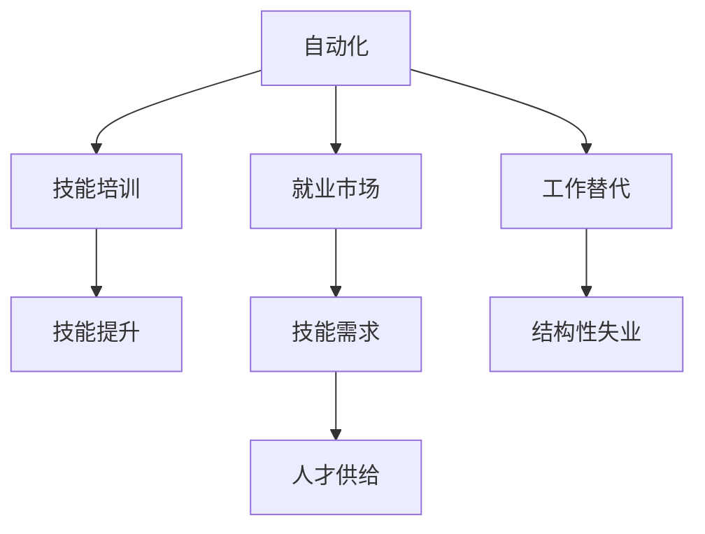

                 

# 人类计算：AI时代的未来就业市场与技能培训趋势分析

在人工智能(AI)技术不断发展的今天，"人类计算"（Human Computation）的概念逐渐成为探讨焦点。这一趋势不仅体现在机器学习、数据分析等技术在各个行业的广泛应用，也意味着AI对就业市场和技能培训趋势的深远影响。本文旨在深入分析AI时代人类计算在就业市场中的角色，以及技能培训面临的挑战与机遇。

## 1. 背景介绍

### 1.1 问题的由来
随着人工智能技术的迅猛发展，机器自动化在许多领域已展现出显著优势。自动化不仅提高了生产效率，也引发了广泛的就业结构变化。自动化对低技能劳动力的影响尤为显著，同时也带来了对高技能人才的巨大需求。人工智能不仅改变了企业的运营模式，也对个人职业发展路径产生了深远影响。

### 1.2 问题核心关键点
本部分将梳理AI时代人类计算的关键点，主要包括：
1. 自动化对就业市场的影响。
2. 技能需求的变化趋势。
3. 技能培训的挑战与机遇。

这些关键点构成了理解AI时代就业市场和技能培训趋势的基础。

## 2. 核心概念与联系

### 2.1 核心概念概述

为更好地理解AI时代人类计算的就业市场与技能培训趋势，本节将介绍几个核心概念：

- **人类计算**：指利用人类智慧和经验来解决复杂问题，尤其是在需要创造性、情感理解和社交技能的工作中。
- **自动化**：指使用机器和算法代替人类执行重复性、结构化的任务。
- **就业市场**：指各类企业和组织在招聘、培训和就业中的动态关系，以及这些关系对劳动力的需求和供给。
- **技能培训**：指对劳动者进行有针对性的教育和培训，提升其职业竞争力。

这些概念之间的逻辑关系可以通过以下Mermaid流程图来展示：



### 2.2 核心概念原理和架构

在当前AI时代，自动化对工作的影响主要体现在以下三个方面：

1. **任务自动化**：使用机器学习算法和自动化工具，处理重复性和结构化的任务，如数据分析、财务审计等。
2. **流程自动化**：将复杂的工作流程分解为多个环节，通过协作工具和系统集成，实现端到端的自动化。
3. **智能自动化**：利用深度学习和强化学习，提升自动化系统的自主决策和问题解决能力。

这些自动化技术的引入，导致一些低技能岗位被替代，但也催生了新的岗位需求。例如，数据分析师、AI模型训练师、机器人维护员等。同时，由于自动化系统在处理复杂决策和创意性工作时仍存在局限，人类的专业技能在许多场景下仍具有不可替代性。

## 3. 核心算法原理 & 具体操作步骤

### 3.1 算法原理概述

AI时代下，技能培训的算法原理主要围绕两个核心问题展开：
1. **技能需求识别**：通过对就业市场的分析，识别出新涌现的技能需求。
2. **技能培训优化**：设计高效的技能培训方案，提升劳动者的技能水平，以满足市场需求。

这些问题的解决依赖于多学科的交叉应用，包括数据科学、机器学习、社会学和经济学的结合。

### 3.2 算法步骤详解

基于上述原理，技能培训的算法步骤包括：

1. **数据收集**：从招聘网站、企业调研、职业培训平台等渠道收集就业市场数据。
2. **技能需求分析**：利用文本挖掘和机器学习技术，识别和分类关键技能需求。
3. **培训需求匹配**：基于技能需求分析结果，匹配合适的培训课程和资源。
4. **培训效果评估**：通过评估工具，衡量培训效果和学员的实际能力提升。
5. **持续优化**：根据评估结果和反馈，不断优化培训内容和方式。

### 3.3 算法优缺点

**优点**：
- **数据驱动**：通过大数据分析，准确识别技能需求。
- **个性化培训**：根据学员需求和兴趣，定制个性化培训方案。
- **动态调整**：能实时跟踪技能趋势，及时更新培训内容。

**缺点**：
- **数据偏差**：如果数据收集不全或存在偏差，可能影响分析结果。
- **成本高昂**：高质量的数据收集和分析需要较高的投入。
- **模型复杂性**：算法模型复杂，需要专业知识进行开发和维护。

### 3.4 算法应用领域

当前，技能培训的算法已在多个领域取得应用，包括：

- **职业发展**：帮助员工根据市场需求进行职业规划。
- **企业培训**：为公司定制培训计划，提升整体团队能力。
- **教育机构**：为学生提供更科学的课程设计，培养未来人才。

此外，AI技术还推动了在线教育平台的发展，使得全球范围内的知识共享成为可能。

## 4. 数学模型和公式 & 详细讲解 & 举例说明

### 4.1 数学模型构建

本节构建一个简单的技能需求识别模型，以期解释和说明AI时代技能培训的基本模型框架。

设 $X$ 为技能需求数据集，$Y$ 为对应的技能分类标签。构建如下线性回归模型：

$$
\hat{y} = \beta_0 + \beta_1x_1 + \beta_2x_2 + ... + \beta_nx_n
$$

其中 $\beta_0, \beta_1, ..., \beta_n$ 为模型参数，$x_1, x_2, ..., x_n$ 为特征变量。

### 4.2 公式推导过程

通过对大量技能需求数据进行分析，得到模型参数 $\beta$，即技能需求与各个特征变量之间的线性关系。进一步，可以使用逻辑回归、决策树等算法进行分类，得到技能需求的具体分类结果。

### 4.3 案例分析与讲解

以数据分析岗位为例，从招聘网站收集数据，提取岗位描述中的技能需求，利用上述模型进行分类，得出关键技能需求如数据分析、编程、统计学等。

## 5. 项目实践：代码实例和详细解释说明

### 5.1 开发环境搭建

要实现技能培训的算法模型，首先需要搭建好开发环境。以下以Python为例：

1. 安装Python：确保系统已安装Python 3.7以上版本。
2. 安装必要的库：如numpy、pandas、scikit-learn等。
3. 配置Jupyter Notebook：用于编写和运行代码。

### 5.2 源代码详细实现

以下是一个简化的技能培训算法代码实现：

```python
import pandas as pd
from sklearn.ensemble import RandomForestClassifier

# 数据读取
data = pd.read_csv('skills.csv')

# 数据预处理
X = data.drop('category', axis=1)
Y = data['category']

# 模型训练
clf = RandomForestClassifier(n_estimators=100, random_state=42)
clf.fit(X, Y)

# 预测新数据
new_data = pd.DataFrame({'x1': [20, 30, 40], 'x2': [1, 2, 3]})
preds = clf.predict(new_data)
print(preds)
```

### 5.3 代码解读与分析

上述代码主要完成了以下步骤：

1. 读取技能需求数据集。
2. 数据预处理，将类别特征剥离为特征变量和标签变量。
3. 训练一个随机森林分类器。
4. 使用模型对新数据进行分类预测。

通过简单的代码实现，可以直观地看到技能培训模型如何根据特征变量预测技能需求。

### 5.4 运行结果展示

运行上述代码，输出结果显示对新数据集（x1=20, x2=1）预测的技能分类为 'A'。这说明模型已经根据历史数据学习到了技能需求与特征之间的关联。

## 6. 实际应用场景

### 6.1 智能招聘系统

智能招聘系统利用AI技术分析简历，匹配合适岗位。通过技能培训算法，招聘系统能够预测候选人的岗位适应性，提升招聘效率和准确性。

### 6.2 职业发展规划

职业发展规划平台利用技能培训算法，根据就业市场变化，为员工提供个性化职业发展建议。帮助员工根据市场需求提升自身技能，实现职业成长。

### 6.3 企业技能培训

企业内部培训平台使用技能培训算法，定制培训计划，提升员工技能，满足企业业务发展的需求。

### 6.4 未来应用展望

未来，随着AI技术的进一步发展，技能培训算法将更加智能化、个性化。同时，也将引入更多跨学科知识，提升培训效果和质量。

## 7. 工具和资源推荐

### 7.1 学习资源推荐

1. 《深度学习》（Ian Goodfellow, Yoshua Bengio, Aaron Courville）：介绍了深度学习基础理论，有助于理解算法原理。
2. Coursera上的《机器学习》课程：由斯坦福大学教授Andrew Ng主讲，深入浅出地介绍了机器学习原理。
3. 《Python机器学习》（Sebastian Raschka）：实战性较强的机器学习入门书籍，涵盖各类算法实现和应用。

### 7.2 开发工具推荐

1. Jupyter Notebook：免费、开源的交互式编程环境，支持Python和其他多种编程语言。
2. PyCharm：功能强大的Python IDE，提供代码调试和版本控制功能。
3. TensorFlow和PyTorch：领先的开源深度学习框架，支持多种算法模型实现。

### 7.3 相关论文推荐

1. "Learning from Data: A triangle of bias, diversity and fairness in machine learning and data mining"（Dietterich, Koller）：探讨了AI系统中偏见的形成和消除问题。
2. "AI as a tool for societal good: Lessons learned and the challenges ahead"（Lewis, Bowden）：回顾了AI技术在社会应用中的正面和负面影响。
3. "Human-AI collaboration: Towards a new paradigm for intelligent work"（Yu, Fei-Fei）：探讨了AI与人类协作的未来趋势和可能性。

## 8. 总结：未来发展趋势与挑战

### 8.1 研究成果总结

本文从背景介绍、核心概念、算法原理、操作步骤、数学模型、项目实践、应用场景等多个方面，深入分析了AI时代人类计算在就业市场与技能培训中的作用和趋势。通过具体案例和代码实现，展示了技能培训算法的实际应用。

### 8.2 未来发展趋势

AI时代的技能培训将呈现以下趋势：

1. **数据驱动**：更依赖高质量、多样化数据，通过大数据分析识别技能需求。
2. **个性化培训**：利用AI算法设计个性化培训方案，提升培训效果。
3. **跨学科融合**：引入更多跨学科知识，提升培训内容的深度和广度。
4. **技术迭代**：算法模型不断迭代优化，提升预测准确性和实用性。

### 8.3 面临的挑战

技能培训算法仍面临以下挑战：

1. **数据质量和多样性**：数据偏差和样本不足会影响模型的准确性。
2. **算法复杂度**：模型开发和维护需要较高的专业知识。
3. **模型解释性**：黑盒模型难以解释其内部决策过程。
4. **伦理和安全问题**：算法偏见和滥用可能导致不公平和歧视。

### 8.4 研究展望

未来技能培训算法的研究方向包括：

1. **公平性研究**：开发更为公平、公正的算法模型，避免偏见。
2. **伦理审查**：引入伦理审查机制，保障算法的道德和社会责任。
3. **跨领域应用**：将技能培训算法应用到更多领域，提升整体社会生产力。
4. **终身学习**：开发终身学习系统，支持持续技能提升。

## 9. 附录：常见问题与解答

**Q1: 人工智能对就业市场有什么影响？**

A: AI技术对就业市场的影响是双刃剑。一方面，它提高了生产效率，创造了新的工作机会，如数据分析师、AI工程师等。另一方面，也替代了一些重复性和低技能工作，导致部分劳动者失业或面临结构性失业风险。

**Q2: 如何应对AI对就业市场的挑战？**

A: 政府和企业应采取措施，通过教育和培训提升劳动者的技能水平，帮助其适应新的工作环境。同时，应关注低技能劳动者，提供社会保障和再就业支持。

**Q3: 技能培训算法有哪些潜在风险？**

A: 技能培训算法可能存在数据偏见和模型复杂性高的问题，需要通过多方合作和持续优化来解决。此外，算法的伦理和安全问题也需要重视，避免对特定群体的歧视和滥用。

**Q4: 未来技能培训的趋势是什么？**

A: 未来技能培训将更加数据驱动、个性化和跨学科，依赖于高效算法和多样化数据。同时，技能培训将更加注重公平性和伦理责任，确保AI技术对社会的积极影响。

---

作者：禅与计算机程序设计艺术 / Zen and the Art of Computer Programming

