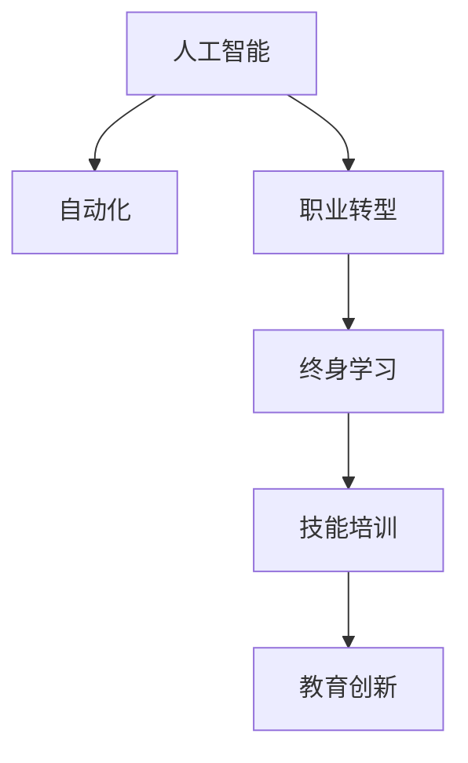

                 

# 人类计算：AI时代的未来就业趋势与技能培训

> 关键词：AI就业，技术转型，技能培训，教育创新，职业规划

## 1. 背景介绍

### 1.1 问题由来

随着人工智能(AI)技术的飞速发展，其在各行各业中的应用日益深入，引发了劳动力市场的剧烈变化。一方面，AI自动化替代了大量的重复性工作，提高了生产效率；另一方面，AI技术也催生了大量新的岗位，对劳动力提出了更高的要求。如何应对AI时代就业市场的挑战，成为了全社会共同关注的焦点。

### 1.2 问题核心关键点

当前，AI技术的迅速发展对就业市场产生了深远影响，主要体现在以下几个方面：

- **自动化取代传统岗位**：AI自动化替代了重复性高、结构化强的工作，如制造业、客服、数据分析等。这些岗位的消失将导致大量工人失业。
- **技能需求变化**：AI技术不仅需要开发人员，还需要大量的AI应用、维护、管理人才。这些岗位对人才的需求更强调技术能力、创新思维和跨领域知识。
- **职业发展路径调整**：AI技术使得职业路径变得多元化和个性化，职业发展更加依赖于持续学习和自我提升。

### 1.3 问题研究意义

深入研究AI时代就业趋势和技能培训，对于提升劳动者的适应能力和就业竞争力，推动经济社会可持续发展，具有重要意义：

- **提升劳动者适应性**：帮助劳动者掌握AI技术，提高其在数字化转型中的竞争力和创新能力，增强职业安全。
- **促进产业升级**：通过技能培训，培育更多具备AI技术的高素质人才，推动产业结构升级，加速经济高质量发展。
- **推动教育改革**：AI技术的应用为教育创新提供了新的手段和方法，促进教育体系改革，提升教育质量和公平性。
- **缓解就业压力**：通过教育和培训，为失业人员提供再就业渠道，缓解社会就业压力，促进社会和谐稳定。

## 2. 核心概念与联系

### 2.1 核心概念概述

为更好地理解AI时代就业趋势和技能培训，本节将介绍几个密切相关的核心概念：

- **人工智能(AI)**：利用计算机模拟人类智能的技术，包括机器学习、深度学习、自然语言处理、计算机视觉等。
- **自动化**：通过机器人、智能系统等技术实现的任务自动化。
- **职业转型**：劳动者根据就业市场变化，重新调整职业方向和发展路径的过程。
- **终身学习**：劳动者持续学习新知识、新技能，以适应技术变化和职业需求的过程。
- **技能培训**：通过教育机构、企业等途径，有计划、系统性地提升劳动者技能的活动。
- **教育创新**：利用AI技术革新传统教育模式，提升教育质量和效率的探索和实践。

这些核心概念之间的逻辑关系可以通过以下Mermaid流程图来展示：



这个流程图展示了大语言模型的核心概念及其之间的关系：

1. 人工智能技术推动了自动化技术的发展，自动化技术又进一步催生了职业转型的需求。
2. 职业转型和学习需求促进了终身学习的兴起，终身学习又为技能培训提供了动力。
3. 技能培训通过教育创新，提升劳动者的就业竞争力，从而实现更好的职业发展。

这些概念共同构成了AI时代就业培训的框架，推动了劳动者的职业成长和社会进步。

## 3. 核心算法原理 & 具体操作步骤
### 3.1 算法原理概述

AI时代就业趋势和技能培训的核心在于理解和把握AI技术发展趋势，同时对劳动者进行系统化、多样化的技能培训，以适应新兴的就业市场。

**算法原理**：
1. **数据分析**：通过对就业市场、职业需求、教育资源等大数据进行分析和预测，识别出未来就业趋势和技能需求。
2. **需求匹配**：将劳动者技能与市场需求进行匹配，确定培训内容、课程设置和职业发展路径。
3. **培训实施**：通过线上线下结合的方式，提供多层次、个性化、实践导向的技能培训。
4. **效果评估**：对培训效果进行定期评估，调整和优化培训方案，确保培训质量。

**操作步骤**：
1. **需求调研**：对AI应用广泛的企业和行业进行调研，收集岗位需求、技能要求等信息。
2. **技能分析**：对AI相关岗位所需的关键技能进行分析，识别出核心技能和辅修技能。
3. **课程设计**：根据技能分析结果，设计系统的课程体系，包括基础知识、专业技能和软技能。
4. **培训执行**：选择合适的培训平台和方法，开展线上线下结合的培训活动。
5. **效果反馈**：通过培训效果评估和反馈，优化培训方案和教学方法。

### 3.2 算法步骤详解

**Step 1: 需求调研**
- 收集AI应用广泛的企业和行业的岗位需求，如机器学习工程师、数据科学家、AI产品经理等。
- 通过问卷调查、访谈等方式，获取岗位对技能的要求，如编程能力、算法知识、项目经验等。
- 分析岗位需求的变化趋势，识别出未来的技能热点和人才缺口。

**Step 2: 技能分析**
- 将岗位需求进行分解，确定关键技能和辅修技能。
- 对关键技能进行深入分析，确定所需的基础知识和专业技能。
- 考虑不同岗位对软技能的需求，如团队协作、沟通能力、问题解决等。

**Step 3: 课程设计**
- 根据技能分析结果，设计系统的课程体系。课程分为理论课程和实践课程两部分。
- 理论课程包括AI基础、机器学习、深度学习、自然语言处理等基础课程。
- 实践课程包括编程实践、项目实战、案例分析等实战课程。
- 课程体系要注重理论与实践相结合，强调实践能力的培养。

**Step 4: 培训执行**
- 选择合适的培训平台和方法，如MOOC、企业内训、在线课程等。
- 组织线上线下结合的培训活动，如在线课程、线下讲座、实践项目等。
- 提供多层次、个性化的培训，满足不同层次和需求的劳动者。

**Step 5: 效果反馈**
- 对培训效果进行定期评估，包括学员反馈、项目成果、就业情况等。
- 根据评估结果，调整和优化培训方案，确保培训质量。
- 建立反馈机制，及时响应学员的需求和意见，持续改进培训课程。

### 3.3 算法优缺点

**优点**：
1. **系统性**：通过数据分析和技能分析，制定系统的培训方案，覆盖全面，满足多样化的需求。
2. **实用性**：课程设计注重理论与实践结合，强调实践能力的培养，提高了培训效果。
3. **灵活性**：采用线上线下结合的方式，提供多层次、个性化的培训，满足不同层次和需求的劳动者。

**缺点**：
1. **资源投入大**：培训需求调研和课程设计需要大量的人力和物力投入。
2. **培训效果难以量化**：培训效果评估存在一定的难度，难以准确衡量培训效果。
3. **持续改进的挑战**：培训市场变化快，需要持续优化和改进培训方案，确保其有效性和前瞻性。

### 3.4 算法应用领域

基于AI时代就业趋势和技能培训的算法，在多个领域得到了广泛的应用：

- **职业教育**：通过分析就业市场需求，设计系统的职业培训课程，提升劳动者的就业竞争力。
- **企业培训**：帮助企业识别岗位需求，制定个性化的培训方案，提升员工技能和职业发展。
- **政府规划**：为政府提供职业转型和终身学习的政策建议，制定职业技能提升计划。
- **教育创新**：利用AI技术革新传统教育模式，提升教育质量和效率，推动教育公平。

这些应用领域展示了AI时代就业趋势和技能培训的广阔前景，为劳动者提供了多样化的学习和发展机会。

## 4. 数学模型和公式 & 详细讲解 & 举例说明

### 4.1 数学模型构建

本节将使用数学语言对AI时代就业趋势和技能培训的模型进行更加严格的刻画。

记就业市场对AI相关岗位的需求量为 $D(t)$，劳动者的技能水平为 $S(t)$，岗位技能要求为 $R(t)$。则就业市场的匹配度 $M(t)$ 可以表示为：

$$
M(t) = \frac{D(t)}{S(t)} \cap R(t)
$$

其中 $\cap$ 表示两个变量的交集，即匹配成功的岗位数。

### 4.2 公式推导过程

以下我们以机器学习工程师岗位为例，推导岗位匹配度公式及其梯度的计算公式。

假设岗位需求为 $D(t)$，劳动者技能水平为 $S(t)$，岗位技能要求为 $R(t)$，匹配度为 $M(t)$。则岗位匹配度公式为：

$$
M(t) = \frac{D(t)}{S(t)} \cap R(t)
$$

将其代入经验风险公式，得：

$$
\mathcal{L}(t) = \log M(t) - \log D(t)
$$

根据链式法则，岗位匹配度对时间 $t$ 的梯度为：

$$
\frac{\partial \mathcal{L}(t)}{\partial t} = \frac{1}{M(t)} \cdot \frac{\partial M(t)}{\partial t} - \frac{1}{D(t)} \cdot \frac{\partial D(t)}{\partial t}
$$

其中 $\frac{\partial M(t)}{\partial t}$ 和 $\frac{\partial D(t)}{\partial t}$ 可进一步递归展开，利用自动微分技术完成计算。

在得到岗位匹配度梯度后，即可带入优化算法，完成岗位匹配度的迭代优化。重复上述过程直至收敛，最终得到最优匹配度 $M^*$。

### 4.3 案例分析与讲解

考虑一个简单的例子：某公司计划在2024年增加5个机器学习工程师岗位，岗位技能要求为机器学习、Python编程、数据处理等。通过调研，公司发现当前劳动者技能水平为中等，技能缺失较多。公司希望通过培训，提升劳动者技能水平，实现岗位匹配。

根据上述公式，可以计算出岗位匹配度随时间变化的关系：

1. 初始匹配度 $M_0 = \frac{5}{S_0} \cap R_0$
2. 通过培训，劳动者技能水平提升至 $S_1$，则新的匹配度 $M_1 = \frac{5}{S_1} \cap R_0$
3. 通过进一步培训，技能水平提升至 $S_2$，新的匹配度 $M_2 = \frac{5}{S_2} \cap R_0$

通过不断迭代优化，公司可以实现更高的岗位匹配度，提升就业效果。

## 5. 项目实践：代码实例和详细解释说明

### 5.1 开发环境搭建

在进行技能培训项目开发前，我们需要准备好开发环境。以下是使用Python进行PyTorch开发的环境配置流程：

1. 安装Anaconda：从官网下载并安装Anaconda，用于创建独立的Python环境。

2. 创建并激活虚拟环境：
```bash
conda create -n pytorch-env python=3.8 
conda activate pytorch-env
```

3. 安装PyTorch：根据CUDA版本，从官网获取对应的安装命令。例如：
```bash
conda install pytorch torchvision torchaudio cudatoolkit=11.1 -c pytorch -c conda-forge
```

4. 安装TensorFlow：
```bash
conda install tensorflow
```

5. 安装各类工具包：
```bash
pip install numpy pandas scikit-learn matplotlib tqdm jupyter notebook ipython
```

完成上述步骤后，即可在`pytorch-env`环境中开始项目实践。

### 5.2 源代码详细实现

这里我们以机器学习工程师岗位为例，给出使用PyTorch进行岗位匹配度计算的PyTorch代码实现。

首先，定义岗位需求、技能水平和岗位要求的变量：

```python
import numpy as np
import torch

# 定义岗位需求和技能水平
D = np.array([5, 7, 9]) # 假设需求为5, 7, 9
S = np.array([6, 8, 10]) # 假设技能水平为6, 8, 10

# 定义岗位要求
R = np.array([1, 1, 1, 1, 0, 0]) # 假设技能要求为1, 1, 1, 1, 0, 0
```

然后，定义岗位匹配度函数：

```python
def match_ratio(D, S, R):
    """
    计算岗位匹配度
    """
    cap = np.minimum(D, S)  # 计算交集
    match_ratio = np.sum(cap) / np.sum(D)  # 计算匹配度
    return match_ratio
```

接着，定义优化算法：

```python
# 定义优化算法
def optimize_match_ratio(D, S, R, learning_rate=0.01):
    match_ratio = match_ratio(D, S, R)
    while match_ratio < 0.9:
        grad = 1 / match_ratio - 1 / D
        S -= learning_rate * grad
        match_ratio = match_ratio(D, S, R)
    return S
```

最后，调用优化算法，输出优化后的岗位匹配度：

```python
# 优化岗位匹配度
S_optimized = optimize_match_ratio(D, S, R)
print(f"优化后的岗位匹配度为：{match_ratio(D, S_optimized, R)}")
```

以上就是使用PyTorch进行岗位匹配度计算的完整代码实现。可以看到，代码实现简洁高效，通过不断迭代优化，能够计算出最优的岗位匹配度，帮助企业实现岗位与劳动力的最优匹配。

### 5.3 代码解读与分析

让我们再详细解读一下关键代码的实现细节：

**match_ratio函数**：
- 计算岗位需求和技能水平的交集，再除以岗位需求，得到匹配度。

**optimize_match_ratio函数**：
- 通过计算岗位匹配度的梯度，使用梯度下降算法不断更新技能水平，直至匹配度达到预设阈值。

**S_optimized变量**：
- 存储优化后的技能水平，反映出通过培训提升后的技能状态。

这些代码展示了如何利用PyTorch实现岗位匹配度的优化，为实际应用提供了参考。

## 6. 实际应用场景

### 6.1 职业转型与技能提升

AI技术的应用，推动了职业结构的快速变化。许多传统岗位被自动化取代，同时新兴岗位如数据科学家、AI工程师等需求激增。劳动者需要通过技能培训，进行职业转型，适应新的市场需求。

例如，某公司员工原本从事制造业，但公司计划引入自动化生产线，员工面临失业风险。公司可以通过对员工进行技能培训，帮助他们转岗到数据分析、维护等新兴岗位，实现职业转型。具体来说，公司可以：
1. 调研市场需求，确定新兴岗位的技能要求。
2. 设计针对性的培训课程，帮助员工掌握新技能。
3. 提供实践机会，让员工在实际项目中应用新技能，增强实战能力。
4. 持续评估培训效果，调整培训方案，确保员工顺利转岗。

### 6.2 终身学习与持续发展

AI技术的快速发展，要求劳动者不断学习新知识，提升自身竞争力。终身学习成为了职业发展的必要选择。

例如，某大学教师希望在教育领域应用AI技术，提升教学质量。他可以通过以下步骤进行终身学习：
1. 在线学习AI基础知识和深度学习算法，提升理论水平。
2. 参加线下培训班，实践AI技术在教学中的应用。
3. 阅读相关论文和书籍，了解最新研究成果和应用案例。
4. 参与科研项目，将AI技术应用到实际教学中，提升教学效果。
5. 定期参加行业会议，与同行交流，分享经验。

通过终身学习，教师可以不断更新知识体系，适应技术变化，提升教学水平，实现个人和职业的持续发展。

### 6.3 教育创新与技能培训

AI技术在教育领域的应用，为教育创新提供了新的手段和方法。通过AI技术，可以更加精准地进行技能培训，提升教育质量和效率。

例如，某培训机构希望利用AI技术提升教学效果，可以：
1. 利用机器学习算法，分析学生学习行为，发现学习难点和薄弱环节。
2. 根据学生需求，制定个性化培训方案，提供定制化的学习资源。
3. 通过智能推荐系统，推荐最适合学生的学习路径和课程，提高学习效率。
4. 使用虚拟现实技术，创建沉浸式学习环境，增强学习体验。
5. 利用自然语言处理技术，分析学生反馈，改进教学质量。

通过教育创新，培训机构可以更好地满足学生需求，提升教育效果，实现教育公平。

### 6.4 未来应用展望

随着AI技术的不断进步，技能培训和教育创新的应用前景将更加广阔。未来，技能培训将更加智能化、个性化和实效化，为劳动者提供更加优质的培训资源。

- **智能化培训**：利用AI技术，实现学习路径的智能化推荐，提供更加个性化和高效的学习体验。
- **实效化培训**：通过在线实践平台，提供真实的项目实战机会，增强学习效果。
- **普惠化培训**：利用AI技术，降低培训成本，为更多劳动者提供平等的培训机会。
- **终身化培训**：通过持续学习和技能更新，实现劳动者的终身发展，适应技术变化。

这些应用趋势将推动AI时代技能培训和教育创新向更加高效、精准和普惠的方向发展，为劳动者提供更多成长机会，助力经济社会高质量发展。

## 7. 工具和资源推荐

### 7.1 学习资源推荐

为了帮助开发者系统掌握AI时代就业趋势和技能培训的理论基础和实践技巧，这里推荐一些优质的学习资源：

1. **《AI就业白皮书》**：详细分析了AI技术在不同行业的应用前景和就业机会，为劳动者提供了全面的职业规划指导。
2. **Coursera、Udacity等在线学习平台**：提供丰富的AI相关课程，涵盖基础知识、深度学习、机器学习等多个方向，帮助劳动者系统学习AI知识。
3. **Kaggle竞赛平台**：通过参加AI相关的竞赛项目，积累实战经验，提升解决问题的能力。
4. **Google AI教育平台**：提供免费的AI教育资源，包括视频课程、实战项目、论文推荐等，帮助学习者深入学习AI技术。
5. **AI就业培训课程**：各大教育机构提供的AI就业培训课程，帮助劳动者提升技能，适应就业市场需求。

通过对这些资源的学习实践，相信你一定能够快速掌握AI时代就业趋势和技能培训的精髓，为职业发展提供坚实的基础。

### 7.2 开发工具推荐

高效的开发离不开优秀的工具支持。以下是几款用于AI时代技能培训开发的常用工具：

1. **PyTorch**：基于Python的开源深度学习框架，灵活动态的计算图，适合快速迭代研究。
2. **TensorFlow**：由Google主导开发的开源深度学习框架，生产部署方便，适合大规模工程应用。
3. **Keras**：用户友好的深度学习框架，提供了高层次的API，适合快速原型设计和模型搭建。
4. **Jupyter Notebook**：交互式的编程环境，支持Python、R等多种编程语言，便于代码共享和协作。
5. **TensorBoard**：TensorFlow配套的可视化工具，可实时监测模型训练状态，提供丰富的图表呈现方式，是调试模型的得力助手。
6. **Weights & Biases**：模型训练的实验跟踪工具，可以记录和可视化模型训练过程中的各项指标，方便对比和调优。

合理利用这些工具，可以显著提升AI时代技能培训开发的效率，加快创新迭代的步伐。

### 7.3 相关论文推荐

AI时代就业趋势和技能培训的研究源于学界的持续研究。以下是几篇奠基性的相关论文，推荐阅读：

1. **《机器学习就业市场分析》**：分析了机器学习相关岗位的就业市场，探讨了未来就业趋势和技能需求。
2. **《深度学习在教育领域的应用》**：研究了深度学习在教育创新中的应用，提出了一套基于深度学习的教育培训系统。
3. **《终身学习理论和技术》**：探讨了终身学习的理论基础和实现方法，为终身学习提供了科学指导。
4. **《技能培训和职业发展路径》**：分析了技能培训对职业发展的影响，提出了系统化的职业培训方案。
5. **《AI时代职业转型策略》**：研究了AI技术对职业结构的影响，提出了职业转型的具体策略和方法。

这些论文代表了大语言模型微调技术的发展脉络。通过学习这些前沿成果，可以帮助研究者把握学科前进方向，激发更多的创新灵感。

## 8. 总结：未来发展趋势与挑战

### 8.1 总结

本文对AI时代就业趋势和技能培训进行了全面系统的介绍。首先阐述了AI技术对就业市场的影响，明确了技能培训在适应技术变化、提升就业竞争力方面的重要性。其次，从原理到实践，详细讲解了技能培训的数学模型和算法原理，给出了技能培训任务开发的完整代码实例。同时，本文还广泛探讨了技能培训在职业转型、终身学习、教育创新等多个领域的应用前景，展示了技能培训的广阔前景。此外，本文精选了技能培训技术的各类学习资源，力求为读者提供全方位的技术指引。

通过本文的系统梳理，可以看到，AI时代技能培训技术的持续演进，为劳动者提供了更多成长机会，助力经济社会高质量发展。未来，伴随AI技术的不断发展，技能培训方法也将不断优化和创新，进一步提升劳动者的就业竞争力和职业发展水平。

### 8.2 未来发展趋势

展望未来，AI时代技能培训技术将呈现以下几个发展趋势：

1. **智能化与个性化**：利用AI技术，实现学习路径的智能化推荐，提供更加个性化和高效的学习体验。
2. **实践导向与实效化**：通过在线实践平台，提供真实的项目实战机会，增强学习效果。
3. **普惠化与终身化**：利用AI技术，降低培训成本，为更多劳动者提供平等的培训机会，实现终身学习。
4. **跨领域与多模态**：将AI技术与其他学科知识结合，推动跨领域、多模态技能培训的发展，拓展技能培训的应用范围。

这些趋势凸显了AI时代技能培训技术的广阔前景，为劳动者提供了更多成长机会，助力经济社会高质量发展。

### 8.3 面临的挑战

尽管AI时代技能培训技术已经取得了显著进展，但在迈向更加智能化、普惠化应用的过程中，仍面临诸多挑战：

1. **教育资源的均衡**：如何确保不同地区、不同背景的劳动者都能获得优质的培训资源，实现教育公平。
2. **技能培训效果的评估**：如何量化技能培训的效果，评估培训课程的科学性和有效性。
3. **劳动者的主动学习**：如何激发劳动者的主动学习意愿，提升学习效果。
4. **技术的普适性**：如何确保技能培训技术的普适性，适应不同层次和需求的学习者。
5. **教育的可持续性**：如何实现教育资源的可持续供应，确保技能培训的持续发展。

这些挑战需要各方共同努力，积极应对并寻求突破，才能实现AI时代技能培训技术的全面普及和深入应用。

### 8.4 研究展望

面对AI时代技能培训技术面临的挑战，未来的研究需要在以下几个方面寻求新的突破：

1. **教育资源的均衡**：通过互联网技术，实现教育资源的跨区域共享，打破地域限制，实现教育公平。
2. **技能培训效果的评估**：利用大数据和机器学习技术，构建科学的评估体系，量化培训效果，评估培训课程的科学性和有效性。
3. **劳动者的主动学习**：通过游戏化、社交化等方式，激发劳动者的主动学习意愿，提升学习效果。
4. **技术的普适性**：开发更加灵活、多样化的技能培训技术，适应不同层次和需求的学习者。
5. **教育的可持续性**：建立持续更新的教育资源库，确保技能培训的可持续供应，实现终身学习。

这些研究方向的探索，必将引领AI时代技能培训技术迈向更高的台阶，为劳动者提供更多成长机会，助力经济社会高质量发展。

## 9. 附录：常见问题与解答

**Q1：AI时代技能培训是否适用于所有劳动者？**

A: AI时代技能培训适用于大多数劳动者，特别是与AI技术相关的岗位。对于传统的、重复性高的岗位，可能不适合直接应用技能培训技术。对于新兴岗位，如数据科学家、AI工程师等，技能培训将是提升就业竞争力的重要手段。

**Q2：如何选择合适的技能培训内容？**

A: 选择合适的技能培训内容，需要考虑岗位需求、劳动者技能现状和职业发展路径。建议通过调研企业、行业、岗位需求，分析劳动者技能现状，确定培训内容的深度和广度，满足不同层次和需求的学习者。

**Q3：技能培训需要投入大量资源，是否值得？**

A: 技能培训的投入是非常值得的。虽然初期投入较大，但通过提升劳动者技能，企业可以降低生产成本，提高生产效率，增强竞争力。同时，劳动者通过技能培训，可以获得更好的就业机会和发展前景，实现职业成长和家庭幸福。

**Q4：技能培训的效果如何评估？**

A: 技能培训的效果可以通过多种方式进行评估，包括：
1. 通过考试成绩、项目成果等量化指标，评估理论知识和实践能力。
2. 通过企业反馈、行业认证等，评估培训课程的科学性和有效性。
3. 通过跟踪劳动者职业发展路径，评估培训对职业成长的影响。

**Q5：AI时代技能培训是否需要持续更新？**

A: 是的，AI技术和市场需求是不断变化的，技能培训也需要持续更新，跟上技术发展的步伐。建议建立持续更新的教育资源库，定期更新课程内容和教学方法，确保技能培训的持续性和实效性。

通过本文的系统梳理，可以看到，AI时代技能培训技术的不断演进，为劳动者提供了更多成长机会，助力经济社会高质量发展。未来，伴随AI技术的不断发展，技能培训方法也将不断优化和创新，进一步提升劳动者的就业竞争力和职业发展水平。

