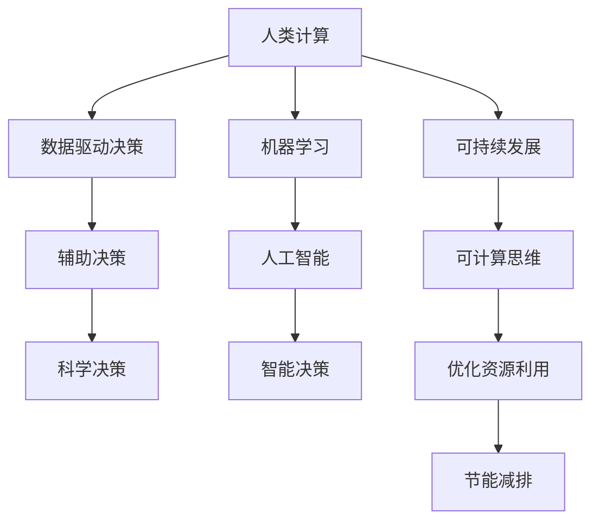

                 

# 人类计算：可持续发展的推动力

> 关键词：人类计算, 可持续发展, 数据驱动决策, 机器学习, 人工智能, 可计算思维

## 1. 背景介绍

### 1.1 问题由来

在全球经济和社会面临诸多挑战的背景下，如何实现可持续发展成为当今世界亟待解决的重大课题。作为经济社会的基石，计算正逐渐从以机器为中心向以人为中心转变。"人类计算"这一新兴概念应运而生，强调通过数据驱动的决策和创新的计算方法，推动经济的可持续发展。

近年来，大数据、人工智能（AI）和机器学习（ML）技术的迅猛发展，为人类计算提供了有力的技术支撑。通过对海量数据的分析和建模，机器学习能够预测未来的趋势，辅助决策者做出更加精准的判断。然而，机器学习的本质依赖于大量的数据和计算资源，往往存在资源消耗大、环境影响高等问题，影响其可持续发展。

### 1.2 问题核心关键点

本文聚焦于人类计算的核心关键点：
1. **数据驱动决策**：通过数据驱动的方法，辅助决策者制定科学的政策，驱动经济社会发展。
2. **可持续资源利用**：优化资源配置，减少数据处理过程中的能耗和碳排放，实现可持续发展。
3. **环境影响评估**：评估AI和ML技术的环境影响，制定相应的政策和规范。
4. **计算与人工结合**：探索计算与人工结合的新范式，提升决策的准确性和可靠性。

## 2. 核心概念与联系

### 2.1 核心概念概述

为更好地理解人类计算及其与可持续发展的联系，本节将介绍几个关键概念：

- **人类计算**：通过数据驱动的计算方法，结合人类的判断和经验，辅助决策者制定科学合理的决策，实现更高效、更精准的决策。
- **可持续发展**：指在满足当代人需求的同时，不损害后代人满足其需求的能力的发展模式，强调资源的合理利用和环境保护。
- **数据驱动决策**：利用数据分析和建模，从数据中挖掘出决策依据，辅助决策者做出科学的决策。
- **可计算思维**：指通过计算模型解决复杂问题的方法，强调在决策过程中利用计算思维辅助人类的逻辑推理。
- **机器学习**：一种通过数据训练模型，并利用模型进行预测和决策的技术，广泛应用于数据分析、预测等领域。
- **人工智能**：一种能够模拟人类智能行为的计算技术，通过学习、推理等方法实现智能化决策。

这些核心概念之间的关系可以用以下Mermaid流程图来展示：



这个流程图展示了人类计算的核心概念及其之间的关系：

1. 人类计算通过数据驱动决策，辅助科学决策。
2. 机器学习和人工智能为数据驱动决策提供技术支持。
3. 可计算思维强调在决策过程中利用计算模型辅助人类。
4. 可持续发展需要优化资源利用，减少环境影响。

这些概念共同构成了人类计算的理论基础，指导其在实践中的应用。

## 3. 核心算法原理 & 具体操作步骤
### 3.1 算法原理概述

人类计算的核心算法原理基于数据驱动和可计算思维，通过分析海量数据，结合人类的经验知识，辅助决策者制定科学决策。其主要步骤如下：

1. **数据收集与预处理**：从各个数据源收集数据，并进行清洗、去重、归一化等预处理，确保数据质量。
2. **特征提取与建模**：从预处理后的数据中提取关键特征，利用机器学习算法建立模型，进行预测和决策。
3. **模型评估与优化**：对模型进行评估，通过交叉验证、调参等方法优化模型性能，确保模型的准确性和鲁棒性。
4. **辅助决策与迭代改进**：将模型输出结果与人类经验结合，辅助决策者制定决策，并根据反馈迭代改进模型。

### 3.2 算法步骤详解

下面以环境影响评估为例，详细介绍人类计算的详细步骤：

1. **数据收集**：收集全球各地的空气质量、水质量、能源消耗等数据。
2. **数据预处理**：清洗数据，去除缺失值和异常值，进行归一化处理。
3. **特征提取**：提取关键指标，如碳排放量、能耗、水消耗等。
4. **模型建立**：利用机器学习算法（如随机森林、梯度提升树等）建立预测模型。
5. **模型评估**：使用交叉验证方法评估模型性能，通过调参优化模型参数。
6. **辅助决策**：将模型输出与人类经验结合，评估不同政策的潜在影响。
7. **迭代改进**：根据评估结果和反馈，不断改进模型，优化资源配置。

### 3.3 算法优缺点

人类计算的优点：
1. **数据驱动**：利用海量数据进行建模，提高决策的科学性和可靠性。
2. **可计算思维**：结合人类的经验知识，提升决策的逻辑性和合理性。
3. **辅助决策**：为决策者提供科学依据，提升决策的效率和质量。

人类计算的缺点：
1. **数据质量依赖**：数据质量直接影响计算结果的准确性。
2. **模型复杂性**：需要构建复杂的模型，且模型调参难度较大。
3. **计算资源消耗**：数据处理和模型训练需要大量的计算资源，可能带来环境影响。
4. **可解释性不足**：复杂的模型难以解释其内部决策过程，可能影响决策者的信任。

### 3.4 算法应用领域

人类计算在多个领域都有广泛的应用，例如：

- **环境保护**：评估政策对环境的影响，辅助制定环境保护措施。
- **能源管理**：优化能源消耗，提高能源利用效率。
- **交通管理**：预测交通流量，优化交通信号，缓解交通拥堵。
- **公共健康**：预测疫情发展趋势，辅助制定防控策略。
- **城市规划**：优化资源配置，提高城市管理水平。

## 4. 数学模型和公式 & 详细讲解 & 举例说明

### 4.1 数学模型构建

在本节中，我们将使用数学语言对人类计算的核心模型进行详细讲解。

假设数据集为 $D=\{(x_i,y_i)\}_{i=1}^N$，其中 $x_i$ 为输入特征向量，$y_i$ 为输出标签。我们希望建立模型 $M_{\theta}(x)$，通过训练数据拟合出最优参数 $\theta$，使得模型在测试数据上的预测准确率最高。

数学模型构建的核心步骤包括：

1. **损失函数设计**：选择合适的损失函数，如均方误差损失（MSE）、交叉熵损失（CE）等，衡量模型预测与真实标签之间的差异。
2. **优化目标函数**：将损失函数转化为优化目标函数，如最小化损失函数 $L(\theta)$，找到最优参数 $\theta^*$。
3. **模型训练**：使用优化算法（如梯度下降、Adam等）更新模型参数 $\theta$，最小化损失函数 $L(\theta)$。
4. **模型评估**：在测试集上评估模型性能，衡量其泛化能力和鲁棒性。

### 4.2 公式推导过程

以均方误差损失函数为例，其推导过程如下：

$$
\begin{aligned}
L(\theta) &= \frac{1}{N}\sum_{i=1}^N (y_i - M_{\theta}(x_i))^2 \\
&= \frac{1}{N}\sum_{i=1}^N (y_i - \sum_{j=1}^M \theta_j \phi_j(x_i))^2 \\
&= \frac{1}{N}\sum_{i=1}^N \left( y_i - \sum_{j=1}^M \theta_j \phi_j(x_i) \right)^2
\end{aligned}
$$

其中，$M$ 为模型参数数量，$\phi_j(x)$ 为模型输入 $x_i$ 的第 $j$ 个特征表示。

通过求解上述优化目标函数，我们可以得到最优模型参数 $\theta^*$。

### 4.3 案例分析与讲解

以环境影响评估为例，详细讲解人类计算的数学模型构建和推导过程：

1. **数据收集与预处理**：收集全球各地的空气质量、水质量、能源消耗等数据，进行清洗和归一化处理。
2. **特征提取**：提取关键指标，如碳排放量、能耗、水消耗等。
3. **模型建立**：利用机器学习算法（如随机森林、梯度提升树等）建立预测模型，其公式为：

$$
M_{\theta}(x) = \sum_{j=1}^M \theta_j \phi_j(x)
$$

其中，$\theta_j$ 为第 $j$ 个模型参数，$\phi_j(x)$ 为第 $j$ 个特征表示。
4. **模型评估**：使用交叉验证方法评估模型性能，通过调参优化模型参数，最小化损失函数 $L(\theta)$。
5. **辅助决策**：将模型输出与人类经验结合，评估不同政策的潜在影响，公式为：

$$
\text{Impact}_{\theta}(\text{Policy}) = M_{\theta}(\text{Policy})
$$

其中，$\text{Impact}_{\theta}(\text{Policy})$ 为在参数 $\theta$ 下，策略 $\text{Policy}$ 对环境的影响。

6. **迭代改进**：根据评估结果和反馈，不断改进模型，优化资源配置，提升模型性能。

## 5. 项目实践：代码实例和详细解释说明
### 5.1 开发环境搭建

在进行人类计算项目开发前，我们需要准备好开发环境。以下是使用Python进行PyTorch开发的环境配置流程：

1. 安装Anaconda：从官网下载并安装Anaconda，用于创建独立的Python环境。

2. 创建并激活虚拟环境：
```bash
conda create -n human_computing_env python=3.8 
conda activate human_computing_env
```

3. 安装PyTorch：根据CUDA版本，从官网获取对应的安装命令。例如：
```bash
conda install pytorch torchvision torchaudio cudatoolkit=11.1 -c pytorch -c conda-forge
```

4. 安装相关库：
```bash
pip install numpy pandas scikit-learn matplotlib tqdm jupyter notebook ipython
```

5. 配置环境变量：设置Python路径、环境依赖等。

完成上述步骤后，即可在`human_computing_env`环境中开始人类计算项目的开发。

### 5.2 源代码详细实现

下面以环境影响评估为例，给出使用PyTorch进行人类计算的代码实现。

```python
import numpy as np
import pandas as pd
import torch
from sklearn.model_selection import train_test_split
from sklearn.ensemble import RandomForestRegressor
from torch.utils.data import Dataset, DataLoader

# 定义数据集
class EnvironmentalData(Dataset):
    def __init__(self, data):
        self.data = data
        self.labels = data['Impact']
        self.x = data.drop(['Impact'], axis=1)
    
    def __len__(self):
        return len(self.x)
    
    def __getitem__(self, item):
        x = torch.from_numpy(self.x[item].values)
        y = torch.from_numpy(self.labels[item].values)
        return x, y

# 加载数据
data = pd.read_csv('env_data.csv')
x_train, x_test, y_train, y_test = train_test_split(data.drop('Impact', axis=1), data['Impact'], test_size=0.2)

# 定义数据集
train_dataset = EnvironmentalData(x_train)
test_dataset = EnvironmentalData(x_test)

# 定义模型
model = RandomForestRegressor(n_estimators=100, random_state=0)

# 训练模型
model.fit(x_train, y_train)

# 评估模型
test_loss = model.score(x_test, y_test)
print(f'Test Loss: {test_loss:.4f}')

# 辅助决策
policy = np.array([...])  # 策略向量
predicted_impact = model.predict(policy.reshape(1, -1))
print(f'Predicted Impact: {predicted_impact[0]}')
```

在上述代码中，我们首先定义了一个数据集类 `EnvironmentalData`，用于加载和管理环境影响评估数据。然后，我们将数据分为训练集和测试集，并使用随机森林模型进行训练和评估。最后，我们使用训练好的模型对特定策略进行预测，辅助决策。

### 5.3 代码解读与分析

**数据集类EnvironmentalData**：
- `__init__`方法：初始化数据集，包括输入特征 `x` 和标签 `y`。
- `__len__`方法：返回数据集的样本数量。
- `__getitem__`方法：获取单个样本的输入特征和标签。

**模型训练与评估**：
- 使用 `train_test_split` 函数将数据集分为训练集和测试集，比例为80%和20%。
- 使用随机森林模型进行训练，设置参数 `n_estimators=100`，表示构建100个决策树。
- 在测试集上评估模型性能，使用 `score` 函数计算模型在测试集上的平均绝对误差。

**辅助决策**：
- 将策略向量 `policy` 转换为numpy数组，进行预测。
- 输出预测结果 `predicted_impact`，作为辅助决策的依据。

## 6. 实际应用场景
### 6.1 智能城市管理

智能城市管理是当前最热门的人类计算应用场景之一。通过收集城市基础设施、交通流量、公共服务等方面的数据，结合人类计算技术，可以实现智能交通管理、能源优化、公共安全等目标。

例如，通过分析交通流量数据，可以预测交通拥堵情况，优化信号灯控制，提高交通效率。结合能源消耗数据，可以优化能源分配，降低能耗，提升能源利用率。同时，通过实时监测公共服务数据，可以及时响应紧急事件，提高城市应急响应能力。

### 6.2 环境保护

环境保护是人类计算的重要应用领域。通过收集和分析环境数据，如空气质量、水质量、碳排放等，结合人类计算技术，可以评估政策对环境的影响，制定科学合理的环保措施。

例如，通过预测不同政策的碳排放量，可以评估其对气候变化的影响。结合水质量数据，可以评估污水处理政策的有效性。通过分析能源消耗数据，可以优化能源使用，减少碳排放。

### 6.3 智能农业

智能农业是未来农业发展的必然趋势。通过收集和分析农业生产数据，如土壤湿度、温度、病虫害等，结合人类计算技术，可以实现精准农业、智能灌溉、病虫害防治等目标。

例如，通过预测土壤湿度，可以优化灌溉策略，提高农作物产量。结合病虫害数据，可以预测病虫害发生，及时采取防治措施。通过分析天气数据，可以优化农业生产计划，提高农业生产效率。

## 7. 工具和资源推荐
### 7.1 学习资源推荐

为了帮助开发者系统掌握人类计算的理论基础和实践技巧，这里推荐一些优质的学习资源：

1. **《计算思维导论》**：一本系统介绍计算思维的入门书籍，涵盖计算思维的基本概念和应用案例。
2. **《Python深度学习》**：一本详细介绍深度学习和机器学习的书籍，涵盖PyTorch等主流框架的使用。
3. **Coursera的《机器学习》课程**：由斯坦福大学Andrew Ng教授主讲，涵盖机器学习的基本概念和经典算法。
4. **Kaggle的机器学习竞赛**：通过参加Kaggle竞赛，实践机器学习和人类计算技术，提升解决实际问题的能力。
5. **ArXiv的最新论文**：ArXiv是机器学习领域的重要资源库，定期发布最新研究成果，跟踪领域前沿。

通过对这些资源的学习实践，相信你一定能够快速掌握人类计算的精髓，并用于解决实际的计算问题。

### 7.2 开发工具推荐

高效的开发离不开优秀的工具支持。以下是几款用于人类计算开发的常用工具：

1. **PyTorch**：基于Python的开源深度学习框架，灵活易用，适合快速迭代研究。
2. **TensorFlow**：由Google主导开发的开源深度学习框架，生产部署方便，适合大规模工程应用。
3. **Jupyter Notebook**：交互式笔记本环境，支持Python等语言，方便开发和分享学习笔记。
4. **Weights & Biases**：模型训练的实验跟踪工具，记录和可视化模型训练过程中的各项指标，方便对比和调优。
5. **TensorBoard**：TensorFlow配套的可视化工具，实时监测模型训练状态，提供丰富的图表呈现方式。

合理利用这些工具，可以显著提升人类计算任务的开发效率，加快创新迭代的步伐。

### 7.3 相关论文推荐

人类计算的研究涉及众多领域，以下是几篇奠基性的相关论文，推荐阅读：

1. **《智能城市》**：介绍智能城市技术的研究和应用，涵盖智能交通、智能能源等多个方面。
2. **《环境影响评估》**：详细介绍环境影响评估的基本方法和应用案例，包括机器学习在环境数据分析中的应用。
3. **《智能农业》**：介绍智能农业技术的研究和应用，涵盖精准农业、智能灌溉等多个方面。
4. **《计算思维与可持续发展的关系》**：探讨计算思维对可持续发展的贡献，强调数据驱动决策的重要性。
5. **《机器学习在可持续发展中的应用》**：介绍机器学习在环境保护、能源管理等多个领域的应用，探讨其对可持续发展的推动作用。

这些论文代表了大数据和人工智能在可持续发展中的重要应用，通过学习这些前沿成果，可以帮助研究者把握学科前进方向，激发更多的创新灵感。

## 8. 总结：未来发展趋势与挑战
### 8.1 总结

本文对人类计算及其与可持续发展的联系进行了全面系统的介绍。首先阐述了人类计算的核心概念和应用场景，明确了其在辅助决策、优化资源利用等方面的独特价值。其次，从原理到实践，详细讲解了人类计算的数学模型和操作步骤，给出了人类计算任务开发的完整代码实例。同时，本文还广泛探讨了人类计算在智能城市、环境保护、智能农业等多个领域的应用前景，展示了其巨大的潜力。此外，本文精选了人类计算技术的各类学习资源，力求为读者提供全方位的技术指引。

通过本文的系统梳理，可以看到，人类计算技术正在成为计算领域的重要范式，极大地提升了决策的科学性和准确性，为可持续发展提供了强有力的技术支撑。未来，伴随大数据、人工智能技术的进一步演进，人类计算必将在更多领域实现突破，推动社会的绿色发展和持续进步。

### 8.2 未来发展趋势

展望未来，人类计算技术将呈现以下几个发展趋势：

1. **数据采集与处理自动化**：随着物联网技术的发展，海量数据的自动采集和处理将变得更加高效。结合边缘计算和云平台，数据采集和处理将更加实时化和自动化。
2. **计算模型的复杂化**：未来将涌现更多复杂高效的计算模型，如深度神经网络、图神经网络等，提升计算的精度和鲁棒性。
3. **可解释性增强**：为应对政策制定者对模型可解释性的要求，未来的模型将更加注重逻辑性和透明性，增强决策的可信度。
4. **跨领域融合**：未来人类计算将更多地与物联网、大数据、云计算等技术融合，实现更广泛的应用场景。
5. **隐私保护与数据安全**：数据隐私和安全将成为未来计算技术的重要研究方向，如何在保护隐私的同时，提供高效的计算服务，是未来的一个重要课题。

这些趋势展示了人类计算技术的广阔前景，将推动人类计算在更多领域实现突破，为可持续发展提供更加坚实的技术基础。

### 8.3 面临的挑战

尽管人类计算技术已经取得了瞩目成就，但在迈向更加智能化、普适化应用的过程中，仍面临诸多挑战：

1. **数据质量与可用性**：高质量的数据是计算的基础，但数据收集和处理过程中存在诸多不确定性，数据质量难以保证。
2. **计算资源消耗**：海量数据的处理和计算需要大量的计算资源，可能带来环境影响。如何优化计算资源利用，降低计算成本，是未来的一个重要课题。
3. **模型复杂性**：复杂的计算模型难以解释，影响决策的透明性和可信度。如何构建更加简单、可解释的计算模型，是未来的一个重要研究方向。
4. **隐私与数据安全**：数据隐私和安全问题日益突出，如何在保护隐私的同时，提供高效的计算服务，是未来的一个重要课题。

### 8.4 研究展望

面对人类计算技术面临的挑战，未来的研究需要在以下几个方面寻求新的突破：

1. **数据采集与处理自动化**：探索基于物联网和边缘计算的数据采集和处理技术，提高数据的质量和可用性。
2. **计算模型的简化**：探索计算模型的简化和优化方法，提升模型的可解释性和透明性。
3. **隐私保护与数据安全**：研究数据隐私保护和数据安全技术，确保数据的安全和可靠。
4. **跨领域融合**：探索计算技术与其他领域的融合，推动人类计算在更多领域的落地应用。

这些研究方向将引领人类计算技术迈向更高的台阶，为构建智能、绿色、可持续发展的社会提供坚实的技术支撑。

## 9. 附录：常见问题与解答

**Q1：人类计算与机器学习有何区别？**

A: 人类计算强调计算与人工结合，利用数据驱动的计算方法，结合人类的经验知识，辅助决策者制定科学决策。而机器学习主要依赖于数据和算法，通过训练模型，从数据中自动学习规律，并用于预测和决策。

**Q2：人类计算如何实现可持续发展？**

A: 人类计算通过数据驱动的计算方法，结合人类的经验知识，辅助决策者制定科学决策，优化资源配置，减少环境影响，从而实现可持续发展。例如，在环境保护领域，通过预测政策对环境的影响，辅助制定科学合理的环保措施，优化资源利用，减少环境污染。

**Q3：人类计算对数据质量的要求有多高？**

A: 数据质量对人类计算的结果至关重要。高质量的数据可以确保计算结果的准确性和可靠性，提高决策的科学性和合理性。因此，数据收集和处理过程中，需要保证数据的时效性、完整性和一致性，减少数据噪音和异常值。

**Q4：如何构建简单、可解释的计算模型？**

A: 构建简单、可解释的计算模型需要关注模型的复杂性和透明性。可以通过减少模型参数、引入简单的规则和逻辑、增加模型的可解释性等方法，降低模型的复杂性，提升模型的透明性。例如，使用逻辑回归、决策树等简单模型，并结合领域专家的知识，构建可解释的计算模型。

**Q5：如何保护数据隐私与数据安全？**

A: 数据隐私和安全是未来计算技术的重要研究方向。可以通过数据加密、差分隐私、联邦学习等技术，保护数据隐私。同时，建立数据使用规范和标准，确保数据的安全和可靠。

综上所述，人类计算在推动可持续发展方面具有重要意义，需要多方协作，共同推动其发展。未来，伴随着技术的不断进步，人类计算必将在更多领域实现突破，为社会的绿色发展和持续进步提供坚实的技术支撑。

