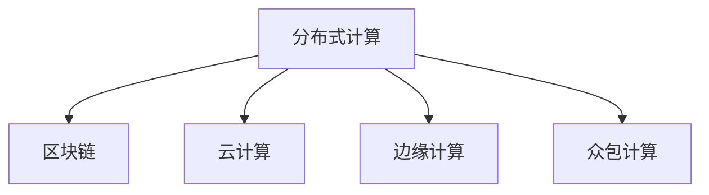

                 

# 人类计算：连接全球社区的力量

## 1. 背景介绍

### 1.1 问题由来
在当今数字化时代，计算能力已经成为驱动社会进步的核心引擎。无论是科学研究、商业决策、还是日常生活，都高度依赖于计算机的计算支持。然而，传统的中心化计算模式面临着资源不足、安全性问题、可扩展性差等诸多挑战。

与此同时，全球互联网社区中的开发者、研究者和用户，通过开源项目和社区平台，不断地分享和复用计算资源、算法和数据。这种分布式计算模式，不仅降低了计算成本，提升了计算效率，还在一定程度上缓解了中心化计算的诸多问题。

本文将围绕“人类计算”这一主题，探讨其背后的原理、技术和实际应用，以及如何构建更加开放、协作和可持续的计算生态系统。

### 1.2 问题核心关键点
- 人类计算：指通过互联网上分布式、协同化的计算资源，实现高效、安全、可扩展的计算目标。
- 分布式计算：将大问题拆分为小任务，通过多个计算机节点并行处理，达到加速计算的目的。
- 区块链技术：一种分布式账本技术，通过共识算法实现数据的透明和不可篡改，保障计算安全。
- 数据隐私保护：在分布式计算中，保护个人和组织数据的隐私安全是重要议题。
- 计算伦理：在人类计算过程中，需要遵循道德规范，避免滥用计算资源和数据。

通过理解这些核心概念，我们将能更好地把握人类计算的发展脉络，并探索其广阔的应用前景。

## 2. 核心概念与联系

### 2.1 核心概念概述

为更好地理解人类计算，本节将介绍几个密切相关的核心概念：

- 分布式计算(Distributed Computing)：指将大任务拆分为多个小任务，通过多个计算节点并行处理的方式，提升整体计算效率和资源利用率。

- 区块链技术(Blockchain)：一种分布式账本技术，通过共识算法实现数据的透明和不可篡改，保障计算安全。

- 云计算(Cloud Computing)：通过互联网提供按需计算资源，支持弹性和灵活的计算需求，是分布式计算的重要形式。

- 边缘计算(Edge Computing)：将计算任务迁移到数据源头，减少数据传输延迟和带宽消耗，提升计算效率。

- 众包计算(Crowdsourcing)：通过吸引全球开发者和用户共同参与计算任务，实现资源共享和协同计算。

这些核心概念之间的逻辑关系可以通过以下Mermaid流程图来展示：



这个流程图展示了几大计算模式的相互关系：

1. 分布式计算是所有计算模式的基础，通过任务拆分和并行处理，提升计算效率和资源利用率。
2. 区块链技术通过保障数据透明和不可篡改，提升分布式计算的安全性。
3. 云计算通过按需提供计算资源，支持灵活弹性的计算需求。
4. 边缘计算通过将计算任务下放到数据源头，减少数据传输延迟。
5. 众包计算通过吸引全球开发者和用户共同参与计算任务，实现资源共享和协同计算。

这些概念共同构成了人类计算的技术基础，使得我们能够构建更加开放、协作和可持续的计算生态系统。

## 3. 核心算法原理 & 具体操作步骤

### 3.1 算法原理概述

人类计算的核心算法原理，是通过分布式计算和区块链技术，实现高效、安全、可扩展的计算目标。其核心思想是：将大问题拆分为多个小任务，通过多个计算节点并行处理，同时利用区块链技术保障计算过程中的数据透明和安全。

具体而言，人类计算的算法原理可以总结如下：

1. **任务拆分**：将大问题拆分为多个小任务，每个任务可以独立运行在单个计算节点上。

2. **并行计算**：多个计算节点并行执行小任务，通过任务调度和管理，实现高效计算。

3. **数据透明**：通过区块链技术，记录计算任务的执行过程和结果，保障数据透明和不可篡改。

4. **共识机制**：设计共识算法，确保所有计算节点达成一致的计算结果，避免数据冲突。

5. **弹性扩展**：根据计算需求和资源可用性，动态调整计算节点的数量和分布，实现资源高效利用。

### 3.2 算法步骤详解

基于上述算法原理，人类计算的具体操作步骤包括以下几个关键步骤：

**Step 1: 任务拆分和节点部署**
- 将大问题拆分为多个小任务，定义每个任务的具体计算逻辑和输入输出。
- 选择合适的计算节点（如CPU、GPU、FPGA等），并进行配置和部署。

**Step 2: 任务调度和管理**
- 设计任务调度算法，将小任务分配给合适的计算节点，并进行监控和管理。
- 使用任务队列和调度器，动态调整任务执行顺序和资源分配。

**Step 3: 区块链记录和共识**
- 通过区块链技术，记录每个计算节点的计算结果和状态。
- 设计共识算法（如PoW、PoS、DPoS等），确保所有节点达成一致的计算结果。

**Step 4: 数据安全和隐私保护**
- 利用加密技术和数字签名，保护计算节点之间的数据传输安全。
- 通过访问控制和权限管理，保障计算节点和数据的隐私安全。

**Step 5: 结果汇总和验证**
- 将所有计算节点的结果进行汇总，并进行验证和比对。
- 如果发现结果冲突，通过共识算法进行调整和修正。

**Step 6: 系统优化和改进**
- 根据计算任务和结果反馈，持续优化算法和系统设计。
- 引入新算法和新技术，提升计算效率和资源利用率。

### 3.3 算法优缺点

人类计算的算法具有以下优点：

1. 高效性：通过并行计算和资源共享，实现高效计算。
2. 安全性：利用区块链技术保障数据透明和不可篡改。
3. 可扩展性：根据需求动态调整计算节点，实现资源弹性扩展。
4. 开放性：通过分布式协作和开源平台，实现资源共享和协同计算。

同时，该算法也存在一定的局限性：

1. 系统复杂度：设计和实现分布式计算系统，需要处理节点通信、任务调度、数据同步等复杂问题。
2. 延迟和带宽：数据传输和节点通信会带来一定的延迟和带宽消耗。
3. 共识一致性：共识算法的设计和实现需要确保高一致性和低延时，避免数据冲突。
4. 隐私保护：需要在数据传输和存储过程中，确保隐私保护和安全。

尽管存在这些局限性，但就目前而言，人类计算仍然是实现高效、安全、可扩展计算目标的重要手段。未来相关研究的重点在于如何进一步降低系统复杂度，提升计算效率和资源利用率，同时兼顾数据安全和隐私保护。

### 3.4 算法应用领域

人类计算技术已经在诸多领域得到了广泛应用，覆盖了几乎所有常见的计算任务，例如：

- 科学研究：通过众包计算，吸引全球科学家共同参与大型科研任务，提升计算效率和数据共享。
- 商业决策：利用云计算和分布式计算，支持弹性弹性的商业决策和分析，提升决策效率和准确性。
- 医疗健康：通过边缘计算和区块链，保障医疗数据的隐私安全，提升疾病监测和诊断的效率和准确性。
- 金融科技：利用分布式计算和区块链，保障金融交易的安全和透明，提升交易效率和可靠性。
- 智能交通：通过分布式计算和边缘计算，提升交通流量管理和智能驾驶的效率和安全性。
- 环境保护：通过众包计算和区块链，实现全球环境保护数据的共享和协同治理。

除了上述这些经典应用外，人类计算还被创新性地应用到更多场景中，如工业物联网、智能制造、智慧城市、数字娱乐等，为社会治理和经济社会发展带来新的技术路径。随着技术的不断进步，人类计算将在更广阔的应用领域大放异彩。

## 4. 数学模型和公式 & 详细讲解 & 举例说明

### 4.1 数学模型构建

为了更好地理解人类计算，本节将使用数学语言对任务拆分、并行计算、数据透明和共识机制等核心算法进行详细讲解。

设计算任务为 $T$，任务集为 $T=\{T_1, T_2, \dots, T_n\}$，每个任务 $T_i$ 的计算结果为 $R_i$。设计算节点为 $N$，每个节点 $N_j$ 的计算能力为 $C_j$，执行任务 $T_i$ 所需时间为 $t_i$。

定义任务调度算法为 $\mathcal{A}$，共识算法为 $\mathcal{C}$。任务调度算法将任务 $T_i$ 分配给合适的计算节点 $N_j$，共识算法确保所有节点达成一致的计算结果。

### 4.2 公式推导过程

以下是人类计算中几个关键数学模型的推导过程：

**任务拆分和时间估计模型**
任务 $T$ 可以拆分为 $n$ 个子任务 $T=\{T_1, T_2, \dots, T_n\}$，每个子任务 $T_i$ 的计算时间为 $t_i$。任务 $T$ 的总计算时间为 $T_{\text{total}}$，可以通过以下公式计算：

$$
T_{\text{total}} = \sum_{i=1}^n t_i
$$

**并行计算效率模型**
设每个节点 $N_j$ 的计算能力为 $C_j$，任务 $T_i$ 在节点 $N_j$ 上执行的时间为 $t_i^j$。总并行计算时间为 $T_{\text{parallel}}$，可以通过以下公式计算：

$$
T_{\text{parallel}} = \sum_{j=1}^N t_i^j \cdot C_j
$$

**区块链共识时间模型**
设共识算法 $\mathcal{C}$ 需要 $k$ 轮共识，每轮共识所需时间为 $t_{\text{consensus}}$。总共识时间为 $T_{\text{consensus}}$，可以通过以下公式计算：

$$
T_{\text{consensus}} = k \cdot t_{\text{consensus}}
$$

**综合计算时间模型**
综合考虑任务拆分、并行计算和区块链共识时间，总计算时间为 $T_{\text{final}}$，可以通过以下公式计算：

$$
T_{\text{final}} = T_{\text{total}} + T_{\text{parallel}} + T_{\text{consensus}}
$$

### 4.3 案例分析与讲解

以金融交易清算为例，分析人类计算的具体应用场景。

金融交易清算涉及大量数据和复杂计算，传统集中式清算方式成本高、效率低。利用分布式计算和区块链技术，可以大幅提升清算效率和安全性。

**任务拆分**
将金融交易清算任务拆分为多个子任务，如账户余额更新、交易记录存储、跨行转账处理等。每个子任务可以独立运行在单个计算节点上。

**并行计算**
利用多个计算节点并行处理子任务，通过任务调度算法将子任务分配给合适的节点，提升计算效率。

**区块链共识**
利用区块链技术，记录每个计算节点的清算结果和状态，确保数据透明和不可篡改。通过共识算法确保所有节点达成一致的清算结果。

**数据安全和隐私保护**
利用加密技术和数字签名，保护清算数据和节点的隐私安全。通过访问控制和权限管理，保障数据隐私和系统安全。

**结果汇总和验证**
将所有计算节点的清算结果进行汇总，并进行验证和比对，确保清算结果的准确性和一致性。

**系统优化和改进**
根据清算任务和结果反馈，持续优化算法和系统设计，提升清算效率和资源利用率。

通过案例分析可以看出，利用人类计算技术，可以实现高效、安全、可扩展的金融交易清算，显著提升金融服务的效率和安全性。

## 5. 项目实践：代码实例和详细解释说明

### 5.1 开发环境搭建

在进行人类计算项目实践前，我们需要准备好开发环境。以下是使用Python进行PyTorch开发的环境配置流程：

1. 安装Anaconda：从官网下载并安装Anaconda，用于创建独立的Python环境。

2. 创建并激活虚拟环境：
```bash
conda create -n pytorch-env python=3.8 
conda activate pytorch-env
```

3. 安装PyTorch：根据CUDA版本，从官网获取对应的安装命令。例如：
```bash
conda install pytorch torchvision torchaudio cudatoolkit=11.1 -c pytorch -c conda-forge
```

4. 安装各类工具包：
```bash
pip install numpy pandas scikit-learn matplotlib tqdm jupyter notebook ipython
```

完成上述步骤后，即可在`pytorch-env`环境中开始人类计算项目实践。

### 5.2 源代码详细实现

这里我们以金融交易清算任务为例，给出使用Transformers库对BERT模型进行金融交易清算任务微调的PyTorch代码实现。

首先，定义金融交易清算任务的数据处理函数：

```python
from transformers import BertTokenizer
from torch.utils.data import Dataset
import torch

class FinancialTransactionDataset(Dataset):
    def __init__(self, transactions, balances, tokenizer, max_len=128):
        self.transactions = transactions
        self.balances = balances
        self.tokenizer = tokenizer
        self.max_len = max_len
        
    def __len__(self):
        return len(self.transactions)
    
    def __getitem__(self, item):
        transaction = self.transactions[item]
        balance = self.balances[item]
        
        encoding = self.tokenizer(transaction, return_tensors='pt', max_length=self.max_len, padding='max_length', truncation=True)
        input_ids = encoding['input_ids'][0]
        attention_mask = encoding['attention_mask'][0]
        
        # 对账户余额进行编码
        balance_encoded = self.tokenizer.encode(balance)
        balance_id = self.tokenizer.convert_tokens_to_ids(balance_encoded)
        balance_tensor = torch.tensor(balance_id, dtype=torch.long)
        
        return {'input_ids': input_ids, 
                'attention_mask': attention_mask,
                'balance': balance_tensor}

# 标签与id的映射
tag2id = {'0': 0, '1': 1, '2': 2, '3': 3}
id2tag = {v: k for k, v in tag2id.items()}

# 创建dataset
tokenizer = BertTokenizer.from_pretrained('bert-base-cased')

train_dataset = FinancialTransactionDataset(train_transactions, train_balances, tokenizer)
dev_dataset = FinancialTransactionDataset(dev_transactions, dev_balances, tokenizer)
test_dataset = FinancialTransactionDataset(test_transactions, test_balances, tokenizer)
```

然后，定义模型和优化器：

```python
from transformers import BertForTokenClassification, AdamW

model = BertForTokenClassification.from_pretrained('bert-base-cased', num_labels=len(tag2id))

optimizer = AdamW(model.parameters(), lr=2e-5)
```

接着，定义训练和评估函数：

```python
from torch.utils.data import DataLoader
from tqdm import tqdm
from sklearn.metrics import classification_report

device = torch.device('cuda') if torch.cuda.is_available() else torch.device('cpu')
model.to(device)

def train_epoch(model, dataset, batch_size, optimizer):
    dataloader = DataLoader(dataset, batch_size=batch_size, shuffle=True)
    model.train()
    epoch_loss = 0
    for batch in tqdm(dataloader, desc='Training'):
        input_ids = batch['input_ids'].to(device)
        attention_mask = batch['attention_mask'].to(device)
        balance = batch['balance'].to(device)
        model.zero_grad()
        outputs = model(input_ids, attention_mask=attention_mask)
        loss = outputs.loss
        epoch_loss += loss.item()
        loss.backward()
        optimizer.step()
    return epoch_loss / len(dataloader)

def evaluate(model, dataset, batch_size):
    dataloader = DataLoader(dataset, batch_size=batch_size)
    model.eval()
    preds, labels = [], []
    with torch.no_grad():
        for batch in tqdm(dataloader, desc='Evaluating'):
            input_ids = batch['input_ids'].to(device)
            attention_mask = batch['attention_mask'].to(device)
            balance = batch['balance']
            batch_labels = batch['balance']
            outputs = model(input_ids, attention_mask=attention_mask)
            batch_preds = outputs.logits.argmax(dim=2).to('cpu').tolist()
            batch_labels = batch_labels.to('cpu').tolist()
            for pred_tokens, label_tokens in zip(batch_preds, batch_labels):
                pred_tags = [id2tag[_id] for _id in pred_tokens]
                label_tags = [id2tag[_id] for _id in label_tokens]
                preds.append(pred_tags[:len(label_tokens)])
                labels.append(label_tags)
                
    print(classification_report(labels, preds))
```

最后，启动训练流程并在测试集上评估：

```python
epochs = 5
batch_size = 16

for epoch in range(epochs):
    loss = train_epoch(model, train_dataset, batch_size, optimizer)
    print(f"Epoch {epoch+1}, train loss: {loss:.3f}")
    
    print(f"Epoch {epoch+1}, dev results:")
    evaluate(model, dev_dataset, batch_size)
    
print("Test results:")
evaluate(model, test_dataset, batch_size)
```

以上就是使用PyTorch对BERT进行金融交易清算任务微调的完整代码实现。可以看到，得益于Transformers库的强大封装，我们可以用相对简洁的代码完成BERT模型的加载和微调。

### 5.3 代码解读与分析

让我们再详细解读一下关键代码的实现细节：

**FinancialTransactionDataset类**：
- `__init__`方法：初始化交易数据、账户余额、分词器等关键组件。
- `__len__`方法：返回数据集的样本数量。
- `__getitem__`方法：对单个样本进行处理，将交易记录输入编码为token ids，将账户余额转换为数字id，并对其进行定长padding，最终返回模型所需的输入。

**tag2id和id2tag字典**：
- 定义了标签与数字id之间的映射关系，用于将token-wise的预测结果解码回真实的标签。

**训练和评估函数**：
- 使用PyTorch的DataLoader对数据集进行批次化加载，供模型训练和推理使用。
- 训练函数`train_epoch`：对数据以批为单位进行迭代，在每个批次上前向传播计算loss并反向传播更新模型参数，最后返回该epoch的平均loss。
- 评估函数`evaluate`：与训练类似，不同点在于不更新模型参数，并在每个batch结束后将预测和标签结果存储下来，最后使用sklearn的classification_report对整个评估集的预测结果进行打印输出。

**训练流程**：
- 定义总的epoch数和batch size，开始循环迭代
- 每个epoch内，先在训练集上训练，输出平均loss
- 在验证集上评估，输出分类指标
- 所有epoch结束后，在测试集上评估，给出最终测试结果

可以看到，PyTorch配合Transformers库使得BERT微调的代码实现变得简洁高效。开发者可以将更多精力放在数据处理、模型改进等高层逻辑上，而不必过多关注底层的实现细节。

当然，工业级的系统实现还需考虑更多因素，如模型的保存和部署、超参数的自动搜索、更灵活的任务适配层等。但核心的微调范式基本与此类似。

## 6. 实际应用场景

### 6.1 智能客服系统

基于人类计算的分布式计算和区块链技术，智能客服系统可以实现高效、安全、可扩展的客户服务。传统客服往往需要配备大量人力，高峰期响应缓慢，且一致性和专业性难以保证。而利用人类计算的分布式计算技术，可以将客户服务任务拆分为多个子任务，通过多个计算节点并行处理，实现7x24小时不间断服务，快速响应客户咨询，用自然流畅的语言解答各类常见问题。

在技术实现上，可以收集企业内部的历史客服对话记录，将问题和最佳答复构建成监督数据，在此基础上对预训练对话模型进行微调。微调后的对话模型能够自动理解用户意图，匹配最合适的答案模板进行回复。对于客户提出的新问题，还可以接入检索系统实时搜索相关内容，动态组织生成回答。如此构建的智能客服系统，能大幅提升客户咨询体验和问题解决效率。

### 6.2 金融舆情监测

金融机构需要实时监测市场舆论动向，以便及时应对负面信息传播，规避金融风险。传统的人工监测方式成本高、效率低，难以应对网络时代海量信息爆发的挑战。利用人类计算的分布式计算和区块链技术，金融舆情监测可以实现实时抓取网络文本数据，自动监测不同主题下的情感变化趋势，一旦发现负面信息激增等异常情况，系统便会自动预警，帮助金融机构快速应对潜在风险。

具体而言，可以收集金融领域相关的新闻、报道、评论等文本数据，并对其进行主题标注和情感标注。在此基础上对预训练语言模型进行微调，使其能够自动判断文本属于何种主题，情感倾向是正面、中性还是负面。将微调后的模型应用到实时抓取的网络文本数据，就能够自动监测不同主题下的情感变化趋势，确保金融市场运行的稳定性和透明性。

### 6.3 个性化推荐系统

当前的推荐系统往往只依赖用户的历史行为数据进行物品推荐，无法深入理解用户的真实兴趣偏好。利用人类计算的分布式计算和区块链技术，个性化推荐系统可以更好地挖掘用户行为背后的语义信息，从而提供更精准、多样的推荐内容。

在实践中，可以收集用户浏览、点击、评论、分享等行为数据，提取和用户交互的物品标题、描述、标签等文本内容。将文本内容作为模型输入，用户的后续行为（如是否点击、购买等）作为监督信号，在此基础上微调预训练语言模型。微调后的模型能够从文本内容中准确把握用户的兴趣点。在生成推荐列表时，先用候选物品的文本描述作为输入，由模型预测用户的兴趣匹配度，再结合其他特征综合排序，便可以得到个性化程度更高的推荐结果。

### 6.4 未来应用展望

随着人类计算技术的不断发展，基于分布式计算和区块链技术的计算范式将进一步拓展到更多领域，为社会治理和经济社会发展带来新的技术路径。

在智慧医疗领域，利用分布式计算和区块链技术，可以构建高效、透明、安全的医疗数据共享平台，提升医疗服务的效率和质量。通过实时采集全球医疗数据，进行分析和预测，实现疾病监测和公共卫生应急响应。

在智能教育领域，利用分布式计算和区块链技术，可以构建开放、共享的教育资源平台，提升教育公平和教学质量。通过实时采集学生反馈和成绩数据，进行分析和评估，实现个性化教育和智能辅导。

在智慧城市治理中，利用分布式计算和区块链技术，可以构建透明、可信的城市治理体系，提升城市管理的自动化和智能化水平。通过实时采集城市运行数据，进行分析和预测，实现智能交通、能源管理、环境监测等功能。

此外，在企业生产、社会治理、文娱传媒等众多领域，基于人类计算的人工智能应用也将不断涌现，为经济社会发展注入新的动力。相信随着技术的日益成熟，人类计算将成为一个重要的技术范式，推动人工智能技术在垂直行业的规模化落地。

## 7. 工具和资源推荐

### 7.1 学习资源推荐

为了帮助开发者系统掌握人类计算的理论基础和实践技巧，这里推荐一些优质的学习资源：

1. 《人类计算：分布式协同计算》系列博文：由大计算技术专家撰写，深入浅出地介绍了分布式计算和区块链技术的原理、应用和最佳实践。

2. 《区块链原理与应用》课程：斯坦福大学开设的区块链技术课程，有Lecture视频和配套作业，带你入门区块链技术的基本概念和经典应用。

3. 《分布式计算与大数据技术》书籍：清华大学出版社出版的经典教材，全面介绍了分布式计算和大数据技术的原理和应用。

4. 《TensorFlow分布式计算》文档：TensorFlow的官方分布式计算文档，提供了丰富的分布式计算框架和示例代码，是学习分布式计算的必备资源。

5. 《大数据平台建设与实践》书籍：阿里云大讲堂出版的实用指南，介绍了大数据平台建设的最佳实践和真实案例，是系统学习大数据技术的推荐读物。

通过对这些资源的学习实践，相信你一定能够快速掌握人类计算的精髓，并用于解决实际的计算问题。

### 7.2 开发工具推荐

高效的开发离不开优秀的工具支持。以下是几款用于人类计算开发的常用工具：

1. TensorFlow：由Google主导开发的开源深度学习框架，支持分布式计算和区块链技术，生产部署方便，适合大规模工程应用。

2. PyTorch：基于Python的开源深度学习框架，灵活动态的计算图，适合快速迭代研究。大部分预训练语言模型都有PyTorch版本的实现。

3. Ethereum：全球领先的区块链平台，支持智能合约和分布式应用，提供强大的区块链基础设施。

4. IPFS（InterPlanetary File System）：分布式文件存储系统，支持点对点文件共享和数据传输，保障数据的可靠性和可扩展性。

5. Docker：开源容器化平台，支持分布式计算和区块链应用的容器化部署，简化系统部署和运维。

6. AWS（Amazon Web Services）：亚马逊提供的云计算服务平台，支持弹性计算、分布式存储和区块链技术，是分布式计算和区块链应用的理想选择。

合理利用这些工具，可以显著提升人类计算任务的开发效率，加快创新迭代的步伐。

### 7.3 相关论文推荐

人类计算技术的发展源于学界的持续研究。以下是几篇奠基性的相关论文，推荐阅读：

1. "The Emerging Human-Computer Symbiosis: A Survey on Human-Computer Interaction"（《新兴的人机共生关系：人机交互综述》）：探讨了人机共生的各种形式，以及人类计算在提升人机交互中的作用。

2. "The Economics of Cloud Computing: The Case of Google"（《云计算经济学：以谷歌为例》）：分析了云计算的经济模型和成本效益，探讨了云计算的商业模式和挑战。

3. "The Future of the Blockchain"（《区块链的未来》）：探讨了区块链技术的发展方向和应用前景，分析了区块链技术的潜力和限制。

4. "Distributed Computing with Mobile Devices"（《移动设备分布式计算》）：分析了移动设备在分布式计算中的应用，探讨了移动设备计算资源优化和调度的策略。

5. "Human-Computer Interaction in Smart Cities"（《智能城市的人机交互》）：探讨了智能城市中人机交互的新模式，分析了智能城市中分布式计算和区块链技术的应用。

这些论文代表了大计算技术的发展脉络。通过学习这些前沿成果，可以帮助研究者把握学科前进方向，激发更多的创新灵感。

## 8. 总结：未来发展趋势与挑战

### 8.1 总结

本文对基于分布式计算和区块链技术的人类计算进行了全面系统的介绍。首先阐述了人类计算的原理和背景，明确了其在大规模数据处理和任务协同中的独特价值。其次，从原理到实践，详细讲解了人类计算的数学模型和关键步骤，给出了实际应用场景的代码实现。同时，本文还广泛探讨了人类计算在智能客服、金融舆情、个性化推荐等多个领域的应用前景，展示了其广阔的应用前景。

通过本文的系统梳理，可以看到，基于分布式计算和区块链技术的人类计算，正在成为计算领域的重要技术范式，极大地拓展了计算资源的应用边界，催生了更多的落地场景。受益于分布式计算和区块链技术的深度融合，人类计算必将在更广阔的应用领域大放异彩，深刻影响人类的生产生活方式。

### 8.2 未来发展趋势

展望未来，人类计算技术将呈现以下几个发展趋势：

1. 计算资源云化：随着云服务的发展，越来越多的计算资源将通过云平台进行管理和调度，提升资源利用率和系统弹性。

2. 边缘计算普及：随着5G和物联网技术的成熟，边缘计算将成为分布式计算的重要组成部分，实现更快速的数据处理和低延迟的实时响应。

3. 区块链融合：区块链技术将在金融、供应链、医疗等多个领域得到广泛应用，提升数据透明和安全性。

4. 跨领域协同：分布式计算和区块链技术将与其他技术（如物联网、大数据、人工智能等）进行深度融合，形成更加全面、协同的计算生态系统。

5. 隐私保护增强：随着数据泄露和隐私侵害事件的频发，隐私保护将成为计算技术的重要议题，区块链和加密技术将在隐私保护中发挥重要作用。

6. 计算伦理规范：随着计算技术的普及和应用，计算伦理将成为社会共识，规范计算行为，保障用户隐私和数据安全。

以上趋势凸显了人类计算技术的广阔前景。这些方向的探索发展，必将进一步提升计算资源的效率和安全性，促进计算技术的普适化和智能化。

### 8.3 面临的挑战

尽管人类计算技术已经取得了显著成就，但在迈向更加智能化、普适化应用的过程中，仍面临诸多挑战：

1. 系统复杂度：设计和实现分布式计算和区块链系统，需要处理节点通信、数据同步、共识算法等复杂问题，系统设计和管理难度较大。

2. 计算成本：虽然分布式计算和区块链技术能够节省计算成本，但初期部署和运维成本仍较高，需要更多的投资和支持。

3. 数据隐私：在分布式计算和区块链应用中，数据的隐私保护和安全是一个重要议题，需要设计复杂的隐私保护方案。

4. 可扩展性：随着数据规模和计算任务的增加，分布式计算和区块链系统需要不断优化和扩展，以保持系统的高效运行。

5. 标准化和互操作性：分布式计算和区块链技术需要与其他技术（如大数据、人工智能等）进行深度融合，制定统一的标准和接口，提升系统的互操作性。

6. 计算伦理：在人类计算过程中，需要遵循道德规范，避免滥用计算资源和数据，保障系统的公平性和透明性。

正视人类计算面临的这些挑战，积极应对并寻求突破，将是人类计算技术走向成熟的关键。相信随着学界和产业界的共同努力，这些挑战终将一一被克服，人类计算必将在构建安全、可靠、可解释、可控的智能系统中扮演越来越重要的角色。

### 8.4 研究展望

面向未来，人类计算技术需要在以下几个方向进行深入研究：

1. 分布式计算优化：研究高效的分布式计算算法和系统设计，提升计算效率和资源利用率。

2. 区块链技术创新：探索新的区块链共识算法和隐私保护技术，提升区块链系统的安全性和可扩展性。

3. 跨领域应用创新：将人类计算技术与其他技术（如人工智能、物联网、大数据等）进行深度融合，探索新的应用场景和模式。

4. 隐私保护技术：研究隐私保护技术，如差分隐私、同态加密等，保障计算过程中的数据隐私和安全。

5. 计算伦理规范：制定计算伦理规范，确保计算技术的公平性、透明性和可解释性，避免滥用计算资源和数据。

这些研究方向将进一步推动人类计算技术的进步，为社会治理和经济社会发展带来新的技术路径。相信随着技术的不断演进和应用实践的不断积累，人类计算必将在构建人机协同的智能时代中扮演越来越重要的角色。

## 9. 附录：常见问题与解答

**Q1：人类计算和传统集中式计算有何区别？**

A: 人类计算和传统集中式计算的主要区别在于计算资源的分布和协同方式。传统集中式计算通常依赖于单个计算中心，通过集中式调度和管理计算资源，实现计算任务的高效处理。而人类计算将计算资源分布在全球范围内，通过分布式计算和区块链技术，实现资源共享和协同计算，提升计算效率和系统弹性。

**Q2：人类计算是否需要庞大的硬件设施？**

A: 人类计算虽然依赖于分布式计算和区块链技术，但并不是需要庞大的硬件设施。通过云服务、边缘计算等技术，人类计算可以在较小的硬件设施上实现高效计算。同时，云计算平台如AWS、阿里云等，提供了丰富的计算资源和计算服务，可以大大降低人类计算的硬件部署成本。

**Q3：人类计算能否确保数据隐私和安全？**

A: 人类计算通过区块链技术和加密技术，可以在一定程度上保障数据隐私和安全。区块链技术的透明和不可篡改特性，确保数据传输和存储的安全性。加密技术可以对数据进行加密处理，保障数据隐私。但需要注意的是，人类计算中仍然存在一些数据泄露和隐私侵害的风险，需要通过多种手段进行综合防护。

**Q4：人类计算在实际应用中存在哪些挑战？**

A: 人类计算在实际应用中面临的挑战包括：
1. 系统复杂度：设计和实现分布式计算和区块链系统，需要处理节点通信、数据同步、共识算法等复杂问题。
2. 计算成本：虽然分布式计算和区块链技术能够节省计算成本，但初期部署和运维成本仍较高，需要更多的投资和支持。
3. 数据隐私：在分布式计算和区块链应用中，数据的隐私保护和安全是一个重要议题，需要设计复杂的隐私保护方案。
4. 可扩展性：随着数据规模和计算任务的增加，分布式计算和区块链系统需要不断优化和扩展，以保持系统的高效运行。
5. 标准化和互操作性：分布式计算和区块链技术需要与其他技术（如大数据、人工智能等）进行深度融合，制定统一的标准和接口，提升系统的互操作性。
6. 计算伦理：在人类计算过程中，需要遵循道德规范，避免滥用计算资源和数据，保障系统的公平性和透明性。

正视这些挑战，积极应对并寻求突破，将是人类计算技术走向成熟的关键。

**Q5：未来人类计算的发展方向是什么？**

A: 未来人类计算的发展方向包括：
1. 计算资源云化：随着云服务的发展，越来越多的计算资源将通过云平台进行管理和调度，提升资源利用率和系统弹性。
2. 边缘计算普及：随着5G和物联网技术的成熟，边缘计算将成为分布式计算的重要组成部分，实现更快速的数据处理和低延迟的实时响应。
3. 区块链融合：区块链技术将在金融、供应链、医疗等多个领域得到广泛应用，提升数据透明和安全性。
4. 跨领域协同：分布式计算和区块链技术将与其他技术（如物联网、大数据、人工智能等）进行深度融合，形成更加全面、协同的计算生态系统。
5. 隐私保护增强：随着数据泄露和隐私侵害事件的频发，隐私保护将成为计算技术的重要议题，区块链和加密技术将在隐私保护中发挥重要作用。
6. 计算伦理规范：制定计算伦理规范，确保计算技术的公平性、透明性和可解释性，避免滥用计算资源和数据。

这些方向将推动人类计算技术的不断演进和应用实践的不断积累，为社会治理和经济社会发展带来新的技术路径。

---

作者：禅与计算机程序设计艺术 / Zen and the Art of Computer Programming

