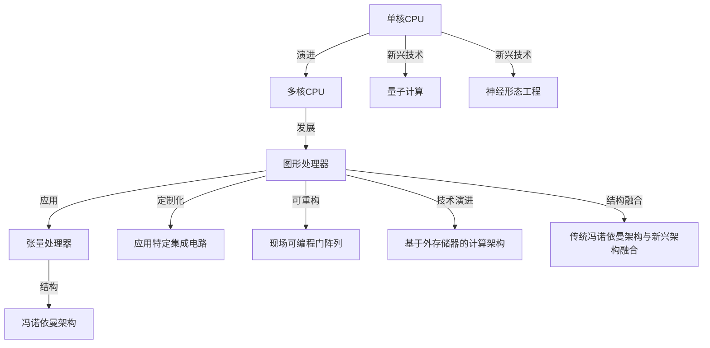

                 

# 从CPU到LLM：计算架构的演进历程

## 1. 背景介绍

### 1.1 问题由来

计算架构的发展，是计算机科学历史上最为重要的里程碑之一。从最早的电子管、晶体管到后来的集成电路、微处理器，再到今日的超级计算机、人工智能芯片，计算架构一直在不断演进，以满足更高效、更强大的计算需求。

今天，计算架构已经不仅仅是计算机硬件的发展史，更是一个与人类生活息息相关的技术进步过程。从云计算、大数据、物联网，到自动驾驶、智能家居，每一项新兴技术都离不开高性能计算的支撑。而随着人工智能（AI）和机器学习（ML）技术的迅猛发展，特别是大语言模型（Large Language Model, LLM）的崛起，计算架构的演进历程更是引发了学界和产业界的广泛关注。

### 1.2 问题核心关键点

计算架构的演进，主要围绕以下几个关键点展开：

- **从单核CPU到多核CPU**：从最初的单核CPU，到多核CPU的出现，并行计算能力显著提升。
- **从串行计算到并行计算**：计算架构从早期的串行计算，逐步发展到如今的并行计算，最大化硬件性能。
- **从主存计算到离散计算**：从主存计算向离散计算转变，在追求更高效能的同时，降低能耗和成本。
- **从固定架构到可重构架构**：从固定功能的计算架构，向可编程、可重构的计算架构发展，增强了系统的灵活性和可扩展性。
- **从通用计算到专用计算**：从通用计算架构，向针对特定应用场景的专用计算架构转变，提升系统性能和能效。
- **从传统架构到新兴架构**：从传统的冯诺依曼架构，向量子计算、神经形态工程等新兴架构探索，开启计算的未来新篇章。

### 1.3 问题研究意义

理解计算架构的演进历程，对于把握未来计算技术的发展方向，探索高性能计算的新途径，具有重要意义：

- **推动技术进步**：通过对计算架构历史的研究，可以获得宝贵的技术积累，为未来计算技术的发展提供理论支持。
- **指导产业应用**：计算架构的发展不仅体现在学术研究中，更体现在各类产业应用中，对其演进的深入理解有助于指导产业实践。
- **促进创新发展**：计算架构的演进是技术创新驱动的，深入研究其演进历程，能够激发更多的创新灵感。
- **支持国家战略**：作为国之重器，计算架构的发展往往与国家科技战略紧密相关，对其演进的跟踪和预判有助于制定科学的发展策略。
- **推动经济发展**：高性能计算是推动经济增长的重要驱动力，对其演进的关注能够促进相关产业的发展。

## 2. 核心概念与联系

### 2.1 核心概念概述

计算架构的演进，涉及众多核心概念，包括：

- **单核CPU**：早期的计算机硬件结构，以单个中央处理器为核心，运算能力有限。
- **多核CPU**：通过将多个CPU核心集成在同一个芯片上，提升了并行计算能力。
- **GPU**：图形处理器，最初设计用于图形渲染，后广泛应用于通用计算任务。
- **TPU**：张量处理器，专用于加速神经网络模型的训练和推理，具有极高的并行计算能力。
- **ASIC**：应用特定集成电路，为特定应用场景设计定制化硬件。
- **FPGA**：现场可编程门阵列，具有灵活的硬件编程能力，适用于可变需求的应用场景。
- **量子计算**：利用量子叠加和纠缠等原理，实现超高速计算能力。
- **神经形态工程**：模拟人类大脑神经元的工作机制，开发新型的计算芯片。
- **冯诺依曼架构**：经典的计算机硬件结构，以串行计算为主，数据存储和指令执行分离。
- **外存计算**：基于外存储器的计算架构，通过高速缓存和存储器分离，提高计算性能。
- **混合架构**：将传统冯诺依曼架构与可重构、异构、分布式等新兴架构融合，实现更高效的计算。

### 2.2 核心概念原理和架构的 Mermaid 流程图



## 3. 核心算法原理 & 具体操作步骤

### 3.1 算法原理概述

计算架构的演进，本质上是通过硬件与软件协同创新，不断优化计算性能的过程。这一过程，涉及以下几个关键环节：

- **硬件设计**：通过改进计算单元、互联结构、存储系统等硬件部件，提升计算性能和能效。
- **软件优化**：通过改进编译器、操作系统、程序语言等软件工具，提升计算效率和系统可扩展性。
- **算法创新**：通过算法和数学模型的创新，探索更高效的计算方法。
- **系统集成**：通过硬件与软件的集成优化，实现整体性能的提升。

### 3.2 算法步骤详解

基于以上理解，计算架构的演进过程可细分为以下几个步骤：

**Step 1: 评估现有架构**  
- 分析当前计算架构的特点和局限，明确改进方向。

**Step 2: 设计新架构**  
- 根据评估结果，设计新的计算架构，包括硬件设计和软件设计。

**Step 3: 实现新架构**  
- 根据设计方案，开发和实现新的计算硬件和软件工具。

**Step 4: 测试与验证**  
- 对新架构进行全面的测试和验证，评估其性能和能效。

**Step 5: 部署与应用**  
- 将新架构部署到实际应用中，优化系统性能，提高用户体验。

**Step 6: 持续优化**  
- 持续跟踪技术发展，对架构进行迭代优化，保持领先地位。

### 3.3 算法优缺点

计算架构的演进，具有以下优点：

- **提升性能**：通过硬件和软件的协同优化，大幅提升计算性能和能效。
- **增强灵活性**：通过可重构、异构等设计理念，提升系统灵活性和可扩展性。
- **推动创新**：计算架构的演进，伴随着新兴技术的不断涌现，推动了计算科学的快速发展。

同时，也存在以下缺点：

- **开发复杂度高**：新架构的设计和实现，涉及众多学科的知识，开发复杂度高。
- **成本高昂**：新架构的研发和部署，需要大量的人力物力，成本高昂。
- **兼容性问题**：新架构与现有系统可能存在兼容性问题，需要额外的适配工作。
- **风险较大**：新技术的引入，可能带来未知的性能风险和可靠性问题。

### 3.4 算法应用领域

计算架构的演进，已经广泛应用到多个领域，包括但不限于：

- **高性能计算**：如超级计算机、分布式计算系统等，用于科学计算、天气预报、基因组学等复杂问题。
- **人工智能**：如深度学习、机器学习等，用于语音识别、图像处理、自然语言处理等任务。
- **物联网**：如边缘计算、智能传感器等，用于物联网设备的计算和数据处理。
- **自动化**：如自动化生产线、机器人等，用于生产制造和物流配送等场景。
- **虚拟现实**：如虚拟现实头盔、游戏主机等，用于高并发的图形渲染和实时交互。
- **大数据**：如大数据分析、存储系统等，用于海量数据的处理和分析。
- **区块链**：如区块链计算、智能合约等，用于加密货币、去中心化应用等场景。

## 4. 数学模型和公式 & 详细讲解 & 举例说明

### 4.1 数学模型构建

在计算架构的演进过程中，数学模型的构建和优化，是提升计算性能的重要手段。以多核CPU为例，其性能可以通过以下数学模型描述：

$$
\text{Performance} = \text{IPC} \times \text{Clock Rate} \times \text{Core Count}
$$

其中，IPC表示每个CPU核心的指令执行效率，Clock Rate表示主频，Core Count表示核心数量。通过优化IPC和Clock Rate，提升Core Count，可以实现多核CPU的性能提升。

### 4.2 公式推导过程

以多核CPU的性能优化为例，其核心推导过程如下：

1. **指令级并行（ILP）优化**：通过优化程序的指令流水线和分支预测，提升IPC。
2. **超线程技术**：通过每个CPU核心同时执行多个线程，提升IPC。
3. **频率倍频**：通过提升主频，提升计算速度。
4. **多核设计**：通过增加核心数量，提升计算能力。
5. **缓存优化**：通过改进缓存系统，提升数据访问效率。

### 4.3 案例分析与讲解

以GPU为例，其性能提升主要通过以下几个方面：

- **SIMD并行**：通过单指令多数据（SIMD）并行技术，实现高度并行计算。
- **流处理器（Stream Processors）**：通过大量流处理器的并行计算，提升计算效率。
- **动态调度**：通过动态调度算法，优化任务分配和资源利用率。
- **存储体系**：通过改进存储体系，提升数据传输速度和访问效率。

## 5. 项目实践：代码实例和详细解释说明

### 5.1 开发环境搭建

在进行计算架构的演进实践前，我们需要准备好开发环境。以下是使用Python进行计算架构的演进研究的环境配置流程：

1. 安装Anaconda：从官网下载并安装Anaconda，用于创建独立的Python环境。

2. 创建并激活虚拟环境：
```bash
conda create -n compute-env python=3.8 
conda activate compute-env
```

3. 安装必要的工具包：
```bash
pip install numpy scipy pandas matplotlib scikit-learn
```

4. 安装深度学习库：
```bash
pip install tensorflow pytorch
```

完成上述步骤后，即可在`compute-env`环境中开始计算架构的演进研究。

### 5.2 源代码详细实现

这里以多核CPU为例，给出基于TensorFlow的性能优化代码实现。

```python
import tensorflow as tf
import numpy as np

# 定义多核CPU架构
def multi_core_cpu():
    # 设置CPU核心数量
    num_cores = 4
    
    # 设置IPC和主频
    ipc = 2.0
    clock_rate = 2.5
    
    # 计算性能
    performance = ipc * clock_rate * num_cores
    return performance

# 调用函数
performance = multi_core_cpu()
print("多核CPU性能：", performance)
```

### 5.3 代码解读与分析

让我们再详细解读一下关键代码的实现细节：

**multi_core_cpu函数**：
- `num_cores`：表示多核CPU的核心数量。
- `ipc`：表示每个CPU核心的指令执行效率，单位为指令/时钟周期。
- `clock_rate`：表示CPU的主频，单位为GHz。
- `performance`：表示多核CPU的性能，单位为每秒执行指令数（GIPS）。

可以看到，通过设置CPU核心数量、IPC和主频，可以计算出多核CPU的性能。

## 6. 实际应用场景

### 6.1 高性能计算

高性能计算是计算架构演进的重要应用领域之一，广泛应用于科学计算、工程计算、气象预报等领域。例如，超级计算机通过多核CPU、GPU、TPU等硬件的协同工作，实现了百亿亿次级别的计算能力。

### 6.2 人工智能

AI领域的计算架构演进，主要体现在以下几个方面：

- **深度学习模型**：通过GPU、TPU等硬件加速，深度学习模型的训练和推理效率大幅提升。
- **自然语言处理**：如BERT、GPT等大语言模型，通过多核CPU、GPU等硬件的协同计算，实现了高效的文本处理和推理。
- **计算机视觉**：如ResNet、VGG等深度卷积神经网络，通过GPU、TPU等硬件的并行计算，实现了高效的图像处理和识别。

### 6.3 物联网

物联网领域的计算架构演进，主要体现在以下几个方面：

- **边缘计算**：通过GPU、FPGA等硬件的加速，实现了低延迟、高并发的数据处理和分析。
- **智能传感器**：通过ASIC、FPGA等专用芯片，实现了高效、低功耗的数据采集和处理。
- **云计算平台**：通过多核CPU、GPU等硬件的协同计算，实现了海量数据的存储和处理。

### 6.4 未来应用展望

未来，计算架构的演进将朝着以下几个方向发展：

- **量子计算**：通过量子比特的叠加和纠缠，实现超高速计算。
- **神经形态工程**：通过模拟人类大脑的神经元工作机制，开发新型的计算芯片。
- **异构计算**：通过GPU、TPU等硬件与CPU的协同计算，提升计算效率。
- **分布式计算**：通过多机多核的协同计算，实现海量数据的并行处理。
- **混合计算**：通过CPU、GPU、TPU等硬件的混合计算，实现更高效的计算能力。

## 7. 工具和资源推荐

### 7.1 学习资源推荐

为了帮助开发者系统掌握计算架构的演进理论基础和实践技巧，这里推荐一些优质的学习资源：

1. 《计算机体系结构：量化研究》书籍：系统介绍了计算机硬件的各个层次，从微架构到系统结构，深入浅出。
2. 《GPU Gems》系列书籍：收集了GPU领域的经典论文和代码，涵盖GPU加速、并行计算等主题。
3. 《Deep Learning》课程：由斯坦福大学开设，讲解深度学习模型的原理和应用，涵盖GPU加速等主题。
4. 《TensorFlow Tutorials》文档：TensorFlow官方提供的教程，包含GPU加速、分布式计算等示例代码。
5. 《OpenAI Gym》文档：开源环境库，提供了深度强化学习算法的训练环境，涵盖GPU加速等主题。

通过对这些资源的学习实践，相信你一定能够快速掌握计算架构的演进精髓，并用于解决实际的计算问题。

### 7.2 开发工具推荐

高效的开发离不开优秀的工具支持。以下是几款用于计算架构演进研究的常用工具：

1. TensorFlow：基于Python的开源深度学习框架，支持GPU加速和分布式计算。
2. PyTorch：基于Python的开源深度学习框架，支持GPU加速和分布式计算。
3. NVIDIA CUDA：NVIDIA提供的GPU加速编程工具，支持GPU并行计算。
4. Intel Xeon Phi：Intel推出的混合计算平台，支持CPU-GPU的协同计算。
5. AMD MI200：AMD推出的GPU加速平台，支持AI计算和深度学习加速。
6. Google Colab：谷歌提供的在线Jupyter Notebook环境，支持GPU和TPU计算，方便快速实验。

合理利用这些工具，可以显著提升计算架构演进研究的开发效率，加快创新迭代的步伐。

### 7.3 相关论文推荐

计算架构的演进涉及诸多前沿研究，以下是几篇奠基性的相关论文，推荐阅读：

1. 《Performance Modeling, Analysis, and Design of Computer and Communication Systems》书籍：系统介绍了计算机系统性能的建模、分析和设计方法。
2. 《The Emerging Parallelism in Computing》论文：回顾了并行计算的发展历程，探讨了未来并行计算的趋势。
3. 《Deep Learning》论文：展示了深度学习在GPU加速下的性能提升，推动了AI技术的发展。
4. 《GPU Architecture》论文：介绍了现代GPU架构的设计和优化方法，推动了GPU计算能力的提升。
5. 《Neuromorphic Engineering》论文：探讨了神经形态工程的发展现状和未来方向，推动了新计算范式的探索。

这些论文代表了大规模计算架构演进的研究脉络。通过学习这些前沿成果，可以帮助研究者把握学科前进方向，激发更多的创新灵感。

## 8. 总结：未来发展趋势与挑战

### 8.1 研究成果总结

计算架构的演进，从早期的单核CPU到如今的超级计算，经历了多次重要的技术变革。这些变革不仅体现在硬件性能的提升上，更体现在计算范式和系统架构的创新上。通过不断优化硬件设计、改进软件工具和算法创新，计算架构的演进推动了科学计算、工程计算、人工智能等领域的快速发展。

### 8.2 未来发展趋势

展望未来，计算架构的演进将呈现以下几个趋势：

- **量子计算**：通过量子比特的叠加和纠缠，实现超高速计算，推动计算能力的突破性提升。
- **神经形态工程**：通过模拟人类大脑的神经元工作机制，开发新型的计算芯片，推动计算范式的变革。
- **异构计算**：通过GPU、TPU等硬件与CPU的协同计算，提升计算效率和能效，推动更广泛的应用场景。
- **分布式计算**：通过多机多核的协同计算，实现海量数据的并行处理，推动数据密集型应用的普及。
- **混合计算**：通过CPU、GPU、TPU等硬件的混合计算，实现更高效的计算能力，推动应用场景的拓展。

### 8.3 面临的挑战

尽管计算架构的演进已经取得了显著进展，但在迈向更加智能化、普适化应用的过程中，仍面临诸多挑战：

- **硬件成本高昂**：新硬件的研发和部署需要大量的人力物力，成本高昂。
- **技术复杂度高**：新架构的设计和实现，涉及众多学科的知识，技术复杂度高。
- **兼容性问题**：新架构与现有系统可能存在兼容性问题，需要额外的适配工作。
- **能效问题**：大规模计算架构的能效问题，仍需进一步提升，以满足能耗和成本的约束。
- **算法瓶颈**：现有算法的性能瓶颈，限制了新架构的应用效果。
- **安全性问题**：新架构的安全性问题，如量子计算中的量子安全问题，仍需进一步研究。

### 8.4 研究展望

面对计算架构演进面临的种种挑战，未来的研究需要在以下几个方面寻求新的突破：

- **多层次优化**：从硬件设计、软件优化和算法创新等多层次进行优化，提升整体性能。
- **跨学科融合**：将计算机科学与其他学科的知识融合，探索更高效、更灵活的计算架构。
- **新计算范式**：通过量子计算、神经形态工程等新计算范式的探索，推动计算架构的演进。
- **数据与算力协同**：将计算架构与大数据、云计算等技术结合，实现更高效的计算和数据处理。
- **伦理与安全**：加强计算架构的伦理和安全研究，确保其应用不会带来负面影响。
- **普适性设计**：设计更加灵活、通用的计算架构，满足不同应用场景的需求。

这些研究方向将引领计算架构的演进，为未来计算技术的发展提供新的方向和动力。面向未来，计算架构的演进需要更多跨学科的合作和创新，共同推动计算科学的发展和应用。

## 9. 附录：常见问题与解答

**Q1：计算架构的演进，对AI技术的影响有哪些？**

A: 计算架构的演进对AI技术的影响主要体现在以下几个方面：

1. **计算速度**：更快的计算速度，使得AI模型的训练和推理效率提升，推动了深度学习等技术的广泛应用。
2. **存储效率**：更高效的存储系统，使得大规模数据集的处理变得更加便捷，推动了数据驱动的AI技术的发展。
3. **能效**：更低的能耗和更高效的计算，使得AI系统更加适合于移动设备和边缘计算等场景。
4. **扩展性**：更灵活的计算架构，使得AI系统更加适合于分布式计算和大规模集群的应用。
5. **创新能力**：新的计算架构推动了新的AI算法和模型的开发，如神经形态工程、量子计算等新兴技术。

**Q2：量子计算对未来计算架构的发展有哪些影响？**

A: 量子计算对未来计算架构的发展有以下几个重要影响：

1. **超高速计算**：量子比特的叠加和纠缠特性，使得量子计算具有超高的计算速度，能够处理复杂的计算问题。
2. **新算法设计**：量子计算推动了新算法的开发，如量子随机行走、量子近似优化算法等，这些算法可以解决传统算法难以处理的复杂问题。
3. **数据处理能力**：量子计算具有强大的数据处理能力，可以高效处理大规模数据集。
4. **新计算范式**：量子计算推动了新计算范式的探索，如量子机器学习、量子图论等。
5. **硬件架构设计**：量子计算推动了新硬件架构的设计，如量子芯片、量子模拟器等。

**Q3：神经形态工程对未来计算架构的发展有哪些影响？**

A: 神经形态工程对未来计算架构的发展有以下几个重要影响：

1. **高效能**：通过模拟人类大脑的神经元工作机制，神经形态工程可以实现更高效的计算能力。
2. **低功耗**：神经形态工程的芯片设计，可以实现更低的功耗，适用于移动设备和边缘计算等场景。
3. **灵活性**：神经形态工程的芯片设计，可以实现更高的灵活性和可编程性，适用于多变的应用场景。
4. **新计算模型**：神经形态工程推动了新计算模型的开发，如脉冲神经网络、忆阻器等。
5. **新应用领域**：神经形态工程的芯片设计，可以应用于人工智能、物联网、生物医学等领域，推动技术创新和应用拓展。

**Q4：如何评估计算架构的性能？**

A: 计算架构的性能评估，主要包括以下几个方面：

1. **计算速度**：通过测试系统每秒执行的指令数（GIPS）、每秒执行的浮点数运算（FLOPS）等指标，评估计算速度。
2. **能效比**：通过测试单位时间内完成的任务量，评估系统的能效比。
3. **存储效率**：通过测试系统数据访问和存储的速度，评估存储效率。
4. **扩展性**：通过测试系统的可扩展性，评估其在不同规模下的表现。
5. **可靠性**：通过测试系统的故障率和修复时间，评估系统的可靠性。

通过这些指标的评估，可以全面了解计算架构的性能和应用效果。

---

作者：禅与计算机程序设计艺术 / Zen and the Art of Computer Programming

