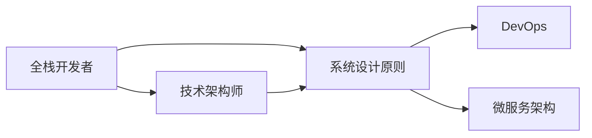

                 

# 从全栈开发到技术架构师的进阶

## 1. 背景介绍

### 1.1 问题由来
在快速发展的技术环境中，软件开发不再是一个单一技能集的角色可以胜任的。全栈开发者的职责范围从前端到后端，从数据库到网络，从系统架构到版本控制，几乎无所不包。然而，随着技术的复杂性和系统规模的扩大，全栈开发者的个人技能局限性逐渐显现。技术架构师应运而生，成为一种新的职业角色。他们专注于系统架构的规划、设计、实施和优化，具有更广泛的技术视野和深度。

### 1.2 问题核心关键点
从全栈开发者到技术架构师的进阶，涉及到技能组合的转变，从单一技术技能转向更全面、系统的思考。关键点包括：

- **技术深度和广度的平衡**：全栈开发者需要熟悉多个技术栈，但技术架构师需要在某一领域具备深入理解，同时对整体技术架构有全面的认识。
- **系统设计和规划能力**：从关注具体实现转向关注系统整体结构、可扩展性、性能优化等。
- **项目管理与团队协作**：技术架构师需要具备良好的项目管理技能，并能有效与团队沟通，协调资源。
- **持续学习和适应性**：技术快速演进，架构师需要持续学习新技术，并能快速适应新的应用场景。

### 1.3 问题研究意义
实现从全栈开发到技术架构师的进阶，对于提升个人职业发展、提高团队技术水平和推动技术创新具有重要意义：

- **个人职业发展**：架构师角色通常薪资更高，且拥有更多的职业发展机会，可以承担更高的技术挑战。
- **团队技术水平提升**：架构师的指导和规划，能够提升团队整体技术实力，推动技术栈升级。
- **技术创新推动**：架构师在技术选型、架构设计方面的决策，直接影响系统性能和未来发展，有助于推动技术创新。

## 2. 核心概念与联系

### 2.1 核心概念概述

为更好地理解从全栈开发到技术架构师的进阶，本节将介绍几个关键概念及其相互关系：

- **全栈开发者**：掌握多种技术栈，包括前端、后端、数据库、网络、版本控制等，能独立完成系统从设计到部署的全流程开发。
- **技术架构师**：专注于系统架构的设计、规划和实施，具备深度技术知识和广泛的技术视野。
- **系统设计原则**：如模块化、可扩展性、可维护性、高可用性等，指导架构师进行系统设计。
- **DevOps**：强调开发和运维的紧密协作，通过自动化和持续集成/持续部署(CI/CD)提高系统交付效率。
- **微服务架构**：将系统拆分为多个小服务，提高系统的可扩展性和灵活性。

这些概念之间的联系可通过以下Mermaid流程图展示：



这个流程图展示了从全栈开发者到技术架构师的知识过渡过程。全栈开发者通过学习系统设计原则，提升技术深度和广度，逐步向技术架构师转型。技术架构师在应用DevOps和微服务架构等现代实践，进行系统设计和实施。

## 3. 核心算法原理 & 具体操作步骤
### 3.1 算法原理概述

从全栈开发者到技术架构师的进阶，涉及到从具体技术实现转向系统设计和架构规划。这一过程需要应用多个设计原则和算法，进行系统分析和架构设计。

### 3.2 算法步骤详解

1. **需求分析**：与产品团队紧密合作，了解业务需求，明确系统目标和用户需求。
2. **系统架构设计**：根据需求，选择合适的架构模式，如微服务、服务网格、事件驱动等，进行系统结构设计。
3. **技术选型和评估**：评估各种技术和框架，选择最适合的系统组件和工具。
4. **设计文档编写**：编写详细的架构设计文档，包括系统架构图、组件说明、技术栈选择等。
5. **实现和部署**：根据设计文档，逐步实现系统，并进行持续集成和部署。
6. **监控和优化**：在系统上线后，进行性能监控和调优，确保系统稳定运行。

### 3.3 算法优缺点

**优点**：

- **系统性和全面性**：架构师视角更加宏观，能够从整体上优化系统设计和性能。
- **持续改进能力**：架构师具备系统化思考，能够在系统演进过程中持续优化。

**缺点**：

- **学习曲线陡峭**：系统设计和技术评估需要深厚的技术背景，对全栈开发者转型有一定挑战。
- **沟通和协作难度**：架构师需要与团队成员、产品团队紧密协作，沟通和协调可能较为复杂。

### 3.4 算法应用领域

从全栈开发到技术架构师的进阶，适用于多种应用场景：

- **企业内部系统构建**：如ERP、CRM、HR系统等，通过架构设计提高系统性能和可扩展性。
- **互联网应用**：如电商平台、社交网络、在线教育等，通过架构优化提升用户体验和系统稳定性。
- **大数据和云计算**：如数据湖、大数据平台、云原生应用等，通过架构设计支持大规模数据处理和云服务。

## 4. 数学模型和公式 & 详细讲解 & 举例说明（备注：数学公式请使用latex格式，latex嵌入文中独立段落使用 $$，段落内使用 $)
### 4.1 数学模型构建

以系统设计中的负载均衡为例，构建数学模型：

设系统负载为 $L$，服务节点的数量为 $n$，每个节点的处理能力为 $C$，则系统负载均衡的数学模型为：

$$
L = \frac{T}{n} \sum_{i=1}^n C_i
$$

其中 $T$ 为请求时间，$C_i$ 为第 $i$ 个节点的处理能力。

### 4.2 公式推导过程

通过等式变换，可以推导出节点数量与负载均衡的关系：

$$
n = \frac{L}{T} \sum_{i=1}^n \frac{1}{C_i}
$$

当 $C_i$ 相等时，节点数量 $n$ 与负载 $L$ 成正比，与处理能力 $C_i$ 成反比。

### 4.3 案例分析与讲解

假设一个电商平台，日访问量为 $L=100000$ 次/日，每个节点的处理能力 $C=1000$ 次/秒，系统请求时间 $T=0.1$ 秒。代入上述公式计算：

$$
n = \frac{100000}{0.1 \times 3600} \sum_{i=1}^n \frac{1}{1000} = 60 \times \frac{1}{1000} = 0.006
$$

由于节点数量 $n$ 必须为整数，因此需要调整节点数量，以确保负载均衡和系统稳定性。

## 5. 项目实践：代码实例和详细解释说明
### 5.1 开发环境搭建

要实现从全栈开发者到技术架构师的进阶，首先需要搭建一个开发环境。以下是一个基于Docker的开发环境搭建示例：

1. 安装Docker：
```bash
sudo apt-get update
sudo apt-get install docker-ce
```

2. 拉取Nginx镜像：
```bash
docker pull nginx:latest
```

3. 运行Nginx容器：
```bash
docker run -d --name nginx -p 80:80 nginx
```

4. 安装Node.js：
```bash
sudo apt-get install nodejs
```

5. 配置Nginx反向代理：
在Nginx配置文件中添加以下内容：
```
upstream backend {
    server 127.0.0.1:3000;
}

server {
    listen 80;
    location / {
        proxy_pass http://backend;
    }
}
```

启动Nginx服务：
```bash
sudo systemctl restart nginx
```

通过上述步骤，即可构建一个简单的Web开发环境，方便进行前端后端的协同开发。

### 5.2 源代码详细实现

以下是一个简单的Node.js Web应用示例：

```javascript
const express = require('express');
const app = express();

app.get('/', (req, res) => {
    res.send('Hello, World!');
});

app.listen(3000, () => {
    console.log('Server is running on port 3000');
});
```

启动应用：
```bash
node app.js
```

在浏览器中访问 http://localhost:3000，即可看到 "Hello, World!"。

### 5.3 代码解读与分析

**Express框架**：
- 使用了Express框架，快速搭建Web应用。
- 使用中间件实现路由和请求处理。

**Node.js异步编程**：
- 使用了异步编程模式，提高应用的响应速度和并发性能。

**反向代理**：
- 使用Nginx作为反向代理，实现负载均衡，提高系统的可用性和扩展性。

**DevOps实践**：
- 使用Docker进行容器化部署，提高应用的部署效率和稳定性。
- 通过持续集成/持续部署(CI/CD)工具，实现自动化构建和部署。

### 5.4 运行结果展示

运行上述示例代码，访问 http://localhost:3000，即可看到 "Hello, World!"。

## 6. 实际应用场景
### 6.1 企业内部系统构建

企业内部系统，如ERP、CRM、HR等，往往具有复杂的业务逻辑和数据集成需求。技术架构师可以通过以下步骤进行系统设计和规划：

1. **需求分析**：与产品团队合作，明确系统目标和用户需求。
2. **架构设计**：根据需求，选择合适的架构模式，如微服务、服务网格、事件驱动等。
3. **技术选型和评估**：评估各种技术和框架，选择最适合的系统组件和工具。
4. **设计文档编写**：编写详细的架构设计文档，包括系统架构图、组件说明、技术栈选择等。
5. **实现和部署**：根据设计文档，逐步实现系统，并进行持续集成和部署。
6. **监控和优化**：在系统上线后，进行性能监控和调优，确保系统稳定运行。

### 6.2 互联网应用

互联网应用如电商平台、社交网络、在线教育等，需要处理大量用户请求，提供高效的服务。技术架构师可以通过以下步骤进行架构优化：

1. **负载均衡**：使用Nginx等负载均衡器，将请求分配到多个后端服务节点，确保系统高可用性和负载均衡。
2. **缓存和CDN**：使用Redis、Memcached等缓存技术，以及CDN服务，提高系统响应速度和负载能力。
3. **消息队列**：使用RabbitMQ、Kafka等消息队列技术，实现高并发场景下的任务异步处理。
4. **微服务架构**：将系统拆分为多个小服务，提高系统的可扩展性和灵活性。

### 6.3 大数据和云计算

大数据和云计算系统，如数据湖、大数据平台、云原生应用等，需要处理大规模数据和复杂计算任务。技术架构师可以通过以下步骤进行系统设计和优化：

1. **数据湖架构**：使用Hadoop、Spark等技术，构建数据湖系统，支持大规模数据存储和计算。
2. **云服务部署**：使用AWS、Azure等云平台，进行应用和服务的云化部署，提高资源利用率和扩展能力。
3. **容器化部署**：使用Docker、Kubernetes等容器化技术，实现应用的自动化部署和运维。
4. **分布式存储和计算**：使用HDFS、Ceph等分布式存储技术，以及Spark、Flink等分布式计算框架，提高系统的可靠性和扩展性。

## 7. 工具和资源推荐
### 7.1 学习资源推荐

1. **《深入理解计算机系统》**：详细讲解了计算机系统的底层原理，为理解系统架构打下基础。
2. **《分布式系统原理与设计》**：讲解了分布式系统的设计原则和实践，适合架构师学习。
3. **《微服务架构》**：介绍了微服务架构的设计和实践，适合了解微服务架构。
4. **《DevOps实践》**：讲解了DevOps的实践方法和工具，适合提升开发效率。
5. **《软件工程：原理与实践》**：讲解了软件工程的原则和实践，适合系统设计和管理。

### 7.2 开发工具推荐

1. **Docker**：容器化部署和编排工具，适合快速构建和部署系统。
2. **Kubernetes**：容器编排工具，支持自动扩展和管理。
3. **Prometheus**：监控和告警系统，支持实时监控系统状态。
4. **Jenkins**：持续集成/持续部署工具，支持自动化构建和部署。
5. **Ansible**：自动化运维工具，支持批量管理和配置。

### 7.3 相关论文推荐

1. **《Design Patterns: Elements of Reusable Object-Oriented Software》**：经典的设计模式书籍，适合系统设计。
2. **《Microservices: Principles and Patterns for Microservices Architecture》**：微服务架构的详细设计指南。
3. **《Event-Driven Systems: A Guide to Architecting Decentralized Systems》**：讲解了事件驱动架构的设计和实践。
4. **《Continuous Integration and Delivery: Foundations of Software Excellence》**：讲解了CI/CD的实践方法和工具。
5. **《The DevOps Handbook: How Top Organizations Implement DevOps to Improve Quality and Speed in Software》**：DevOps实践的详细介绍。

## 8. 总结：未来发展趋势与挑战

### 8.1 总结

本文系统介绍了从全栈开发到技术架构师的进阶过程，包括核心概念、算法原理和具体操作步骤。通过学习本文，读者可以掌握系统设计和架构优化的基本方法和思路。

### 8.2 未来发展趋势

从全栈开发到技术架构师的进阶，将展现出以下几个未来发展趋势：

1. **自动化和智能化**：通过自动化工具和智能化算法，提升系统设计和运维的效率和质量。
2. **微服务和云原生**：微服务和云原生架构将成为未来的主流架构模式，提供更高的可扩展性和灵活性。
3. **DevOps和持续交付**：DevOps实践和持续交付方法，将进一步提升系统交付速度和稳定性。
4. **数据驱动和智能分析**：大数据和智能分析技术，将提供更精准的系统设计和优化决策。
5. **跨学科和跨领域**：技术架构师需要跨学科知识和跨领域经验，提供更全面、系统的解决方案。

### 8.3 面临的挑战

从全栈开发到技术架构师的进阶，也面临一些挑战：

1. **技术栈多样化**：需要掌握多种技术栈，保持学习动力和技术新鲜度。
2. **系统复杂性增加**：随着系统规模扩大，系统设计和优化的复杂度也会增加，需要具备更高的技术能力。
3. **沟通和协作难度**：需要与团队成员和产品团队紧密协作，提升沟通和协调能力。
4. **持续学习和适应性**：技术快速演进，需要不断学习和适应新技术，保持竞争力。

### 8.4 研究展望

未来技术架构师的研究方向可能包括：

1. **AI驱动的系统设计**：利用AI技术进行系统设计和优化，提高系统智能化和自动化水平。
2. **跨领域融合**：将其他学科的知识和工具引入系统设计，如生物信息学、物联网、区块链等。
3. **生态系统和社区建设**：构建技术生态系统和开源社区，推动技术创新和传播。
4. **可持续性和社会责任**：考虑系统的可持续性和社会影响，提供更加负责任的设计方案。

总之，从全栈开发到技术架构师的进阶，需要不断学习新技术，提升系统设计和架构能力，持续改进和优化系统。只有在不断挑战和突破中，才能成为一名优秀的技术架构师。

## 9. 附录：常见问题与解答

**Q1：如何选择合适的架构模式？**

A: 选择合适的架构模式，需要考虑系统的业务需求、性能要求、扩展性和运维复杂度等因素。常见的架构模式包括微服务、事件驱动、服务网格等，需要根据实际情况进行选择。

**Q2：如何评估技术选型的优劣？**

A: 技术选型的评估应考虑以下几个方面：

1. 技术成熟度和稳定性：选择成熟稳定、社区活跃的技术。
2. 扩展性和性能：评估技术在高并发、大数据等场景下的扩展性和性能表现。
3. 开发和运维难度：考虑技术的开发难度和运维复杂度，选择简单易用的技术。
4. 社区支持和生态系统：选择有强大社区支持和丰富生态系统的技术，便于技术支持和问题解决。

**Q3：架构师应该如何与产品团队协作？**

A: 与产品团队的协作，可以通过以下几个步骤：

1. 定期沟通：定期与产品团队沟通，了解业务需求和产品目标。
2. 明确需求：明确系统的业务需求和用户需求，确保系统设计符合产品目标。
3. 需求变更管理：建立需求变更管理机制，及时调整系统设计和架构。
4. 跨团队沟通：与开发、运维、测试等团队紧密协作，确保系统顺利上线和稳定运行。

**Q4：架构师如何进行系统设计和优化？**

A: 系统设计和优化的步骤包括：

1. 需求分析：明确业务需求和用户需求，确定系统目标和功能。
2. 架构设计：选择合适的架构模式，进行系统结构设计。
3. 技术选型和评估：评估各种技术和框架，选择最适合的系统组件和工具。
4. 设计文档编写：编写详细的架构设计文档，包括系统架构图、组件说明、技术栈选择等。
5. 实现和部署：根据设计文档，逐步实现系统，并进行持续集成和部署。
6. 监控和优化：在系统上线后，进行性能监控和调优，确保系统稳定运行。

总之，从全栈开发到技术架构师的进阶，是一个不断学习、实践和优化的过程。只有在持续学习和适应中，才能成为一名优秀的技术架构师。

---

作者：禅与计算机程序设计艺术 / Zen and the Art of Computer Programming

