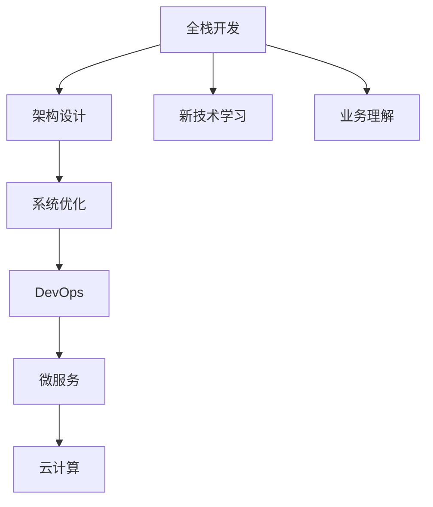

                 

# 从全栈开发到技术架构师的进阶

## 1. 背景介绍

### 1.1 问题由来

当今IT行业竞争日趋激烈，企业对技术人才的需求不断升级，尤其是对于技术架构师的需求猛增。然而，技术架构师并非仅靠深厚的技术功底就能胜任，而需具备从全栈开发到技术架构的全面升级能力。本文旨在探讨从全栈开发到技术架构的进阶之路，希望能对从事IT工作的同仁们提供一份全面的职业发展指南。

### 1.2 问题核心关键点

从全栈开发到技术架构师的进阶，涉及多个维度的技能提升，包括但不限于：

1. **架构设计**：理解企业架构和软件架构的原理，能够设计高效、可扩展的系统。
2. **系统优化**：掌握性能调优、并发处理、安全性等核心能力。
3. **团队协作**：具备项目管理、团队沟通、技术文档撰写等软技能。
4. **新技术学习**：持续跟进最新技术趋势，包括云计算、微服务、DevOps等。
5. **业务理解**：具备对业务需求的敏锐洞察，并能够将技术解决方案与业务目标对齐。

## 2. 核心概念与联系

### 2.1 核心概念概述

为便于读者理解技术架构师的进阶之路，本节将介绍几个关键概念：

- **全栈开发**：指掌握前后端技术，能够独立完成从需求分析到部署运维的整个软件生命周期。
- **技术架构**：指设计系统架构的能力，包括架构评估、设计模式、技术栈选择等。
- **DevOps**：指将软件开发和运维紧密结合的实践，强调自动化、持续交付和持续集成。
- **微服务**：指将应用程序拆分为一组独立服务的架构，每个服务可独立部署、扩展。
- **云计算**：指基于互联网的数据中心服务，包括IaaS、PaaS、SaaS等。

这些核心概念共同构成技术架构师的职业基础，决定了其进阶的路径和目标。

### 2.2 核心概念原理和架构的 Mermaid 流程图(Mermaid 流程节点中不要有括号、逗号等特殊字符)



这个流程图展示了从全栈开发到技术架构进阶的主要步骤和关键能力：

1. 从全栈开发开始，掌握前端和后端技术。
2. 进阶到架构设计，学习架构原理和设计模式。
3. 提升系统优化能力，掌握性能调优和并发处理等。
4. 引入DevOps实践，提升持续交付和集成能力。
5. 深入学习微服务架构，提升系统可扩展性。
6. 拥抱云计算，提升应用部署和扩展效率。
7. 学习新技术，跟上技术发展趋势。
8. 理解业务需求，将技术解决方案与业务目标对齐。

## 3. 核心算法原理 & 具体操作步骤

### 3.1 算法原理概述

技术架构师的核心能力在于其系统的设计和优化，这涉及多个算法的理解和应用。以下是几个关键算法和步骤的概述：

- **系统优化算法**：如负载均衡算法、缓存策略、并发控制算法等，用于提升系统性能和稳定性。
- **DevOps流程自动化**：如持续集成(CI)、持续交付(CD)、自动化测试等，提升开发效率和产品质量。
- **微服务架构设计**：如服务拆分、服务通信、服务发现等，提升系统可扩展性和松耦合性。
- **云计算资源管理**：如弹性伸缩、资源池化、服务治理等，提升应用部署和扩展效率。

### 3.2 算法步骤详解

技术架构师的进阶之路涉及多个具体的算法步骤，以下以微服务架构设计和DevOps流程自动化为例进行详解：

**3.2.1 微服务架构设计**

1. **服务拆分**：根据业务需求，将单体应用拆分为多个独立服务，每个服务负责独立的业务功能。
2. **服务通信**：选择合适的通信协议和框架，如HTTP RESTful API、gRPC等。
3. **服务发现**：使用服务注册中心如Consul、Eureka等，实现服务的自动发现和负载均衡。
4. **依赖管理**：使用依赖管理工具如Docker Compose、Kubernetes等，管理服务之间的依赖关系。
5. **版本控制**：使用版本控制策略如蓝绿部署、金丝雀部署等，确保服务升级的平稳进行。

**3.2.2 DevOps流程自动化**

1. **持续集成**：使用CI工具如Jenkins、GitLab CI等，自动构建、测试和部署代码。
2. **持续交付**：使用CD工具如Jenkins、GitLab CD等，实现代码的自动部署和上线。
3. **自动化测试**：使用自动化测试工具如Selenium、JUnit等，提高测试效率和覆盖率。
4. **监控告警**：使用监控工具如Prometheus、Grafana等，实时监控系统运行状态，设置告警机制。
5. **日志分析**：使用日志分析工具如ELK Stack、Logstash等，分析系统日志，定位问题根源。

### 3.3 算法优缺点

从全栈开发到技术架构师进阶的算法有其独特的优势和局限性：

**优点**：

1. **提升系统性能**：优化算法和DevOps流程能显著提升系统性能和稳定性。
2. **增强可扩展性**：微服务架构和云计算能提升系统的可扩展性和灵活性。
3. **提高开发效率**：DevOps实践能提升开发效率和代码质量。

**缺点**：

1. **复杂度提升**：引入新技术和架构设计会增加系统复杂度，需要更多时间和资源进行维护。
2. **学习曲线陡峭**：新技术和复杂架构需要较长时间学习，短期内可能难以见效。
3. **团队协作困难**：不同架构和新技术的引入需要团队成员具备相应的技能，可能存在协作障碍。

### 3.4 算法应用领域

从全栈开发到技术架构师的进阶算法，在多个领域得到广泛应用：

- **云计算平台**：使用微服务架构和DevOps实践，提升云平台服务的性能和可扩展性。
- **金融科技**：通过优化算法和DevOps流程，提升金融服务的稳定性和交易速度。
- **电商平台**：通过微服务架构和云计算，提升电商平台的并发处理能力和扩展性。
- **医疗系统**：通过架构优化和DevOps实践，提升医疗系统的可靠性和服务质量。

## 4. 数学模型和公式 & 详细讲解 & 举例说明

### 4.1 数学模型构建

在技术架构师进阶的过程中，理解数学模型的原理和应用至关重要。以下以性能调优为例，构建数学模型：

假设系统当前处理能力为 $C$，负载为 $L$，处理效率为 $E$。

性能调优的目标是最大化 $E = \frac{C}{L}$。

为了达到这一目标，可采取以下措施：

1. **增加系统处理能力**：通过增加服务器、升级硬件等方式，提高 $C$。
2. **减少系统负载**：通过缓存策略、负载均衡等方式，降低 $L$。
3. **优化处理效率**：通过算法优化、代码重构等方式，提高 $E$。

### 4.2 公式推导过程

以缓存策略为例，分析其对系统性能的影响：

1. **无缓存策略**：处理时间 $T = L \cdot E$。
2. **单层缓存**：部分数据存储在缓存中，处理时间 $T = \frac{L - C}{C} \cdot E + \frac{C}{C} \cdot E$。
3. **多层缓存**：部分数据存储在多层缓存中，处理时间 $T = \frac{L - C_1}{C_1} \cdot E + \frac{C_1 - C_2}{C_2} \cdot E + \frac{C_2}{C_2} \cdot E$。

通过公式推导，可以看到缓存策略显著降低处理时间，提升系统性能。

### 4.3 案例分析与讲解

**案例分析**：某电商平台系统，日访问量 $L = 10^6$，当前服务器处理能力 $C = 1000$，每条请求处理时间 $E = 0.1s$。

**分析**：系统性能瓶颈在于处理时间，需要引入缓存策略。

**实现**：
- **单层缓存**：增加一级缓存，使 $C_1 = 5000$，则处理时间 $T = \frac{L - C_1}{C_1} \cdot E + \frac{C_1}{C_1} \cdot E = 0.2s$。
- **多层缓存**：增加二级缓存，使 $C_2 = 10000$，则处理时间 $T = \frac{L - C_1}{C_1} \cdot E + \frac{C_1 - C_2}{C_2} \cdot E + \frac{C_2}{C_2} \cdot E = 0.1s$。

通过上述分析，可以看到引入缓存策略后，系统性能显著提升。

## 5. 项目实践：代码实例和详细解释说明

### 5.1 开发环境搭建

技术架构师的进阶之路离不开实际的开发实践。以下以微服务架构设计为例，介绍开发环境搭建步骤：

1. **选择框架和工具**：选择微服务框架如Spring Boot、Django等，容器工具如Docker、Kubernetes等。
2. **搭建开发环境**：安装相应工具，搭建本地开发环境。
3. **版本控制**：使用版本控制工具如Git等，管理代码变更。
4. **持续集成**：搭建CI/CD环境，自动构建和测试代码。
5. **监控告警**：安装监控工具如Prometheus、Grafana等，实时监控系统状态。

### 5.2 源代码详细实现

以微服务架构设计为例，给出具体的代码实现：

**5.2.1 服务拆分**

```python
# 假设有一个单体应用，拆分后变为两个服务
# 服务A负责用户管理，服务B负责商品管理

from flask import Flask, request

app = Flask(__name__)

@app.route('/user/<id>', methods=['GET'])
def get_user(id):
    # 服务A的用户管理逻辑
    pass

@app.route('/product/<id>', methods=['GET'])
def get_product(id):
    # 服务B的商品管理逻辑
    pass
```

**5.2.2 服务通信**

```python
# 假设服务A调用服务B

import requests

@app.route('/user/<id>', methods=['GET'])
def get_user(id):
    # 调用服务B获取商品信息
    response = requests.get('http://product-service:8080/product/{}'.format(id))
    product = response.json()
    # 返回用户信息
    pass
```

**5.2.3 服务发现**

```python
# 假设使用Consul进行服务注册和发现

import consul

consul_client = consul.Consul('localhost', 8500)

@app.route('/user/<id>', methods=['GET'])
def get_user(id):
    # 从Consul中获取服务B的地址和端口
    service_info = consul_client.service('product-service')
    product_service_addr = service_info[0]['ServiceAddress']
    product_service_port = service_info[0]['ServicePort']
    # 调用服务B获取商品信息
    response = requests.get('http://{}:{}/product/{}'.format(product_service_addr, product_service_port, id))
    product = response.json()
    # 返回用户信息
    pass
```

### 5.3 代码解读与分析

**代码解读**：

- **服务拆分**：通过Flask框架，将单体应用拆分为两个独立的微服务，每个服务负责不同的业务逻辑。
- **服务通信**：通过HTTP RESTful API，实现微服务之间的通信。
- **服务发现**：通过Consul，实现服务的自动注册和发现。

**分析**：

- **模块化设计**：将系统设计为多个独立的微服务，增强系统的灵活性和可扩展性。
- **异步通信**：通过HTTP RESTful API，实现微服务之间的异步通信，提升系统响应速度。
- **动态服务注册**：通过Consul，实现动态的服务注册和发现，提高系统可靠性。

### 5.4 运行结果展示

**运行结果展示**：

- **服务拆分**：单体应用成功拆分，每个微服务能够独立运行。
- **服务通信**：微服务之间能够通过API成功通信，返回正确的业务数据。
- **服务发现**：微服务能够动态注册和发现，服务注册中心能够正确返回服务地址和端口。

## 6. 实际应用场景

### 6.1 电商系统架构

电商系统需要处理大量的并发请求，设计高效的架构至关重要。以下是一个电商系统的架构设计：

1. **前端**：采用React等前端技术，提供用户界面。
2. **应用层**：采用Spring Boot等后端技术，处理用户请求。
3. **服务层**：采用微服务架构，将订单、商品、用户管理等拆分至多个独立服务。
4. **数据库层**：采用MySQL等关系数据库，存储用户信息和商品信息。
5. **缓存层**：采用Redis等缓存系统，提升数据查询效率。
6. **消息队列**：采用RabbitMQ等消息队列，处理异步任务。
7. **监控告警**：采用Prometheus、Grafana等工具，实时监控系统状态。

### 6.2 金融系统架构

金融系统需要高可靠性和低延迟，以下是一个金融系统的架构设计：

1. **前端**：采用Vue等前端技术，提供用户界面。
2. **应用层**：采用Spring Boot等后端技术，处理用户请求。
3. **服务层**：采用微服务架构，将交易、结算、风控等拆分至多个独立服务。
4. **数据库层**：采用MySQL等关系数据库，存储交易记录和账户信息。
5. **缓存层**：采用Redis等缓存系统，提升数据查询效率。
6. **消息队列**：采用Kafka等消息队列，处理异步任务。
7. **监控告警**：采用Prometheus、Grafana等工具，实时监控系统状态。

### 6.3 医疗系统架构

医疗系统需要高可靠性和高可用性，以下是一个医疗系统的架构设计：

1. **前端**：采用React等前端技术，提供用户界面。
2. **应用层**：采用Spring Boot等后端技术，处理用户请求。
3. **服务层**：采用微服务架构，将挂号、诊疗、病历管理等拆分至多个独立服务。
4. **数据库层**：采用MySQL等关系数据库，存储患者信息和诊疗记录。
5. **缓存层**：采用Redis等缓存系统，提升数据查询效率。
6. **消息队列**：采用RabbitMQ等消息队列，处理异步任务。
7. **监控告警**：采用Prometheus、Grafana等工具，实时监控系统状态。

## 7. 工具和资源推荐

### 7.1 学习资源推荐

为了帮助读者系统掌握技术架构师进阶的相关知识，以下推荐几份优质学习资源：

1. **《系统架构之美》**：陈皓老师的著作，详细介绍了系统架构设计的原理和实践。
2. **《微服务设计与开发实践》**：马修·泰勒的著作，系统讲解了微服务架构的设计和开发。
3. **《DevOps实践指南》**：沙迪克·阿卜杜拉著，介绍了DevOps实践的核心思想和工具。
4. **《深入理解DevOps》**：比尔·萨洛文著，深入探讨了DevOps的原理和实现。
5. **《云计算基础》**：阿里云技术学院课程，详细讲解了云计算的基本概念和技术。

### 7.2 开发工具推荐

技术架构师的进阶之路离不开优秀的工具支持。以下是几款常用的开发工具：

1. **Docker**：容器化部署工具，方便应用的打包、发布和部署。
2. **Kubernetes**：容器编排工具，实现应用的自动部署、扩展和管理。
3. **Jenkins**：持续集成工具，实现代码的自动构建、测试和部署。
4. **Prometheus**：监控工具，实时监控系统状态，收集和分析数据。
5. **Grafana**：数据可视化工具，实现系统状态的实时监控和分析。

### 7.3 相关论文推荐

技术架构师的进阶离不开前沿理论的支撑。以下是几篇经典的架构设计相关论文：

1. **《分布式系统设计原则》**：唐骏著作，详细介绍分布式系统的设计原则和实践。
2. **《微服务架构：设计轻量级服务》**：比尔·萨洛文著，详细讲解了微服务架构的设计和实现。
3. **《云计算基础架构》**：阿里云技术学院课程，详细讲解了云计算的基本概念和技术。
4. **《DevOps实践指南》**：沙迪克·阿卜杜拉著，系统介绍了DevOps的实践和工具。

## 8. 总结：未来发展趋势与挑战

### 8.1 研究成果总结

技术架构师从全栈开发到进阶，是一个系统的技能提升过程，涉及多个维度的技术学习和实践。通过系统学习和实践，可以掌握架构设计、系统优化、DevOps流程自动化、微服务架构、云计算等核心能力，成为具有全面技术视野和实践经验的技术架构师。

### 8.2 未来发展趋势

展望未来，技术架构师的进阶将呈现以下发展趋势：

1. **架构设计自动化**：通过自动化工具和算法，提升架构设计的效率和质量。
2. **持续交付和集成**：引入CI/CD工具，提升持续交付和集成能力。
3. **云原生架构**：拥抱云原生架构，提升应用的部署和扩展效率。
4. **DevOps文化**：推广DevOps文化，提升团队协作和开发效率。
5. **微服务架构普及**：微服务架构将逐渐普及，提升系统的可扩展性和灵活性。
6. **新技术应用**：持续跟进新技术，提升技术栈的现代化水平。

### 8.3 面临的挑战

技术架构师在进阶过程中，面临诸多挑战：

1. **学习曲线陡峭**：新技术和复杂架构需要较长时间学习，短期内可能难以见效。
2. **技术栈多样化**：需要掌握多种技术和工具，可能存在协作障碍。
3. **复杂度提升**：引入新技术和复杂架构会增加系统复杂度，需要更多时间和资源进行维护。
4. **团队协作困难**：不同架构和新技术的引入需要团队成员具备相应的技能，可能存在协作障碍。

### 8.4 研究展望

技术架构师需要不断学习新技术和前沿理论，积极应对挑战，推动技术架构的持续演进。未来，可以从以下几个方向进行研究：

1. **自动化架构设计**：通过自动化工具和算法，提升架构设计的效率和质量。
2. **持续交付和集成**：引入CI/CD工具，提升持续交付和集成能力。
3. **云原生架构**：拥抱云原生架构，提升应用的部署和扩展效率。
4. **DevOps文化**：推广DevOps文化，提升团队协作和开发效率。
5. **微服务架构普及**：微服务架构将逐渐普及，提升系统的可扩展性和灵活性。
6. **新技术应用**：持续跟进新技术，提升技术栈的现代化水平。

## 9. 附录：常见问题与解答

**Q1：技术架构师的进阶需要多久？**

A: 技术架构师的进阶需要较长时间的学习和实践，具体时间取决于个人基础和技术栈的复杂度。一般建议持续学习半年到一年，并通过多个实际项目进行实践。

**Q2：如何选择合适的技术架构？**

A: 选择技术架构需要考虑多个因素，包括系统规模、业务需求、技术栈、团队能力等。可以参考类似的成功案例，结合自身需求进行评估和选择。

**Q3：如何提升团队协作能力？**

A: 提升团队协作能力需要从以下几个方面入手：
1. 建立良好的沟通机制，定期召开团队会议，解决技术难题。
2. 建立代码评审和测试机制，提升代码质量和开发效率。
3. 建立文档和知识共享机制，积累技术经验，提高团队能力。

**Q4：技术架构师需要哪些软技能？**

A: 技术架构师需要具备以下软技能：
1. 沟通能力：能够清晰地表达技术方案，与团队成员和业务部门进行有效的沟通。
2. 项目管理能力：能够制定项目计划，协调资源，推进项目进展。
3. 文档撰写能力：能够编写清晰的技术文档，记录技术方案和项目进展。
4. 问题解决能力：能够分析和解决技术难题，提高系统稳定性和性能。

**Q5：如何保持技术栈的现代化水平？**

A: 保持技术栈的现代化水平需要持续学习新技术和前沿理论，关注技术社区和行业动态。可以通过参加技术会议、阅读技术博客、参与开源项目等方式，不断提升技术能力。

---

作者：禅与计算机程序设计艺术 / Zen and the Art of Computer Programming

