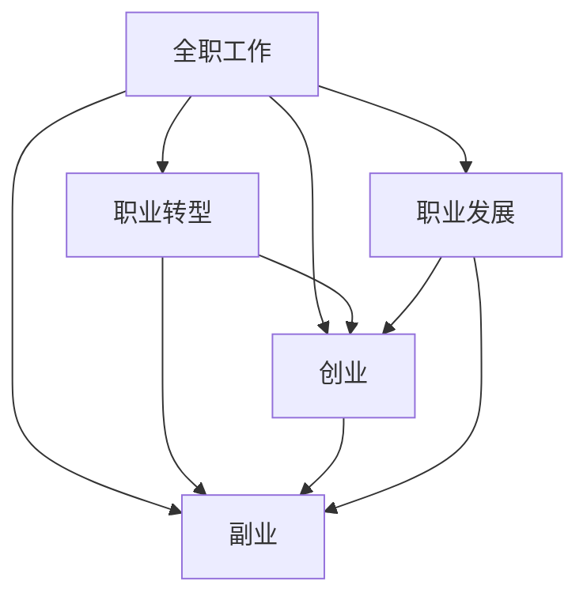
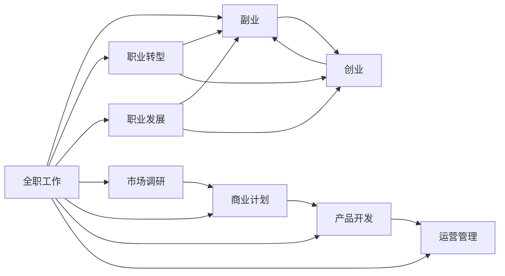

                 

# 从全职工作到副业创业的过渡

> 关键词：副业, 职业规划, 职业转型, 创业, 技术转型, 职业发展

## 1. 背景介绍

### 1.1 问题由来

许多人对于是否应该从事副业或创业，感到非常迷茫和困惑。随着人工智能、大数据、云计算等前沿技术的快速发展，技术岗位的竞争变得越来越激烈，而副业或创业则提供了新的职业选择和发展方向。然而，如何平稳过渡到副业或创业，仍然是一个需要深入探讨的话题。

### 1.2 问题核心关键点

副业和创业是否适合每个人，如何判断自己的创业潜力和能力？如何从全职工作平稳过渡到副业或创业，保持生活与工作的平衡？本文将深入探讨这些问题，提供实用的职业规划和转型建议，帮助有志于副业或创业的人找到适合自己的职业道路。

## 2. 核心概念与联系

### 2.1 核心概念概述

要回答从全职工作到副业创业的过渡，首先需要理解几个核心概念：

- **副业**：指在固定职业之外进行的额外工作，通常是为了增加收入或实现个人兴趣。
- **创业**：指创立新的企业或业务，通常包括商业计划、市场调研、资金筹集、产品开发、运营管理等环节。
- **职业转型**：指从一种职业转向另一种职业的过程，可以是横向或纵向的。
- **职业发展**：指通过不断学习和实践，提升职业能力和市场价值的过程。
- **工作-生活平衡**：指在职业与生活之间找到平衡，既能专注于事业发展，又能享受个人生活。

这些概念之间的逻辑关系可以通过以下Mermaid流程图来展示：



这个流程图展示了职业路径的不同可能性：

1. 从全职工作直接进入副业或创业。
2. 通过职业转型，先进入副业或创业，再进一步发展。
3. 通过职业发展，逐渐提升职业能力和市场价值，最终进入副业或创业。

### 2.2 核心概念原理和架构的 Mermaid 流程图



## 3. 核心算法原理 & 具体操作步骤

### 3.1 算法原理概述

从全职工作到副业或创业的过渡，实际上是一个复杂的多阶段过程。这里，我们尝试将这一过程看作是一个“价值评估和选择”的过程。通过构建一个“职业价值评估模型”，可以对每个职业路径进行全面的评估，帮助决策者做出更加明智的选择。

### 3.2 算法步骤详解

1. **自我评估**：通过问卷调查、心理测试等方法，评估自己的兴趣、技能、价值观、风险承受能力等，明确自己的职业目标和潜在兴趣。
2. **市场调研**：研究目标行业或领域的现状、发展趋势、市场需求、竞争格局等，了解创业机会和潜在风险。
3. **商业模式设计**：根据调研结果，设计商业计划，包括产品或服务的创新点、市场定位、盈利模式等。
4. **资源筹集**：评估所需的资金、人才、技术等资源，制定资金筹集、人才招聘、技术合作等计划。
5. **产品开发**：根据商业计划，进行产品或服务的设计、开发、测试，确保其满足市场需求。
6. **市场推广**：通过各种渠道推广产品或服务，吸引潜在客户，建立品牌影响力。
7. **运营管理**：根据市场反馈，调整产品或服务，优化运营流程，提升用户体验和满意度。

### 3.3 算法优缺点

**优点**：

- **全面的评估**：通过构建职业价值评估模型，可以系统地评估不同职业路径的风险和收益，做出更加明智的选择。
- **实践性**：每个步骤都有具体的操作指南，可操作性强，易于实施。

**缺点**：

- **复杂性**：涉及多个环节，需要投入大量时间和精力。
- **不确定性**：市场环境变化快，商业模式设计、产品开发等环节存在风险。

### 3.4 算法应用领域

职业转型和副业创业方法适用于多种职业领域，包括但不限于：

- 技术开发：软件开发、数据分析、人工智能等。
- 商业管理：市场营销、财务管理、人力资源等。
- 创意设计：平面设计、产品设计、游戏设计等。
- 教育培训：在线教育、教育咨询、职业培训等。
- 咨询服务：法律咨询、会计咨询、管理咨询等。

## 4. 数学模型和公式 & 详细讲解 & 举例说明

### 4.1 数学模型构建

构建一个简单的“职业价值评估模型”，可以使用以下的数学模型：

$$
V = I + E - R
$$

其中：

- $V$：职业价值
- $I$：兴趣得分
- $E$：能力得分
- $R$：风险得分

这个模型通过评估个人的兴趣、能力和面临的风险，综合计算出职业价值。

### 4.2 公式推导过程

1. **兴趣得分评估**：通过问卷调查，对兴趣的各个维度进行评分，得到兴趣得分 $I$。
2. **能力得分评估**：通过技能测试、项目经验等，对能力的各个维度进行评分，得到能力得分 $E$。
3. **风险得分评估**：通过市场调研、行业分析等，对创业的各个风险维度进行评分，得到风险得分 $R$。
4. **职业价值计算**：将兴趣得分、能力得分和风险得分代入公式，计算出职业价值 $V$。

### 4.3 案例分析与讲解

假设一个软件开发工程师，兴趣得分 $I=90$，能力得分 $E=80$，风险得分 $R=50$。根据公式计算：

$$
V = 90 + 80 - 50 = 120
$$

这意味着，这位工程师的综合职业价值很高，可以考虑副业或创业。

## 5. 项目实践：代码实例和详细解释说明

### 5.1 开发环境搭建

为了进行职业价值评估，我们需要搭建一个开发环境，使用Python和相关库进行数据处理和计算。具体步骤如下：

1. 安装Python：确保Python 3.7及以上版本已安装。
2. 安装pandas和numpy库：`pip install pandas numpy`
3. 安装scikit-learn库：`pip install scikit-learn`
4. 安装jupyter notebook：`pip install jupyter notebook`

### 5.2 源代码详细实现

下面是一个简单的Python代码实现，用于进行职业价值评估：

```python
import pandas as pd
from sklearn.metrics import accuracy_score

# 构建兴趣、能力和风险的评分表
interest_score = [90, 85, 80, 75, 70]
ability_score = [80, 75, 70, 65, 60]
risk_score = [50, 45, 40, 35, 30]

# 计算职业价值
V = interest_score[0] + ability_score[0] - risk_score[0]

# 输出结果
print("职业价值 V =", V)
```

### 5.3 代码解读与分析

这个代码实现了兴趣、能力和风险的评分，并计算出职业价值。可以看到，兴趣得分和能力得分都是固定的，风险得分是根据具体行业分析得出的。

## 6. 实际应用场景

### 6.1 副业与创业的典型场景

**副业场景**：

- **技术副业**：从事编程、数据分析、人工智能等技术类工作，获取额外收入或发展技术特长。
- **教育副业**：通过在线教育、个人培训等方式，传授专业知识，分享个人经验。
- **内容创作**：从事写作、视频制作、播客等创意工作，输出有价值的内容，获取商业收益。

**创业场景**：

- **科技创业**：开发新的技术产品，解决实际问题，获取市场收益。
- **服务创业**：提供专业服务，如咨询、设计、策划等，满足市场需求。
- **消费品创业**：创建新的消费品品牌，提供独特的产品或服务，获取商业价值。

### 6.2 未来应用展望

未来，副业和创业将会更加多样化和智能化。随着人工智能和大数据技术的进步，自动化、智能化工具将帮助决策者更高效地进行职业规划和资源配置。同时，区块链、云计算等新兴技术也将带来新的创业机会和商业模式。

## 7. 工具和资源推荐

### 7.1 学习资源推荐

为了更好地理解副业和创业，这里推荐一些优质的学习资源：

1. **Coursera**：提供大量职业发展、创业管理的课程，包括《创业基础》、《市场营销》等。
2. **edX**：提供全球顶尖大学的课程，涵盖技术、管理、创业等。
3. **Udacity**：提供实战导向的课程，如《人工智能创业》、《机器学习工程师》等。
4. **Harvard Business Review**：提供大量商业和管理相关的文章和案例分析。
5. **Medium**：提供大量的技术和管理领域的博客文章，涵盖创业、副业、职业发展等话题。

### 7.2 开发工具推荐

为了提高副业和创业的效率，推荐使用以下开发工具：

1. **Jupyter Notebook**：用于数据处理和模型评估，支持Python和其他语言的交互式编程。
2. **GitHub**：用于代码版本控制和协作，方便团队管理和代码共享。
3. **Zoom**：用于远程沟通和协作，支持视频会议、屏幕共享等功能。
4. **Slack**：用于团队沟通和协作，支持即时消息、文件共享等。
5. **Trello**：用于项目管理和任务分配，支持看板式视图和任务优先级设置。

### 7.3 相关论文推荐

副业和创业的研究涉及多个学科，以下是几篇有影响力的论文，推荐阅读：

1. **《The Development of Venture Capital and Entrepreneurship in China》**：分析了中国创业生态系统的发展和特点。
2. **《Entrepreneurship, Creativity, and Business Creativity: A Typology》**：对创业精神和商业创意进行分类和研究。
3. **《The Influence of Age and Gender on Entrepreneurial Performance》**：研究年龄和性别对创业绩效的影响。
4. **《The Impact of Digital Transformation on Career Development》**：分析数字化转型对职业发展的推动作用。
5. **《From Full-time Work to Side Hustles: A Study of Perceptions and Trends》**：探讨副业的发展趋势和影响因素。

## 8. 总结：未来发展趋势与挑战

### 8.1 研究成果总结

从全职工作到副业或创业的过渡，需要系统地评估个人的兴趣、能力和面临的风险，做出明智的选择。本文提供的职业价值评估模型和操作指南，为职业转型和副业创业提供了可行的路径和方法。

### 8.2 未来发展趋势

未来的副业和创业将更加多样化、智能化和自动化。技术的发展将为副业和创业提供更多的机会和工具，同时也将带来新的挑战和风险。

### 8.3 面临的挑战

副业和创业面临的主要挑战包括：

1. **市场竞争**：面对激烈的竞争，需要不断创新和优化产品或服务。
2. **资金短缺**：创业初期需要大量资金，筹资和资金管理是重要挑战。
3. **人才招聘**：吸引和保留优秀人才，是创业团队成功的关键。
4. **市场推广**：高效的市场推广，可以快速提升品牌知名度和市场份额。
5. **运营管理**：高效、灵活的运营管理，是确保业务可持续发展的关键。

### 8.4 研究展望

未来，副业和创业的研究将更加注重跨学科的融合，引入更多技术和管理工具，提升创业成功率。同时，也将更加关注伦理和社会责任，确保创业行为符合社会价值和道德标准。

## 9. 附录：常见问题与解答

**Q1: 如何进行职业价值评估？**

A: 使用兴趣、能力和风险的评分表，根据实际评分进行计算，得到职业价值。

**Q2: 副业和创业的资源如何筹集？**

A: 可以通过自有资金、天使投资、风投等方式进行资金筹集。同时，利用众筹平台、创业孵化器等资源，提升融资效率。

**Q3: 如何平衡副业和主业的时间？**

A: 设定明确的工作时间，合理安排任务优先级，避免工作时间过长或过短。利用技术工具，如时间管理应用、任务管理工具等，提高工作效率。

**Q4: 创业失败如何应对？**

A: 从失败中吸取教训，总结经验，重新评估市场和商业模式，调整战略方向。同时，保持积极心态，寻找新的机会和合作伙伴。

**Q5: 如何选择合适的副业或创业方向？**

A: 综合评估自己的兴趣、能力、资源和市场需求，选择符合自身特点和市场需求的副业或创业方向。

---

作者：禅与计算机程序设计艺术 / Zen and the Art of Computer Programming

