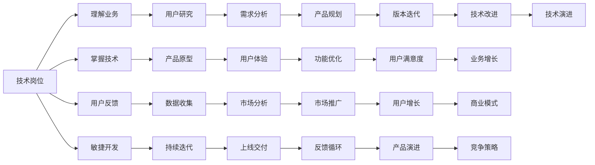

                 

# 从技术岗位到产品经理的转型指南

### 背景介绍

在当今快速变化的科技行业，技术岗位和产品经理是两个极为关键的角色。技术岗位是核心，产品经理则负责产品从需求分析到交付全流程的管理。然而，很多技术人员在追求技术深度和广度时，可能会忽略了产品管理和市场应用的重要性。本文旨在为那些有志于从技术岗位转型到产品经理的工程师提供指导，帮助他们在掌握技术基础的同时，理解产品管理的理念和方法，实现无缝转型。

### 核心概念与联系

#### 3.1 核心概念概述

- **技术岗位（Technical Role）**：负责软件或系统的设计、开发、测试、维护等技术相关工作的岗位，如开发工程师、架构师、数据科学家等。
- **产品经理（Product Manager）**：负责产品的整体管理和规划，包括需求分析、产品设计、市场推广、用户反馈收集等，确保产品能够满足用户需求并实现商业目标。
- **技术产品经理（Technical Product Manager）**：结合技术和管理能力，能够理解和应用技术解决方案，推动产品开发的特殊产品经理角色。
- **敏捷开发（Agile Development）**：通过迭代和增量交付的方式，快速响应市场变化和用户反馈的产品开发模式。
- **用户体验（User Experience, UX）**：关注用户在使用产品时的体验和感受，包括界面设计、交互流程、内容呈现等，提升用户满意度和产品竞争力。

#### 3.2 核心概念原理和架构的 Mermaid 流程图

### 3.3 核心算法原理 & 具体操作步骤

#### 3.1 算法原理概述

技术岗位向产品经理的转型，本质上是将技术视角转向产品视角，理解和应用技术手段实现商业目标。这一过程中，技术知识仍需扎实，但需更加关注市场需求、用户体验和商业策略。

#### 3.2 算法步骤详解

1. **理解业务**：深入了解所负责产品的市场、用户、竞争环境等，确保技术决策与业务目标对齐。
2. **掌握技术**：保持对新技术和工具的持续学习和应用，确保技术决策的前瞻性和可实施性。
3. **用户研究**：通过用户访谈、问卷调查、A/B测试等方式，收集用户反馈，指导产品改进。
4. **敏捷开发**：采用迭代和增量交付的方式，快速响应市场变化和用户需求，持续优化产品。
5. **用户体验**：关注产品的界面设计、交互流程、内容呈现等，提升用户满意度和留存率。
6. **数据驱动**：利用数据分析工具和方法，评估产品表现，指导产品优化和迭代。

#### 3.3 算法优缺点

**优点**：
- 技术背景使得产品决策更具深度和可行性。
- 更理解技术实现的复杂性和成本，更易做出合理的预算和优先级决策。
- 能够与技术团队高效沟通，推动技术实现。

**缺点**：
- 初期的产品经理技能和经验不足，可能导致产品规划和管理缺乏系统性。
- 过于关注技术细节，可能忽视市场和用户需求的长期变化。
- 需要平衡技术深度和产品管理宽度，工作负荷可能较大。

#### 3.4 算法应用领域

技术产品经理的角色适合于各种产品开发领域，特别是那些技术复杂、用户体验要求高、市场竞争激烈的产品，如云计算、大数据、人工智能等前沿技术领域。

### 4. 数学模型和公式 & 详细讲解 & 举例说明

#### 4.1 数学模型构建

对于技术岗位到产品经理的转型，我们不涉及具体的数学模型构建，但可以通过以下数学公式来形象地描述产品生命周期中的关键变量及其相互关系：

$$
\text{Revenue} = \text{Sales} \times \text{Price} \quad \text{(收入 = 销售量 \times 单价)}
$$
$$
\text{Sales} = \text{User Base} \times \text{Conversion Rate} \quad \text{(销售量 = 用户基础 \times 转化率)}
$$
$$
\text{User Base} = \text{Acquisition Rate} \times \text{Retention Rate} \quad \text{(用户基础 = 获取率 \times 留存率)}
$$

#### 4.2 公式推导过程

以上公式推导了产品收入的计算方法，其中每个变量都代表了产品管理中的关键指标：
- **获取率（Acquisition Rate）**：新用户的获取速度和渠道。
- **留存率（Retention Rate）**：用户的长期留存情况，影响用户的重复消费和口碑传播。
- **转化率（Conversion Rate）**：用户从行为到实际购买的过程中的转化效率。
- **单价（Price）**：产品的售价，反映产品定位和市场策略。

通过以上公式，可以构建一个完整的产品收益模型，指导产品经理在产品设计和运营过程中做出合理的决策。

#### 4.3 案例分析与讲解

以社交媒体产品为例，假设该产品的收入模型为：
- **获取率**：通过广告投放、用户推荐等渠道，每月获取1000个新用户。
- **留存率**：用户在前三个月内留存率为30%，之后每年递减5%。
- **转化率**：假设用户在注册后一个月内有20%的概率进行消费，且每次消费平均为20美元。
- **单价**：产品定价为50美元。

将这些数据代入上述公式，计算每月总收入：

$$
\text{User Base} = 1000 \times (0.3 + 0.25 \times 0.95^2 + 0.2 \times 0.90^3 + \cdots) \approx 1900
$$
$$
\text{Sales} = 1900 \times 0.2 \times 20 \approx 7600
$$
$$
\text{Revenue} = 7600 \times 50 = 380,000
$$

可以看出，通过合理的用户获取和留存策略，即使单价和转化率不变，也可以显著提升产品的收入。

### 5. 项目实践：代码实例和详细解释说明

#### 5.1 开发环境搭建

对于从技术岗位到产品经理的转型，我们不需要实际编写代码，但可以模拟一个项目实践的环境来讲解项目管理方法。

1. **环境准备**：
   - **版本控制（Version Control）**：使用Git进行代码版本管理，确保团队协作和代码变更的可追溯性。
   - **项目管理工具（Project Management Tools）**：使用Jira、Trello等工具，进行任务分配、进度跟踪和团队沟通。

2. **团队协作**：
   - **跨职能团队**：组建由开发、设计、市场、运营等多职能组成的团队，确保产品开发各环节紧密衔接。
   - **日常沟通**：通过每日站会（Daily Stand-up）、周回顾（Weekly Review）等方式，保持团队协作和沟通畅通。

3. **用户反馈**：
   - **收集用户反馈**：通过用户访谈、问卷调查、A/B测试等方式，收集用户需求和反馈。
   - **用户画像**：根据用户反馈，构建用户画像，指导产品设计和改进。

#### 5.2 源代码详细实现

由于本部分涉及的是项目管理而非代码实现，因此不需要具体的代码示例。但可以提供一些项目管理工具的使用示例：

1. **GitHub**：
   - 使用GitHub存储代码库，进行版本控制和代码托管。
   - 使用GitHub Issues记录项目问题和任务，进行团队协作。

2. **Jira**：
   - 在Jira中创建项目和任务，进行任务分配和进度跟踪。
   - 使用Jira的Agile板进行看板管理，实时展示任务状态和优先级。

3. **Trello**：
   - 在Trello中创建看板（Board），将任务分为待办、进行中、完成三个状态。
   - 使用Trello的标签（Label）和附件（Attachment）功能，记录任务细节和文件。

#### 5.3 代码解读与分析

由于本部分不涉及代码，因此不需要具体的代码解读与分析。但可以提供一些项目管理工具的使用技巧：

1. **GitHub**：
   - **分支管理**：使用分支（Branch）进行功能开发和问题修复，确保代码变更的安全性和可追溯性。
   - **Pull Request**：在合并代码前，使用Pull Request进行代码审查和讨论，确保代码质量和稳定性。

2. **Jira**：
   - **自定义字段**：根据项目需求，自定义任务字段（Field），记录更多任务细节，如用户需求、技术难度等。
   - **优先级排序**：使用Jira的优先级（Priority）和状态（Status），对任务进行分类和排序，确保团队资源的高效利用。

3. **Trello**：
   - **时间线（Calendar）**：使用Trello的时间线功能，记录任务截止日期和进度，确保项目按时完成。
   - **卡片（Card）模板**：使用卡片模板（Card Template）记录任务详情，如任务描述、参与人、优先级等，提高任务管理的效率。

#### 5.4 运行结果展示

由于本部分涉及的是项目管理而非代码实现，因此不需要具体的运行结果展示。但可以提供一些项目管理工具的使用效果示例：

1. **GitHub**：
   - **代码变更**：展示GitHub中的代码变更记录，确保每个变更都有详细的提交说明和代码审查记录。
   - **分支合并**：展示分支合并的过程，确保新功能的稳定性和可靠性。

2. **Jira**：
   - **任务进度**：展示Jira中的任务进度，确保每个任务都有明确的截止日期和责任人。
   - **代码评审**：展示Pull Request的代码评审记录，确保代码质量和稳定性。

3. **Trello**：
   - **看板状态**：展示Trello中的看板状态，确保每个任务都有明确的优先级和进度。
   - **任务评论**：展示卡片中的任务评论记录，确保团队协作和沟通畅通。

### 6. 实际应用场景

#### 6.1 社交媒体产品

社交媒体产品的成功开发，需要产品经理和技术团队紧密合作。产品经理需要理解用户的需求和行为，设计符合用户习惯的产品界面和功能；技术团队则需要根据需求，设计和实现高效、可靠的技术方案。

**案例分析**：
- **需求分析**：产品经理通过用户访谈和问卷调查，收集用户对社交功能的需求，如动态更新、好友管理等。
- **技术实现**：技术团队根据需求设计API接口和数据库模型，实现动态内容和好友管理的逻辑。
- **用户体验**：设计师根据产品经理的需求，设计简洁美观的用户界面，提升用户的使用体验。
- **测试和部署**：测试团队进行功能测试和性能测试，确保产品稳定可靠；运维团队进行产品部署和监控，确保产品上线后正常运行。

#### 6.2 电子商务平台

电子商务平台的产品经理需要关注订单管理、支付流程、推荐系统等关键功能，确保平台的用户体验和交易效率。

**案例分析**：
- **订单管理**：产品经理设计订单处理流程，确保订单数据的准确性和高效性。
- **支付流程**：产品经理设计安全、便捷的支付流程，确保用户的支付体验。
- **推荐系统**：产品经理设计推荐算法，根据用户行为和偏好，推荐合适的商品，提升用户转化率和复购率。
- **用户反馈**：产品经理收集用户对平台的反馈，不断优化产品功能和用户体验。

#### 6.3 金融科技产品

金融科技产品需要高度关注安全性和合规性，产品经理和技术团队需要紧密合作，确保产品符合金融法规和行业标准。

**案例分析**：
- **安全防护**：产品经理设计安全策略和防护措施，确保用户数据和交易的安全性。
- **合规管理**：产品经理确保产品符合金融法规和行业标准，避免法律风险。
- **用户体验**：产品经理设计简洁、易用的用户界面，提升用户的体验和满意度。
- **性能优化**：产品经理关注系统的性能和稳定性，确保交易流程的高效和安全。

### 7. 工具和资源推荐

#### 7.1 学习资源推荐

1. **《敏捷开发实践指南》**：介绍敏捷开发方法论和最佳实践，适合产品经理和开发人员学习。
2. **《用户故事与用户体验设计》**：讲解用户研究和用户体验设计的基本方法和工具，帮助产品经理深入理解用户需求和设计产品。
3. **《数据驱动的产品管理》**：介绍数据在产品管理中的应用，指导产品经理通过数据分析指导产品决策。

#### 7.2 开发工具推荐

1. **GitHub**：版本控制和代码托管的首选工具，支持团队协作和代码审查。
2. **Jira**：项目管理和任务分配的工具，支持敏捷开发和看板管理。
3. **Trello**：看板管理工具，适合团队协作和任务进度跟踪。

#### 7.3 相关论文推荐

1. **《产品管理中的数据驱动决策》**：介绍如何通过数据分析指导产品决策，提升产品的成功率和用户满意度。
2. **《敏捷开发与产品管理：最佳实践》**：讲解敏捷开发方法和敏捷管理工具的应用，提升产品开发的效率和质量。
3. **《用户体验设计：理论与实践》**：介绍用户体验设计的理论和实践方法，指导产品经理设计优秀的产品界面和交互流程。

### 8. 总结：未来发展趋势与挑战

#### 8.1 未来发展趋势

随着科技的不断进步和市场环境的变化，产品经理的角色和职责也在不断演进。未来，产品经理将更加关注以下几个方面：

1. **数据驱动**：通过数据分析和机器学习技术，指导产品决策，提升产品效果和用户满意度。
2. **用户体验**：关注用户界面设计和交互流程，提升产品的易用性和用户体验。
3. **跨职能协作**：加强技术团队、市场团队、设计团队等多职能团队的协作，确保产品开发的高效和顺利。
4. **敏捷开发**：采用敏捷开发方法，快速响应市场变化和用户需求，持续优化产品。
5. **用户体验设计**：通过用户研究和用户体验设计，提升产品的用户满意度和留存率。

#### 8.2 未来发展趋势

未来产品经理将面临以下挑战：

1. **技术复杂性增加**：随着技术的发展，产品开发的技术难度和复杂性不断增加，产品经理需要持续学习和适应。
2. **市场竞争激烈**：市场竞争日益激烈，产品经理需要快速响应市场变化，确保产品的竞争力和市场份额。
3. **用户体验设计**：提升用户体验需要设计师和产品经理紧密合作，确保产品设计符合用户需求和习惯。
4. **数据驱动决策**：通过数据驱动决策，产品经理需要具备数据处理和分析能力，指导产品优化和迭代。
5. **跨职能协作**：产品经理需要加强跨职能团队的协作，确保产品开发的高效和顺利。

#### 8.4 研究展望

未来产品经理的研究方向将更加关注以下几个方面：

1. **数据科学应用**：通过数据科学和机器学习技术，指导产品决策，提升产品效果和用户满意度。
2. **用户体验设计**：通过用户研究和用户体验设计，提升产品的易用性和用户体验。
3. **跨职能协作**：加强技术团队、市场团队、设计团队等多职能团队的协作，确保产品开发的高效和顺利。
4. **敏捷开发**：采用敏捷开发方法，快速响应市场变化和用户需求，持续优化产品。
5. **用户体验设计**：通过用户研究和用户体验设计，提升产品的用户满意度和留存率。

### 9. 附录：常见问题与解答

**Q1：从技术岗位转型到产品经理需要哪些技能？**

A: 从技术岗位转型到产品经理，需要掌握以下几个关键技能：
- **产品规划和策略制定**：理解市场需求和用户行为，制定产品策略和规划。
- **用户体验设计**：设计简洁、易用的用户界面和交互流程，提升用户体验。
- **跨职能协作**：与技术团队、设计团队、市场团队等多职能团队紧密协作，确保产品开发的高效和顺利。
- **敏捷开发方法**：采用敏捷开发方法，快速响应市场变化和用户需求，持续优化产品。
- **数据驱动决策**：通过数据分析和机器学习技术，指导产品决策，提升产品效果和用户满意度。

**Q2：产品经理需要具备哪些项目管理工具？**

A: 产品经理需要掌握以下几个常用的项目管理工具：
- **GitHub**：版本控制和代码托管工具，支持团队协作和代码审查。
- **Jira**：项目管理和任务分配工具，支持敏捷开发和看板管理。
- **Trello**：看板管理工具，适合团队协作和任务进度跟踪。
- **Confluence**：文档管理和知识共享工具，适合团队协作和文档管理。
- **Slack**：团队协作和沟通工具，支持实时通信和文件共享。

**Q3：产品经理如何收集用户反馈？**

A: 产品经理可以通过以下方式收集用户反馈：
- **用户访谈**：通过面对面访谈，深入了解用户需求和痛点。
- **问卷调查**：设计问卷，收集大量用户的反馈和意见。
- **A/B测试**：设计多个版本的产品界面或功能，通过测试结果选择最佳方案。
- **用户画像**：根据用户行为和反馈，构建详细的用户画像，指导产品设计和优化。

---

作者：禅与计算机程序设计艺术 / Zen and the Art of Computer Programming

