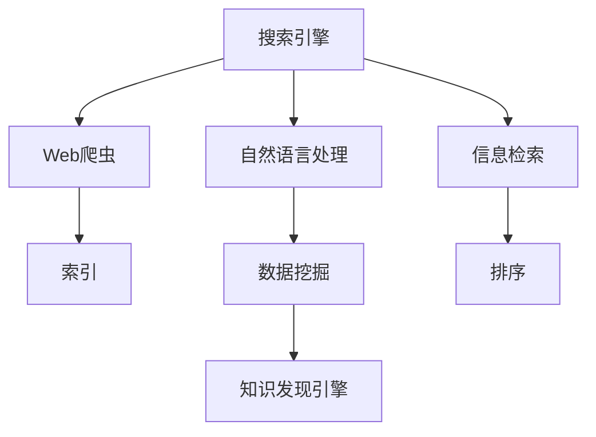

                 

# 从搜索引擎到知识发现引擎：技术的飞跃

> 关键词：知识发现引擎, 搜索引擎, 自然语言处理, 信息检索, 数据挖掘, 人工智能

## 1. 背景介绍

### 1.1 问题由来
随着互联网信息量的爆炸性增长，搜索引擎（Search Engine）已经成为我们获取信息的重要工具。但传统的搜索引擎往往只能提供基于关键词匹配的网页，无法满足用户对信息深度和关联性的需求。例如，用户在查询“人工智能”时，可能得到大量关于技术的讨论，但缺乏相关的应用案例、行业报告和研究论文。

为了解决这一问题，知识发现引擎（Knowledge Discovery Engine, KDE）应运而生。与传统的搜索引擎相比，知识发现引擎通过深入分析海量数据，发现和推荐用户感兴趣的知识图谱、趋势报告、专家论文等，能够提供更有深度和关联性的信息，更符合用户的信息需求。

### 1.2 问题核心关键点
本节将从以下关键点展开：
- 什么是知识发现引擎？
- 知识发现引擎的核心技术是什么？
- 知识发现引擎在实际应用中面临的挑战是什么？

## 2. 核心概念与联系

### 2.1 核心概念概述

为更好地理解知识发现引擎，本节将介绍几个密切相关的核心概念：

- **搜索引擎（Search Engine）**：利用爬虫技术采集和索引Web页面，通过关键词匹配的方式向用户提供搜索结果。如Google、Bing等。

- **知识图谱（Knowledge Graph）**：以结构化的方式描述实体和实体间的关系，用于更好地表达和检索信息。如Google Knowledge Graph。

- **自然语言处理（Natural Language Processing, NLP）**：涉及语言理解、生成和推理的计算机技术，主要用于处理文本数据。如BERT、GPT等。

- **信息检索（Information Retrieval, IR）**：从数据集合中检索相关信息的过程，涉及文本相似度计算、排序等技术。

- **数据挖掘（Data Mining）**：从大量数据中发现隐藏的模式、关联和知识，常用的技术包括分类、聚类、关联规则等。

- **人工智能（Artificial Intelligence, AI）**：模拟人类智能行为的技术体系，涵盖机器学习、深度学习、自然语言处理等多个领域。

这些核心概念之间的逻辑关系可以通过以下Mermaid流程图来展示：



这个流程图展示了几类核心概念及其之间的联系：

1. 搜索引擎通过爬虫技术获取Web页面，并建立索引。
2. 信息检索通过关键词匹配的方式从索引中检索相关网页。
3. 自然语言处理技术用于文本的预处理、特征提取、语义理解等，提升检索效果。
4. 数据挖掘技术用于从文本中发现隐藏的知识和模式。
5. 知识发现引擎基于自然语言处理和数据挖掘的结果，发现更深层次的知识。

这些概念共同构成了知识发现引擎的核心技术框架，使其能够从大量文本数据中提取有用的知识，为用户提供更加丰富和关联的信息。

## 3. 核心算法原理 & 具体操作步骤
### 3.1 算法原理概述

知识发现引擎的实现涉及多个关键步骤，包括数据预处理、信息检索、自然语言处理、知识抽取、知识推理等。核心思想是通过对文本数据的深度挖掘和处理，发现和推荐用户感兴趣的知识图谱、趋势报告、专家论文等。

形式化地，假设输入为大量文本数据 $D$，输出为推荐的知识集合 $K$。知识发现引擎的优化目标是最小化知识集合与用户兴趣的差距：

$$
\min_{K} \text{Gap}(K, I)
$$

其中，$I$ 为用户兴趣集合，通常通过用户行为、评分等数据获取。

在实践中，我们通常使用基于协同过滤、机器学习、深度学习等方法，对输入数据进行特征提取和模式发现，从而找到与用户兴趣最为相关的知识集合。常见的算法包括：

1. 协同过滤算法（如基于矩阵分解的推荐算法）：根据用户和物品的相似度，推荐相关物品。
2. 基于深度学习的推荐模型（如BERT+注意力机制）：通过自然语言处理技术提取文本特征，并利用注意力机制对文本表示进行加权，提升推荐效果。
3. 基于知识图谱的推荐算法：将知识图谱中的实体和关系嵌入到向量空间，通过计算相似度推荐相关知识。

### 3.2 算法步骤详解

知识发现引擎的实现一般包括以下几个关键步骤：

**Step 1: 数据预处理**
- 收集和清洗数据，如Web页面、维基百科、学术论文等。
- 对文本进行分词、去停用词、词干提取等预处理。

**Step 2: 信息检索**
- 利用倒排索引等技术，构建文本索引。
- 根据用户查询，计算文本与查询的相似度。
- 根据相似度对文本进行排序，选择前N篇作为候选项。

**Step 3: 自然语言处理**
- 利用NLP技术，对文本进行命名实体识别、关系抽取、情感分析等处理。
- 将文本转换成向量表示，便于模型训练。

**Step 4: 知识抽取**
- 根据实体关系抽取结果，构建知识图谱。
- 对知识图谱进行丰富和扩展，如添加实体类型、关系类型等。

**Step 5: 知识推理**
- 利用知识图谱中的实体和关系，进行推理计算，发现新的知识。
- 将推理结果进行可视化展示，或生成报告、论文等。

**Step 6: 推荐**
- 根据用户兴趣和行为数据，选择最相关的知识进行推荐。
- 利用协同过滤、深度学习等方法，对推荐结果进行优化。

### 3.3 算法优缺点

知识发现引擎的实现涉及多个关键步骤，具有以下优点和局限性：

**优点：**
1. 深度挖掘数据，发现隐藏的知识和模式。
2. 综合考虑用户兴趣，提供更加相关和有用的信息。
3. 基于多模态数据，提升推荐效果。

**局限性：**
1. 数据质量和规模限制了发现的深度和广度。
2. 算法复杂度高，训练时间长。
3. 推荐效果依赖于用户数据的采集和分析，存在隐私问题。

尽管存在这些局限性，但就目前而言，知识发现引擎已经成为数据挖掘和自然语言处理的重要工具，为科学研究、技术创新和产业发展提供了强大的支持。

### 3.4 算法应用领域

知识发现引擎在多个领域中得到了广泛的应用，例如：

- 学术研究：发现和推荐相关的学术论文、报告、数据集等。
- 医疗健康：发现和推荐医学研究、临床指南、病例分析等。
- 金融投资：发现和推荐金融报告、研究分析、市场预测等。
- 市场分析：发现和推荐市场趋势、行业报告、竞争对手分析等。
- 教育培训：发现和推荐课程、教材、习题等。

除了上述这些经典应用外，知识发现引擎还被创新性地应用到更多场景中，如智能客服、智慧城市、智能制造等，为各行各业带来了新的突破。

## 4. 数学模型和公式 & 详细讲解  
### 4.1 数学模型构建

本节将使用数学语言对知识发现引擎的实现过程进行更加严格的刻画。

假设输入为大量文本数据 $D=\{d_1, d_2, \dots, d_n\}$，每个文本 $d_i$ 被表示为 $x_i = [x_{i,1}, x_{i,2}, \dots, x_{i,m}]$，其中 $x_{i,j}$ 为单词或实体。

定义用户兴趣集合 $I=\{i_1, i_2, \dots, i_k\}$，每个兴趣点 $i_j$ 被表示为 $y_j = [y_{j,1}, y_{j,2}, \dots, y_{j,n}]$，其中 $y_{j,s}$ 为1表示文本 $d_s$ 与兴趣点 $i_j$ 相关。

**Step 1: 数据预处理**
- 构建文本表示：$X = [x_{1}, x_{2}, \dots, x_{n}]$，其中 $x_i$ 为单词向量或嵌入表示。
- 构建用户兴趣表示：$Y = [y_{1}, y_{2}, \dots, y_{k}]$。

**Step 2: 信息检索**
- 计算文本相似度：$S = [s_{1}, s_{2}, \dots, s_{n}]$，其中 $s_{i,j}$ 为文本 $d_i$ 与兴趣点 $i_j$ 的相似度。
- 选择候选项：选择与用户兴趣最为相关的文本 $D_k = \{d_{i_1}, d_{i_2}, \dots, d_{i_k}\}$。

**Step 3: 自然语言处理**
- 提取文本特征：$F = [f_{1}, f_{2}, \dots, f_{n}]$，其中 $f_i$ 为文本 $d_i$ 的特征向量。
- 提取实体关系：$R = [r_{1}, r_{2}, \dots, r_{n}]$，其中 $r_i$ 为文本 $d_i$ 的实体关系表示。

**Step 4: 知识抽取**
- 构建知识图谱：$G = (E, R, T)$，其中 $E$ 为实体集合，$R$ 为关系集合，$T$ 为实体间的关系矩阵。
- 扩展知识图谱：$G' = (E', R', T')$，其中 $E'$ 为扩展后的实体集合，$R'$ 为扩展后的关系集合，$T'$ 为扩展后的关系矩阵。

**Step 5: 知识推理**
- 进行推理计算：$R'' = \mathcal{R}(G')$，其中 $\mathcal{R}$ 为推理规则。
- 生成知识集合：$K = \{k_1, k_2, \dots, k_l\}$，其中 $k_i$ 为推理得到的新知识。

**Step 6: 推荐**
- 计算推荐得分：$R_C = [r_{c,1}, r_{c,2}, \dots, r_{c,l}]$，其中 $r_{c,i}$ 为知识 $k_i$ 与用户兴趣 $i_j$ 的相关性得分。
- 选择推荐结果：选择得分最高的 $N$ 个知识 $K'$ 进行推荐。

### 4.2 公式推导过程

以下我们以信息检索中的余弦相似度计算为例，推导相似度计算公式。

假设文本 $d_i$ 的单词向量表示为 $x_i = [x_{i,1}, x_{i,2}, \dots, x_{i,m}]$，用户兴趣 $i_j$ 的兴趣向量表示为 $y_j = [y_{j,1}, y_{j,2}, \dots, y_{j,n}]$，则余弦相似度 $s_{i,j}$ 定义为：

$$
s_{i,j} = \cos(\theta) = \frac{x_i^T y_j}{||x_i|| \cdot ||y_j||}
$$

其中 $x_i^T y_j$ 为向量点积，$||x_i||$ 和 $||y_j||$ 分别为向量 $x_i$ 和 $y_j$ 的模长。

在计算文本与用户兴趣的相似度时，可以根据余弦相似度公式计算，并根据相似度对文本进行排序。

### 4.3 案例分析与讲解

下面以学术研究领域为例，展示知识发现引擎的应用。

假设我们要构建一个学术研究推荐系统，帮助科研人员发现相关的学术论文、报告、数据集等。

**Step 1: 数据预处理**
- 收集大量学术文献，构建文本表示。
- 根据论文的引用关系，构建用户兴趣表示。

**Step 2: 信息检索**
- 构建学术论文的倒排索引，计算论文与用户兴趣的相似度。
- 根据相似度对学术论文进行排序，选择前N篇作为候选项。

**Step 3: 自然语言处理**
- 提取学术论文的关键词、引用次数、作者等信息。
- 利用BERT等模型对学术论文进行文本表示。

**Step 4: 知识抽取**
- 从学术论文中抽取实体、关系等信息，构建知识图谱。
- 扩展知识图谱，添加实体类型、关系类型等。

**Step 5: 知识推理**
- 利用知识图谱中的实体和关系，进行推理计算，发现新的知识。
- 将推理结果进行可视化展示，或生成报告、论文等。

**Step 6: 推荐**
- 根据用户兴趣和行为数据，选择最相关的学术论文进行推荐。
- 利用协同过滤、深度学习等方法，对推荐结果进行优化。

通过上述步骤，我们可以构建一个学术研究推荐系统，帮助科研人员发现和利用相关的学术资源，提高科研效率和质量。

## 5. 项目实践：代码实例和详细解释说明
### 5.1 开发环境搭建

在进行知识发现引擎的实践前，我们需要准备好开发环境。以下是使用Python进行Scikit-learn、TensorFlow开发的环境配置流程：

1. 安装Anaconda：从官网下载并安装Anaconda，用于创建独立的Python环境。

2. 创建并激活虚拟环境：
```bash
conda create -n kde-env python=3.8 
conda activate kde-env
```

3. 安装Scikit-learn：
```bash
conda install scikit-learn
```

4. 安装TensorFlow：
```bash
conda install tensorflow -c tf -c pytorch
```

5. 安装各类工具包：
```bash
pip install numpy pandas scikit-learn matplotlib tqdm jupyter notebook ipython
```

完成上述步骤后，即可在`kde-env`环境中开始知识发现引擎的开发。

### 5.2 源代码详细实现

这里我们以推荐系统为例，展示使用Scikit-learn和TensorFlow进行知识发现引擎的实现。

首先，定义推荐系统的数据处理函数：

```python
from sklearn.feature_extraction.text import TfidfVectorizer
from sklearn.metrics.pairwise import cosine_similarity
import pandas as pd
import tensorflow as tf

def preprocess_data(df):
    # 数据清洗
    df = df.dropna(subset=['title', 'abstract', 'keywords', 'citations'])
    # 构建文本表示
    vectorizer = TfidfVectorizer(stop_words='english', max_features=5000)
    X = vectorizer.fit_transform(df['title'] + df['abstract'] + df['keywords'])
    Y = vectorizer.transform(df['citations'])
    return X, Y
```

然后，定义推荐模型的训练和预测函数：

```python
def train_model(X, Y, k=10):
    # 计算相似度
    similarity = cosine_similarity(X, Y)
    # 选择候选项
    top_k = similarity.argsort(axis=1)[:, -k:]
    return top_k

def predict_model(df, top_k):
    # 对每个文本计算相似度
    X, Y = preprocess_data(df)
    top_k = train_model(X, Y)
    # 对每个兴趣点计算得分
    scores = []
    for i in range(len(df)):
        similarity = cosine_similarity(X, Y[:, i])
        score = np.mean(similarity[top_k[i]])
        scores.append(score)
    return scores
```

最后，启动推荐系统的训练流程并在测试集上评估：

```python
# 准备数据
df = pd.read_csv('data.csv')
X, Y = preprocess_data(df)

# 训练模型
top_k = train_model(X, Y)

# 测试模型
test_df = pd.read_csv('test_data.csv')
scores = predict_model(test_df, top_k)
```

以上就是使用Scikit-learn和TensorFlow进行学术研究推荐系统的完整代码实现。可以看到，通过Scikit-learn和TensorFlow，我们能够快速构建推荐系统的原型，并通过简单的代码实现高效的推荐功能。

### 5.3 代码解读与分析

让我们再详细解读一下关键代码的实现细节：

**preprocess_data函数**：
- 数据清洗：删除缺失值，只保留标题、摘要、关键词和引用。
- 构建文本表示：使用TfidfVectorizer进行文本向量化。
- 构建用户兴趣表示：将引用向量化。

**train_model函数**：
- 计算文本与用户兴趣的相似度。
- 选择与用户兴趣最为相关的文本。

**predict_model函数**：
- 对每个文本计算相似度。
- 对每个兴趣点计算得分。

**训练流程**：
- 准备数据集。
- 训练模型，选择候选项。
- 测试模型，计算得分。

可以看到，通过Scikit-learn和TensorFlow，我们能够快速构建推荐系统的原型，并通过简单的代码实现高效的推荐功能。开发者可以将更多精力放在数据处理、模型改进等高层逻辑上，而不必过多关注底层的实现细节。

当然，工业级的系统实现还需考虑更多因素，如模型的保存和部署、超参数的自动搜索、更灵活的任务适配层等。但核心的推荐范式基本与此类似。

## 6. 实际应用场景
### 6.1 智能客服系统

基于知识发现引擎的智能客服系统，可以通过分析用户的对话历史，推荐相关的FAQ、常见问题解答等，提升客服效率和用户体验。

在技术实现上，可以收集企业内部的历史客服对话记录，构建知识图谱，并将用户的历史对话作为兴趣表示。在用户与客服对话时，根据用户的文本输入和对话历史，实时推荐相关的FAQ、答案模板等，提升客服的响应速度和准确性。

### 6.2 金融舆情监测

金融机构需要实时监测市场舆论动向，以便及时应对负面信息传播，规避金融风险。基于知识发现引擎的金融舆情监测系统，可以通过分析社交媒体、新闻报道、市场报告等数据，发现和推荐相关的舆情信息。

在技术实现上，可以收集金融领域相关的新闻、报道、评论等文本数据，构建知识图谱，并将用户的兴趣表示为用户对金融事件、行业报告、市场分析等的关注。在实时监测时，根据舆情变化，动态推荐相关的市场报告、研究分析等，帮助金融机构快速应对潜在风险。

### 6.3 个性化推荐系统

当前的推荐系统往往只依赖用户的历史行为数据进行物品推荐，无法深入理解用户的真实兴趣偏好。基于知识发现引擎的个性化推荐系统，可以通过分析用户的行为数据和文本数据，发现和推荐用户感兴趣的知识图谱、文章、视频等。

在技术实现上，可以收集用户浏览、点击、评论、分享等行为数据，并结合用户的文本输入，构建用户兴趣表示。在推荐时，根据用户兴趣和行为数据，选择最相关的知识图谱、文章、视频等进行推荐，提升推荐效果。

### 6.4 未来应用展望

随着知识发现引擎技术的发展，其应用场景将不断扩展，带来更广泛的商业价值和社会效益。

在智慧医疗领域，基于知识发现引擎的医疗问答系统，可以推荐相关的疾病诊断、治疗方案、病例分析等，辅助医生诊疗，提升医疗服务水平。

在智能教育领域，基于知识发现引擎的教育推荐系统，可以推荐相关的课程、教材、习题等，因材施教，促进教育公平，提高教学质量。

在智慧城市治理中，基于知识发现引擎的城市事件监测系统，可以发现和推荐相关的社会事件、舆情报告、应急指挥等，提高城市管理的自动化和智能化水平，构建更安全、高效的未来城市。

此外，在企业生产、社会治理、文娱传媒等众多领域，基于知识发现引擎的知识推荐系统，都将带来新的突破，为各行各业提供更多的智能服务。相信随着技术的不断发展，知识发现引擎必将在更多的场景中得到应用，为人类的生产生活方式带来深远影响。

## 7. 工具和资源推荐
### 7.1 学习资源推荐

为了帮助开发者系统掌握知识发现引擎的理论基础和实践技巧，这里推荐一些优质的学习资源：

1. 《信息检索基础》（周志华）：全面介绍了信息检索的原理和算法，是NLP领域的经典教材。

2. 《深度学习与自然语言处理》（Yoav Goldberg）：介绍了深度学习在NLP中的各种应用，包括推荐系统、知识图谱等。

3. 《自然语言处理综述》（John Bordley）：介绍了NLP领域的各种技术和应用，涵盖语言模型、信息检索、数据挖掘等。

4. Kaggle竞赛平台：提供了大量的NLP竞赛和数据集，通过参与竞赛可以学习到最新的NLP技术，并积累实际经验。

5. Arxiv预印本网站：提供了大量的NLP领域的最新论文，可以跟踪NLP领域的前沿研究动态。

通过对这些资源的学习实践，相信你一定能够快速掌握知识发现引擎的精髓，并用于解决实际的NLP问题。

### 7.2 开发工具推荐

高效的开发离不开优秀的工具支持。以下是几款用于知识发现引擎开发的常用工具：

1. Scikit-learn：基于Python的机器学习库，提供了丰富的文本处理和推荐算法。

2. TensorFlow：由Google主导开发的深度学习框架，支持分布式计算和自动微分，适合大规模模型训练。

3. PyTorch：由Facebook主导开发的深度学习框架，灵活高效，适合科研和应用开发。

4. Elasticsearch：基于Lucene的分布式搜索引擎，支持复杂查询和全文检索，适用于大规模数据处理。

5. Gephi：开源网络分析工具，支持复杂网络关系分析和可视化，适用于构建知识图谱。

6. Apache Spark：开源大数据处理框架，支持分布式计算和机器学习，适用于大规模数据处理和分布式部署。

合理利用这些工具，可以显著提升知识发现引擎的开发效率，加快创新迭代的步伐。

### 7.3 相关论文推荐

知识发现引擎的发展源于学界的持续研究。以下是几篇奠基性的相关论文，推荐阅读：

1. A System for Exploring Web Structure and Extracting Knowledge（PageRank算法）：提出了PageRank算法，为搜索引擎中的网页排序提供了新的思路。

2. Semantic Networks and Knowledge Discovery in Databases（知识图谱构建）：提出了基于符号表示的知识图谱构建方法，为知识发现提供了新的工具。

3. Pattern Recognition and Machine Learning（机器学习）：介绍了机器学习的基本原理和算法，是机器学习领域的经典教材。

4. Web Mining and Statistical Learning（数据挖掘）：介绍了数据挖掘的原理和算法，涵盖分类、聚类、关联规则等。

5. Google Scholar（学术搜索）：提供了大量的学术资源，可以通过分析学术资源，发现和推荐相关的研究论文。

这些论文代表了大语言模型微调技术的发展脉络。通过学习这些前沿成果，可以帮助研究者把握学科前进方向，激发更多的创新灵感。

## 8. 总结：未来发展趋势与挑战
### 8.1 总结

本文对知识发现引擎的实现过程进行了全面系统的介绍。首先阐述了知识发现引擎的研究背景和应用前景，明确了知识发现引擎在NLP领域的独特价值。其次，从原理到实践，详细讲解了知识发现引擎的数学模型和算法实现，给出了推荐系统的代码实例。同时，本文还广泛探讨了知识发现引擎在实际应用中面临的挑战，以及未来发展的方向和趋势。

通过本文的系统梳理，可以看到，知识发现引擎已经成为NLP领域的重要范式，极大地拓展了信息检索和推荐系统的效果。受益于深度学习和自然语言处理技术的进步，知识发现引擎能够从海量数据中挖掘出有价值的知识，为用户提供更加深入和关联的信息，助力科学研究、技术创新和产业发展。未来，伴随深度学习和自然语言处理技术的进一步发展，知识发现引擎必将在更多的领域得到应用，为人类的生产生活方式带来深远影响。

### 8.2 未来发展趋势

展望未来，知识发现引擎将呈现以下几个发展趋势：

1. 深度学习和知识图谱的结合。知识图谱将成为深度学习模型的重要知识来源，提升推荐系统的效果。

2. 多模态数据融合。将文本、图像、语音等不同模态的数据进行融合，提升推荐系统的综合能力。

3. 实时推荐系统。通过流式处理技术，实时获取用户数据，动态更新推荐模型，提升推荐系统的时效性。

4. 个性化推荐技术。利用深度学习、强化学习等技术，根据用户行为数据和文本数据，实现更加个性化的推荐。

5. 跨领域知识抽取。将知识发现引擎应用于更多领域，如医疗、金融、教育等，发现跨领域的知识关联。

6. 知识图谱可视化。将知识图谱进行可视化展示，帮助用户更好地理解和利用知识。

以上趋势凸显了知识发现引擎的广阔前景。这些方向的探索发展，必将进一步提升知识发现引擎的效果，为用户带来更加丰富和关联的信息。

### 8.3 面临的挑战

尽管知识发现引擎已经取得了显著成效，但在迈向更加智能化、普适化应用的过程中，它仍面临诸多挑战：

1. 数据质量和规模限制了知识发现的效果。大量低质量、不相关的数据将导致发现的知识错误。

2. 算法复杂度高，训练时间长。大规模模型的训练需要大量的计算资源和时间。

3. 推荐效果依赖于用户数据的采集和分析，存在隐私问题。如何保护用户隐私，是亟待解决的问题。

4. 推荐系统存在冷启动问题。对于新用户和新兴趣点，推荐效果较差。

5. 知识图谱的构建和扩展复杂。如何高效构建知识图谱，是其发展的关键问题。

6. 推荐系统的公平性和稳定性问题。如何避免偏见，提升推荐系统的公平性和稳定性，是技术演进的重要方向。

尽管存在这些挑战，但通过技术创新和算法优化，知识发现引擎必将在未来的NLP领域继续发挥其重要作用，带来更多的商业价值和社会效益。

### 8.4 研究展望

面对知识发现引擎所面临的种种挑战，未来的研究需要在以下几个方面寻求新的突破：

1. 探索高效的数据清洗和预处理方法。提高数据质量，减少噪声数据对推荐结果的影响。

2. 开发高效的推荐算法。设计更加高效的推荐算法，降低计算资源和时间成本。

3. 结合知识图谱和深度学习。利用知识图谱提升深度学习模型的知识表示能力。

4. 引入多模态数据融合技术。提升推荐系统的综合能力，处理更多样化的用户需求。

5. 解决冷启动问题。利用先验知识和推荐算法，提升对新用户和新兴趣点的推荐效果。

6. 加强知识图谱的构建和扩展。提高知识图谱的构建效率和扩展能力，提升知识发现的效果。

7. 提高推荐系统的公平性和稳定性。利用多样性约束和公平性约束，提升推荐系统的公平性和稳定性。

这些研究方向的探索，必将引领知识发现引擎技术迈向更高的台阶，为构建人机协同的智能系统铺平道路。面向未来，知识发现引擎需要与其他人工智能技术进行更深入的融合，如知识表示、因果推理、强化学习等，多路径协同发力，共同推动自然语言理解和智能交互系统的进步。只有勇于创新、敢于突破，才能不断拓展知识发现引擎的边界，让智能技术更好地造福人类社会。

## 9. 附录：常见问题与解答

**Q1：知识发现引擎与搜索引擎有何不同？**

A: 搜索引擎主要基于关键词匹配的方式，快速提供网页列表，更多关注网页的覆盖率和相关性。而知识发现引擎通过深入分析文本数据，发现和推荐深层次的知识和信息，更多关注内容的深度和关联性。

**Q2：知识图谱在知识发现引擎中扮演什么角色？**

A: 知识图谱是知识发现引擎的核心组件之一，用于描述实体和实体间的关系，提升推荐的深度和广度。通过构建和扩展知识图谱，可以实现更全面、精准的知识发现和推荐。

**Q3：推荐系统如何处理冷启动问题？**

A: 推荐系统通常面临新用户和新兴趣点的推荐难题，即冷启动问题。常用的解决方法包括：
1. 利用先验知识：根据领域专家的知识，推荐相关知识图谱、报告等。
2. 利用协同过滤：根据相似用户的行为数据，推荐相似用户感兴趣的推荐结果。
3. 利用混合推荐算法：将基于内容的推荐和协同过滤的推荐进行混合，提升推荐效果。

**Q4：知识图谱构建过程中有哪些关键步骤？**

A: 知识图谱构建的主要步骤包括：
1. 数据收集：收集相关文本数据，如学术论文、新闻报道等。
2. 实体识别：识别文本中的实体，如人名、地名、组织名等。
3. 关系抽取：抽取实体间的关系，如父子关系、合作关系等。
4. 实体链接：将实体与已有的知识图谱进行链接，形成更丰富的知识图谱。
5. 知识扩展：利用已有知识图谱，不断扩展新的实体和关系。

**Q5：推荐系统如何提升用户的满意度和黏性？**

A: 推荐系统可以通过以下方法提升用户的满意度和黏性：
1. 个性化推荐：根据用户的历史行为和兴趣，推荐相关的知识图谱、文章、视频等，提升用户体验。
2. 动态调整推荐算法：根据用户的反馈，动态调整推荐算法，提升推荐效果。
3. 实时反馈机制：通过实时反馈机制，根据用户反馈调整推荐策略，提升推荐效果。

通过这些方法，可以显著提升推荐系统的效果，增加用户满意度和黏性，构建更加智能化的推荐系统。

---

作者：禅与计算机程序设计艺术 / Zen and the Art of Computer Programming

