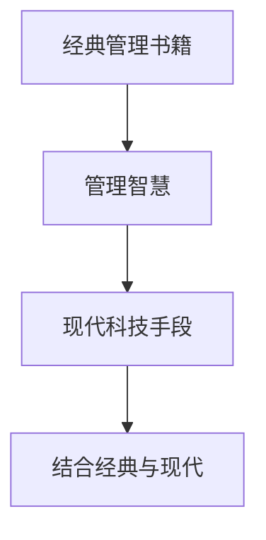

                 

# 从经典书籍中汲取管理智慧

## 1. 背景介绍

### 1.1 问题由来
在现代商业社会中，管理智慧被认为是组织成功的关键要素之一。经典的管理书籍为企业家和领导者提供了丰富的管理实践和理论指导，这些书籍通过作者自身的经验、研究和观察，总结了成功管理的精髓和策略。然而，随着科技的进步和社会的发展，许多经典书籍中提出的理论和实践方法是否依然有效，以及如何结合现代技术手段，提升管理效果，成为了新的研究课题。

### 1.2 问题核心关键点
在实际应用中，如何有效利用经典书籍中的管理智慧，并结合现代科技手段，优化管理实践，是管理领域的一个重要问题。本文将从以下几个方面探讨这一问题：
- 经典书籍的管理智慧
- 现代技术手段在管理中的应用
- 结合经典书籍与现代技术的管理实践

## 2. 核心概念与联系

### 2.1 核心概念概述

为更好地理解如何从经典书籍中汲取管理智慧，本节将介绍几个密切相关的核心概念：

- **经典管理书籍**：如彼得·德鲁克的《卓有成效的管理者》、迈克尔·波特的《竞争战略》、亨利·明茨伯格的《领导力的五个层次》等，这些书籍提供了丰富实用的管理理论和方法。

- **管理智慧**：指通过阅读和管理实践积累起来的宝贵经验和见解，包括战略规划、组织结构设计、人力资源管理、领导力培养等方面。

- **现代科技手段**：如人工智能、大数据、云计算、区块链等，这些技术为现代管理提供了新的工具和视角，能够实现更高效、更智能的管理决策。

- **结合经典与现代**：指将经典管理书籍中的管理智慧与现代科技手段相结合，进行创新的管理实践，提升组织的竞争力。

这些核心概念之间的逻辑关系可以通过以下Mermaid流程图来展示：



这个流程图展示经典管理书籍、管理智慧、现代科技手段和结合经典与现代这四个核心概念之间的逻辑关系：

1. 经典管理书籍通过作者的总结和实践，提炼出管理智慧。
2. 现代科技手段提供了新的管理工具和视角。
3. 结合经典书籍和现代科技，实现了创新的管理实践。

## 3. 核心算法原理 & 具体操作步骤
### 3.1 算法原理概述

结合经典书籍与现代科技进行管理实践，本质上是一种创新的融合范式。其核心思想是：将经典管理书籍中的管理智慧与现代科技手段相结合，通过技术手段优化和创新管理方法，实现更高效、更智能的管理决策。

形式化地，假设有一本经典管理书籍，其中包含的管理智慧可以表示为 $\mathcal{W}$，而现代科技手段可以表示为 $\mathcal{T}$。结合经典与现代的管理实践方法可以表示为 $\mathcal{P}$。则目标是通过最优化的策略 $\mathcal{S}$，使得管理实践方法 $\mathcal{P}$ 在给定的约束条件下，最大化管理效果 $E$。即：

$$
\mathcal{P} = \mathcal{W} \cup \mathcal{T}
$$

$$
\mathcal{S} = \mathop{\arg\min}_{S} \{E(\mathcal{P}, S)\} \text{ subject to } \mathcal{C}
$$

其中 $\mathcal{C}$ 表示管理实践的约束条件，可能包括资源限制、法规政策、企业文化等。

通过迭代优化策略 $\mathcal{S}$，可以逐步找到最佳的管理实践方法 $\mathcal{P}$，实现管理效果的最大化。

### 3.2 算法步骤详解

结合经典书籍与现代科技进行管理实践的一般步骤包括：

**Step 1: 分析经典书籍的管理智慧**
- 阅读经典书籍，提取其中的管理智慧，如领导力、组织设计、战略规划、人力资源管理等。
- 分析管理智慧在不同行业、不同情境下的适用性，识别核心要素和关键策略。

**Step 2: 研究现代科技手段**
- 了解现代科技手段的特点和应用场景，如人工智能、大数据、云计算、区块链等。
- 分析科技手段对管理决策的影响，识别技术优势和局限性。

**Step 3: 设计管理实践方法**
- 将经典管理智慧与现代科技手段相结合，设计创新的管理实践方法。
- 设计过程中应注重用户体验、组织效率、资源利用等方面的优化。

**Step 4: 实施和管理实践**
- 根据设计方案，制定详细的实施计划，包括时间表、资源配置、风险控制等。
- 在实施过程中，及时收集反馈，根据实际情况进行调整和优化。

**Step 5: 评估和持续改进**
- 使用定量或定性的方法，评估管理实践的效果，如财务指标、员工满意度、客户满意度等。
- 根据评估结果，持续改进管理实践，提升管理效果。

### 3.3 算法优缺点

结合经典书籍与现代科技进行管理实践的方法具有以下优点：
1. 结合经典管理智慧与现代科技，能产生更全面、多维的管理视角和方法。
2. 经典管理书籍提供了经过验证的管理理论和方法，降低了管理实践的风险。
3. 现代科技手段提供了高效、智能的管理工具，提升了管理决策的效率和精度。
4. 结合经典与现代的管理实践，能更好地应对复杂多变的商业环境。

同时，该方法也存在一些局限性：
1. 经典书籍与现代科技之间存在一定的时代差异，部分管理智慧和科技手段可能不适应当前的管理情境。
2. 经典书籍的管理智慧可能过于理论化，缺乏具体的操作指导。
3. 现代科技手段的应用需要较高的技术水平和管理水平，对管理者的要求较高。
4. 结合经典与现代的管理实践，需要更多的跨学科知识和综合能力。

尽管存在这些局限性，但整体而言，结合经典书籍与现代科技进行管理实践的方法仍然具有显著的优势和广阔的应用前景。

### 3.4 算法应用领域

结合经典书籍与现代科技进行管理实践的方法在多个领域都有广泛的应用：

- **企业管理**：通过结合经典书籍和现代科技，如人工智能和大数据分析，优化企业的战略规划、组织结构设计、人力资源管理等，提升企业的整体管理效率和竞争力。

- **人力资源管理**：结合经典人力资源管理理论，如德鲁克的《卓有成效的管理者》，以及现代科技手段，如人工智能招聘平台，实现更精准的人才招聘和员工管理。

- **市场营销**：结合经典营销理论，如波特的《竞争战略》，以及现代科技手段，如大数据分析和社交媒体营销，制定更有效的市场策略，提升市场竞争力。

- **供应链管理**：结合经典供应链管理理论，如明茨伯格的《供应链管理》，以及现代科技手段，如区块链和物联网技术，实现更高效的供应链管理，提升供应链的透明度和可控性。

- **金融管理**：结合经典金融管理理论，如有效市场假说，以及现代科技手段，如人工智能风控和大数据分析，提升金融机构的风险控制和客户服务水平。

除了上述这些领域，结合经典书籍与现代科技的管理实践方法，还可以应用于更多场景中，如教育管理、医疗管理、政府管理等，为这些领域的组织和机构带来变革性影响。

## 4. 数学模型和公式 & 详细讲解 & 举例说明

### 4.1 数学模型构建

为了更好地理解如何结合经典书籍与现代科技进行管理实践，我们将构建一个简单的数学模型，并详细讲解其中的关键要素。

假设有一家制造企业，其管理目标为最大化利润 $P$，假设企业的管理智慧 $\mathcal{W}$ 包括生产流程优化、成本控制、供应链管理等，现代科技手段 $\mathcal{T}$ 包括物联网、人工智能和大数据分析等。结合经典与现代的管理实践方法 $\mathcal{P}$ 可以表示为：

$$
\mathcal{P} = \mathcal{W} \cup \mathcal{T}
$$

目标是通过最优化的策略 $\mathcal{S}$，使得管理实践方法 $\mathcal{P}$ 在给定的约束条件下，最大化管理效果 $E$。即：

$$
\mathcal{S} = \mathop{\arg\min}_{S} \{P(\mathcal{P}, S)\} \text{ subject to } \mathcal{C}
$$

其中 $\mathcal{C}$ 表示管理实践的约束条件，可能包括生产成本、库存水平、市场需求等。

### 4.2 公式推导过程

以下我们将通过一个简单的例子，展示如何通过数学模型求解最优的管理实践方法。

假设企业面临的生产成本为 $C(x)$，市场需求为 $D(x)$，则利润函数可以表示为：

$$
P = D(x) - C(x)
$$

其中 $x$ 表示生产量。假设企业的经典管理智慧为生产流程优化，即将生产量控制在最佳水平，即 $x^*$。假设企业的现代科技手段为物联网技术，可以实时监测生产设备的状态，优化生产过程。则结合经典与现代的管理实践方法可以表示为：

$$
\mathcal{P} = \{x^*(x)\} \cup \{\text{物联网技术}\}
$$

其中 $x^*(x)$ 表示根据经典管理智慧优化后的生产量，$\text{物联网技术}$ 表示通过物联网技术对生产过程的优化。

目标是通过最优化的策略 $\mathcal{S}$，使得管理实践方法 $\mathcal{P}$ 在给定的约束条件下，最大化管理效果 $E$。即：

$$
\mathcal{S} = \mathop{\arg\min}_{S} \{D(x) - C(x)\} \text{ subject to } \mathcal{C}
$$

其中 $\mathcal{C}$ 表示管理实践的约束条件，可能包括生产成本、库存水平、市场需求等。

### 4.3 案例分析与讲解

假设企业面临的需求函数为 $D(x) = 10x - x^2$，成本函数为 $C(x) = 2x + 5$。企业的经典管理智慧为生产流程优化，即将生产量控制在最佳水平 $x^* = 5$。企业的现代科技手段为物联网技术，可以实时监测生产设备的状态，优化生产过程。则结合经典与现代的管理实践方法可以表示为：

$$
\mathcal{P} = \{5(x)\} \cup \{\text{物联网技术}\}
$$

目标是通过最优化的策略 $\mathcal{S}$，使得管理实践方法 $\mathcal{P}$ 在给定的约束条件下，最大化管理效果 $E$。即：

$$
\mathcal{S} = \mathop{\arg\min}_{S} \{D(x) - C(x)\} \text{ subject to } \mathcal{C}
$$

其中 $\mathcal{C}$ 表示管理实践的约束条件，可能包括生产成本、库存水平、市场需求等。

通过优化策略 $\mathcal{S}$，我们可以找到最优的生产量 $x^*$，使得企业利润最大化。具体计算过程如下：

1. 确定生产量 $x$ 的可行域：$x \in [0, 10]$。
2. 根据成本函数和需求函数，计算利润函数 $P(x) = D(x) - C(x) = 10x - x^2 - (2x + 5) = 8x - x^2 - 5$。
3. 求解利润最大化问题：$\max_{x} P(x)$，约束条件为 $x \in [0, 10]$。

通过求导和求解二次方程，我们可以找到利润最大化的生产量 $x^* = 4$。

因此，结合经典与现代的管理实践方法，企业可以通过优化生产量、应用物联网技术，实现更高的利润。

## 5. 项目实践：代码实例和详细解释说明

### 5.1 开发环境搭建

在进行管理实践项目实践前，我们需要准备好开发环境。以下是使用Python进行数据分析和优化的环境配置流程：

1. 安装Anaconda：从官网下载并安装Anaconda，用于创建独立的Python环境。

2. 创建并激活虚拟环境：
```bash
conda create -n pydata-env python=3.8 
conda activate pydata-env
```

3. 安装Python科学计算包：
```bash
conda install numpy pandas matplotlib scipy scikit-learn
```

4. 安装Jupyter Notebook：
```bash
conda install jupyter notebook
```

5. 安装Python机器学习库：
```bash
conda install scikit-learn
```

完成上述步骤后，即可在`pydata-env`环境中开始数据分析和优化的实践。

### 5.2 源代码详细实现

下面我们以生产成本优化为例，给出使用Python进行数据分析和优化的代码实现。

首先，定义生产成本函数和市场需求函数：

```python
import numpy as np
import matplotlib.pyplot as plt

def cost_function(x):
    return 2*x + 5

def demand_function(x):
    return 10*x - x**2
```

然后，定义优化函数，使用SciPy库的optimize模块求解优化问题：

```python
from scipy.optimize import minimize

def optimization_function(x):
    return demand_function(x) - cost_function(x)

x0 = 5  # 初始生产量
bounds = [(0, 10)]  # 生产量上下界
method = 'BFGS'  # 优化方法
result = minimize(optimization_function, x0, bounds=bounds, method=method, options={'disp': True})
optimal_x = result.x[0]
optimal_p = result.fun
```

最后，输出优化结果：

```python
print(f"最优生产量: {optimal_x}")
print(f"最优利润: {optimal_p}")
```

以上就是使用Python进行生产成本优化项目实践的完整代码实现。可以看到，通过SciPy库，我们可以高效地求解优化问题，找到最优的生产量和利润。

### 5.3 代码解读与分析

让我们再详细解读一下关键代码的实现细节：

**定义成本函数和需求函数**：
- `cost_function` 定义了生产成本函数，根据经典管理智慧，将生产量 $x$ 乘以固定成本，再加上固定费用。
- `demand_function` 定义了市场需求函数，根据市场价格和需求量，计算市场总收入。

**优化函数**：
- `optimization_function` 定义了利润函数，即市场需求函数减去生产成本函数。
- `minimize` 函数使用BFGS优化方法，在给定的上下界范围内，寻找利润最大化的生产量 $x$。
- 通过输出优化结果，我们可以看到最优的生产量和利润。

**运行结果展示**：
- 运行代码后，输出结果显示了最优的生产量和利润。

可以看到，通过Python和SciPy库，我们成功地将经典管理智慧和现代科技手段相结合，实现了生产成本的最优化。

## 6. 实际应用场景

### 6.1 智能工厂管理

结合经典书籍与现代科技的管理实践方法，在智能工厂管理中得到了广泛应用。传统的工厂管理依赖于人工记录和分析，效率低下且容易出错。通过结合经典管理智慧和现代科技手段，可以实现更加智能化的工厂管理。

具体而言，可以结合经典生产管理理论，如泰勒的《科学管理原理》，以及现代物联网和大数据分析技术，实现生产过程的实时监控和优化。通过物联网设备实时收集生产设备状态数据，结合历史数据分析和预测，优化生产计划和流程，提升生产效率和质量。

### 6.2 客户关系管理

结合经典书籍与现代科技的管理实践方法，在客户关系管理中也得到了广泛应用。传统的客户关系管理依赖于人工记录和分析，难以及时响应客户需求。通过结合经典客户管理理论，如科特勒的《营销管理》，以及现代大数据和人工智能技术，可以实现更加智能化的客户关系管理。

具体而言，可以结合经典客户管理理论，如科特勒的《营销管理》，以及现代大数据分析和人工智能技术，实现客户需求的实时分析和预测。通过分析客户行为数据和历史交易数据，结合机器学习算法，预测客户需求和行为，优化营销策略，提升客户满意度和忠诚度。

### 6.3 组织绩效管理

结合经典书籍与现代科技的管理实践方法，在组织绩效管理中也得到了广泛应用。传统的绩效管理依赖于人工评估和记录，难以客观评估员工表现。通过结合经典绩效管理理论，如加德纳的《绩效管理》，以及现代绩效管理和人工智能技术，可以实现更加智能化的绩效管理。

具体而言，可以结合经典绩效管理理论，如加德纳的《绩效管理》，以及现代人工智能和大数据分析技术，实现员工表现的实时评估和分析。通过分析员工行为数据和工作绩效数据，结合机器学习算法，评估员工表现，优化绩效管理流程，提升员工绩效和组织绩效。

### 6.4 未来应用展望

随着结合经典书籍与现代科技的管理实践方法的不断发展和应用，未来的管理领域将呈现以下几个趋势：

1. 人工智能在管理中的应用将更加广泛。通过引入人工智能技术，如机器学习、深度学习、自然语言处理等，实现管理决策的自动化和智能化。

2. 大数据在管理中的应用将更加深入。通过分析海量数据，提取有价值的信息，实现管理决策的科学化和精准化。

3. 区块链技术在管理中的应用将更加普及。通过区块链技术，实现管理过程的透明化和可信化，提升管理的效率和信任度。

4. 人力资源管理将更加智能和个性化。通过引入人工智能技术和大数据分析技术，实现员工招聘、培训、绩效管理等的智能化和个性化。

5. 客户关系管理将更加精准和高效。通过引入人工智能技术和大数据分析技术，实现客户需求的实时分析和预测，优化营销策略，提升客户满意度和忠诚度。

6. 组织绩效管理将更加科学和公平。通过引入人工智能技术和大数据分析技术，实现员工表现的实时评估和分析，优化绩效管理流程，提升员工绩效和组织绩效。

以上趋势表明，结合经典书籍与现代科技的管理实践方法将为管理领域带来更多的机遇和挑战。通过不断的探索和实践，相信我们能够更好地结合经典与现代的管理智慧和科技手段，实现更加高效、智能、科学的管理。

## 7. 工具和资源推荐

### 7.1 学习资源推荐

为了帮助管理者系统掌握结合经典书籍与现代科技的管理实践方法，这里推荐一些优质的学习资源：

1. **《卓有成效的管理者》**：彼得·德鲁克的经典管理著作，提供了丰富的管理理论和实践指导，是管理者必读之作。

2. **《竞争战略》**：迈克尔·波特的经典管理著作，深入讲解了企业竞争战略的设计和实施，是管理者的必备工具。

3. **《领导力的五个层次》**：亨利·明茨伯格的经典管理著作，阐述了领导力在不同层次上的表现和应用，提供了丰富的管理实践案例。

4. **《科学管理原理》**：弗雷德里克·泰勒的经典管理著作，介绍了科学管理的基本原理和方法，是现代管理的重要理论基础。

5. **《营销管理》**：菲利普·科特勒的经典管理著作，详细讲解了营销策略和客户关系管理的方法和技巧。

6. **《绩效管理》**：约翰·加德纳的经典管理著作，提供了绩效管理的基本框架和工具，是管理者必备的管理工具书。

通过对这些资源的学习实践，相信管理者一定能够更好地结合经典管理智慧和现代科技手段，实现高效、智能、科学的管理。

### 7.2 开发工具推荐

高效的开发离不开优秀的工具支持。以下是几款用于结合经典书籍与现代科技的管理实践开发的常用工具：

1. **Python**：Python是一种高效、易学的编程语言，特别适合数据分析和优化任务。

2. **Jupyter Notebook**：Jupyter Notebook是一个交互式编程环境，适合进行数据分析、机器学习和优化任务的开发。

3. **SciPy**：SciPy是一个Python科学计算库，提供了丰富的数学、科学和工程计算工具，适合进行数据分析和优化任务。

4. **TensorFlow**：TensorFlow是一个开源机器学习框架，支持多种深度学习模型和优化算法，适合进行大数据分析和人工智能任务。

5. **PyTorch**：PyTorch是一个开源机器学习框架，提供了灵活的深度学习模型和优化算法，适合进行大数据分析和人工智能任务。

6. **MATLAB**：MATLAB是一个数学计算软件，提供了丰富的数值计算、数据分析和优化工具，适合进行科学计算和优化任务。

合理利用这些工具，可以显著提升结合经典书籍与现代科技的管理实践开发的效率，加快创新迭代的步伐。

### 7.3 相关论文推荐

结合经典书籍与现代科技的管理实践方法的研究源于学界的持续研究。以下是几篇奠基性的相关论文，推荐阅读：

1. **《科学管理原理》**：弗雷德里克·泰勒的《科学管理原理》，介绍了科学管理的基本原理和方法，是现代管理的重要理论基础。

2. **《营销管理》**：菲利普·科特勒的《营销管理》，详细讲解了营销策略和客户关系管理的方法和技巧。

3. **《绩效管理》**：约翰·加德纳的《绩效管理》，提供了绩效管理的基本框架和工具，是管理者必备的管理工具书。

4. **《卓有成效的管理者》**：彼得·德鲁克的《卓有成效的管理者》，提供了丰富的管理理论和实践指导，是管理者必读之作。

5. **《竞争战略》**：迈克尔·波特的《竞争战略》，深入讲解了企业竞争战略的设计和实施，是管理者的必备工具。

6. **《领导力的五个层次》**：亨利·明茨伯格的《领导力的五个层次》，阐述了领导力在不同层次上的表现和应用，提供了丰富的管理实践案例。

这些论文代表了大语言模型微调技术的发展脉络。通过学习这些前沿成果，可以帮助研究者把握学科前进方向，激发更多的创新灵感。

## 8. 总结：未来发展趋势与挑战

### 8.1 总结

本文对结合经典书籍与现代科技的管理实践方法进行了全面系统的介绍。首先阐述了经典书籍中的管理智慧和现代科技手段的基本概念，明确了结合经典与现代的管理实践的精髓和策略。其次，从原理到实践，详细讲解了结合经典书籍与现代科技的管理实践的数学模型和操作步骤，给出了结合经典与现代的管理实践的完整代码实例。同时，本文还广泛探讨了结合经典书籍与现代科技的管理实践方法在智能工厂管理、客户关系管理、组织绩效管理等多个行业领域的应用前景，展示了结合经典与现代的管理实践方法的巨大潜力。此外，本文精选了结合经典书籍与现代科技的管理实践方法的学习资源，力求为管理者提供全方位的技术指引。

通过本文的系统梳理，可以看到，结合经典书籍与现代科技的管理实践方法，已经成为管理领域的重要范式，极大地拓展了经典管理智慧的应用边界，催生了更多的落地场景。受益于经典管理智慧和现代科技手段的融合，结合经典与现代的管理实践方法将更好地应对复杂多变的商业环境，提升管理决策的科学性和精确性，推动管理领域的发展和进步。

### 8.2 未来发展趋势

展望未来，结合经典书籍与现代科技的管理实践方法将呈现以下几个发展趋势：

1. 人工智能在管理中的应用将更加广泛。通过引入人工智能技术，如机器学习、深度学习、自然语言处理等，实现管理决策的自动化和智能化。

2. 大数据在管理中的应用将更加深入。通过分析海量数据，提取有价值的信息，实现管理决策的科学化和精准化。

3. 区块链技术在管理中的应用将更加普及。通过区块链技术，实现管理过程的透明化和可信化，提升管理的效率和信任度。

4. 人力资源管理将更加智能和个性化。通过引入人工智能技术和大数据分析技术，实现员工招聘、培训、绩效管理等的智能化和个性化。

5. 客户关系管理将更加精准和高效。通过引入人工智能技术和大数据分析技术，实现客户需求的实时分析和预测，优化营销策略，提升客户满意度和忠诚度。

6. 组织绩效管理将更加科学和公平。通过引入人工智能技术和大数据分析技术，实现员工表现的实时评估和分析，优化绩效管理流程，提升员工绩效和组织绩效。

以上趋势凸显了结合经典书籍与现代科技的管理实践方法的广阔前景。这些方向的探索发展，必将进一步提升管理决策的科学性和精确性，推动管理领域的发展和进步。

### 8.3 面临的挑战

尽管结合经典书籍与现代科技的管理实践方法已经取得了显著成果，但在迈向更加智能化、普适化应用的过程中，它仍面临着诸多挑战：

1. 经典书籍与现代科技之间存在一定的时代差异，部分管理智慧和科技手段可能不适应当前的管理情境。

2. 经典书籍的管理智慧可能过于理论化，缺乏具体的操作指导。

3. 现代科技手段的应用需要较高的技术水平和管理水平，对管理者的要求较高。

4. 结合经典与现代的管理实践，需要更多的跨学科知识和综合能力。

尽管存在这些挑战，但整体而言，结合经典书籍与现代科技的管理实践方法仍然具有显著的优势和广阔的应用前景。

### 8.4 研究展望

面对结合经典书籍与现代科技的管理实践方法所面临的挑战，未来的研究需要在以下几个方面寻求新的突破：

1. 探索无监督和半监督管理方法。摆脱对大规模标注数据的依赖，利用自监督学习、主动学习等无监督和半监督范式，最大限度利用非结构化数据，实现更加灵活高效的管理实践。

2. 研究参数高效和计算高效的微调范式。开发更加参数高效的微调方法，在固定大部分预训练参数的同时，只更新极少量的任务相关参数。同时优化管理模型的计算图，减少前向传播和反向传播的资源消耗，实现更加轻量级、实时性的部署。

3. 融合因果和对比学习范式。通过引入因果推断和对比学习思想，增强管理模型建立稳定因果关系的能力，学习更加普适、鲁棒的管理知识，从而提升模型泛化性和抗干扰能力。

4. 引入更多先验知识。将符号化的先验知识，如知识图谱、逻辑规则等，与神经网络模型进行巧妙融合，引导管理实践过程学习更准确、合理的管理知识。同时加强不同模态数据的整合，实现视觉、语音等多模态信息与文本信息的协同建模。

5. 结合因果分析和博弈论工具。将因果分析方法引入管理模型，识别出模型决策的关键特征，增强输出解释的因果性和逻辑性。借助博弈论工具刻画人机交互过程，主动探索并规避模型的脆弱点，提高系统稳定性。

6. 纳入伦理道德约束。在管理目标中引入伦理导向的评估指标，过滤和惩罚有偏见、有害的输出倾向。同时加强人工干预和审核，建立管理行为的监管机制，确保输出符合人类价值观和伦理道德。

这些研究方向的探索，必将引领结合经典书籍与现代科技的管理实践方法迈向更高的台阶，为构建安全、可靠、可解释、可控的智能系统铺平道路。面向未来，结合经典书籍与现代科技的管理实践方法还需要与其他人工智能技术进行更深入的融合，如知识表示、因果推理、强化学习等，多路径协同发力，共同推动自然语言理解和智能交互系统的进步。只有勇于创新、敢于突破，才能不断拓展语言模型的边界，让智能技术更好地造福人类社会。

## 9. 附录：常见问题与解答

**Q1：如何有效地将经典管理书籍中的智慧融入现代管理实践中？**

A: 将经典管理书籍中的智慧融入现代管理实践中，需要以下步骤：
1. 阅读并理解经典管理书籍中的管理智慧，包括领导力、组织设计、战略规划、人力资源管理等。
2. 结合现代科技手段，如人工智能、大数据、区块链等，寻找具体的应用场景和方法。
3. 设计结合经典与现代的管理实践方法，注重用户体验、组织效率、资源利用等方面的优化。
4. 实施和管理实践，及时收集反馈，根据实际情况进行调整和优化。
5. 评估和持续改进，使用定量或定性的方法，评估管理实践的效果，并不断改进。

**Q2：结合经典书籍与现代科技的管理实践有哪些优势和局限性？**

A: 结合经典书籍与现代科技的管理实践有以下优势：
1. 结合经典管理智慧与现代科技手段，产生更全面、多维的管理视角和方法。
2. 经典管理书籍提供了经过验证的管理理论和方法，降低管理实践的风险。
3. 现代科技手段提供了高效、智能的管理工具，提升管理决策的效率和精度。
4. 结合经典与现代的管理实践，能更好地应对复杂多变的商业环境。

但同时也有以下局限性：
1. 经典书籍与现代科技之间存在一定的时代差异，部分管理智慧和科技手段可能不适应当前的管理情境。
2. 经典书籍的管理智慧可能过于理论化，缺乏具体的操作指导。
3. 现代科技手段的应用需要较高的技术水平和管理水平，对管理者的要求较高。
4. 结合经典与现代的管理实践，需要更多的跨学科知识和综合能力。

尽管存在这些局限性，但整体而言，结合经典书籍与现代科技的管理实践仍然具有显著的优势和广阔的应用前景。

**Q3：结合经典书籍与现代科技的管理实践在实际应用中需要注意哪些问题？**

A: 结合经典书籍与现代科技的管理实践在实际应用中需要注意以下问题：
1. 经典书籍与现代科技之间存在一定的时代差异，部分管理智慧和科技手段可能不适应当前的管理情境。
2. 经典书籍的管理智慧可能过于理论化，缺乏具体的操作指导。
3. 现代科技手段的应用需要较高的技术水平和管理水平，对管理者的要求较高。
4. 结合经典与现代的管理实践，需要更多的跨学科知识和综合能力。

合理利用这些工具，可以显著提升结合经典书籍与现代科技的管理实践开发的效率，加快创新迭代的步伐。

**Q4：结合经典书籍与现代科技的管理实践在实际应用中如何提高管理效果？**

A: 结合经典书籍与现代科技的管理实践在实际应用中可以通过以下方法提高管理效果：
1. 分析经典书籍中的管理智慧，找到适用的管理策略和工具。
2. 研究现代科技手段，找到实际应用中的可行方法和工具。
3. 结合经典与现代的管理实践方法，设计适用于具体情境的管理方案。
4. 实施和管理实践，及时收集反馈，根据实际情况进行调整和优化。
5. 评估和持续改进，使用定量或定性的方法，评估管理实践的效果，并不断改进。

通过这些方法，可以有效地将经典管理智慧融入现代管理实践中，提升管理效果。

**Q5：结合经典书籍与现代科技的管理实践在实际应用中如何优化管理决策？**

A: 结合经典书籍与现代科技的管理实践在实际应用中可以通过以下方法优化管理决策：
1. 分析经典书籍中的管理智慧，找到适用的管理策略和工具。
2. 研究现代科技手段，找到实际应用中的可行方法和工具。
3. 结合经典与现代的管理实践方法，设计适用于具体情境的管理方案。
4. 实施和管理实践，及时收集反馈，根据实际情况进行调整和优化。
5. 评估和持续改进，使用定量或定性的方法，评估管理实践的效果，并不断改进。

通过这些方法，可以有效地将经典管理智慧融入现代管理实践中，优化管理决策。

---

作者：禅与计算机程序设计艺术 / Zen and the Art of Computer Programming

