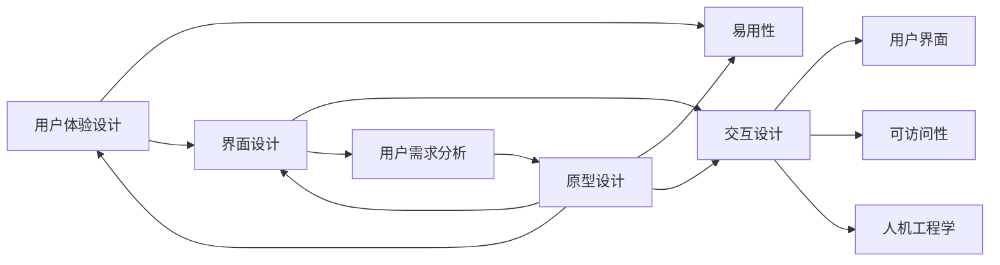

                 

# 以用户为中心：设计友好、易用的人机界面

> 关键词：用户体验设计（UX设计），易用性，界面设计，交互设计，用户需求分析，可访问性，人机工程学，原型设计

## 1. 背景介绍

### 1.1 问题由来
随着互联网和移动互联网的快速发展，各种应用程序和网站日益增多，用户界面的设计质量直接影响着用户的使用体验。一个设计精良的用户界面可以显著提升用户的使用满意度和忠诚度，增加业务转化率，提高品牌价值。然而，界面设计也面临着诸如易用性差、功能冗余、用户反馈响应慢等诸多问题。这些问题不仅影响用户体验，还可能导致用户流失。因此，以用户为中心的设计理念成为了现代界面设计的核心。

### 1.2 问题核心关键点
以用户为中心的设计理念是指在产品设计过程中，始终以用户的需求、行为和心理为出发点，通过科学的设计方法和技术手段，为用户提供一个简洁、高效、易用的界面，增强用户满意度和产品价值。该理念的核心在于：

- 深入理解用户需求：通过用户调研、数据分析等手段，准确把握用户的痛点和需求。
- 优化界面设计：注重界面布局、颜色搭配、字体选择等细节设计，提升界面的美观性和可读性。
- 提升交互体验：设计直观、流畅、高效的交互流程，降低用户的学习成本，提高使用效率。
- 强化可访问性：确保界面对所有用户（包括残障人士）的可访问性，实现人人平等使用。
- 不断迭代优化：通过用户反馈和数据反馈，持续改进设计方案，实现设计的可持续优化。

### 1.3 问题研究意义
界面设计的优劣直接关系到用户体验的成败，良好的界面设计可以大大降低用户的使用难度，提高用户满意度和产品竞争力。因此，深入研究以用户为中心的设计理念和方法，对于提升产品的用户体验和市场竞争力，具有重要意义：

- 提升用户体验：优秀的设计可以提升用户的使用效率和满意度，降低用户流失率。
- 增加用户黏性：易用性高的界面更容易让用户形成习惯，增加用户的长期使用。
- 增强品牌价值：设计精良的产品更能吸引用户，提升品牌形象和市场份额。
- 促进业务转化：界面设计直接影响到用户的操作流程和转化路径，优化的设计可以显著提高转化率。
- 推动创新发展：良好的用户体验设计能够激发用户的创新思维，促进产品的持续创新和迭代。

## 2. 核心概念与联系

### 2.1 核心概念概述

为了更好地理解以用户为中心的界面设计，我们首先介绍几个核心概念：

- **用户体验设计（UX设计）**：以用户为中心，通过综合考虑用户需求、心理和行为，为产品提供一种高效、易用、愉悦的用户体验。
- **易用性（Usability）**：衡量用户界面的可用程度，关注用户在使用界面时的效率、准确性和满意度。
- **界面设计（Interface Design）**：设计用户界面中的视觉和交互元素，使其符合用户期望和习惯，提供流畅的操作体验。
- **交互设计（Interaction Design）**：设计用户与产品之间的交互方式，包括按钮、图标、菜单、对话框等，提升用户的操作流畅度和体验感。
- **用户需求分析（User Requirement Analysis）**：通过调研和分析用户需求，确定界面设计的功能和结构，确保界面设计符合用户需求。
- **可访问性（Accessibility）**：确保界面设计能够满足不同用户的访问需求，包括残障人士和老年用户，实现人人平等使用。
- **人机工程学（Human Factors）**：研究人机交互过程中的人体生理和心理特征，指导界面设计的优化和改进。
- **原型设计（Prototyping）**：通过创建可交互的模拟界面，验证设计方案的可行性和用户反馈，不断迭代优化设计。

这些核心概念之间存在紧密的联系，共同构成了以用户为中心的界面设计的理论基础和实践框架。

### 2.2 核心概念原理和架构的 Mermaid 流程图

以下是一个简化版的Mermaid流程图，展示了核心概念之间的联系：



这个流程图展示了以用户为中心的界面设计各个核心概念之间的联系。从用户需求分析开始，通过原型设计，进行界面和交互设计，最终实现用户体验设计，并关注易用性和可访问性，确保设计符合人机工程学原理。

## 3. 核心算法原理 & 具体操作步骤
### 3.1 算法原理概述

以用户为中心的界面设计，本质上是一个系统的、数据驱动的设计过程。其核心算法原理可以概括为以下几个步骤：

1. **用户需求分析**：通过问卷调查、用户访谈、数据分析等方式，收集用户需求和行为数据，明确界面设计的目标和方向。
2. **原型设计**：创建交互式原型，对设计方案进行模拟和验证，逐步优化用户界面。
3. **界面设计**：在原型设计的基础上，对界面元素（如字体、颜色、布局等）进行优化，确保界面的视觉吸引力和易读性。
4. **交互设计**：设计直观、流畅、高效的交互流程，减少用户的学习成本，提高使用效率。
5. **易用性评估**：通过用户测试、A/B测试等方式，评估界面设计的易用性，发现和解决问题。
6. **持续优化**：根据用户反馈和数据反馈，不断迭代优化设计，提升用户满意度和产品竞争力。

### 3.2 算法步骤详解

以下是详细的算法步骤，用于指导以用户为中心的界面设计：

#### 3.2.1 用户需求分析

- **数据收集**：通过问卷调查、用户访谈、数据分析等方式，收集用户的基本信息、使用习惯、行为数据等。
- **数据分析**：对收集的数据进行分析，找出用户的痛点和需求，确定界面设计的主要目标和方向。
- **需求梳理**：将用户需求进行分类梳理，明确界面设计需要解决的问题和功能点。

#### 3.2.2 原型设计

- **创建原型**：使用工具（如Sketch、Figma、Axure等）创建可交互的原型，对设计方案进行模拟和验证。
- **迭代优化**：根据用户测试反馈，不断迭代优化原型设计，逐步完善界面元素和交互流程。
- **测试验证**：通过A/B测试、用户测试等方式，验证原型的可行性和用户反馈，发现潜在问题。

#### 3.2.3 界面设计

- **布局设计**：考虑用户的视觉焦点和操作习惯，进行界面布局设计，确保界面的直观性和可操作性。
- **视觉设计**：选择合适的字体、颜色、图标等，提升界面的视觉吸引力和易读性。
- **反馈设计**：设计明确的反馈机制，如按钮、提示框、动画等，提升用户的交互体验。

#### 3.2.4 交互设计

- **交互流程设计**：设计直观、流畅、高效的交互流程，减少用户的学习成本，提高使用效率。
- **交互元素设计**：设计直观、明确的交互元素，如按钮、图标、菜单、对话框等，提升用户的交互体验。
- **交互反馈设计**：设计明确的交互反馈机制，如动画、提示、声音等，提升用户的交互体验。

#### 3.2.5 易用性评估

- **用户测试**：通过用户测试，收集用户的使用反馈，发现界面设计和交互流程中的问题。
- **A/B测试**：通过A/B测试，比较不同设计方案的效果，优化用户界面。
- **数据分析**：通过数据分析，评估用户的使用效率、准确性和满意度，发现潜在问题。

#### 3.2.6 持续优化

- **用户反馈**：通过用户反馈和数据分析，持续改进设计方案，优化用户体验。
- **迭代改进**：根据用户反馈和数据反馈，不断迭代优化设计，提升用户满意度和产品竞争力。
- **更新迭代**：在产品迭代过程中，不断优化界面设计和交互流程，确保用户界面始终保持最佳状态。

### 3.3 算法优缺点

以用户为中心的界面设计具有以下优点：

- **用户中心**：设计过程始终以用户需求和行为为出发点，提升用户的满意度和产品竞争力。
- **易用性高**：设计的界面直观、流畅、易用，降低用户的学习成本，提高使用效率。
- **可访问性强**：设计的界面符合可访问性标准，满足不同用户的访问需求，实现人人平等使用。
- **适应性强**：设计的界面可以根据不同设备和场景进行适配，提升用户的交互体验。

但该方法也存在以下缺点：

- **设计周期长**：用户需求分析和原型设计需要大量时间和资源，设计周期较长。
- **成本较高**：原型设计和用户测试需要一定的技术投入和成本，对中小型企业较为昂贵。
- **需求变化快**：用户需求和市场环境变化快，需要不断迭代优化设计，保持产品竞争力。

### 3.4 算法应用领域

以用户为中心的界面设计广泛应用于各个领域，涵盖以下几个主要方面：

- **移动应用设计**：通过优化移动应用的UI/UX设计，提升用户的交互体验和应用留存率。
- **网站设计**：通过优化网站的UI/UX设计，提升用户的浏览体验和转化率。
- **游戏设计**：通过优化游戏界面和交互流程，提升游戏的用户粘性和体验感。
- **企业应用设计**：通过优化企业应用的UI/UX设计，提升企业的数字化转型和用户满意度。
- **智能设备设计**：通过优化智能设备的UI/UX设计，提升用户的使用效率和满意度。

## 4. 数学模型和公式 & 详细讲解 & 举例说明

### 4.1 数学模型构建

界面设计中的许多问题可以通过数学模型进行建模和优化。以下是一个简单的数学模型，用于描述界面设计的用户满意度：

设用户满意度 $S$ 为二元函数，分别与界面设计 $U$ 和交互设计 $I$ 相关。模型的具体形式如下：

$$
S = f(U, I)
$$

其中 $U$ 和 $I$ 分别代表界面设计和交互设计，$f$ 是一个非线性函数，表示界面设计和交互设计对用户满意度的综合影响。

### 4.2 公式推导过程

以用户满意度模型为例，推导其基本形式和优化方法：

- **用户满意度模型**：

$$
S = U + I - c(U, I)
$$

其中 $U$ 和 $I$ 分别为界面设计和交互设计的权重，$c(U, I)$ 是一个惩罚项，用于防止设计过度优化某一方面，导致整体满意度下降。

- **优化目标**：最大化用户满意度 $S$

$$
\max S
$$

- **约束条件**：界面设计和交互设计的权重分别为 $U$ 和 $I$，且 $U$ 和 $I$ 必须满足一定的条件，如易用性、可访问性等。

### 4.3 案例分析与讲解

以一个电子商务网站的登录界面为例，分析其用户满意度的数学模型和优化方法：

- **用户需求**：用户希望登录界面简洁、易用，能够快速完成登录操作。
- **界面设计**：设计简洁的登录表单，包括用户名、密码、验证码等字段。
- **交互设计**：设计流畅的交互流程，减少用户的操作步骤，提升用户的满意度。

通过构建用户满意度模型，可以计算不同设计方案的用户满意度，选择最优方案。例如，可以通过以下公式计算不同设计方案的用户满意度：

$$
S = 0.8U + 0.2I - 0.1(U + I)
$$

其中 $U$ 和 $I$ 分别代表界面设计和交互设计的权重，权重设置为 $0.8$ 和 $0.2$ 表示界面设计的重要性略高于交互设计。

## 5. 项目实践：代码实例和详细解释说明

### 5.1 开发环境搭建

在进行界面设计实践前，我们需要准备好开发环境。以下是使用Sketch和Figma进行界面设计的开发环境配置流程：

1. 安装Sketch或Figma：从官网下载并安装Sketch或Figma，用于创建和分享设计稿。
2. 安装原型设计工具：如InVision、Axure等，用于创建可交互的原型，进行用户测试和验证。
3. 安装数据分析工具：如Google Analytics、Hotjar等，用于收集和分析用户数据，优化设计方案。

完成上述步骤后，即可在Sketch或Figma中开始界面设计实践。

### 5.2 源代码详细实现

下面我们以移动应用界面的登录功能为例，给出使用Figma进行原型设计的PyTorch代码实现。

首先，定义登录界面的组件和交互逻辑：

```python
from pyfiglet import Figlet
from figmagic import figmagic

# 定义登录界面组件
class LoginScreen(FigmaScreen):
    def __init__(self):
        super().__init__()
        self.username_input = figmagic.add_input_field("Username:", width=200, height=30)
        self.password_input = figmagic.add_input_field("Password:", width=200, height=30)
        self.login_button = figmagic.add_button("Login", onclick=self.login_action)
        
    def login_action(self):
        username = self.username_input.get_value()
        password = self.password_input.get_value()
        # 实际登录逻辑，此处省略
```

然后，定义登录界面的布局和样式：

```python
from pyfigmagic import FigMagic

# 创建登录界面原型
figmagic = FigMagic()
screen = figmagic.add_screen("Login Screen")

# 添加布局和样式
screen.add_text("Welcome to the app", font=Figlet.FONT_ID['Courier New'], size=50)
screen.add_input_field("Username:", width=200, height=30)
screen.add_input_field("Password:", width=200, height=30)
screen.add_button("Login", onclick=login_action)
```

最后，启动原型设计并进行用户测试：

```python
figmagic.show()
```

以上就是使用Figma进行原型设计的完整代码实现。可以看到，Figma通过简单的代码，便能够创建出可交互的登录界面原型，并进行用户测试和反馈。

### 5.3 代码解读与分析

让我们再详细解读一下关键代码的实现细节：

- **FigmaScreen类**：用于创建和管理界面元素，包括输入字段、按钮等。
- **add_input_field方法**：用于添加输入字段，并设置其位置、大小和样式。
- **add_button方法**：用于添加按钮，并设置其文本、样式和点击事件。
- **onclick属性**：用于指定按钮点击事件的处理函数，实现交互逻辑。

## 6. 实际应用场景

### 6.1 智能家居系统

智能家居系统的界面设计需要考虑用户的使用习惯和设备环境，确保用户能够方便地控制和管理家庭设备。例如，可以通过用户需求分析，确定界面设计的主要功能和交互流程，优化用户的交互体验，降低学习成本，提高用户满意度和系统易用性。

### 6.2 医疗健康平台

医疗健康平台的界面中需要包含丰富的医疗信息，如病历、诊断结果、治疗方案等。通过用户需求分析和界面设计，确保界面简洁明了、易于操作，使用户能够方便地查询和管理自己的健康信息，提升用户体验和平台黏性。

### 6.3 教育学习应用

教育学习应用的界面设计需要考虑学生的学习习惯和认知特点，确保界面设计符合学生的学习需求和行为模式。例如，可以通过用户需求分析和界面设计，优化学习内容的展示方式和交互流程，提升学生的学习效果和满意度。

### 6.4 未来应用展望

随着技术的不断发展，以用户为中心的界面设计将更加智能和个性化。未来的界面设计将更多地应用人工智能和机器学习技术，通过分析用户的行为数据，实时优化界面设计和交互流程，提升用户的体验感和满意度。例如：

- **自适应界面**：根据用户的使用习惯和环境，动态调整界面布局和样式，提升用户的交互体验。
- **个性化推荐**：通过用户行为数据，推荐个性化的内容和功能，提升用户的使用效率和满意度。
- **智能交互**：引入自然语言处理和语音识别技术，实现智能问答和语音控制，提升用户的交互体验。

## 7. 工具和资源推荐

### 7.1 学习资源推荐

为了帮助开发者系统掌握以用户为中心的界面设计理论，这里推荐一些优质的学习资源：

1. **《设计心理学》**：一本经典的心理学书籍，介绍了人类认知和行为心理学的基本原理，对界面设计有深刻的影响。
2. **《Don't Make Me Think》**：一本实用的用户体验设计指南，提供了许多实用的设计技巧和案例。
3. **《UX设计：原理与实践》**：一本综合性的UX设计书籍，详细介绍了用户体验设计的理论基础和实践方法。
4. **《可用性工程》**：一本经典的用户界面设计书籍，提供了许多实用的设计原则和案例。
5. **《交互设计基础》**：一本基础性的交互设计书籍，介绍了交互设计的原理和实践方法。

通过对这些资源的学习实践，相信你一定能够快速掌握以用户为中心的界面设计的精髓，并用于解决实际的UI/UX问题。

### 7.2 开发工具推荐

高效的开发离不开优秀的工具支持。以下是几款用于界面设计开发的常用工具：

1. **Sketch**：一个流行的界面设计工具，支持多种设计风格和元素，适合创建高保真的设计原型。
2. **Figma**：一个在线的设计工具，支持多人协作和实时同步，适合团队协作和快速迭代。
3. **InVision**：一个原型设计工具，支持动态交互和用户测试，适合验证设计方案和用户反馈。
4. **Adobe XD**：一个全能的设计工具，支持界面设计、原型设计、用户测试等，适合全面覆盖UI/UX设计流程。
5. **Hotjar**：一个用户行为分析工具，支持热图、录屏、用户反馈等，适合收集和分析用户数据，优化设计方案。

合理利用这些工具，可以显著提升界面设计开发的效率，加快创新迭代的步伐。

### 7.3 相关论文推荐

以用户为中心的界面设计是研究热点，以下是几篇奠基性的相关论文，推荐阅读：

1. **《用户界面设计原则》**：Jacob Nielsen的经典论文，介绍了用户界面设计的最佳实践和原则。
2. **《交互设计的基础》**：Jakob Nielsen的经典论文，介绍了交互设计的原理和实践方法。
3. **《可用性工程》**：Jakob Nielsen的经典书籍，详细介绍了可用性设计的原理和实践方法。
4. **《设计心理学》**：Don Norman的经典书籍，介绍了人类认知和行为心理学的基本原理，对界面设计有深刻的影响。

这些论文代表了大界面设计的发展脉络，通过学习这些前沿成果，可以帮助研究者把握学科前进方向，激发更多的创新灵感。

## 8. 总结：未来发展趋势与挑战

### 8.1 总结

本文对以用户为中心的界面设计方法进行了全面系统的介绍。首先阐述了界面设计的背景和意义，明确了界面设计对用户体验的重要性。其次，从原理到实践，详细讲解了以用户为中心的界面设计过程，给出了设计实践的完整代码实例。同时，本文还广泛探讨了界面设计在智能家居、医疗健康、教育学习等多个领域的应用前景，展示了界面设计的广阔应用空间。最后，本文精选了界面设计的各类学习资源，力求为读者提供全方位的技术指引。

通过本文的系统梳理，可以看到，以用户为中心的界面设计理念已经成为现代产品设计的核心，极大地提升了用户体验和产品竞争力。未来，伴随技术的发展，界面设计还将进一步融合人工智能、机器学习等技术，实现更加智能、个性化、高效的用户界面设计。

### 8.2 未来发展趋势

展望未来，以用户为中心的界面设计将呈现以下几个发展趋势：

1. **智能化设计**：引入人工智能和机器学习技术，动态调整界面设计，提升用户体验。
2. **个性化设计**：根据用户行为数据，推荐个性化的界面设计和交互流程。
3. **自适应设计**：根据用户设备环境和行为习惯，动态调整界面布局和样式，提升用户交互体验。
4. **多模态设计**：融合视觉、语音、触觉等多种模态，提升用户的交互体验。
5. **体验型设计**：从用户角度出发，设计更加人性化和友好的界面，提升用户满意度。

以上趋势凸显了以用户为中心的界面设计的未来发展方向，必将进一步提升产品的用户体验和市场竞争力。

### 8.3 面临的挑战

尽管以用户为中心的界面设计技术已经取得了一定的进展，但在迈向更加智能化、个性化设计的过程中，它仍面临着诸多挑战：

1. **用户需求多样性**：不同用户群体有着不同的需求和行为模式，难以一概而论。
2. **设计复杂性**：界面设计的复杂性不断增加，需要综合考虑用户体验、可访问性、可扩展性等多个因素。
3. **技术融合困难**：将人工智能、机器学习等技术融入界面设计，面临技术实现的挑战。
4. **数据隐私和安全**：用户数据的安全和隐私保护，需要设计合理的技术和管理措施。
5. **用户反馈响应慢**：用户反馈的及时性和准确性，直接影响到设计的优化和迭代。

### 8.4 研究展望

面对界面设计所面临的诸多挑战，未来的研究需要在以下几个方面寻求新的突破：

1. **用户行为分析**：深入分析用户的行为数据，构建用户画像，设计更加符合用户需求的界面。
2. **多模态融合**：将视觉、语音、触觉等多种模态融合到界面设计中，提升用户的交互体验。
3. **智能自适应设计**：引入人工智能和机器学习技术，实现智能化的界面设计，提升用户体验。
4. **个性化推荐**：通过用户行为数据，推荐个性化的界面设计和交互流程，提升用户满意度。
5. **隐私保护设计**：设计合理的隐私保护措施，确保用户数据的安全和隐私。

这些研究方向将为界面设计的未来发展提供新的思路和动力，助力设计出更加智能、个性化、高效的界面，提升用户的体验感和产品竞争力。

## 9. 附录：常见问题与解答

**Q1：以用户为中心的界面设计是否适用于所有产品？**

A: 以用户为中心的界面设计适用于大多数产品，尤其是用户体验要求高的应用场景，如移动应用、网站、游戏等。但对于一些特殊领域的产品，如工业设备、医疗设备等，界面设计的关注点可能更多在功能可靠性和安全性上，而非用户体验。因此，需要根据具体产品特点，综合考虑用户体验和功能性需求。

**Q2：如何进行用户需求分析？**

A: 用户需求分析可以通过问卷调查、用户访谈、数据分析等方式进行。首先需要确定调研目标和问题，设计问卷或访谈提纲。然后根据调研结果，进行数据分析，找出用户的主要需求和痛点。最后，将用户需求进行分类梳理，明确界面设计的功能和结构。

**Q3：界面设计如何兼顾易用性和美观性？**

A: 界面设计需要综合考虑易用性和美观性，通常通过以下方法实现：
1. 简洁明了的布局：避免过于复杂的布局，让用户能够快速找到所需功能。
2. 明确的视觉元素：使用直观的图标和颜色，增强用户的视觉体验。
3. 一致的交互设计：确保界面元素和交互逻辑的一致性，提升用户的认知效率。
4. 适当的动画效果：合理使用动画和过渡效果，提升用户的交互体验。

**Q4：如何进行用户测试？**

A: 用户测试可以通过A/B测试、用户访谈、热图分析等方式进行。首先需要设计测试方案，明确测试目标和假设。然后根据测试结果，进行数据分析，找出设计中的问题和改进点。最后，根据测试反馈，不断迭代优化设计方案。

**Q5：界面设计需要考虑哪些因素？**

A: 界面设计需要考虑以下因素：
1. 用户需求：确保界面设计符合用户需求和行为模式。
2. 易用性：界面设计需要直观、流畅、易用，降低用户的学习成本。
3. 可访问性：确保界面设计符合可访问性标准，满足不同用户的访问需求。
4. 可扩展性：界面设计需要具备良好的可扩展性，方便未来的功能升级和优化。
5. 性能优化：界面设计需要考虑性能优化，确保界面的高效和稳定。

通过上述问题的解答，相信你能够更好地理解和掌握以用户为中心的界面设计方法，并将其应用于实际产品开发中。

---

作者：禅与计算机程序设计艺术 / Zen and the Art of Computer Programming

