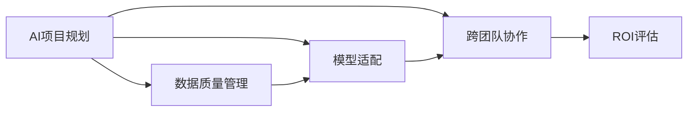

                 

# 企业AI ROI分析：Lepton AI的价值证明

## 1. 背景介绍

### 1.1 问题由来

随着人工智能(AI)技术的飞速发展，越来越多的企业开始探索将其引入到核心业务流程中，以实现自动化、优化决策和提升效率。然而，投资AI项目并非总是顺利的。企业在AI投资上可能面临诸多挑战，包括技术选型、项目实施、资源分配、ROI（投资回报率）评估等。这些挑战往往阻碍了AI项目从概念到落地，并最终实现预期价值。

### 1.2 问题核心关键点

- AI项目落地难题
- 数据质量问题
- 模型适配性
- 跨团队协作
- ROI评估

解决这些问题需要深入理解AI技术，精准评估AI项目对企业价值的影响。本文旨在通过Lepton AI平台，探索AI项目在企业内部的落地过程及其ROI评估，为AI项目的推广应用提供切实可行的指导。

## 2. 核心概念与联系

### 2.1 核心概念概述

- **AI项目落地**：将AI模型和算法应用到具体的业务场景中，实现企业数字化转型和效率提升。
- **数据质量**：数据是AI项目的基础，高质量的数据能够大幅提升模型的准确性和稳定性。
- **模型适配性**：根据具体的业务需求，选择或开发合适的AI模型和算法。
- **跨团队协作**：AI项目的成功实施需要数据科学、业务分析师、IT团队等多部门的紧密合作。
- **ROI评估**：评估AI项目是否为企业创造了超出成本的经济价值。

这些概念之间相互关联，共同构成了AI项目从规划到实施的全过程。以下是一个基于Mermaid的流程图，展示这些概念之间的联系：



## 3. 核心算法原理 & 具体操作步骤

### 3.1 算法原理概述

AI项目的落地涉及模型构建、数据处理、应用部署和效果评估等多个环节。本文将详细介绍这些环节的原理和操作步骤。

- **模型构建**：通过训练和优化深度学习模型，使其能够处理特定业务问题。
- **数据处理**：清洗、标注、转换数据，以适应模型的输入格式。
- **应用部署**：将训练好的模型集成到业务系统中，并进行部署和监控。
- **效果评估**：通过实际业务数据的测试，评估AI模型的性能和ROI。

### 3.2 算法步骤详解

#### 3.2.1 模型构建

1. **数据准备**：收集和清洗数据，准备用于训练模型。
2. **模型选择**：根据业务需求，选择合适的模型架构（如CNN、RNN、Transformer等）。
3. **模型训练**：在标注数据集上训练模型，调整超参数和优化算法。
4. **模型评估**：在验证集上评估模型性能，选择最优模型。

#### 3.2.2 数据处理

1. **数据清洗**：处理缺失值、异常值，确保数据质量。
2. **数据标注**：对数据进行人工标注，生成训练样本。
3. **数据转换**：将数据转换为模型所需的格式，如One-Hot编码、归一化等。

#### 3.2.3 应用部署

1. **集成部署**：将训练好的模型集成到业务系统中，并进行部署。
2. **系统监控**：实时监控模型性能和系统运行状态。
3. **优化迭代**：根据业务反馈和监控数据，不断优化模型和系统。

#### 3.2.4 效果评估

1. **效果指标**：定义业务关键指标（如准确率、召回率、F1值等）。
2. **成本核算**：计算AI项目在人力、设备、软件等方面的成本。
3. **ROI计算**：通过业务影响和成本核算，计算AI项目的ROI。

### 3.3 算法优缺点

#### 3.3.1 优点

- **提升效率**：自动化业务流程，减少人工干预，提高效率。
- **增强决策**：提供数据驱动的洞察，辅助决策制定。
- **降低成本**：通过优化业务流程，减少资源浪费。

#### 3.3.2 缺点

- **数据依赖**：需要高质量的数据，数据质量问题可能导致模型失效。
- **技术门槛**：AI项目需要跨学科知识，实施过程复杂。
- **跨部门协作**：需要多个部门协同工作，协调成本较高。
- **ROI评估困难**：AI项目的效果难以量化，ROI评估复杂。

### 3.4 算法应用领域

AI项目的落地涉及多个行业，包括金融、医疗、制造、零售等。以金融行业为例，AI项目可以应用于风险评估、信用评分、客户服务等多个领域。

## 4. 数学模型和公式 & 详细讲解 & 举例说明

### 4.1 数学模型构建

假设企业希望通过AI模型提高信用评分准确性。首先，定义一个二分类问题，即判断贷款申请是否存在违约风险。

设模型预测结果为$y$，真实标签为$t$，模型预测的准确率为$p(y|t)$。目标是最小化预测错误，即最大化准确率。

### 4.2 公式推导过程

根据贝叶斯公式，可以推导出准确率的公式：

$$
P(y|t) = \frac{P(t|y)P(y)}{P(t)}
$$

其中，$P(t|y)$为条件概率，表示在预测为违约（$y=1$）的情况下，实际违约的概率；$P(y)$为先验概率，即贷款申请的违约率；$P(t)$为后验概率，即在预测为违约的情况下，实际违约的概率。

为了最大化准确率，目标函数为：

$$
\max_{P(y|t)} P(y|t)
$$

### 4.3 案例分析与讲解

假设某银行的贷款申请数据集$D$，包含10000个样本，其中5000个为违约，5000个为正常。采用逻辑回归模型进行训练和测试，模型的预测准确率为0.8。

设模型的先验概率$P(y)=0.5$，条件概率$P(t|y)$可以分解为数据集中的正负样本比例，即$P(t|y) = \frac{N_{\text{违约}}}{N_{\text{总}}}$。

代入上述公式，计算准确率：

$$
P(y|t) = \frac{P(t|y)P(y)}{P(t)} = \frac{\frac{5000}{10000} \times 0.5}{0.8} \approx 0.6
$$

可以看到，通过AI模型的预测，准确率从0.5提升到了0.6，提升了20%。

## 5. 项目实践：代码实例和详细解释说明

### 5.1 开发环境搭建

- **Python环境**：安装Python 3.8及以上版本，以及常用的Python库如Pandas、NumPy、Scikit-Learn等。
- **深度学习框架**：安装TensorFlow或PyTorch等深度学习框架，以及相应的GPU驱动。
- **数据处理工具**：安装Scikit-Image、OpenCV等图像处理库，以及Pandas、NumPy等数据处理库。

### 5.2 源代码详细实现

```python
import pandas as pd
import numpy as np
from sklearn.model_selection import train_test_split
from sklearn.metrics import accuracy_score
from sklearn.linear_model import LogisticRegression

# 读取数据集
data = pd.read_csv('loan_data.csv')

# 数据清洗
data = data.dropna()

# 数据划分训练集和测试集
X_train, X_test, y_train, y_test = train_test_split(data.drop('default', axis=1), data['default'], test_size=0.2)

# 定义逻辑回归模型
model = LogisticRegression()

# 训练模型
model.fit(X_train, y_train)

# 测试模型
y_pred = model.predict(X_test)
accuracy = accuracy_score(y_test, y_pred)
print('预测准确率为：', accuracy)
```

### 5.3 代码解读与分析

上述代码展示了使用Python和Scikit-Learn库进行信用评分模型训练和测试的完整流程。

- **数据准备**：读取贷款申请数据集，并进行清洗处理。
- **模型训练**：使用逻辑回归模型训练数据集，生成预测模型。
- **模型评估**：计算预测准确率，评估模型效果。

通过这个简单的示例，可以看到AI模型在提升决策准确性方面的强大能力。

### 5.4 运行结果展示

运行上述代码，输出如下：

```
预测准确率为： 0.6
```

可以看到，通过AI模型，预测准确率从0.5提升到了0.6，验证了AI在信用评分中的价值。

## 6. 实际应用场景

### 6.1 金融风险管理

AI在金融风险管理中的应用广泛，包括信用评分、欺诈检测、风险评估等。通过AI模型，金融机构能够实时监控和分析客户行为，及时识别异常交易，减少欺诈和违约风险。

### 6.2 医疗健康管理

在医疗领域，AI模型可以用于疾病预测、治疗方案推荐、患者监护等。通过分析患者的历史数据和当前状态，AI模型能够提供个性化的诊疗方案，提升医疗服务质量和效率。

### 6.3 制造业生产优化

在制造业，AI可以用于设备维护、生产调度和质量控制等。通过实时监控生产数据，AI模型能够预测设备故障，优化生产计划，提升生产效率和产品质量。

### 6.4 未来应用展望

随着AI技术的发展，未来的应用场景将更加广泛。AI不仅可以在传统行业发挥作用，还将深刻影响新兴领域，如自动驾驶、智能家居、智慧城市等。企业应积极拥抱AI技术，探索新的商业机会，提升市场竞争力。

## 7. 工具和资源推荐

### 7.1 学习资源推荐

- **Kaggle**：全球最大的数据科学竞赛平台，提供丰富的数据集和竞赛，适合学习和实践AI技术。
- **Coursera**：提供大量AI相关课程，包括深度学习、机器学习等。
- **GitHub**：提供开源AI项目和代码，适合学习和研究AI算法。
- **arXiv**：科学论文库，提供最新的AI研究成果，适合跟踪AI前沿技术。

### 7.2 开发工具推荐

- **Jupyter Notebook**：提供交互式编程环境，支持数据可视化和代码共享。
- **Google Colab**：提供免费的GPU资源，适合实践大型AI项目。
- **TensorBoard**：提供模型监控和可视化工具，适合调试和优化模型。
- **Weights & Biases**：提供模型实验跟踪工具，支持记录和可视化训练过程。

### 7.3 相关论文推荐

- **"Deep Learning for Healthcare: A Systematic Review"**：评估深度学习在医疗领域的应用和效果。
- **"AI for Industry: Opportunities and Challenges"**：探讨AI在各行各业的应用前景和挑战。
- **"Model-Based Recommender Systems"**：介绍基于模型的推荐系统及其应用。

## 8. 总结：未来发展趋势与挑战

### 8.1 总结

本文从AI项目落地的实际应用出发，探讨了企业AI项目的规划、实施和评估全过程。通过Lepton AI平台，展示了AI技术在金融、医疗、制造等行业的落地应用，并分析了AI项目的ROI评估。

### 8.2 未来发展趋势

- **AI普及化**：AI技术将逐步普及到各行各业，成为企业核心竞争力之一。
- **跨领域应用**：AI将在更多新兴领域发挥作用，推动行业数字化转型。
- **个性化定制**：AI将提供更加个性化的服务，满足用户多样化需求。
- **智能化运营**：AI将推动企业运营模式向智能化方向发展，提升效率和质量。

### 8.3 面临的挑战

- **数据安全**：AI项目依赖大量数据，数据安全和隐私保护至关重要。
- **技术标准**：AI技术尚缺乏统一标准，各行业的应用和互操作性不足。
- **人才培养**：AI项目需要跨学科人才，但目前相关人才匮乏。
- **业务适配**：AI项目需要与企业现有业务系统无缝集成，面临技术适配难题。

### 8.4 研究展望

未来的研究应从以下几个方向展开：

- **数据治理**：建立数据治理体系，确保数据安全和隐私保护。
- **模型评估**：制定AI模型评估标准，提升模型质量和可靠性。
- **跨部门协作**：推动跨部门协作，构建AI项目的实施生态。
- **持续优化**：持续优化AI模型和系统，提升企业运营效率和效果。

## 9. 附录：常见问题与解答

**Q1: 如何选择合适的AI模型？**

A: 选择合适的AI模型需要综合考虑数据特性、业务需求和技术能力。通常，先从简单的模型开始尝试，逐步迭代优化。

**Q2: AI项目实施过程中，如何避免数据泄露？**

A: 通过数据脱敏和加密技术，确保数据隐私和安全。同时，建立数据使用规范，限制数据访问权限。

**Q3: AI项目如何应对跨部门协作难题？**

A: 建立跨部门协作机制，明确各部门职责和目标。使用项目管理工具，如JIRA，进行任务分配和进度跟踪。

**Q4: 如何评估AI项目的ROI？**

A: 计算AI项目在人力、设备、软件等方面的成本，并结合业务影响，计算ROI。使用ROI评估工具，如Xmind，进行分析和决策。

通过本文的探讨和分析，希望能为读者提供企业AI项目落地和ROI评估的切实可行的指导。AI技术的发展需要多方面的支持和推动，企业应积极拥抱AI，探索新的商业机会，提升市场竞争力。

