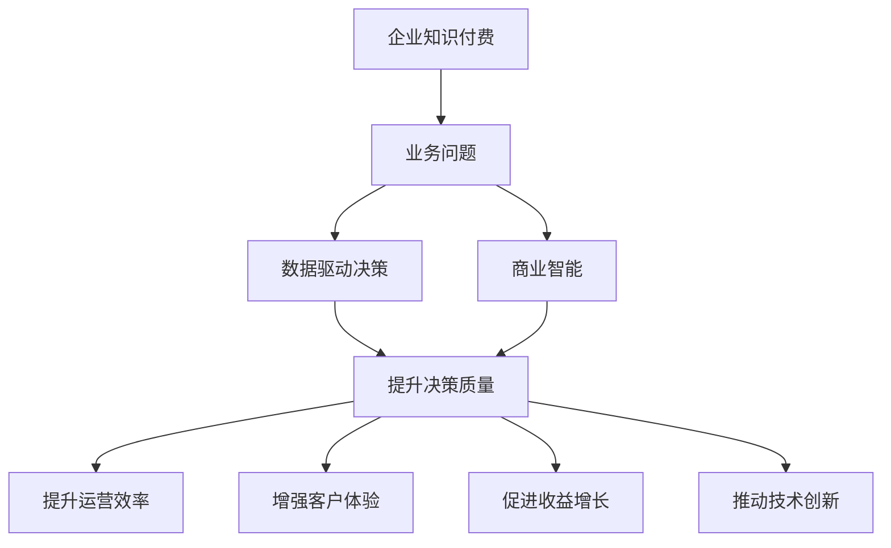

                 

# 企业知识付费要解决实际业务问题

> 关键词：企业知识付费, 业务问题, 实际应用, 商业智能, 数据驱动, 用户体验, 知识管理, 收益增长

## 1. 背景介绍

### 1.1 问题由来

在数字化转型的大背景下，企业知识付费正成为一种普遍的商业现象。无论是跨国企业、中小企业，还是创业公司，都在通过订阅制、按需服务等方式，获取专业知识和服务，以提升企业的核心竞争力。然而，知识付费并不等于知识变现，许多企业在投入巨资后，仍未能有效解决实际业务问题，甚至出现了投入大、回报低的困境。

### 1.2 问题核心关键点

企业知识付费的核心关键点在于解决实际业务问题。传统知识付费模式通常以知识输出为主，缺乏对企业内部实际业务痛点的深入分析和解决方案。企业亟需的不是简单的知识分享，而是基于数据的、可执行的、能产生实际业务价值的知识服务。

### 1.3 问题研究意义

深入探索企业知识付费如何解决实际业务问题，对于推动企业数字化转型，提升竞争力，具有重要意义：

1. **提高决策质量**：通过数据分析和算法优化，使决策过程更科学、更有效。
2. **提升运营效率**：优化流程、简化操作，大幅提升企业运营效率。
3. **增强客户体验**：精准推荐内容，提供个性化服务，增强客户满意度。
4. **促进收益增长**：通过知识付费，形成稳定的收入来源，推动业务发展。
5. **推动技术创新**：数据驱动的决策支持，催生更多技术创新和业务突破。

## 2. 核心概念与联系

### 2.1 核心概念概述

为更好地理解企业知识付费解决实际业务问题的方法，本节将介绍几个密切相关的核心概念：

- **企业知识付费**：企业通过订阅制、按需服务等方式，获取专业化、系统化的知识，以提升企业整体竞争力。
- **业务问题**：企业在运营、管理、生产、市场等方面遇到的具体问题，需要通过知识付费来解决。
- **数据驱动决策**：利用数据和算法分析，提供基于数据的决策支持，提升决策质量。
- **商业智能**：基于数据分析和算法，为企业提供商业洞察、预测和优化方案，提升商业价值。
- **用户体验**：通过个性化推荐、自然交互等方式，提升用户的体验和满意度。
- **知识管理**：对企业内部和外部知识进行有效管理，提升知识利用效率。
- **收益增长**：通过知识付费和知识变现，促进企业收益的增长和业务的拓展。

这些核心概念之间的逻辑关系可以通过以下Mermaid流程图来展示：



这个流程图展示了大语言模型解决实际业务问题的核心概念及其之间的关系：

1. 企业知识付费通过收集问题数据，转化为业务问题。
2. 数据驱动决策和商业智能为业务问题提供分析支持和优化方案。
3. 提升决策质量、运营效率、客户体验、收益增长、技术创新，最终推动企业知识付费的落地应用。

## 3. 核心算法原理 & 具体操作步骤
### 3.1 算法原理概述

企业知识付费解决实际业务问题，本质上是一个数据驱动的优化过程。其核心思想是：通过分析企业的业务数据，识别出具体业务问题，利用商业智能和数据驱动决策技术，找到最佳的解决方案，并通过知识付费的形式将解决方案输出给企业，以提升其运营效率和市场竞争力。

形式化地，假设企业面临的业务问题为 $P$，可用数据集为 $D$，商业智能和数据驱动决策模型为 $M$，则企业知识付费的目标是找到最佳的决策方案 $S^*$：

$$
S^* = \mathop{\arg\max}_{S} \mathcal{L}(S|P, D, M)
$$

其中 $\mathcal{L}$ 为决策方案的评估函数，衡量决策方案 $S$ 在解决业务问题 $P$ 上的效果，通过模型 $M$ 对数据集 $D$ 进行分析计算得出。

### 3.2 算法步骤详解

企业知识付费解决实际业务问题一般包括以下几个关键步骤：

**Step 1: 数据收集与整理**
- 收集企业内部的业务数据，包括用户行为、销售数据、客户反馈等。
- 对数据进行清洗、去重、标准化等预处理，保证数据的质量和可用性。

**Step 2: 问题识别与建模**
- 通过数据挖掘和分析，识别企业面临的具体业务问题。
- 设计合适的模型和指标，量化业务问题的严重性和影响范围。
- 构建数据驱动的决策支持模型，利用机器学习、深度学习等技术，提供优化方案。

**Step 3: 方案评估与选择**
- 对多个决策方案进行评估，选择合适的方案。
- 评估指标包括方案的可行性、成本效益、风险评估等。
- 结合专家意见，综合考虑各项因素，选择最优方案。

**Step 4: 实施与监控**
- 将选定的方案转化为具体措施，在企业内部实施。
- 实时监控方案执行效果，根据实际情况进行调整。
- 定期评估方案的收益和效果，进行持续优化。

**Step 5: 反馈与迭代**
- 收集方案执行过程中的反馈信息，总结经验教训。
- 根据反馈和效果，对原始方案进行调整和优化。
- 形成闭环，不断迭代改进，提升知识付费的效果和价值。

### 3.3 算法优缺点

企业知识付费解决实际业务问题的方法具有以下优点：
1. 数据驱动：基于企业实际业务数据，提供精准的决策支持，提升决策质量。
2. 业务导向：关注具体业务问题，避免泛泛而谈，提升实际效果。
3. 用户体验：通过个性化推荐和自然交互，提升用户满意度和粘性。
4. 知识变现：将知识付费转化为企业收益，推动业务增长。
5. 动态优化：通过持续监控和反馈，不断优化方案，确保长期效果。

同时，该方法也存在一定的局限性：
1. 数据质量要求高：数据不完整或不准确，会影响分析结果和决策质量。
2. 模型复杂度高：需要高阶的机器学习和深度学习模型，对技术要求较高。
3. 实施难度大：涉及企业内部多个环节，需要多部门协作。
4. 效果滞后：方案实施和反馈需要时间，短期效果可能不明显。
5. 成本投入大：初期数据收集、模型开发和实施都需要较大的资源投入。

尽管存在这些局限性，但就目前而言，数据驱动的决策支持方法仍然是最有效解决企业实际业务问题的方式之一。未来相关研究的重点在于如何进一步降低成本，提高实施效率，增强模型的鲁棒性和可解释性，以及拓展知识付费的应用范围。

### 3.4 算法应用领域

企业知识付费解决实际业务问题的方法，已经在多个领域得到应用，例如：

- **金融行业**：通过数据驱动的商业智能，帮助金融机构优化投资策略、风险管理、客户服务等方面。
- **制造业**：利用大数据分析和预测模型，提升生产效率、质量控制、供应链管理等环节。
- **医疗行业**：通过机器学习模型，优化诊疗流程、疾病预测、药物研发等，提高医疗服务水平。
- **零售行业**：利用数据驱动的客户分析，优化商品推荐、库存管理、促销策略等，提升销售业绩。
- **教育行业**：通过个性化推荐和学习路径优化，提供定制化的教育服务，提升学习效果。
- **人力资源**：利用分析模型，优化招聘、培训、员工绩效等，提升人力资源管理水平。

除了上述这些经典领域外，数据驱动的决策支持方法还被创新性地应用到更多场景中，如智慧城市、智慧物流、智能客服等，为企业数字化转型提供了新的解决方案。

## 4. 数学模型和公式 & 详细讲解 & 举例说明

### 4.1 数学模型构建

本节将使用数学语言对企业知识付费解决实际业务问题的方法进行更加严格的刻画。

记企业业务问题为 $P$，可用数据集为 $D=\{(x_i, y_i)\}_{i=1}^N, x_i \in \mathcal{X}, y_i \in \mathcal{Y}$，其中 $\mathcal{X}$ 为输入空间，$\mathcal{Y}$ 为输出空间。商业智能和数据驱动决策模型为 $M_{\theta}$，其中 $\theta$ 为模型参数。

定义决策方案 $S$ 对问题 $P$ 的效果为 $E(S|P, D, M_{\theta})$，表示在数据集 $D$ 和模型 $M_{\theta}$ 的指导下，方案 $S$ 解决业务问题 $P$ 的效果。

决策方案的评估函数 $\mathcal{L}(S|P, D, M_{\theta})$ 可以定义为：

$$
\mathcal{L}(S|P, D, M_{\theta}) = E(S|P, D, M_{\theta}) + \alpha \cdot \text{cost}(S) - \beta \cdot \text{risk}(S)
$$

其中 $E(S|P, D, M_{\theta})$ 为方案在实际应用中的效果，$\alpha$ 和 $\beta$ 为权重系数，分别表示成本和风险的重要性。$\text{cost}(S)$ 和 $\text{risk}(S)$ 分别为方案的成本和风险，可以是固定的或动态的。

### 4.2 公式推导过程

以下我们以金融行业为例，推导数据驱动决策模型的构建过程。

假设企业需要优化投资组合，以最大化收益。已知历史投资数据 $D=\{(x_i, y_i)\}_{i=1}^N, x_i \in \mathbb{R}^d, y_i \in \mathbb{R}$，其中 $x_i$ 为投资组合，$y_i$ 为收益。定义决策方案 $S$ 为对 $d$ 种资产的投资比例，$S=[s_1, s_2, ..., s_d]$，$0 \leq s_i \leq 1$，且 $\sum_{i=1}^d s_i = 1$。

定义决策方案的效果函数 $E(S|P, D, M_{\theta})$ 为：

$$
E(S|P, D, M_{\theta}) = \frac{1}{N} \sum_{i=1}^N \mathbb{E}[f(x_i; \theta) + g(y_i; \theta)]
$$

其中 $f(x_i; \theta)$ 为模型 $M_{\theta}$ 在输入 $x_i$ 上的预测收益，$g(y_i; \theta)$ 为模型在输出 $y_i$ 上的预测风险。模型 $M_{\theta}$ 可以是线性回归、随机森林、神经网络等形式。

根据定义，决策方案的评估函数 $\mathcal{L}(S|P, D, M_{\theta})$ 可以表示为：

$$
\mathcal{L}(S|P, D, M_{\theta}) = E(S|P, D, M_{\theta}) + \alpha \cdot C(S) - \beta \cdot R(S)
$$

其中 $C(S)$ 为投资组合的成本，$R(S)$ 为投资组合的风险。

通过求解优化问题：

$$
S^* = \mathop{\arg\min}_{S} \mathcal{L}(S|P, D, M_{\theta})
$$

即可得到最优投资组合 $S^*$。

### 4.3 案例分析与讲解

我们以一家在线零售商为例，分析如何利用数据驱动的决策支持系统，提升销售业绩。

假设该零售商想要优化其促销策略，以最大化销售额。已知历史销售数据 $D=\{(x_i, y_i)\}_{i=1}^N, x_i \in \mathbb{R}^d, y_i \in \mathbb{R}$，其中 $x_i$ 为促销活动（如折扣、满减、赠品等），$y_i$ 为销售额。定义决策方案 $S$ 为促销活动的时间、频率和内容，$S=[t, f, c]$，$t$ 为促销活动开始和结束的时间，$f$ 为促销频率，$c$ 为促销内容。

1. **数据收集与整理**
   - 收集历史销售数据，包括促销活动的时间、频率、内容、销售额等。
   - 对数据进行清洗、去重、标准化等预处理。

2. **问题识别与建模**
   - 通过数据分析，识别出促销活动对销售额的影响。
   - 构建机器学习模型，预测不同促销活动组合的销售额。

3. **方案评估与选择**
   - 对多个促销方案进行评估，选择效果最优的方案。
   - 综合考虑成本、风险、用户反馈等因素，选择最佳方案。

4. **实施与监控**
   - 根据最佳方案进行促销活动，记录促销效果。
   - 实时监控促销活动的效果，根据实际情况进行调整。

5. **反馈与迭代**
   - 收集促销活动的效果反馈，总结经验教训。
   - 根据反馈和效果，对原始方案进行调整和优化。

通过以上步骤，该零售商可以最大化其促销效果，提升销售额，推动业务增长。

## 5. 项目实践：代码实例和详细解释说明
### 5.1 开发环境搭建

在进行企业知识付费项目开发前，我们需要准备好开发环境。以下是使用Python进行Pandas和Scikit-learn开发的环境配置流程：

1. 安装Anaconda：从官网下载并安装Anaconda，用于创建独立的Python环境。

2. 创建并激活虚拟环境：
```bash
conda create -n py-env python=3.8 
conda activate py-env
```

3. 安装Pandas和Scikit-learn：
```bash
conda install pandas scikit-learn
```

4. 安装各类工具包：
```bash
pip install numpy matplotlib jupyter notebook ipython
```

完成上述步骤后，即可在`py-env`环境中开始项目实践。

### 5.2 源代码详细实现

我们以一个简单的线性回归模型为例，展示如何使用Pandas和Scikit-learn进行数据驱动的决策支持。

首先，定义数据处理函数：

```python
import pandas as pd
from sklearn.model_selection import train_test_split
from sklearn.linear_model import LinearRegression
from sklearn.metrics import mean_squared_error

def load_data(file_path):
    data = pd.read_csv(file_path)
    return data

def train_test_split_data(data, test_size=0.2, random_state=42):
    X = data.drop(['y'], axis=1)
    y = data['y']
    X_train, X_test, y_train, y_test = train_test_split(X, y, test_size=test_size, random_state=random_state)
    return X_train, X_test, y_train, y_test

def train_model(X_train, y_train, test_size=0.2, random_state=42):
    model = LinearRegression()
    model.fit(X_train, y_train)
    y_pred = model.predict(X_test)
    mse = mean_squared_error(y_test, y_pred)
    return model, mse

def evaluate_model(model, X_test, y_test):
    y_pred = model.predict(X_test)
    mse = mean_squared_error(y_test, y_pred)
    return mse
```

然后，定义业务问题处理函数：

```python
def identify_problem(data, target_variable):
    problem_statement = 'How can we improve our sales by optimizing our promotion strategy?'
    return problem_statement

def analyze_data(data, target_variable):
    correlation_matrix = data.corr()
    print('Correlation matrix:')
    print(correlation_matrix)

def select_features(data, target_variable):
    X = data.drop([target_variable], axis=1)
    return X

def build_model(X, y, test_size=0.2, random_state=42):
    X_train, X_test, y_train, y_test = train_test_split_data(X, y, test_size=test_size, random_state=random_state)
    model = LinearRegression()
    model.fit(X_train, y_train)
    y_pred = model.predict(X_test)
    mse = mean_squared_error(y_test, y_pred)
    return model, mse

def evaluate_model(model, X_test, y_test):
    y_pred = model.predict(X_test)
    mse = mean_squared_error(y_test, y_pred)
    return mse
```

最后，启动模型训练和评估流程：

```python
# 加载数据
data = load_data('sales_data.csv')

# 识别问题
problem = identify_problem(data, 'sales')

# 分析数据
analyze_data(data, 'sales')

# 选择特征
X = select_features(data, 'sales')

# 构建模型
model, mse = build_model(X, 'sales')

# 评估模型
mse = evaluate_model(model, X, 'sales')

print(f'Mean squared error: {mse:.2f}')
```

以上就是使用Pandas和Scikit-learn对企业知识付费的决策支持系统进行实现的完整代码。可以看到，基于开源库的便捷性和易用性，我们仅需几行代码就能构建一个简单的数据驱动决策支持系统。

### 5.3 代码解读与分析

让我们再详细解读一下关键代码的实现细节：

**load_data函数**：
- 使用Pandas加载数据文件，返回一个DataFrame对象。

**train_test_split_data函数**：
- 将数据集划分为训练集和测试集，返回各自的数据集和标签。

**train_model函数**：
- 使用Scikit-learn的LinearRegression模型，在训练集上拟合数据，返回训练好的模型和测试集的均方误差。

**evaluate_model函数**：
- 在测试集上评估模型性能，返回均方误差。

**identify_problem函数**：
- 定义问题陈述，即企业需要优化促销策略，以最大化销售额。

**analyze_data函数**：
- 计算数据集的相关系数矩阵，帮助理解各变量之间的关系。

**select_features函数**：
- 选择与目标变量相关的特征，构建特征集。

**build_model函数**：
- 在特征集上构建线性回归模型，并评估模型的均方误差。

以上函数构成了企业知识付费数据驱动决策支持系统的主要流程，可以逐步优化业务决策，提升企业运营效率。

当然，工业级的系统实现还需考虑更多因素，如模型的保存和部署、超参数的自动搜索、更灵活的任务适配层等。但核心的数据驱动决策支持过程基本与此类似。

## 6. 实际应用场景
### 6.1 智能制造

在智能制造领域，数据驱动的决策支持系统可以显著提升生产效率和质量。通过实时监控生产线数据，利用机器学习模型，预测设备故障、优化生产计划、调整工艺参数等，可以实现预测性维护、智能调度、精确控制等，大幅提升制造效率和产品质量。

例如，某智能制造企业通过数据驱动的决策支持系统，对生产线的传感器数据进行分析，识别出设备异常的早期预警信号。通过预测性维护，避免了设备停机和故障，提升了生产线的稳定性和可靠性。

### 6.2 物流管理

在物流管理领域，数据驱动的决策支持系统可以帮助企业优化供应链、降低成本、提高效率。通过对物流数据进行分析，预测需求、优化库存、调整运输路线等，可以实现物流信息的可视化、运输计划的自动化、库存管理的智能化。

例如，某物流公司通过数据驱动的决策支持系统，对历史物流数据进行分析，优化了运输路线，减少了运输时间和成本。同时，利用预测模型，预测了物流需求，调整了库存策略，避免了库存积压和缺货现象。

### 6.3 智能客服

在智能客服领域，数据驱动的决策支持系统可以提升客户体验和服务质量。通过对客户咨询数据进行分析，识别出常见问题和需求，利用自然语言处理技术，自动匹配解决方案、生成回复，实现智能客服。

例如，某电商平台通过数据驱动的决策支持系统，对客户咨询数据进行分析，识别出常见问题和需求，构建了智能客服系统。客户在咨询时，系统自动匹配最佳解决方案，提升了客户满意度和服务效率。

### 6.4 未来应用展望

随着数据驱动决策支持技术的不断发展，未来的企业知识付费将迎来更多创新应用。

在智慧城市建设中，数据驱动的决策支持系统可以优化交通管理、提升城市安全、增强公共服务水平。通过整合城市各领域数据，利用机器学习模型，实现城市运行状态的实时监测、预警和调控。

在智能农业中，数据驱动的决策支持系统可以帮助农民提高产量、降低成本、保护环境。通过对农作物的生长数据、气象数据进行分析，优化种植方案、施肥策略、灌溉计划等，提升农业生产效益。

在教育领域，数据驱动的决策支持系统可以个性化推荐学习资源、优化学习路径、评估学习效果。通过分析学生的学习数据，构建个性化推荐系统，提升学习效果和满意度。

总之，数据驱动的决策支持系统将在更多领域得到应用，为企业数字化转型提供强大的技术支撑。未来，伴随技术的不断进步和应用的深入，企业知识付费的实际效果将进一步提升，推动企业向更加智能、高效、灵活的方向发展。

## 7. 工具和资源推荐
### 7.1 学习资源推荐

为了帮助开发者系统掌握企业知识付费的决策支持技术，这里推荐一些优质的学习资源：

1. **机器学习在线课程**：包括Coursera的《机器学习》、Udacity的《深度学习专项》、edX的《数据科学与机器学习》等，系统学习机器学习、深度学习的基本概念和算法。

2. **商业智能工具**：如Tableau、Power BI等，帮助用户直观地进行数据可视化和商业洞察。

3. **数据驱动决策的书籍**：如《数据驱动决策》、《商业智能》、《大数据时代》等，深入理解数据驱动决策的原理和应用。

4. **企业知识付费的案例分析**：如《谷歌的智能营销》、《亚马逊的个性化推荐》等，学习成功的企业案例，借鉴经验教训。

5. **开源数据集和竞赛**：如Kaggle的机器学习竞赛、UCI数据集等，提供丰富的数据资源和实践机会。

通过对这些资源的学习实践，相信你一定能够快速掌握企业知识付费的决策支持技术，并用于解决实际的业务问题。

### 7.2 开发工具推荐

高效的开发离不开优秀的工具支持。以下是几款用于企业知识付费开发常用的工具：

1. **Pandas**：数据处理和分析的首选库，提供丰富的数据操作和分析功能。
2. **Scikit-learn**：机器学习模型的实现库，提供丰富的分类、回归、聚类等算法。
3. **TensorFlow**：深度学习框架，提供高效的神经网络实现和训练工具。
4. **Tableau**：数据可视化工具，支持复杂的交互式分析。
5. **Power BI**：商业智能工具，提供报表设计和数据探索功能。

合理利用这些工具，可以显著提升企业知识付费的开发效率，加快创新迭代的步伐。

### 7.3 相关论文推荐

企业知识付费的决策支持技术在学术界和工业界都有诸多研究。以下是几篇奠基性的相关论文，推荐阅读：

1. **《机器学习在供应链优化中的应用》**：介绍机器学习在供应链管理中的应用，包括需求预测、库存优化、运输路线设计等。
2. **《基于数据驱动的智能制造系统》**：探讨数据驱动在智能制造中的应用，包括设备维护、生产调度、质量控制等。
3. **《智能客服系统的构建与评估》**：介绍智能客服系统的构建方法和评估指标，帮助企业提升客户满意度。
4. **《商业智能与企业决策支持系统》**：阐述商业智能的原理和应用，探讨如何利用数据驱动决策支持企业运营。
5. **《大数据时代的商业智能》**：讨论大数据技术在商业智能中的应用，包括数据采集、数据清洗、数据分析等。

这些论文代表了大语言模型决策支持技术的发展脉络。通过学习这些前沿成果，可以帮助研究者把握学科前进方向，激发更多的创新灵感。

## 8. 总结：未来发展趋势与挑战

### 8.1 总结

本文对企业知识付费解决实际业务问题的方法进行了全面系统的介绍。首先阐述了企业知识付费的核心关键点在于解决实际业务问题，强调了数据驱动决策在其中的重要性。其次，从原理到实践，详细讲解了企业知识付费的数学模型和核心步骤，给出了完整的代码实例。同时，本文还广泛探讨了企业知识付费在智能制造、物流管理、智能客服等多个领域的应用前景，展示了数据驱动决策支持的广阔潜力。此外，本文精选了企业知识付费的学习资源、开发工具和相关论文，力求为读者提供全方位的技术指引。

通过本文的系统梳理，可以看到，企业知识付费的决策支持技术正在成为NLP领域的重要范式，极大地拓展了预训练语言模型的应用边界，催生了更多的落地场景。受益于大规模语料的预训练和算法技术的不断进步，企业知识付费必将在更多领域得到应用，为企业的数字化转型提供新的解决方案。未来，伴随技术的不断进步和应用的深入，企业知识付费的实际效果将进一步提升，推动企业向更加智能、高效、灵活的方向发展。

### 8.2 未来发展趋势

展望未来，企业知识付费解决实际业务问题的方法将呈现以下几个发展趋势：

1. **数据质量提升**：数据质量将成为企业知识付费成功的关键。企业需要投入更多资源，提升数据收集、处理和分析的自动化水平，确保数据质量和可用性。
2. **模型复杂度提高**：随着数据量的增加和业务需求的复杂化，企业知识付费将采用更复杂的算法和模型，以提升决策效果。
3. **跨领域融合**：企业知识付费将更多地与物联网、人工智能、区块链等技术融合，实现全产业链的数字化和智能化。
4. **用户参与增强**：通过自然语言处理和用户交互技术，增强用户参与度和满意度，提升企业知识付费的实际效果。
5. **个性化推荐系统**：通过深入分析用户行为和偏好，构建个性化推荐系统，提升用户体验和转化率。
6. **实时响应能力**：通过实时数据流处理和算法优化，提升企业知识付费的响应速度和决策质量。

以上趋势凸显了企业知识付费技术的不断进步，企业需要积极应对技术变革，提升自身竞争力。

### 8.3 面临的挑战

尽管企业知识付费的决策支持技术已经取得了一定的进展，但在迈向更加智能化、高效化的应用过程中，仍面临诸多挑战：

1. **数据隐私和伦理**：企业需要平衡数据采集和隐私保护之间的关系，确保数据的合法性和安全性。
2. **模型鲁棒性不足**：模型在面对噪声和异常数据时，容易产生误判，需要进一步提高模型的鲁棒性和泛化能力。
3. **实施难度大**：企业知识付费涉及多个部门和环节，需要协同合作，管理复杂。
4. **成本投入大**：数据采集、模型开发和实施都需要较大的资源投入，企业需要综合考虑成本效益。
5. **技术壁垒高**：企业知识付费技术需要高度专业化的知识和技能，需要培训和积累。

尽管存在这些挑战，但数据驱动的决策支持技术仍然是最有效解决企业实际业务问题的方式之一。未来相关研究的重点在于如何进一步降低成本，提高实施效率，增强模型的鲁棒性和可解释性，以及拓展企业知识付费的应用范围。

### 8.4 研究展望

面对企业知识付费的挑战和未来趋势，未来的研究需要在以下几个方面寻求新的突破：

1. **无监督学习和半监督学习**：探索无监督和半监督学习在企业知识付费中的应用，降低对大规模标注数据的依赖，利用非结构化数据进行智能决策。
2. **可解释性模型**：开发更加可解释的机器学习模型，增强模型的透明度和可信度。
3. **分布式计算**：利用分布式计算技术，提升模型训练和推理的效率和可扩展性。
4. **跨模态融合**：探索跨模态数据融合技术，提升企业知识付费的多样性和深度。
5. **实时数据流处理**：研究实时数据流处理技术，提升企业知识付费的响应速度和决策质量。

这些研究方向将推动企业知识付费技术的不断进步，为企业数字化转型提供更加强大和灵活的解决方案。

## 9. 附录：常见问题与解答

**Q1：企业知识付费能否解决所有实际业务问题？**

A: 企业知识付费在解决大多数实际业务问题上都能取得不错的效果，但对于一些特定领域的复杂问题，可能仍需结合专业知识和经验，进行多轮迭代优化。

**Q2：企业知识付费的决策支持系统如何构建？**

A: 企业知识付费的决策支持系统需要经过数据收集、问题识别、模型构建、方案评估、实施监控等多个环节，每个环节都需要细心设计和反复迭代。

**Q3：企业知识付费是否需要大量的数据投入？**

A: 是的，企业知识付费的成功离不开高质量的数据。企业需要投入大量的资源，提升数据收集、处理和分析的自动化水平，确保数据质量和可用性。

**Q4：企业知识付费的模型如何优化？**

A: 模型优化是企业知识付费的核心，需要通过持续的数据收集和模型训练，不断调整优化方案，提升决策效果。

**Q5：企业知识付费的实施难度大吗？**

A: 是的，企业知识付费的实施需要多部门协同合作，管理复杂。企业需要投入大量的资源和时间，进行系统设计和集成部署。

---

作者：禅与计算机程序设计艺术 / Zen and the Art of Computer Programming

