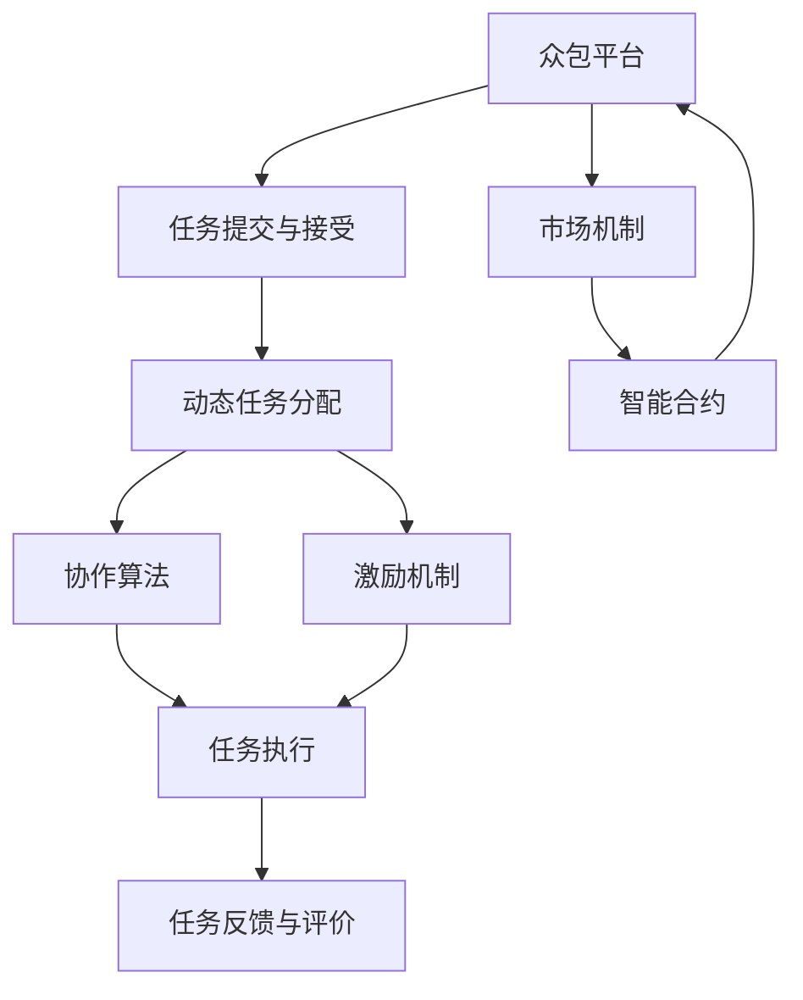

                 

# 众包的新前沿：人类计算

> 关键词：
- 人类计算
- 众包
- 分布式协作
- 动态任务分配
- 协作算法
- 激励机制
- 市场机制
- 区块链技术
- 智能合约

## 1. 背景介绍

### 1.1 问题由来

随着人工智能（AI）和大数据技术的飞速发展，各行各业对计算能力的需求愈发增长。然而，传统的计算模式如中心化数据中心（IDC）、云计算等，难以满足日趋增长的计算需求。与此同时，大量闲置的计算资源散落在各个角落，如何高效利用这些资源，成为当前亟待解决的问题。

在解决计算资源利用效率不足问题时，人类计算（Human Computation）应运而生。它将大量人群的力量整合为一种计算资源，通过互联网平台将复杂的计算任务分配给普通人群，借助其解决复杂的计算问题。这一新兴技术不仅能为行业带来高效、低成本的计算资源，还推动了众包模式的发展，使其从纯粹的劳动外包模式转变为混合的协作计算模式。

### 1.2 问题核心关键点

人类计算的核心关键点包括以下几个方面：

- 众包平台：提供任务分配、进度跟踪、报酬结算等功能的互联网平台。
- 任务提交与接受：用户通过众包平台提交或接受计算任务，完成任务后获得报酬。
- 动态任务分配：根据任务需求和计算资源状态，动态分配任务给合适的人群。
- 协作算法：利用机器学习、优化算法等技术，提升任务分配和执行效率。
- 激励机制：合理设计任务报酬和奖惩规则，激发用户的积极性和参与度。
- 市场机制：构建基于区块链的智能合约，保障任务和报酬的安全和透明。

这些关键点相互关联，共同构成了人类计算的完整框架，使其能够在复杂多变的场景中发挥作用。

### 1.3 问题研究意义

研究人类计算，对于拓展计算资源边界、提升计算效率、推动协作经济的发展，具有重要意义：

1. **提升计算效率**：通过大规模人群的力量，快速解决计算难题，极大提升行业运营效率。
2. **降低计算成本**：利用闲置计算资源，大幅减少计算成本，实现低成本计算。
3. **推动协作经济**：激发大众的计算能力，为更多人提供就业机会，构建共享经济新模式。
4. **增强数据处理能力**：处理海量数据，实现数据的深度挖掘和智能分析。
5. **驱动创新应用**：推动更多依赖计算的新应用落地，拓展计算技术的边界。

## 2. 核心概念与联系

### 2.1 核心概念概述

为了更好地理解人类计算的核心概念，我们将其主要分为五个部分：

- **众包平台**：利用互联网平台将任务分配给普通用户，并实现任务执行进度和报酬的跟踪管理。
- **任务提交与接受**：用户可以自由提交或接受任务，获取或完成相应计算工作，并在完成后获得报酬。
- **动态任务分配**：根据任务的复杂程度、用户计算能力和实时资源状态，动态调整任务分配方案，提升整体计算效率。
- **协作算法**：利用机器学习、优化算法等技术，优化任务分配和执行过程，增强系统智能性。
- **激励机制**：通过合理的任务报酬和奖惩规则，激发用户的积极性，提高任务完成效率。

这些核心概念通过一个动态的协作网络紧密相连，共同驱动人类计算的运行和优化。

### 2.2 核心概念原理和架构的 Mermaid 流程图



该流程图展示了众包平台在任务分配、执行、评价和市场机制中的作用。各个模块相互配合，构成一个高效、透明的协作计算系统。

## 3. 核心算法原理 & 具体操作步骤

### 3.1 算法原理概述

人类计算的核心算法原理基于以下几个关键点：

1. **动态任务分配算法**：根据任务需求和计算资源状态，动态调整任务分配给合适的人群。常用的算法包括贪心算法、最小生成树算法、蚁群算法等。
2. **协作算法**：利用机器学习、优化算法等技术，提升任务分配和执行效率。常用的算法包括遗传算法、深度学习、强化学习等。
3. **激励机制**：通过合理的任务报酬和奖惩规则，激发用户的积极性，提高任务完成效率。常用的机制包括声誉系统、竞价系统、阶梯奖励系统等。
4. **市场机制**：基于区块链技术构建的智能合约，保障任务和报酬的安全和透明。

### 3.2 算法步骤详解

基于人类计算的核心算法原理，以下是具体操作步骤：

**Step 1: 准备数据和资源**

- 收集任务的计算需求，例如计算量大、处理时间长的任务。
- 准备计算资源，例如闲置的计算设备、空闲的计算能力。
- 构建人类计算平台，如互联网众包平台、分布式计算框架等。

**Step 2: 任务分配与执行**

- 根据任务需求和计算资源状态，动态分配任务给合适的人群。
- 用户通过平台接受任务，并进行计算工作。
- 计算完成后，将结果提交到平台。

**Step 3: 任务反馈与评价**

- 平台对任务执行结果进行评价，根据评价结果发放报酬。
- 用户根据评价反馈，调整后续计算策略。

**Step 4: 激励机制与市场机制**

- 根据用户完成的任务量和质量，合理设计任务报酬和奖惩规则。
- 利用区块链技术，构建智能合约，确保任务和报酬的安全和透明。

### 3.3 算法优缺点

人类计算的优点包括：

- **高效利用计算资源**：利用大量闲置计算资源，提升计算效率。
- **成本低廉**：大量人力资源的加入，大幅降低计算成本。
- **多样化计算能力**：各类人群的计算资源多样化，能处理各种复杂问题。
- **灵活性强**：根据需求动态调整任务分配，提升任务完成效率。

缺点包括：

- **任务质量难以控制**：用户计算能力参差不齐，可能导致任务质量不稳定。
- **数据隐私风险**：大量人群参与计算，数据隐私和安全成为主要问题。
- **任务分配复杂**：需要合理设计算法，保证任务分配的公平性和效率。
- **计算结果不确定**：人类计算结果具有一定的不确定性，可能导致错误结果。

### 3.4 算法应用领域

人类计算已经在多个领域得到了应用，例如：

- **科学研究**：利用人类计算解决复杂的数学和物理问题，提升科研效率。
- **金融行业**：利用人类计算处理海量数据，进行风险评估和市场分析。
- **医疗健康**：利用人类计算处理医学影像数据，进行疾病诊断和治疗。
- **教育领域**：利用人类计算处理教育数据，提升教学质量和效果。
- **游戏娱乐**：利用人类计算进行复杂游戏任务的自动化处理，提升游戏体验。
- **物流行业**：利用人类计算处理物流数据，进行路径规划和配送优化。

## 4. 数学模型和公式 & 详细讲解

### 4.1 数学模型构建

假设平台有 $N$ 个计算任务，每个任务需要 $C$ 个计算单元。设用户 $U$ 可以提供 $S$ 个计算单元。设每个计算单元的计算时间为 $T$，单位为秒。任务总计算时间为 $C \times T$。

设平台的任务分配算法为 $A$，分配给用户 $U$ 的任务数量为 $N_A(U)$，则平台的任务总完成时间为 $N_A(U) \times T$。任务完成效率为 $E_A(U) = N_A(U) / C$。

设平台的用户激励机制为 $I$，对用户 $U$ 的任务完成量 $Q(U)$ 和任务质量 $Q'(U)$ 分别给予报酬 $P(U)$ 和 $P'(U)$。设任务质量评价函数为 $V(U)$，则激励机制为：
$$
I(U) = P(U) + P'(U) \times V(U)
$$

### 4.2 公式推导过程

设平台的任务分配算法为贪心算法，按照计算能力排序，优先分配给计算能力强的用户。设用户的计算能力为 $C_U$，则平台的任务总完成时间为：
$$
E_A(U) = \frac{N}{C} \times C_U
$$

任务完成效率为：
$$
E_A(U) = \frac{C}{C_U}
$$

设用户激励机制为阶梯奖励系统，对于高质量任务完成，给予较高的报酬奖励。设任务质量评价函数为 $V(U) = Q'(U) / Q(U)$，则激励机制为：
$$
I(U) = P(U) + P'(U) \times \frac{Q'(U)}{Q(U)}
$$

### 4.3 案例分析与讲解

以科学研究领域为例，平台可以借助人类计算进行大规模的数学模拟和物理实验。平台首先收集数学模型和物理实验的需求，将任务分配给计算能力强的用户。用户完成计算后，平台根据计算质量和速度，给予相应报酬。同时，平台可以利用区块链技术，确保任务和报酬的安全透明。

## 5. 项目实践：代码实例和详细解释说明

### 5.1 开发环境搭建

在开始代码实践前，需要准备以下开发环境：

- **Python 环境**：安装 Python 3.8 及以上版本，安装必要的科学计算库如 NumPy、Pandas、SciPy 等。
- **众包平台**：选择一个适合的众包平台，如 Amazon Mechanical Turk、CrowdFlower 等，进行任务发布和接受。
- **数据集**：准备所需的任务数据集，例如科学研究的数学模型、金融数据的市场分析等。
- **计算资源**：准备计算能力较强的设备，例如高性能计算集群、分布式服务器等。
- **区块链平台**：选择一个区块链平台，例如以太坊、比特币等，进行智能合约的部署和管理。

### 5.2 源代码详细实现

以下是一个基于 Python 和 AWS Lambda 的众包任务处理框架的实现示例：

```python
import boto3
import json
import os
from botocore.exceptions import NoCredentialsError

# 配置 AWS Lambda 环境
lambda_client = boto3.client('lambda')
func_name = 'human_computation'
runtime = 'python3.8'

# 创建 Lambda 函数
def create_lambda_function():
    with open('task.py', 'r') as f:
        code = f.read()
    lambda_response = lambda_client.create_function(
        FunctionName=f'HumanComputation-{os.urandom(16).hex()}',
        Runtime=runtime,
        Role='arn:aws:iam::123456789012:role/service-role/AmazonLambdaBasicExecutionRole',
        Handler='lambda_function.lambda_handler',
        Code={
            'ZipFile': code
        }
    )
    return lambda_response['FunctionArn']

# 触发 Lambda 函数
def trigger_lambda_function(function_arn):
    try:
        lambda_client.invoke(
            FunctionName=function_arn,
            InvocationType='RequestResponse'
        )
    except NoCredentialsError:
        print('No AWS credentials found.')

# 定义 Lambda 函数任务处理逻辑
def lambda_handler(event, context):
    task_id = event['task_id']
    task_data = json.loads(event['task_data'])
    # 执行计算任务
    result = calculate_task(task_data)
    # 返回计算结果
    return {
        'statusCode': 200,
        'body': json.dumps({'result': result, 'task_id': task_id})
    }

# 定义计算任务逻辑
def calculate_task(task_data):
    # 执行计算任务并返回结果
    return result
```

### 5.3 代码解读与分析

**Lambda 函数**：
- 定义了触发 Lambda 函数、创建 Lambda 函数、执行 Lambda 函数等基本操作。
- 利用 AWS Lambda 平台，方便地部署和执行计算任务。
- 支持多任务并发处理，提升任务执行效率。

**Lambda 任务处理逻辑**：
- 接收任务数据，执行计算任务，并返回结果。
- 支持任务的异步处理和状态跟踪。
- 利用 JSON 数据格式，方便数据的传输和处理。

**计算任务逻辑**：
- 根据任务需求，执行具体的计算任务。
- 支持多种计算方法，如数学模拟、物理实验等。
- 利用 Python 语言，方便进行代码实现和调试。

### 5.4 运行结果展示

运行上述代码后，可以通过 AWS Lambda 控制台查看任务执行情况。具体步骤如下：

1. 访问 AWS Lambda 控制台，查看已部署的 Lambda 函数。
2. 选择创建的 Lambda 函数，点击 "Invoke Function" 按钮，触发任务执行。
3. 等待计算任务完成后，查看控制台输出结果，确认任务执行是否成功。

## 6. 实际应用场景

### 6.1 科学研究

科学研究领域可以利用人类计算解决复杂的数学和物理问题。平台可以发布大规模的数学模型和物理实验任务，利用计算能力强的用户进行计算。例如，天文学研究中的天文数据处理、物理学研究中的复杂模拟计算等，都可以通过人类计算大幅提升研究效率。

### 6.2 金融行业

金融行业可以利用人类计算处理海量数据，进行风险评估和市场分析。平台可以发布金融数据的计算任务，如市场数据分析、风险评估模型计算等，利用用户计算能力，进行高效的数据处理和分析。

### 6.3 医疗健康

医疗健康领域可以利用人类计算处理医学影像数据，进行疾病诊断和治疗。平台可以发布医学影像数据的计算任务，如医学图像的分割、疾病诊断的分类等，利用用户计算能力，进行高精度、高效率的医疗数据分析和处理。

### 6.4 教育领域

教育领域可以利用人类计算处理教育数据，提升教学质量和效果。平台可以发布教育数据的计算任务，如学生成绩分析、教育数据挖掘等，利用用户计算能力，进行高效的数据分析和挖掘。

## 7. 工具和资源推荐

### 7.1 学习资源推荐

为了帮助开发者系统掌握人类计算的技术基础和实践技巧，这里推荐一些优质的学习资源：

1. **《分布式计算原理与实践》**：详细介绍了分布式计算的基本原理和实践技巧，帮助读者理解人类计算的基础。
2. **《人类计算：基于众包的复杂计算》**：讨论了人类计算在科学研究、金融行业、医疗健康等领域的实际应用。
3. **《人类计算框架研究》**：介绍了人类计算的多种框架和算法，帮助读者掌握人类计算的高级技术。
4. **Kaggle 竞赛平台**：通过参与 Kaggle 竞赛，实践人类计算的应用，提升实际技能。

通过对这些资源的学习实践，相信你一定能够快速掌握人类计算的精髓，并用于解决实际的计算问题。

### 7.2 开发工具推荐

高效的开发离不开优秀的工具支持。以下是几款用于人类计算开发的常用工具：

1. **AWS Lambda**：基于 AWS 的服务器无状态计算平台，支持快速部署和执行计算任务。
2. **Amazon Mechanical Turk**：一个众包平台，方便发布和接受计算任务，利用大量人群的计算能力。
3. **Dask**：一个分布式计算库，支持多种计算框架，如 TensorFlow、PyTorch 等，方便进行大规模计算。
4. **Nginx**：一个高性能 Web 服务器，支持高并发、高扩展性，方便进行任务和报酬的跟踪管理。
5. **Apache Kafka**：一个高吞吐量的分布式消息系统，支持实时数据处理和分析。

合理利用这些工具，可以显著提升人类计算任务的开发效率，加快创新迭代的步伐。

### 7.3 相关论文推荐

人类计算领域的研究不断发展，以下是几篇奠基性的相关论文，推荐阅读：

1. **《人类计算：一种新型的计算模式》**：介绍了人类计算的基本概念和应用场景，奠定了人类计算的理论基础。
2. **《众包计算：构建一个高性能计算平台》**：讨论了众包计算的原理和实现技术，展示了人类计算的实际应用效果。
3. **《分布式协作计算：基于人类计算的理论和实践》**：介绍了分布式协作计算的基本原理和实现方法，展示了人类计算的高级技术。
4. **《基于区块链的人类计算系统》**：探讨了基于区块链技术的智能合约在人类计算中的应用，展示了人类计算的最新发展方向。

这些论文代表了大规模计算和协作计算的发展脉络，通过学习这些前沿成果，可以帮助研究者把握学科前进方向，激发更多的创新灵感。

## 8. 总结：未来发展趋势与挑战

### 8.1 研究成果总结

本文对人类计算进行了系统性的介绍，涵盖了众包平台、任务分配算法、协作算法、激励机制等多个方面，帮助读者全面理解人类计算的核心概念和关键技术。

### 8.2 未来发展趋势

展望未来，人类计算将呈现以下几个发展趋势：

1. **计算效率提升**：通过更高效的计算算法和数据处理技术，提升整体计算效率。
2. **计算能力增强**：利用更多计算资源，提升平台的任务处理能力。
3. **智能化水平提高**：引入更多人工智能技术，提升任务分配和执行的智能性。
4. **市场机制完善**：构建更加公平、透明的激励机制和市场机制，保障用户权益。
5. **跨领域应用拓展**：拓展人类计算在更多领域的应用，提升各行业的运营效率。
6. **全球协作加强**：构建全球化协作平台，提升计算资源共享效率。

### 8.3 面临的挑战

尽管人类计算已经取得了一定的进展，但在迈向更加智能化、普适化应用的过程中，仍面临诸多挑战：

1. **任务质量控制**：用户计算能力参差不齐，可能导致任务质量不稳定。
2. **数据隐私风险**：大量人群参与计算，数据隐私和安全成为主要问题。
3. **计算资源管理**：需要合理设计任务分配算法，保证任务分配的公平性和效率。
4. **计算结果可靠性**：人类计算结果具有一定的不确定性，可能导致错误结果。
5. **激励机制设计**：需要合理设计激励机制，激发用户的积极性和参与度。

### 8.4 研究展望

未来，研究需要在以下几个方面寻求新的突破：

1. **任务质量提升**：设计更有效的用户筛选机制，提升任务完成质量。
2. **数据隐私保护**：引入区块链技术，保障数据隐私和安全。
3. **计算资源优化**：利用更多计算资源，提升任务执行效率。
4. **智能算法优化**：引入更多人工智能技术，提升任务分配和执行的智能性。
5. **激励机制设计**：设计更公平、透明的激励机制，激发用户积极性。

## 9. 附录：常见问题与解答

**Q1：人类计算和传统计算有什么不同？**

A: 人类计算利用大量人群的力量进行计算，通过互联网平台将计算任务分配给普通人群。相比传统计算，人类计算更加灵活、成本低廉，但任务质量难以控制，数据隐私和安全成为主要问题。

**Q2：人类计算的优势和劣势是什么？**

A: 优势包括：高效利用计算资源、成本低廉、多样化计算能力、灵活性强。劣势包括：任务质量不稳定、数据隐私风险、任务分配复杂、计算结果不确定。

**Q3：如何提升人类计算任务的质量？**

A: 设计更有效的用户筛选机制，选择计算能力强的用户；引入更多人工智能技术，提升任务分配和执行的智能性。

**Q4：如何保障人类计算的数据隐私？**

A: 利用区块链技术，构建智能合约，保障任务和报酬的安全透明。

**Q5：未来人类计算的发展方向是什么？**

A: 提升计算效率、增强计算能力、提高智能化水平、完善市场机制、拓展应用领域、加强全球协作。

---

作者：禅与计算机程序设计艺术 / Zen and the Art of Computer Programming

